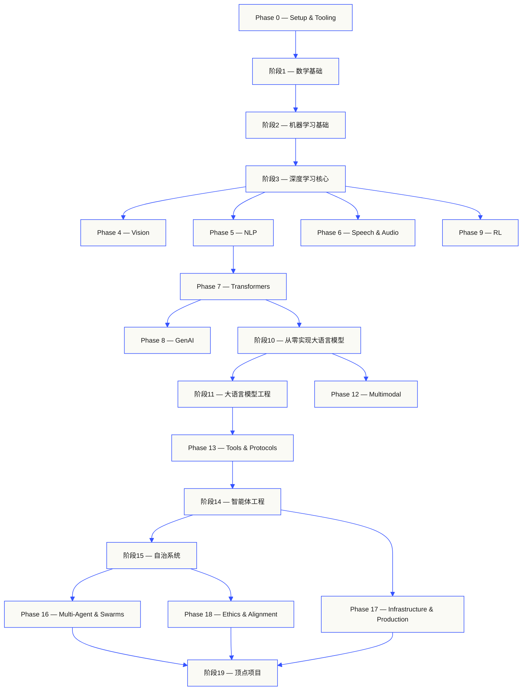
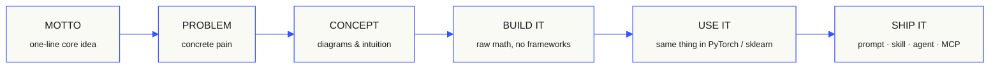

<p align="center">
  
</p>

---

## 🇨🇳 中文翻译导航（已完成93门课程）

> **文件结构说明**：本项目采用"原英文完整保留，新增独立中文文件"的汉化策略
> - 原英文文件：`docs/en.md`（完整保留，便于对照学习）
> - 中文翻译文件：`docs/zh.md`（每门课程独立中文翻译）

### ✅ 阶段0：环境配置与工具（12门课程全部完成）
| 课程 | 中文文档链接 |
|------|-------------|
| 01 开发环境配置 (01-dev-environment) | [📄 中文文档](phases/00-setup-and-tooling/01-dev-environment/docs/zh.md) |
| 02 Git与协作 (02-git-and-collaboration) | [📄 中文文档](phases/00-setup-and-tooling/02-git-and-collaboration/docs/zh.md) |
| 03 GPU配置与云服务 (03-gpu-setup-and-cloud) | [📄 中文文档](phases/00-setup-and-tooling/03-gpu-setup-and-cloud/docs/zh.md) |
| 04 API与密钥管理 (04-apis-and-keys) | [📄 中文文档](phases/00-setup-and-tooling/04-apis-and-keys/docs/zh.md) |
| 05 Jupyter笔记本 (05-jupyter-notebooks) | [📄 中文文档](phases/00-setup-and-tooling/05-jupyter-notebooks/docs/zh.md) |
| 06 Python环境管理 (06-python-environments) | [📄 中文文档](phases/00-setup-and-tooling/06-python-environments/docs/zh.md) |
| 07 AI开发Docker (07-docker-for-ai) | [📄 中文文档](phases/00-setup-and-tooling/07-docker-for-ai/docs/zh.md) |
| 08 编辑器配置 (08-editor-setup) | [📄 中文文档](phases/00-setup-and-tooling/08-editor-setup/docs/zh.md) |
| 09 数据管理 (09-data-management) | [📄 中文文档](phases/00-setup-and-tooling/09-data-management/docs/zh.md) |
| 10 终端与Shell (10-terminal-and-shell) | [📄 中文文档](phases/00-setup-and-tooling/10-terminal-and-shell/docs/zh.md) |
| 11 AI开发Linux (11-linux-for-ai) | [📄 中文文档](phases/00-setup-and-tooling/11-linux-for-ai/docs/zh.md) |
| 12 调试与性能分析 (12-debugging-and-profiling) | [📄 中文文档](phases/00-setup-and-tooling/12-debugging-and-profiling/docs/zh.md) |

### ✅ 阶段1：数学基础（22门课程全部完成）
| 课程 | 中文文档链接 |
|------|-------------|
| 01 线性代数直觉 (01-linear-algebra-intuition) | [📄 中文文档](phases/01-math-foundations/01-linear-algebra-intuition/docs/zh.md) |
| 02 向量与矩阵运算 (02-vectors-matrices-operations) | [📄 中文文档](phases/01-math-foundations/02-vectors-matrices-operations/docs/zh.md) |
| 03 矩阵变换 (03-matrix-transformations) | [📄 中文文档](phases/01-math-foundations/03-matrix-transformations/docs/zh.md) |
| 04 机器学习微积分 (04-calculus-for-ml) | [📄 中文文档](phases/01-math-foundations/04-calculus-for-ml/docs/zh.md) |
| 05 链式法则与自动微分 (05-chain-rule-and-autodiff) | [📄 中文文档](phases/01-math-foundations/05-chain-rule-and-autodiff/docs/zh.md) |
| 06 概率与分布 (06-probability-and-distributions) | [📄 中文文档](phases/01-math-foundations/06-probability-and-distributions/docs/zh.md) |
| 07 贝叶斯定理 (07-bayes-theorem) | [📄 中文文档](phases/01-math-foundations/07-bayes-theorem/docs/zh.md) |
| 08 优化算法 (08-optimization) | [📄 中文文档](phases/01-math-foundations/08-optimization/docs/zh.md) |
| 09 信息论 (09-information-theory) | [📄 中文文档](phases/01-math-foundations/09-information-theory/docs/zh.md) |
| 10 降维算法 (10-dimensionality-reduction) | [📄 中文文档](phases/01-math-foundations/10-dimensionality-reduction/docs/zh.md) |
| 11 奇异值分解 (11-singular-value-decomposition) | [📄 中文文档](phases/01-math-foundations/11-singular-value-decomposition/docs/zh.md) |
| 12 张量运算 (12-tensor-operations) | [📄 中文文档](phases/01-math-foundations/12-tensor-operations/docs/zh.md) |
| 13 数值稳定性 (13-numerical-stability) | [📄 中文文档](phases/01-math-foundations/13-numerical-stability/docs/zh.md) |
| 14 范数与距离 (14-norms-and-distances) | [📄 中文文档](phases/01-math-foundations/14-norms-and-distances/docs/zh.md) |
| 15 机器学习统计学 (15-statistics-for-ml) | [📄 中文文档](phases/01-math-foundations/15-statistics-for-ml/docs/zh.md) |
| 16 采样方法 (16-sampling-methods) | [📄 中文文档](phases/01-math-foundations/16-sampling-methods/docs/zh.md) |
| 17 线性方程组 (17-linear-systems) | [📄 中文文档](phases/01-math-foundations/17-linear-systems/docs/zh.md) |
| 18 凸优化 (18-convex-optimization) | [📄 中文文档](phases/01-math-foundations/18-convex-optimization/docs/zh.md) |
| 19 复数 (19-complex-numbers) | [📄 中文文档](phases/01-math-foundations/19-complex-numbers/docs/zh.md) |
| 20 傅里叶变换 (20-fourier-transform) | [📄 中文文档](phases/01-math-foundations/20-fourier-transform/docs/zh.md) |
| 21 图论 (21-graph-theory) | [📄 中文文档](phases/01-math-foundations/21-graph-theory/docs/zh.md) |
| 22 随机过程 (22-stochastic-processes) | [📄 中文文档](phases/01-math-foundations/22-stochastic-processes/docs/zh.md) |

### ✅ 阶段2：机器学习基础（18门课程全部完成）
| 课程 | 中文文档链接 |
|------|-------------|
| 01 什么是机器学习 (01-what-is-machine-learning) | [📄 中文文档](phases/02-ml-fundamentals/01-what-is-machine-learning/docs/zh.md) |
| 02 线性回归 (02-linear-regression) | [📄 中文文档](phases/02-ml-fundamentals/02-linear-regression/docs/zh.md) |
| 03 逻辑回归 (03-logistic-regression) | [📄 中文文档](phases/02-ml-fundamentals/03-logistic-regression/docs/zh.md) |
| 04 决策树 (04-decision-trees) | [📄 中文文档](phases/02-ml-fundamentals/04-decision-trees/docs/zh.md) |
| 05 支持向量机 (05-support-vector-machines) | [📄 中文文档](phases/02-ml-fundamentals/05-support-vector-machines/docs/zh.md) |
| 06 K近邻与距离度量 (06-knn-and-distances) | [📄 中文文档](phases/02-ml-fundamentals/06-knn-and-distances/docs/zh.md) |
| 07 无监督学习 (07-unsupervised-learning) | [📄 中文文档](phases/02-ml-fundamentals/07-unsupervised-learning/docs/zh.md) |
| 08 特征工程 (08-feature-engineering) | [📄 中文文档](phases/02-ml-fundamentals/08-feature-engineering/docs/zh.md) |
| 09 模型评估 (09-model-evaluation) | [📄 中文文档](phases/02-ml-fundamentals/09-model-evaluation/docs/zh.md) |
| 10 偏差与方差 (10-bias-variance) | [📄 中文文档](phases/02-ml-fundamentals/10-bias-variance/docs/zh.md) |
| 11 集成学习方法 (11-ensemble-methods) | [📄 中文文档](phases/02-ml-fundamentals/11-ensemble-methods/docs/zh.md) |
| 12 超参数调优 (12-hyperparameter-tuning) | [📄 中文文档](phases/02-ml-fundamentals/12-hyperparameter-tuning/docs/zh.md) |
| 13 ML流水线与实验追踪 (13-ml-pipelines) | [📄 中文文档](phases/02-ml-fundamentals/13-ml-pipelines/docs/zh.md) |
| 14 朴素贝叶斯 (14-naive-bayes) | [📄 中文文档](phases/02-ml-fundamentals/14-naive-bayes/docs/zh.md) |
| 15 时间序列基础 (15-time-series) | [📄 中文文档](phases/02-ml-fundamentals/15-time-series/docs/zh.md) |
| 16 异常检测 (16-anomaly-detection) | [📄 中文文档](phases/02-ml-fundamentals/16-anomaly-detection/docs/zh.md) |
| 17 不平衡数据处理 (17-imbalanced-data) | [📄 中文文档](phases/02-ml-fundamentals/17-imbalanced-data/docs/zh.md) |
| 18 特征选择 (18-feature-selection) | [📄 中文文档](phases/02-ml-fundamentals/18-feature-selection/docs/zh.md) |

### ✅ 阶段3：深度学习核心（13门课程全部完成）
| 课程 | 中文文档链接 |
|------|-------------|
| 01 感知机 (01-the-perceptron) | [📄 中文文档](phases/03-deep-learning-core/01-the-perceptron/docs/zh.md) |
| 02 多层神经网络 (02-multi-layer-networks) | [📄 中文文档](phases/03-deep-learning-core/02-multi-layer-networks/docs/zh.md) |
| 03 反向传播 (03-backpropagation) | [📄 中文文档](phases/03-deep-learning-core/03-backpropagation/docs/zh.md) |
| 04 激活函数 (04-activation-functions) | [📄 中文文档](phases/03-deep-learning-core/04-activation-functions/docs/zh.md) |
| 05 损失函数 (05-loss-functions) | [📄 中文文档](phases/03-deep-learning-core/05-loss-functions/docs/zh.md) |
| 06 优化器 (06-optimizers) | [📄 中文文档](phases/03-deep-learning-core/06-optimizers/docs/zh.md) |
| 07 深度学习正则化 (07-regularization) | [📄 中文文档](phases/03-deep-learning-core/07-regularization/docs/zh.md) |
| 08 权重初始化 (08-weight-initialization) | [📄 中文文档](phases/03-deep-learning-core/08-weight-initialization/docs/zh.md) |
| 09 学习率调度 (09-learning-rate-schedules) | [📄 中文文档](phases/03-deep-learning-core/09-learning-rate-schedules/docs/zh.md) |
| 10 构建迷你框架 (10-mini-framework) | [📄 中文文档](phases/03-deep-learning-core/10-mini-framework/docs/zh.md) |
| 11 PyTorch入门 (11-intro-to-pytorch) | [📄 中文文档](phases/03-deep-learning-core/11-intro-to-pytorch/docs/zh.md) |
| 12 JAX入门 (12-intro-to-jax) | [📄 中文文档](phases/03-deep-learning-core/12-intro-to-jax/docs/zh.md) |
| 13 神经网络调试 (13-debugging-neural-networks) | [📄 中文文档](phases/03-deep-learning-core/13-debugging-neural-networks/docs/zh.md) |

### ✅ 阶段4：计算机视觉（28门课程全部完成）
| 课程 | 中文文档链接 |
|------|-------------|
| 01 图像基础 (01-image-fundamentals) | [📄 中文文档](phases/04-computer-vision/01-image-fundamentals/docs/zh.md) |
| 02 从零实现卷积 (02-convolutions-from-scratch) | [📄 中文文档](phases/04-computer-vision/02-convolutions-from-scratch/docs/zh.md) |
| 03 CNN从LeNet到ResNet (03-cnns-lenet-to-resnet) | [📄 中文文档](phases/04-computer-vision/03-cnns-lenet-to-resnet/docs/zh.md) |
| 04 图像分类 (04-image-classification) | [📄 中文文档](phases/04-computer-vision/04-image-classification/docs/zh.md) |
| 05 迁移学习 (05-transfer-learning) | [📄 中文文档](phases/04-computer-vision/05-transfer-learning/docs/zh.md) |
| 06 目标检测YOLO (06-object-detection-yolo) | [📄 中文文档](phases/04-computer-vision/06-object-detection-yolo/docs/zh.md) |
| 07 语义分割U-Net (07-semantic-segmentation-unet) | [📄 中文文档](phases/04-computer-vision/07-semantic-segmentation-unet/docs/zh.md) |
| 08 实例分割Mask R-CNN (08-instance-segmentation-mask-rcnn) | [📄 中文文档](phases/04-computer-vision/08-instance-segmentation-mask-rcnn/docs/zh.md) |
| 09 图像生成GAN (09-image-generation-gans) | [📄 中文文档](phases/04-computer-vision/09-image-generation-gans/docs/zh.md) |
| 10 图像生成扩散模型 (10-image-generation-diffusion) | [📄 中文文档](phases/04-computer-vision/10-image-generation-diffusion/docs/zh.md) |
| 11 Stable Diffusion (11-stable-diffusion) | [📄 中文文档](phases/04-computer-vision/11-stable-diffusion/docs/zh.md) |
| 12 视频理解 (12-video-understanding) | [📄 中文文档](phases/04-computer-vision/12-video-understanding/docs/zh.md) |
| 13 3D视觉NeRF (13-3d-vision-nerf) | [📄 中文文档](phases/04-computer-vision/13-3d-vision-nerf/docs/zh.md) |
| 14 视觉Transformer (14-vision-transformers) | [📄 中文文档](phases/04-computer-vision/14-vision-transformers/docs/zh.md) |
| 15 实时边缘计算 (15-real-time-edge) | [📄 中文文档](phases/04-computer-vision/15-real-time-edge/docs/zh.md) |
| 16 视觉流水线顶点项目 (16-vision-pipeline-capstone) | [📄 中文文档](phases/04-computer-vision/16-vision-pipeline-capstone/docs/zh.md) |
| 17 自监督视觉 (17-self-supervised-vision) | [📄 中文文档](phases/04-computer-vision/17-self-supervised-vision/docs/zh.md) |
| 18 开放词汇CLIP (18-open-vocab-clip) | [📄 中文文档](phases/04-computer-vision/18-open-vocab-clip/docs/zh.md) |
| 19 OCR文档理解 (19-ocr-document-understanding) | [📄 中文文档](phases/04-computer-vision/19-ocr-document-understanding/docs/zh.md) |
| 20 图像检索度量学习 (20-image-retrieval-metric) | [📄 中文文档](phases/04-computer-vision/20-image-retrieval-metric/docs/zh.md) |
| 21 关键点姿态估计 (21-keypoint-pose) | [📄 中文文档](phases/04-computer-vision/21-keypoint-pose/docs/zh.md) |
| 22 3D高斯溅射 (22-3d-gaussian-splatting) | [📄 中文文档](phases/04-computer-vision/22-3d-gaussian-splatting/docs/zh.md) |
| 23 扩散Transformer整流流 (23-diffusion-transformers-rectified-flow) | [📄 中文文档](phases/04-computer-vision/23-diffusion-transformers-rectified-flow/docs/zh.md) |
| 24 SAM3开放词汇分割 (24-sam3-open-vocab-segmentation) | [📄 中文文档](phases/04-computer-vision/24-sam3-open-vocab-segmentation/docs/zh.md) |
| 25 视觉语言模型 (25-vision-language-models) | [📄 中文文档](phases/04-computer-vision/25-vision-language-models/docs/zh.md) |
| 26 单目深度估计 (26-monocular-depth) | [📄 中文文档](phases/04-computer-vision/26-monocular-depth/docs/zh.md) |
| 27 多目标跟踪 (27-multi-object-tracking) | [📄 中文文档](phases/04-computer-vision/27-multi-object-tracking/docs/zh.md) |
| 28 世界模型视频扩散 (28-world-models-video-diffusion) | [📄 中文文档](phases/04-computer-vision/28-world-models-video-diffusion/docs/zh.md) |

### ✅ 阶段5：NLP自然语言处理（29门课程全部完成）
| 课程 | 中文文档链接 |
|------|-------------|
| 01 文本处理 (01-text-processing) | [📄 中文文档](phases/05-nlp-foundations-to-advanced/01-text-processing/docs/zh.md) |
| 02 词袋模型与TF-IDF (02-bag-of-words-tfidf) | [📄 中文文档](phases/05-nlp-foundations-to-advanced/02-bag-of-words-tfidf/docs/zh.md) |
| 03 词嵌入Word2Vec (03-word-embeddings-word2vec) | [📄 中文文档](phases/05-nlp-foundations-to-advanced/03-word-embeddings-word2vec/docs/zh.md) |
| 04 GloVe与FastText子词 (04-glove-fasttext-subword) | [📄 中文文档](phases/05-nlp-foundations-to-advanced/04-glove-fasttext-subword/docs/zh.md) |
| 05 情感分析 (05-sentiment-analysis) | [📄 中文文档](phases/05-nlp-foundations-to-advanced/05-sentiment-analysis/docs/zh.md) |
| 06 命名实体识别 (06-named-entity-recognition) | [📄 中文文档](phases/05-nlp-foundations-to-advanced/06-named-entity-recognition/docs/zh.md) |
| 07 词性标注与句法分析 (07-pos-tagging-parsing) | [📄 中文文档](phases/05-nlp-foundations-to-advanced/07-pos-tagging-parsing/docs/zh.md) |
| 08 文本CNN与RNN (08-cnns-rnns-for-text) | [📄 中文文档](phases/05-nlp-foundations-to-advanced/08-cnns-rnns-for-text/docs/zh.md) |
| 09 序列到序列 (09-sequence-to-sequence) | [📄 中文文档](phases/05-nlp-foundations-to-advanced/09-sequence-to-sequence/docs/zh.md) |
| 10 注意力机制 (10-attention-mechanism) | [📄 中文文档](phases/05-nlp-foundations-to-advanced/10-attention-mechanism/docs/zh.md) |
| 11 机器翻译 (11-machine-translation) | [📄 中文文档](phases/05-nlp-foundations-to-advanced/11-machine-translation/docs/zh.md) |
| 12 文本摘要 (12-text-summarization) | [📄 中文文档](phases/05-nlp-foundations-to-advanced/12-text-summarization/docs/zh.md) |
| 13 问答系统 (13-question-answering) | [📄 中文文档](phases/05-nlp-foundations-to-advanced/13-question-answering/docs/zh.md) |
| 14 信息检索与搜索 (14-information-retrieval-search) | [📄 中文文档](phases/05-nlp-foundations-to-advanced/14-information-retrieval-search/docs/zh.md) |
| 15 主题建模 (15-topic-modeling) | [📄 中文文档](phases/05-nlp-foundations-to-advanced/15-topic-modeling/docs/zh.md) |
| 16 Transformer前文本生成 (16-text-generation-pre-transformer) | [📄 中文文档](phases/05-nlp-foundations-to-advanced/16-text-generation-pre-transformer/docs/zh.md) |
| 17 聊天机器人从规则到神经网络 (17-chatbots-rule-to-neural) | [📄 中文文档](phases/05-nlp-foundations-to-advanced/17-chatbots-rule-to-neural/docs/zh.md) |
| 18 多语言NLP (18-multilingual-nlp) | [📄 中文文档](phases/05-nlp-foundations-to-advanced/18-multilingual-nlp/docs/zh.md) |
| 19 子词分词 (19-subword-tokenization) | [📄 中文文档](phases/05-nlp-foundations-to-advanced/19-subword-tokenization/docs/zh.md) |
| 20 结构化输出与约束解码 (20-structured-outputs-constrained-decoding) | [📄 中文文档](phases/05-nlp-foundations-to-advanced/20-structured-outputs-constrained-decoding/docs/zh.md) |
| 21 自然语言推理与文本蕴含 (21-nli-textual-entailment) | [📄 中文文档](phases/05-nlp-foundations-to-advanced/21-nli-textual-entailment/docs/zh.md) |
| 22 嵌入模型深度解析 (22-embedding-models-deep-dive) | [📄 中文文档](phases/05-nlp-foundations-to-advanced/22-embedding-models-deep-dive/docs/zh.md) |
| 23 RAG分块策略 (23-chunking-strategies-rag) | [📄 中文文档](phases/05-nlp-foundations-to-advanced/23-chunking-strategies-rag/docs/zh.md) |
| 24 共指消解 (24-coreference-resolution) | [📄 中文文档](phases/05-nlp-foundations-to-advanced/24-coreference-resolution/docs/zh.md) |
| 25 实体链接 (25-entity-linking) | [📄 中文文档](phases/05-nlp-foundations-to-advanced/25-entity-linking/docs/zh.md) |
| 26 关系抽取与知识图谱 (26-relation-extraction-kg) | [📄 中文文档](phases/05-nlp-foundations-to-advanced/26-relation-extraction-kg/docs/zh.md) |
| 27 LLM评估框架 (27-llm-evaluation-frameworks) | [📄 中文文档](phases/05-nlp-foundations-to-advanced/27-llm-evaluation-frameworks/docs/zh.md) |
| 28 长上下文评估 (28-long-context-evaluation) | [📄 中文文档](phases/05-nlp-foundations-to-advanced/28-long-context-evaluation/docs/zh.md) |
| 29 对话状态跟踪 (29-dialogue-state-tracking) | [📄 中文文档](phases/05-nlp-foundations-to-advanced/29-dialogue-state-tracking/docs/zh.md) |

### ✅ 阶段6：语音与音频（17门课程全部完成）

| 课程 | 中文文档链接 |
|------|-------------|
| 01 音频基础 (01-audio-fundamentals) | [📄 中文文档](phases/06-speech-and-audio/01-audio-fundamentals/docs/zh.md) |
| 02 语谱图与梅尔特征 (02-spectrograms-mel-features) | [📄 中文文档](phases/06-speech-and-audio/02-spectrograms-mel-features/docs/zh.md) |
| 03 音频分类 (03-audio-classification) | [📄 中文文档](phases/06-speech-and-audio/03-audio-classification/docs/zh.md) |
| 04 语音识别ASR (04-speech-recognition-asr) | [📄 中文文档](phases/06-speech-and-audio/04-speech-recognition-asr/docs/zh.md) |
| 05 Whisper架构与微调 (05-whisper-architecture-finetuning) | [📄 中文文档](phases/06-speech-and-audio/05-whisper-architecture-finetuning/docs/zh.md) |
| 06 说话人识别与验证 (06-speaker-recognition-verification) | [📄 中文文档](phases/06-speech-and-audio/06-speaker-recognition-verification/docs/zh.md) |
| 07 文本转语音TTS (07-text-to-speech) | [📄 中文文档](phases/06-speech-and-audio/07-text-to-speech/docs/zh.md) |
| 08 声音克隆与转换 (08-voice-cloning-conversion) | [📄 中文文档](phases/06-speech-and-audio/08-voice-cloning-conversion/docs/zh.md) |
| 09 音乐生成 (09-music-generation) | [📄 中文文档](phases/06-speech-and-audio/09-music-generation/docs/zh.md) |
| 10 音频语言模型 (10-audio-language-models) | [📄 中文文档](phases/06-speech-and-audio/10-audio-language-models/docs/zh.md) |
| 11 实时音频处理 (11-real-time-audio-processing) | [📄 中文文档](phases/06-speech-and-audio/11-real-time-audio-processing/docs/zh.md) |
| 12 语音助手流水线 (12-voice-assistant-pipeline) | [📄 中文文档](phases/06-speech-and-audio/12-voice-assistant-pipeline/docs/zh.md) |
| 13 神经音频编解码器 (13-neural-audio-codecs) | [📄 中文文档](phases/06-speech-and-audio/13-neural-audio-codecs/docs/zh.md) |
| 14 语音活动检测与话轮转换 (14-voice-activity-detection-turn-taking) | [📄 中文文档](phases/06-speech-and-audio/14-voice-activity-detection-turn-taking/docs/zh.md) |
| 15 流式语音转语音Moshi/Hibiki (15-streaming-speech-to-speech-moshi-hibiki) | [📄 中文文档](phases/06-speech-and-audio/15-streaming-speech-to-speech-moshi-hibiki/docs/zh.md) |
| 16 反欺骗与音频水印 (16-anti-spoofing-audio-watermarking) | [📄 中文文档](phases/06-speech-and-audio/16-anti-spoofing-audio-watermarking/docs/zh.md) |
| 17 音频评估指标 (17-audio-evaluation-metrics) | [📄 中文文档](phases/06-speech-and-audio/17-audio-evaluation-metrics/docs/zh.md) |

### ✅ 阶段7：Transformers深度解析（16门课程全部完成）

| 课程 | 中文文档链接 |
|------|-------------|
| 01 为什么需要Transformer (01-why-transformers) | [📄 中文文档](phases/07-transformers-deep-dive/01-why-transformers/docs/zh.md) |
| 02 从零实现自注意力 (02-self-attention-from-scratch) | [📄 中文文档](phases/07-transformers-deep-dive/02-self-attention-from-scratch/docs/zh.md) |
| 03 多头注意力 (03-multi-head-attention) | [📄 中文文档](phases/07-transformers-deep-dive/03-multi-head-attention/docs/zh.md) |
| 04 位置编码 (04-positional-encoding) | [📄 中文文档](phases/07-transformers-deep-dive/04-positional-encoding/docs/zh.md) |
| 05 完整Transformer (05-full-transformer) | [📄 中文文档](phases/07-transformers-deep-dive/05-full-transformer/docs/zh.md) |
| 06 BERT掩码语言建模 (06-bert-masked-language-modeling) | [📄 中文文档](phases/07-transformers-deep-dive/06-bert-masked-language-modeling/docs/zh.md) |
| 07 GPT因果语言建模 (07-gpt-causal-language-modeling) | [📄 中文文档](phases/07-transformers-deep-dive/07-gpt-causal-language-modeling/docs/zh.md) |
| 08 T5/BART编码器-解码器 (08-t5-bart-encoder-decoder) | [📄 中文文档](phases/07-transformers-deep-dive/08-t5-bart-encoder-decoder/docs/zh.md) |
| 09 视觉Transformer (09-vision-transformers) | [📄 中文文档](phases/07-transformers-deep-dive/09-vision-transformers/docs/zh.md) |
| 10 音频Transformer与Whisper (10-audio-transformers-whisper) | [📄 中文文档](phases/07-transformers-deep-dive/10-audio-transformers-whisper/docs/zh.md) |
| 11 专家混合MoE (11-mixture-of-experts) | [📄 中文文档](phases/07-transformers-deep-dive/11-mixture-of-experts/docs/zh.md) |
| 12 KV Cache与Flash Attention (12-kv-cache-flash-attention) | [📄 中文文档](phases/07-transformers-deep-dive/12-kv-cache-flash-attention/docs/zh.md) |
| 13 缩放定律 (13-scaling-laws) | [📄 中文文档](phases/07-transformers-deep-dive/13-scaling-laws/docs/zh.md) |
| 14 构建Transformer顶点项目 (14-build-a-transformer-capstone) | [📄 中文文档](phases/07-transformers-deep-dive/14-build-a-transformer-capstone/docs/zh.md) |
| 15 注意力变体 (15-attention-variants) | [📄 中文文档](phases/07-transformers-deep-dive/15-attention-variants/docs/zh.md) |
| 16 推测解码 (16-speculative-decoding) | [📄 中文文档](phases/07-transformers-deep-dive/16-speculative-decoding/docs/zh.md) |

### ✅ 阶段8：生成式AI（15门课程全部完成）

| 课程 | 中文文档链接 |
|------|-------------|
| 01 生成模型分类体系与历史 (01-generative-models-taxonomy-history) | [📄 中文文档](phases/08-generative-ai/01-generative-models-taxonomy-history/docs/zh.md) |
| 02 自编码器与VAE (02-autoencoders-vae) | [📄 中文文档](phases/08-generative-ai/02-autoencoders-vae/docs/zh.md) |
| 03 GAN生成器与判别器 (03-gans-generator-discriminator) | [📄 中文文档](phases/08-generative-ai/03-gans-generator-discriminator/docs/zh.md) |
| 04 条件GAN与Pix2Pix (04-conditional-gans-pix2pix) | [📄 中文文档](phases/08-generative-ai/04-conditional-gans-pix2pix/docs/zh.md) |
| 05 StyleGAN (05-stylegan) | [📄 中文文档](phases/08-generative-ai/05-stylegan/docs/zh.md) |
| 06 从零实现扩散模型DDPM (06-diffusion-ddpm-from-scratch) | [📄 中文文档](phases/08-generative-ai/06-diffusion-ddpm-from-scratch/docs/zh.md) |
| 07 隐空间扩散与Stable Diffusion (07-latent-diffusion-stable-diffusion) | [📄 中文文档](phases/08-generative-ai/07-latent-diffusion-stable-diffusion/docs/zh.md) |
| 08 ControlNet与LoRA条件化 (08-controlnet-lora-conditioning) | [📄 中文文档](phases/08-generative-ai/08-controlnet-lora-conditioning/docs/zh.md) |
| 09 图像修复、扩展与编辑 (09-inpainting-outpainting-editing) | [📄 中文文档](phases/08-generative-ai/09-inpainting-outpainting-editing/docs/zh.md) |
| 10 视频生成 (10-video-generation) | [📄 中文文档](phases/08-generative-ai/10-video-generation/docs/zh.md) |
| 11 音频生成 (11-audio-generation) | [📄 中文文档](phases/08-generative-ai/11-audio-generation/docs/zh.md) |
| 12 3D生成 (12-3d-generation) | [📄 中文文档](phases/08-generative-ai/12-3d-generation/docs/zh.md) |
| 13 流匹配与整流流 (13-flow-matching-rectified-flows) | [📄 中文文档](phases/08-generative-ai/13-flow-matching-rectified-flows/docs/zh.md) |
| 14 评估FID与CLIP分数 (14-evaluation-fid-clip-score) | [📄 中文文档](phases/08-generative-ai/14-evaluation-fid-clip-score/docs/zh.md) |
| 15 视觉自回归VAR (19-visual-autoregressive-var) | [📄 中文文档](phases/08-generative-ai/19-visual-autoregressive-var/docs/zh.md) |

### ✅ 阶段9：强化学习（12门课程全部完成）

| 课程 | 中文文档链接 |
|------|-------------|
| 01 MDP状态动作奖励 (01-mdps-states-actions-rewards) | [📄 中文文档](phases/09-reinforcement-learning/01-mdps-states-actions-rewards/docs/zh.md) |
| 02 动态规划 (02-dynamic-programming) | [📄 中文文档](phases/09-reinforcement-learning/02-dynamic-programming/docs/zh.md) |
| 03 蒙特卡洛方法 (03-monte-carlo-methods) | [📄 中文文档](phases/09-reinforcement-learning/03-monte-carlo-methods/docs/zh.md) |
| 04 Q-Learning与SARSA (04-q-learning-sarsa) | [📄 中文文档](phases/09-reinforcement-learning/04-q-learning-sarsa/docs/zh.md) |
| 05 DQN深度Q网络 (05-dqn) | [📄 中文文档](phases/09-reinforcement-learning/05-dqn/docs/zh.md) |
| 06 策略梯度与REINFORCE (06-policy-gradients-reinforce) | [📄 中文文档](phases/09-reinforcement-learning/06-policy-gradients-reinforce/docs/zh.md) |
| 07 Actor-Critic与A2C/A3C (07-actor-critic-a2c-a3c) | [📄 中文文档](phases/09-reinforcement-learning/07-actor-critic-a2c-a3c/docs/zh.md) |
| 08 PPO近端策略优化 (08-ppo) | [📄 中文文档](phases/09-reinforcement-learning/08-ppo/docs/zh.md) |
| 09 奖励建模与RLHF (09-reward-modeling-rlhf) | [📄 中文文档](phases/09-reinforcement-learning/09-reward-modeling-rlhf/docs/zh.md) |
| 10 多智能体强化学习 (10-multi-agent-rl) | [📄 中文文档](phases/09-reinforcement-learning/10-multi-agent-rl/docs/zh.md) |
| 11 仿真到现实迁移 (11-sim-to-real-transfer) | [📄 中文文档](phases/09-reinforcement-learning/11-sim-to-real-transfer/docs/zh.md) |
| 12 游戏强化学习 (12-rl-for-games) | [📄 中文文档](phases/09-reinforcement-learning/12-rl-for-games/docs/zh.md) |

### ✅ 阶段10：从零构建LLM（24门课程全部完成）

| 课程 | 中文文档链接 |
|------|-------------|
| 01 分词器 (01-tokenizers) | [📄 中文文档](phases/10-llms-from-scratch/01-tokenizers/docs/zh.md) |
| 02 构建分词器 (02-building-a-tokenizer) | [📄 中文文档](phases/10-llms-from-scratch/02-building-a-tokenizer/docs/zh.md) |
| 03 数据流水线 (03-data-pipelines) | [📄 中文文档](phases/10-llms-from-scratch/03-data-pipelines/docs/zh.md) |
| 04 Mini-GPT预训练 (04-pre-training-mini-gpt) | [📄 中文文档](phases/10-llms-from-scratch/04-pre-training-mini-gpt/docs/zh.md) |
| 05 缩放与分布式训练 (05-scaling-distributed) | [📄 中文文档](phases/10-llms-from-scratch/05-scaling-distributed/docs/zh.md) |
| 06 指令微调SFT (06-instruction-tuning-sft) | [📄 中文文档](phases/10-llms-from-scratch/06-instruction-tuning-sft/docs/zh.md) |
| 07 RLHF基于人类反馈的强化学习 (07-rlhf) | [📄 中文文档](phases/10-llms-from-scratch/07-rlhf/docs/zh.md) |
| 08 DPO直接偏好优化 (08-dpo) | [📄 中文文档](phases/10-llms-from-scratch/08-dpo/docs/zh.md) |
| 09 宪法AI与自我改进 (09-constitutional-ai-self-improvement) | [📄 中文文档](phases/10-llms-from-scratch/09-constitutional-ai-self-improvement/docs/zh.md) |
| 10 LLM评估 (10-evaluation) | [📄 中文文档](phases/10-llms-from-scratch/10-evaluation/docs/zh.md) |
| 11 量化 (11-quantization) | [📄 中文文档](phases/10-llms-from-scratch/11-quantization/docs/zh.md) |
| 12 推理优化 (12-inference-optimization) | [📄 中文文档](phases/10-llms-from-scratch/12-inference-optimization/docs/zh.md) |
| 13 构建完整LLM流水线 (13-building-complete-llm-pipeline) | [📄 中文文档](phases/10-llms-from-scratch/13-building-complete-llm-pipeline/docs/zh.md) |
| 14 开源模型架构解析 (14-open-models-architecture-walkthroughs) | [📄 中文文档](phases/10-llms-from-scratch/14-open-models-architecture-walkthroughs/docs/zh.md) |
| 15 推测解码EAGLE3 (15-speculative-decoding-eagle3) | [📄 中文文档](phases/10-llms-from-scratch/15-speculative-decoding-eagle3/docs/zh.md) |
| 16 差分注意力V2 (16-differential-attention-v2) | [📄 中文文档](phases/10-llms-from-scratch/16-differential-attention-v2/docs/zh.md) |
| 17 原生稀疏注意力 (17-native-sparse-attention) | [📄 中文文档](phases/10-llms-from-scratch/17-native-sparse-attention/docs/zh.md) |
| 18 多词元预测 (18-multi-token-prediction) | [📄 中文文档](phases/10-llms-from-scratch/18-multi-token-prediction/docs/zh.md) |
| 19 DualPipe并行 (19-dualpipe-parallelism) | [📄 中文文档](phases/10-llms-from-scratch/19-dualpipe-parallelism/docs/zh.md) |
| 20 DeepSeek V3架构解析 (20-deepseek-v3-walkthrough) | [📄 中文文档](phases/10-llms-from-scratch/20-deepseek-v3-walkthrough/docs/zh.md) |
| 21 Jamba混合SSM-Transformer (21-jamba-hybrid-ssm-transformer) | [📄 中文文档](phases/10-llms-from-scratch/21-jamba-hybrid-ssm-transformer/docs/zh.md) |
| 22 异步Hogwild推理 (22-async-hogwild-inference) | [📄 中文文档](phases/10-llms-from-scratch/22-async-hogwild-inference/docs/zh.md) |
| 23 推测解码 (25-speculative-decoding) | [📄 中文文档](phases/10-llms-from-scratch/25-speculative-decoding/docs/zh.md) |
| 24 梯度检查点 (34-gradient-checkpointing) | [📄 中文文档](phases/10-llms-from-scratch/34-gradient-checkpointing/docs/zh.md) |

### ✅ 阶段11：LLM工程（17门课程全部完成）

| 课程 | 中文文档链接 |
|------|-------------|
| 01 提示词工程 (01-prompt-engineering) | [📄 中文文档](phases/11-llm-engineering/01-prompt-engineering/docs/zh.md) |
| 02 少样本与思维链 (02-few-shot-cot) | [📄 中文文档](phases/11-llm-engineering/02-few-shot-cot/docs/zh.md) |
| 03 结构化输出 (03-structured-outputs) | [📄 中文文档](phases/11-llm-engineering/03-structured-outputs/docs/zh.md) |
| 04 嵌入 (04-embeddings) | [📄 中文文档](phases/11-llm-engineering/04-embeddings/docs/zh.md) |
| 05 上下文工程 (05-context-engineering) | [📄 中文文档](phases/11-llm-engineering/05-context-engineering/docs/zh.md) |
| 06 检索增强生成RAG (06-rag) | [📄 中文文档](phases/11-llm-engineering/06-rag/docs/zh.md) |
| 07 高级RAG (07-advanced-rag) | [📄 中文文档](phases/11-llm-engineering/07-advanced-rag/docs/zh.md) |
| 08 微调与LoRA (08-fine-tuning-lora) | [📄 中文文档](phases/11-llm-engineering/08-fine-tuning-lora/docs/zh.md) |
| 09 函数调用 (09-function-calling) | [📄 中文文档](phases/11-llm-engineering/09-function-calling/docs/zh.md) |
| 10 LLM评估 (10-evaluation) | [📄 中文文档](phases/11-llm-engineering/10-evaluation/docs/zh.md) |
| 11 缓存与成本优化 (11-caching-cost) | [📄 中文文档](phases/11-llm-engineering/11-caching-cost/docs/zh.md) |
| 12 护栏机制 (12-guardrails) | [📄 中文文档](phases/11-llm-engineering/12-guardrails/docs/zh.md) |
| 13 生产级应用 (13-production-app) | [📄 中文文档](phases/11-llm-engineering/13-production-app/docs/zh.md) |
| 14 模型上下文协议MCP (14-model-context-protocol) | [📄 中文文档](phases/11-llm-engineering/14-model-context-protocol/docs/zh.md) |
| 15 提示词缓存 (15-prompt-caching) | [📄 中文文档](phases/11-llm-engineering/15-prompt-caching/docs/zh.md) |
| 16 LangGraph状态机 (16-langgraph-state-machines) | [📄 中文文档](phases/11-llm-engineering/16-langgraph-state-machines/docs/zh.md) |
| 17 智能体框架权衡 (17-agent-framework-tradeoffs) | [📄 中文文档](phases/11-llm-engineering/17-agent-framework-tradeoffs/docs/zh.md) |

---

<p align="center">

<p align="center">
  <a href="LICENSE"></a>
  <a href="ROADMAP.md"></a>
  <a href="#contents"></a>
  <a href="https://github.com/rohitg00/ai-engineering-from-scratch/stargazers"></a>
  <a href="https://aiengineeringfromscratch.com"></a>
</p>

## 来自 [Agent Memory - 排名第一的持久化记忆 ⭐](https://github.com/rohitg00/agentmemory) <a href="https://github.com/rohitg00/agentmemory/stargazers"></a> 作者的又一力作，可与任何智能体或聊天助手无缝配合。

```
░░░▒▒▒░░░▒▒▒░░░▒▒▒░░░▒▒▒░░░▒▒▒░░░▒▒▒░░░▒▒▒░░░▒▒▒░░░▒▒▒░░░▒▒▒░░░▒▒▒░░░▒▒▒░░░▒▒▒░░░▒▒▒░░░▒▒▒
```

> **84% of students already use AI tools. Only 18% feel prepared to use them
> professionally.** 本课程体系正是为了填补这一鸿沟。
>
> 503节课程. 20个学习阶段. ~320 hours. 涵盖Python、TypeScript、Rust、Julia四种语言。 Every lesson ships
> a reusable artifact: a prompt, a skill, an agent, an MCP server. 完全免费、开源、MIT许可证。
>
> 你不只是学习AI——你亲手从零构建它，端到端，全流程。

<!-- STATS:START (generated from site/stats.json by build.js — do not edit by hand) -->
<p align="center"><sub><b>150,639</b> readers &nbsp;·&nbsp; <b>241,669</b> page views in the last 30 days &nbsp;·&nbsp; as of 2026-06-07</sub></p>
<!-- STATS:END -->

## 课程理念

大多数AI学习材料都是碎片化的。 A paper here, a fine-tuning post there, a
flashy agent demo somewhere else. 这些碎片很少能连贯起来。 You ship a chatbot but can't
explain its loss curve. You hook a function to an agent but can't say what attention does
inside the model that's calling it.

本课程体系就是那根贯穿始终的脊梁。 20个学习阶段, 503节课程, four languages: Python, TypeScript,
Rust, Julia. Linear algebra at one end, autonomous swarms at the other. Every algorithm
gets built from raw math first. 反向传播、分词器、注意力机制、智能体循环。 By the time
PyTorch shows up, you already know what it's doing under the hood.

Each lesson runs the same loop: read the problem, derive the math, write the code, run
the test, keep the artifact. No five-minute videos, no copy-paste deploys, no hand-holding.
Free, open source, and built to run on your own laptop.

```
░░░▒▒▒░░░▒▒▒░░░▒▒▒░░░▒▒▒░░░▒▒▒░░░▒▒▒░░░▒▒▒░░░▒▒▒░░░▒▒▒░░░▒▒▒░░░▒▒▒░░░▒▒▒░░░▒▒▒░░░▒▒▒░░░▒▒▒
```

## 课程体系架构

Twenty phases stack on top of each other. Math is the floor. Agents and production are the roof.
Skip ahead if you already know the lower layers, but don't skip and then wonder why something at
the top is breaking.



```
░░░▒▒▒░░░▒▒▒░░░▒▒▒░░░▒▒▒░░░▒▒▒░░░▒▒▒░░░▒▒▒░░░▒▒▒░░░▒▒▒░░░▒▒▒░░░▒▒▒░░░▒▒▒░░░▒▒▒░░░▒▒▒░░░▒▒▒
```

## 单节课结构

Each lesson lives in its own folder, with the same structure across the entire curriculum:

```
phases/<NN>-<phase-name>/<NN>-<lesson-name>/
├── code/      runnable implementations (涵盖Python、TypeScript、Rust、Julia四种语言。
├── docs/
│   └── en.md  lesson narrative
└── outputs/   prompts, skills, agents, or MCP servers this lesson produces
```

Every lesson follows six beats. The *Build It / Use It* split is the spine — you implement the
algorithm from scratch first, then run the same thing through the production library. You
understand what the framework is doing because you wrote the smaller version yourself.



## 开始学习

Three ways in. Pick one.

**Option A — read.** Open any completed lesson on
[aiengineeringfromscratch.com](https://aiengineeringfromscratch.com) or expand a phase under
[Contents](#contents). No setup, no cloning.

**Option B — clone and run.**

```bash
git clone https://github.com/rohitg00/ai-engineering-from-scratch.git
cd ai-engineering-from-scratch
python phases/01-math-foundations/01-linear-algebra-intuition/code/vectors.py
```

**Option C — find your level *(recommended)*.** Skip ahead intelligently. Inside Claude, Cursor, Codex, OpenClaw, Hermes, or any agent with the curriculum skills installed:

```bash
/find-your-level
```

Ten questions. Maps your knowledge to a starting phase, builds a personalized path with hour
estimates. After each phase:

```bash
/check-understanding 3        # quiz yourself on phase 3
ls phases/03-deep-learning-core/05-loss-functions/outputs/
# ├── prompt-loss-function-selector.md
# └── prompt-loss-debugger.md
```

### Prerequisites

- You can write code (any language; Python helps).
- You want to understand how AI **actually works**, not just call APIs.

### Built-in agent skills (Claude, Cursor, Codex, OpenClaw, Hermes)

| Skill | What it does |
|---|---|
| [`/find-your-level`](.claude/skills/find-your-level/SKILL.md) | Ten-question placement quiz. Maps your knowledge to a starting phase and produces a personalized path with hour estimates. |
| [`/check-understanding <phase>`](.claude/skills/check-understanding/SKILL.md) | Per-phase quiz, eight questions, with feedback and specific节课 to review. |

```
░░░▒▒▒░░░▒▒▒░░░▒▒▒░░░▒▒▒░░░▒▒▒░░░▒▒▒░░░▒▒▒░░░▒▒▒░░░▒▒▒░░░▒▒▒░░░▒▒▒░░░▒▒▒░░░▒▒▒░░░▒▒▒░░░▒▒▒
```

## 每节课都有交付物

Other curricula end with *"congratulations, you learned X."* Each lesson here ends with a
**reusable tool** you can install or paste into your daily workflow.

<table>
<tr>
<th align="left" width="25%"><br/><sub>FIG_001 · A</sub><br/><b>PROMPTS</b></th>
<th align="left" width="25%"><br/><sub>FIG_001 · B</sub><br/><b>SKILLS</b></th>
<th align="left" width="25%"><br/><sub>FIG_001 · C</sub><br/><b>AGENTS</b></th>
<th align="left" width="25%"><br/><sub>FIG_001 · D</sub><br/><b>MCP SERVERS</b></th>
</tr>
<tr>
<td valign="top">Paste into any AI assistant for expert-level help on a narrow task.</td>
<td valign="top">Drop into Claude, Cursor, Codex, OpenClaw, Hermes, or any agent that reads <code>SKILL.md</code>.</td>
<td valign="top">Deploy as autonomous workers — you wrote the loop yourself in Phase 14.</td>
<td valign="top">Plug into any MCP-compatible client. Built end-to-end in Phase 13.</td>
</tr>
</table>

> Install the lot with `python3 scripts/install_skills.py`. Real tools, not homework.
> By the end of the curriculum, you have a portfolio of 503 artifacts you actually
> understand because you built them.

### FIG_002 · A worked sample

Phase 14, lesson 1: the agent loop. ~120 lines of pure Python, no dependencies.

<table>
<tr>
<td valign="top" width="50%">

**`code/agent_loop.py`** &nbsp; <sub><i>build it</i></sub>

```python
def run(query, tools):
    history = [user(query)]
    for step in range(MAX_STEPS):
        msg = llm(history)
        if msg.tool_calls:
            for call in msg.tool_calls:
                result = tools[call.name](**call.args)
                history.append(tool_result(call.id, result))
            continue
        return msg.content
    raise StepLimitExceeded
```

</td>
<td valign="top" width="50%">

**`outputs/skill-agent-loop.md`** &nbsp; <sub><i>ship it</i></sub>

```markdown
---
name: agent-loop
description: ReAct-style loop for any tool list
phase: 14
lesson: 01
---

Implement a minimal agent loop that...
```

**`outputs/prompt-debug-agent.md`**

```markdown
You are an agent debugger. Given the trace
of an agent run, identify the step where
the agent went wrong and explain why...
```

</td>
</tr>
</table>

```
░░░▒▒▒░░░▒▒▒░░░▒▒▒░░░▒▒▒░░░▒▒▒░░░▒▒▒░░░▒▒▒░░░▒▒▒░░░▒▒▒░░░▒▒▒░░░▒▒▒░░░▒▒▒░░░▒▒▒░░░▒▒▒░░░▒▒▒
```

<a id="contents"></a>

## 课程目录

Twenty phases. Click any phase to expand its lesson list.

<a id="phase-0"></a>
### 阶段0: 环境配置与工具 `12节课`
> 为后续所有学习准备好环境。

| 序号 | 课程 | 类型 | 语言 |
|:---:|--------|:----:|------|
| 01 | [Dev Environment](phases/00-setup-and-tooling/01-dev-environment/) | 实现 | Python |
| 02 | [Git & Collaboration](phases/00-setup-and-tooling/02-git-and-collaboration/) | 学习 | — |
| 03 | [GPU Setup & Cloud](phases/00-setup-and-tooling/03-gpu-setup-and-cloud/) | 实现 | Python |
| 04 | [APIs & Keys](phases/00-setup-and-tooling/04-apis-and-keys/) | 实现 | Python |
| 05 | [Jupyter Notebooks](phases/00-setup-and-tooling/05-jupyter-notebooks/) | 实现 | Python |
| 06 | [Python Environments](phases/00-setup-and-tooling/06-python-environments/) | 实现 | Shell |
| 07 | [Docker for AI](phases/00-setup-and-tooling/07-docker-for-ai/) | 实现 | Docker |
| 08 | [Editor Setup](phases/00-setup-and-tooling/08-editor-setup/) | 实现 | — |
| 09 | [Data Management](phases/00-setup-and-tooling/09-data-management/) | 实现 | Python |
| 10 | [Terminal & Shell](phases/00-setup-and-tooling/10-terminal-and-shell/) | 学习 | — |
| 11 | [Linux for AI](phases/00-setup-and-tooling/11-linux-for-ai/) | 学习 | — |
| 12 | [Debugging & Profiling](phases/00-setup-and-tooling/12-debugging-and-profiling/) | 实现 | Python |

<details id="phase-1">
<summary><b>阶段1 — 数学基础</b> &nbsp;<code>22节课</code>&nbsp; <em>通过代码理解每个AI算法背后的直觉。</em></summary>
<br/>

| 序号 | 课程 | 类型 | 语言 |
|:---:|--------|:----:|------|
| 01 | [Linear Algebra Intuition](phases/01-math-foundations/01-linear-algebra-intuition/) | 学习 | Python, Julia |
| 02 | [Vectors, Matrices & Operations](phases/01-math-foundations/02-vectors-matrices-operations/) | 实现 | Python, Julia |
| 03 | [Matrix Transformations & Eigenvalues](phases/01-math-foundations/03-matrix-transformations/) | 实现 | Python, Julia |
| 04 | [Calculus for ML: Derivatives & Gradients](phases/01-math-foundations/04-calculus-for-ml/) | 学习 | Python |
| 05 | [Chain Rule & Automatic Differentiation](phases/01-math-foundations/05-chain-rule-and-autodiff/) | 实现 | Python |
| 06 | [Probability & Distributions](phases/01-math-foundations/06-probability-and-distributions/) | 学习 | Python |
| 07 | [Bayes' Theorem & Statistical Thinking](phases/01-math-foundations/07-bayes-theorem/) | 实现 | Python |
| 08 | [Optimization: Gradient Descent Family](phases/01-math-foundations/08-optimization/) | 实现 | Python |
| 09 | [Information Theory: Entropy, KL Divergence](phases/01-math-foundations/09-information-theory/) | 学习 | Python |
| 10 | [Dimensionality Reduction: PCA, t-SNE, UMAP](phases/01-math-foundations/10-dimensionality-reduction/) | 实现 | Python |
| 11 | [Singular Value Decomposition](phases/01-math-foundations/11-singular-value-decomposition/) | 实现 | Python, Julia |
| 12 | [Tensor Operations](phases/01-math-foundations/12-tensor-operations/) | 实现 | Python |
| 13 | [Numerical Stability](phases/01-math-foundations/13-numerical-stability/) | 实现 | Python |
| 14 | [Norms & Distances](phases/01-math-foundations/14-norms-and-distances/) | 实现 | Python |
| 15 | [Statistics for ML](phases/01-math-foundations/15-statistics-for-ml/) | 实现 | Python |
| 16 | [Sampling Methods](phases/01-math-foundations/16-sampling-methods/) | 实现 | Python |
| 17 | [Linear Systems](phases/01-math-foundations/17-linear-systems/) | 实现 | Python |
| 18 | [Convex Optimization](phases/01-math-foundations/18-convex-optimization/) | 实现 | Python |
| 19 | [Complex Numbers for AI](phases/01-math-foundations/19-complex-numbers/) | 学习 | Python |
| 20 | [The Fourier Transform](phases/01-math-foundations/20-fourier-transform/) | 实现 | Python |
| 21 | [Graph Theory for ML](phases/01-math-foundations/21-graph-theory/) | 实现 | Python |
| 22 | [Stochastic Processes](phases/01-math-foundations/22-stochastic-processes/) | 学习 | Python |

</details>

<details id="phase-2">
<summary><b>阶段2 — 机器学习基础</b> &nbsp;<code>18节课</code>&nbsp; <em>经典机器学习——仍是大多数生产AI的支柱。</em></summary>
<br/>

| 序号 | 课程 | 类型 | 语言 |
|:---:|--------|:----:|------|
| 01 | [What Is Machine Learning](phases/02-ml-fundamentals/01-what-is-machine-learning/) | 学习 | Python |
| 02 | [Linear Regression from Scratch](phases/02-ml-fundamentals/02-linear-regression/) | 实现 | Python |
| 03 | [Logistic Regression & Classification](phases/02-ml-fundamentals/03-logistic-regression/) | 实现 | Python |
| 04 | [Decision Trees & Random Forests](phases/02-ml-fundamentals/04-decision-trees/) | 实现 | Python |
| 05 | [Support Vector Machines](phases/02-ml-fundamentals/05-support-vector-machines/) | 实现 | Python |
| 06 | [KNN & Distance Metrics](phases/02-ml-fundamentals/06-knn-and-distances/) | 实现 | Python |
| 07 | [Unsupervised Learning: K-Means, DBSCAN](phases/02-ml-fundamentals/07-unsupervised-learning/) | 实现 | Python |
| 08 | [Feature Engineering & Selection](phases/02-ml-fundamentals/08-feature-engineering/) | 实现 | Python |
| 09 | [Model Evaluation: Metrics, Cross-Validation](phases/02-ml-fundamentals/09-model-evaluation/) | 实现 | Python |
| 10 | [Bias, Variance & the Learning Curve](phases/02-ml-fundamentals/10-bias-variance/) | 学习 | Python |
| 11 | [Ensemble Methods: Boosting, Bagging, Stacking](phases/02-ml-fundamentals/11-ensemble-methods/) | 实现 | Python |
| 12 | [Hyperparameter Tuning](phases/02-ml-fundamentals/12-hyperparameter-tuning/) | 实现 | Python |
| 13 | [ML Pipelines & Experiment Tracking](phases/02-ml-fundamentals/13-ml-pipelines/) | 实现 | Python |
| 14 | [Naive Bayes](phases/02-ml-fundamentals/14-naive-bayes/) | 实现 | Python |
| 15 | [Time Series Fundamentals](phases/02-ml-fundamentals/15-time-series/) | 实现 | Python |
| 16 | [Anomaly Detection](phases/02-ml-fundamentals/16-anomaly-detection/) | 实现 | Python |
| 17 | [Handling Imbalanced Data](phases/02-ml-fundamentals/17-imbalanced-data/) | 实现 | Python |
| 18 | [Feature Selection](phases/02-ml-fundamentals/18-feature-selection/) | 实现 | Python |

</details>

<details id="phase-3">
<summary><b>阶段3 — 深度学习核心</b> &nbsp;<code>13节课</code>&nbsp; <em>从第一性原理理解神经网络。在你自己构建框架前不使用任何框架。</em></summary>
<br/>

| 序号 | 课程 | 类型 | 语言 |
|:---:|--------|:----:|------|
| 01 | [The Perceptron: Where It All Started](phases/03-deep-learning-core/01-the-perceptron/) | 实现 | Python |
| 02 | [Multi-Layer Networks & Forward Pass](phases/03-deep-learning-core/02-multi-layer-networks/) | 实现 | Python |
| 03 | [Backpropagation from Scratch](phases/03-deep-learning-core/03-backpropagation/) | 实现 | Python |
| 04 | [Activation Functions: ReLU, Sigmoid, GELU & Why](phases/03-deep-learning-core/04-activation-functions/) | 实现 | Python |
| 05 | [Loss Functions: MSE, Cross-Entropy, Contrastive](phases/03-deep-learning-core/05-loss-functions/) | 实现 | Python |
| 06 | [Optimizers: SGD, Momentum, Adam, AdamW](phases/03-deep-learning-core/06-optimizers/) | 实现 | Python |
| 07 | [Regularization: Dropout, Weight Decay, BatchNorm](phases/03-deep-learning-core/07-regularization/) | 实现 | Python |
| 08 | [Weight Initialization & Training Stability](phases/03-deep-learning-core/08-weight-initialization/) | 实现 | Python |
| 09 | [Learning Rate Schedules & Warmup](phases/03-deep-learning-core/09-learning-rate-schedules/) | 实现 | Python |
| 10 | [Build Your Own Mini Framework](phases/03-deep-learning-core/10-mini-framework/) | 实现 | Python |
| 11 | [Introduction to PyTorch](phases/03-deep-learning-core/11-intro-to-pytorch/) | 实现 | Python |
| 12 | [Introduction to JAX](phases/03-deep-learning-core/12-intro-to-jax/) | 实现 | Python |
| 13 | [Debugging Neural Networks](phases/03-deep-learning-core/13-debugging-neural-networks/) | 实现 | Python |

</details>

<details id="phase-4">
<summary><b>阶段4 — 计算机视觉</b> &nbsp;<code>28节课</code>&nbsp; <em>From pixels to understanding — image, video, 3D, VLMs, and world models.</em></summary>
<br/>

| 序号 | 课程 | 类型 | 语言 |
|:---:|--------|:----:|------|
| 01 | [Image Fundamentals: Pixels, Channels, Color Spaces](phases/04-computer-vision/01-image-fundamentals/) | 学习 | Python |
| 02 | [Convolutions from Scratch](phases/04-computer-vision/02-convolutions-from-scratch/) | 实现 | Python |
| 03 | [CNNs: LeNet to ResNet](phases/04-computer-vision/03-cnns-lenet-to-resnet/) | 实现 | Python |
| 04 | [Image Classification](phases/04-computer-vision/04-image-classification/) | 实现 | Python |
| 05 | [Transfer Learning & Fine-Tuning](phases/04-computer-vision/05-transfer-learning/) | 实现 | Python |
| 06 | [Object Detection — YOLO from Scratch](phases/04-computer-vision/06-object-detection-yolo/) | 实现 | Python |
| 07 | [Semantic Segmentation — U-Net](phases/04-computer-vision/07-semantic-segmentation-unet/) | 实现 | Python |
| 08 | [Instance Segmentation — Mask R-CNN](phases/04-computer-vision/08-instance-segmentation-mask-rcnn/) | 实现 | Python |
| 09 | [Image Generation — GANs](phases/04-computer-vision/09-image-generation-gans/) | 实现 | Python |
| 10 | [Image Generation — Diffusion Models](phases/04-computer-vision/10-image-generation-diffusion/) | 实现 | Python |
| 11 | [Stable Diffusion — Architecture & Fine-Tuning](phases/04-computer-vision/11-stable-diffusion/) | 实现 | Python |
| 12 | [Video Understanding — Temporal Modeling](phases/04-computer-vision/12-video-understanding/) | 实现 | Python |
| 13 | [3D Vision: Point Clouds, NeRFs](phases/04-computer-vision/13-3d-vision-nerf/) | 实现 | Python |
| 14 | [Vision Transformers (ViT)](phases/04-computer-vision/14-vision-transformers/) | 实现 | Python |
| 15 | [Real-Time Vision: Edge Deployment](phases/04-computer-vision/15-real-time-edge/) | 实现 | Python |
| 16 | [Build a Complete Vision Pipeline](phases/04-computer-vision/16-vision-pipeline-capstone/) | 实现 | Python |
| 17 | [Self-Supervised Vision — SimCLR, DINO, MAE](phases/04-computer-vision/17-self-supervised-vision/) | 实现 | Python |
| 18 | [Open-Vocabulary Vision — CLIP](phases/04-computer-vision/18-open-vocab-clip/) | 实现 | Python |
| 19 | [OCR & Document Understanding](phases/04-computer-vision/19-ocr-document-understanding/) | 实现 | Python |
| 20 | [Image Retrieval & Metric Learning](phases/04-computer-vision/20-image-retrieval-metric/) | 实现 | Python |
| 21 | [Keypoint Detection & Pose Estimation](phases/04-computer-vision/21-keypoint-pose/) | 实现 | Python |
| 22 | [3D Gaussian Splatting from Scratch](phases/04-computer-vision/22-3d-gaussian-splatting/) | 实现 | Python |
| 23 | [Diffusion Transformers & Rectified Flow](phases/04-computer-vision/23-diffusion-transformers-rectified-flow/) | 实现 | Python |
| 24 | [SAM 3 & Open-Vocabulary Segmentation](phases/04-computer-vision/24-sam3-open-vocab-segmentation/) | 实现 | Python |
| 25 | [Vision-Language Models (ViT-MLP-LLM)](phases/04-computer-vision/25-vision-language-models/) | 实现 | Python |
| 26 | [Monocular Depth & Geometry Estimation](phases/04-computer-vision/26-monocular-depth/) | 实现 | Python |
| 27 | [Multi-Object Tracking & Video Memory](phases/04-computer-vision/27-multi-object-tracking/) | 实现 | Python |
| 28 | [World Models & Video Diffusion](phases/04-computer-vision/28-world-models-video-diffusion/) | 实现 | Python |

</details>

<details id="phase-5">
<summary><b>阶段5 — 自然语言处理：从基础到进阶</b> &nbsp;<code>29节课</code>&nbsp; <em>Language is the interface to intelligence.</em></summary>
<br/>

| 序号 | 课程 | 类型 | 语言 |
|:---:|--------|:----:|------|
| 01 | [Text Processing: Tokenization, Stemming, Lemmatization](phases/05-nlp-foundations-to-advanced/01-text-processing/) | 实现 | Python |
| 02 | [Bag of Words, TF-IDF & Text Representation](phases/05-nlp-foundations-to-advanced/02-bag-of-words-tfidf/) | 实现 | Python |
| 03 | [Word Embeddings: Word2Vec from Scratch](phases/05-nlp-foundations-to-advanced/03-word-embeddings-word2vec/) | 实现 | Python |
| 04 | [GloVe, FastText & Subword Embeddings](phases/05-nlp-foundations-to-advanced/04-glove-fasttext-subword/) | 实现 | Python |
| 05 | [Sentiment Analysis](phases/05-nlp-foundations-to-advanced/05-sentiment-analysis/) | 实现 | Python |
| 06 | [Named Entity Recognition (NER)](phases/05-nlp-foundations-to-advanced/06-named-entity-recognition/) | 实现 | Python |
| 07 | [POS Tagging & Syntactic Parsing](phases/05-nlp-foundations-to-advanced/07-pos-tagging-parsing/) | 实现 | Python |
| 08 | [Text Classification — CNNs & RNNs for Text](phases/05-nlp-foundations-to-advanced/08-cnns-rnns-for-text/) | 实现 | Python |
| 09 | [Sequence-to-Sequence Models](phases/05-nlp-foundations-to-advanced/09-sequence-to-sequence/) | 实现 | Python |
| 10 | [Attention Mechanism — The Breakthrough](phases/05-nlp-foundations-to-advanced/10-attention-mechanism/) | 实现 | Python |
| 11 | [Machine Translation](phases/05-nlp-foundations-to-advanced/11-machine-translation/) | 实现 | Python |
| 12 | [Text Summarization](phases/05-nlp-foundations-to-advanced/12-text-summarization/) | 实现 | Python |
| 13 | [Question Answering Systems](phases/05-nlp-foundations-to-advanced/13-question-answering/) | 实现 | Python |
| 14 | [Information Retrieval & Search](phases/05-nlp-foundations-to-advanced/14-information-retrieval-search/) | 实现 | Python |
| 15 | [Topic Modeling: LDA, BERTopic](phases/05-nlp-foundations-to-advanced/15-topic-modeling/) | 实现 | Python |
| 16 | [Text Generation](phases/05-nlp-foundations-to-advanced/16-text-generation-pre-transformer/) | 实现 | Python |
| 17 | [Chatbots: Rule-Based to Neural](phases/05-nlp-foundations-to-advanced/17-chatbots-rule-to-neural/) | 实现 | Python |
| 18 | [Multilingual NLP](phases/05-nlp-foundations-to-advanced/18-multilingual-nlp/) | 实现 | Python |
| 19 | [Subword Tokenization: BPE, WordPiece, Unigram, SentencePiece](phases/05-nlp-foundations-to-advanced/19-subword-tokenization/) | 学习 | Python |
| 20 | [Structured Outputs & Constrained Decoding](phases/05-nlp-foundations-to-advanced/20-structured-outputs-constrained-decoding/) | 实现 | Python |
| 21 | [NLI & Textual Entailment](phases/05-nlp-foundations-to-advanced/21-nli-textual-entailment/) | 学习 | Python |
| 22 | [Embedding Models Deep Dive](phases/05-nlp-foundations-to-advanced/22-embedding-models-deep-dive/) | 学习 | Python |
| 23 | [Chunking Strategies for RAG](phases/05-nlp-foundations-to-advanced/23-chunking-strategies-rag/) | 实现 | Python |
| 24 | [Coreference Resolution](phases/05-nlp-foundations-to-advanced/24-coreference-resolution/) | 学习 | Python |
| 25 | [Entity Linking & Disambiguation](phases/05-nlp-foundations-to-advanced/25-entity-linking/) | 实现 | Python |
| 26 | [Relation Extraction & Knowledge Graph Construction](phases/05-nlp-foundations-to-advanced/26-relation-extraction-kg/) | 实现 | Python |
| 27 | [LLM Evaluation: RAGAS, DeepEval, G-Eval](phases/05-nlp-foundations-to-advanced/27-llm-evaluation-frameworks/) | 实现 | Python |
| 28 | [Long-Context Evaluation: NIAH, RULER, LongBench, MRCR](phases/05-nlp-foundations-to-advanced/28-long-context-evaluation/) | 学习 | Python |
| 29 | [Dialogue State Tracking](phases/05-nlp-foundations-to-advanced/29-dialogue-state-tracking/) | 实现 | Python |

</details>

<details id="phase-6">
<summary><b>阶段6 — 语音与音频</b> &nbsp;<code>17节课</code>&nbsp; <em>Hear, understand, speak.</em></summary>
<br/>

| 序号 | 课程 | 类型 | 语言 |
|:---:|--------|:----:|------|
| 01 | [Audio Fundamentals: Waveforms, Sampling, FFT](phases/06-speech-and-audio/01-audio-fundamentals) | 学习 | Python |
| 02 | [Spectrograms, Mel Scale & Audio Features](phases/06-speech-and-audio/02-spectrograms-mel-features) | 实现 | Python |
| 03 | [Audio Classification](phases/06-speech-and-audio/03-audio-classification) | 实现 | Python |
| 04 | [Speech Recognition (ASR)](phases/06-speech-and-audio/04-speech-recognition-asr) | 实现 | Python |
| 05 | [Whisper: Architecture & Fine-Tuning](phases/06-speech-and-audio/05-whisper-architecture-finetuning) | 实现 | Python |
| 06 | [Speaker Recognition & Verification](phases/06-speech-and-audio/06-speaker-recognition-verification) | 实现 | Python |
| 07 | [Text-to-Speech (TTS)](phases/06-speech-and-audio/07-text-to-speech) | 实现 | Python |
| 08 | [Voice Cloning & Voice Conversion](phases/06-speech-and-audio/08-voice-cloning-conversion) | 实现 | Python |
| 09 | [Music Generation](phases/06-speech-and-audio/09-music-generation) | 实现 | Python |
| 10 | [Audio-Language Models](phases/06-speech-and-audio/10-audio-language-models) | 实现 | Python |
| 11 | [Real-Time Audio Processing](phases/06-speech-and-audio/11-real-time-audio-processing) | 实现 | Python |
| 12 | [Build a Voice Assistant Pipeline](phases/06-speech-and-audio/12-voice-assistant-pipeline) | 实现 | Python |
| 13 | [Neural Audio Codecs — EnCodec, SNAC, Mimi, DAC](phases/06-speech-and-audio/13-neural-audio-codecs) | 学习 | Python |
| 14 | [Voice Activity Detection & Turn-Taking](phases/06-speech-and-audio/14-voice-activity-detection-turn-taking) | 实现 | Python |
| 15 | [Streaming Speech-to-Speech — Moshi, Hibiki](phases/06-speech-and-audio/15-streaming-speech-to-speech-moshi-hibiki) | 学习 | Python |
| 16 | [Voice Anti-Spoofing & Audio Watermarking](phases/06-speech-and-audio/16-anti-spoofing-audio-watermarking) | 实现 | Python |
| 17 | [Audio Evaluation — WER, MOS, MMAU, Leaderboards](phases/06-speech-and-audio/17-audio-evaluation-metrics) | 学习 | Python |

</details>

<details id="phase-7">
<summary><b>阶段7 — Transformer深度解析</b> &nbsp;<code>14节课</code>&nbsp; <em>The architecture that changed everything.</em></summary>
<br/>

| 序号 | 课程 | 类型 | 语言 |
|:---:|--------|:----:|------|
| 01 | [Why Transformers: The Problems with RNNs](phases/07-transformers-deep-dive/01-why-transformers/) | 学习 | Python |
| 02 | [Self-Attention from Scratch](phases/07-transformers-deep-dive/02-self-attention-from-scratch/) | 实现 | Python |
| 03 | [Multi-Head Attention](phases/07-transformers-deep-dive/03-multi-head-attention/) | 实现 | Python |
| 04 | [Positional Encoding: Sinusoidal, RoPE, ALiBi](phases/07-transformers-deep-dive/04-positional-encoding/) | 实现 | Python |
| 05 | [The Full Transformer: Encoder + Decoder](phases/07-transformers-deep-dive/05-full-transformer/) | 实现 | Python |
| 06 | [BERT — Masked Language Modeling](phases/07-transformers-deep-dive/06-bert-masked-language-modeling/) | 实现 | Python |
| 07 | [GPT — Causal Language Modeling](phases/07-transformers-deep-dive/07-gpt-causal-language-modeling/) | 实现 | Python |
| 08 | [T5, BART — Encoder-Decoder Models](phases/07-transformers-deep-dive/08-t5-bart-encoder-decoder/) | 学习 | Python |
| 09 | [Vision Transformers (ViT)](phases/07-transformers-deep-dive/09-vision-transformers/) | 实现 | Python |
| 10 | [Audio Transformers — Whisper Architecture](phases/07-transformers-deep-dive/10-audio-transformers-whisper/) | 学习 | Python |
| 11 | [Mixture of Experts (MoE)](phases/07-transformers-deep-dive/11-mixture-of-experts/) | 实现 | Python |
| 12 | [KV Cache, Flash Attention & Inference Optimization](phases/07-transformers-deep-dive/12-kv-cache-flash-attention/) | 实现 | Python |
| 13 | [Scaling Laws](phases/07-transformers-deep-dive/13-scaling-laws/) | 学习 | Python |
| 14 | [Build a Transformer from Scratch](phases/07-transformers-deep-dive/14-build-a-transformer-capstone/) | 实现 | Python |
| 15 | [Attention Variants — Sliding Window, Sparse, Differential](phases/07-transformers-deep-dive/15-attention-variants/) | 实现 | Python |
| 16 | [Speculative Decoding — Draft, Verify, Repeat](phases/07-transformers-deep-dive/16-speculative-decoding/) | 实现 | Python |

</details>

<details id="phase-8">
<summary><b>阶段8 — 生成式AI</b> &nbsp;<code>14节课</code>&nbsp; <em>Create images, video, audio, 3D, and more.</em></summary>
<br/>

| 序号 | 课程 | 类型 | 语言 |
|:---:|--------|:----:|------|
| 01 | [Generative Models: Taxonomy & History](phases/08-generative-ai/01-generative-models-taxonomy-history/) | 学习 | Python |
| 02 | [Autoencoders & VAE](phases/08-generative-ai/02-autoencoders-vae/) | 实现 | Python |
| 03 | [GANs: Generator vs Discriminator](phases/08-generative-ai/03-gans-generator-discriminator/) | 实现 | Python |
| 04 | [Conditional GANs & Pix2Pix](phases/08-generative-ai/04-conditional-gans-pix2pix/) | 实现 | Python |
| 05 | [StyleGAN](phases/08-generative-ai/05-stylegan/) | 实现 | Python |
| 06 | [Diffusion Models — DDPM from Scratch](phases/08-generative-ai/06-diffusion-ddpm-from-scratch/) | 实现 | Python |
| 07 | [Latent Diffusion & Stable Diffusion](phases/08-generative-ai/07-latent-diffusion-stable-diffusion/) | 实现 | Python |
| 08 | [ControlNet, LoRA & Conditioning](phases/08-generative-ai/08-controlnet-lora-conditioning/) | 实现 | Python |
| 09 | [Inpainting, Outpainting & Editing](phases/08-generative-ai/09-inpainting-outpainting-editing/) | 实现 | Python |
| 10 | [Video Generation](phases/08-generative-ai/10-video-generation/) | 实现 | Python |
| 11 | [Audio Generation](phases/08-generative-ai/11-audio-generation/) | 实现 | Python |
| 12 | [3D Generation](phases/08-generative-ai/12-3d-generation/) | 实现 | Python |
| 13 | [Flow Matching & Rectified Flows](phases/08-generative-ai/13-flow-matching-rectified-flows/) | 实现 | Python |
| 14 | [Evaluation: FID, CLIP Score](phases/08-generative-ai/14-evaluation-fid-clip-score/) | 实现 | Python |
| 19 | [Visual Autoregressive Modeling (VAR): Next-Scale Prediction](phases/08-generative-ai/19-visual-autoregressive-var/) | 实现 | Python |

</details>

<details id="phase-9">
<summary><b>阶段9 — 强化学习</b> &nbsp;<code>12节课</code>&nbsp; <em>The foundation of RLHF and game-playing AI.</em></summary>
<br/>

| 序号 | 课程 | 类型 | 语言 |
|:---:|--------|:----:|------|
| 01 | [MDPs, States, Actions & Rewards](phases/09-reinforcement-learning/01-mdps-states-actions-rewards/) | 学习 | Python |
| 02 | [Dynamic Programming](phases/09-reinforcement-learning/02-dynamic-programming/) | 实现 | Python |
| 03 | [Monte Carlo Methods](phases/09-reinforcement-learning/03-monte-carlo-methods/) | 实现 | Python |
| 04 | [Q-Learning, SARSA](phases/09-reinforcement-learning/04-q-learning-sarsa/) | 实现 | Python |
| 05 | [Deep Q-Networks (DQN)](phases/09-reinforcement-learning/05-dqn/) | 实现 | Python |
| 06 | [Policy Gradients — REINFORCE](phases/09-reinforcement-learning/06-policy-gradients-reinforce/) | 实现 | Python |
| 07 | [Actor-Critic — A2C, A3C](phases/09-reinforcement-learning/07-actor-critic-a2c-a3c/) | 实现 | Python |
| 08 | [PPO](phases/09-reinforcement-learning/08-ppo/) | 实现 | Python |
| 09 | [Reward Modeling & RLHF](phases/09-reinforcement-learning/09-reward-modeling-rlhf/) | 实现 | Python |
| 10 | [Multi-Agent RL](phases/09-reinforcement-learning/10-multi-agent-rl/) | 实现 | Python |
| 11 | [Sim-to-Real Transfer](phases/09-reinforcement-learning/11-sim-to-real-transfer/) | 实现 | Python |
| 12 | [RL for Games](phases/09-reinforcement-learning/12-rl-for-games/) | 实现 | Python |

</details>

<details id="phase-10">
<summary><b>阶段10 — 从零实现大语言模型</b> &nbsp;<code>22节课</code>&nbsp; <em>Build, train, and understand large language models.</em></summary>
<br/>

| 序号 | 课程 | 类型 | 语言 |
|:---:|--------|:----:|------|
| 01 | [Tokenizers: BPE, WordPiece, SentencePiece](phases/10-llms-from-scratch/01-tokenizers/) | 实现 | Python, Rust |
| 02 | [Building a Tokenizer from Scratch](phases/10-llms-from-scratch/02-building-a-tokenizer/) | 实现 | Python |
| 03 | [Data Pipelines for Pre-Training](phases/10-llms-from-scratch/03-data-pipelines/) | 实现 | Python |
| 04 | [Pre-Training a Mini GPT (124M)](phases/10-llms-from-scratch/04-pre-training-mini-gpt/) | 实现 | Python |
| 05 | [Distributed Training, FSDP, DeepSpeed](phases/10-llms-from-scratch/05-scaling-distributed/) | 实现 | Python |
| 06 | [Instruction Tuning — SFT](phases/10-llms-from-scratch/06-instruction-tuning-sft/) | 实现 | Python |
| 07 | [RLHF — Reward Model + PPO](phases/10-llms-from-scratch/07-rlhf/) | 实现 | Python |
| 08 | [DPO — Direct Preference Optimization](phases/10-llms-from-scratch/08-dpo/) | 实现 | Python |
| 09 | [Constitutional AI & Self-Improvement](phases/10-llms-from-scratch/09-constitutional-ai-self-improvement/) | 实现 | Python |
| 10 | [Evaluation — Benchmarks, Evals](phases/10-llms-from-scratch/10-evaluation/) | 实现 | Python |
| 11 | [Quantization: INT8, GPTQ, AWQ, GGUF](phases/10-llms-from-scratch/11-quantization/) | 实现 | Python |
| 12 | [Inference Optimization](phases/10-llms-from-scratch/12-inference-optimization/) | 实现 | Python |
| 13 | [Building a Complete LLM Pipeline](phases/10-llms-from-scratch/13-building-complete-llm-pipeline/) | 实现 | Python |
| 14 | [Open Models: Architecture Walkthroughs](phases/10-llms-from-scratch/14-open-models-architecture-walkthroughs/) | 学习 | Python |
| 15 | [Speculative Decoding and EAGLE-3](phases/10-llms-from-scratch/15-speculative-decoding-eagle3/) | 实现 | Python |
| 16 | [Differential Attention (V2)](phases/10-llms-from-scratch/16-differential-attention-v2/) | 实现 | Python |
| 17 | [Native Sparse Attention (DeepSeek NSA)](phases/10-llms-from-scratch/17-native-sparse-attention/) | 实现 | Python |
| 18 | [Multi-Token Prediction (MTP)](phases/10-llms-from-scratch/18-multi-token-prediction/) | 实现 | Python |
| 19 | [DualPipe Parallelism](phases/10-llms-from-scratch/19-dualpipe-parallelism/) | 学习 | Python |
| 20 | [DeepSeek-V3 Architecture Walkthrough](phases/10-llms-from-scratch/20-deepseek-v3-walkthrough/) | 学习 | Python |
| 21 | [Jamba — Hybrid SSM-Transformer](phases/10-llms-from-scratch/21-jamba-hybrid-ssm-transformer/) | 学习 | Python |
| 22 | [Async and Hogwild! Inference](phases/10-llms-from-scratch/22-async-hogwild-inference/) | 实现 | Python |
| 25 | [Speculative Decoding and EAGLE](phases/10-llms-from-scratch/25-speculative-decoding/) | 实现 | Python |
| 34 | [Gradient Checkpointing and Activation Recomputation](phases/10-llms-from-scratch/34-gradient-checkpointing/) | 实现 | Python |

</details>

<details id="phase-11">
<summary><b>阶段11 — 大语言模型工程</b> &nbsp;<code>17节课</code>&nbsp; <em>Put LLMs to work in production.</em></summary>
<br/>

| 序号 | 课程 | 类型 | 语言 |
|:---:|--------|:----:|------|
| 01 | [Prompt Engineering: Techniques & Patterns](phases/11-llm-engineering/01-prompt-engineering/) | 实现 | Python |
| 02 | [Few-Shot, CoT, Tree-of-Thought](phases/11-llm-engineering/02-few-shot-cot/) | 实现 | Python |
| 03 | [Structured Outputs](phases/11-llm-engineering/03-structured-outputs/) | 实现 | Python |
| 04 | [Embeddings & Vector Representations](phases/11-llm-engineering/04-embeddings/) | 实现 | Python |
| 05 | [Context Engineering](phases/11-llm-engineering/05-context-engineering/) | 实现 | Python |
| 06 | [RAG: Retrieval-Augmented Generation](phases/11-llm-engineering/06-rag/) | 实现 | Python |
| 07 | [Advanced RAG: Chunking, Reranking](phases/11-llm-engineering/07-advanced-rag/) | 实现 | Python |
| 08 | [Fine-Tuning with LoRA & QLoRA](phases/11-llm-engineering/08-fine-tuning-lora/) | 实现 | Python |
| 09 | [Function Calling & Tool Use](phases/11-llm-engineering/09-function-calling/) | 实现 | Python |
| 10 | [Evaluation & Testing](phases/11-llm-engineering/10-evaluation/) | 实现 | Python |
| 11 | [Caching, Rate Limiting & Cost](phases/11-llm-engineering/11-caching-cost/) | 实现 | Python |
| 12 | [Guardrails & Safety](phases/11-llm-engineering/12-guardrails/) | 实现 | Python |
| 13 | [Building a Production LLM App](phases/11-llm-engineering/13-production-app/) | 实现 | Python |
| 14 | [Model Context Protocol (MCP)](phases/11-llm-engineering/14-model-context-protocol/) | 实现 | Python |
| 15 | [Prompt Caching & Context Caching](phases/11-llm-engineering/15-prompt-caching/) | 实现 | Python |
| 16 | [LangGraph: State Machines for Agents](phases/11-llm-engineering/16-langgraph-state-machines/) | 实现 | Python |
| 17 | [Agent Framework Tradeoffs](phases/11-llm-engineering/17-agent-framework-tradeoffs/) | 学习 | Python |

</details>

<details id="phase-12">
<summary><b>阶段12 — 多模态AI</b> &nbsp;<code>25节课</code>&nbsp; <em>See, hear, read, and reason across modalities — from ViT patches to computer-use agents.</em></summary>
<br/>

| 序号 | 课程 | 类型 | 语言 |
|:---:|--------|:----:|------|
| 01 | [Vision Transformers and the Patch-Token Primitive](phases/12-multimodal-ai/01-vision-transformer-patch-tokens/) | 学习 | Python |
| 02 | [CLIP and Contrastive Vision-Language Pretraining](phases/12-multimodal-ai/02-clip-contrastive-pretraining/) | 实现 | Python |
| 03 | [BLIP-2 Q-Former as Modality Bridge](phases/12-multimodal-ai/03-blip2-qformer-bridge/) | 实现 | Python |
| 04 | [Flamingo and Gated Cross-Attention](phases/12-multimodal-ai/04-flamingo-gated-cross-attention/) | 学习 | Python |
| 05 | [LLaVA and Visual Instruction Tuning](phases/12-multimodal-ai/05-llava-visual-instruction-tuning/) | 实现 | Python |
| 06 | [Any-Resolution Vision — Patch-n'-Pack and NaFlex](phases/12-multimodal-ai/06-any-resolution-patch-n-pack/) | 实现 | Python |
| 07 | [Open-Weight VLM Recipes: What Actually Matters](phases/12-multimodal-ai/07-open-weight-vlm-recipes/) | 学习 | Python |
| 08 | [LLaVA-OneVision: Single, Multi, Video](phases/12-multimodal-ai/08-llava-onevision-single-multi-video/) | 实现 | Python |
| 09 | [Qwen-VL Family and Dynamic-FPS Video](phases/12-multimodal-ai/09-qwen-vl-family-dynamic-fps/) | 学习 | Python |
| 10 | [InternVL3 Native Multimodal Pretraining](phases/12-multimodal-ai/10-internvl3-native-multimodal/) | 学习 | Python |
| 11 | [Chameleon Early-Fusion Token-Only](phases/12-multimodal-ai/11-chameleon-early-fusion-tokens/) | 实现 | Python |
| 12 | [Emu3 Next-Token Prediction for Generation](phases/12-multimodal-ai/12-emu3-next-token-for-generation/) | 学习 | Python |
| 13 | [Transfusion Autoregressive + Diffusion](phases/12-multimodal-ai/13-transfusion-autoregressive-diffusion/) | 实现 | Python |
| 14 | [Show-o Discrete-Diffusion Unified](phases/12-multimodal-ai/14-show-o-discrete-diffusion-unified/) | 学习 | Python |
| 15 | [Janus-Pro Decoupled Encoders](phases/12-multimodal-ai/15-janus-pro-decoupled-encoders/) | 实现 | Python |
| 16 | [MIO Any-to-Any Streaming](phases/12-multimodal-ai/16-mio-any-to-any-streaming/) | 学习 | Python |
| 17 | [Video-Language Temporal Grounding](phases/12-multimodal-ai/17-video-language-temporal-grounding/) | 实现 | Python |
| 18 | [Long-Video at Million-Token Context](phases/12-multimodal-ai/18-long-video-million-token/) | 实现 | Python |
| 19 | [Audio-Language Models: Whisper to AF3](phases/12-multimodal-ai/19-audio-language-whisper-to-af3/) | 实现 | Python |
| 20 | [Omni Models: Thinker-Talker Streaming](phases/12-multimodal-ai/20-omni-models-thinker-talker/) | 实现 | Python |
| 21 | [Embodied VLAs: RT-2, OpenVLA, π0, GR00T](phases/12-multimodal-ai/21-embodied-vlas-openvla-pi0-groot/) | 学习 | Python |
| 22 | [Document and Diagram Understanding](phases/12-multimodal-ai/22-document-diagram-understanding/) | 实现 | Python |
| 23 | [ColPali Vision-Native Document RAG](phases/12-multimodal-ai/23-colpali-vision-native-rag/) | 实现 | Python |
| 24 | [Multimodal RAG and Cross-Modal Retrieval](phases/12-multimodal-ai/24-multimodal-rag-cross-modal/) | 实现 | Python |
| 25 | [Multimodal Agents and Computer-Use (Capstone)](phases/12-multimodal-ai/25-multimodal-agents-computer-use/) | 实现 | Python |

</details>

<details id="phase-13">
<summary><b>阶段13 — 工具与协议</b> &nbsp;<code>23节课</code>&nbsp; <em>The interfaces between AI and the real world.</em></summary>
<br/>

| 序号 | 课程 | 类型 | 语言 |
|:---:|--------|:----:|------|
| 01 | [The Tool Interface](phases/13-tools-and-protocols/01-the-tool-interface/) | 学习 | Python |
| 02 | [Function Calling Deep Dive](phases/13-tools-and-protocols/02-function-calling-deep-dive/) | 实现 | Python |
| 03 | [Parallel and Streaming Tool Calls](phases/13-tools-and-protocols/03-parallel-and-streaming-tool-calls/) | 实现 | Python |
| 04 | [Structured Output](phases/13-tools-and-protocols/04-structured-output/) | 实现 | Python |
| 05 | [Tool Schema Design](phases/13-tools-and-protocols/05-tool-schema-design/) | 学习 | Python |
| 06 | [MCP Fundamentals](phases/13-tools-and-protocols/06-mcp-fundamentals/) | 学习 | Python |
| 07 | [Building an MCP Server](phases/13-tools-and-protocols/07-building-an-mcp-server/) | 实现 | Python |
| 08 | [Building an MCP Client](phases/13-tools-and-protocols/08-building-an-mcp-client/) | 实现 | Python |
| 09 | [MCP Transports](phases/13-tools-and-protocols/09-mcp-transports/) | 学习 | Python |
| 10 | [MCP Resources and Prompts](phases/13-tools-and-protocols/10-mcp-resources-and-prompts/) | 实现 | Python |
| 11 | [MCP Sampling](phases/13-tools-and-protocols/11-mcp-sampling/) | 实现 | Python |
| 12 | [MCP Roots and Elicitation](phases/13-tools-and-protocols/12-mcp-roots-and-elicitation/) | 实现 | Python |
| 13 | [MCP Async Tasks](phases/13-tools-and-protocols/13-mcp-async-tasks/) | 实现 | Python |
| 14 | [MCP Apps](phases/13-tools-and-protocols/14-mcp-apps/) | 实现 | Python |
| 15 | [MCP Security I — Tool Poisoning](phases/13-tools-and-protocols/15-mcp-security-tool-poisoning/) | 学习 | Python |
| 16 | [MCP Security II — OAuth 2.1](phases/13-tools-and-protocols/16-mcp-security-oauth-2-1/) | 实现 | Python |
| 17 | [MCP Gateways and Registries](phases/13-tools-and-protocols/17-mcp-gateways-and-registries/) | 学习 | Python |
| 18 | [MCP Auth in Production — Enrollment, JWKS Refresh, Audience Pinning](phases/13-tools-and-protocols/18-mcp-auth-production/) | 实现 | Python |
| 19 | [A2A Protocol](phases/13-tools-and-protocols/19-a2a-protocol/) | 实现 | Python |
| 20 | [OpenTelemetry GenAI](phases/13-tools-and-protocols/20-opentelemetry-genai/) | 实现 | Python |
| 21 | [LLM Routing Layer](phases/13-tools-and-protocols/21-llm-routing-layer/) | 学习 | Python |
| 22 | [Skills and Agent SDKs](phases/13-tools-and-protocols/22-skills-and-agent-sdks/) | 学习 | Python |
| 23 | [Capstone — Tool Ecosystem](phases/13-tools-and-protocols/23-capstone-tool-ecosystem/) | 实现 | Python |

</details>

<details id="phase-14">
<summary><b>阶段14 — 智能体工程</b> &nbsp;<code>42节课</code>&nbsp; <em>Build agents from first principles — loop, memory, planning, frameworks, benchmarks, production, workbench.</em></summary>
<br/>

| 序号 | 课程 | 类型 | 语言 |
|:---:|--------|:----:|------|
| 01 | [The Agent Loop](phases/14-agent-engineering/01-the-agent-loop/) | 实现 | Python |
| 02 | [ReWOO and Plan-and-Execute](phases/14-agent-engineering/02-rewoo-plan-and-execute/) | 实现 | Python |
| 03 | [Reflexion and Verbal Reinforcement Learning](phases/14-agent-engineering/03-reflexion-verbal-rl/) | 实现 | Python |
| 04 | [Tree of Thoughts and LATS](phases/14-agent-engineering/04-tree-of-thoughts-lats/) | 实现 | Python |
| 05 | [Self-Refine and CRITIC](phases/14-agent-engineering/05-self-refine-and-critic/) | 实现 | Python |
| 06 | [Tool Use and Function Calling](phases/14-agent-engineering/06-tool-use-and-function-calling/) | 实现 | Python |
| 07 | [Memory — Virtual Context and MemGPT](phases/14-agent-engineering/07-memory-virtual-context-memgpt/) | 实现 | Python |
| 08 | [Memory Blocks and Sleep-Time Compute](phases/14-agent-engineering/08-memory-blocks-sleep-time-compute/) | 实现 | Python |
| 09 | [Hybrid Memory — Mem0 Vector + Graph + KV](phases/14-agent-engineering/09-hybrid-memory-mem0/) | 实现 | Python |
| 10 | [Skill Libraries and Lifelong Learning — Voyager](phases/14-agent-engineering/10-skill-libraries-voyager/) | 实现 | Python |
| 11 | [Planning with HTN and Evolutionary Search](phases/14-agent-engineering/11-planning-htn-and-evolutionary/) | 实现 | Python |
| 12 | [Anthropic's Workflow Patterns](phases/14-agent-engineering/12-anthropic-workflow-patterns/) | 实现 | Python |
| 13 | [LangGraph — Stateful Graphs and Durable Execution](phases/14-agent-engineering/13-langgraph-stateful-graphs/) | 实现 | Python |
| 14 | [AutoGen v0.4 — Actor Model](phases/14-agent-engineering/14-autogen-actor-model/) | 实现 | Python |
| 15 | [CrewAI — Role-Based Crews and Flows](phases/14-agent-engineering/15-crewai-role-based-crews/) | 实现 | Python |
| 16 | [OpenAI Agents SDK — Handoffs, Guardrails, Tracing](phases/14-agent-engineering/16-openai-agents-sdk/) | 实现 | Python |
| 17 | [Claude Agent SDK — Subagents and Session Store](phases/14-agent-engineering/17-claude-agent-sdk/) | 实现 | Python |
| 18 | [Agno and Mastra — Production Runtimes](phases/14-agent-engineering/18-agno-and-mastra-runtimes/) | 学习 | Python |
| 19 | [Benchmarks — SWE-bench, GAIA, AgentBench](phases/14-agent-engineering/19-benchmarks-swebench-gaia/) | 学习 | Python |
| 20 | [Benchmarks — WebArena and OSWorld](phases/14-agent-engineering/20-benchmarks-webarena-osworld/) | 学习 | Python |
| 21 | [Computer Use — Claude, OpenAI CUA, Gemini](phases/14-agent-engineering/21-computer-use-agents/) | 实现 | Python |
| 22 | [Voice Agents — Pipecat and LiveKit](phases/14-agent-engineering/22-voice-agents-pipecat-livekit/) | 实现 | Python |
| 23 | [OpenTelemetry GenAI Semantic Conventions](phases/14-agent-engineering/23-otel-genai-conventions/) | 实现 | Python |
| 24 | [Agent Observability — Langfuse, Phoenix, Opik](phases/14-agent-engineering/24-agent-observability-platforms/) | 学习 | Python |
| 25 | [Multi-Agent Debate and Collaboration](phases/14-agent-engineering/25-multi-agent-debate/) | 实现 | Python |
| 26 | [Failure Modes — Why Agents Break](phases/14-agent-engineering/26-failure-modes-agentic/) | 实现 | Python |
| 27 | [Prompt Injection and the PVE Defense](phases/14-agent-engineering/27-prompt-injection-defense/) | 实现 | Python |
| 28 | [Orchestration Patterns — Supervisor, Swarm, Hierarchical](phases/14-agent-engineering/28-orchestration-patterns/) | 实现 | Python |
| 29 | [Production Runtimes — Queue, Event, Cron](phases/14-agent-engineering/29-production-runtimes/) | 学习 | Python |
| 30 | [Eval-Driven Agent Development](phases/14-agent-engineering/30-eval-driven-agent-development/) | 实现 | Python |
| 31 | [Agent Workbench: Why Capable Models Still Fail](phases/14-agent-engineering/31-agent-workbench-why-models-fail/) | 学习 | Python |
| 32 | [The Minimal Agent Workbench](phases/14-agent-engineering/32-minimal-agent-workbench/) | 实现 | Python |
| 33 | [Agent Instructions as Executable Constraints](phases/14-agent-engineering/33-instructions-as-executable-constraints/) | 实现 | Python |
| 34 | [Repo Memory and Durable State](phases/14-agent-engineering/34-repo-memory-and-state/) | 实现 | Python |
| 35 | [Initialization Scripts for Agents](phases/14-agent-engineering/35-initialization-scripts/) | 实现 | Python |
| 36 | [Scope Contracts and Task Boundaries](phases/14-agent-engineering/36-scope-contracts/) | 实现 | Python |
| 37 | [Runtime Feedback Loops](phases/14-agent-engineering/37-runtime-feedback-loops/) | 实现 | Python |
| 38 | [Verification Gates](phases/14-agent-engineering/38-verification-gates/) | 实现 | Python |
| 39 | [Reviewer Agent: Separate Builder from Marker](phases/14-agent-engineering/39-reviewer-agent/) | 实现 | Python |
| 40 | [Multi-Session Handoff](phases/14-agent-engineering/40-multi-session-handoff/) | 实现 | Python |
| 41 | [The Workbench on a Real Repo](phases/14-agent-engineering/41-workbench-for-real-repos/) | 实现 | Python |
| 42 | [Capstone: Ship a Reusable Agent Workbench Pack](phases/14-agent-engineering/42-agent-workbench-capstone/) | 实现 | Python |

Each Phase 14 workbench lesson (31-42) ships a `mission.md` briefing the agent before it opens the full lesson docs.

</details>

<details id="phase-15">
<summary><b>阶段15 — 自治系统</b> &nbsp;<code>22节课</code>&nbsp; <em>Long-horizon agents, self-improvement, and the 2026 safety stack.</em></summary>
<br/>

| 序号 | 课程 | 类型 | 语言 |
|:---:|--------|:----:|------|
| 01 | [From Chatbots to Long-Horizon Agents (METR)](phases/15-autonomous-systems/01-long-horizon-agents/) | 学习 | Python |
| 02 | [STaR, V-STaR, Quiet-STaR: Self-Taught Reasoning](phases/15-autonomous-systems/02-star-family-reasoning/) | 学习 | Python |
| 03 | [AlphaEvolve: Evolutionary Coding Agents](phases/15-autonomous-systems/03-alphaevolve-evolutionary-coding/) | 学习 | Python |
| 04 | [Darwin Gödel Machine: Self-Modifying Agents](phases/15-autonomous-systems/04-darwin-godel-machine/) | 学习 | Python |
| 05 | [AI Scientist v2: Workshop-Level Research](phases/15-autonomous-systems/05-ai-scientist-v2/) | 学习 | Python |
| 06 | [Automated Alignment Research (Anthropic AAR)](phases/15-autonomous-systems/06-automated-alignment-research/) | 学习 | Python |
| 07 | [Recursive Self-Improvement: Capability vs Alignment](phases/15-autonomous-systems/07-recursive-self-improvement/) | 学习 | Python |
| 08 | [Bounded Self-Improvement Designs](phases/15-autonomous-systems/08-bounded-self-improvement/) | 学习 | Python |
| 09 | [Autonomous Coding Agent Landscape (SWE-bench, CodeAct)](phases/15-autonomous-systems/09-coding-agent-landscape/) | 学习 | Python |
| 10 | [Claude Code Permission Modes and Auto Mode](phases/15-autonomous-systems/10-claude-code-permission-modes/) | 学习 | Python |
| 11 | [Browser Agents and Indirect Prompt Injection](phases/15-autonomous-systems/11-browser-agents/) | 学习 | Python |
| 12 | [Durable Execution for Long-Running Agents](phases/15-autonomous-systems/12-durable-execution/) | 学习 | Python |
| 13 | [Action Budgets, Iteration Caps, Cost Governors](phases/15-autonomous-systems/13-cost-governors/) | 学习 | Python |
| 14 | [Kill Switches, Circuit Breakers, Canary Tokens](phases/15-autonomous-systems/14-kill-switches-canaries/) | 学习 | Python |
| 15 | [HITL: Propose-Then-Commit](phases/15-autonomous-systems/15-propose-then-commit/) | 学习 | Python |
| 16 | [Checkpoints and Rollback](phases/15-autonomous-systems/16-checkpoints-rollback/) | 学习 | Python |
| 17 | [Constitutional AI and Rule Overrides](phases/15-autonomous-systems/17-constitutional-ai/) | 学习 | Python |
| 18 | [Llama Guard and Input/Output Classification](phases/15-autonomous-systems/18-llama-guard/) | 学习 | Python |
| 19 | [Anthropic Responsible Scaling Policy v3.0](phases/15-autonomous-systems/19-anthropic-rsp/) | 学习 | Python |
| 20 | [OpenAI Preparedness Framework and DeepMind FSF](phases/15-autonomous-systems/20-openai-preparedness-deepmind-fsf/) | 学习 | Python |
| 21 | [METR Time Horizons and External Evaluation](phases/15-autonomous-systems/21-metr-external-evaluation/) | 学习 | Python |
| 22 | [CAIS, CAISI, and Societal-Scale Risk](phases/15-autonomous-systems/22-cais-caisi-societal-risk/) | 学习 | Python |

</details>

<details id="phase-16">
<summary><b>阶段16 — 多智能体与群体智能</b> &nbsp;<code>25节课</code>&nbsp; <em>Coordination, emergence, and collective intelligence.</em></summary>
<br/>

| 序号 | 课程 | 类型 | 语言 |
|:---:|--------|:----:|------|
| 01 | [Why Multi-Agent](phases/16-multi-agent-and-swarms/01-why-multi-agent/) | 学习 | TypeScript |
| 02 | [FIPA-ACL Heritage and Speech Acts](phases/16-multi-agent-and-swarms/02-fipa-acl-heritage/) | 学习 | Python |
| 03 | [Communication Protocols](phases/16-multi-agent-and-swarms/03-communication-protocols/) | 实现 | TypeScript |
| 04 | [The Multi-Agent Primitive Model](phases/16-multi-agent-and-swarms/04-primitive-model/) | 学习 | Python |
| 05 | [Supervisor / Orchestrator-Worker Pattern](phases/16-multi-agent-and-swarms/05-supervisor-orchestrator-pattern/) | 实现 | Python |
| 06 | [Hierarchical Architecture and Decomposition Drift](phases/16-multi-agent-and-swarms/06-hierarchical-architecture/) | 学习 | Python |
| 07 | [Society of Mind and Multi-Agent Debate](phases/16-multi-agent-and-swarms/07-society-of-mind-debate/) | 实现 | Python |
| 08 | [Role Specialization — Planner / Critic / Executor / Verifier](phases/16-multi-agent-and-swarms/08-role-specialization/) | 实现 | Python |
| 09 | [Parallel Swarm and Networked Architectures](phases/16-multi-agent-and-swarms/09-parallel-swarm-networks/) | 实现 | Python |
| 10 | [Group Chat and Speaker Selection](phases/16-multi-agent-and-swarms/10-group-chat-speaker-selection/) | 实现 | Python |
| 11 | [Handoffs and Routines (Stateless Orchestration)](phases/16-multi-agent-and-swarms/11-handoffs-and-routines/) | 实现 | Python |
| 12 | [A2A — The Agent-to-Agent Protocol](phases/16-multi-agent-and-swarms/12-a2a-protocol/) | 实现 | Python |
| 13 | [Shared Memory and Blackboard Patterns](phases/16-multi-agent-and-swarms/13-shared-memory-blackboard/) | 实现 | Python |
| 14 | [Consensus and Byzantine Fault Tolerance](phases/16-multi-agent-and-swarms/14-consensus-and-bft/) | 实现 | Python |
| 15 | [Voting, Self-Consistency, and Debate Topology](phases/16-multi-agent-and-swarms/15-voting-debate-topology/) | 实现 | Python |
| 16 | [Negotiation and Bargaining](phases/16-multi-agent-and-swarms/16-negotiation-bargaining/) | 实现 | Python |
| 17 | [Generative Agents and Emergent Simulation](phases/16-multi-agent-and-swarms/17-generative-agents-simulation/) | 实现 | Python |
| 18 | [Theory of Mind and Emergent Coordination](phases/16-multi-agent-and-swarms/18-theory-of-mind-coordination/) | 实现 | Python |
| 19 | [Swarm Optimization (PSO, ACO)](phases/16-multi-agent-and-swarms/19-swarm-optimization-pso-aco/) | 实现 | Python |
| 20 | [MARL — MADDPG, QMIX, MAPPO](phases/16-multi-agent-and-swarms/20-marl-maddpg-qmix-mappo/) | 学习 | Python |
| 21 | [Agent Economies, Token Incentives, Reputation](phases/16-multi-agent-and-swarms/21-agent-economies/) | 学习 | Python |
| 22 | [Production Scaling — Queues, Checkpoints, Durability](phases/16-multi-agent-and-swarms/22-production-scaling-queues-checkpoints/) | 实现 | Python |
| 23 | [Failure Modes — MAST, Groupthink, Monoculture](phases/16-multi-agent-and-swarms/23-failure-modes-mast-groupthink/) | 学习 | Python |
| 24 | [Evaluation and Coordination Benchmarks](phases/16-multi-agent-and-swarms/24-evaluation-coordination-benchmarks/) | 学习 | Python |
| 25 | [Case Studies and 2026 State of the Art](phases/16-multi-agent-and-swarms/25-case-studies-2026-sota/) | 学习 | Python |

</details>

<details id="phase-17">
<summary><b>阶段17 — 基础设施与生产环境</b> &nbsp;<code>28节课</code>&nbsp; <em>Ship AI to the real world.</em></summary>
<br/>

| 序号 | 课程 | 类型 | 语言 |
|:---:|--------|:----:|------|
| 01 | [Managed LLM Platforms — Bedrock, Azure OpenAI, Vertex AI](phases/17-infrastructure-and-production/01-managed-llm-platforms/) | 学习 | Python |
| 02 | [Inference Platform Economics — Fireworks, Together, Baseten, Modal](phases/17-infrastructure-and-production/02-inference-platform-economics/) | 学习 | Python |
| 03 | [GPU Autoscaling on Kubernetes — Karpenter, KAI Scheduler](phases/17-infrastructure-and-production/03-gpu-autoscaling-kubernetes/) | 学习 | Python |
| 04 | [vLLM Serving Internals — PagedAttention, Continuous Batching, Chunked Prefill](phases/17-infrastructure-and-production/04-vllm-serving-internals/) | 学习 | Python |
| 05 | [EAGLE-3 Speculative Decoding in Production](phases/17-infrastructure-and-production/05-eagle3-speculative-decoding/) | 学习 | Python |
| 06 | [SGLang and RadixAttention for Prefix-Heavy Workloads](phases/17-infrastructure-and-production/06-sglang-radixattention/) | 学习 | Python |
| 07 | [TensorRT-LLM on Blackwell with FP8 and NVFP4](phases/17-infrastructure-and-production/07-tensorrt-llm-blackwell/) | 学习 | Python |
| 08 | [Inference Metrics — TTFT, TPOT, ITL, Goodput, P99](phases/17-infrastructure-and-production/08-inference-metrics-goodput/) | 学习 | Python |
| 09 | [Production Quantization — AWQ, GPTQ, GGUF, FP8, NVFP4](phases/17-infrastructure-and-production/09-production-quantization/) | 学习 | Python |
| 10 | [Cold Start Mitigation for Serverless LLMs](phases/17-infrastructure-and-production/10-cold-start-mitigation/) | 学习 | Python |
| 11 | [Multi-Region LLM Serving and KV Cache Locality](phases/17-infrastructure-and-production/11-multi-region-kv-locality/) | 学习 | Python |
| 12 | [Edge Inference — ANE, Hexagon, WebGPU, Jetson](phases/17-infrastructure-and-production/12-edge-inference/) | 学习 | Python |
| 13 | [LLM Observability Stack Selection](phases/17-infrastructure-and-production/13-llm-observability/) | 学习 | Python |
| 14 | [Prompt Caching and Semantic Caching Economics](phases/17-infrastructure-and-production/14-prompt-semantic-caching/) | 学习 | Python |
| 15 | [Batch APIs — the 50% Discount as Industry Standard](phases/17-infrastructure-and-production/15-batch-apis/) | 学习 | Python |
| 16 | [Model Routing as a Cost-Reduction Primitive](phases/17-infrastructure-and-production/16-model-routing/) | 学习 | Python |
| 17 | [Disaggregated Prefill/Decode — NVIDIA Dynamo and llm-d](phases/17-infrastructure-and-production/17-disaggregated-prefill-decode/) | 学习 | Python |
| 18 | [vLLM Production Stack with LMCache KV Offloading](phases/17-infrastructure-and-production/18-vllm-production-stack-lmcache/) | 学习 | Python |
| 19 | [AI Gateways — LiteLLM, Portkey, Kong, Bifrost](phases/17-infrastructure-and-production/19-ai-gateways/) | 学习 | Python |
| 20 | [Shadow, Canary, and Progressive Deployment](phases/17-infrastructure-and-production/20-shadow-canary-progressive/) | 学习 | Python |
| 21 | [A/B Testing LLM Features — GrowthBook and Statsig](phases/17-infrastructure-and-production/21-ab-testing-llm-features/) | 学习 | Python |
| 22 | [Load Testing LLM APIs — k6, LLMPerf, GenAI-Perf](phases/17-infrastructure-and-production/22-load-testing-llm-apis/) | 实现 | Python |
| 23 | [SRE for AI — Multi-Agent Incident Response](phases/17-infrastructure-and-production/23-sre-for-ai/) | 学习 | Python |
| 24 | [Chaos Engineering for LLM Production](phases/17-infrastructure-and-production/24-chaos-engineering-llm/) | 学习 | Python |
| 25 | [Security — Secrets, PII Scrubbing, Audit Logs](phases/17-infrastructure-and-production/25-security-secrets-audit/) | 学习 | Python |
| 26 | [Compliance — SOC 2, HIPAA, GDPR, EU AI Act, ISO 42001](phases/17-infrastructure-and-production/26-compliance-frameworks/) | 学习 | Python |
| 27 | [FinOps for LLMs — Unit Economics and Multi-Tenant Attribution](phases/17-infrastructure-and-production/27-finops-llms/) | 学习 | Python |
| 28 | [Self-Hosted Serving Selection — llama.cpp, Ollama, TGI, vLLM, SGLang](phases/17-infrastructure-and-production/28-self-hosted-serving-selection/) | 学习 | Python |

</details>

<details id="phase-18">
<summary><b>阶段18 — 伦理、安全与对齐</b> &nbsp;<code>30节课</code>&nbsp; <em>Build AI that helps humanity. Not optional.</em></summary>
<br/>

| 序号 | 课程 | 类型 | 语言 |
|:---:|--------|:----:|------|
| 01 | [Instruction-Following as Alignment Signal](phases/18-ethics-safety-alignment/01-instruction-following-alignment-signal/) | 学习 | Python |
| 02 | [Reward Hacking & Goodhart's Law](phases/18-ethics-safety-alignment/02-reward-hacking-goodhart/) | 学习 | Python |
| 03 | [Direct Preference Optimization Family](phases/18-ethics-safety-alignment/03-direct-preference-optimization-family/) | 学习 | Python |
| 04 | [Sycophancy as RLHF Amplification](phases/18-ethics-safety-alignment/04-sycophancy-rlhf-amplification/) | 学习 | Python |
| 05 | [Constitutional AI & RLAIF](phases/18-ethics-safety-alignment/05-constitutional-ai-rlaif/) | 学习 | Python |
| 06 | [Mesa-Optimization & Deceptive Alignment](phases/18-ethics-safety-alignment/06-mesa-optimization-deceptive-alignment/) | 学习 | Python |
| 07 | [Sleeper Agents — Persistent Deception](phases/18-ethics-safety-alignment/07-sleeper-agents-persistent-deception/) | 学习 | Python |
| 08 | [In-Context Scheming in Frontier Models](phases/18-ethics-safety-alignment/08-in-context-scheming-frontier-models/) | 学习 | Python |
| 09 | [Alignment Faking](phases/18-ethics-safety-alignment/09-alignment-faking/) | 学习 | Python |
| 10 | [AI Control — Safety Despite Subversion](phases/18-ethics-safety-alignment/10-ai-control-subversion/) | 学习 | Python |
| 11 | [Scalable Oversight & Weak-to-Strong](phases/18-ethics-safety-alignment/11-scalable-oversight-weak-to-strong/) | 学习 | Python |
| 12 | [Red-Teaming: PAIR & Automated Attacks](phases/18-ethics-safety-alignment/12-red-teaming-pair-automated-attacks/) | 实现 | Python |
| 13 | [Many-Shot Jailbreaking](phases/18-ethics-safety-alignment/13-many-shot-jailbreaking/) | 学习 | Python |
| 14 | [ASCII Art & Visual Jailbreaks](phases/18-ethics-safety-alignment/14-ascii-art-visual-jailbreaks/) | 实现 | Python |
| 15 | [Indirect Prompt Injection](phases/18-ethics-safety-alignment/15-indirect-prompt-injection/) | 实现 | Python |
| 16 | [Red-Team Tooling: Garak, Llama Guard, PyRIT](phases/18-ethics-safety-alignment/16-red-team-tooling-garak-llamaguard-pyrit/) | 实现 | Python |
| 17 | [WMDP & Dual-Use Capability Evaluation](phases/18-ethics-safety-alignment/17-wmdp-dual-use-evaluation/) | 学习 | Python |
| 18 | [Frontier Safety Frameworks — RSP, PF, FSF](phases/18-ethics-safety-alignment/18-frontier-safety-frameworks-rsp-pf-fsf/) | 学习 | Python |
| 19 | [Model Welfare Research](phases/18-ethics-safety-alignment/19-model-welfare-research/) | 学习 | Python |
| 20 | [Bias & Representational Harm](phases/18-ethics-safety-alignment/20-bias-representational-harm/) | 实现 | Python |
| 21 | [Fairness Criteria: Group, Individual, Counterfactual](phases/18-ethics-safety-alignment/21-fairness-criteria-group-individual-counterfactual/) | 学习 | Python |
| 22 | [Differential Privacy for LLMs](phases/18-ethics-safety-alignment/22-differential-privacy-for-llms/) | 实现 | Python |
| 23 | [Watermarking: SynthID, Stable Signature, C2PA](phases/18-ethics-safety-alignment/23-watermarking-synthid-stable-signature-c2pa/) | 实现 | Python |
| 24 | [Regulatory Frameworks: EU, US, UK, Korea](phases/18-ethics-safety-alignment/24-regulatory-frameworks-eu-us-uk-korea/) | 学习 | Python |
| 25 | [EchoLeak & CVEs for AI](phases/18-ethics-safety-alignment/25-echoleak-cves-for-ai/) | 学习 | Python |
| 26 | [Model, System & Dataset Cards](phases/18-ethics-safety-alignment/26-model-system-dataset-cards/) | 实现 | Python |
| 27 | [Data Provenance & Training-Data Governance](phases/18-ethics-safety-alignment/27-data-provenance-training-governance/) | 学习 | Python |
| 28 | [Alignment Research Ecosystem: MATS, Redwood, Apollo, METR](phases/18-ethics-safety-alignment/28-alignment-research-ecosystem/) | 学习 | Python |
| 29 | [Moderation Systems: OpenAI, Perspective, Llama Guard](phases/18-ethics-safety-alignment/29-moderation-systems-openai-perspective-llamaguard/) | 实现 | Python |
| 30 | [Dual-Use Risk: Cyber, Bio, Chem, Nuclear](phases/18-ethics-safety-alignment/30-dual-use-risk-cyber-bio-chem-nuclear/) | 学习 | Python |

</details>

<details id="phase-19">
<summary><b>阶段19 — 顶点项目</b> &nbsp;<code>85节课</code>&nbsp; <em>17 end-to-end products + 9 deep-build tracks. 20-40 hours per project; 4-12节课 per track.</em></summary>
<br/>

| 序号 | 项目 | Combines | 语言 |
|:---:|---------|----------|------|
| 01 | [Terminal-Native Coding Agent](phases/19-capstone-projects/01-terminal-native-coding-agent/) | P0 P5 P7 P10 P11 P13 P14 P15 P17 P18 | Python |
| 02 | [RAG over Codebase (Cross-Repo Semantic Search)](phases/19-capstone-projects/02-rag-over-codebase/) | P5 P7 P11 P13 P17 | Python |
| 03 | [Real-Time Voice Assistant (ASR → LLM → TTS)](phases/19-capstone-projects/03-realtime-voice-assistant/) | P6 P7 P11 P13 P14 P17 | Python |
| 04 | [Multimodal Document QA (Vision-First)](phases/19-capstone-projects/04-multimodal-document-qa/) | P4 P5 P7 P11 P12 P17 | Python |
| 05 | [Autonomous Research Agent (AI-Scientist Class)](phases/19-capstone-projects/05-autonomous-research-agent/) | P0 P2 P3 P7 P10 P14 P15 P16 P18 | Python |
| 06 | [DevOps Troubleshooting Agent for Kubernetes](phases/19-capstone-projects/06-devops-troubleshooting-agent/) | P11 P13 P14 P15 P17 P18 | Python |
| 07 | [End-to-End Fine-Tuning Pipeline](phases/19-capstone-projects/07-end-to-end-fine-tuning-pipeline/) | P2 P3 P7 P10 P11 P17 P18 | Python |
| 08 | [Production RAG Chatbot (Regulated Vertical)](phases/19-capstone-projects/08-production-rag-chatbot/) | P5 P7 P11 P12 P17 P18 | Python |
| 09 | [Code Migration Agent (Repo-Level Upgrade)](phases/19-capstone-projects/09-code-migration-agent/) | P5 P7 P11 P13 P14 P15 P17 | Python |
| 10 | [Multi-Agent Software Engineering Team](phases/19-capstone-projects/10-multi-agent-software-team/) | P11 P13 P14 P15 P16 P17 | Python |
| 11 | [LLM Observability & Eval Dashboard](phases/19-capstone-projects/11-llm-observability-dashboard/) | P11 P13 P17 P18 | Python |
| 12 | [Video Understanding Pipeline (Scene → QA)](phases/19-capstone-projects/12-video-understanding-pipeline/) | P4 P6 P7 P11 P12 P17 | Python |
| 13 | [MCP Server with Registry and Governance](phases/19-capstone-projects/13-mcp-server-with-registry/) | P11 P13 P14 P17 P18 | Python |
| 14 | [Speculative-Decoding Inference Server](phases/19-capstone-projects/14-speculative-decoding-server/) | P3 P7 P10 P17 | Python |
| 15 | [Constitutional Safety Harness + Red-Team Range](phases/19-capstone-projects/15-constitutional-safety-harness/) | P10 P11 P13 P14 P18 | Python |
| 16 | [GitHub Issue-to-PR Autonomous Agent](phases/19-capstone-projects/16-github-issue-to-pr-agent/) | P11 P13 P14 P15 P17 | Python |
| 17 | [Personal AI Tutor (Adaptive, Multimodal)](phases/19-capstone-projects/17-personal-ai-tutor/) | P5 P6 P11 P12 P14 P17 P18 | Python |

**Deep-build tracks** — multi-lesson series that build a complete subsystem from scratch.

| 序号 | 项目 | Combines | 语言 |
|:---:|---------|----------|------|
| 20 | [Agent Harness Loop Contract](phases/19-capstone-projects/20-agent-harness-loop-contract/) | A. Agent harness | Python |
| 21 | [Tool Registry with Schema Validation](phases/19-capstone-projects/21-tool-registry-schema-validation/) | A. Agent harness | Python |
| 22 | [JSON-RPC 2.0 Over Newline-Delimited Stdio](phases/19-capstone-projects/22-jsonrpc-stdio-transport/) | A. Agent harness | Python |
| 23 | [Function Call Dispatcher](phases/19-capstone-projects/23-function-call-dispatcher/) | A. Agent harness | Python |
| 24 | [Plan-Execute Control Flow](phases/19-capstone-projects/24-plan-execute-control-flow/) | A. Agent harness | Python |
| 25 | [Verification Gates and Observation Budget](phases/19-capstone-projects/25-verification-gates-observation-budget/) | A. Agent harness | Python |
| 26 | [Sandbox Runner with Denylist and Path Jail](phases/19-capstone-projects/26-sandbox-runner-denylist/) | A. Agent harness | Python |
| 27 | [Eval Harness with Fixture Tasks](phases/19-capstone-projects/27-eval-harness-fixture-tasks/) | A. Agent harness | Python |
| 28 | [Observability with OTel GenAI Spans and Prometheus Metrics](phases/19-capstone-projects/28-observability-otel-traces/) | A. Agent harness | Python |
| 29 | [End-to-End Coding Agent on the Harness](phases/19-capstone-projects/29-end-to-end-coding-task-demo/) | A. Agent harness | Python |
| 30 | [BPE Tokenizer From Scratch](phases/19-capstone-projects/30-bpe-tokenizer-from-scratch/) | B. NLP LLM | Python |
| 31 | [Tokenized Dataset with Sliding Window](phases/19-capstone-projects/31-tokenized-dataset-sliding-window/) | B. NLP LLM | Python |
| 32 | [Token and Positional Embeddings](phases/19-capstone-projects/32-token-positional-embeddings/) | B. NLP LLM | Python |
| 33 | [Multi-Head Self-Attention](phases/19-capstone-projects/33-multihead-self-attention/) | B. NLP LLM | Python |
| 34 | [Transformer Block from Scratch](phases/19-capstone-projects/34-transformer-block/) | B. NLP LLM | Python |
| 35 | [GPT Model Assembly](phases/19-capstone-projects/35-gpt-model-assembly/) | B. NLP LLM | Python |
| 36 | [Training Loop and Evaluation](phases/19-capstone-projects/36-training-loop-eval/) | B. NLP LLM | Python |
| 37 | [Loading Pretrained Weights](phases/19-capstone-projects/37-loading-pretrained-weights/) | B. NLP LLM | Python |
| 38 | [Classifier Fine-Tuning by Head Swap](phases/19-capstone-projects/38-classifier-finetuning/) | B. NLP LLM | Python |
| 39 | [Instruction Tuning by Supervised Fine-Tuning](phases/19-capstone-projects/39-instruction-tuning-sft/) | B. NLP LLM | Python |
| 40 | [Direct Preference Optimization from Scratch](phases/19-capstone-projects/40-dpo-from-scratch/) | B. NLP LLM | Python |
| 41 | [Full Evaluation Pipeline](phases/19-capstone-projects/41-eval-pipeline/) | B. NLP LLM | Python |
| 42 | [Large Corpus Downloader](phases/19-capstone-projects/42-large-corpus-downloader/) | C. Train end-to-end | Python |
| 43 | [HDF5 Tokenized Corpus](phases/19-capstone-projects/43-hdf5-tokenized-corpus/) | C. Train end-to-end | Python |
| 44 | [Cosine LR with Linear Warmup](phases/19-capstone-projects/44-cosine-lr-warmup/) | C. Train end-to-end | Python |
| 45 | [Gradient Clipping and Mixed Precision](phases/19-capstone-projects/45-gradient-clipping-amp/) | C. Train end-to-end | Python |
| 46 | [Gradient Accumulation](phases/19-capstone-projects/46-gradient-accumulation/) | C. Train end-to-end | Python |
| 47 | [Checkpoint Save and Resume](phases/19-capstone-projects/47-checkpoint-save-resume/) | C. Train end-to-end | Python |
| 48 | [Distributed Data Parallel and FSDP from Scratch](phases/19-capstone-projects/48-distributed-fsdp-ddp/) | C. Train end-to-end | Python |
| 49 | [Language Model Evaluation Harness](phases/19-capstone-projects/49-lm-eval-harness/) | C. Train end-to-end | Python |
| 50 | [Hypothesis Generator](phases/19-capstone-projects/50-hypothesis-generator/) | D. Auto research | Python |
| 51 | [Literature Retrieval](phases/19-capstone-projects/51-literature-retrieval/) | D. Auto research | Python |
| 52 | [Experiment Runner](phases/19-capstone-projects/52-experiment-runner/) | D. Auto research | Python |
| 53 | [Result Evaluator](phases/19-capstone-projects/53-result-evaluator/) | D. Auto research | Python |
| 54 | [Paper Writer](phases/19-capstone-projects/54-paper-writer/) | D. Auto research | Python |
| 55 | [Critic Loop](phases/19-capstone-projects/55-critic-loop/) | D. Auto research | Python |
| 56 | [Iteration Scheduler](phases/19-capstone-projects/56-iteration-scheduler/) | D. Auto research | Python |
| 57 | [End-to-End Research Demo](phases/19-capstone-projects/57-end-to-end-research-demo/) | D. Auto research | Python |
| 58 | [Vision Encoder Patches](phases/19-capstone-projects/58-vision-encoder-patches/) | E. Multimodal VLM | Python |
| 59 | [Vision Transformer Encoder](phases/19-capstone-projects/59-vit-transformer/) | E. Multimodal VLM | Python |
| 60 | [Projection Layer for Modality Alignment](phases/19-capstone-projects/60-projection-layer-modality-align/) | E. Multimodal VLM | Python |
| 61 | [Cross-Attention Fusion](phases/19-capstone-projects/61-cross-attention-fusion/) | E. Multimodal VLM | Python |
| 62 | [Vision-Language Pretraining](phases/19-capstone-projects/62-vision-language-pretraining/) | E. Multimodal VLM | Python |
| 63 | [Multimodal Evaluation](phases/19-capstone-projects/63-multimodal-eval/) | E. Multimodal VLM | Python |
| 64 | [Chunking Strategies, Compared](phases/19-capstone-projects/64-chunking-strategies-advanced/) | F. Advanced RAG | Python |
| 65 | [Hybrid Retrieval with BM25 and Dense Embeddings](phases/19-capstone-projects/65-hybrid-retrieval-bm25-dense/) | F. Advanced RAG | Python |
| 66 | [Cross-Encoder Reranker](phases/19-capstone-projects/66-reranker-cross-encoder/) | F. Advanced RAG | Python |
| 67 | [Query Rewriting: HyDE, Multi-Query, and Decomposition](phases/19-capstone-projects/67-query-rewriting-hyde/) | F. Advanced RAG | Python |
| 68 | [RAG Evaluation: Precision, Recall, MRR, nDCG, Faithfulness, Answer Relevance](phases/19-capstone-projects/68-rag-eval-precision-recall/) | F. Advanced RAG | Python |
| 69 | [End-to-End RAG System](phases/19-capstone-projects/69-end-to-end-rag-system/) | F. Advanced RAG | Python |
| 70 | [Task Spec Format](phases/19-capstone-projects/70-task-spec-format/) | G. Eval framework | Python |
| 71 | [Classical Metrics](phases/19-capstone-projects/71-classical-metrics/) | G. Eval framework | Python |
| 72 | [Code Exec Metric](phases/19-capstone-projects/72-code-exec-metric/) | G. Eval framework | Python |
| 73 | [Perplexity and Calibration](phases/19-capstone-projects/73-perplexity-calibration/) | G. Eval framework | Python |
| 74 | [Leaderboard Aggregation](phases/19-capstone-projects/74-leaderboard-aggregation/) | G. Eval framework | Python |
| 75 | [End-to-End Eval Runner](phases/19-capstone-projects/75-end-to-end-eval-runner/) | G. Eval framework | Python |
| 76 | [Collective Ops From Scratch](phases/19-capstone-projects/76-collective-ops-from-scratch/) | H. Distributed train | Python |
| 77 | [Data Parallel DDP From Scratch](phases/19-capstone-projects/77-data-parallel-ddp/) | H. Distributed train | Python |
| 78 | [ZeRO Optimizer State Sharding](phases/19-capstone-projects/78-zero-parameter-sharding/) | H. Distributed train | Python |
| 79 | [Pipeline Parallel and Bubble Analysis](phases/19-capstone-projects/79-pipeline-parallel/) | H. Distributed train | Python |
| 80 | [Sharded Checkpoint and Atomic Resume](phases/19-capstone-projects/80-checkpoint-sharded-resume/) | H. Distributed train | Python |
| 81 | [End-to-End Distributed Training](phases/19-capstone-projects/81-end-to-end-distributed-train/) | H. Distributed train | Python |
| 82 | [Jailbreak Taxonomy](phases/19-capstone-projects/82-jailbreak-taxonomy/) | I. Safety harness | Python |
| 83 | [Prompt Injection Detector](phases/19-capstone-projects/83-prompt-injection-detector/) | I. Safety harness | Python |
| 84 | [Refusal Evaluation](phases/19-capstone-projects/84-refusal-evaluation/) | I. Safety harness | Python |
| 85 | [Content Classifier Integration](phases/19-capstone-projects/85-content-classifier-integration/) | I. Safety harness | Python |
| 86 | [Constitutional Rules Engine](phases/19-capstone-projects/86-constitutional-rules-engine/) | I. Safety harness | Python, YAML |
| 87 | [End-to-End Safety Gate](phases/19-capstone-projects/87-end-to-end-safety-gate/) | I. Safety harness | Python |

</details>

```
░░░▒▒▒░░░▒▒▒░░░▒▒▒░░░▒▒▒░░░▒▒▒░░░▒▒▒░░░▒▒▒░░░▒▒▒░░░▒▒▒░░░▒▒▒░░░▒▒▒░░░▒▒▒░░░▒▒▒░░░▒▒▒░░░▒▒▒
```

## 工具集

Every lesson produces a reusable artifact. By the end you have:

```
outputs/
├── prompts/      prompt templates for every AI task
└── skills/       SKILL.md files for AI coding agents
```

Install them with `npx skills add`. Plug them into Claude, Cursor, Codex,
OpenClaw, Hermes, or any agent that reads a SKILL.md / AGENTS.md directory.
Real tools, not homework.

### Install every course skill into your agent

The repo ships 388 skills and 99 prompts under `phases/**/outputs/`.

**Recommended: install via [skills.sh](https://skills.sh).** No clone, no Python,
detects your agent's skills directory automatically:

```bash
npx skills add rohitg00/ai-engineering-from-scratch                       # every skill
npx skills add rohitg00/ai-engineering-from-scratch --skill agent-loop    # one skill
npx skills add rohitg00/ai-engineering-from-scratch --phase 14            # one phase
```

`skills` writes to whichever directory your agent picks up: `.claude/skills/`,
`.cursor/skills/`, `.codex/skills/`, OpenClaw's skills folder, Hermes's bundle
path, or any SKILL.md-aware tool. One command, every agent.

**Advanced: offline / custom layout via `scripts/install_skills.py`.** Requires
cloning the repo. Useful when you need tag filters, dry-runs, or a non-default
layout:

```bash
python3 scripts/install_skills.py <target>                                 # every skill, default --layout skills (nested)
python3 scripts/install_skills.py <target> --layout skills                 # same as above, explicit
python3 scripts/install_skills.py <target> --type all                      # skills + prompts + agents
python3 scripts/install_skills.py <target> --phase 14                      # one phase only
python3 scripts/install_skills.py <target> --tag rag                       # filter by tag
python3 scripts/install_skills.py <target> --layout flat                   # flat files
python3 scripts/install_skills.py <target> --dry-run                       # preview without writing
python3 scripts/install_skills.py <target> --force                         # overwrite existing files
```

`<target>` is the skills directory for your agent (examples:
`~/.claude/skills/`, `~/.cursor/skills/`, `~/.config/openclaw/skills/`,
`.skills/`, or any path your agent reads).

By default the script refuses to overwrite an existing destination and exits
with code 1 after listing every colliding path. Use `--dry-run` to preview
collisions or `--force` to overwrite. Every non-dry-run run writes a
`manifest.json` in the target with the full inventory grouped by type and
phase. Pick the layout your agent reads:

| `--layout`  | Path written |
|---|---|
| `skills`    | `<target>/<name>/SKILL.md` (nested convention, supported by Claude / Cursor / Codex / OpenClaw / Hermes) |
| `by-phase`  | `<target>/phase-NN/<name>.md` |
| `flat`      | `<target>/<name>.md` |

### Drop the agent workbench into your own repo

The Phase 14 capstone ships a reusable Agent Workbench pack (AGENTS.md, schemas,
init / verify / handoff scripts). Scaffold it into any repo with:

```bash
python3 scripts/scaffold_workbench.py path/to/your-repo            # full pack + seeds
python3 scripts/scaffold_workbench.py path/to/your-repo --minimal  # skip docs/
python3 scripts/scaffold_workbench.py path/to/your-repo --dry-run  # preview only
python3 scripts/scaffold_workbench.py path/to/your-repo --force    # overwrite
```

You get the seven workbench surfaces wired up, a starter `task_board.json`,
and a fresh `agent_state.json` at `schema_version: 1`. From there: edit the
task, edit `AGENTS.md`, run `scripts/init_agent.py`, hand the contract to
your agent. The pack source lives at
`phases/14-agent-engineering/42-agent-workbench-capstone/outputs/agent-workbench-pack/`.

### Browse the entire course as JSON

`scripts/build_catalog.py` walks every phase, every lesson, every artifact on
disk and writes `catalog.json` at the repo root. One file, every course truth.

```bash
python3 scripts/build_catalog.py               # writes <repo>/catalog.json
python3 scripts/build_catalog.py --stdout      # to stdout, do not touch repo
python3 scripts/build_catalog.py --out path/to/file.json
```

The catalog is filesystem-derived, not README-derived, so counts always match
what is actually on disk. Use it for site builds, downstream tooling, or to
verify the README counts have not drifted. Schema is documented at the top of
the script.

A GitHub Action (`.github/workflows/curriculum.yml`) rebuilds `catalog.json`
on every PR and fails the build if the committed file is stale. After editing
any lesson, run `python3 scripts/build_catalog.py` and commit the result, or
CI will reject the PR. The same workflow runs `audit_lessons.py` in
warn-only mode (so existing drift does not block contributors).

### Smoke-check every lesson's Python code

`scripts/lesson_run.py` byte-compiles every `.py` file under each lesson's
`code/` directory. Default mode is syntax-check only — no execution, no API
keys, no heavy ML deps required. Catches the regressions contributors
introduce most often (bad indentation, broken f-strings, stray edits).

```bash
python3 scripts/lesson_run.py                  # syntax-check the whole curriculum
python3 scripts/lesson_run.py --phase 14       # one phase only
python3 scripts/lesson_run.py --json           # JSON report on stdout
python3 scripts/lesson_run.py --strict         # exit 1 if any lesson fails
python3 scripts/lesson_run.py --execute        # actually run, 10s timeout per lesson
```

`--execute` runs each lesson's `code/main.py` (or the first `.py` file) with a
10-second timeout. Lessons whose entry file starts with a `# requires: pkg1,
pkg2` comment listing non-stdlib deps are skipped with reason `needs <deps>`.
The script is opt-in and not wired into CI.

Stdlib only, Python 3.10+. Set `LINK_CHECK_SKIP=domain1,domain2` to override
the default skip-list (`twitter.com`, `x.com`, `linkedin.com`,
`instagram.com`, `medium.com` — domains that aggressively block automated
HEAD/GET).

## 从哪里开始

| Background | Start at | Estimated time |
|---|---|---|
| New to programming and AI | Phase 0 — Setup | ~306 hours |
| Know Python, new to ML | 阶段1 — 数学基础 | ~270 hours |
| Know ML, new to deep learning | 阶段3 — 深度学习核心 | ~200 hours |
| Know deep learning, want LLMs and agents | 阶段10 — 从零实现大语言模型 | ~100 hours |
| Senior engineer, only want agent engineering | 阶段14 — 智能体工程 | ~60 hours |

```
░░░▒▒▒░░░▒▒▒░░░▒▒▒░░░▒▒▒░░░▒▒▒░░░▒▒▒░░░▒▒▒░░░▒▒▒░░░▒▒▒░░░▒▒▒░░░▒▒▒░░░▒▒▒░░░▒▒▒░░░▒▒▒░░░▒▒▒
```

## 为什么现在学这个很重要

<table>
<tr>
<th align="left" width="50%"><sub>FIG_003 · A</sub><br/><b>THE INDUSTRY SIGNAL</b></th>
<th align="left" width="50%"><sub>FIG_003 · B</sub><br/><b>FOUNDATIONAL PAPERS COVERED</b></th>
</tr>
<tr>
<td valign="top">

> *"The hottest new programming language is English."*<br/>
> — **Andrej Karpathy** ([tweet](https://x.com/karpathy/status/1617979122625712128))

> *"Software engineering is being remade in front of our eyes."*<br/>
> — **Boris Cherny**, creator of Claude Code

> *"Models will keep getting better. The skill that compounds is **knowing what to build**."*<br/>
> — Industry consensus, 2026

</td>
<td valign="top">

- *Attention Is All You Need* — Vaswani et al., 2017 → [Phase 7](#phase-7)
- *Language Models are Few-Shot Learners* (GPT-3) → [Phase 10](#phase-10)
- *Denoising Diffusion Probabilistic Models* → [Phase 8](#phase-8)
- *InstructGPT / RLHF* → [Phase 10](#phase-10)
- *Direct Preference Optimization* → [Phase 10](#phase-10)
- *Chain-of-Thought Prompting* → [Phase 11](#phase-11)
- *ReAct: Reasoning + Acting in LLMs* → [Phase 14](#phase-14)
- *Model Context Protocol* — Anthropic → [Phase 13](#phase-13)

</td>
</tr>
</table>

```
░░░▒▒▒░░░▒▒▒░░░▒▒▒░░░▒▒▒░░░▒▒▒░░░▒▒▒░░░▒▒▒░░░▒▒▒░░░▒▒▒░░░▒▒▒░░░▒▒▒░░░▒▒▒░░░▒▒▒░░░▒▒▒░░░▒▒▒
```

## 贡献

| Goal | Read |
|---|---|
| Contribute a lesson or fix | [CONTRIBUTING.md](CONTRIBUTING.md) |
| Fork for your team or school | [FORKING.md](FORKING.md) |
| Lesson template | [LESSON_TEMPLATE.md](LESSON_TEMPLATE.md) |
| Track progress | [ROADMAP.md](ROADMAP.md) |
| Glossary | [glossary/terms.md](glossary/terms.md) |
| Code of conduct | [CODE_OF_CONDUCT.md](CODE_OF_CONDUCT.md) |

Before submitting a lesson, run the invariant check:

```bash
python3 scripts/audit_lessons.py           # full curriculum
python3 scripts/audit_lessons.py --phase 14  # single phase
python3 scripts/audit_lessons.py --json    # CI-friendly output
```

Exit code is non-zero when any rule fails. Rules (L001–L010) validate directory
shape, `docs/en.md` presence + H1, `code/` non-emptiness, `quiz.json` schema
(rejects the legacy `q/choices/answer` keys that caused issue #102), and
relative links inside lesson docs.

```
░░░▒▒▒░░░▒▒▒░░░▒▒▒░░░▒▒▒░░░▒▒▒░░░▒▒▒░░░▒▒▒░░░▒▒▒░░░▒▒▒░░░▒▒▒░░░▒▒▒░░░▒▒▒░░░▒▒▒░░░▒▒▒░░░▒▒▒
```

## 赞助本项目

Free, MIT-licensed, 503节课程. The curriculum is maintained on sponsorship alone. Cash only.

**Reach (verified 2026-05-14):** 55,593 monthly visitors · 90,709 page views · 7.5K stars ·
Twitter/X is the #1 acquisition channel.

**Current sponsors:** [CodeRabbit](https://coderabbit.link/rohit-ghumare) · [iii](https://iii.dev?utm_source=ai-engineering-from-scratch&utm_medium=readme&utm_campaign=sponsor)

| Tier | $/mo | What you get |
|------|------|---|
| Backer | $25 | Name in BACKERS.md |
| Bronze | $250 | Text-only row in README sponsor block + launch-day tweet |
| Silver | $750 | Small logo in README + listed as one supported provider in API节课 |
| Gold | $2,000 | Medium logo in README + sponsor page + quarterly X / LinkedIn co-feature |
| Platinum | $5,000 | Hero logo above the fold + one dedicated integration lesson, max 1 partner |

Full rate card, hard rules, pricing anchors, and reach data: [SPONSORS.md](SPONSORS.md).
Sign up via [GitHub Sponsors](https://github.com/sponsors/rohitg00).

```
░░░▒▒▒░░░▒▒▒░░░▒▒▒░░░▒▒▒░░░▒▒▒░░░▒▒▒░░░▒▒▒░░░▒▒▒░░░▒▒▒░░░▒▒▒░░░▒▒▒░░░▒▒▒░░░▒▒▒░░░▒▒▒░░░▒▒▒
```

## 星标历史

<a href="https://star-history.com/#rohitg00/ai-engineering-from-scratch&Date">
  <picture>
    <source media="(prefers-color-scheme: dark)" srcset="https://api.star-history.com/svg?repos=rohitg00/ai-engineering-from-scratch&type=Date&theme=dark">
    
  </picture>
</a>

If this manual helped you, star the repo. It keeps the project alive.

## 许可证

MIT. Use it however you want — fork it, teach it, sell it, ship it. Attribution appreciated,
not required.

Maintained by [Rohit Ghumare](https://github.com/rohitg00) and the community.

<sub>
  <a href="https://x.com/ghumare64">@ghumare64</a> &nbsp;·&nbsp;
  <a href="https://aiengineeringfromscratch.com">aiengineeringfromscratch.com</a> &nbsp;·&nbsp;
  <a href="https://github.com/rohitg00/ai-engineering-from-scratch/issues/new/choose">Report / Suggest</a>
</sub>
