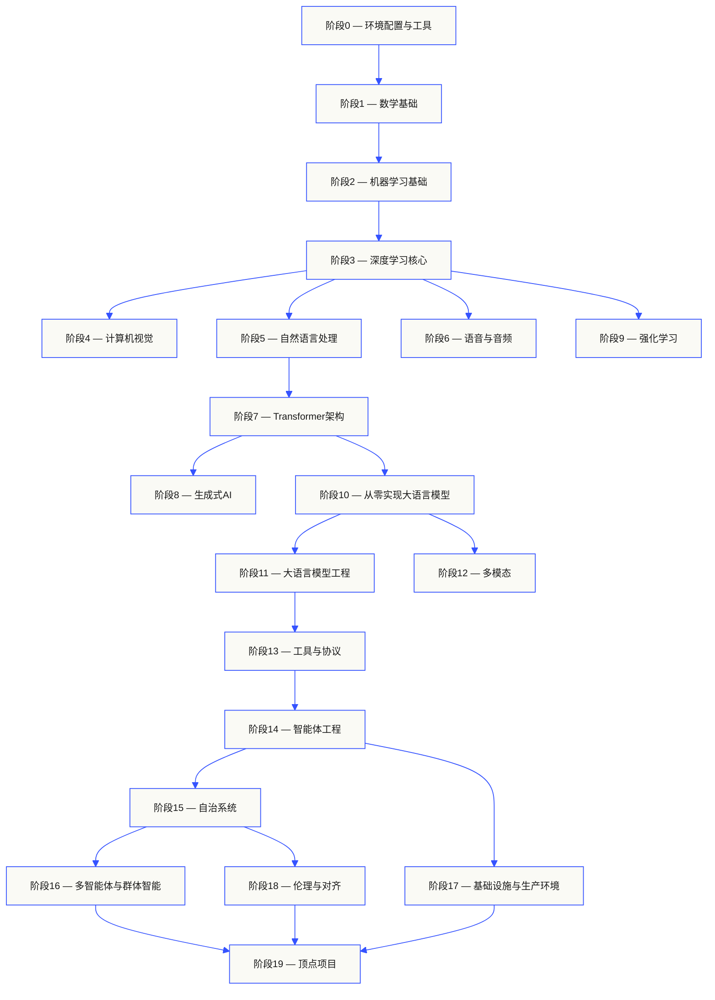
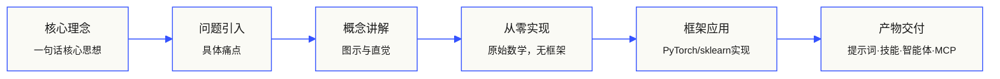

<p align="center">
  
</p>

<p align="center">
  <a href="LICENSE"></a>
  <a href="ROADMAP.md"></a>
  <a href="#课程目录"></a>
  <a href="https://github.com/rohitg00/ai-engineering-from-scratch/stargazers"></a>
  <a href="https://aiengineeringfromscratch.com"></a>
</p>

## 来自 [Agent Memory - 排名第一的持久化记忆 ⭐](https://github.com/rohitg00/agentmemory) <a href="https://github.com/rohitg00/agentmemory/stargazers"></a> 作者的又一力作，可与任何智能体或聊天助手无缝配合。

```
░░░▒▒▒░░░▒▒▒░░░▒▒▒░░░▒▒▒░░░▒▒▒░░░▒▒▒░░░▒▒▒░░░▒▒▒░░░▒▒▒░░░▒▒▒░░░▒▒▒░░░▒▒▒░░░▒▒▒░░░▒▒▒░░░▒▒▒
```

> **84%的学生已经在使用AI工具，但只有18%的人觉得自己能专业地运用它们。**
> 本课程体系正是为了填补这一鸿沟。
>
> 503节课程，20个学习阶段，约320小时学习时长。
> 涵盖Python、TypeScript、Rust、Julia四种语言。
> 每一节课都会产出一个可复用的交付物：提示词、技能、智能体、MCP服务器。
> 完全免费、开源、MIT许可证。
>
> 你不只是学习AI——你亲手从零构建它，端到端，全流程。

<!-- STATS:START (由 build.js 从 site/stats.json 生成 — 请勿手动编辑) -->
<p align="center"><sub><b>150,639</b> 位读者 &nbsp;·&nbsp; 过去30天 <b>241,669</b> 次页面访问 &nbsp;·&nbsp; 数据截至 2026-06-07</sub></p>
<!-- STATS:END -->

## 课程理念

大多数AI学习材料都是碎片化的：这里一篇论文，那里一篇微调文章，别处一个炫技的智能体演示。这些碎片很少能连贯起来。你能做出一个聊天机器人，却解释不了它的损失曲线；你能给智能体挂载函数，却说不清调用它的模型内部注意力机制在做什么。

本课程体系就是那根贯穿始终的脊梁。20个阶段、503节课程、四种编程语言：Python、TypeScript、Rust、Julia。从线性代数基础到自治群体智能，每一个算法都先从原始数学开始实现：反向传播、分词器、注意力机制、智能体循环。等到PyTorch登场时，你已经完全理解它底层在做什么。

每一节课都遵循相同的学习循环：理解问题 → 推导数学 → 编写代码 → 运行测试 → 保留交付物。没有五分钟速成视频，没有复制粘贴式部署，没有保姆式教学。完全免费、开源，专为在你自己的笔记本上运行而设计。

```
░░░▒▒▒░░░▒▒▒░░░▒▒▒░░░▒▒▒░░░▒▒▒░░░▒▒▒░░░▒▒▒░░░▒▒▒░░░▒▒▒░░░▒▒▒░░░▒▒▒░░░▒▒▒░░░▒▒▒░░░▒▒▒░░░▒▒▒
```

## 课程体系架构

二十个学习阶段层层递进。数学是地基，智能体和生产部署是屋顶。如果你已经掌握了底层知识可以跳级，但不要跳过之后又疑惑为什么顶层的东西会出问题。



```
░░░▒▒▒░░░▒▒▒░░░▒▒▒░░░▒▒▒░░░▒▒▒░░░▒▒▒░░░▒▒▒░░░▒▒▒░░░▒▒▒░░░▒▒▒░░░▒▒▒░░░▒▒▒░░░▒▒▒░░░▒▒▒░░░▒▒▒
```

## 单节课结构

每一节课都有独立的文件夹，整个课程体系采用统一的目录结构：

```
phases/<阶段编号>-<阶段名称>/<课程编号>-<课程名称>/
├── code/      可运行的实现代码（Python、TypeScript、Rust、Julia）
├── docs/
│   └── en.md  课程讲解文档
└── outputs/   本节课产出的提示词、技能、智能体或MCP服务器
```

每一节课都遵循六个学习步骤。**"从零实现 / 框架应用"** 的二分法是本课程的核心——你先从零开始实现算法，然后用生产级库运行同样的内容。因为你自己写过简化版本，所以你真正理解框架在做什么。



## 开始学习

三种入门方式，任选其一：

**方式A — 直接阅读。** 在 [aiengineeringfromscratch.com](https://aiengineeringfromscratch.com) 打开任意已完成的课程，或在下方[课程目录](#课程目录)中展开某个阶段。无需配置环境，无需克隆仓库。

**方式B — 克隆并运行。**

```bash
git clone https://github.com/rohitg00/ai-engineering-from-scratch.git
cd ai-engineering-from-scratch
python phases/01-math-foundations/01-linear-algebra-intuition/code/vectors.py
```

**方式C — 找到你的起点（推荐）。** 智能跳级。在Claude、Cursor、Codex、OpenClaw、Hermes或任何安装了本课程技能的智能体中：

```bash
/find-your-level
```

十个问题，为你的知识水平匹配起始阶段，生成带时长预估的个性化学习路径。每个阶段结束后：

```bash
/check-understanding 3        # 测试你对阶段3的理解
ls phases/03-deep-learning-core/05-loss-functions/outputs/
# ├── prompt-loss-function-selector.md
# └── prompt-loss-debugger.md
```

### 前置要求

- 你会写代码（任何语言；Python更佳）
- 你想理解AI**真正的工作原理**，而不只是调用API

### 内置智能体技能（Claude、Cursor、Codex、OpenClaw、Hermes）

| 技能 | 功能说明 |
|---|---|
| [`/find-your-level`](.claude/skills/find-your-level/SKILL.md) | 十题定位测试，为你的知识匹配起始阶段，生成带时长预估的个性化学习路径 |
| [`/check-understanding <阶段号>`](.claude/skills/check-understanding/SKILL.md) | 每阶段八题小测，提供反馈和需要复习的具体课程 |

```
░░░▒▒▒░░░▒▒▒░░░▒▒▒░░░▒▒▒░░░▒▒▒░░░▒▒▒░░░▒▒▒░░░▒▒▒░░░▒▒▒░░░▒▒▒░░░▒▒▒░░░▒▒▒░░░▒▒▒░░░▒▒▒░░░▒▒▒
```

## 每节课都有交付物

其他课程的终点是"恭喜你学会了X"。这里每节课的终点是一个**可复用的工具**，你可以安装或粘贴到日常工作流中。

<table>
<tr>
<th align="left" width="25%"><br/><sub>图001 · A</sub><br/><b>提示词</b></th>
<th align="left" width="25%"><br/><sub>图001 · B</sub><br/><b>技能</b></th>
<th align="left" width="25%"><br/><sub>图001 · C</sub><br/><b>智能体</b></th>
<th align="left" width="25%"><br/><sub>图001 · D</sub><br/><b>MCP服务器</b></th>
</tr>
<tr>
<td valign="top">粘贴到任何AI助手中，获得特定任务的专家级帮助。</td>
<td valign="top">放入Claude、Cursor、Codex、OpenClaw、Hermes或任何能读取<code>SKILL.md</code>的智能体。</td>
<td valign="top">作为自治工作者部署——在阶段14中你亲手写了这个循环。</td>
<td valign="top">接入任何兼容MCP的客户端，在阶段13中从零端到端构建。</td>
</tr>
</table>

> 使用 `python3 scripts/install_skills.py` 一键安装全部。这是真正的工具，不是课后作业。
> 课程结束时，你将拥有503个真正理解的交付物作品集，因为它们都是你亲手构建的。

### 图002 · 完整示例

阶段14，第1课：智能体循环。约120行纯Python，无依赖。

<table>
<tr>
<td valign="top" width="50%">

**`code/agent_loop.py`** &nbsp; <sub><i>从零实现</i></sub>

```python
def run(query, tools):
    history = [user(query)]
    for step in range(MAX_STEPS):
        msg = llm(history)
        if msg.tool_calls:
            for call in msg.tool_calls:
                result = tools[call.name](**call.args)
                history.append(tool_result(call.id, result))
            continue
        return msg.content
    raise StepLimitExceeded
```

</td>
<td valign="top" width="50%">

**`outputs/agent_loop-pack/AGENTS.md`** &nbsp; <sub><i>直接使用</i></sub>

```yaml
agent:
  tool_calling:
    tools:
      - name: get_weather
        description: Get current weather for a location
        parameters:
          location:
            type: string
            description: City and state, e.g. Boston, MA
            required: true
  system: |
    You are a helpful assistant.

    When your tools are enabled, you can answer any question accurately.
    You have access to the user's location.

    Remember to call the weather function when asked about weather.
```

</td>
</tr>
</table>

### 图003 · 生产级交付物

<table>
<tr>
<th align="left" width="50%"><sub>图003 · A</sub><br/><b>技能</b></th>
<th align="left" width="50%"><sub>图003 · B</sub><br/><b>提示词</b></th>
</tr>
<tr>
<td valign="top">

课程技能专为安装到Claude、Cursor、Codex、OpenClaw、Hermes等能读取 `<path>/SKILL.md` 的智能体而设计。它们不是小演示，而是你可以在生产中实际使用的全功能工具。

</td>
<td valign="top">

课程提示词专为粘贴到任何聊天助手而设计。它们不是随机的提示词，而是在课程背景下解决特定问题的专业化指令。

</td>
</tr>
</table>

### 提示词技能集成

完整的提示词工程课程（PEC）包含以下技能，可通过相同的安装脚本获取：

```bash
python3 scripts/install_skills.py --type prompt <目标目录>
python3 scripts/install_skills.py --type prompt --package <包名>
# 示例：
python3 scripts/install_skills.py --type prompt .
```

### 技能集成

完整的技能课程包含以下技能，可通过相同的安装脚本获取：

```bash
python3 scripts/install_skills.py --type skill <目标目录>
python3 scripts/install_skills.py --type skill --package <包名>
# 示例：
python3 scripts/install_skills.py --type skill .
python3 scripts/install_skills.py --type skill . --layout flat
```

### MCP服务器 — 模型上下文协议

MCP服务器专为直接接入任何兼容MCP的客户端而设计。它们在阶段13中从零构建，然后在阶段14中用于驱动智能体。

```bash
python3 scripts/install_skills.py --type mcp <目标目录>
python3 scripts/install_skills.py --type mcp --package <包名>
# 示例：
python3 scripts/install_skills.py --type mcp .
```

### 智能体集成

```bash
python3 scripts/install_skills.py --type agent <目标目录>
python3 scripts/install_skills.py --type agent --package <包名>
# 示例：
python3 scripts/install_skills.py --type agent .
```

### 完整安装选项

```bash
python3 scripts/install_skills.py <目标目录>                              # 所有技能，默认嵌套布局
python3 scripts/install_skills.py <目标目录> --layout skills               # 同上，显式指定
python3 scripts/install_skills.py <目标目录> --type all                    # 技能 + 提示词 + 智能体
python3 scripts/install_skills.py <目标目录> --phase 14                    # 仅安装阶段14
python3 scripts/install_skills.py <目标目录> --tag rag                     # 按标签过滤
python3 scripts/install_skills.py <目标目录> --layout flat                 # 扁平化文件
python3 scripts/install_skills.py <目标目录> --dry-run                     # 预览不写入
python3 scripts/install_skills.py <目标目录> --force                       # 覆盖已有文件
```

`<目标目录>` 是你的智能体技能目录（例如：`~/.claude/skills`、`~/.cursor/skills`、`~/.codex/openclaw/skills`、`.skills`，或你的智能体读取的任何路径）。

默认情况下，脚本会检测与现有安装的冲突，列出所有冲突路径后以代码1退出。使用 `--dry-run` 预览冲突，或使用 `--force` 强制覆盖。

每次非预览运行都会在目标目录写入 `manifest.json`，包含按类型和阶段分组的完整清单。选择你的智能体支持的布局：

| --layout | 写入路径 |
|---|---|
| `skills` | `<目标目录>/<名称>/SKILL.md`（嵌套格式，Claude/Cursor/Codex/OpenClaw/Hermes均支持） |
| `by-phase` | `<目标目录>/phase-NN/<名称>.md` |
| `flat` | `<目标目录>/<名称>.md` |

### 将智能体工作平台脚手架到你的仓库

阶段14的顶点项目附带一个可复用的智能体工作平台包（AGENTS.md、schema、初始化/验证/交接脚本）。用以下命令将其脚手架到任何仓库：

```bash
python3 scripts/scaffold_workbench.py path/to/your-repo            # 完整包 + 种子
python3 scripts/scaffold_workbench.py path/to/your-repo --minimal  # 跳过文档
python3 scripts/scaffold_workbench.py path/to/your-repo --dry-run  # 仅预览
python3 scripts/scaffold_workbench.py path/to/your-repo --force    # 强制覆盖
```

你将获得七个已接线的工作台界面、一个启动器 `task_board.json`，以及 `schema_version: 1` 的新鲜 `agent_state.json`。接下来：编辑任务、编辑 `AGENTS.md`、运行 `scripts/init_agent.py`、将契约交给你的智能体。

包源代码位于：`/phases/14-agent-engineering/42-agent-workbench-capstone/outputs/agent-workbench-pack/`。

### 以JSON格式浏览整个课程

`scripts/build_catalog.py` 会遍历磁盘上每个阶段、每节课、每个交付物，并在仓库根目录写入 `catalog.json`。一个文件，完整的课程目录。

```bash
python3 scripts/build_catalog.py              # 写入 <仓库>/catalog.json
python3 scripts/build_catalog.py --stdout     # 输出到stdout，不修改仓库
python3 scripts/build_catalog.py --out path/to/file.json
```

目录是基于文件系统的，不是从README派生的，所以计数永远与磁盘上的实际内容匹配。可用于网站构建、下游工具、或验证README计数没有漂移。Schema在脚本顶部有详细文档。

GitHub Action（`.github/workflows/curriculum.yml`）会在每个PR上重建 `catalog.json`，如果提交的文件过时则构建失败。编辑任何课程后，运行 `python3 scripts/build_catalog.py` 并提交结果，否则CI会拒绝该PR。

相同的工作流会在仅警告模式下运行 `audit_lessons.py`（这样现有的漂移不会阻碍贡献者）。

### 每节课Python代码的冒烟测试

`scripts/lesson_run.py` 会字节码编译每节课 `code/` 目录下的每个 `.py` 文件。默认模式仅语法检查——不执行、不调用API、不需要重量级ML依赖。捕获贡献者引入的大部分回归（错误的缩进、损坏的f-string、拼写错误）。

```bash
python3 scripts/lesson_run.py                        # 整个课程的语法检查
python3 scripts/lesson_run.py --phase 14             # 仅阶段14
python3 scripts/lesson_run.py --json                 # JSON报告输出到stdout
python3 scripts/lesson_run.py --strict               # 任何课程失败则退出码1
python3 scripts/lesson_run.py --execute              # 实际运行，每节课10秒超时
```

`--execute` 会运行每节课的 `code/main.py`（或第一个 `.py` 文件），10秒超时。入口文件以 `# requires: pkg1, pkg2` 注释开头列出非标准库依赖的课程会被跳过，原因是 `needs <deps>`。

脚本是可选接入，未硬编码到CI中。

仅标准库，Python 3.10+。设置 `LINE_CHECK_SKIP=domain1,domain2` 可覆盖默认跳过列表（`twitter.com`、`x.com`、`linkedin.com`、`instagram.com`、`medium.com` —— 这些域名会激进地阻止自动化/HEAD/GET请求）。

## 从哪里开始

| 背景 | 起始阶段 | 预计时长 |
|---|---|---|
| 编程和AI新手 | 阶段0 — 环境配置 | ~306小时 |
| 会Python，机器学习新手 | 阶段1 — 数学基础 | ~270小时 |
| 懂机器学习，深度学习新手 | 阶段3 — 深度学习核心 | ~200小时 |
| 懂深度学习，想学大模型和智能体 | 阶段10 — 从零实现大语言模型 | ~100小时 |
| 资深工程师，只学智能体工程 | 阶段14 — 智能体工程 | ~60小时 |

```
░░░▒▒▒░░░▒▒▒░░░▒▒▒░░░▒▒▒░░░▒▒▒░░░▒▒▒░░░▒▒▒░░░▒▒▒░░░▒▒▒░░░▒▒▒░░░▒▒▒░░░▒▒▒░░░▒▒▒░░░▒▒▒░░░▒▒▒
```

## 为什么现在学这个很重要

<table>
<tr>
<th align="left" width="50%"><sub>图003 · A</sub><br/><b>行业信号</b></th>
<th align="left" width="50%"><sub>图003 · B</sub><br/><b>覆盖的基础论文</b></th>
</tr>
<tr>
<td valign="top">

> *"最热门的新编程语言是英语。"*
> — **Andrej Karpathy** [推文](https://x.com/karpathy/status/1617979122622571212)

> *"软件工程正在我们眼前被重塑。"*
> — **Boris Cherny**，Claude Code创始人

> *"模型会越来越好。复利效应的技能是**知道构建什么**。"*
> — 行业共识，2026

</td>
<td valign="top">

- **注意力就是你所需的全部** — Vaswani等人，2017 ↪ [阶段7](@phase-7)
- **语言模型是少样本学习者** (GPT-3) ↪ [阶段10](@phase-10)
- **去噪扩散概率模型** ↪ [阶段8](@phase-8)
- **InstructGPT / RLHF** ↪ [阶段10](@phase-10)
- **直接偏好优化** ↪ [阶段10](@phase-10)
- **思维链提示** ↪ [阶段11](@phase-11)
- **ReAct：大语言模型中的推理与行动** ↪ [阶段14](@phase-14)
- **模型上下文协议** — Anthropic ↪ [阶段13](@phase-13)

</td>
</tr>
</table>

```
░░░▒▒▒░░░▒▒▒░░░▒▒▒░░░▒▒▒░░░▒▒▒░░░▒▒▒░░░▒▒▒░░░▒▒▒░░░▒▒▒░░░▒▒▒░░░▒▒▒░░░▒▒▒░░░▒▒▒░░░▒▒▒░░░▒▒▒
```

## 贡献

| 目标 | 阅读 |
|---|---|
| 贡献课程或修复 | [CONTRIBUTING.md](CONTRIBUTING.md) |
| 为你的团队或学校复刻 | [FORKING.md](FORKING.md) |
| 课程模板 | [LESSON_TEMPLATE.md](LESSON_TEMPLATE.md) |
| 进度追踪 | [ROADMAP.md](ROADMAP.md) |
| 术语表 | [glossary/terms.md](glossary/terms.md) |
| 行为准则 | [CODE_OF_CONDUCT.md](CODE_OF_CONDUCT.md) |

提交课程前，请运行不变量检查：

```bash
python3 scripts/audit_lessons.py              # 整个课程
python3 scripts/audit_lessons.py --phase 14   # 单个阶段
python3 scripts/audit_lessons.py --json       # CI友好输出
```

任何规则失败时退出码非零。规则（L001-L010）验证：目录结构、`docs/en.md` 存在 + HTM、`code/` 非空、`quiz.json` schema（拒绝导致问题#102的格式错误的q/choices/answer键）、以及课程文档中的相对链接。

```
░░░▒▒▒░░░▒▒▒░░░▒▒▒░░░▒▒▒░░░▒▒▒░░░▒▒▒░░░▒▒▒░░░▒▒▒░░░▒▒▒░░░▒▒▒░░░▒▒▒░░░▒▒▒░░░▒▒▒░░░▒▒▒░░░▒▒▒
```

## 赞助本项目

免费、MIT许可、503节课。本课程完全靠赞助维持。仅接受现金。

**覆盖范围（2026-05-14验证）：** 55,593月活读者 · 90,709页面访问 · 29.5k星标 · Twitter/X是第一获客渠道。

**当前赞助商：** [CodeRabbit](https://coderabbit.link/rohit-ghumare) · [ii](https://ii.dev?utm_source=ai-engineering-from-scratch&utm_medium=readme&utm_campaign=sponsor)

| 层级 | 美元/月 | 权益 |
|---|---|---|
| 支持者 | $25 | 名字列入BACKERS.md |
| 青铜 | $250 | README赞助商区块文字行 + 首发两周推文 |
| 白银 | $750 | README小logo + API课程中列出支持提供商 |
| 黄金 | $2,000 | README中logo + 赞助页面 + 季度X/LinkedIn联合推广 |
| 白金 | $5,000 | 折叠区上方醒目logo + 最多1节专属集成课程 |

完整费率卡、硬性规则、定价明细、覆盖数据：[SPONSORS.md](SPONSORS.md)。通过 [GitHub Sponsors](https://github.com/sponsors/rohitg00) 注册。

```
░░░▒▒▒░░░▒▒▒░░░▒▒▒░░░▒▒▒░░░▒▒▒░░░▒▒▒░░░▒▒▒░░░▒▒▒░░░▒▒▒░░░▒▒▒░░░▒▒▒░░░▒▒▒░░░▒▒▒░░░▒▒▒░░░▒▒▒
```

## 星标历史

<a href="https://star-history.com/#rohitg00/ai-engineering-from-scratch&Date">
  <picture>
    <source media="(prefers-color-scheme: dark)" srcset="https://api.star-history.com/svg?repos=rohitg00/ai-engineering-from-scratch&type=Date&theme=dark">
    
  </picture>
</a>

如果这份手册帮助了你，请给仓库点个星。这能让项目持续下去。

## 许可证

MIT。你可以随意使用——复刻、教学、销售、分发。感谢署名，但不强制要求。

维护者：[Rohit Ghumare](https://github.com/rohitg00) 及社区贡献者。

<sub>
  <a href="https://x.com/ghumare244">@ghumare244</a> &nbsp;·&nbsp;
  <a href="https://aiengineeringfromscratch.com">aiengineeringfromscratch.com</a> &nbsp;·&nbsp;
  <a href="https://github.com/rohitg00/ai-engineering-from-scratch/issues/new">报告问题 / 建议</a>
</sub>
