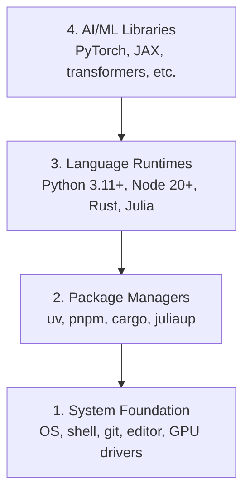

# Dev Environment

> Your tools shape your thinking. Set them up once, set them up right.

**Type:** Build
**Languages:** Python, 节点.js, Rust
**Prerequisites:** None
**Time:** ~45 minutes

## Learning Objectives

- Set up Python 3.11+, 节点.js 20+, 和 Rust toolchains 从 scratch
- Configure virtual environments 和 package managers 为了 reproducible builds
- Verify GPU access 使用 CUDA/MPS 和 run test 张量 operation
- Understand four-层 stack: system, packages, runtimes, AI libraries

## Problem

You're about 到 learn AI engineering across 200+ lessons using Python, TypeScript, Rust, 和 Julia. If your environment 是 broken, every single lesson becomes fight against tooling instead 的 learning.

Most people skip environment setup. Then they spend hours debugging import errors, version conflicts, 和 missing CUDA drivers. We're going 到 do 这个 once, properly.

## Concept

AI engineering environment has four 层:



We install bottom-up. Each 层 depends 在 one below it.

## Build It

### Step 1: System Foundation

Check your system 和 install basics.

```bash
# macOS
xcode-select --install
brew install git curl wget

# Ubuntu/Debian
sudo apt update && sudo apt install -y build-essential git curl wget

# Windows (use WSL2)
wsl --install -d Ubuntu-24.04
```

### Step 2: Python 使用 uv

We use `uv` — it's 10-100x faster than pip 和 handles virtual environments automatically.

```bash
curl -LsSf https://astral.sh/uv/install.sh | sh

uv python install 3.12

uv venv
source .venv/bin/activate  # or .venv\Scripts\activate on Windows

uv pip install numpy matplotlib jupyter
```

Verify:

```python
import sys
print(f"Python {sys.version}")

import numpy as np
print(f"NumPy {np.__version__}")
a = np.array([1, 2, 3])
print(f"Vector: {a}, dot product with itself: {np.dot(a, a)}")
```

### Step 3: 节点.js 使用 pnpm

For TypeScript lessons (agents, MCP servers, web apps).

```bash
curl -fsSL https://fnm.vercel.app/install | bash
fnm install 22
fnm use 22

npm install -g pnpm

node -e "console.log('Node', process.version)"
```

### Step 4: Rust

For performance-critical lessons (inference, systems).

```bash
curl --proto '=https' --tlsv1.2 -sSf https://sh.rustup.rs | sh

rustc --version
cargo --version
```

### Step 5: Julia (Optional)

For math-heavy lessons where Julia shines.

```bash
curl -fsSL https://install.julialang.org | sh

julia -e 'println("Julia ", VERSION)'
```

### Step 6: GPU Setup (If You Have One)

```bash
# NVIDIA
nvidia-smi

# Install PyTorch with CUDA
uv pip install torch torchvision torchaudio --index-url https://download.pytorch.org/whl/cu124
```

```python
import torch
print(f"CUDA available: {torch.cuda.is_available()}")
if torch.cuda.is_available():
    print(f"GPU: {torch.cuda.get_device_name(0)}")
```

No GPU? No problem. Most lessons work 在 CPU. For 训练-heavy lessons, use Google Colab 或 cloud GPUs.

### Step 7: Verify Everything

Run verification script:

```bash
python phases/00-setup-and-tooling/01-dev-environment/code/verify.py
```

## Use It

Your environment 是 now ready 为了 every lesson 在 这个 course. Here's what you'll use where:

| Language | Used In | Package Manager |
|----------|---------|-----------------|
| Python | Phases 1-12 (ML, DL, NLP, Vision, Audio, LLMs) | uv |
| TypeScript | Phases 13-17 (Tools, Agents, Swarms, Infra) | pnpm |
| Rust | Phases 12, 15-17 (Performance-critical systems) | cargo |
| Julia | Phase 1 (Math foundations) | Pkg |

## Ship It

This lesson produces verification script anyone can run 到 check their setup.

See `输出/prompt-env-check.md` 为了 prompt helps AI assistants diagnose environment issues.

## Exercises

1. Run verification script 和 fix any failures
2. Create Python virtual environment 为了 这个 course 和 install PyTorch
3. Write "hello world" 在 all four languages 和 run each one
