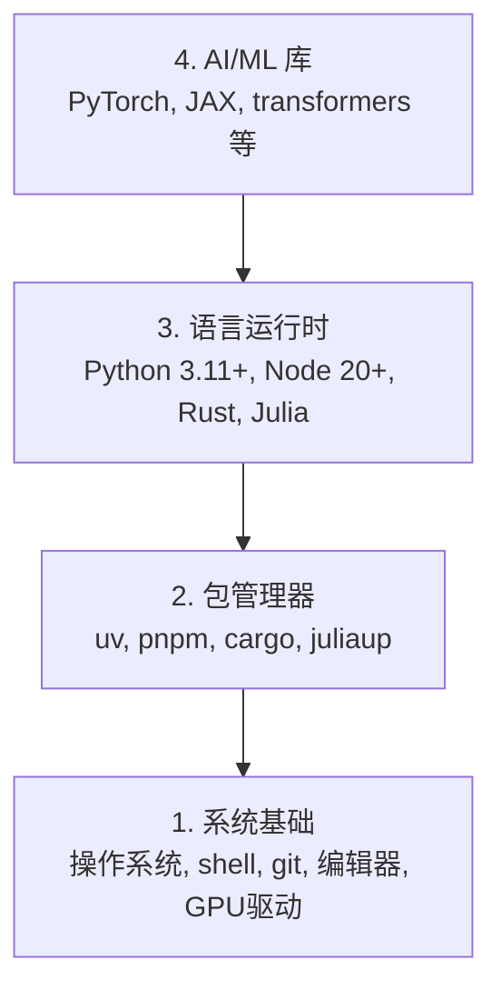

# 开发环境配置

> 工具塑造你的思维。一次配置，终身受益。

**类型:** 实现
**语言:** Python, Node.js, Rust
**前置要求:** 无
**预计时间:** ~45分钟

## 学习目标

- 从零配置 Python 3.11+、Node.js 20+ 和 Rust 工具链
- 配置虚拟环境和包管理器，实现可复现的构建
- 使用 CUDA/MPS 验证 GPU 访问并运行测试张量运算
- 理解四层架构：系统、包、运行时、AI库

## 问题引入

你即将通过 200+ 节课程学习 AI 工程，涉及 Python、TypeScript、Rust 和 Julia。如果环境配置有问题，每一节课都会变成与工具的斗争，而不是真正的学习。

大多数人跳过环境配置。然后他们花费数小时调试导入错误、版本冲突和缺失的 CUDA 驱动。我们要一次性做好这件事。

## 概念讲解

AI 工程环境包含四层：



我们从下往上安装。每一层都依赖它下面的那一层。

## 从零实现

### 步骤1：系统基础

检查你的系统并安装基础工具。

```bash
# macOS
xcode-select --install
brew install git curl wget

# Ubuntu/Debian
sudo apt update && sudo apt install -y build-essential git curl wget

# Windows (使用 WSL2)
wsl --install -d Ubuntu-24.04
```

### 步骤2：使用 uv 安装 Python

我们使用 `uv` —— 它比 pip 快 10-100 倍，并且自动处理虚拟环境。

```bash
curl -LsSf https://astral.sh/uv/install.sh | sh

uv python install 3.12

uv venv
source .venv/bin/activate  # Windows 下使用 .venv\Scripts\activate

uv pip install numpy matplotlib jupyter
```

验证：

```python
import sys
print(f"Python {sys.version}")

import numpy as np
print(f"NumPy {np.__version__}")
a = np.array([1, 2, 3])
print(f"向量: {a}, 自身点积: {np.dot(a, a)}")
```

### 步骤3：使用 pnpm 安装 Node.js

用于 TypeScript 课程（智能体、MCP 服务器、Web 应用）。

```bash
curl -fsSL https://fnm.vercel.app/install | bash
fnm install 22
fnm use 22

npm install -g pnpm

node -e "console.log('Node', process.version)"
```

### 步骤4：Rust

用于性能关键的课程（推理、系统）。

```bash
curl --proto '=https' --tlsv1.2 -sSf https://sh.rustup.rs | sh

rustc --version
cargo --version
```

### 步骤5：Julia（可选）

用于 Julia 擅长的数学密集型课程。

```bash
curl -fsSL https://install.julialang.org | sh

julia -e 'println("Julia ", VERSION)'
```

### 步骤6：GPU 配置（如有）

```bash
# NVIDIA
nvidia-smi

# 安装带 CUDA 的 PyTorch
uv pip install torch torchvision torchaudio --index-url https://download.pytorch.org/whl/cu124
```

```python
import torch
print(f"CUDA 可用: {torch.cuda.is_available()}")
if torch.cuda.is_available():
    print(f"GPU: {torch.cuda.get_device_name(0)}")
```

没有 GPU？没问题。大多数课程都可以在 CPU 上运行。对于训练密集型课程，使用 Google Colab 或云 GPU。

### 步骤7：验证所有配置

运行验证脚本：

```bash
python phases/00-setup-and-tooling/01-dev-environment/code/verify.py
```

## 框架应用

你的环境现在已经为本课程的每一节课做好准备。以下是各语言的使用场景：

| 语言 | 使用阶段 | 包管理器 |
|----------|---------|-----------------|
| Python | 阶段 1-12（机器学习、深度学习、NLP、视觉、音频、大语言模型） | uv |
| TypeScript | 阶段 13-17（工具、智能体、群体、基础设施） | pnpm |
| Rust | 阶段 12, 15-17（性能关键系统） | cargo |
| Julia | 阶段 1（数学基础） | Pkg |

## 产物交付

本节课产出一个验证脚本，任何人都可以运行它来检查自己的配置。

查看 `outputs/prompt-env-check.md` 获取帮助 AI 助手诊断环境问题的提示词。

## 练习

1. 运行验证脚本并修复所有失败项
2. 为本课程创建一个 Python 虚拟环境并安装 PyTorch
3. 用四种语言各写一个"hello world"并运行
