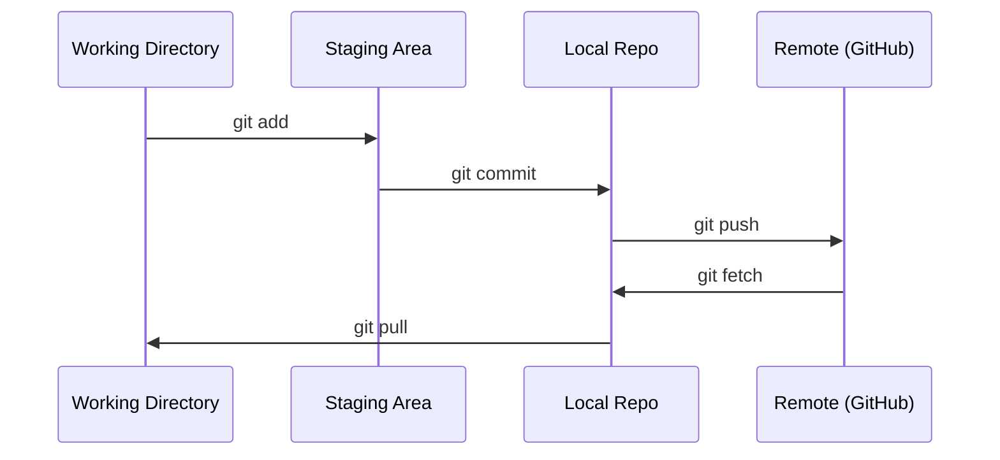

# Git 与协作

> 版本控制不是可选项。你在这里构建的每个实验、每个模型、每节课都需要被追踪。

**类型:** 学习
**语言:** --
**前置要求:** 阶段0, 课程01
**预计时间:** ~30分钟

## 学习目标

- 配置 git 身份信息，使用 add、commit、push 的日常工作流
- 创建和合并分支，在不破坏主分支的情况下进行独立实验
- 编写 `.gitignore`，排除模型检查点和大二进制文件
- 使用 `git log` 浏览提交历史，理解项目演进

## 问题引入

你即将在 20 个阶段中编写数百个代码文件。没有版本控制，你会丢失工作、破坏无法撤销的东西，也无法与他人协作。

Git 是工具。GitHub 是代码存放的地方。本节课只涵盖本课程需要的内容。

## 概念讲解



记住三点：
1. 经常保存 (`git commit`)
2. 推送到远程 (`git push`)
3. 实验用分支 (`git checkout -b experiment`)

## 从零实现

### 步骤1：配置 git

```bash
git config --global user.name "Your Name"
git config --global user.email "you@example.com"
```

### 步骤2：日常工作流

```bash
git status
git add file.py
git commit -m "Add perceptron implementation"
git push origin main
```

### 步骤3：实验分支

```bash
git checkout -b experiment/new-optimizer

# ... make changes, commit ...

git checkout main
git merge experiment/new-optimizer
```

### 步骤4：使用本课程仓库

```bash
git clone https://github.com/rohitg00/ai-engineering-from-scratch.git
cd ai-engineering-from-scratch

git checkout -b my-progress
# work through lessons, commit your code
git push origin my-progress
```

## 框架应用

对于本课程，你只需要这些命令：

| 命令 | 使用场景 |
|---------|------|
| `git clone` | 获取课程仓库 |
| `git add` + `git commit` | 保存你的工作 |
| `git push` | 备份到 GitHub |
| `git checkout -b` | 尝试新东西不破坏主分支 |
| `git log --oneline` | 查看你做了什么 |

就这些。本课程不需要 rebase、cherry-pick 或 submodules。

## 练习

1. 克隆本仓库，创建名为 `my-progress` 的分支，创建一个文件，提交并推送
2. 创建 `.gitignore` 排除模型检查点文件 (`.pt`, `.pth`, `.safetensors`)
3. 用 `git log --oneline` 查看本仓库的提交历史

## 关键术语

| 术语 | 通俗说法 | 实际含义 |
|------|----------------|----------------------|
| Commit | "保存" | 项目在某个时间点的完整快照 |
| Branch | "副本" | 指向提交的指针，随工作向前移动 |
| Merge | "合并代码" | 从一个分支获取变更并应用到另一个分支 |
| Remote | "云端" | 托管在其他地方的仓库副本 (GitHub, GitLab) |
