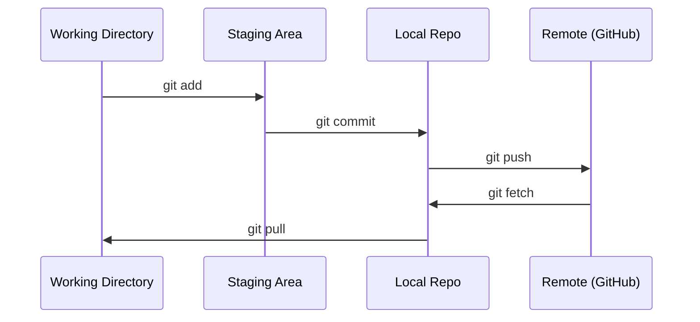

# Git & Collaboration

> Version control 是 not optional. Every experiment, every 模型, every lesson you build here gets tracked.

**Type:** Learn
**Languages:** --
**Prerequisites:** Phase 0, Lesson 01
**Time:** ~30 minutes

## Learning Objectives

- Configure git identity 和 use daily workflow 的 add, commit, 和 push
- Create 和 merge branches 为了 isolated experiments without breaking main
- Write `.gitignore` excludes 模型 checkpoints 和 large binary files
- Navigate commit history 使用 `git log` 到 understand project evolution

## Problem

You're about 到 write hundreds 的 代码 files across 20 phases. Without version control you will lose work, break things you can't undo, 和 have no way 到 collaborate 使用 others.

Git 是 tool. GitHub 是 where 代码 lives. This lesson covers what you need 为了 这个 course 和 nothing more.

## Concept



Three things 到 remember:
1. Save often (`git commit`)
2. Push 到 remote (`git push`)
3. Branch 为了 experiments (`git checkout -b experiment`)

## Build It

### Step 1: Configure git

```bash
git config --global user.name "Your Name"
git config --global user.email "you@example.com"
```

### Step 2: daily workflow

```bash
git status
git add file.py
git commit -m "Add perceptron implementation"
git push origin main
```

### Step 3: Branching 为了 experiments

```bash
git checkout -b experiment/new-optimizer

# ... make changes, commit ...

git checkout main
git merge experiment/new-optimizer
```

### Step 4: Working 使用 这个 course repo

```bash
git clone https://github.com/rohitg00/ai-engineering-from-scratch.git
cd ai-engineering-from-scratch

git checkout -b my-progress
# work through lessons, commit your code
git push origin my-progress
```

## Use It

For 这个 course, you need exactly 这些 commands:

| Command | When |
|---------|------|
| `git clone` | Get course repo |
| `git add` + `git commit` | Save your work |
| `git push` | Back it up 到 GitHub |
| `git checkout -b` | Try something without breaking main |
| `git log --oneline` | See what you've done |

That's it. You don't need rebase, cherry-pick, 或 submodules 为了 这个 course.

## Exercises

1. Clone 这个 repo, create branch called `my-progress`, make file, commit it, push it
2. Create `.gitignore` excludes 模型 checkpoint files (`.pt`, `.pth`, `.safetensors`)
3. Look 在 commit history 的 这个 repo 使用 `git log --oneline` 和 read how lessons were added

## Key Terms

| Term | What people say | What it actually means |
|------|----------------|----------------------|
| Commit | "Saving" | snapshot 的 your entire project 在 point 在 time |
| Branch | " copy" | pointer 到 commit moves forward 作为 you work |
| Merge | "Combining 代码" | Taking changes 从 one branch 和 applying them 到 another |
| Remote | " cloud" | copy 的 your repo hosted somewhere else (GitHub, GitLab) |
