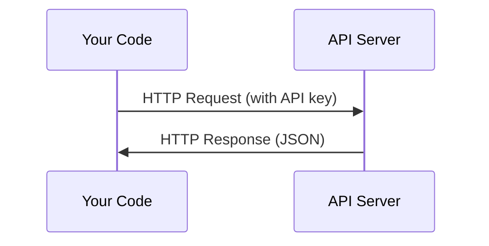

# API 与密钥管理

> 每个 AI API 的工作方式都一样：发送请求，获取响应。细节会变，但模式不变。

**类型:** 实现
**语言:** Python, TypeScript
**前置要求:** 阶段0, 课程01
**预计时间:** ~30分钟

## 学习目标

- 使用环境变量和 `.env` 文件安全存储 API 密钥
- 使用 Anthropic Python SDK 和原始 HTTP 进行 LLM API 调用
- 对比基于 SDK 和原始 HTTP 的请求/响应格式以便调试
- 识别并处理常见 API 错误，包括认证和速率限制

## 问题引入

从阶段 11 开始，你将调用 LLM API（Anthropic、OpenAI、Google）。在阶段 13-16，你将构建在循环中使用这些 API 的智能体。你需要了解 API 密钥如何工作、如何安全存储它们，以及如何进行你的第一次 API 调用。

## 概念讲解



每个 API 调用都包含：
1. 端点 (URL)
2. API 密钥 (认证)
3. 请求体 (你想要什么)
4. 响应体 (你得到什么)

## 从零实现

### 步骤1：安全存储 API 密钥

永远不要把 API 密钥写在代码里。使用环境变量。

```bash
export ANTHROPIC_API_KEY="sk-ant-..."
export OPENAI_API_KEY="sk-..."
```

或者使用 `.env` 文件（加入 `.gitignore`）：

```
ANTHROPIC_API_KEY=sk-ant-...
OPENAI_API_KEY=sk-...
```

### 步骤2：第一个 API 调用 (Python)

```python
import anthropic

client = anthropic.Anthropic()

response = client.messages.create(
    model="claude-sonnet-4-20250514",
    max_tokens=256,
    messages=[{"role": "user", "content": "What is a neural network in one sentence?"}]
)

print(response.content[0].text)
```

### 步骤3：第一个 API 调用 (TypeScript)

```typescript
import Anthropic from "@anthropic-ai/sdk";

const client = new Anthropic();

const response = await client.messages.create({
  model: "claude-sonnet-4-20250514",
  max_tokens: 256,
  messages: [{ role: "user", content: "What is a neural network in one sentence?" }],
});

console.log(response.content[0].text);
```

### 步骤4：原始 HTTP (无 SDK)

```python
import os
import urllib.request
import json

url = "https://api.anthropic.com/v1/messages"
headers = {
    "Content-Type": "application/json",
    "x-api-key": os.environ["ANTHROPIC_API_KEY"],
    "anthropic-version": "2023-06-01",
}
body = json.dumps({
    "model": "claude-sonnet-4-20250514",
    "max_tokens": 256,
    "messages": [{"role": "user", "content": "What is a neural network in one sentence?"}],
}).encode()

req = urllib.request.Request(url, data=body, headers=headers, method="POST")
with urllib.request.urlopen(req) as resp:
    result = json.loads(resp.read())
    print(result["content"][0]["text"])
```

这就是 SDK 底层做的事情。理解原始 HTTP 调用在调试时很有帮助。

## 框架应用

对于本课程：

| API | 何时需要 | 免费额度 |
|-----|-----------------|-----------|
| Anthropic (Claude) | 阶段 11-16 (智能体, 工具) | 注册送 $5 |
| OpenAI | 阶段 11 (对比) | 注册送 $5 |
| Hugging Face | 阶段 4-10 (模型, 数据集) | 免费 |

你现在不需要全部设置。在课程需要时再设置。

## 产物交付

本节课产出：
- `outputs/prompt-api-troubleshooter.md` - 诊断常见 API 错误

## 练习

1. 获取 Anthropic API 密钥并进行你的第一个 API 调用
2. 尝试原始 HTTP 版本并对比响应格式与 SDK 版本
3. 故意使用错误的 API 密钥并阅读错误信息

## 关键术语

| 术语 | 通俗说法 | 实际含义 |
|------|----------------|----------------------|
| API key | "API 的密码" | 唯一字符串，标识你的账户并授权请求 |
| Rate limit | "他们限制我了" | 每分钟/小时最大请求数，防止滥用并确保公平使用 |
| Token | "一个词" (API 语境) | 计费单位：输入和输出 token 分别计数和收费 |
| Streaming | "实时响应" | 逐字获取响应而不是等待完整响应 |
