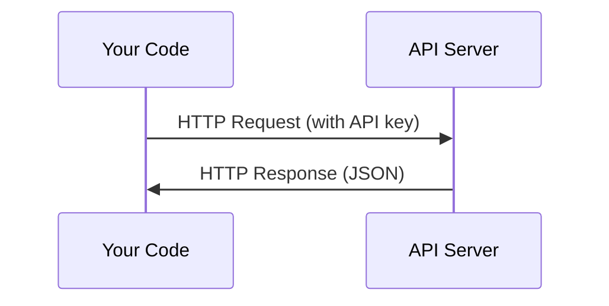

# APIs & Keys

> Every AI API works same way: send request, get response. details change, pattern doesn't.

**Type:** Build
**Languages:** Python, TypeScript
**Prerequisites:** Phase 0, Lesson 01
**Time:** ~30 minutes

## Learning Objectives

- Store API keys securely using environment variables 和 `.env` files
- Make LLM API call using both Anthropic Python SDK 和 raw HTTP
- Compare SDK-based 和 raw HTTP request/response formats 为了 debugging
- Identify 和 handle common API errors including authentication 和 rate limits

## Problem

Starting 从 Phase 11, you'll call LLM APIs (Anthropic, OpenAI, Google). In Phase 13-16 you'll build agents use 这些 APIs 在 loops. 你需要 到 know how API keys work, how 到 store them safely, 和 how 到 make your first API call.

## Concept



Every API call has:
1. endpoint (URL)
2. API key (authentication)
3. request body (what you want)
4. response body (what you get back)

## Build It

### Step 1: Store API keys safely

Never put API keys 在 代码. Use environment variables.

```bash
export ANTHROPIC_API_KEY="sk-ant-..."
export OPENAI_API_KEY="sk-..."
```

Or use `.env` file (add it 到 `.gitignore`):

```
ANTHROPIC_API_KEY=sk-ant-...
OPENAI_API_KEY=sk-...
```

### Step 2: First API call (Python)

```python
import anthropic

client = anthropic.Anthropic()

response = client.messages.create(
    model="claude-sonnet-4-20250514",
    max_tokens=256,
    messages=[{"role": "user", "content": "What is a neural network in one sentence?"}]
)

print(response.content[0].text)
```

### Step 3: First API call (TypeScript)

```typescript
import Anthropic from "@anthropic-ai/sdk";

const client = new Anthropic();

const response = await client.messages.create({
  model: "claude-sonnet-4-20250514",
  max_tokens: 256,
  messages: [{ role: "user", content: "What is a neural network in one sentence?" }],
});

console.log(response.content[0].text);
```

### Step 4: Raw HTTP (no SDK)

```python
import os
import urllib.request
import json

url = "https://api.anthropic.com/v1/messages"
headers = {
    "Content-Type": "application/json",
    "x-api-key": os.environ["ANTHROPIC_API_KEY"],
    "anthropic-version": "2023-06-01",
}
body = json.dumps({
    "model": "claude-sonnet-4-20250514",
    "max_tokens": 256,
    "messages": [{"role": "user", "content": "What is a neural network in one sentence?"}],
}).encode()

req = urllib.request.Request(url, data=body, headers=headers, method="POST")
with urllib.request.urlopen(req) as resp:
    result = json.loads(resp.read())
    print(result["content"][0]["text"])
```

这是 what SDKs do under hood. Understanding raw HTTP call helps when debugging.

## Use It

For 这个 course:

| API | When you need it | Free tier |
|-----|-----------------|-----------|
| Anthropic (Claude) | Phases 11-16 (agents, tools) | $5 credit 在 signup |
| OpenAI | Phase 11 (comparison) | $5 credit 在 signup |
| Hugging Face | Phases 4-10 (模型, 数据集) | Free |

You don't need all 的 them right now. Set them up when lesson requires it.

## Ship It

This lesson produces:
- `输出/prompt-api-troubleshooter.md` - diagnose common API errors

## Exercises

1. Get Anthropic API key 和 make your first API call
2. Try raw HTTP version 和 compare response format 到 SDK version
3. Intentionally use wrong API key 和 read error message

## Key Terms

| Term | What people say | What it actually means |
|------|----------------|----------------------|
| API key | "Password 为了 API" | unique string identifies your account 和 authorizes requests |
| Rate limit | "They're throttling me" | Maximum requests per minute/hour 到 prevent abuse 和 ensure fair usage |
| Token | " word" (在 API context) | billing unit: 输入 和 输出 tokens 是 counted 和 charged separately |
| Streaming | "Real-time responses" | Getting response word 通过 word instead 的 waiting 为了 full response |
