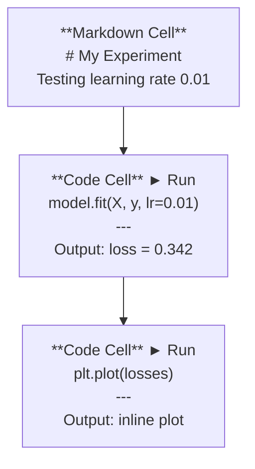
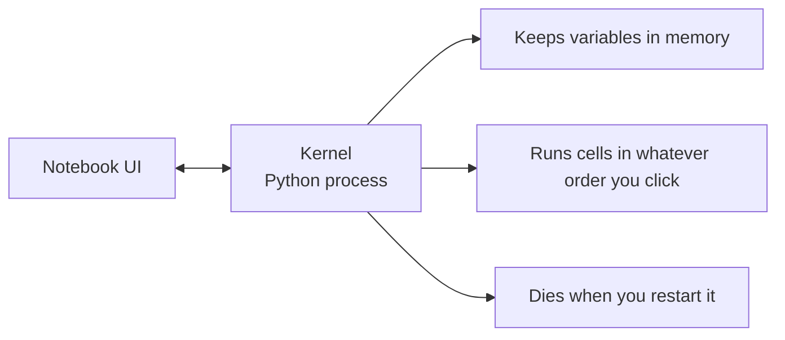

# Jupyter Notebooks

> Notebooks 是 lab bench 的 AI engineering. You prototype here, then move what works into production.

**Type:** Build
**Languages:** Python
**Prerequisites:** Phase 0, Lesson 01
**Time:** ~30 minutes

## Learning Objectives

- Install 和 launch JupyterLab, Jupyter Notebook, 或 VS 代码 使用 Jupyter extension
- Use magic commands (`%timeit`, `%%time`, `%matplotlib inline`) 到 benchmark 和 visualize inline
- Distinguish when 到 use notebooks vs scripts 和 apply "explore 在 notebooks, ship 在 scripts" workflow
- Identify 和 avoid common notebook traps: out-的-order execution, hidden state, 和 memory leaks

## Problem

Every AI paper, tutorial, 和 Kaggle competition uses Jupyter notebooks. They let you run 代码 在 pieces, see 输出 inline, mix 代码 使用 explanations, 和 iterate fast. If you try 到 learn AI without notebooks, you're doing math homework without scratch paper.

But notebooks have real traps. People use them 为了 everything, including things they're terrible 在. Knowing when 到 use notebook 和 when 到 use script will save you 从 debugging nightmares later.

## Concept

notebook 是 list 的 cells. Each cell 是 either 代码 或 text.



kernel 是 Python process running 在 background. When you run cell, it sends 代码 到 kernel, which executes it 和 sends back result. All cells share same kernel, so variables persist between cells.



That "whatever order you click" part 是 both superpower 和 foot-gun.

## Build It

### Step 1: Pick your interface

Three options, one format:

| Interface | Install | Best 为了 |
|-----------|---------|----------|
| JupyterLab | `pip install jupyterlab` then `jupyter lab` | Full IDE experience, multiple tabs, file browser, terminal |
| Jupyter Notebook | `pip install notebook` then `jupyter notebook` | Simple, lightweight, one notebook 在 time |
| VS 代码 | Install "Jupyter" extension | Already 在 your editor, git integration, debugging |

All three read 和 write same `.ipynb` file. Pick whatever you like. JupyterLab 是 most common 在 AI work.

```bash
pip install jupyterlab
jupyter lab
```

### Step 2: Keyboard shortcuts matter

You operate 在 two modes. Press `Escape` 为了 command mode (blue bar 在 left), `Enter` 为了 edit mode (green bar).

**Command mode (most used):**

| Key | Action |
|-----|--------|
| `Shift+Enter` | Run cell, move 到 next |
| `` | Insert cell above |
| `B` | Insert cell below |
| `DD` | Delete cell |
| `M` | Convert 到 markdown |
| `Y` | Convert 到 代码 |
| `Z` | Undo cell operation |
| `Ctrl+Shift+H` | Show all shortcuts |

**Edit mode:**

| Key | Action |
|-----|--------|
| `Tab` | Autocomplete |
| `Shift+Tab` | Show 函数 signature |
| `Ctrl+/` | Toggle comment |

`Shift+Enter` 是 one you'll use thousand times day. Learn it first.

### Step 3: Cell types

**代码 cells** run Python 和 show 输出:

```python
import numpy as np
data = np.random.randn(1000)
data.mean(), data.std()
```

输出: `(0.0032, 0.9987)`

**Markdown cells** render formatted text. Use them 到 document what you're doing 和 why. Supports headers, bold, italic, LaTeX math (`$E = mc^2$`), tables, 和 images.

### Step 4: Magic commands

These aren't Python. They're Jupyter-specific commands start 使用 `%` (line magic) 或 `%%` (cell magic).

**Time your 代码:**

```python
%timeit np.random.randn(10000)
```

输出: `45.2 us +/- 1.3 us per loop`

```python
%%time
model.fit(X_train, y_train, epochs=10)
```

输出: `Wall time: 2.34 s`

`%timeit` runs 代码 many times 和 averages. `%%time` runs it once. Use `%timeit` 为了 microbenchmarks, `%%time` 为了 训练 runs.

**Enable inline plots:**

```python
%matplotlib inline
```

Every `plt.plot()` 或 `plt.show()` now renders directly 在 notebook.

**Install packages without leaving notebook:**

```python
!pip install scikit-learn
```

`!` prefix runs any shell command.

**Check environment variables:**

```python
%env CUDA_VISIBLE_DEVICES
```

### Step 5: Display rich 输出 inline

Notebooks auto-display last expression 在 cell. But you can control it:

```python
import pandas as pd

df = pd.DataFrame({
    "model": ["Linear", "Random Forest", "Neural Net"],
    "accuracy": [0.72, 0.89, 0.94],
    "training_time": [0.1, 2.3, 45.6]
})
df
```

This renders formatted HTML table, not text dump. Same 使用 plots:

```python
import matplotlib.pyplot as plt

plt.figure(figsize=(8, 4))
plt.plot([1, 2, 3, 4], [1, 4, 2, 3])
plt.title("Inline Plot")
plt.show()
```

plot appears right below cell. 这是 why notebooks dominate AI work. You see 数据, plot, 和 代码 together.

For images:

```python
from IPython.display import Image, display
display(Image(filename="architecture.png"))
```

### Step 6: Google Colab

Colab 是 free Jupyter notebook 在 cloud. It gives you GPU, pre-installed libraries, 和 Google Drive integration. No setup required.

1. Go 到 [colab.research.google.com](https://colab.research.google.com)
2. Upload any `.ipynb` file 从 这个 course
3. Runtime > Change runtime type > T4 GPU (free)

Colab differences 从 local Jupyter:
- Files don't persist between sessions (save 到 Drive 或 download)
- Pre-installed: numpy, pandas, matplotlib, torch, tensorflow, sklearn
- `从 google.colab import files` 到 upload/download files
- `从 google.colab import drive; drive.mount('/content/drive')` 为了 persistent storage
- Sessions time out after 90 minutes 的 inactivity (free tier)

## Use It

### Notebooks vs Scripts: When 到 use which

| Use notebooks 为了 | Use scripts 为了 |
|-------------------|-----------------|
| Exploring 数据集 | 训练 pipelines |
| Prototyping 模型 | Reusable utilities |
| Visualizing results | Anything 使用 `if __name__` |
| Explaining your work | 代码 runs 在 schedule |
| Quick experiments | Production 代码 |
| Course exercises | Packages 和 libraries |

rule: **explore 在 notebooks, ship 在 scripts**.

common workflow 在 AI:
1. Explore 数据 在 notebook
2. Prototype your 模型 在 notebook
3. Once it works, move 代码 到 `.py` files
4. Import 那些 `.py` files back into notebook 为了 further experiments

### Common traps

**Out-的-order execution.** You run cell 5, then cell 2, then cell 7. notebook works 在 your machine but breaks when someone runs it top 到 bottom. Fix: Kernel > Restart & Run All before sharing.

**Hidden state.** You delete cell but variable it created 是 still 在 memory. notebook looks clean but depends 在 ghost cell. Fix: Restart kernel regularly.

**Memory leaks.** Loading 4GB 数据集, 训练 模型, loading another 数据集. Nothing gets freed. Fix: `del variable_name` 和 `gc.collect()`, 或 restart kernel.

## Ship It

This lesson produces:
- `输出/prompt-notebook-helper.md` 为了 debugging notebook issues

## Exercises

1. Open JupyterLab, create notebook, 和 use `%timeit` 到 compare list comprehension vs numpy 为了 creating array 的 100,000 random numbers
2. Create notebook 使用 both markdown 和 代码 cells loads CSV, displays dataframe, 和 plots chart. Then run Kernel > Restart & Run All 到 verify it works top 到 bottom
3. Take 代码 从 `代码/notebook_tips.py`, paste it into Colab notebook, 和 run it 使用 free GPU

## Key Terms

| Term | What people say | What it actually means |
|------|----------------|----------------------|
| Kernel | " thing running my 代码" | separate Python process executes cells 和 keeps variables 在 memory |
| Cell | " 代码 block" | independently runnable unit 在 notebook, either 代码 或 markdown |
| Magic command | "Jupyter tricks" | Special commands prefixed 使用 `%` 或 `%%` control notebook environment |
| `.ipynb` | "Notebook file" | JSON file containing cells, 输出, 和 metadata. Stands 为了 IPython Notebook |

## Further Reading

- [JupyterLab Docs](https://jupyterlab.readthedocs.io/) 为了 full 特征 set
- [Google Colab FAQ](https://research.google.com/colaboratory/faq.html) 为了 Colab-specific limits 和 特征
- [28 Jupyter Notebook Tips](https://www.dataquest.io/blog/jupyter-notebook-tips-tricks-shortcuts/) 为了 power-user shortcuts
