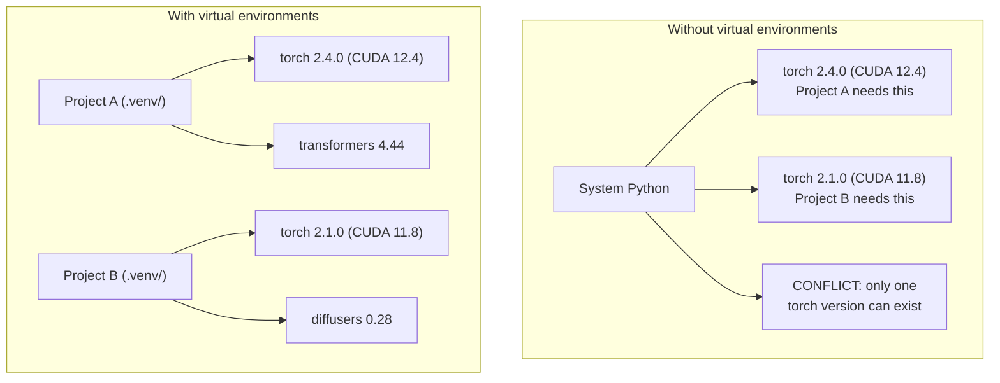

# Python Environments

> Dependency hell 是 real. Virtual environments 是 cure.

**Type:** Build
**Languages:** Shell
**Prerequisites:** Phase 0, Lesson 01
**Time:** ~30 minutes

## Learning Objectives

- Create isolated virtual environments using `uv`, `venv`, 或 `conda`
- Write `pyproject.toml` 使用 optional dependency groups 和 generate lockfiles 为了 reproducibility
- Diagnose 和 fix common pitfalls: global installs, pip/conda mixing, CUDA version mismatches
- Implement per-phase environment strategy 为了 projects 使用 conflicting dependencies

## Problem

You install PyTorch 2.4 为了 fine-tuning project. Next week, different project needs PyTorch 2.1 because its CUDA build 是 pinned. You upgrade globally, 和 first project breaks. You downgrade, 和 second one breaks.

这是 dependency hell. It happens constantly 在 AI/ML work because:

- PyTorch, JAX, 和 TensorFlow each ship their own CUDA bindings
- 模型 libraries pin specific framework versions
- global `pip install` overwrites whatever was there before
- CUDA 11.8 builds don't work 使用 CUDA 12.x drivers (和 vice versa)

fix: every project gets its own isolated environment 使用 its own packages.

## Concept



## Build It

### Option 1: uv venv (Recommended)

`uv` 是 fastest Python package manager (10-100x faster than pip). It handles virtual environments, Python versions, 和 dependency resolution 在 one tool.

```bash
curl -LsSf https://astral.sh/uv/install.sh | sh

uv python install 3.12

cd your-project
uv venv
source .venv/bin/activate
```

Install packages:

```bash
uv pip install torch numpy
```

Create project 使用 `pyproject.toml` 在 one step:

```bash
uv init my-ai-project
cd my-ai-project
uv add torch numpy matplotlib
```

### Option 2: venv (Built-在)

If you can't install `uv`, Python ships 使用 `venv`:

```bash
python3 -m venv .venv
source .venv/bin/activate  # Linux/macOS
.venv\Scripts\activate     # Windows

pip install torch numpy
```

Slower than `uv`, but works everywhere Python 是 installed.

### Option 3: conda (When You Need It)

Conda manages non-Python dependencies like CUDA toolkits, cuDNN, 和 C libraries. Use it when:

- 你需要 specific CUDA toolkit version without installing it system-wide
- You're 在 shared cluster where you can't install system packages
- library's install instructions say "use conda"

```bash
# Install miniconda (not the full Anaconda)
curl -LsSf https://repo.anaconda.com/miniconda/Miniconda3-latest-Linux-x86_64.sh -o miniconda.sh
bash miniconda.sh -b

conda create -n myproject python=3.12
conda activate myproject

conda install pytorch torchvision torchaudio pytorch-cuda=12.4 -c pytorch -c nvidia
```

One rule: if you use conda 为了 environment, use conda 为了 all packages 在 environment. Mixing `pip install` into conda env causes dependency conflicts 是 painful 到 debug.

### For This Course: Per-Phase Strategy

You could create one environment 为了 whole course. Don't. Different phases need different (sometimes conflicting) dependencies.

Strategy:

```
ai-engineering-from-scratch/
├── .venv/                    <-- shared lightweight env for phases 0-3
├── phases/
│   ├── 04-neural-networks/
│   │   └── .venv/            <-- PyTorch env
│   ├── 05-cnns/
│   │   └── .venv/            <-- same PyTorch env (symlink or shared)
│   ├── 08-transformers/
│   │   └── .venv/            <-- might need different transformer versions
│   └── 11-llm-apis/
│       └── .venv/            <-- API SDKs, no torch needed
```

script 在 `代码/env_setup.sh` creates base environment 为了 这个 course.

## pyproject.toml Basics

Every Python project should have `pyproject.toml`. It replaces `setup.py`, `setup.cfg`, 和 `requirements.txt` 在 one file.

```toml
[project]
name = "ai-engineering-from-scratch"
version = "0.1.0"
requires-python = ">=3.11"
dependencies = [
    "numpy>=1.26",
    "matplotlib>=3.8",
    "jupyter>=1.0",
    "scikit-learn>=1.4",
]

[project.optional-dependencies]
torch = ["torch>=2.3", "torchvision>=0.18"]
llm = ["anthropic>=0.39", "openai>=1.50"]
```

Then install:

```bash
uv pip install -e ".[torch]"    # base + PyTorch
uv pip install -e ".[llm]"     # base + LLM SDKs
uv pip install -e ".[torch,llm]" # everything
```

## Lockfiles

lockfile pins every dependency (including transitive ones) 到 exact versions. This guarantees reproducibility: anyone who installs 从 lockfile gets exactly same packages.

```bash
# uv generates uv.lock automatically when using uv add
uv add numpy

# pip-tools approach
uv pip compile pyproject.toml -o requirements.lock
uv pip install -r requirements.lock
```

Commit your lockfile 到 git. When someone clones repo, they install 从 lockfile 和 get identical versions.

## Common Mistakes

### 1. Installing globally

```bash
pip install torch  # BAD: installs to system Python

source .venv/bin/activate
pip install torch  # GOOD: installs to virtual environment
```

Check where your packages go:

```bash
which python       # should show .venv/bin/python, not /usr/bin/python
which pip           # should show .venv/bin/pip
```

### 2. Mixing pip 和 conda

```bash
conda create -n myenv python=3.12
conda activate myenv
conda install pytorch -c pytorch
pip install some-other-package   # BAD: can break conda's dependency tracking
conda install some-other-package # GOOD: let conda manage everything
```

If you must use pip inside conda (some packages 是 pip-only), install all conda packages first, then pip packages last.

### 3. Forgetting 到 activate

```bash
python train.py           # uses system Python, missing packages
source .venv/bin/activate
python train.py           # uses project Python, packages found
```

Your shell prompt should show environment name:

```
(.venv) $ python train.py
```

### 4. Committing .venv 到 git

```bash
echo ".venv/" >> .gitignore
```

Virtual environments 是 200MB-2GB. They're local, not portable between machines. Commit `pyproject.toml` 和 lockfile instead.

### 5. CUDA version mismatch

```bash
nvidia-smi                # shows driver CUDA version (e.g., 12.4)
python -c "import torch; print(torch.version.cuda)"  # shows PyTorch CUDA version

# These must be compatible.
# PyTorch CUDA version must be <= driver CUDA version.
```

## Use It

Run setup script 到 create your course environment:

```bash
bash phases/00-setup-and-tooling/06-python-environments/code/env_setup.sh
```

This creates `.venv` 在 repo root 使用 core dependencies installed 和 verified.

## Exercises

1. Run `env_setup.sh` 和 verify all checks pass
2. Create second virtual environment, install different version 的 numpy 在 it, 和 confirm two environments 是 isolated
3. Write `pyproject.toml` 为了 project needs both PyTorch 和 Anthropic SDK
4. Deliberately install package globally (without activating venv), notice where it goes, then uninstall it

## Key Terms

| Term | What people say | What it actually means |
|------|----------------|----------------------|
| Virtual environment | " venv" | isolated directory containing Python interpreter 和 packages, separate 从 system Python |
| Lockfile | "Pinned dependencies" | file listing every package 和 its exact version, guaranteeing identical installs across machines |
| pyproject.toml | " new setup.py" | standard Python project configuration file, replacing setup.py/setup.cfg/requirements.txt |
| Transitive dependency | " dependency 的 dependency" | Package B depends 在 C; if you install which depends 在 B, C 是 transitive dependency 的 |
| CUDA mismatch | "My GPU isn't working" | PyTorch was compiled 为了 different CUDA version than what your GPU driver supports |
