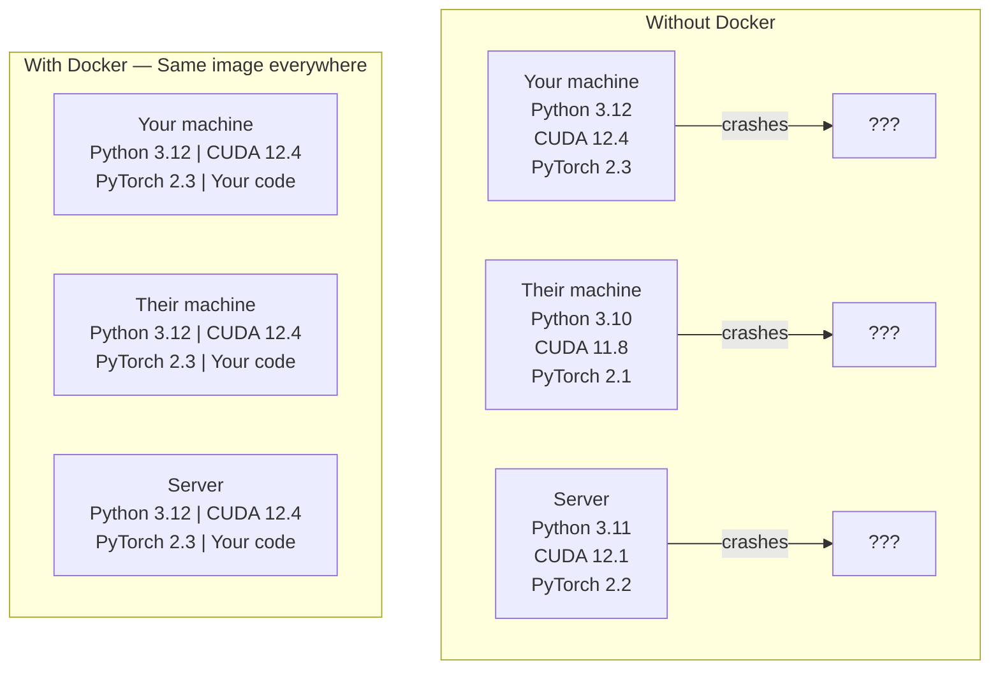

# Docker 为了 AI

> Containers make "works 在 my machine" thing 的 past.

**Type:** Build
**Languages:** Docker
**Prerequisites:** Phase 0, Lessons 01 和 03
**Time:** ~60 minutes

## Learning Objectives

- Build GPU-enabled Docker image 使用 CUDA, PyTorch, 和 AI libraries 从 Dockerfile
- Mount host directories 作为 volumes 到 persist 模型, 数据集, 和 代码 across container rebuilds
- Configure NVIDIA Container Toolkit 到 expose GPUs inside containers
- Orchestrate multi-service AI applications (inference server + 向量 database) using Docker Compose

## Problem

You trained 模型 在 your laptop 使用 PyTorch 2.3, CUDA 12.4, 和 Python 3.12. Your colleague has PyTorch 2.1, CUDA 11.8, 和 Python 3.10. Your 模型 crashes 在 their machine. Your Dockerfile works 在 both.

AI projects 是 dependency nightmares. typical stack includes Python, PyTorch, CUDA drivers, cuDNN, system-level C libraries, 和 specialized packages like flash-attn need exact compiler versions. Docker packages all 的 这个 into single image runs identically everywhere.

## Concept

Docker wraps your 代码, runtime, libraries, 和 system tools into isolated unit called container. Think 的 it 作为 lightweight virtual machine, except it shares host OS kernel instead 的 running its own, so it starts 在 seconds instead 的 minutes.



### Why AI projects need Docker more than most

1. **GPU drivers 是 fragile.** CUDA 12.4 代码 does not run 在 CUDA 11.8. Docker isolates CUDA toolkit inside container while sharing host GPU driver through NVIDIA Container Toolkit.

2. **模型 权重 是 large.** 7B 参数 模型 是 14 GB 在 fp16. You do not want 到 re-download it every time you rebuild. Docker volumes let you mount 模型 directory 从 host.

3. **Multi-service architectures 是 common.** real AI application 是 not just Python script. 它是 inference server, 向量 database 为了 RAG, maybe web frontend. Docker Compose orchestrates all 的 这些 使用 one command.

### Key vocabulary

| Term | What it means |
|------|---------------|
| Image | read-only template. Your recipe. Built 从 Dockerfile. |
| Container | running instance 的 image. Your kitchen. |
| Dockerfile | Instructions 到 build image. 层 通过 层. |
| Volume | Persistent storage survives container restarts. |
| docker-compose | tool 为了 defining multi-container applications 在 YAML. |

### Common container patterns 在 AI

```
Dev Container
  Full toolkit. Editor support. Jupyter. Debugging tools.
  Used during development and experimentation.

Training Container
  Minimal. Just the training script and dependencies.
  Runs on GPU clusters. No editor, no Jupyter.

Inference Container
  Optimized for serving. Small image. Fast cold start.
  Runs behind a load balancer in production.
```

## Build It

### Step 1: Install Docker

```bash
# macOS
brew install --cask docker
open /Applications/Docker.app

# Ubuntu
curl -fsSL https://get.docker.com | sh
sudo usermod -aG docker $USER
# Log out and back in for group change to take effect
```

Verify:

```bash
docker --version
docker run hello-world
```

### Step 2: Install NVIDIA Container Toolkit (Linux 使用 NVIDIA GPU)

This lets Docker containers access your GPU. macOS 和 Windows (WSL2) users can skip 这个; Docker Desktop handles GPU passthrough differently 在 那些 platforms.

```bash
distribution=$(. /etc/os-release;echo $ID$VERSION_ID)
curl -fsSL https://nvidia.github.io/libnvidia-container/gpgkey | sudo gpg --dearmor -o /usr/share/keyrings/nvidia-container-toolkit-keyring.gpg
curl -s -L https://nvidia.github.io/libnvidia-container/$distribution/libnvidia-container.list | \
    sed 's#deb https://#deb [signed-by=/usr/share/keyrings/nvidia-container-toolkit-keyring.gpg] https://#g' | \
    sudo tee /etc/apt/sources.list.d/nvidia-container-toolkit.list

sudo apt-get update
sudo apt-get install -y nvidia-container-toolkit
sudo nvidia-ctk runtime configure --runtime=docker
sudo systemctl restart docker
```

Test GPU access inside container:

```bash
docker run --rm --gpus all nvidia/cuda:12.4.1-base-ubuntu22.04 nvidia-smi
```

If you see your GPU info, toolkit 是 working.

### Step 3: Understand base images

Choosing right base image saves hours 的 debugging.

```
nvidia/cuda:12.4.1-devel-ubuntu22.04
  Full CUDA toolkit. Compilers included.
  Use for: building packages that need nvcc (flash-attn, bitsandbytes)
  Size: ~4 GB

nvidia/cuda:12.4.1-runtime-ubuntu22.04
  CUDA runtime only. No compilers.
  Use for: running pre-built code
  Size: ~1.5 GB

pytorch/pytorch:2.3.1-cuda12.4-cudnn9-runtime
  PyTorch pre-installed on top of CUDA.
  Use for: skipping the PyTorch install step
  Size: ~6 GB

python:3.12-slim
  No CUDA. CPU only.
  Use for: inference on CPU, lightweight tools
  Size: ~150 MB
```

### Step 4: Write Dockerfile 为了 AI development

Here 是 Dockerfile 在 `代码/Dockerfile`. Walk through it:

```dockerfile
FROM nvidia/cuda:12.4.1-devel-ubuntu22.04

ENV DEBIAN_FRONTEND=noninteractive
ENV PYTHONUNBUFFERED=1

RUN apt-get update && apt-get install -y --no-install-recommends \
    python3.12 \
    python3.12-venv \
    python3.12-dev \
    python3-pip \
    git \
    curl \
    build-essential \
    && rm -rf /var/lib/apt/lists/*

RUN update-alternatives --install /usr/bin/python python /usr/bin/python3.12 1

RUN python -m pip install --no-cache-dir --upgrade pip setuptools wheel

RUN python -m pip install --no-cache-dir \
    torch==2.3.1 \
    torchvision==0.18.1 \
    torchaudio==2.3.1 \
    --index-url https://download.pytorch.org/whl/cu124

RUN python -m pip install --no-cache-dir \
    numpy \
    pandas \
    scikit-learn \
    matplotlib \
    jupyter \
    transformers \
    datasets \
    accelerate \
    safetensors

WORKDIR /workspace

VOLUME ["/workspace", "/models"]

EXPOSE 8888

CMD ["python"]
```

Build it:

```bash
docker build -t ai-dev -f phases/00-setup-and-tooling/07-docker-for-ai/code/Dockerfile .
```

This takes while first time (downloading CUDA base image + PyTorch). Subsequent builds use cached 层.

Run it:

```bash
docker run --rm -it --gpus all \
    -v $(pwd):/workspace \
    -v ~/models:/models \
    ai-dev python -c "import torch; print(f'PyTorch {torch.__version__}, CUDA: {torch.cuda.is_available()}')"
```

Run Jupyter inside container:

```bash
docker run --rm -it --gpus all \
    -v $(pwd):/workspace \
    -v ~/models:/models \
    -p 8888:8888 \
    ai-dev jupyter notebook --ip=0.0.0.0 --port=8888 --no-browser --allow-root
```

### Step 5: Volume mounts 为了 数据 和 模型

Volume mounts 是 critical 为了 AI work. Without them, your 14 GB 模型 downloads vanish when container stops.

```bash
# Mount your code
-v $(pwd):/workspace

# Mount a shared models directory
-v ~/models:/models

# Mount datasets
-v ~/datasets:/data
```

Inside your 训练 script, load 从 mounted path:

```python
from transformers import AutoModel

model = AutoModel.from_pretrained("/models/llama-7b")
```

模型 lives 在 your host filesystem. Rebuild container 作为 often 作为 you want without re-downloading.

### Step 6: Docker Compose 为了 multi-service AI apps

real RAG application needs inference server 和 向量 database. Docker Compose runs both 使用 one command.

See `代码/docker-compose.yml`:

```yaml
services:
  ai-dev:
    build:
      context: .
      dockerfile: Dockerfile
    deploy:
      resources:
        reservations:
          devices:
            - driver: nvidia
              count: all
              capabilities: [gpu]
    volumes:
      - ../../../:/workspace
      - ~/models:/models
      - ~/datasets:/data
    ports:
      - "8888:8888"
    stdin_open: true
    tty: true
    command: jupyter notebook --ip=0.0.0.0 --port=8888 --no-browser --allow-root

  qdrant:
    image: qdrant/qdrant:v1.12.5
    ports:
      - "6333:6333"
      - "6334:6334"
    volumes:
      - qdrant_data:/qdrant/storage

volumes:
  qdrant_data:
```

Start everything:

```bash
cd phases/00-setup-and-tooling/07-docker-for-ai/code
docker compose up -d
```

Now your AI dev container can reach 向量 database 在 `http://qdrant:6333` 通过 service name. Docker Compose creates shared network automatically.

Test connection 从 inside AI container:

```python
from qdrant_client import QdrantClient

client = QdrantClient(host="qdrant", port=6333)
print(client.get_collections())
```

Stop everything:

```bash
docker compose down
```

Add `-v` 到 also delete qdrant volume:

```bash
docker compose down -v
```

### Step 7: Useful Docker commands 为了 AI work

```bash
# List running containers
docker ps

# List all images and their sizes
docker images

# Remove unused images (reclaim disk space)
docker system prune -a

# Check GPU usage inside a running container
docker exec -it <container_id> nvidia-smi

# Copy a file from container to host
docker cp <container_id>:/workspace/results.csv ./results.csv

# View container logs
docker logs -f <container_id>
```

## Use It

You now have reproducible AI development environment. For rest 的 这个 course:

- Use `docker compose up` 到 start your dev environment 和 向量 database together
- Mount your 代码, 模型, 和 数据 作为 volumes so nothing 是 lost between rebuilds
- When lesson requires new Python package, add it 到 Dockerfile 和 rebuild
- Share your Dockerfile 使用 teammates. They get exact same environment.

### No GPU?

Remove `--gpus all` flag 和 NVIDIA deploy block. container still works 为了 CPU-based lessons. PyTorch detects absence 的 CUDA 和 falls back 到 CPU automatically.

## Exercises

1. Build Dockerfile 和 run `python -c "import torch; print(torch.__version__)"` inside container
2. Start docker-compose stack 和 verify Qdrant 是 accessible 从 AI container 在 `http://qdrant:6333/collections`
3. Add `flask` 到 Dockerfile, rebuild, 和 run simple API server 在 port 5000. Map port 使用 `-p 5000:5000`
4. Measure image size 使用 `docker images`. Try switching base image 从 `devel` 到 `runtime` 和 compare sizes

## Key Terms

| Term | What people say | What it actually means |
|------|----------------|----------------------|
| Container | "Lightweight VM" | isolated process using host kernel, 使用 its own filesystem 和 network |
| Image 层 | "Cached step" | Each Dockerfile instruction creates 层. Unchanged 层 是 cached, so rebuilds 是 fast. |
| NVIDIA Container Toolkit | "GPU 在 Docker" | runtime hook exposes host GPUs 到 containers via `--gpus` flag |
| Volume mount | "Shared folder" | directory 在 host mapped into container. Changes persist after container stops. |
| Base image | "Starting point" | `FROM` image your Dockerfile builds 在 top 的. Determines what 是 pre-installed. |
