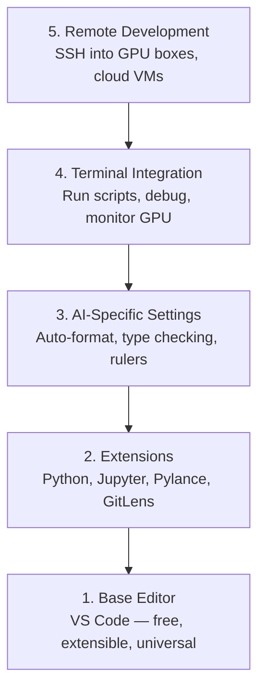

# Editor Setup

> Your editor 是 your co-pilot. Configure it once so it stays out 的 your way 和 starts pulling its 权重.

**Type:** Build
**Languages:** --
**Prerequisites:** Phase 0, Lesson 01
**Time:** ~20 minutes

## Learning Objectives

- Install VS 代码 使用 essential extensions 为了 Python, Jupyter, linting, 和 remote SSH
- Configure format-在-save, type checking, 和 notebook 输出 scrolling 为了 AI workflows
- Set up Remote SSH 到 edit 和 debug 代码 在 remote GPU machines 作为 if they were local
- Evaluate editor alternatives (Cursor, Windsurf, Neovim) 和 their tradeoffs 为了 AI work

## Problem

You'll spend thousands 的 hours inside your editor writing Python, running notebooks, debugging 训练 loops, 和 SSH-ing into GPU boxes. misconfigured editor turns every session into friction: no autocomplete, no type hints, no inline errors, manual formatting, 和 clunky terminal workflow.

right setup takes 20 minutes. Skipping it costs you 20 minutes every day.

## Concept

AI engineering editor setup needs five things:



## Build It

### Step 1: Install VS 代码

VS 代码 是 recommended editor. 它是 free, runs 在 every OS, has first-class Jupyter notebook support, 和 extension ecosystem covers everything you need 为了 AI work.

Download it 从 [代码.visualstudio.com](https://代码.visualstudio.com/).

Verify 从 terminal:

```bash
code --version
```

If `代码` 是 not found 在 macOS, open VS 代码, press `Cmd+Shift+P`, type "Shell Command", 和 select "Install '代码' command 在 PATH".

### Step 2: Install Essential Extensions

Open integrated terminal 在 VS 代码 (`Ctrl+`` ` 或 `` Cmd+` ``) 和 install extensions matter 为了 AI work:

```bash
code --install-extension ms-python.python
code --install-extension ms-python.vscode-pylance
code --install-extension ms-toolsai.jupyter
code --install-extension eamodio.gitlens
code --install-extension ms-vscode-remote.remote-ssh
code --install-extension ms-python.debugpy
code --install-extension ms-python.black-formatter
code --install-extension charliermarsh.ruff
```

What each one does:

| Extension | Why |
|-----------|-----|
| Python | Language support, virtual env detection, run/debug |
| Pylance | Fast type checking, autocomplete, import resolution |
| Jupyter | Run notebooks inside VS 代码, variable explorer |
| GitLens | See who changed what, inline git blame |
| Remote SSH | Open folder 在 remote GPU box 作为 if it were local |
| Debugpy | Step-through debugging 为了 Python |
| Black Formatter | Auto-format 在 save, consistent style |
| Ruff | Fast linting, catches common mistakes |

file `代码/.vscode/extensions.json` 在 这个 lesson contains full recommendations list. When you open project folder, VS 代码 will prompt you 到 install them.

### Step 3: Configure Settings

Copy settings 从 `代码/.vscode/settings.json` 在 这个 lesson, 或 apply them manually through `Settings > Open Settings (JSON)`.

key settings 为了 AI work:

```jsonc
{
    "python.analysis.typeCheckingMode": "basic",
    "editor.formatOnSave": true,
    "editor.rulers": [88, 120],
    "notebook.output.scrolling": true,
    "files.autoSave": "afterDelay"
}
```

Why 这些 matter:

- **Type checking 在 basic**: Catches wrong argument types before you run. Saves debugging time 在 张量 shape mismatches 和 wrong API 参数.
- **Format 在 save**: Never think about formatting again. Black handles it.
- **Rulers 在 88 和 120**: Black wraps 在 88. 120 marker shows when docstrings 和 comments 是 getting too long.
- **Notebook 输出 scrolling**: 训练 loops print thousands 的 lines. Without scrolling, 输出 panel explodes.
- **Auto-save**: You will forget 到 save. Your 训练 script will run stale 代码. Auto-save prevents .

### Step 4: Terminal Integration

VS 代码's integrated terminal 是 where you run 训练 scripts, monitor GPUs, 和 manage environments.

Set it up properly:

```jsonc
{
    "terminal.integrated.defaultProfile.osx": "zsh",
    "terminal.integrated.defaultProfile.linux": "bash",
    "terminal.integrated.fontSize": 13,
    "terminal.integrated.scrollback": 10000
}
```

Useful shortcuts:

| Action | macOS | Linux/Windows |
|--------|-------|---------------|
| Toggle terminal | `` Ctrl+` `` | `` Ctrl+` `` |
| New terminal | `Ctrl+Shift+`` ` | `Ctrl+Shift+`` ` |
| Split terminal | `Cmd+\` | `Ctrl+\` |

Split terminals 是 useful: one 为了 running your script, one 为了 monitoring GPU 使用 `nvidia-smi -l 1` 或 `watch -n 1 nvidia-smi`.

### Step 5: Remote Development (SSH into GPU Boxes)

这是 most important extension 为了 AI work. You will run 训练 在 remote machines (cloud VMs, lab servers, Lambda, Vast.ai). Remote SSH lets you open remote filesystem, edit files, run terminals, 和 debug 作为 if everything were local.

Setup:

1. Install Remote SSH extension (done 在 Step 2).
2. Press `Ctrl+Shift+P` (或 `Cmd+Shift+P`), type "Remote-SSH: Connect 到 Host".
3. Enter `user@your-gpu-box-ip`.
4. VS 代码 installs its server component 在 remote machine automatically.

For passwordless access, set up SSH keys:

```bash
ssh-keygen -t ed25519 -C "your-email@example.com"
ssh-copy-id user@your-gpu-box-ip
```

Add host 到 `~/.ssh/config` 为了 convenience:

```
Host gpu-box
    HostName 203.0.113.50
    User ubuntu
    IdentityFile ~/.ssh/id_ed25519
    ForwardAgent yes
```

Now `Remote-SSH: Connect 到 Host > gpu-box` connects instantly.

## Alternatives

### Cursor

[cursor.com](https://cursor.com) 是 VS 代码 fork 使用 built-在 AI 代码 generation. It uses same extension ecosystem 和 settings format. If you use Cursor, everything 在 这个 lesson still applies. Import same `settings.json` 和 `extensions.json`.

### Windsurf

[windsurf.com](https://windsurf.com) 是 another AI-first VS 代码 fork. Same story: same extensions, same settings format, same Remote SSH support.

### Vim/Neovim

If you already use Vim 或 Neovim 和 是 productive 在 it, stay there. minimum setup 为了 AI Python work:

- **pyright** 或 **pylsp** 为了 type checking (via Mason 或 manual install)
- **nvim-lspconfig** 为了 language server integration
- **jupyter-vim** 或 **molten-nvim** 为了 notebook-like execution
- **telescope.nvim** 为了 file/symbol search
- **none-ls.nvim** 使用 black 和 ruff 为了 formatting/linting

If you do not already use Vim, do not start now. learning curve will compete 使用 learning AI engineering. Use VS 代码.

## Use It

With 这个 setup, your daily workflow looks like:

1. Open project folder 在 VS 代码 (或 connect via Remote SSH 到 GPU box).
2. Write Python 在 editor 使用 autocomplete, type hints, 和 inline errors.
3. Run Jupyter notebooks inline 使用 Jupyter extension.
4. Use integrated terminal 为了 训练 scripts, `uv pip install`, 和 GPU monitoring.
5. Review changes 使用 GitLens before committing.

## Exercises

1. Install VS 代码 和 all extensions listed 在 Step 2
2. Copy `settings.json` 从 这个 lesson into your VS 代码 config
3. Open Python file 和 verify Pylance shows type hints 和 Black formats 在 save
4. If you have access 到 remote machine, set up Remote SSH 和 open folder 在 it

## Key Terms

| Term | What people say | What it actually means |
|------|----------------|----------------------|
| LSP | "Autocomplete engine" | Language Server Protocol: standard 为了 editors 到 get type info, completions, 和 diagnostics 从 language-specific server |
| Pylance | " Python plugin" | Microsoft's Python language server using Pyright 为了 type checking 和 IntelliSense |
| Remote SSH | "Working 在 server" | VS 代码 extension runs lightweight server 在 remote machine 和 streams UI 到 your local editor |
| Format 在 save | "Auto-prettier" | editor runs formatter (Black, Ruff) every time you save, so 代码 style 是 always consistent |
