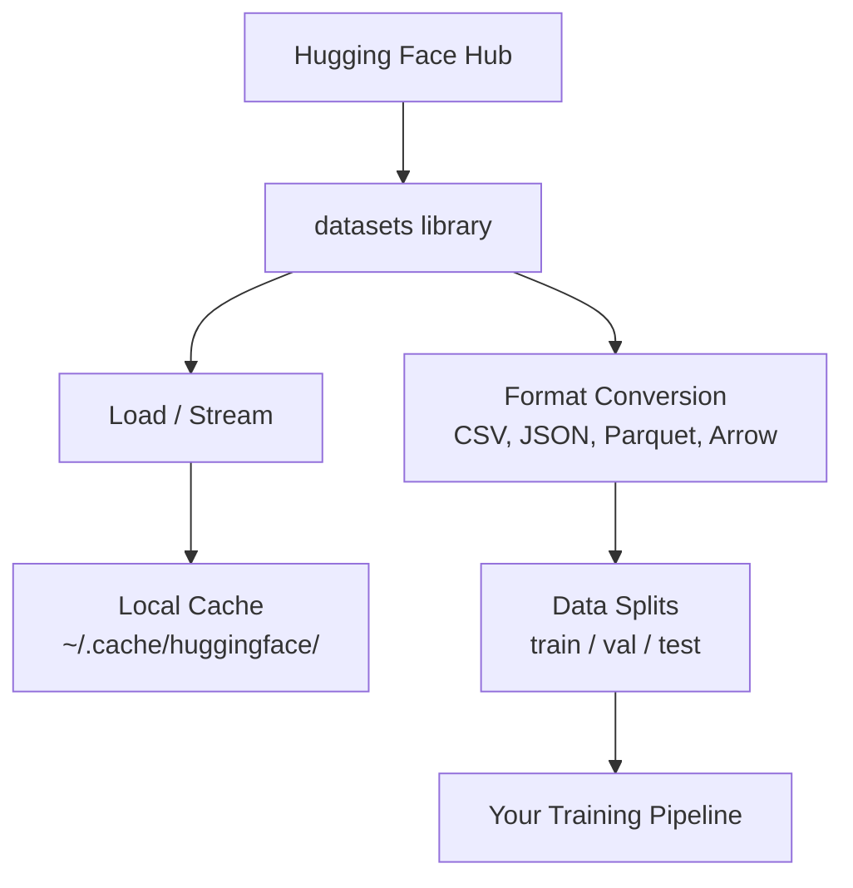

# 数据 Management

> 数据 是 fuel. How you manage it determines how fast you go.

**Type:** Build
**Language:** Python
**Prerequisites:** Phase 0, Lesson 01
**Time:** ~45 minutes

## Learning Objectives

- Load, stream, 和 cache 数据集 using Hugging Face `数据集` library
- Convert between CSV, JSON, Parquet, 和 Arrow formats 和 explain their tradeoffs
- Create reproducible train/验证/test splits 使用 fixed random seeds
- Manage large 模型 和 数据集 files using `.gitignore`, Git LFS, 或 DVC

## Problem

Every AI project starts 使用 数据. 你需要 到 find 数据集, download them, convert between formats, split them 为了 训练 和 evaluation, 和 version them so experiments 是 reproducible. Doing 这个 manually every time 是 slow 和 error-prone. 你需要 repeatable workflow.

## Concept



Hugging Face `数据集` library 是 standard way 到 load 数据 为了 AI work. It handles downloading, caching, format conversion, 和 streaming out 的 box.

## Build It

### Step 1: Install 数据集 library

```bash
pip install datasets huggingface_hub
```

### Step 2: Load 数据集

```python
from datasets import load_dataset

dataset = load_dataset("imdb")
print(dataset)
print(dataset["train"][0])
```

This downloads IMDB movie review 数据集. After first download, it loads 从 cache 在 `~/.cache/huggingface/数据集/`.

### Step 3: Stream large 数据集

Some 数据集 是 too large 到 fit 在 disk. Streaming loads them row 通过 row without downloading full thing.

```python
dataset = load_dataset("wikimedia/wikipedia", "20220301.en", split="train", streaming=True)

for i, example in enumerate(dataset):
    print(example["title"])
    if i >= 4:
        break
```

Streaming gives you `IterableDataset`. You process rows 作为 they arrive. Memory usage stays constant regardless 的 数据集 size.

### Step 4: 数据集 formats

`数据集` library uses Apache Arrow under hood. 你可以 convert 到 other formats depending 在 what your pipeline needs.

```python
dataset = load_dataset("imdb", split="train")

dataset.to_csv("imdb_train.csv")
dataset.to_json("imdb_train.json")
dataset.to_parquet("imdb_train.parquet")
```

Format comparison:

| Format | Size | Read Speed | Best For |
|--------|------|-----------|----------|
| CSV | Large | Slow | Human readability, spreadsheets |
| JSON | Large | Slow | APIs, nested 数据 |
| Parquet | Small | Fast | Analytics, columnar queries |
| Arrow | Small | Fastest | In-memory processing (what `数据集` uses internally) |

For AI work, Parquet 是 best storage format. Arrow 是 what you work 使用 在 memory. CSV 和 JSON 是 为了 interchange.

### Step 5: 数据 splits

Every ML project needs three splits:

- **Train**: 模型 learns 从 这个 (typically 80%)
- **验证**: You check progress during 训练 (typically 10%)
- **Test**: Final evaluation after 训练 是 done (typically 10%)

Some 数据集 come pre-split. When they don't, split them yourself:

```python
dataset = load_dataset("imdb", split="train")

split = dataset.train_test_split(test_size=0.2, seed=42)
train_val = split["train"].train_test_split(test_size=0.125, seed=42)

train_ds = train_val["train"]
val_ds = train_val["test"]
test_ds = split["test"]

print(f"Train: {len(train_ds)}, Val: {len(val_ds)}, Test: {len(test_ds)}")
```

Always set seed 为了 reproducibility. same seed produces same split every time.

### Step 6: Download 和 cache 模型

Models 是 large files. `huggingface_hub` library handles downloading 和 caching.

```python
from huggingface_hub import hf_hub_download, snapshot_download

model_path = hf_hub_download(
    repo_id="sentence-transformers/all-MiniLM-L6-v2",
    filename="config.json"
)
print(f"Cached at: {model_path}")

model_dir = snapshot_download("sentence-transformers/all-MiniLM-L6-v2")
print(f"Full model at: {model_dir}")
```

Models cache 到 `~/.cache/huggingface/hub/`. Once downloaded, they load instantly 在 subsequent runs.

### Step 7: Handle large files

模型 权重 和 large 数据集 should not go into git. Three options:

**Option : .gitignore (simplest)**

```
*.bin
*.safetensors
*.pt
*.onnx
data/*.parquet
data/*.csv
models/
```

**Option B: Git LFS (track large files 在 git)**

```bash
git lfs install
git lfs track "*.bin"
git lfs track "*.safetensors"
git add .gitattributes
```

Git LFS stores pointers 在 your repo 和 actual files 在 separate server. GitHub gives you 1 GB free.

**Option C: DVC (数据 version control)**

```bash
pip install dvc
dvc init
dvc add data/training_set.parquet
git add data/training_set.parquet.dvc data/.gitignore
git commit -m "Track training data with DVC"
```

DVC creates small `.dvc` files point 到 your 数据. 数据 itself lives 在 S3, GCS, 或 another remote storage backend.

| Approach | Complexity | Best For |
|----------|-----------|----------|
| .gitignore | Low | Personal projects, downloaded 数据 you can re-fetch |
| Git LFS | Medium | Teams sharing 模型 权重 via git |
| DVC | High | Reproducible experiments, large 数据集, teams |

For 这个 course, `.gitignore` 是 enough. Use DVC when you need 到 reproduce exact experiments across machines.

### Step 8: Storage patterns

**Local storage** works 为了 数据集 under ~10 GB. HF cache handles 这个 automatically.

**Cloud storage** 是 为了 anything larger 或 shared across machines:

```python
import os

local_path = os.path.expanduser("~/.cache/huggingface/datasets/")

# s3_path = "s3://my-bucket/datasets/"
# gcs_path = "gs://my-bucket/datasets/"
```

DVC integrates 使用 S3 和 GCS directly:

```bash
dvc remote add -d myremote s3://my-bucket/dvc-store
dvc push
```

For 这个 course, local storage 是 sufficient. Cloud storage becomes relevant when you fine-tune 在 remote GPU instances.

## Datasets Used 在 This Course

| 数据集 | Lessons | Size | What It Teaches |
|---------|---------|------|----------------|
| IMDB | Tokenization, 分类 | 84 MB | Text 分类 basics |
| WikiText | Language modeling | 181 MB | Next-token prediction |
| SQuAD | QA systems | 35 MB | Question answering, spans |
| Common Crawl (subset) | Embeddings | Varies | Large-scale text processing |
| MNIST | Vision basics | 21 MB | Image 分类 fundamentals |
| COCO (subset) | Multimodal | Varies | Image-text pairs |

You do not need 到 download all 的 这些 now. Each lesson specifies what it needs.

## Use It

Run utility script 到 verify everything works:

```bash
python code/data_utils.py
```

This downloads small 数据集, converts it, splits it, 和 prints summary.

## Ship It

This lesson produces:
- `代码/data_utils.py` - reusable 数据 loading 和 caching utility
- `输出/prompt-数据-helper.md` - prompt 为了 finding right 数据集 为了 task

## Exercises

1. Load `glue` 数据集 使用 `mrpc` config 和 inspect first 5 examples
2. Stream `c4` 数据集 和 count how many examples you can process 在 10 seconds
3. Convert 数据集 到 Parquet 和 compare file size 到 CSV
4. Create 70/15/15 train/val/test split 使用 fixed seed 和 verify sizes

## Key Terms

| Term | What people say | What it actually means |
|------|----------------|----------------------|
| 数据集 split | "训练 数据" | named subset (train/val/test) used 在 different stages 的 ML lifecycle |
| Streaming | "Load it lazily" | Processing 数据 row 通过 row 从 remote source without downloading full 数据集 |
| Parquet | "Compressed CSV" | columnar file format optimized 为了 analytical queries 和 storage efficiency |
| Arrow | "Fast dataframe" | 在-memory columnar format used internally 通过 数据集 library 为了 zero-copy reads |
| Git LFS | "Git 为了 big files" | extension stores large files outside git repo while keeping pointers 在 version control |
| DVC | "Git 为了 数据" | version control system 为了 数据集 和 模型 integrates 使用 cloud storage |
| Cache | "Already downloaded" | local copy 的 previously fetched 数据, stored 在 ~/.cache/huggingface/ 通过 default |
