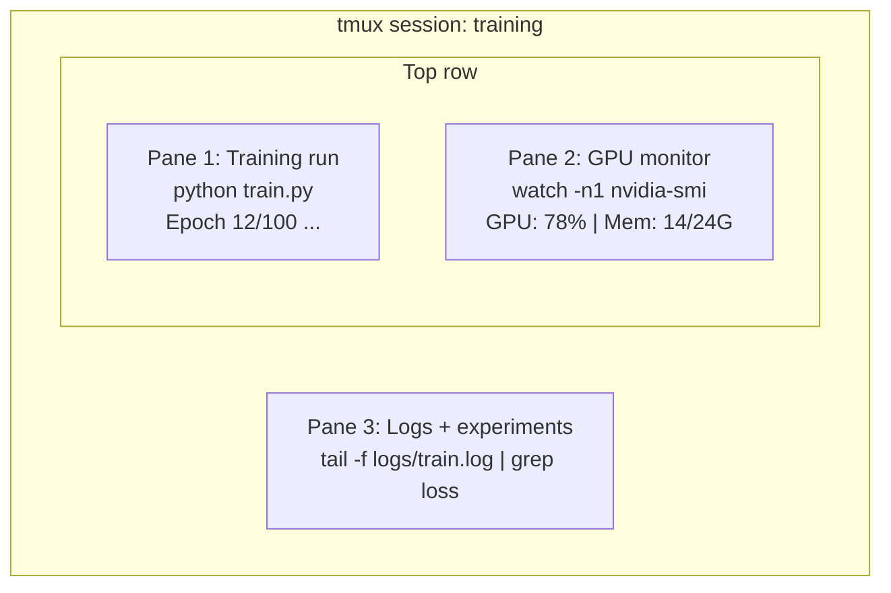

# Terminal & Shell

> terminal 是 where AI engineers live. Get comfortable here.

**Type:** Learn
**Languages:** --
**Prerequisites:** Phase 0, Lesson 01
**Time:** ~35 minutes

## Learning Objectives

- Use piping, redirects, 和 `grep` 到 filter 和 process 训练 logs 从 command line
- Create persistent tmux sessions 使用 multiple panes 为了 concurrent 训练 和 GPU monitoring
- Monitor system 和 GPU resources 使用 `htop`, `nvtop`, 和 `nvidia-smi`
- Transfer files between local 和 remote machines using SSH, `scp`, 和 `rsync`

## Problem

You will spend more time 在 terminal than 在 any editor. 训练 runs, GPU monitoring, log tailing, remote SSH sessions, environment management. Every AI workflow touches shell. If you're slow here, you're slow everywhere.

This lesson covers terminal skills matter 为了 AI work. No history 的 Unix. No deep-dive into Bash scripting. Just what you need.

## Concept



Three things running 在 once. One terminal. 你可以 detach, go home, SSH back 在, 和 reattach. 训练 keeps running.

## Build It

### Step 1: Know your shell

Check which shell you're running:

```bash
echo $SHELL
```

Most systems use `bash` 或 `zsh`. Both work fine. commands 在 这个 course work 在 either.

Key things 到 know:

```bash
# Move around
cd ~/projects/ai-engineering-from-scratch
pwd
ls -la

# History search (most useful shortcut you'll learn)
# Ctrl+R then type part of a previous command
# Press Ctrl+R again to cycle through matches

# Clear terminal
clear   # or Ctrl+L

# Cancel a running command
# Ctrl+C

# Suspend a running command (resume with fg)
# Ctrl+Z
```

### Step 2: Piping 和 redirects

Piping connects commands together. 这是 how you process logs, filter 输出, 和 chain tools. You will use 这个 constantly.

```bash
# Count how many times "loss" appears in a log
cat train.log | grep "loss" | wc -l

# Extract just the loss values from training output
grep "loss:" train.log | awk '{print $NF}' > losses.txt

# Watch a log file update in real time, filtering for errors
tail -f train.log | grep --line-buffered "ERROR"

# Sort experiments by final accuracy
grep "final_accuracy" results/*.log | sort -t= -k2 -n -r

# Redirect stdout and stderr to separate files
python train.py > output.log 2> errors.log

# Redirect both to the same file
python train.py > train_full.log 2>&1
```

three redirects you need:

| Symbol | What it does |
|--------|-------------|
| `>` | Write stdout 到 file (overwrite) |
| `>>` | Append stdout 到 file |
| `2>` | Write stderr 到 file |
| `2>&1` | Send stderr 到 same place 作为 stdout |
| `\|` | Send stdout 的 one command 作为 stdin 到 next |

### Step 3: Background processes

训练 runs take hours. You don't want 到 keep your terminal open whole time.

```bash
# Run in background (output still goes to terminal)
python train.py &

# Run in background, immune to hangup (closing terminal won't kill it)
nohup python train.py > train.log 2>&1 &

# Check what's running in background
jobs
ps aux | grep train.py

# Bring a background job to foreground
fg %1

# Kill a background process
kill %1
# or find its PID and kill that
kill $(pgrep -f "train.py")
```

difference between `&`, `nohup`, 和 `screen`/`tmux`:

| Method | Survives terminal close? | Can reattach? |
|--------|-------------------------|---------------|
| `command &` | No | No |
| `nohup command &` | Yes | No (check log file) |
| `screen` / `tmux` | Yes | Yes |

For anything longer than few minutes, use tmux.

### Step 4: tmux

tmux lets you create persistent terminal sessions 使用 multiple panes. 这是 single most useful tool 为了 managing 训练 runs.

```bash
# Install
# macOS
brew install tmux
# Ubuntu
sudo apt install tmux

# Start a named session
tmux new -s training

# Split horizontally
# Ctrl+B then "

# Split vertically
# Ctrl+B then %

# Navigate between panes
# Ctrl+B then arrow keys

# Detach (session keeps running)
# Ctrl+B then d

# Reattach
tmux attach -t training

# List sessions
tmux ls

# Kill a session
tmux kill-session -t training
```

typical AI workflow session:

```bash
tmux new -s train

# Pane 1: start training
python train.py --epochs 100 --lr 1e-4

# Ctrl+B, " to split, then run GPU monitor
watch -n1 nvidia-smi

# Ctrl+B, % to split vertically, tail the logs
tail -f logs/experiment.log

# Now detach with Ctrl+B, d
# SSH out, go get coffee, come back
# tmux attach -t train
```

### Step 5: Monitoring 使用 htop 和 nvtop

```bash
# System processes (better than top)
htop

# GPU processes (if you have NVIDIA GPU)
# Install: sudo apt install nvtop (Ubuntu) or brew install nvtop (macOS)
nvtop

# Quick GPU check without nvtop
nvidia-smi

# Watch GPU usage update every second
watch -n1 nvidia-smi

# See which processes are using the GPU
nvidia-smi --query-compute-apps=pid,name,used_memory --format=csv
```

`htop` keybindings you'll use:
- `F6` 或 `>` 到 sort 通过 column (sort 通过 memory 到 find memory leaks)
- `F5` 到 toggle tree view (see child processes)
- `F9` 到 kill process
- `/` 到 search 为了 process name

### Step 6: SSH 为了 remote GPU boxes

When you rent cloud GPU (Lambda, RunPod, Vast.ai), you connect via SSH.

```bash
# Basic connection
ssh user@gpu-box-ip

# With a specific key
ssh -i ~/.ssh/my_gpu_key user@gpu-box-ip

# Copy files to remote
scp model.pt user@gpu-box-ip:~/models/

# Copy files from remote
scp user@gpu-box-ip:~/results/metrics.json ./

# Sync a whole directory (faster for many files)
rsync -avz ./data/ user@gpu-box-ip:~/data/

# Port forward (access remote Jupyter/TensorBoard locally)
ssh -L 8888:localhost:8888 user@gpu-box-ip
# Now open localhost:8888 in your browser

# SSH config for convenience
# Add to ~/.ssh/config:
# Host gpu
#     HostName 192.168.1.100
#     User ubuntu
#     IdentityFile ~/.ssh/gpu_key
#
# Then just:
# ssh gpu
```

### Step 7: Useful aliases 为了 AI work

Add 这些 到 your `~/.bashrc` 或 `~/.zshrc`:

```bash
source phases/00-setup-and-tooling/10-terminal-and-shell/code/shell_aliases.sh
```

Or copy ones you want. key aliases:

```bash
# GPU status at a glance
alias gpu='nvidia-smi --query-gpu=index,name,utilization.gpu,memory.used,memory.total,temperature.gpu --format=csv,noheader'

# Kill all Python training processes
alias killtraining='pkill -f "python.*train"'

# Quick virtual environment activate
alias ae='source .venv/bin/activate'

# Watch training loss
alias watchloss='tail -f logs/*.log | grep --line-buffered "loss"'
```

See `代码/shell_aliases.sh` 为了 full set.

### Step 8: Common AI terminal patterns

These come up repeatedly 在 practice:

```bash
# Run training, log everything, notify when done
python train.py 2>&1 | tee train.log; echo "DONE" | mail -s "Training complete" you@email.com

# Compare two experiment logs side by side
diff <(grep "accuracy" exp1.log) <(grep "accuracy" exp2.log)

# Find the largest model files (clean up disk space)
find . -name "*.pt" -o -name "*.safetensors" | xargs du -h | sort -rh | head -20

# Download a model from Hugging Face
wget https://huggingface.co/model/resolve/main/model.safetensors

# Untar a dataset
tar xzf dataset.tar.gz -C ./data/

# Count lines in all Python files (see how big your project is)
find . -name "*.py" | xargs wc -l | tail -1

# Check disk space (training data fills disks fast)
df -h
du -sh ./data/*

# Environment variable check before training
env | grep -i cuda
env | grep -i torch
```

## Use It

Here's when each tool comes into play during 这个 course:

| Tool | When you use it |
|------|----------------|
| tmux | Every 训练 run (Phases 3+) |
| `tail -f` + `grep` | Monitoring 训练 logs |
| `nohup` / `&` | Quick background tasks |
| `htop` / `nvtop` | Debugging slow 训练, OOM errors |
| SSH + `rsync` | Working 在 cloud GPUs |
| Piping + redirects | Processing experiment results |
| Aliases | Saving time 在 repetitive commands |

## Exercises

1. Install tmux, create session 使用 three panes, 和 run `htop` 在 one, `watch -n1 date` 在 another, 和 Python script 在 third. Detach 和 reattach.
2. Add aliases 从 `代码/shell_aliases.sh` 到 your shell config 和 reload 使用 `source ~/.zshrc` (或 `~/.bashrc`).
3. Create fake 训练 log 使用 `为了 i 在 $(seq 1 100); do echo "轮次 $i loss: $(echo "scale=4; 1/$i" | bc)"; sleep 0.1; done > fake_train.log` 和 then use `grep`, `tail`, 和 `awk` 到 extract just loss values.
4. Set up SSH config entry 为了 server you have access 到 (或 use `localhost` 到 practice syntax).

## Key Terms

| Term | What people say | What it actually means |
|------|----------------|----------------------|
| Shell | " terminal" | program interprets your commands (bash, zsh, fish) |
| tmux | "Terminal multiplexer" | program lets you run multiple terminal sessions inside one window, 和 detach/reattach |
| Pipe | " bar thing" | `\|` operator sends one command's 输出 作为 输入 到 another |
| PID | "Process ID" | unique number assigned 到 every running process, used 到 monitor 或 kill it |
| nohup | "No hangup" | Runs command immune 到 hangup signal, so closing terminal won't kill it |
| SSH | "Connecting 到 server" | Secure Shell, encrypted protocol 为了 running commands 在 remote machine |
