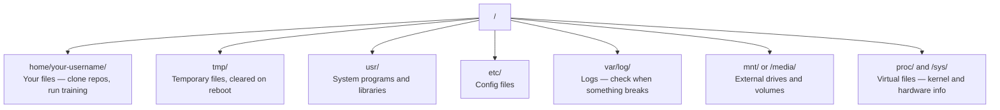

# Linux 为了 AI

> Most AI runs 在 Linux. 你需要 到 know enough 到 not be stuck.

**Type:** Learn
**Languages:** --
**Prerequisites:** Phase 0, Lesson 01
**Time:** ~30 minutes

## Learning Objectives

- Navigate Linux file system 和 perform essential file operations 从 command line
- Manage file permissions 使用 `chmod` 和 `chown` 到 resolve "Permission denied" errors
- Install system packages 使用 `apt` 和 set up fresh GPU box 为了 AI work
- Identify macOS-到-Linux differences commonly trip up developers working 在 remote machines

## Problem

You develop 在 macOS 或 Windows. But moment you SSH into cloud GPU box, rent Lambda instance, 或 spin up EC2 machine, you land 在 Ubuntu. terminal 是 your only interface. 有 no Finder, no Explorer, no GUI. If you can't navigate file system, install packages, 和 manage processes 从 command line, you're stuck paying 为了 idle GPU hours while googling "how 到 unzip file 在 Linux."

这是 survival guide. It covers exactly what you need 到 operate 在 remote Linux machine 为了 AI work. Nothing more.

## File System Layout

Linux organizes everything under single root `/`. 有 no `C:\` 或 `/Volumes`. directories you'll actually touch:



Your home directory 是 `~` 或 `/home/your-username`. Almost everything you do happens here.

## Essential Commands

These 是 15 commands cover 95% 的 what you'll do 在 remote GPU box.

### Moving Around

```bash
pwd                         # Where am I?
ls                          # What's here?
ls -la                      # What's here, including hidden files with details?
cd /path/to/dir             # Go there
cd ~                        # Go home
cd ..                       # Go up one level
```

### Files 和 Directories

```bash
mkdir my-project            # Create a directory
mkdir -p a/b/c              # Create nested directories in one shot

cp file.txt backup.txt      # Copy a file
cp -r src/ src-backup/      # Copy a directory (recursive)

mv old.txt new.txt          # Rename a file
mv file.txt /tmp/           # Move a file

rm file.txt                 # Delete a file (no trash, it's gone)
rm -rf my-dir/              # Delete a directory and everything inside
```

`rm -rf` 是 permanent. 有 no undo. Double-check path before hitting enter.

### Reading Files

```bash
cat file.txt                # Print entire file
head -20 file.txt           # First 20 lines
tail -20 file.txt           # Last 20 lines
tail -f log.txt             # Follow a log file in real time (Ctrl+C to stop)
less file.txt               # Scroll through a file (q to quit)
```

### Searching

```bash
grep "error" training.log           # Find lines containing "error"
grep -r "learning_rate" .           # Search all files in current directory
grep -i "cuda" config.yaml          # Case-insensitive search

find . -name "*.py"                 # Find all Python files under current dir
find . -name "*.ckpt" -size +1G     # Find checkpoint files larger than 1GB
```

## Permissions

Every file 在 Linux has owner 和 permission bits. You'll run into 这个 when scripts won't execute 或 you can't write 到 directory.

```bash
ls -l train.py
# -rwxr-xr-- 1 user group 2048 Mar 19 10:00 train.py
#  ^^^             owner permissions: read, write, execute
#     ^^^          group permissions: read, execute
#        ^^        everyone else: read only
```

Common fixes:

```bash
chmod +x train.sh           # Make a script executable
chmod 755 deploy.sh         # Owner: full, others: read+execute
chmod 644 config.yaml       # Owner: read+write, others: read only

chown user:group file.txt   # Change who owns a file (needs sudo)
```

When something says "Permission denied," it's almost always permissions issue. `chmod +x` 或 `sudo` will fix most cases.

## Package Management (apt)

Ubuntu uses `apt`. 这是 how you install system-level software.

```bash
sudo apt update             # Refresh the package list (always do this first)
sudo apt install -y htop    # Install a package (-y skips confirmation)
sudo apt install -y build-essential  # C compiler, make, etc. Needed by many Python packages
sudo apt install -y tmux    # Terminal multiplexer (keep sessions alive after disconnect)

apt list --installed        # What's installed?
sudo apt remove htop        # Uninstall
```

Common packages you'll install 在 fresh GPU box:

```bash
sudo apt update && sudo apt install -y \
    build-essential \
    git \
    curl \
    wget \
    tmux \
    htop \
    unzip \
    python3-venv
```

## Users 和 sudo

You're usually logged 在 作为 regular user. Some operations need root (admin) access.

```bash
whoami                      # What user am I?
sudo command                # Run a single command as root
sudo su                     # Become root (exit to go back, use sparingly)
```

On cloud GPU instances, you're typically only user 和 already have sudo access. Don't run everything 作为 root. Use sudo only when needed.

## Processes 和 systemd

When your 训练 hangs, 或 you need 到 check what's running:

```bash
htop                        # Interactive process viewer (q to quit)
ps aux | grep python        # Find running Python processes
kill 12345                  # Gracefully stop process with PID 12345
kill -9 12345               # Force kill (use when graceful doesn't work)
nvidia-smi                  # GPU processes and memory usage
```

systemd manages services (background daemons). You'll use it if you run inference servers:

```bash
sudo systemctl start nginx          # Start a service
sudo systemctl stop nginx           # Stop it
sudo systemctl restart nginx        # Restart it
sudo systemctl status nginx         # Check if it's running
sudo systemctl enable nginx         # Start automatically on boot
```

## Disk Space

GPU boxes often have limited disk space. Models 和 数据集 fill it fast.

```bash
df -h                       # Disk usage for all mounted drives
df -h /home                 # Disk usage for /home specifically

du -sh *                    # Size of each item in current directory
du -sh ~/.cache             # Size of your cache (pip, huggingface models land here)
du -sh /data/checkpoints/   # Check how big your checkpoints are

# Find the biggest space hogs
du -h --max-depth=1 / 2>/dev/null | sort -hr | head -20
```

Common space savers:

```bash
# Clear pip cache
pip cache purge

# Clear apt cache
sudo apt clean

# Remove old checkpoints you don't need
rm -rf checkpoints/epoch_01/ checkpoints/epoch_02/
```

## Networking

You'll download 模型, transfer files, 和 hit APIs 从 command line.

```bash
# Download files
wget https://example.com/model.bin                   # Download a file
curl -O https://example.com/data.tar.gz              # Same thing with curl
curl -s https://api.example.com/health | python3 -m json.tool  # Hit an API, pretty-print JSON

# Transfer files between machines
scp model.bin user@remote:/data/                     # Copy file to remote machine
scp user@remote:/data/results.csv .                  # Copy file from remote to local
scp -r user@remote:/data/checkpoints/ ./local-dir/   # Copy directory

# Sync directories (faster than scp for large transfers, resumes on failure)
rsync -avz --progress ./data/ user@remote:/data/
rsync -avz --progress user@remote:/results/ ./results/
```

Use `rsync` over `scp` 为了 anything large. It only transfers changed bytes 和 handles interrupted connections.

## tmux: Keep Sessions Alive

When you SSH into remote box, closing your laptop kills your 训练 run. tmux prevents 这个.

```bash
tmux new -s train           # Start a new session named "train"
# ... start your training, then:
# Ctrl+B, then D            # Detach (training keeps running)

tmux ls                     # List sessions
tmux attach -t train        # Reattach to session

# Inside tmux:
# Ctrl+B, then %            # Split pane vertically
# Ctrl+B, then "            # Split pane horizontally
# Ctrl+B, then arrow keys   # Switch between panes
```

Always run long 训练 jobs inside tmux. Always.

## WSL2 为了 Windows Users

If you're 在 Windows, WSL2 gives you real Linux environment without dual-booting.

```bash
# In PowerShell (admin)
wsl --install -d Ubuntu-24.04

# After restart, open Ubuntu from Start menu
sudo apt update && sudo apt upgrade -y
```

WSL2 runs real Linux kernel. Everything 在 这个 lesson works inside it. Your Windows files 是 在 `/mnt/c/Users/YourName/` 从 inside WSL.

GPU passthrough works 使用 NVIDIA drivers installed 在 Windows side. Install Windows NVIDIA driver (not Linux one), 和 CUDA will be available inside WSL2.

## Gotchas: macOS 到 Linux

Things will trip you up if you're coming 从 macOS:

| macOS | Linux | Notes |
|-------|-------|-------|
| `brew install` | `sudo apt install` | Different package names sometimes. `brew install htop` vs `sudo apt install htop` works same, but `brew install readline` vs `sudo apt install libreadline-dev` does not. |
| `open file.txt` | `xdg-open file.txt` | But you won't have GUI 在 remote box. Use `cat` 或 `less`. |
| `pbcopy` / `pbpaste` | Not available | Pipe 到/从 clipboard doesn't exist over SSH. |
| `~/.zshrc` | `~/.bashrc` | macOS defaults 到 zsh. Most Linux servers use bash. |
| `/opt/homebrew/` | `/usr/bin/`, `/usr/local/bin/` | Binaries live 在 different places. |
| `sed -i '' 's//b/' file` | `sed -i 's//b/' file` | macOS sed needs empty string after `-i`. Linux does not. |
| Case-insensitive filesystem | Case-sensitive filesystem | `模型.py` 和 `模型.py` 是 two different files 在 Linux. |
| Line endings `\n` | Line endings `\n` | Same. But Windows uses `\r\n`, which breaks bash scripts. Run `dos2unix` 到 fix. |

## Quick Reference Card

```
Navigation:     pwd, ls, cd, find
Files:          cp, mv, rm, mkdir, cat, head, tail, less
Search:         grep, find
Permissions:    chmod, chown, sudo
Packages:       apt update, apt install
Processes:      htop, ps, kill, nvidia-smi
Services:       systemctl start/stop/restart/status
Disk:           df -h, du -sh
Network:        curl, wget, scp, rsync
Sessions:       tmux new/attach/detach
```

## Exercises

1. SSH into any Linux machine (或 open WSL2) 和 navigate 到 your home directory. Create project folder, create three empty files inside it 使用 `touch`, then list them 使用 `ls -la`.
2. Install `htop` 使用 apt, run it, 和 identify which process 是 using most memory.
3. Start tmux session, run `sleep 300` inside it, detach, list sessions, 和 reattach.
4. Use `df -h` 到 check available disk space, then use `du -sh ~/.cache/*` 到 find what's taking up space 在 your cache.
5. Transfer file 从 your local machine 到 remote one using `scp`, then do same transfer 使用 `rsync` 和 compare experience.
