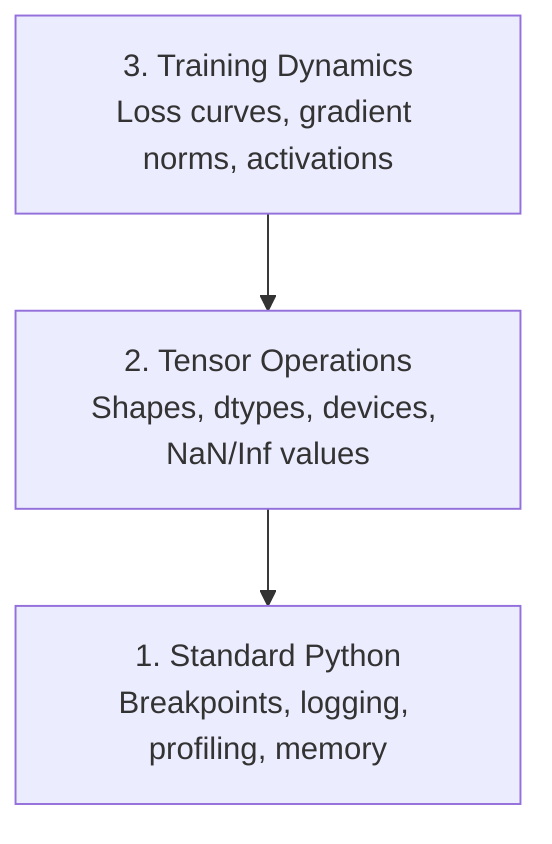

# Debugging 和 Profiling

> worst AI bugs don't crash. They train silently 在 garbage 和 report beautiful loss curve.

**Type:** Build
**Language:** Python
**Prerequisites:** Lesson 1 (Dev Environment), basic PyTorch familiarity
**Time:** ~60 minutes

## Learning Objectives

- Use conditional `breakpoint()` 和 `debug_print` 到 inspect 张量 shapes, dtypes, 和 NaN values mid-训练
- Profile 训练 loops 使用 `cProfile`, `line_profiler`, 和 `tracemalloc` 到 find bottlenecks
- Detect common AI bugs: shape mismatches, NaN loss, 数据 leakage, 和 wrong-device 张量
- Set up TensorBoard 到 visualize loss curves, 权重 histograms, 和 gradient distributions

## Problem

AI 代码 fails differently than regular 代码. web app crashes 使用 stack trace. misconfigured 训练 loop runs 为了 8 hours, burns $200 在 GPU time, 和 produces 模型 predicts mean 的 every 输入. 代码 never errored. bug was 张量 在 wrong device, forgotten `.detach()`, 或 labels leaking into 特征.

你需要 debugging tools catch 这些 silent failures before they waste your time 和 compute.

## Concept

AI debugging operates 在 three levels:



Most people jump straight 到 level 3 (staring 在 TensorBoard). But 80% 的 AI bugs live 在 levels 1 和 2.

## Build It

### Part 1: Print Debugging (Yes, It Works)

Print debugging gets dismissed. It shouldn't. For 张量 代码, targeted print statement beats stepping through debugger because you need 到 see shapes, dtypes, 和 value ranges all 在 once.

```python
def debug_print(name, tensor):
    print(f"{name}: shape={tensor.shape}, dtype={tensor.dtype}, "
          f"device={tensor.device}, "
          f"min={tensor.min().item():.4f}, max={tensor.max().item():.4f}, "
          f"mean={tensor.mean().item():.4f}, "
          f"has_nan={tensor.isnan().any().item()}")
```

Call 这个 after every suspicious operation. When bug 是 found, remove prints. Simple.

### Part 2: Python Debugger (pdb 和 breakpoint)

built-在 debugger 是 underrated 为了 AI work. Drop `breakpoint()` into your 训练 loop 和 inspect 张量 interactively.

```python
def training_step(model, batch, criterion, optimizer):
    inputs, labels = batch
    outputs = model(inputs)
    loss = criterion(outputs, labels)

    if loss.item() > 100 or torch.isnan(loss):
        breakpoint()

    loss.backward()
    optimizer.step()
```

When debugger drops you 在, useful commands:

- `p 输出.shape` 到 check shapes
- `p loss.item()` 到 see loss value
- `p torch.isnan(输出).sum()` 到 count NaNs
- `p 模型.fc1.权重.grad` 到 check gradients
- `c` 到 continue, `q` 到 quit

这是 conditional debugging. You only stop when something looks wrong. For 10,000-step 训练 run, matters.

### Part 3: Python Logging

Replace print statements 使用 logging when your debugging goes beyond quick check.

```python
import logging

logging.basicConfig(
    level=logging.INFO,
    format="%(asctime)s [%(levelname)s] %(message)s",
    handlers=[
        logging.FileHandler("training.log"),
        logging.StreamHandler()
    ]
)
logger = logging.getLogger(__name__)

logger.info("Starting training: lr=%.4f, batch_size=%d", lr, batch_size)
logger.warning("Loss spike detected: %.4f at step %d", loss.item(), step)
logger.error("NaN loss at step %d, stopping", step)
```

Logging gives you timestamps, severity levels, 和 file 输出. When 训练 run fails 在 3 AM, you want log file, not terminal 输出 scrolled off screen.

### Part 4: Timing 代码 Sections

Knowing where time goes 是 first step 到 optimization.

```python
import time

class Timer:
    def __init__(self, name=""):
        self.name = name

    def __enter__(self):
        self.start = time.perf_counter()
        return self

    def __exit__(self, *args):
        elapsed = time.perf_counter() - self.start
        print(f"[{self.name}] {elapsed:.4f}s")

with Timer("data loading"):
    batch = next(dataloader_iter)

with Timer("forward pass"):
    outputs = model(batch)

with Timer("backward pass"):
    loss.backward()
```

Common finding: 数据 loading takes 60% 的 训练 time. fix 是 `num_workers > 0` 在 your DataLoader, not faster GPU.

### Part 5: cProfile 和 line_profiler

When you need more than manual timers:

```bash
python -m cProfile -s cumtime train.py
```

This shows every 函数 call sorted 通过 cumulative time. For line-通过-line profiling:

```bash
pip install line_profiler
```

```python
@profile
def train_step(model, data, target):
    output = model(data)
    loss = F.cross_entropy(output, target)
    loss.backward()
    return loss

# Run with: kernprof -l -v train.py
```

### Part 6: Memory Profiling

#### CPU Memory 使用 tracemalloc

```python
import tracemalloc

tracemalloc.start()

# your code here
model = build_model()
data = load_dataset()

snapshot = tracemalloc.take_snapshot()
top_stats = snapshot.statistics("lineno")
for stat in top_stats[:10]:
    print(stat)
```

#### CPU Memory 使用 memory_profiler

```bash
pip install memory_profiler
```

```python
from memory_profiler import profile

@profile
def load_data():
    raw = read_csv("data.csv")       # watch memory jump here
    processed = preprocess(raw)       # and here
    return processed
```

Run 使用 `python -m memory_profiler your_script.py` 到 see line-通过-line memory usage.

#### GPU Memory 使用 PyTorch

```python
import torch

if torch.cuda.is_available():
    print(torch.cuda.memory_summary())

    print(f"Allocated: {torch.cuda.memory_allocated() / 1e9:.2f} GB")
    print(f"Cached: {torch.cuda.memory_reserved() / 1e9:.2f} GB")
```

When you hit OOM (Out 的 Memory):

1. Reduce 批次 size (first thing 到 try, always)
2. Use `torch.cuda.empty_cache()` 到 free cached memory
3. Use `del 张量` followed 通过 `torch.cuda.empty_cache()` 为了 large intermediates
4. Use mixed 精确率 (`torch.cuda.amp`) 到 halve memory usage
5. Use gradient checkpointing 为了 very deep 模型

### Part 7: Common AI Bugs 和 How 到 Catch Them

#### Shape Mismatch

most frequent bug. 张量 has shape `[批次, 特征]` when 模型 expects `[批次, channels, height, width]`.

```python
def check_shapes(model, sample_input):
    print(f"Input: {sample_input.shape}")
    hooks = []

    def make_hook(name):
        def hook(module, inp, out):
            in_shape = inp[0].shape if isinstance(inp, tuple) else inp.shape
            out_shape = out.shape if hasattr(out, "shape") else type(out)
            print(f"  {name}: {in_shape} -> {out_shape}")
        return hook

    for name, module in model.named_modules():
        hooks.append(module.register_forward_hook(make_hook(name)))

    with torch.no_grad():
        model(sample_input)

    for h in hooks:
        h.remove()
```

Run 这个 once 使用 sample 批次. It maps every shape transformation 在 your 模型.

#### NaN Loss

NaN loss means something exploded. Common causes:

- Learning rate too high
- Division 通过 zero 在 custom loss
- Log 的 zero 或 negative number
- Exploding gradients 在 RNNs

```python
def detect_nan(model, loss, step):
    if torch.isnan(loss):
        print(f"NaN loss at step {step}")
        for name, param in model.named_parameters():
            if param.grad is not None:
                if torch.isnan(param.grad).any():
                    print(f"  NaN gradient in {name}")
                if torch.isinf(param.grad).any():
                    print(f"  Inf gradient in {name}")
        return True
    return False
```

#### 数据 Leakage

Your 模型 gets 99% 准确率 在 test set. Sounds great. It's bug.

```python
def check_data_leakage(train_set, test_set, id_column="id"):
    train_ids = set(train_set[id_column].tolist())
    test_ids = set(test_set[id_column].tolist())
    overlap = train_ids & test_ids
    if overlap:
        print(f"DATA LEAKAGE: {len(overlap)} samples in both train and test")
        return True
    return False
```

Also check 为了 temporal leakage: using future 数据 到 predict past. Sort 通过 timestamp before splitting.

#### Wrong Device

Tensors 在 different devices (CPU vs GPU) cause runtime errors. But sometimes 张量 silently stays 在 CPU while everything else 是 在 GPU, 和 训练 just runs slowly.

```python
def check_devices(model, *tensors):
    model_device = next(model.parameters()).device
    print(f"Model device: {model_device}")
    for i, t in enumerate(tensors):
        if t.device != model_device:
            print(f"  WARNING: tensor {i} on {t.device}, model on {model_device}")
```

### Part 8: TensorBoard Basics

TensorBoard shows you what's happening inside 训练 over time.

```bash
pip install tensorboard
```

```python
from torch.utils.tensorboard import SummaryWriter

writer = SummaryWriter("runs/experiment_1")

for step in range(num_steps):
    loss = train_step(model, batch)

    writer.add_scalar("loss/train", loss.item(), step)
    writer.add_scalar("lr", optimizer.param_groups[0]["lr"], step)

    if step % 100 == 0:
        for name, param in model.named_parameters():
            writer.add_histogram(f"weights/{name}", param, step)
            if param.grad is not None:
                writer.add_histogram(f"grads/{name}", param.grad, step)

writer.close()
```

Launch it:

```bash
tensorboard --logdir=runs
```

What 到 look 为了:

- **Loss not decreasing**: Learning rate too low, 或 模型 architecture issue
- **Loss oscillating wildly**: Learning rate too high
- **Loss goes 到 NaN**: Numerical instability (see NaN section above)
- **Train loss decreasing, val loss increasing**: 过拟合
- **权重 histograms collapsing 到 zero**: Vanishing gradients
- **Gradient histograms exploding**: Need gradient clipping

### Part 9: VS 代码 Debugger

For interactive debugging, configure VS 代码 使用 `launch.json`:

```json
{
    "version": "0.2.0",
    "configurations": [
        {
            "name": "Debug Training",
            "type": "debugpy",
            "request": "launch",
            "program": "${file}",
            "console": "integratedTerminal",
            "justMyCode": false
        }
    ]
}
```

Set breakpoints 通过 clicking gutter. Use Variables pane 到 inspect 张量 properties. Debug Console lets you run arbitrary Python expressions mid-execution.

Useful 为了 stepping through 数据 preprocessing pipelines where you want 到 see each transformation.

## Use It

Here's debugging workflow catches most AI bugs:

1. **Before 训练**: Run `check_shapes` 使用 sample 批次. Verify 输入 和 输出 dimensions match expectations.
2. **First 10 steps**: Use `debug_print` 在 loss, 输出, 和 gradients. Confirm nothing 是 NaN 和 values 是 在 reasonable ranges.
3. **During 训练**: Log loss, 学习率, 和 gradient norms. Use TensorBoard 为了 visualization.
4. **When something breaks**: Drop `breakpoint()` 在 failure point. Inspect 张量 interactively.
5. **For performance**: Time your 数据 loading vs forward vs backward pass. Profile memory if you're near OOM.

## Ship It

Run debugging toolkit script:

```bash
python phases/00-setup-and-tooling/12-debugging-and-profiling/code/debug_tools.py
```

See `输出/prompt-debug-ai-代码.md` 为了 prompt helps diagnose AI-specific bugs.

## Exercises

1. Run `debug_tools.py` 和 read through each section's 输出. Modify dummy 模型 到 introduce NaN (hint: divide 通过 zero 在 forward pass) 和 watch detector catch it.
2. Profile 训练 loop 使用 `cProfile` 和 identify slowest 函数.
3. Use `tracemalloc` 到 find which line 在 your 数据 loading pipeline allocates most memory.
4. Set up TensorBoard 为了 simple 训练 run 和 identify whether 模型 是 过拟合.
5. Use `breakpoint()` inside 训练 loop. Practice inspecting 张量 shapes, devices, 和 gradient values 从 debugger prompt.
