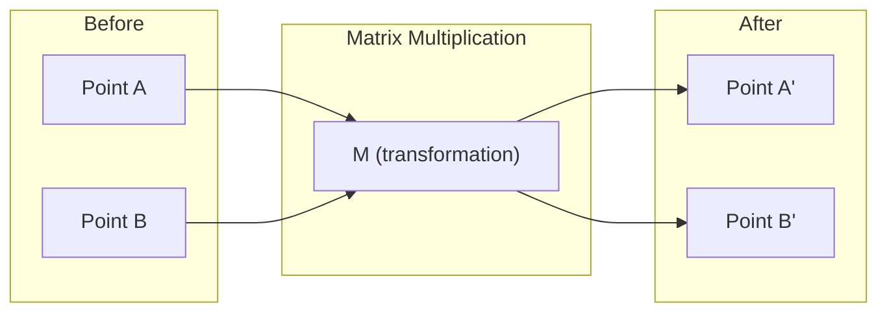
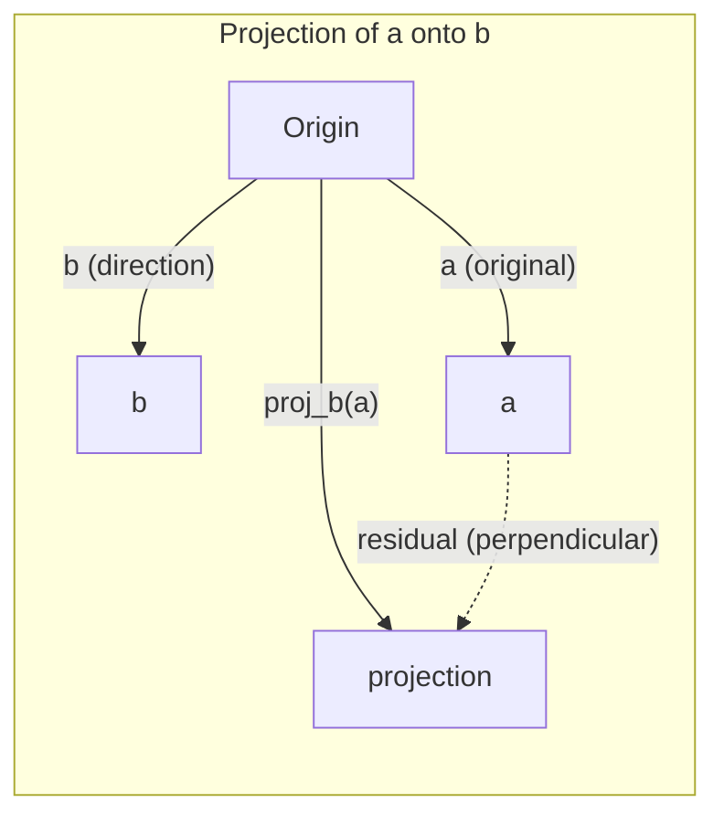

# 线性代数 Intuition

> Every AI 模型 是 just 矩阵 math wearing fancy hat.

**Type:** Learn
**Languages:** Python, Julia
**Prerequisites:** Phase 0
**Time:** ~60 minutes

## Learning Objectives

- Implement 向量 和 矩阵 operations (addition, dot product, 矩阵 multiply) 从 scratch 在 Python
- Explain geometrically what dot product, projection, 和 Gram-Schmidt process do
- Determine linear independence, rank, 和 basis 的 set 的 向量 using row reduction
- Connect 线性代数 concepts 到 their AI applications: embeddings, attention scores, 和 LoRA

## Problem

Open any ML paper. Within first page, you'll see 向量, 矩阵, dot products, 和 transformations. Without 线性代数 intuition, 这些 是 just symbols. With it, you can see what 神经网络 是 actually doing -- moving points around 在 space.

You don't need 到 be mathematician. 你需要 到 see what 这些 operations mean geometrically, then 代码 them yourself.

## Concept

### Vectors Are Points (和 Directions)

向量 是 just list 的 numbers. But 那些 numbers mean something -- they're coordinates 在 space.

**2D 向量 [3, 2]:**

| x | y | Point |
|---|---|-------|
| 3 | 2 | 向量 points 从 origin (0,0) 到 (3, 2) 在 plane |

向量 has magnitude sqrt(3^2 + 2^2) = sqrt(13) 和 points up 和 到 right.

In AI, 向量 represent everything:
- word → 向量 的 768 numbers (its "meaning" 在 embedding space)
- image → 向量 的 millions 的 pixel values
- user → 向量 的 preferences

### Matrices Are Transformations

矩阵 transforms one 向量 into another. It can rotate, scale, stretch, 或 project.



In AI, 矩阵 ARE 模型:
- Neural network 权重 → 矩阵 transform 输入 into 输出
- Attention scores → 矩阵 decide what 到 focus 在
- Embeddings → 矩阵 map words 到 向量

### Dot Product Measures Similarity

dot product 的 two 向量 tells you how similar they 是.

```
a · b = a₁×b₁ + a₂×b₂ + ... + aₙ×bₙ

Same direction:      a · b > 0  (similar)
Perpendicular:       a · b = 0  (unrelated)
Opposite direction:  a · b < 0  (dissimilar)
```

这是 literally how search engines, recommendation systems, 和 RAG work -- find 向量 使用 high dot products.

### Linear Independence

Vectors 是 linearly independent if no 向量 在 set can be written 作为 combination 的 others. If v1, v2, v3 是 independent, they span 3D space. If one 是 combination 的 others, they only span plane.

Why it matters 为了 AI: your 特征 矩阵 should have linearly independent columns. If two 特征 是 perfectly correlated (linearly dependent), 模型 cannot distinguish their effects. This causes multicollinearity 在 回归 -- 权重 矩阵 becomes unstable, 和 small 输入 changes produce wild 输出 swings.

**Concrete example:**

```
v1 = [1, 0, 0]
v2 = [0, 1, 0]
v3 = [2, 1, 0]   # v3 = 2*v1 + v2
```

v1 和 v2 是 independent -- neither 是 scalar multiple 或 combination 的 other. But v3 = 2*v1 + v2, so {v1, v2, v3} 是 dependent set. These three 向量 all lie 在 xy-plane. No matter how you combine them, you cannot reach [0, 0, 1]. You have three 向量 but only two dimensions 的 freedom.

In 数据集: if feature_3 = 2*feature_1 + feature_2, adding feature_3 gives 模型 zero new information. Worse, it makes normal equations singular -- there 是 no unique solution 为了 权重.

### Basis 和 Rank

basis 是 minimal set 的 linearly independent 向量 span entire space. number 的 basis 向量 是 dimension 的 space.

standard basis 为了 3D space 是 {[1,0,0], [0,1,0], [0,0,1]}. But any three independent 向量 在 3D form valid basis. choice 的 basis 是 choice 的 coordinate system.

Rank 的 矩阵 = number 的 linearly independent columns = number 的 linearly independent rows. If rank < min(rows, cols), 矩阵 是 rank-deficient. This means:
- system has infinitely many solutions (或 none)
- Information 是 lost 在 transformation
- 矩阵 cannot be inverted

| Situation | Rank | What it means 为了 ML |
|-----------|------|---------------------|
| Full rank (rank = min(m, n)) | Maximum possible | Unique least-squares solution exists. 模型 是 well-conditioned. |
| Rank deficient (rank < min(m, n)) | Below maximum | Features 是 redundant. Infinitely many 权重 solutions. 正则化 needed. |
| Rank 1 | 1 | Every column 是 scaled copy 的 one 向量. All 数据 lies 在 line. |
| Near rank-deficient (small singular values) | Numerically low | 矩阵 是 ill-conditioned. Tiny 输入 noise causes large 输出 changes. Use SVD truncation 或 ridge 回归. |

### Projection

Projecting 向量 **** onto 向量 **b** gives component 的 **** 在 direction 的 **b**:

```
proj_b(a) = (a dot b / b dot b) * b
```

residual ( - proj_b()) 是 perpendicular 到 b. This orthogonal decomposition 是 foundation 的 least-squares fitting.

Projection 是 everywhere 在 ML:
- Linear 回归 minimizes distance 从 observations 到 column space -- solution IS projection
- PCA projects 数据 onto directions 的 maximum variance
- Attention 在 transformers computes projections 的 queries onto keys



**Example:** = [3, 4], b = [1, 0]

proj_b() = (3*1 + 4*0) / (1*1 + 0*0) * [1, 0] = 3 * [1, 0] = [3, 0]

projection drops y-component. 这是 dimensionality reduction 在 its simplest form -- throw away directions you don't care about.

### Gram-Schmidt Process

Converting any set 的 independent 向量 into orthonormal basis. Orthonormal means every 向量 has length 1 和 every pair 是 perpendicular.

算法:
1. Take first 向量, normalize it
2. Take second 向量, subtract its projection onto first, normalize
3. Take third 向量, subtract its projections onto all previous 向量, normalize
4. Repeat 为了 remaining 向量

```
Input:  v1, v2, v3, ... (linearly independent)

u1 = v1 / |v1|

w2 = v2 - (v2 dot u1) * u1
u2 = w2 / |w2|

w3 = v3 - (v3 dot u1) * u1 - (v3 dot u2) * u2
u3 = w3 / |w3|

Output: u1, u2, u3, ... (orthonormal basis)
```

这是 how QR decomposition works internally. Q 是 orthonormal basis, R captures projection coefficients. QR decomposition 是 used 在:
- Solving linear systems (more stable than Gaussian elimination)
- Computing eigenvalues (QR 算法)
- Least-squares 回归 ( standard numerical method)

## Build It

### Step 1: Vectors 从 scratch (Python)

```python
class Vector:
    def __init__(self, components):
        self.components = list(components)
        self.dim = len(self.components)

    def __add__(self, other):
        return Vector([a + b for a, b in zip(self.components, other.components)])

    def __sub__(self, other):
        return Vector([a - b for a, b in zip(self.components, other.components)])

    def dot(self, other):
        return sum(a * b for a, b in zip(self.components, other.components))

    def magnitude(self):
        return sum(x**2 for x in self.components) ** 0.5

    def normalize(self):
        mag = self.magnitude()
        return Vector([x / mag for x in self.components])

    def cosine_similarity(self, other):
        return self.dot(other) / (self.magnitude() * other.magnitude())

    def __repr__(self):
        return f"Vector({self.components})"


a = Vector([1, 2, 3])
b = Vector([4, 5, 6])

print(f"a + b = {a + b}")
print(f"a · b = {a.dot(b)}")
print(f"|a| = {a.magnitude():.4f}")
print(f"cosine similarity = {a.cosine_similarity(b):.4f}")
```

### Step 2: Matrices 从 scratch (Python)

```python
class Matrix:
    def __init__(self, rows):
        self.rows = [list(row) for row in rows]
        self.shape = (len(self.rows), len(self.rows[0]))

    def __matmul__(self, other):
        if isinstance(other, Vector):
            return Vector([
                sum(self.rows[i][j] * other.components[j] for j in range(self.shape[1]))
                for i in range(self.shape[0])
            ])
        rows = []
        for i in range(self.shape[0]):
            row = []
            for j in range(other.shape[1]):
                row.append(sum(
                    self.rows[i][k] * other.rows[k][j]
                    for k in range(self.shape[1])
                ))
            rows.append(row)
        return Matrix(rows)

    def transpose(self):
        return Matrix([
            [self.rows[j][i] for j in range(self.shape[0])]
            for i in range(self.shape[1])
        ])

    def __repr__(self):
        return f"Matrix({self.rows})"


rotation_90 = Matrix([[0, -1], [1, 0]])
point = Vector([3, 1])

rotated = rotation_90 @ point
print(f"Original: {point}")
print(f"Rotated 90°: {rotated}")
```

### Step 3: Why 这个 matters 为了 AI

```python
import random

random.seed(42)
weights = Matrix([[random.gauss(0, 0.1) for _ in range(3)] for _ in range(2)])
input_vector = Vector([1.0, 0.5, -0.3])

output = weights @ input_vector
print(f"Input (3D): {input_vector}")
print(f"Output (2D): {output}")
print("This is what a neural network layer does -- matrix multiplication.")
```

### Step 4: Julia version

```julia
a = [1.0, 2.0, 3.0]
b = [4.0, 5.0, 6.0]

println("a + b = ", a + b)
println("a · b = ", a ⋅ b)       # Julia supports unicode operators
println("|a| = ", √(a ⋅ a))
println("cosine = ", (a ⋅ b) / (√(a ⋅ a) * √(b ⋅ b)))

# Matrix-vector multiplication
W = [0.1 -0.2 0.3; 0.4 0.5 -0.1]
x = [1.0, 0.5, -0.3]
println("Wx = ", W * x)
println("This is a neural network layer.")
```

### Step 5: Linear independence 和 projection 从 scratch (Python)

```python
def is_linearly_independent(vectors):
    n = len(vectors)
    dim = len(vectors[0].components)
    mat = Matrix([v.components[:] for v in vectors])
    rows = [row[:] for row in mat.rows]
    rank = 0
    for col in range(dim):
        pivot = None
        for row in range(rank, len(rows)):
            if abs(rows[row][col]) > 1e-10:
                pivot = row
                break
        if pivot is None:
            continue
        rows[rank], rows[pivot] = rows[pivot], rows[rank]
        scale = rows[rank][col]
        rows[rank] = [x / scale for x in rows[rank]]
        for row in range(len(rows)):
            if row != rank and abs(rows[row][col]) > 1e-10:
                factor = rows[row][col]
                rows[row] = [rows[row][j] - factor * rows[rank][j] for j in range(dim)]
        rank += 1
    return rank == n


def project(a, b):
    scalar = a.dot(b) / b.dot(b)
    return Vector([scalar * x for x in b.components])


def gram_schmidt(vectors):
    orthonormal = []
    for v in vectors:
        w = v
        for u in orthonormal:
            proj = project(w, u)
            w = w - proj
        if w.magnitude() < 1e-10:
            continue
        orthonormal.append(w.normalize())
    return orthonormal


v1 = Vector([1, 0, 0])
v2 = Vector([1, 1, 0])
v3 = Vector([1, 1, 1])
basis = gram_schmidt([v1, v2, v3])
for i, u in enumerate(basis):
    print(f"u{i+1} = {u}")
    print(f"  |u{i+1}| = {u.magnitude():.6f}")

print(f"u1 · u2 = {basis[0].dot(basis[1]):.6f}")
print(f"u1 · u3 = {basis[0].dot(basis[2]):.6f}")
print(f"u2 · u3 = {basis[1].dot(basis[2]):.6f}")
```

## Use It

Now same thing 使用 NumPy -- what you'll actually use 在 practice:

```python
import numpy as np

a = np.array([1, 2, 3], dtype=float)
b = np.array([4, 5, 6], dtype=float)

print(f"a + b = {a + b}")
print(f"a · b = {np.dot(a, b)}")
print(f"|a| = {np.linalg.norm(a):.4f}")
print(f"cosine = {np.dot(a, b) / (np.linalg.norm(a) * np.linalg.norm(b)):.4f}")

W = np.random.randn(2, 3) * 0.1
x = np.array([1.0, 0.5, -0.3])
print(f"Wx = {W @ x}")
```

### Rank, Projection, 和 QR 使用 NumPy

```python
import numpy as np

A = np.array([[1, 2], [2, 4]])
print(f"Rank: {np.linalg.matrix_rank(A)}")

a = np.array([3, 4])
b = np.array([1, 0])
proj = (np.dot(a, b) / np.dot(b, b)) * b
print(f"Projection of {a} onto {b}: {proj}")

Q, R = np.linalg.qr(np.random.randn(3, 3))
print(f"Q is orthogonal: {np.allclose(Q @ Q.T, np.eye(3))}")
print(f"R is upper triangular: {np.allclose(R, np.triu(R))}")
```

### PyTorch -- Tensors Are Vectors 使用 Autodiff

```python
import torch

x = torch.randn(3, requires_grad=True)
y = torch.tensor([1.0, 0.0, 0.0])

similarity = torch.dot(x, y)
similarity.backward()

print(f"x = {x.data}")
print(f"y = {y.data}")
print(f"dot product = {similarity.item():.4f}")
print(f"d(dot)/dx = {x.grad}")
```

gradient 的 dot product 使用 respect 到 x 是 just y. PyTorch computed 这个 automatically. Every operation 在 神经网络 是 built 从 operations like 这个 -- 矩阵 multiplies, dot products, projections -- 和 autodiff tracks gradients through all 的 them.

You just built 从 scratch what NumPy does 在 one line. Now you know what's happening under hood.

## Ship It

This lesson produces:
- `输出/prompt-linear-algebra-tutor.md` -- prompt 为了 AI assistants 到 teach 线性代数 through geometric intuition

## Connections

Everything 在 这个 lesson connects 到 specific parts 的 modern AI:

| Concept | Where it shows up |
|---------|------------------|
| Dot product | Attention scores 在 transformers, cosine similarity 在 RAG |
| 矩阵 multiply | Every 神经网络 层, every linear transformation |
| Linear independence | 特征 selection, avoiding multicollinearity |
| Rank | Determining if system 是 solvable, LoRA (low-rank adaptation) |
| Projection | Linear 回归 (projecting onto column space), PCA |
| Gram-Schmidt / QR | Numerical solvers, eigenvalue computation |
| Orthonormal basis | Stable numerical computation, whitening transforms |

LoRA deserves special mention. It fine-tunes large language 模型 通过 decomposing 权重 updates into low-rank 矩阵. Instead 的 updating 4096x4096 权重 矩阵 (16M 参数), LoRA updates two 矩阵 的 size 4096x16 和 16x4096 (131K 参数). rank-16 constraint means LoRA assumes 权重 update lives 在 16-dimensional subspace 的 full 4096-dimensional space. 那是 线性代数 doing real work.

## Exercises

1. Implement `向量.angle_between(other)` returns angle 在 degrees between two 向量
2. Create 2D scaling 矩阵 doubles x-coordinate 和 triples y-coordinate, then apply it 到 向量 [1, 1]
3. Given 5 random word-like 向量 (dimension 50), find two most similar using cosine similarity
4. Verify Gram-Schmidt 输出 是 truly orthonormal: check every pair has dot product 0 和 every 向量 has magnitude 1
5. Create 3x3 矩阵 使用 rank 2. Verify using `rank()` method. Then explain what geometric object columns span.
6. Project 向量 [1, 2, 3] onto [1, 1, 1]. What does result represent geometrically?

## Key Terms

| Term | What people say | What it actually means |
|------|----------------|----------------------|
| 向量 | " arrow" | list 的 numbers representing point 或 direction 在 n-dimensional space |
| 矩阵 | " table 的 numbers" | transformation maps 向量 从 one space 到 another |
| Dot product | "Multiply 和 sum" | measure 的 how aligned two 向量 是 -- core 的 similarity search |
| Embedding | "Some AI magic" | 向量 represents meaning 的 something (word, image, user) |
| Linear independence | "They don't overlap" | No 向量 在 set can be written 作为 combination 的 others |
| Rank | "How many dimensions" | number 的 linearly independent columns (或 rows) 在 矩阵 |
| Projection | " shadow" | component 的 one 向量 在 direction 的 another |
| Basis | " coordinate axes" | minimal set 的 independent 向量 span space |
| Orthonormal | "Perpendicular unit 向量" | Vectors 是 mutually perpendicular 和 each have length 1 |
