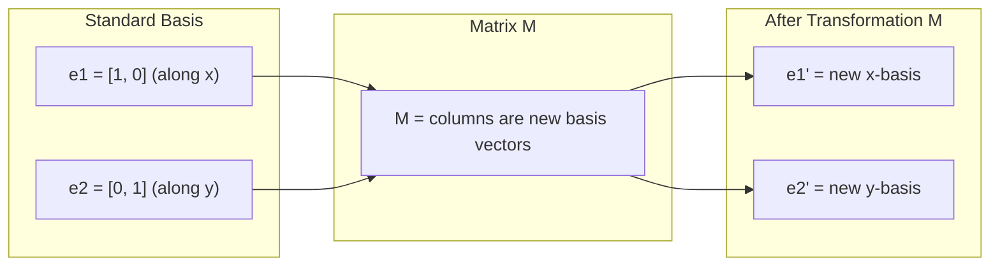
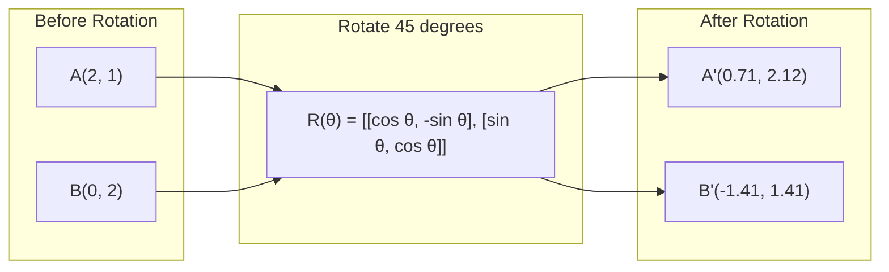
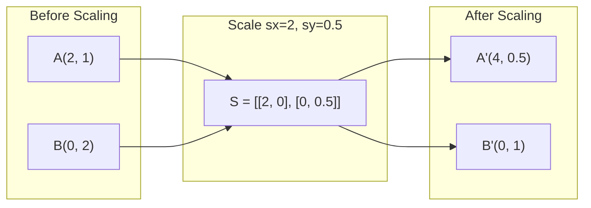
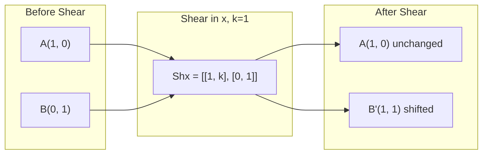
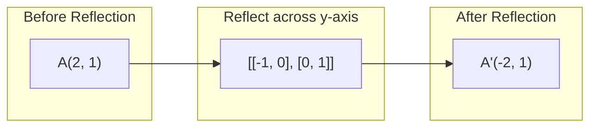
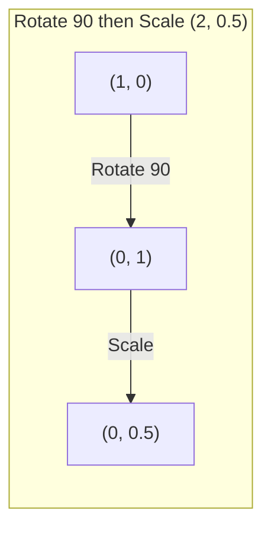
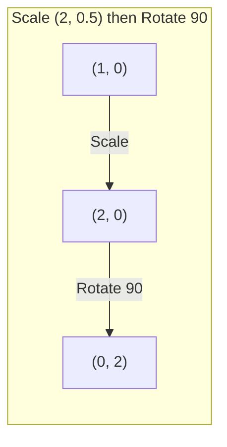

# 矩阵 Transformations

> 矩阵 是 machine reshapes space. Learn what it does 到 every point, 和 you understand whole transformation.

**Type:** Build
**Languages:** Python, Julia
**Prerequisites:** Phase 1, Lessons 01-02 (线性代数 Intuition, Vectors & Matrices Operations)
**Time:** ~75 minutes

## Learning Objectives

- Construct rotation, scaling, shearing, 和 reflection 矩阵 和 apply them 到 2D 和 3D points
- Compose multiple transformations 通过 矩阵 multiplication 和 verify order matters
- Compute eigenvalues 和 eigenvectors 的 2x2 矩阵 从 characteristic equation
- Explain why eigenvalues determine PCA directions, RNN stability, 和 spectral 聚类 behavior

## Problem

You read about PCA 和 see "find eigenvectors 的 covariance 矩阵." You read about 模型 stability 和 see "check if all eigenvalues have magnitude less than 1." You read about 数据 augmentation 和 see "apply random rotation." None 的 这个 makes sense until you understand what 矩阵 do 到 space geometrically.

Matrices 是 not just grids 的 numbers. They 是 spatial machines. rotation 矩阵 spins points. scaling 矩阵 stretches them. shearing 矩阵 tilts them. Every transformation 神经网络 applies 到 数据 是 one 的 这些 operations 或 composition 的 them. This lesson makes 那些 operations concrete.

## Concept

### Transformations 作为 矩阵

Every linear transformation 在 2D can be written 作为 2x2 矩阵. 矩阵 tells you exactly where basis 向量 [1, 0] 和 [0, 1] end up. Everything else follows.



### Rotation

2D rotation 通过 angle theta keeps distances 和 angles intact. It moves every point along circular arc.



In 3D, you rotate around axis. Each axis has its own rotation 矩阵:

```
Rz(theta) = | cos  -sin  0 |     Rotate around z-axis
            | sin   cos  0 |     (x-y plane spins, z stays)
            |  0     0   1 |

Rx(theta) = | 1   0     0    |   Rotate around x-axis
            | 0  cos  -sin   |   (y-z plane spins, x stays)
            | 0  sin   cos   |

Ry(theta) = |  cos  0  sin |     Rotate around y-axis
            |   0   1   0  |     (x-z plane spins, y stays)
            | -sin  0  cos |
```

### Scaling

Scaling stretches 或 compresses along each axis independently.



### Shearing

Shearing tilts one axis while keeping other fixed. It turns rectangles into parallelograms.



Shear 矩阵:
- `Shx = [[1, k], [0, 1]]` shifts x 通过 k * y
- `Shy = [[1, 0], [k, 1]]` shifts y 通过 k * x

### Reflection

Reflection mirrors points across axis 或 line.



Reflection 矩阵:
- Reflect across y-axis: `[[-1, 0], [0, 1]]`
- Reflect across x-axis: `[[1, 0], [0, -1]]`

### Composition: chaining transformations

Applying transformation then B 是 same 作为 multiplying their 矩阵: `result = B @ @ point`. Order matters. Rotate then scale gives different results than scale then rotate.



Composed: `S @ R = [[0, -2], [0.5, 0]]`



Composed: `R @ S = [[0, -0.5], [2, 0]]`

Different results. 矩阵 multiplication 是 not commutative.

### Eigenvalues 和 eigenvectors

Most 向量 change direction when 矩阵 hits them. Eigenvectors 是 special: 矩阵 only scales them, never rotates them. scaling factor 是 eigenvalue.

```
A @ v = lambda * v

v is the eigenvector (direction that survives)
lambda is the eigenvalue (how much it stretches)

Example: A = | 2  1 |
             | 1  2 |

Eigenvector [1, 1] with eigenvalue 3:
  A @ [1,1] = [3, 3] = 3 * [1, 1]     (same direction, scaled by 3)

Eigenvector [1, -1] with eigenvalue 1:
  A @ [1,-1] = [1, -1] = 1 * [1, -1]  (same direction, unchanged)
```

矩阵 stretches space 通过 3x along [1, 1] 和 keeps [1, -1] unchanged. Every other direction 是 mix 的 这些 two.

### Eigendecomposition

If 矩阵 has n linearly independent eigenvectors, it can be decomposed:

```
A = V @ D @ V^(-1)

V = matrix whose columns are eigenvectors
D = diagonal matrix of eigenvalues
V^(-1) = inverse of V

This says: rotate into eigenvector coordinates, scale along each axis, rotate back.
```

### Why eigenvalues matter

**PCA.** eigenvectors 的 covariance 矩阵 是 principal components. eigenvalues tell you how much variance each component captures. Sort 通过 eigenvalue, keep top k, 和 you have dimensionality reduction.

**Stability.** In recurrent networks 和 dynamical systems, eigenvalues 使用 magnitude > 1 cause 输出 到 explode. Magnitude < 1 causes them 到 vanish. 这是 vanishing/exploding gradient problem stated 在 one sentence.

**Spectral methods.** Graph 神经网络 use eigenvalues 的 adjacency 矩阵. Spectral 聚类 uses eigenvalues 的 Laplacian. eigenvectors reveal structure 的 graph.

### Determinant 作为 volume scaling factor

determinant 的 transformation 矩阵 tells you how much it scales area (2D) 或 volume (3D).

```
det = 1:   area preserved (rotation)
det = 2:   area doubled
det = 0:   space crushed to lower dimension (singular)
det = -1:  area preserved but orientation flipped (reflection)

| det(Rotation) | = 1        (always)
| det(Scale sx, sy) | = sx * sy
| det(Shear) | = 1           (area preserved)
| det(Reflection) | = -1     (orientation flipped)
```

## Build It

### Step 1: Transformation 矩阵 从 scratch (Python)

```python
import math

def rotation_2d(theta):
    c, s = math.cos(theta), math.sin(theta)
    return [[c, -s], [s, c]]

def scaling_2d(sx, sy):
    return [[sx, 0], [0, sy]]

def shearing_2d(kx, ky):
    return [[1, kx], [ky, 1]]

def reflection_x():
    return [[1, 0], [0, -1]]

def reflection_y():
    return [[-1, 0], [0, 1]]

def mat_vec_mul(matrix, vector):
    return [
        sum(matrix[i][j] * vector[j] for j in range(len(vector)))
        for i in range(len(matrix))
    ]

def mat_mul(a, b):
    rows_a, cols_b = len(a), len(b[0])
    cols_a = len(a[0])
    return [
        [sum(a[i][k] * b[k][j] for k in range(cols_a)) for j in range(cols_b)]
        for i in range(rows_a)
    ]

point = [1.0, 0.0]
angle = math.pi / 4

rotated = mat_vec_mul(rotation_2d(angle), point)
print(f"Rotate (1,0) by 45 deg: ({rotated[0]:.4f}, {rotated[1]:.4f})")

scaled = mat_vec_mul(scaling_2d(2, 3), [1.0, 1.0])
print(f"Scale (1,1) by (2,3): ({scaled[0]:.1f}, {scaled[1]:.1f})")

sheared = mat_vec_mul(shearing_2d(1, 0), [1.0, 1.0])
print(f"Shear (1,1) kx=1: ({sheared[0]:.1f}, {sheared[1]:.1f})")

reflected = mat_vec_mul(reflection_y(), [2.0, 1.0])
print(f"Reflect (2,1) across y: ({reflected[0]:.1f}, {reflected[1]:.1f})")
```

### Step 2: Composition 的 transformations

```python
R = rotation_2d(math.pi / 2)
S = scaling_2d(2, 0.5)

rotate_then_scale = mat_mul(S, R)
scale_then_rotate = mat_mul(R, S)

point = [1.0, 0.0]
result1 = mat_vec_mul(rotate_then_scale, point)
result2 = mat_vec_mul(scale_then_rotate, point)

print(f"Rotate 90 then scale: ({result1[0]:.2f}, {result1[1]:.2f})")
print(f"Scale then rotate 90: ({result2[0]:.2f}, {result2[1]:.2f})")
print(f"Same? {result1 == result2}")
```

### Step 3: Eigenvalues 从 scratch (2x2)

For 2x2 矩阵 `[[, b], [c, d]]`, eigenvalues solve characteristic equation: `lambda^2 - (+d)*lambda + (ad - bc) = 0`.

```python
def eigenvalues_2x2(matrix):
    a, b = matrix[0]
    c, d = matrix[1]
    trace = a + d
    det = a * d - b * c
    discriminant = trace ** 2 - 4 * det
    if discriminant < 0:
        real = trace / 2
        imag = (-discriminant) ** 0.5 / 2
        return (complex(real, imag), complex(real, -imag))
    sqrt_disc = discriminant ** 0.5
    return ((trace + sqrt_disc) / 2, (trace - sqrt_disc) / 2)

def eigenvector_2x2(matrix, eigenvalue):
    a, b = matrix[0]
    c, d = matrix[1]
    if abs(b) > 1e-10:
        v = [b, eigenvalue - a]
    elif abs(c) > 1e-10:
        v = [eigenvalue - d, c]
    else:
        if abs(a - eigenvalue) < 1e-10:
            v = [1, 0]
        else:
            v = [0, 1]
    mag = (v[0] ** 2 + v[1] ** 2) ** 0.5
    return [v[0] / mag, v[1] / mag]

A = [[2, 1], [1, 2]]
vals = eigenvalues_2x2(A)
print(f"Matrix: {A}")
print(f"Eigenvalues: {vals[0]:.4f}, {vals[1]:.4f}")

for val in vals:
    vec = eigenvector_2x2(A, val)
    result = mat_vec_mul(A, vec)
    scaled = [val * vec[0], val * vec[1]]
    print(f"  lambda={val:.1f}, v={[round(x,4) for x in vec]}")
    print(f"    A@v = {[round(x,4) for x in result]}")
    print(f"    l*v = {[round(x,4) for x in scaled]}")
```

### Step 4: Determinant 作为 volume scaling factor

```python
def det_2x2(matrix):
    return matrix[0][0] * matrix[1][1] - matrix[0][1] * matrix[1][0]

print(f"det(rotation 45) = {det_2x2(rotation_2d(math.pi/4)):.4f}")
print(f"det(scale 2,3)   = {det_2x2(scaling_2d(2, 3)):.1f}")
print(f"det(shear kx=1)  = {det_2x2(shearing_2d(1, 0)):.1f}")
print(f"det(reflect y)   = {det_2x2(reflection_y()):.1f}")

singular = [[1, 2], [2, 4]]
print(f"det(singular)     = {det_2x2(singular):.1f}")
print("Singular: columns are proportional, space collapses to a line.")
```

## Use It

NumPy handles all 的 这个 使用 optimized routines.

```python
import numpy as np

theta = np.pi / 4
R = np.array([[np.cos(theta), -np.sin(theta)],
              [np.sin(theta),  np.cos(theta)]])

point = np.array([1.0, 0.0])
print(f"Rotate (1,0) by 45 deg: {R @ point}")

S = np.diag([2.0, 3.0])
composed = S @ R
print(f"Scale(2,3) after Rotate(45): {composed @ point}")

A = np.array([[2, 1], [1, 2]], dtype=float)
eigenvalues, eigenvectors = np.linalg.eig(A)
print(f"\nEigenvalues: {eigenvalues}")
print(f"Eigenvectors (columns):\n{eigenvectors}")

for i in range(len(eigenvalues)):
    v = eigenvectors[:, i]
    lam = eigenvalues[i]
    print(f"  A @ v{i} = {A @ v}, lambda * v{i} = {lam * v}")

print(f"\ndet(R) = {np.linalg.det(R):.4f}")
print(f"det(S) = {np.linalg.det(S):.1f}")

B = np.array([[3, 1], [0, 2]], dtype=float)
vals, vecs = np.linalg.eig(B)
D = np.diag(vals)
V = vecs
reconstructed = V @ D @ np.linalg.inv(V)
print(f"\nEigendecomposition A = V @ D @ V^-1:")
print(f"Original:\n{B}")
print(f"Reconstructed:\n{reconstructed}")
```

### 3D rotations 使用 NumPy

```python
def rotation_3d_z(theta):
    c, s = np.cos(theta), np.sin(theta)
    return np.array([[c, -s, 0], [s, c, 0], [0, 0, 1]])

def rotation_3d_x(theta):
    c, s = np.cos(theta), np.sin(theta)
    return np.array([[1, 0, 0], [0, c, -s], [0, s, c]])

point_3d = np.array([1.0, 0.0, 0.0])
rotated_z = rotation_3d_z(np.pi / 2) @ point_3d
rotated_x = rotation_3d_x(np.pi / 2) @ point_3d

print(f"\n3D point: {point_3d}")
print(f"Rotate 90 around z: {np.round(rotated_z, 4)}")
print(f"Rotate 90 around x: {np.round(rotated_x, 4)}")
```

## Ship It

This lesson builds geometric foundation 为了 PCA (Phase 2) 和 神经网络 权重 analysis. eigenvalue/eigenvector 代码 built here 是 same 算法 powers dimensionality reduction, spectral 聚类, 和 stability analysis 在 production ML systems.

## Exercises

1. Apply rotation, scaling, 和 shearing 到 unit square (corners 在 [0,0], [1,0], [1,1], [0,1]). Print transformed corners 为了 each. Verify rotation preserves distances between corners.

2. Find eigenvalues 的 矩阵 [[4, 2], [1, 3]] 通过 hand using characteristic equation. Then verify 使用 your 从-scratch 函数 和 使用 NumPy.

3. Create composition 的 three transformations (rotate 30 degrees, scale 通过 [1.5, 0.8], shear 使用 kx=0.3) 和 apply it 到 8 points arranged 在 circle. Print before 和 after coordinates. Compute determinant 的 composed 矩阵 和 verify it equals product 的 individual determinants.

## Key Terms

| Term | What people say | What it actually means |
|------|----------------|----------------------|
| Rotation 矩阵 | "Spins things" | orthogonal 矩阵 moves points along circular arcs while preserving distances 和 angles. Determinant 是 always 1. |
| Scaling 矩阵 | "Makes things bigger" | diagonal 矩阵 stretches 或 compresses independently along each axis. Determinant 是 product 的 scale factors. |
| Shearing 矩阵 | "Slants things" | 矩阵 shifts one coordinate proportionally 到 another, turning rectangles into parallelograms. Determinant 是 1. |
| Reflection | "Mirrors things" | 矩阵 flips space across axis 或 plane. Determinant 是 -1. |
| Composition | "Do two things" | Multiplying transformation 矩阵 到 chain operations. Order matters: B @ means apply first, then B. |
| Eigenvector | "Special direction" | direction 矩阵 only scales, never rotates. transformation's fingerprint. |
| Eigenvalue | "How much it stretches" | scalar factor 通过 which 矩阵 scales its eigenvector. Can be negative (flip) 或 complex (rotation). |
| Eigendecomposition | "Break 矩阵 apart" | Writing 矩阵 作为 V @ D @ V^(-1), separating it into its fundamental scaling directions 和 magnitudes. |
| Determinant | " single number 从 矩阵" | factor 通过 which transformation scales area (2D) 或 volume (3D). Zero means transformation 是 irreversible. |
| Characteristic equation | "Where eigenvalues come 从" | det( - lambda * I) = 0. polynomial whose roots 是 eigenvalues. |

## Further Reading

- [3Blue1Brown: Linear Transformations](https://www.3blue1brown.com/lessons/linear-transformations) -- visual intuition 为了 how 矩阵 reshape space
- [3Blue1Brown: Eigenvectors 和 Eigenvalues](https://www.3blue1brown.com/lessons/eigenvalues) -- best visual explanation 的 what eigenvectors mean geometrically
- [MIT 18.06 Lecture 21: Eigenvalues 和 Eigenvectors](https://ocw.mit.edu/courses/18-06-linear-algebra-spring-2010/) -- Gilbert Strang's classic treatment
