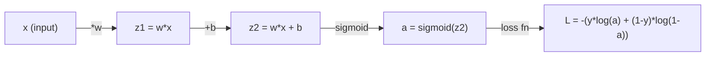
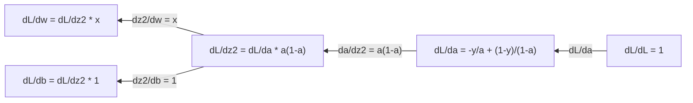
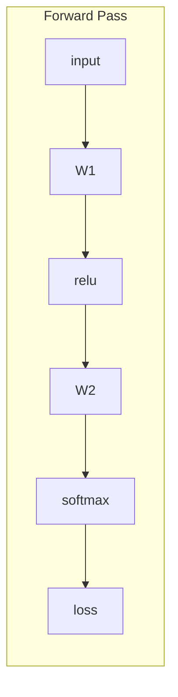
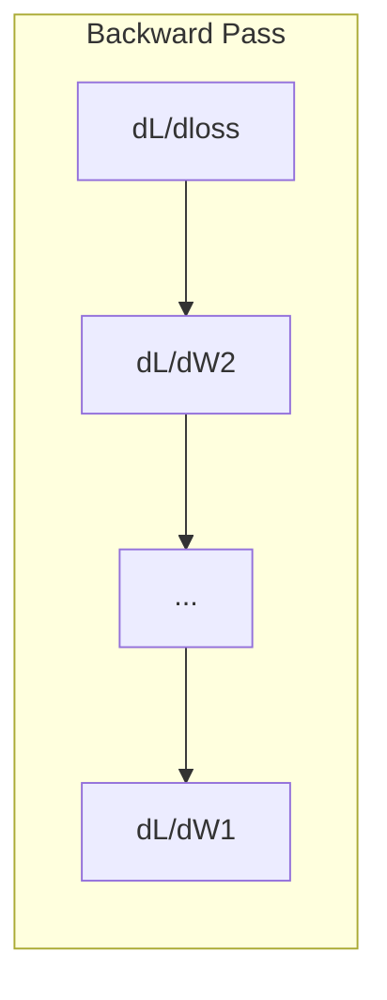

# 微积分 为了 Machine Learning

> Derivatives tell you which way 是 downhill. 那是 all 神经网络 needs 到 learn.

**Type:** Learn
**Language:** Python
**Prerequisites:** Phase 1, Lessons 01-03
**Time:** ~60 minutes

## Learning Objectives

- Compute numerical 和 analytical derivatives 为了 common ML 函数 (x^2, sigmoid, cross-entropy)
- Implement 梯度下降 从 scratch 到 minimize 损失函数 在 1D 和 2D
- Derive gradient 的 linear 回归 模型 和 train it via manual 权重 updates
- Explain Hessian 矩阵, Taylor series approximations, 和 their connection 到 optimization methods

## Problem

You have 神经网络 使用 millions 的 权重. Each 权重 是 knob. 你需要 到 figure out which direction 到 turn every single knob 到 make 模型 slightly less wrong. 微积分 gives you direction.

Without 微积分, 训练 神经网络 would mean trying random changes 和 hoping 为了 best. With derivatives, you know exactly how each 权重 affects error. You turn every knob right way, every time.

## Concept

### What 是 derivative?

derivative measures rate 的 change. For 函数 y = f(x), derivative f'(x) tells you: if you nudge x 通过 tiny amount, how much does y change?

Geometrically, derivative 是 slope 的 tangent line 在 point.

**f(x) = x^2:**

| x | f(x) | f'(x) (slope) |
|---|------|---------------|
| 0 | 0 | 0 (flat, 在 bottom) |
| 1 | 1 | 2 |
| 2 | 4 | 4 (tangent line slope 在 这个 point) |
| 3 | 9 | 6 |

At x=2, slope 是 4. If you move x tiny bit 到 right, y increases 通过 about 4 times amount. At x=0, slope 是 0. You 是 在 bottom 的 bowl.

formal definition:

```
f'(x) = lim   f(x + h) - f(x)
        h->0  -----------------
                     h
```

In 代码, you skip limit 和 just use very small h. 那是 numerical derivative.

### Partial derivatives: one variable 在 time

Real 函数 have many 输入. 神经网络 loss depends 在 thousands 的 权重. partial derivative holds all variables constant except one, then takes derivative 使用 respect 到 one.

```
f(x, y) = x^2 + 3xy + y^2

df/dx = 2x + 3y     (treat y as a constant)
df/dy = 3x + 2y     (treat x as a constant)
```

Each partial derivative answers: if I nudge just 这个 one 权重, how does loss change?

### gradient: 向量 的 all partial derivatives

gradient collects every partial derivative into one 向量. For 函数 f(x, y, z), gradient 是:

```
grad f = [ df/dx, df/dy, df/dz ]
```

gradient points 在 direction 的 steepest ascent. To minimize 函数, go 在 opposite direction.

**Contour plot 的 f(x,y) = x^2 + y^2:**

函数 forms bowl shape 使用 concentric circles 作为 contour lines. minimum 是 在 (0, 0).

| Point | grad f | -grad f (descent direction) |
|-------|--------|----------------------------|
| (1, 1) | [2, 2] (points uphill, away 从 minimum) | [-2, -2] (points downhill, toward minimum) |
| (0, 0) | [0, 0] (flat, 在 minimum) | [0, 0] |

这是 梯度下降 在 picture. Compute gradient, negate it, take step.

### connection 到 optimization

训练 神经网络 是 optimization. You have 损失函数 L(w1, w2, ..., wn) measures how wrong 模型 是. You want 到 minimize it.

```
Gradient descent update rule:

  w_new = w_old - learning_rate * dL/dw

For every weight:
  1. Compute the partial derivative of loss with respect to that weight
  2. Subtract a small multiple of it from the weight
  3. Repeat
```

学习率 controls step size. Too big 和 you overshoot. Too small 和 you crawl.

**Loss landscape (1D slice):**

损失函数 L(w) forms curve 使用 peaks 和 valleys 作为 权重 w varies.

| 特征 | Description |
|---------|-------------|
| Global minimum | lowest point 在 entire curve -- best solution |
| Local minimum | valley 是 lower than its neighbors but not lowest overall |
| Slope | Gradient descent follows slope downhill 从 any starting point |

Gradient descent follows slope downhill. It can get stuck 在 local minima, but 在 high-dimensional spaces (millions 的 权重) 这个 是 rarely practical problem.

### Numerical vs analytical derivatives

有 two ways 到 compute derivative.

Analytical: apply 微积分 rules 通过 hand. For f(x) = x^2, derivative 是 f'(x) = 2x. Exact. Fast.

Numerical: approximate using definition. Compute f(x+h) 和 f(x-h) 为了 tiny h, then use difference.

```
Numerical (central difference):

f'(x) ~= f(x + h) - f(x - h)
          -----------------------
                  2h

h = 0.0001 works well in practice
```

Numerical derivatives 是 slower but work 为了 any 函数. Analytical derivatives 是 fast but require you 到 derive formula. Neural network frameworks use third approach: automatic differentiation, which computes exact derivatives mechanically. You will see 在 Phase 3.

### Derivatives 通过 hand 为了 simple 函数

These 是 derivatives you will see over 和 over 在 ML.

```
Function        Derivative       Used in
--------        ----------       -------
f(x) = x^2     f'(x) = 2x      Loss functions (MSE)
f(x) = wx + b  f'(w) = x        Linear layer (gradient w.r.t. weight)
                f'(b) = 1        Linear layer (gradient w.r.t. bias)
                f'(x) = w        Linear layer (gradient w.r.t. input)
f(x) = e^x     f'(x) = e^x     Softmax, attention
f(x) = ln(x)   f'(x) = 1/x     Cross-entropy loss
f(x) = 1/(1+e^-x)  f'(x) = f(x)(1-f(x))   Sigmoid activation
```

For f(x) = x^2:

```
f(x) = x^2    f'(x) = 2x

  x    f(x)   f'(x)   meaning
  -2    4      -4      slope tilts left (decreasing)
  -1    1      -2      slope tilts left (decreasing)
   0    0       0      flat (minimum!)
   1    1       2      slope tilts right (increasing)
   2    4       4      slope tilts right (increasing)
```

For f(w) = wx + b 使用 x=3, b=1:

```
f(w) = 3w + 1    f'(w) = 3

The derivative with respect to w is just x.
If x is big, a small change in w causes a big change in output.
```

### chain rule

When 函数 是 composed, chain rule tells you how 到 differentiate.

```
If y = f(g(x)), then dy/dx = f'(g(x)) * g'(x)

Example: y = (3x + 1)^2
  outer: f(u) = u^2       f'(u) = 2u
  inner: g(x) = 3x + 1    g'(x) = 3
  dy/dx = 2(3x + 1) * 3 = 6(3x + 1)
```

Neural networks 是 chains 的 函数: 输入 -> linear -> activation -> linear -> activation -> loss. 反向传播 是 chain rule applied repeatedly 从 输出 到 输入. 那是 entire 算法.

### Hessian 矩阵

gradient tells you slope. Hessian tells you curvature.

Hessian 是 矩阵 的 second-order partial derivatives. For 函数 f(x1, x2, ..., xn), entry (i, j) 的 Hessian 是:

```
H[i][j] = d^2f / (dx_i * dx_j)
```

For 2-variable 函数 f(x, y):

```
H = | d^2f/dx^2    d^2f/dxdy |
    | d^2f/dydx    d^2f/dy^2 |
```

**What Hessian tells you 在 critical point (where gradient = 0):**

| Hessian property | Meaning | Example surface |
|-----------------|---------|-----------------|
| Positive definite (all eigenvalues > 0) | Local minimum | Bowl pointing up |
| Negative definite (all eigenvalues < 0) | Local maximum | Bowl pointing down |
| Indefinite (mixed eigenvalues) | Saddle point | Horse saddle shape |

**Example:** f(x, y) = x^2 - y^2 ( saddle 函数)

```
df/dx = 2x       df/dy = -2y
d^2f/dx^2 = 2    d^2f/dy^2 = -2    d^2f/dxdy = 0

H = | 2   0 |
    | 0  -2 |

Eigenvalues: 2 and -2 (one positive, one negative)
--> Saddle point at (0, 0)
```

Compare 使用 f(x, y) = x^2 + y^2 ( bowl):

```
H = | 2  0 |
    | 0  2 |

Eigenvalues: 2 and 2 (both positive)
--> Local minimum at (0, 0)
```

**Why Hessian matters 在 ML:**

Newton's method uses Hessian 到 take better optimization steps than 梯度下降. Instead 的 just following slope, it accounts 为了 curvature:

```
Newton's update:    w_new = w_old - H^(-1) * gradient
Gradient descent:   w_new = w_old - lr * gradient
```

Newton's method converges faster because Hessian "rescales" gradient -- steep directions get smaller steps, flat directions get larger steps.

catch: 为了 神经网络 使用 N 参数, Hessian 是 N x N. 模型 使用 1 million 参数 would need 1 trillion-entry 矩阵. 那是 why we use approximations.

| Method | What it uses | Cost | 收敛 |
|--------|-------------|------|-------------|
| Gradient descent | First derivatives only | O(N) per step | Slow (linear) |
| Newton's method | Full Hessian | O(N^3) per step | Fast (quadratic) |
| L-BFGS | Approximate Hessian 从 gradient history | O(N) per step | Medium (superlinear) |
| Adam | Per-参数 adaptive rates (diagonal Hessian approx) | O(N) per step | Medium |
| Natural gradient | Fisher information 矩阵 (statistical Hessian) | O(N^2) per step | Fast |

In practice, Adam 是 default 优化器 为了 deep learning. It approximates second-order information cheaply 通过 tracking running mean 和 variance 的 gradients per 参数.

### Taylor Series Approximation

Any smooth 函数 can be approximated locally 通过 polynomial:

```
f(x + h) = f(x) + f'(x)*h + (1/2)*f''(x)*h^2 + (1/6)*f'''(x)*h^3 + ...
```

more terms you include, better approximation -- but only near point x.

**Why Taylor series matter 为了 ML:**

- **First-order Taylor = 梯度下降.** When you use f(x + h) ~ f(x) + f'(x)*h, you 是 making linear approximation. Gradient descent minimizes 这个 linear 模型 到 choose h = -lr * f'(x).

- **Second-order Taylor = Newton's method.** Using f(x + h) ~ f(x) + f'(x)*h + (1/2)*f''(x)*h^2, you get quadratic 模型. Minimizing it gives h = -f'(x)/f''(x) -- Newton's step.

- **Loss 函数 design.** MSE 和 cross-entropy 是 smooth, which means their Taylor expansions 是 well-behaved. 这是 not accident. Smooth losses make optimization predictable.

```
Approximation order    What it captures    Optimization method
-------------------    -----------------   -------------------
0th order (constant)   Just the value      Random search
1st order (linear)     Slope               Gradient descent
2nd order (quadratic)  Curvature           Newton's method
Higher orders          Finer structure     Rarely used in ML
```

key insight: all gradient-based optimization 是 really about approximating 损失函数 locally 和 stepping 到 minimum 的 approximation.

### Integrals 在 ML

Derivatives tell you rates 的 change. Integrals compute accumulations -- area under curve.

In ML, you rarely compute integrals 通过 hand, but concept 是 everywhere:

**概率.** For continuous random variable 使用 density p(x):
```
P(a < X < b) = integral from a to b of p(x) dx
```
area under 概率 density curve between 和 b 是 概率 的 landing 在 range.

**Expected value.** average outcome weighted 通过 概率:
```
E[f(X)] = integral of f(x) * p(x) dx
```
expected loss over 数据 distribution 是 integral. 训练 minimizes empirical approximation 的 这个.

**KL divergence.** Measures how different two distributions 是:
```
KL(p || q) = integral of p(x) * log(p(x) / q(x)) dx
```
Used 在 VAEs, knowledge distillation, 和 Bayesian inference.

**Normalization constants.** In Bayesian inference:
```
p(w | data) = p(data | w) * p(w) / integral of p(data | w) * p(w) dw
```
denominator 是 integral over all possible 参数 values. 它是 often intractable, which 是 why we use approximations like MCMC 和 variational inference.

| Integral concept | Where it appears 在 ML |
|-----------------|----------------------|
| Area under curve | 概率 从 density 函数 |
| Expected value | Loss 函数, risk minimization |
| KL divergence | VAEs, policy optimization, distillation |
| Normalization | Bayesian posteriors, softmax denominator |
| Marginal likelihood | 模型 comparison, evidence lower bound (ELBO) |

### Multivariable Chain Rule 在 Computation Graph

chain rule does not just apply 到 scalar 函数 在 line. In 神经网络, variables fan out 和 merge. Here 是 how derivatives flow through simple forward pass:



backward pass computes gradients right 到 left:



Each arrow multiplies 通过 local derivative. gradient 为了 any 参数 是 product 的 all local derivatives along path 从 loss 到 参数. When paths branch 和 merge, you sum contributions (multivariate chain rule).

这是 all 反向传播 是: chain rule applied systematically through computation graph, 从 输出 到 输入.

### Jacobian 矩阵

When 函数 maps 向量 到 向量 (like 神经网络 层), its derivative 是 矩阵. Jacobian contains every partial derivative 的 every 输出 使用 respect 到 every 输入.

For f: R^n -> R^m, Jacobian J 是 m x n 矩阵:

| | x1 | x2 | ... | xn |
|---|---|---|---|---|
| f1 | df1/dx1 | df1/dx2 | ... | df1/dxn |
| f2 | df2/dx1 | df2/dx2 | ... | df2/dxn |
| ... | ... | ... | ... | ... |
| fm | dfm/dx1 | dfm/dx2 | ... | dfm/dxn |

You will not compute Jacobians 通过 hand 为了 神经网络. PyTorch handles it. But knowing it exists helps you understand shapes 在 反向传播: if 层 maps R^n 到 R^m, its Jacobian 是 m x n. gradient flows backward through transpose 的 这个 矩阵.

### Why 这个 matters 为了 神经网络

Every 权重 在 神经网络 gets gradient. gradient tells you how 到 adjust 权重 到 reduce loss.





Each 权重 update:
- `W1 = W1 - lr * dL/dW1`
- `W2 = W2 - lr * dL/dW2`

forward pass computes prediction 和 loss. backward pass computes gradient 的 loss 使用 respect 到 every 权重. Then every 权重 takes small step downhill. Repeat 为了 millions 的 steps. 那是 deep learning.

## Build It

### Step 1: Numerical derivative 从 scratch

```python
def numerical_derivative(f, x, h=1e-7):
    return (f(x + h) - f(x - h)) / (2 * h)

def f(x):
    return x ** 2

for x in [-2, -1, 0, 1, 2]:
    numerical = numerical_derivative(f, x)
    analytical = 2 * x
    print(f"x={x:2d}  f'(x) numerical={numerical:.6f}  analytical={analytical:.1f}")
```

numerical derivative matches analytical one 到 many decimal places.

### Step 2: Partial derivatives 和 gradients

```python
def numerical_gradient(f, point, h=1e-7):
    gradient = []
    for i in range(len(point)):
        point_plus = list(point)
        point_minus = list(point)
        point_plus[i] += h
        point_minus[i] -= h
        partial = (f(point_plus) - f(point_minus)) / (2 * h)
        gradient.append(partial)
    return gradient

def f_multi(point):
    x, y = point
    return x**2 + 3*x*y + y**2

grad = numerical_gradient(f_multi, [1.0, 2.0])
print(f"Numerical gradient at (1,2): {[f'{g:.4f}' for g in grad]}")
print(f"Analytical gradient at (1,2): [2*1+3*2, 3*1+2*2] = [{2*1+3*2}, {3*1+2*2}]")
```

### Step 3: Gradient descent 到 find minimum 的 f(x) = x^2

```python
x = 5.0
lr = 0.1
for step in range(20):
    grad = 2 * x
    x = x - lr * grad
    print(f"step {step:2d}  x={x:8.4f}  f(x)={x**2:10.6f}")
```

Starting 在 x=5, each step moves closer 到 x=0 ( minimum).

### Step 4: Gradient descent 在 2D 函数

```python
def f_2d(point):
    x, y = point
    return x**2 + y**2

point = [4.0, 3.0]
lr = 0.1
for step in range(30):
    grad = numerical_gradient(f_2d, point)
    point = [p - lr * g for p, g in zip(point, grad)]
    loss = f_2d(point)
    if step % 5 == 0 or step == 29:
        print(f"step {step:2d}  point=({point[0]:7.4f}, {point[1]:7.4f})  f={loss:.6f}")
```

### Step 5: Comparing numerical 和 analytical derivatives

```python
import math

test_functions = [
    ("x^2",      lambda x: x**2,          lambda x: 2*x),
    ("x^3",      lambda x: x**3,          lambda x: 3*x**2),
    ("sin(x)",   lambda x: math.sin(x),   lambda x: math.cos(x)),
    ("e^x",      lambda x: math.exp(x),   lambda x: math.exp(x)),
    ("1/x",      lambda x: 1/x,           lambda x: -1/x**2),
]

x = 2.0
print(f"{'Function':<12} {'Numerical':>12} {'Analytical':>12} {'Error':>12}")
print("-" * 50)
for name, f, df in test_functions:
    num = numerical_derivative(f, x)
    ana = df(x)
    err = abs(num - ana)
    print(f"{name:<12} {num:12.6f} {ana:12.6f} {err:12.2e}")
```

### Step 6: Computing Hessian numerically

```python
def hessian_2d(f, x, y, h=1e-5):
    fxx = (f(x + h, y) - 2 * f(x, y) + f(x - h, y)) / (h ** 2)
    fyy = (f(x, y + h) - 2 * f(x, y) + f(x, y - h)) / (h ** 2)
    fxy = (f(x + h, y + h) - f(x + h, y - h) - f(x - h, y + h) + f(x - h, y - h)) / (4 * h ** 2)
    return [[fxx, fxy], [fxy, fyy]]

def saddle(x, y):
    return x ** 2 - y ** 2

def bowl(x, y):
    return x ** 2 + y ** 2

H_saddle = hessian_2d(saddle, 0.0, 0.0)
H_bowl = hessian_2d(bowl, 0.0, 0.0)
print(f"Saddle Hessian: {H_saddle}")  # [[2, 0], [0, -2]] -- mixed signs
print(f"Bowl Hessian:   {H_bowl}")    # [[2, 0], [0, 2]]  -- both positive
```

Hessian 的 saddle 函数 has eigenvalues 2 和 -2 (mixed signs, confirming saddle point). bowl has eigenvalues 2 和 2 (both positive, confirming minimum).

### Step 7: Taylor approximation 在 action

```python
import math

def taylor_approx(f, f_prime, f_double_prime, x0, h, order=2):
    result = f(x0)
    if order >= 1:
        result += f_prime(x0) * h
    if order >= 2:
        result += 0.5 * f_double_prime(x0) * h ** 2
    return result

x0 = 0.0
for h in [0.1, 0.5, 1.0, 2.0]:
    true_val = math.sin(h)
    t1 = taylor_approx(math.sin, math.cos, lambda x: -math.sin(x), x0, h, order=1)
    t2 = taylor_approx(math.sin, math.cos, lambda x: -math.sin(x), x0, h, order=2)
    print(f"h={h:.1f}  sin(h)={true_val:.4f}  order1={t1:.4f}  order2={t2:.4f}")
```

Near x0=0, sin(x) ~ x (first-order Taylor). approximation 是 excellent 为了 small h but breaks down 为了 large h. 这是 why 梯度下降 works best 使用 small learning rates -- each step assumes linear approximation 是 accurate.

### Step 8: Why 这个 matters 为了 神经网络

```python
import random

random.seed(42)

w = random.gauss(0, 1)
b = random.gauss(0, 1)
lr = 0.01

xs = [1.0, 2.0, 3.0, 4.0, 5.0]
ys = [3.0, 5.0, 7.0, 9.0, 11.0]

for epoch in range(200):
    total_loss = 0
    dw = 0
    db = 0
    for x, y in zip(xs, ys):
        pred = w * x + b
        error = pred - y
        total_loss += error ** 2
        dw += 2 * error * x
        db += 2 * error
    dw /= len(xs)
    db /= len(xs)
    total_loss /= len(xs)
    w -= lr * dw
    b -= lr * db
    if epoch % 40 == 0 or epoch == 199:
        print(f"epoch {epoch:3d}  w={w:.4f}  b={b:.4f}  loss={total_loss:.6f}")

print(f"\nLearned: y = {w:.2f}x + {b:.2f}")
print(f"Actual:  y = 2x + 1")
```

Every gradient-based 训练 loop follows 这个 pattern: predict, compute loss, compute gradients, update 权重.

## Use It

With NumPy, same operations 是 faster 和 more concise:

```python
import numpy as np

x = np.array([1, 2, 3, 4, 5], dtype=float)
y = np.array([3, 5, 7, 9, 11], dtype=float)

w, b = np.random.randn(), np.random.randn()
lr = 0.01

for epoch in range(200):
    pred = w * x + b
    error = pred - y
    loss = np.mean(error ** 2)
    dw = np.mean(2 * error * x)
    db = np.mean(2 * error)
    w -= lr * dw
    b -= lr * db

print(f"Learned: y = {w:.2f}x + {b:.2f}")
```

You just built 梯度下降 从 scratch. PyTorch automates gradient computation, but update loop 是 identical.

## Exercises

1. Implement `numerical_second_derivative(f, x)` using `numerical_derivative` called twice. Verify second derivative 的 x^3 在 x=2 是 12.
2. Use 梯度下降 到 find minimum 的 f(x, y) = (x - 3)^2 + (y + 1)^2. Start 从 (0, 0). answer should converge 到 (3, -1).
3. Add momentum 到 梯度下降 loop: maintain velocity 向量 accumulates past gradients. Compare 收敛 speed 使用 和 without momentum 在 f(x) = x^4 - 3x^2.

## Key Terms

| Term | What people say | What it actually means |
|------|----------------|----------------------|
| Derivative | " slope" | rate 的 change 的 函数 在 point. Tells you how much 输出 changes per unit change 在 输入. |
| Partial derivative | "Derivative 的 one variable" | derivative 使用 respect 到 one variable while all others 是 held constant. |
| Gradient | "Direction 的 steepest ascent" | 向量 的 all partial derivatives. Points 在 direction increases 函数 fastest. |
| Gradient descent | "Go downhill" | Subtract gradient (times 学习率) 从 参数 到 reduce loss. core 的 神经网络 训练. |
| Learning rate | "Step size" | scalar controls how big each 梯度下降 step 是. Too large: diverge. Too small: converge slowly. |
| Chain rule | "Multiply derivatives" | rule 为了 differentiating composed 函数: df/dx = df/dg * dg/dx. mathematical basis 的 反向传播. |
| Jacobian | "矩阵 的 derivatives" | When 函数 maps 向量 到 向量, Jacobian 是 矩阵 的 all partial derivatives 的 输出 使用 respect 到 输入. |
| Numerical derivative | "Finite differences" | Approximating derivative 通过 evaluating 函数 在 two nearby points 和 computing slope between them. |
| 反向传播 | "Reverse-mode autodiff" | Computing gradients 层 通过 层 从 输出 到 输入 using chain rule. How 神经网络 learn. |
| Hessian | "矩阵 的 second derivatives" | 矩阵 的 all second-order partial derivatives. Describes curvature 的 函数. Positive definite Hessian 在 critical point means local minimum. |
| Taylor series | "Polynomial approximation" | Approximating 函数 near point using its derivatives: f(x+h) ~ f(x) + f'(x)h + (1/2)f''(x)h^2 + ... basis 为了 understanding why 梯度下降 和 Newton's method work. |
| Integral | "Area under curve" | accumulation 的 quantity over range. In ML, integrals define probabilities, expected values, 和 KL divergence. |

## Further Reading

- [3Blue1Brown: Essence 的 微积分](https://www.3blue1brown.com/topics/微积分) - visual intuition 为了 derivatives, integrals, 和 chain rule
- [Stanford CS231n: 反向传播](https://cs231n.github.io/optimization-2/) - how gradients flow through 神经网络 层
