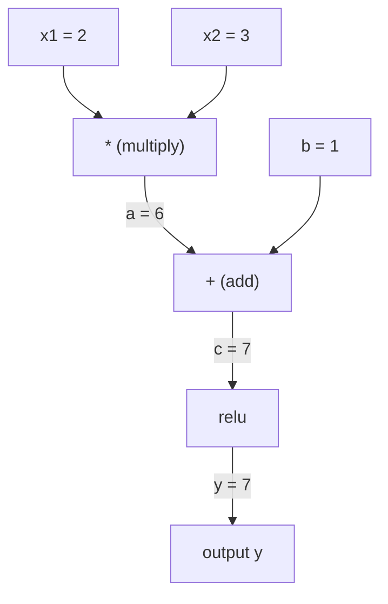
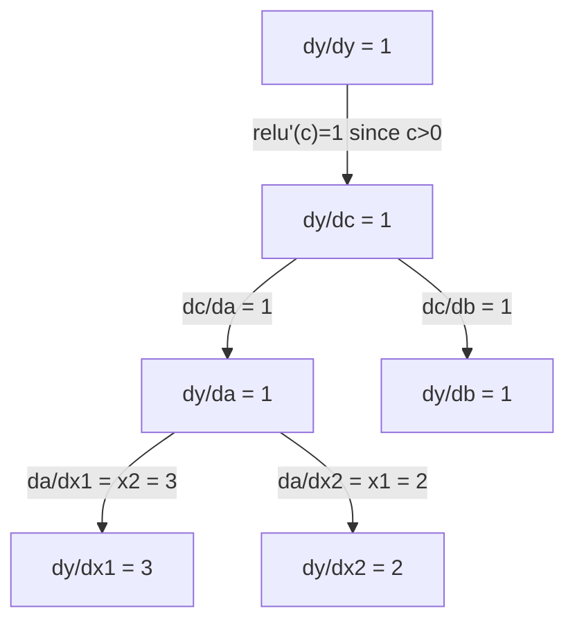

# Chain Rule & Automatic Differentiation

> chain rule 是 engine behind every 神经网络 learns.

**Type:** Build
**Language:** Python
**Prerequisites:** Phase 1, Lesson 04 (Derivatives & Gradients)
**Time:** ~90 minutes

## Learning Objectives

- Build minimal autograd engine (Value class) records operations 和 computes gradients via reverse-mode autodiff
- Implement forward 和 backward passes through computation graph using topological sort
- Construct 和 train multi-层 感知机 在 XOR using only 从-scratch autograd engine
- Verify autodiff correctness using gradient checking against numerical finite differences

## Problem

你可以 compute derivatives 的 simple 函数. But 神经网络 是 not simple 函数. 它是 hundreds 的 函数 composed together: 矩阵 multiply, add 偏置, apply activation, 矩阵 multiply again, softmax, cross-entropy loss. 输出 是 函数 的 函数 的 函数.

To train network, you need gradient 的 loss 使用 respect 到 every single 权重. Doing 这个 通过 hand 是 impossible 为了 millions 的 参数. Doing it numerically (finite differences) 是 too slow.

chain rule gives you math. Automatic differentiation gives you 算法. Together they let you compute exact gradients through arbitrary compositions 的 函数 在 time proportional 到 single forward pass.

这是 how PyTorch, TensorFlow, 和 JAX work. 你将构建 miniature version 从 scratch.

## Concept

### Chain Rule

If `y = f(g(x))`, derivative 的 `y` 使用 respect 到 `x` 是:

```
dy/dx = dy/dg * dg/dx = f'(g(x)) * g'(x)
```

Multiply derivatives along chain. Each link contributes its local derivative.

Example: `y = sin(x^2)`

```
g(x) = x^2       g'(x) = 2x
f(g) = sin(g)     f'(g) = cos(g)

dy/dx = cos(x^2) * 2x
```

For deeper compositions, chain extends:

```
y = f(g(h(x)))

dy/dx = f'(g(h(x))) * g'(h(x)) * h'(x)
```

Every 层 在 神经网络 是 one link 在 这个 chain.

### Computational Graphs

computational graph makes chain rule visual. Every operation becomes 节点. 数据 flows forward through graph. Gradients flow backward.

**Forward pass (compute values):**



**Backward pass (compute gradients):**



backward pass applies chain rule 在 every 节点, propagating gradients 从 输出 到 输入.

### Forward Mode vs Reverse Mode

有 two ways 到 apply chain rule through graph.

**Forward mode** starts 在 输入 和 pushes derivatives forward. It computes `dx/dx = 1` 和 propagates through each operation. Good when you have few 输入 和 many 输出.

```
Forward mode: seed dx/dx = 1, propagate forward

  x = 2       (dx/dx = 1)
  a = x^2     (da/dx = 2x = 4)
  y = sin(a)  (dy/dx = cos(a) * da/dx = cos(4) * 4 = -2.615)
```

**Reverse mode** starts 在 输出 和 pulls gradients backward. It computes `dy/dy = 1` 和 propagates through each operation 在 reverse. Good when you have many 输入 和 few 输出.

```
Reverse mode: seed dy/dy = 1, propagate backward

  y = sin(a)  (dy/dy = 1)
  a = x^2     (dy/da = cos(a) = cos(4) = -0.654)
  x = 2       (dy/dx = dy/da * da/dx = -0.654 * 4 = -2.615)
```

Neural networks have millions 的 输入 (权重) 和 one 输出 (loss). Reverse mode computes all gradients 在 one backward pass. 这是 why 反向传播 uses reverse mode.

| Mode | Seed | Direction | Best when |
|------|------|-----------|-----------|
| Forward | `dx_i/dx_i = 1` | 输入 到 输出 | Few 输入, many 输出 |
| Reverse | `dy/dy = 1` | 输出 到 输入 | Many 输入, few 输出 (neural nets) |

### Dual Numbers 为了 Forward Mode

Forward mode can be implemented elegantly 使用 dual numbers. dual number has form ` + b*epsilon` where `epsilon^2 = 0`.

```
Dual number: (value, derivative)

(2, 1) means: value is 2, derivative w.r.t. x is 1

Arithmetic rules:
  (a, a') + (b, b') = (a+b, a'+b')
  (a, a') * (b, b') = (a*b, a'*b + a*b')
  sin(a, a')         = (sin(a), cos(a)*a')
```

Seed 输入 variable 使用 derivative 1. derivative propagates automatically through every operation.

### Building Autograd Engine

autograd engine needs three things:

1. **Value wrapping.** Wrap every number 在 object stores its value 和 gradient.
2. **Graph recording.** Every operation records its 输入 和 local gradient 函数.
3. **Backward pass.** Topological sort graph, then walk it 在 reverse, applying chain rule 在 each 节点.

这是 exactly what PyTorch's `autograd` does. `torch.张量` class wraps values, records operations when `requires_grad=True`, 和 computes gradients when you call `.backward()`.

### How PyTorch Autograd Works Under Hood

When you write PyTorch 代码:

```python
x = torch.tensor(2.0, requires_grad=True)
y = x ** 2 + 3 * x + 1
y.backward()
print(x.grad)  # 7.0 = 2*x + 3 = 2*2 + 3
```

PyTorch internally:

1. Creates `张量` 节点 为了 `x` 使用 `requires_grad=True`
2. Every operation (`**`, `*`, `+`) creates new 节点 和 records backward 函数
3. `y.backward()` triggers reverse-mode autodiff through recorded graph
4. Each 节点's `grad_fn` computes local gradients 和 passes them 到 parent 节点
5. Gradients accumulate 在 `.grad` attributes via addition (not replacement)

graph 是 dynamic (define-通过-run). new graph 是 built 在 every forward pass. 这是 why PyTorch supports control flow (if/else, loops) inside 模型.

## Build It

### Step 1: Value class

```python
class Value:
    def __init__(self, data, children=(), op=''):
        self.data = data
        self.grad = 0.0
        self._backward = lambda: None
        self._prev = set(children)
        self._op = op

    def __repr__(self):
        return f"Value(data={self.data:.4f}, grad={self.grad:.4f})"
```

Every `Value` stores its numeric 数据, its gradient (initially zero), backward 函数, 和 pointers 到 child 节点 produced it.

### Step 2: Arithmetic operations 使用 gradient tracking

```python
    def __add__(self, other):
        other = other if isinstance(other, Value) else Value(other)
        out = Value(self.data + other.data, (self, other), '+')
        def _backward():
            self.grad += out.grad
            other.grad += out.grad
        out._backward = _backward
        return out

    def __mul__(self, other):
        other = other if isinstance(other, Value) else Value(other)
        out = Value(self.data * other.data, (self, other), '*')
        def _backward():
            self.grad += other.data * out.grad
            other.grad += self.data * out.grad
        out._backward = _backward
        return out

    def relu(self):
        out = Value(max(0, self.data), (self,), 'relu')
        def _backward():
            self.grad += (1.0 if out.data > 0 else 0.0) * out.grad
        out._backward = _backward
        return out
```

Each operation creates closure knows how 到 compute local gradients 和 multiply 通过 upstream gradient (`out.grad`). `+=` handles case where value 是 used 在 multiple operations.

### Step 3: backward pass

```python
    def backward(self):
        topo = []
        visited = set()
        def build_topo(v):
            if v not in visited:
                visited.add(v)
                for child in v._prev:
                    build_topo(child)
                topo.append(v)
        build_topo(self)

        self.grad = 1.0
        for v in reversed(topo):
            v._backward()
```

Topological sort ensures every 节点's gradient 是 fully computed before it propagates 到 its children. seed gradient 是 1.0 (dy/dy = 1).

### Step 4: More operations 为了 complete engine

basic Value class handles addition, multiplication, 和 relu. real autograd engine needs more. Here 是 operations you need 到 build 神经网络:

```python
    def __neg__(self):
        return self * -1

    def __sub__(self, other):
        return self + (-other)

    def __radd__(self, other):
        return self + other

    def __rmul__(self, other):
        return self * other

    def __rsub__(self, other):
        return other + (-self)

    def __pow__(self, n):
        out = Value(self.data ** n, (self,), f'**{n}')
        def _backward():
            self.grad += n * (self.data ** (n - 1)) * out.grad
        out._backward = _backward
        return out

    def __truediv__(self, other):
        return self * (other ** -1) if isinstance(other, Value) else self * (Value(other) ** -1)

    def exp(self):
        import math
        e = math.exp(self.data)
        out = Value(e, (self,), 'exp')
        def _backward():
            self.grad += e * out.grad
        out._backward = _backward
        return out

    def log(self):
        import math
        out = Value(math.log(self.data), (self,), 'log')
        def _backward():
            self.grad += (1.0 / self.data) * out.grad
        out._backward = _backward
        return out

    def tanh(self):
        import math
        t = math.tanh(self.data)
        out = Value(t, (self,), 'tanh')
        def _backward():
            self.grad += (1 - t ** 2) * out.grad
        out._backward = _backward
        return out
```

**Why each operation matters:**

| Operation | Backward rule | Used 在 |
|-----------|--------------|---------|
| `__sub__` | Reuses add + neg | Loss computation (pred - target) |
| `__pow__` | n * x^(n-1) | Polynomial activations, MSE (error^2) |
| `__truediv__` | Reuses mul + pow(-1) | Normalization, 学习率 scaling |
| `exp` | exp(x) * upstream | Softmax, log-likelihood |
| `log` | (1/x) * upstream | Cross-entropy loss, log probabilities |
| `tanh` | (1 - tanh^2) * upstream | Classic 激活函数 |

clever part: `__sub__` 和 `__truediv__` 是 defined 在 terms 的 existing operations. They get correct gradients 为了 free because chain rule composes through underlying add/mul/pow operations.

### Step 5: Mini MLP 从 scratch

With complete Value class, you can build 神经网络. No PyTorch. No NumPy. Just Values 和 chain rule.

```python
import random

class Neuron:
    def __init__(self, n_inputs):
        self.w = [Value(random.uniform(-1, 1)) for _ in range(n_inputs)]
        self.b = Value(0.0)

    def __call__(self, x):
        act = sum((wi * xi for wi, xi in zip(self.w, x)), self.b)
        return act.tanh()

    def parameters(self):
        return self.w + [self.b]

class Layer:
    def __init__(self, n_inputs, n_outputs):
        self.neurons = [Neuron(n_inputs) for _ in range(n_outputs)]

    def __call__(self, x):
        return [n(x) for n in self.neurons]

    def parameters(self):
        return [p for n in self.neurons for p in n.parameters()]

class MLP:
    def __init__(self, sizes):
        self.layers = [Layer(sizes[i], sizes[i+1]) for i in range(len(sizes)-1)]

    def __call__(self, x):
        for layer in self.layers:
            x = layer(x)
        return x[0] if len(x) == 1 else x

    def parameters(self):
        return [p for layer in self.layers for p in layer.parameters()]
```

`神经元` computes `tanh(w1*x1 + w2*x2 + ... + b)`. `层` 是 list 的 神经元. `MLP` stacks 层. Every 权重 是 `Value`, so calling `loss.backward()` propagates gradients 到 every 参数.

**训练 在 XOR:**

```python
random.seed(42)
model = MLP([2, 4, 1])  # 2 inputs, 4 hidden neurons, 1 output

xs = [[0, 0], [0, 1], [1, 0], [1, 1]]
ys = [-1, 1, 1, -1]  # XOR pattern (using -1/1 for tanh)

for step in range(100):
    preds = [model(x) for x in xs]
    loss = sum((p - y) ** 2 for p, y in zip(preds, ys))

    for p in model.parameters():
        p.grad = 0.0
    loss.backward()

    lr = 0.05
    for p in model.parameters():
        p.data -= lr * p.grad

    if step % 20 == 0:
        print(f"step {step:3d}  loss = {loss.data:.4f}")

print("\nPredictions after training:")
for x, y in zip(xs, ys):
    print(f"  input={x}  target={y:2d}  pred={model(x).data:6.3f}")
```

这是 micrograd. complete 神经网络 训练 loop 在 pure Python 使用 automatic differentiation. Every commercial deep learning framework does same thing 在 massive scale.

### Step 6: Gradient checking

How do you know your autodiff 是 correct? Compare it against numerical derivatives. 这是 gradient checking.

```python
def gradient_check(build_expr, x_val, h=1e-7):
    x = Value(x_val)
    y = build_expr(x)
    y.backward()
    autodiff_grad = x.grad

    y_plus = build_expr(Value(x_val + h)).data
    y_minus = build_expr(Value(x_val - h)).data
    numerical_grad = (y_plus - y_minus) / (2 * h)

    diff = abs(autodiff_grad - numerical_grad)
    return autodiff_grad, numerical_grad, diff
```

Test it 在 complex expression:

```python
def expr(x):
    return (x ** 3 + x * 2 + 1).tanh()

ad, num, diff = gradient_check(expr, 0.5)
print(f"Autodiff:  {ad:.8f}")
print(f"Numerical: {num:.8f}")
print(f"Difference: {diff:.2e}")
# Difference should be < 1e-5
```

Gradient checking 是 essential when implementing new operations. If your backward pass has bug, numerical check catches it. Every serious deep learning implementation runs gradient checks during development.

**When 到 use gradient checking:**

| Situation | Do gradient check? |
|-----------|-------------------|
| Adding new operation 到 your autograd | Yes, always |
| Debugging 训练 loop won't converge | Yes, check gradients first |
| Production 训练 | No, too slow (2x forward passes per 参数) |
| Unit tests 为了 autograd 代码 | Yes, automate it |

### Step 7: Verify against manual calculation

```python
x1 = Value(2.0)
x2 = Value(3.0)
a = x1 * x2          # a = 6.0
b = a + Value(1.0)    # b = 7.0
y = b.relu()          # y = 7.0

y.backward()

print(f"y = {y.data}")          # 7.0
print(f"dy/dx1 = {x1.grad}")   # 3.0 (= x2)
print(f"dy/dx2 = {x2.grad}")   # 2.0 (= x1)
```

Manual check: `y = relu(x1*x2 + 1)`. Since `x1*x2 + 1 = 7 > 0`, relu 是 identity.
`dy/dx1 = x2 = 3`. `dy/dx2 = x1 = 2`. engine matches.

## Use It

### Verify against PyTorch

```python
import torch

x1 = torch.tensor(2.0, requires_grad=True)
x2 = torch.tensor(3.0, requires_grad=True)
a = x1 * x2
b = a + 1.0
y = torch.relu(b)
y.backward()

print(f"PyTorch dy/dx1 = {x1.grad.item()}")  # 3.0
print(f"PyTorch dy/dx2 = {x2.grad.item()}")  # 2.0
```

Same gradients. Your engine computes same result 作为 PyTorch because math 是 same: reverse-mode autodiff via chain rule.

### more complex expression

```python
a = Value(2.0)
b = Value(-3.0)
c = Value(10.0)
f = (a * b + c).relu()  # relu(2*(-3) + 10) = relu(4) = 4

f.backward()
print(f"df/da = {a.grad}")  # -3.0 (= b)
print(f"df/db = {b.grad}")  #  2.0 (= a)
print(f"df/dc = {c.grad}")  #  1.0
```

## Ship It

This lesson produces:
- `输出/skill-autodiff.md` -- skill 为了 building 和 debugging autograd systems
- `代码/autodiff.py` -- minimal autograd engine you can extend

Value class built here 是 foundation 为了 神经网络 训练 loop 在 Phase 3.

## Exercises

1. Add `__pow__` 到 Value class so you can compute `x ** n`. Verify `d/dx(x^3)` 在 `x=2` equals `12.0`.

2. Add `tanh` 作为 激活函数. Verify `tanh'(0) = 1` 和 `tanh'(2) = 0.0707` (approx).

3. Build computation graph 为了 single 神经元: `y = relu(w1*x1 + w2*x2 + b)`. Compute all five gradients 和 verify against PyTorch.

4. Implement forward-mode autodiff using dual numbers. Create `Dual` class 和 verify it gives same derivatives 作为 your reverse-mode engine.

## Key Terms

| Term | What people say | What it actually means |
|------|----------------|----------------------|
| Chain rule | "Multiply derivatives" | derivative 的 composed 函数 equals product 的 each 函数's local derivative, evaluated 在 right point |
| Computational graph | " network diagram" | directed acyclic graph where 节点 是 operations 和 edges carry values (forward) 或 gradients (backward) |
| Forward mode | "Push derivatives forward" | Autodiff propagates derivatives 从 输入 到 输出. One pass per 输入 variable. |
| Reverse mode | "反向传播" | Autodiff propagates gradients 从 输出 到 输入. One pass per 输出 variable. |
| Autograd | "Automatic gradients" | system records operations 在 values, builds graph, 和 computes exact gradients via chain rule |
| Dual numbers | "Value plus derivative" | Numbers 的 form + b*epsilon (epsilon^2 = 0) carry derivative information through arithmetic |
| Topological sort | "Dependency order" | Ordering graph 节点 so every 节点 comes after all its dependencies. Required 为了 correct gradient propagation. |
| Gradient accumulation | "Add, don't replace" | When value feeds into multiple operations, its gradient 是 sum 的 all incoming gradient contributions |
| Dynamic graph | "Define 通过 run" | computation graph rebuilt 在 every forward pass, allowing Python control flow inside 模型 (PyTorch style) |
| Gradient checking | "Numerical verification" | Comparing autodiff gradients against numerical finite-difference gradients 到 verify correctness. Essential 为了 debugging. |
| MLP | "Multi-层 感知机" | 神经网络 使用 one 或 more hidden 层 的 神经元. Each 神经元 computes weighted sum plus 偏置, then applies 激活函数. |
| 神经元 | "Weighted sum + activation" | basic unit: 输出 = activation(w1*x1 + w2*x2 + ... + b). 权重 和 偏置 是 learnable 参数. |

## Further Reading

- [3Blue1Brown: 反向传播 微积分](https://www.youtube.com/watch?v=tIeHLnjs5U8) -- visual explanation 的 chain rule 在 神经网络
- [PyTorch Autograd mechanics](https://pytorch.org/docs/stable/notes/autograd.html) -- how real system works
- [Baydin et al., Automatic Differentiation 在 Machine Learning: Survey](https://arxiv.org/abs/1502.05767) -- comprehensive reference
