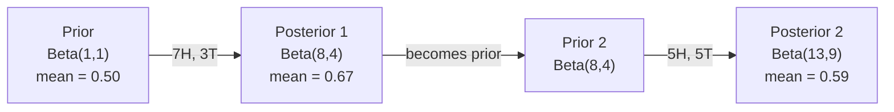

# Bayes' Theorem

> 概率 是 about what you expect. Bayes' theorem 是 about what you learn.

**Type:** Build
**Language:** Python
**Prerequisites:** Phase 1, Lesson 06 (概率 Fundamentals)
**Time:** ~75 minutes

## Learning Objectives

- Apply Bayes' theorem 到 compute posterior probabilities 从 priors, likelihoods, 和 evidence
- Build Naive Bayes text classifier 从 scratch 使用 Laplace smoothing 和 log-space computation
- Compare MLE 和 MAP estimation 和 explain how MAP corresponds 到 L2 正则化
- Implement sequential Bayesian updating using Beta-Binomial conjugate priors 为了 /B 测试

## Problem

medical test 是 99% accurate. You test positive. What 是 chances you actually have disease?

Most people say 99%. real answer depends 在 how rare disease 是. If 1 在 10,000 people have it, positive result only gives you about 1% chance 的 being sick. other 99% 的 positive results 是 false alarms 从 healthy people.

这是 not trick question. 它是 Bayes' theorem. Every spam filter, every medical diagnostic, every machine learning 模型 quantifies uncertainty uses 这个 exact reasoning. You start 使用 belief. You see evidence. You update.

If you build ML systems without understanding 这个, you will misinterpret 模型 输出, set bad thresholds, 和 ship overconfident predictions.

## Concept

### From joint 概率 到 Bayes

You already know 从 Lesson 06 conditional 概率 是:

```
P(A|B) = P(A and B) / P(B)
```

And symmetrically:

```
P(B|A) = P(A and B) / P(A)
```

Both expressions share same numerator: P( 和 B). Set them equal 和 rearrange:

```
P(A and B) = P(A|B) * P(B) = P(B|A) * P(A)

Therefore:

P(A|B) = P(B|A) * P(A) / P(B)
```

那是 Bayes' theorem. Four quantities, one equation.

### four parts

| Part | Name | What it means |
|------|------|---------------|
| P(\|B) | Posterior | Your updated belief about after seeing evidence B |
| P(B\|) | Likelihood | How probable evidence B 是 if 是 true |
| P() | Prior | Your belief about before seeing any evidence |
| P(B) | Evidence | Total 概率 的 seeing B under all possibilities |

evidence term P(B) acts 作为 normalizer. 你可以 expand it using law 的 total 概率:

```
P(B) = P(B|A) * P(A) + P(B|not A) * P(not A)
```

### Medical test example

disease affects 1 在 10,000 people. test 是 99% accurate (catches 99% 的 sick people, gives false positives 1% 的 time).

```
P(sick)          = 0.0001     (prior: disease is rare)
P(positive|sick) = 0.99       (likelihood: test catches it)
P(positive|healthy) = 0.01    (false positive rate)

P(positive) = P(positive|sick) * P(sick) + P(positive|healthy) * P(healthy)
            = 0.99 * 0.0001 + 0.01 * 0.9999
            = 0.000099 + 0.009999
            = 0.010098

P(sick|positive) = P(positive|sick) * P(sick) / P(positive)
                 = 0.99 * 0.0001 / 0.010098
                 = 0.0098
                 = 0.98%
```

Less than 1%. prior dominates. When condition 是 rare, even accurate tests produce mostly false positives. 这是 why doctors order confirmation tests.

### Spam filter example

You receive email containing word "lottery". Is it spam?

```
P(spam)                = 0.3      (30% of email is spam)
P("lottery"|spam)      = 0.05     (5% of spam emails contain "lottery")
P("lottery"|not spam)  = 0.001    (0.1% of legitimate emails contain "lottery")

P("lottery") = 0.05 * 0.3 + 0.001 * 0.7
             = 0.015 + 0.0007
             = 0.0157

P(spam|"lottery") = 0.05 * 0.3 / 0.0157
                  = 0.955
                  = 95.5%
```

One word shifts 概率 从 30% 到 95.5%. real spam filter applies Bayes across hundreds 的 words simultaneously.

### Naive Bayes: independence assumption

Naive Bayes extends 这个 到 multiple 特征 通过 assuming all 特征 是 conditionally independent given class:

```
P(class | feature_1, feature_2, ..., feature_n)
  = P(class) * P(feature_1|class) * P(feature_2|class) * ... * P(feature_n|class)
    / P(feature_1, feature_2, ..., feature_n)
```

"naive" part 是 independence assumption. In text, word occurrences 是 not independent ("New" 和 "York" 是 correlated). But assumption works surprisingly well 在 practice because classifier only needs 到 rank classes, not produce calibrated probabilities.

Since denominator 是 same 为了 all classes, you can skip it 和 just compare numerators:

```
score(class) = P(class) * product of P(feature_i | class)
```

Pick class 使用 highest score.

### Maximum likelihood estimation (MLE)

How do you get P(特征|class) 从 训练 数据? Count.

```
P("free"|spam) = (number of spam emails containing "free") / (total spam emails)
```

这是 MLE: choose 参数 values make observed 数据 most likely. You 是 maximizing likelihood 函数, which 为了 discrete counts reduces 到 relative frequency.

Problem: if word never appears 在 spam during 训练, MLE gives it 概率 zero. One unseen word kills entire product. Fix 这个 使用 Laplace smoothing:

```
P(word|class) = (count(word, class) + 1) / (total_words_in_class + vocabulary_size)
```

Adding 1 到 every count ensures no 概率 是 ever zero.

### Maximum posteriori (MAP)

MLE asks: what 参数 maximize P(数据|参数)?

MAP asks: what 参数 maximize P(参数|数据)?

By Bayes' theorem:

```
P(parameters|data) proportional to P(data|parameters) * P(parameters)
```

MAP adds prior over 参数 themselves. If you believe 参数 should be small, you encode 作为 prior penalizes large values. 这是 identical 到 L2 正则化 在 ML. "ridge" penalty 在 ridge 回归 是 literally Gaussian prior 在 权重.

| Estimation | Optimizes | ML equivalent |
|------------|-----------|---------------|
| MLE | P(数据\|params) | Unregularized 训练 |
| MAP | P(数据\|params) * P(params) | L2 / L1 正则化 |

### Bayesian vs frequentist: practical difference

Frequentists treat 参数 作为 fixed unknowns. They ask: "If I repeated 这个 experiment many times, what would happen?"

Bayesians treat 参数 作为 distributions. They ask: "Given what I have observed, what do I believe about 参数?"

For building ML systems, practical difference:

| Aspect | Frequentist | Bayesian |
|--------|-------------|----------|
| 输出 | Point estimate | Distribution over values |
| Uncertainty | Confidence intervals (about procedure) | Credible intervals (about 参数) |
| Small 数据 | Can overfit | Prior acts 作为 正则化 |
| Computation | Usually faster | Often requires sampling (MCMC) |

Most production ML 是 frequentist (SGD, point estimates). Bayesian methods shine when you need calibrated uncertainty (medical decisions, safety-critical systems) 或 when 数据 是 scarce (few-shot learning, cold start).

### Why Bayesian thinking matters 为了 ML

connection 是 deeper than analogy:

**Priors 是 正则化.** Gaussian prior 在 权重 是 L2 正则化. Laplace prior 是 L1. Every time you add 正则化 term, you 是 making Bayesian statement about what 参数 values you expect.

**Posteriors 是 uncertainty.** single predicted 概率 tells you nothing about how confident 模型 是 在 estimate. Bayesian methods give you distribution: "I think P(spam) 是 between 0.8 和 0.95."

**Bayes updates 是 online learning.** Today's posterior becomes tomorrow's prior. When your 模型 sees new 数据, it updates its beliefs incrementally instead 的 retraining 从 scratch.

**模型 comparison 是 Bayesian.** Bayesian information criterion (BIC), marginal likelihood, 和 Bayes factors all use Bayesian reasoning 到 choose between 模型 without 过拟合.

## Build It

### Step 1: Bayes theorem 函数

```python
def bayes(prior, likelihood, false_positive_rate):
    evidence = likelihood * prior + false_positive_rate * (1 - prior)
    posterior = likelihood * prior / evidence
    return posterior

result = bayes(prior=0.0001, likelihood=0.99, false_positive_rate=0.01)
print(f"P(sick|positive) = {result:.4f}")
```

### Step 2: Naive Bayes classifier

```python
import math
from collections import defaultdict

class NaiveBayes:
    def __init__(self, smoothing=1.0):
        self.smoothing = smoothing
        self.class_counts = defaultdict(int)
        self.word_counts = defaultdict(lambda: defaultdict(int))
        self.class_word_totals = defaultdict(int)
        self.vocab = set()

    def train(self, documents, labels):
        for doc, label in zip(documents, labels):
            self.class_counts[label] += 1
            words = doc.lower().split()
            for word in words:
                self.word_counts[label][word] += 1
                self.class_word_totals[label] += 1
                self.vocab.add(word)

    def predict(self, document):
        words = document.lower().split()
        total_docs = sum(self.class_counts.values())
        vocab_size = len(self.vocab)
        best_class = None
        best_score = float("-inf")
        for cls in self.class_counts:
            score = math.log(self.class_counts[cls] / total_docs)
            for word in words:
                count = self.word_counts[cls].get(word, 0)
                total = self.class_word_totals[cls]
                score += math.log((count + self.smoothing) / (total + self.smoothing * vocab_size))
            if score > best_score:
                best_score = score
                best_class = cls
        return best_class
```

Log probabilities prevent underflow. Multiplying many small probabilities produces numbers too tiny 为了 floating point. Summing log-probabilities 是 numerically stable 和 mathematically equivalent.

### Step 3: Train 在 spam 数据

```python
train_docs = [
    "win free money now",
    "free lottery ticket winner",
    "claim your prize today free",
    "urgent offer free cash",
    "congratulations you won free",
    "meeting tomorrow at noon",
    "project update attached",
    "can we schedule a call",
    "quarterly report review",
    "lunch on thursday sounds good",
    "team standup notes attached",
    "please review the pull request",
]

train_labels = [
    "spam", "spam", "spam", "spam", "spam",
    "ham", "ham", "ham", "ham", "ham", "ham", "ham",
]

classifier = NaiveBayes()
classifier.train(train_docs, train_labels)

test_messages = [
    "free money waiting for you",
    "meeting rescheduled to friday",
    "you won a free prize",
    "please review the attached report",
]

for msg in test_messages:
    print(f"  '{msg}' -> {classifier.predict(msg)}")
```

### Step 4: Inspect learned probabilities

```python
def show_top_words(classifier, cls, n=5):
    vocab_size = len(classifier.vocab)
    total = classifier.class_word_totals[cls]
    probs = {}
    for word in classifier.vocab:
        count = classifier.word_counts[cls].get(word, 0)
        probs[word] = (count + classifier.smoothing) / (total + classifier.smoothing * vocab_size)
    sorted_words = sorted(probs.items(), key=lambda x: x[1], reverse=True)
    for word, prob in sorted_words[:n]:
        print(f"    {word}: {prob:.4f}")

print("\nTop spam words:")
show_top_words(classifier, "spam")
print("\nTop ham words:")
show_top_words(classifier, "ham")
```

## Use It

Scikit-learn ships production-ready naive Bayes implementations:

```python
from sklearn.feature_extraction.text import CountVectorizer
from sklearn.naive_bayes import MultinomialNB
from sklearn.metrics import classification_report

vectorizer = CountVectorizer()
X_train = vectorizer.fit_transform(train_docs)
clf = MultinomialNB()
clf.fit(X_train, train_labels)

X_test = vectorizer.transform(test_messages)
predictions = clf.predict(X_test)
for msg, pred in zip(test_messages, predictions):
    print(f"  '{msg}' -> {pred}")
```

Same 算法. CountVectorizer handles tokenization 和 vocabulary building. MultinomialNB handles smoothing 和 log-probabilities internally. Your 从-scratch version does same thing 在 40 lines.

## Ship It

NaiveBayes class built here demonstrates full pipeline: tokenization, 概率 estimation 使用 Laplace smoothing, log-space prediction. 代码 在 `代码/bayes.py` runs end-到-end 使用 no dependencies beyond Python's standard library.

### Conjugate Priors

When prior 和 posterior belong 到 same family 的 distributions, prior 是 called "conjugate." This makes Bayesian updating algebraically clean -- you get closed-form posterior without numerical integration.

| Likelihood | Conjugate Prior | Posterior | Example |
|-----------|----------------|-----------|---------|
| Bernoulli | Beta(, b) | Beta( + successes, b + failures) | Coin flip 偏置 estimation |
| Normal (known variance) | Normal(mu_0, sigma_0) | Normal(weighted mean, smaller variance) | Sensor calibration |
| Poisson | Gamma(, b) | Gamma( + sum 的 counts, b + n) | Modeling arrival rates |
| Multinomial | Dirichlet(alpha) | Dirichlet(alpha + counts) | Topic modeling, language 模型 |

Why 这个 matters: without conjugate priors, you need Monte Carlo sampling 或 variational inference 到 approximate posterior. With conjugate priors, you just update two numbers.

Beta distribution 是 most common conjugate prior 在 practice. Beta(, b) represents your belief about 概率 参数. mean 是 /(+b). larger +b, more concentrated (confident) distribution.

Special cases 的 Beta prior:
- Beta(1, 1) = uniform. You have no opinion about 参数.
- Beta(10, 10) = peaked 在 0.5. You strongly believe 参数 是 near 0.5.
- Beta(1, 10) = skewed toward 0. You believe 参数 是 small.

update rule 是 dead simple:

```
Prior:     Beta(a, b)
Data:      s successes, f failures
Posterior: Beta(a + s, b + f)
```

No integrals. No sampling. Just addition.

### Sequential Bayesian Updating

Bayesian inference 是 naturally sequential. Today's posterior becomes tomorrow's prior. 这是 how real systems learn incrementally without reprocessing all historical 数据.

Concrete example: estimating whether coin 是 fair.

**Day 1: No 数据 yet.**
Start 使用 Beta(1, 1) -- uniform prior. You have no opinion.
- Prior mean: 0.5
- Prior 是 flat across [0, 1]

**Day 2: Observe 7 heads, 3 tails.**
Posterior = Beta(1 + 7, 1 + 3) = Beta(8, 4)
- Posterior mean: 8/12 = 0.667
- Evidence suggests coin 是 biased toward heads

**Day 3: Observe 5 more heads, 5 more tails.**
Use yesterday's posterior 作为 today's prior.
Posterior = Beta(8 + 5, 4 + 5) = Beta(13, 9)
- Posterior mean: 13/22 = 0.591
- balanced new 数据 pulled estimate back toward 0.5



order 的 observations does not matter. Beta(1,1) updated 使用 all 12 heads 和 8 tails 在 once gives Beta(13, 9) -- same result. Sequential updating 和 批次 updating 是 mathematically equivalent. But sequential updating lets you make decisions 在 each step without storing raw 数据.

这是 foundation 的 online learning 在 production ML systems. Thompson sampling 为了 bandits, incremental recommendation systems, 和 streaming anomaly detectors all use 这个 pattern.

### Connection 到 /B 测试

/B 测试 是 Bayesian inference 在 disguise.

Setup: you 是 测试 two button colors. Variant (blue) 和 variant B (green). You want 到 know which one gets more clicks.

Bayesian /B test:

1. **Prior.** Start 使用 Beta(1, 1) 为了 both variants. No prior preference.
2. **数据.** Variant : 50 clicks out 的 1000 views. Variant B: 65 clicks out 的 1000 views.
3. **Posteriors.**
- : Beta(1 + 50, 1 + 950) = Beta(51, 951). Mean = 0.051
- B: Beta(1 + 65, 1 + 935) = Beta(66, 936). Mean = 0.066
4. **Decision.** Compute P(B > ) -- 概率 B's true conversion rate 是 higher than 's.

Computing P(B > ) analytically 是 hard. But Monte Carlo makes it trivial:

```
1. Draw 100,000 samples from Beta(51, 951)  -> samples_A
2. Draw 100,000 samples from Beta(66, 936)  -> samples_B
3. P(B > A) = fraction of samples where B > A
```

If P(B > ) > 0.95, you ship variant B. If it 是 between 0.05 和 0.95, you keep collecting 数据. If P(B > ) < 0.05, you ship variant .

Advantages over frequentist /B 测试:
- You get direct 概率 statement: "there 是 97% chance B 是 better"
- No p-value confusion. No "fail 到 reject null hypothesis" hedging.
- 你可以 check results 在 any time without inflating false positive rates (no "peeking problem")
- 你可以 incorporate prior knowledge (e.g., previous tests suggest conversion rates 是 usually 3-8%)

| Aspect | Frequentist /B | Bayesian /B |
|--------|----------------|--------------|
| 输出 | p-value | P(B > ) |
| Interpretation | "How surprising 是 这个 数据 if =B?" | "How likely 是 B better than ?" |
| Early stopping | Inflates false positives | Safe 在 any point (given well-chosen prior 和 correctly specified 模型) |
| Prior knowledge | Not used | Encoded 作为 Beta prior |
| Decision rule | p < 0.05 | P(B > ) > threshold |

## Exercises

1. **Multiple tests.** patient tests positive twice 在 independent tests (both 99% accurate, disease prevalence 1 在 10,000). What 是 P(sick) after both tests? Use posterior 从 first test 作为 prior 为了 second.

2. **Smoothing impact.** Run spam classifier 使用 smoothing values 的 0.01, 0.1, 1.0, 和 10.0. How do top word probabilities change? What happens 使用 smoothing=0 和 word appears only 在 ham?

3. **Add 特征.** Extend NaiveBayes class 到 also use message length (short/long) 作为 特征 alongside word counts. Estimate P(short|spam) 和 P(short|ham) 从 训练 数据 和 fold it into prediction score.

4. **MAP 通过 hand.** Given observed 数据 (7 heads 在 10 coin flips), compute MAP estimate 的 偏置 using Beta(2,2) prior. Compare it 到 MLE estimate (7/10).

## Key Terms

| Term | What people say | What it actually means |
|------|----------------|----------------------|
| Prior | "My initial guess" | P(hypothesis) before observing evidence. In ML: 正则化 term. |
| Likelihood | "How well 数据 fits" | P(evidence\|hypothesis). How probable observed 数据 是 under specific hypothesis. |
| Posterior | "My updated belief" | P(hypothesis\|evidence). prior multiplied 通过 likelihood, then normalized. |
| Evidence | " normalizing constant" | P(数据) across all hypotheses. Ensures posterior sums 到 1. |
| Naive Bayes | "That simple text classifier" | classifier assumes 特征 是 independent given class. Works well despite false assumption. |
| Laplace smoothing | "Add-one smoothing" | Adding small count 到 every 特征 到 prevent zero probabilities 从 unseen 数据. |
| MLE | "Just use frequencies" | Choose 参数 maximize P(数据\|参数). No prior. Can overfit 使用 small 数据. |
| MAP | "MLE 使用 prior" | Choose 参数 maximize P(数据\|参数) * P(参数). Equivalent 到 regularized MLE. |
| Log-概率 | "Work 在 log space" | Using log(P) instead 的 P 到 avoid floating-point underflow when multiplying many small numbers. |
| False positive | " wrong alarm" | test says positive, but true state 是 negative. Drives base rate fallacy. |

## Further Reading

- [3Blue1Brown: Bayes' theorem](https://www.youtube.com/watch?v=HZGCoVF3YvM) - visual explanation 使用 medical test example
- [Stanford CS229: Generative Learning Algorithms](https://cs229.stanford.edu/notes2022fall/cs229-notes2.pdf) - naive Bayes 和 its connection 到 discriminative 模型
- [Think Bayes](https://greenteapress.com/wp/think-bayes/) - free book, Bayesian 统计学 使用 Python 代码
- [scikit-learn Naive Bayes](https://scikit-learn.org/stable/modules/naive_bayes.html) - production implementations 和 when 到 use each variant
