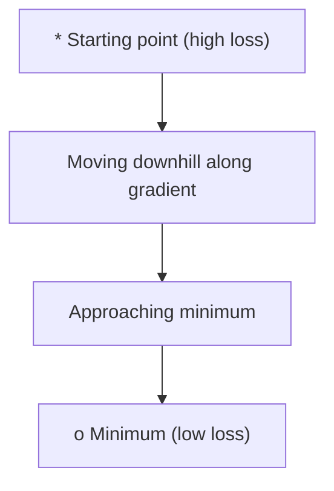
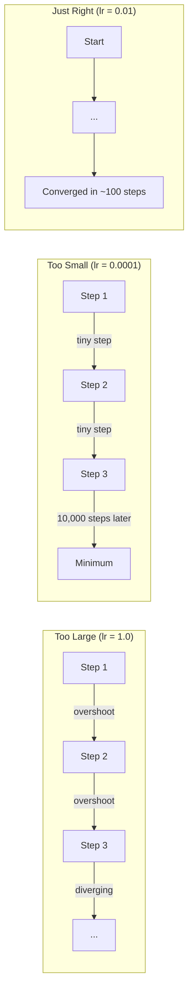
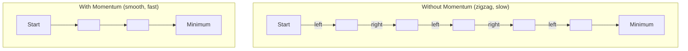
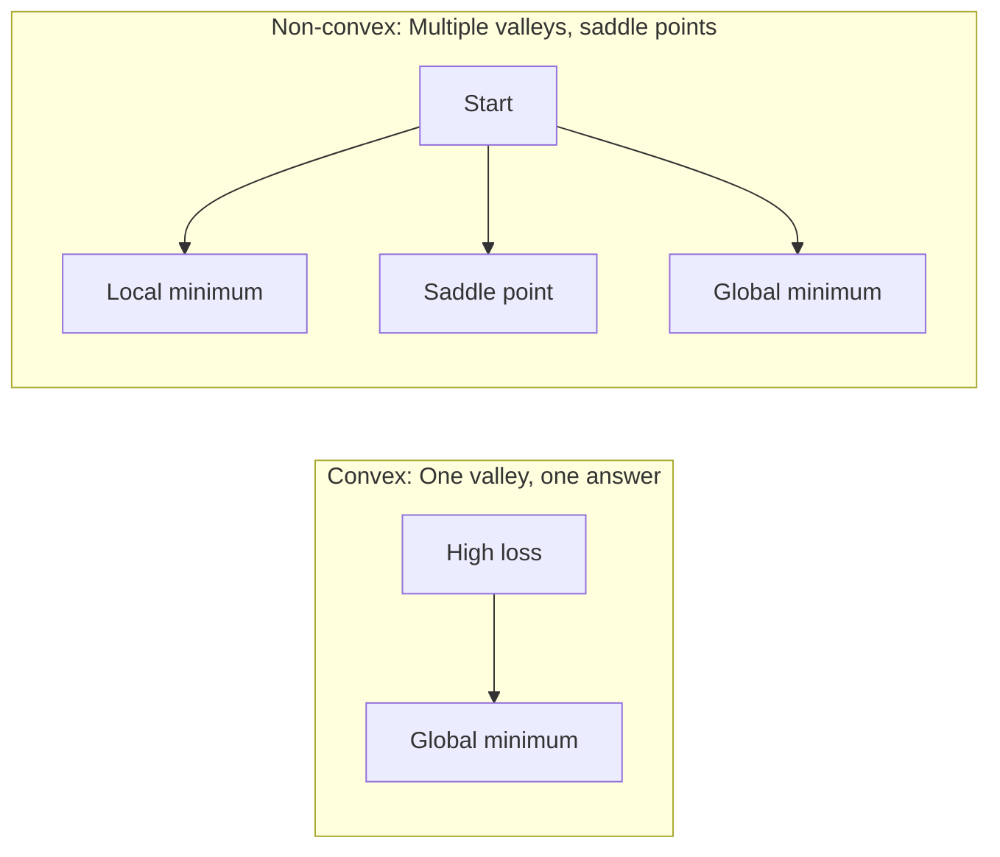
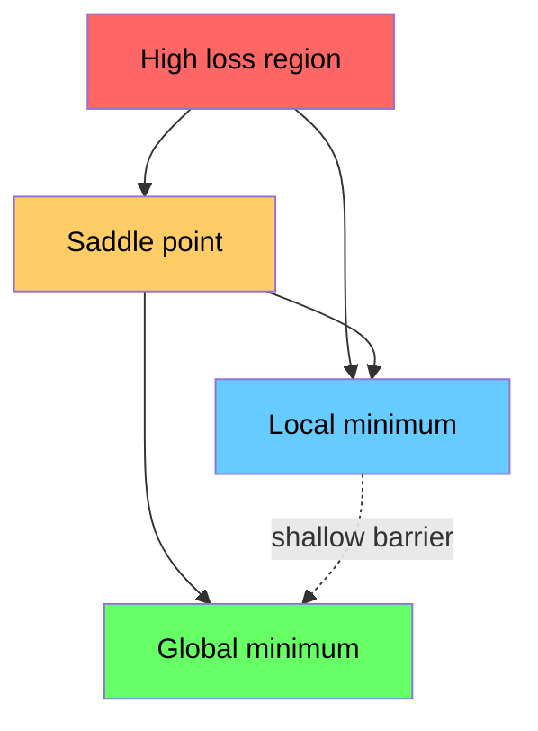

# Optimization

> 训练 神经网络 是 nothing more than finding bottom 的 valley.

**Type:** Build
**Language:** Python
**Prerequisites:** Phase 1, Lessons 04-05 (Derivatives, Gradients)
**Time:** ~75 minutes

## Learning Objectives

- Implement vanilla 梯度下降, SGD 使用 momentum, 和 Adam 从 scratch
- Compare 优化器 收敛 在 Rosenbrock 函数 和 explain why Adam adapts per-权重 learning rates
- Distinguish convex 从 non-convex loss landscapes 和 explain role 的 saddle points 在 high dimensions
- Configure 学习率 schedules (step decay, cosine annealing, warmup) 为了 训练 stability

## Problem

You have 损失函数. It tells you how wrong your 模型 是. You have gradients. They tell you which direction makes loss worse. Now you need strategy 为了 walking downhill.

naive approach 是 simple: move opposite gradient. Scale step 通过 some number called 学习率. Repeat. 这是 梯度下降, 和 it works. But "works" has caveats. Too large 学习率 和 you overshoot valley entirely, bouncing between walls. Too small 和 you crawl toward answer over thousands 的 unnecessary steps. Hit saddle point 和 you stop moving even though you have not found minimum.

Every 优化器 在 deep learning 是 answer 到 same question: how do you get 到 bottom 的 valley faster 和 more reliably?

## Concept

### What optimization means

Optimization 是 finding 输入 values minimize (或 maximize) 函数. In machine learning, 函数 是 loss. 输入 是 模型's 权重. 训练 是 optimization.

```
minimize L(w) where:
  L = loss function
  w = model weights (could be millions of parameters)
```

### Gradient descent (vanilla)

simplest 优化器. Compute gradient 的 loss 使用 respect 到 every 权重. Move each 权重 在 opposite direction 的 its gradient. Scale step 通过 学习率.

```
w = w - lr * gradient
```

那是 entire 算法. One line.



### Learning rate: most important 超参数

学习率 controls step size. It determines everything about 收敛.



有 no formula 为了 right 学习率. You find it 通过 experiment. Common starting points: 0.001 为了 Adam, 0.01 为了 SGD 使用 momentum.

### SGD vs 批次 vs mini-批次

Vanilla 梯度下降 computes gradient over entire 数据集 before taking one step. 这是 called 批次 梯度下降. 它是 stable but slow.

Stochastic 梯度下降 (SGD) computes gradient 在 single random sample 和 steps immediately. 它是 noisy but fast.

Mini-批次 梯度下降 splits difference. Compute gradient over small 批次 (32, 64, 128, 256 samples), then step. 这是 what everyone actually uses.

| Variant | 批次 size | Gradient quality | Speed per step | Noise |
|---------|-----------|-----------------|---------------|-------|
| 批次 GD | Entire 数据集 | Exact | Slow | None |
| SGD | 1 sample | Very noisy | Fast | High |
| Mini-批次 | 32-256 | Good estimate | Balanced | Moderate |

noise 在 SGD 和 mini-批次 是 not bug. It helps escape shallow local minima 和 saddle points.

### Momentum: ball rolling downhill

Vanilla 梯度下降 only looks 在 current gradient. If gradient zigzags (common 在 narrow valleys), progress 是 slow. Momentum fixes 这个 通过 accumulating past gradients into velocity term.

```
v = beta * v + gradient
w = w - lr * v
```

analogy: ball rolling downhill. It does not stop 和 restart 在 every bump. It builds speed 在 consistent directions 和 dampens oscillations.



`beta` (typically 0.9) controls how much history 到 keep. Higher beta means more momentum, smoother paths, but slower response 到 direction changes.

### Adam: adaptive learning rates

Different 权重 need different learning rates. 权重 rarely gets large gradients should take bigger steps when it finally does. 权重 gets huge gradients constantly should take smaller steps.

Adam (Adaptive Moment Estimation) tracks two things per 权重:

1. First moment (m): running average 的 gradients (like momentum)
2. Second moment (v): running average 的 squared gradients (gradient magnitude)

```
m = beta1 * m + (1 - beta1) * gradient
v = beta2 * v + (1 - beta2) * gradient^2

m_hat = m / (1 - beta1^t)    bias correction
v_hat = v / (1 - beta2^t)    bias correction

w = w - lr * m_hat / (sqrt(v_hat) + epsilon)
```

division 通过 `sqrt(v_hat)` 是 key insight. Weights 使用 large gradients get divided 通过 large number (small effective step). Weights 使用 small gradients get divided 通过 small number (large effective step). Each 权重 gets its own adaptive 学习率.

Default 超参数: `lr=0.001, beta1=0.9, beta2=0.999, epsilon=1e-8`. These defaults work well 为了 most problems.

### Learning rate schedules

fixed 学习率 是 compromise. Early 在 训练, you want large steps 到 make fast progress. Late 在 训练, you want small steps 到 fine-tune near minimum.

Common schedules:

| Schedule | Formula | Use case |
|----------|---------|----------|
| Step decay | lr = lr * factor every N 轮次 | Simple, manual control |
| Exponential decay | lr = lr_0 * decay^t | Smooth reduction |
| Cosine annealing | lr = lr_min + 0.5 * (lr_max - lr_min) * (1 + cos(pi * t / T)) | Transformers, modern 训练 |
| Warmup + decay | Linear ramp up, then decay | Large 模型, prevents early instability |

### Convex vs non-convex

convex 函数 has one minimum. Gradient descent always finds it. quadratic like `f(x) = x^2` 是 convex.

Neural network loss 函数 是 non-convex. They have many local minima, saddle points, 和 flat regions.



In practice, local minima 在 high-dimensional 神经网络 是 rarely problem. Most local minima have loss values close 到 global minimum. Saddle points (flat 在 some directions, curved 在 others) 是 real obstacle. Momentum 和 noise 从 mini-批次 help escape them.

### Loss landscape visualization

loss 是 函数 的 all 权重. For 模型 使用 1 million 权重, loss landscape lives 在 1,000,001-dimensional space. We visualize it 通过 picking two random directions 在 权重 space 和 plotting loss along 那些 directions, producing 2D surface.



Sharp minima generalize poorly. Flat minima generalize well. 这是 one reason SGD 使用 momentum often outperforms Adam 在 final test 准确率: its noise prevents settling into sharp minima.

## Build It

### Step 1: Define test 函数

Rosenbrock 函数 是 classic optimization benchmark. Its minimum 是 在 (1, 1) inside narrow curved valley 是 easy 到 find but hard 到 follow.

```
f(x, y) = (1 - x)^2 + 100 * (y - x^2)^2
```

```python
def rosenbrock(params):
    x, y = params
    return (1 - x) ** 2 + 100 * (y - x ** 2) ** 2

def rosenbrock_gradient(params):
    x, y = params
    df_dx = -2 * (1 - x) + 200 * (y - x ** 2) * (-2 * x)
    df_dy = 200 * (y - x ** 2)
    return [df_dx, df_dy]
```

### Step 2: Vanilla 梯度下降

```python
class GradientDescent:
    def __init__(self, lr=0.001):
        self.lr = lr

    def step(self, params, grads):
        return [p - self.lr * g for p, g in zip(params, grads)]
```

### Step 3: SGD 使用 momentum

```python
class SGDMomentum:
    def __init__(self, lr=0.001, momentum=0.9):
        self.lr = lr
        self.momentum = momentum
        self.velocity = None

    def step(self, params, grads):
        if self.velocity is None:
            self.velocity = [0.0] * len(params)
        self.velocity = [
            self.momentum * v + g
            for v, g in zip(self.velocity, grads)
        ]
        return [p - self.lr * v for p, v in zip(params, self.velocity)]
```

### Step 4: Adam

```python
class Adam:
    def __init__(self, lr=0.001, beta1=0.9, beta2=0.999, epsilon=1e-8):
        self.lr = lr
        self.beta1 = beta1
        self.beta2 = beta2
        self.epsilon = epsilon
        self.m = None
        self.v = None
        self.t = 0

    def step(self, params, grads):
        if self.m is None:
            self.m = [0.0] * len(params)
            self.v = [0.0] * len(params)

        self.t += 1

        self.m = [
            self.beta1 * m + (1 - self.beta1) * g
            for m, g in zip(self.m, grads)
        ]
        self.v = [
            self.beta2 * v + (1 - self.beta2) * g ** 2
            for v, g in zip(self.v, grads)
        ]

        m_hat = [m / (1 - self.beta1 ** self.t) for m in self.m]
        v_hat = [v / (1 - self.beta2 ** self.t) for v in self.v]

        return [
            p - self.lr * mh / (vh ** 0.5 + self.epsilon)
            for p, mh, vh in zip(params, m_hat, v_hat)
        ]
```

### Step 5: Run 和 compare

```python
def optimize(optimizer, func, grad_func, start, steps=5000):
    params = list(start)
    history = [params[:]]
    for _ in range(steps):
        grads = grad_func(params)
        params = optimizer.step(params, grads)
        history.append(params[:])
    return history

start = [-1.0, 1.0]

gd_history = optimize(GradientDescent(lr=0.0005), rosenbrock, rosenbrock_gradient, start)
sgd_history = optimize(SGDMomentum(lr=0.0001, momentum=0.9), rosenbrock, rosenbrock_gradient, start)
adam_history = optimize(Adam(lr=0.01), rosenbrock, rosenbrock_gradient, start)

for name, history in [("GD", gd_history), ("SGD+M", sgd_history), ("Adam", adam_history)]:
    final = history[-1]
    loss = rosenbrock(final)
    print(f"{name:6s} -> x={final[0]:.6f}, y={final[1]:.6f}, loss={loss:.8f}")
```

Expected 输出: Adam converges fastest. SGD 使用 momentum follows smoother path. Vanilla GD makes slow progress along narrow valley.

## Use It

In practice, use PyTorch 或 JAX optimizers. They handle 参数 groups, 权重 decay, gradient clipping, 和 GPU acceleration.

```python
import torch

model = torch.nn.Linear(784, 10)

sgd = torch.optim.SGD(model.parameters(), lr=0.01, momentum=0.9)
adam = torch.optim.Adam(model.parameters(), lr=0.001)
adamw = torch.optim.AdamW(model.parameters(), lr=0.001, weight_decay=0.01)

scheduler = torch.optim.lr_scheduler.CosineAnnealingLR(adam, T_max=100)
```

Rules 的 thumb:

- Start 使用 Adam (lr=0.001). It works 为了 most problems without tuning.
- Switch 到 SGD 使用 momentum (lr=0.01, momentum=0.9) when you need best final 准确率 和 can afford more tuning.
- Use AdamW (Adam 使用 decoupled 权重 decay) 为了 transformers.
- Always use 学习率 schedule 为了 训练 runs longer than few 轮次.
- If 训练 是 unstable, reduce 学习率. If 训练 是 too slow, increase it.

## Ship It

This lesson produces prompt 为了 choosing right 优化器. See `输出/prompt-优化器-guide.md`.

优化器 classes built here reappear 在 Phase 3 when we train 神经网络 从 scratch.

## Exercises

1. **Learning rate sweep.** Run vanilla 梯度下降 在 Rosenbrock 函数 使用 learning rates [0.0001, 0.0005, 0.001, 0.005, 0.01]. Plot 或 print final loss after 5000 steps 为了 each. Find largest 学习率 still converges.

2. **Momentum comparison.** Run SGD 使用 momentum values [0.0, 0.5, 0.9, 0.99] 在 Rosenbrock 函数. Track loss 在 every step. Which momentum value converges fastest? Which overshoots?

3. **Saddle point escape.** Define 函数 `f(x, y) = x^2 - y^2` ( saddle point 在 origin). Start 在 (0.01, 0.01). Compare how vanilla GD, SGD 使用 momentum, 和 Adam behave. Which escapes saddle point?

4. **Implement 学习率 decay.** Add exponential decay schedule 到 GradientDescent class: `lr = lr_0 * 0.999^step`. Compare 收敛 使用 和 without decay 在 Rosenbrock 函数.

## Key Terms

| Term | What people say | What it actually means |
|------|----------------|----------------------|
| Gradient descent | "Go downhill" | Update 权重 通过 subtracting gradient scaled 通过 学习率. most basic 优化器. |
| Learning rate | "Step size" | scalar controls how far each update moves 权重. Too large causes divergence. Too small wastes compute. |
| Momentum | "Keep rolling" | Accumulate past gradients into velocity 向量. Dampens oscillations 和 accelerates movement through consistent directions. |
| SGD | "Random sampling" | Stochastic 梯度下降. Compute gradient 在 random subset instead 的 full 数据集. Almost always means mini-批次 SGD 在 practice. |
| Mini-批次 | " chunk 的 数据" | small subset 的 训练 数据 (32-256 samples) used 到 estimate gradient. Balances speed 和 gradient 准确率. |
| Adam | " default 优化器" | Adaptive Moment Estimation. Tracks per-权重 running averages 的 gradients 和 squared gradients 到 give each 权重 its own 学习率. |
| 偏置 correction | "Fix cold start" | Adam's first 和 second moments 是 initialized 到 zero. 偏置 correction divides 通过 (1 - beta^t) 到 compensate during early steps. |
| Learning rate schedule | "Change lr over time" | 函数 adjusts 学习率 during 训练. Large steps early, small steps late. |
| Convex 函数 | "One valley" | 函数 where any local minimum 是 global minimum. Gradient descent always finds it. Neural network losses 是 not convex. |
| Saddle point | "Flat but not minimum" | point where gradient 是 zero but it 是 minimum 在 some directions 和 maximum 在 others. Common 在 high dimensions. |
| Loss landscape | " terrain" | 损失函数 plotted over 权重 space. Visualized 通过 slicing along two random directions. |
| 收敛 | "Getting there" | 优化器 has reached point where further steps do not meaningfully reduce loss. |

## Further Reading

- [Sebastian Ruder: overview 的 梯度下降 optimization 算法](https://ruder.io/optimizing-gradient-descent/) - comprehensive survey 的 all major optimizers
- [Why Momentum Really Works (Distill)](https://distill.pub/2017/momentum/) - interactive visualization 的 momentum dynamics
- [Adam: Method 为了 Stochastic Optimization (Kingma & Ba, 2014)](https://arxiv.org/abs/1412.6980) - original Adam paper, readable 和 short
- [Visualizing Loss Landscape 的 Neural Nets (Li et al., 2018)](https://arxiv.org/abs/1712.09913) - paper showed sharp vs flat minima
