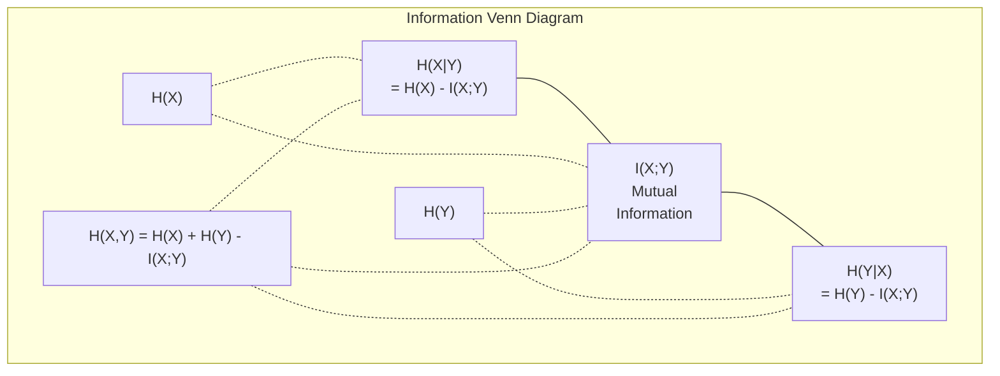

# Information Theory

> Information theory measures surprise. Loss 函数 是 built 在 it.

**Type:** Learn
**Language:** Python
**Prerequisites:** Phase 1, Lesson 06 (概率)
**Time:** ~60 minutes

## Learning Objectives

- Compute entropy, cross-entropy, 和 KL divergence 从 scratch 和 explain their relationship
- Derive why minimizing cross-entropy loss 是 equivalent 到 maximizing log-likelihood
- Calculate mutual information between 特征 和 target 到 rank 特征 importance
- Explain perplexity 作为 effective vocabulary size language 模型 chooses 从

## Problem

You call `CrossEntropyLoss()` 在 every 分类 模型 you train. You see "perplexity" 在 every language 模型 paper. You read about KL divergence 在 VAEs, distillation, 和 RLHF. These 是 not disconnected concepts. They 是 all same idea wearing different hats.

Information theory gives you language 到 reason about uncertainty, compression, 和 prediction. Claude Shannon invented it 在 1948 到 solve communication problems. Turns out, 训练 神经网络 是 communication problem: 模型 是 trying 到 transmit correct label through noisy channel 的 learned 权重.

This lesson builds every formula 从 scratch so you see where they come 从 和 why they work.

## Concept

### Information Content (Surprise)

When something unlikely happens, it carries more information. coin landing heads? Not surprising. lottery win? Very surprising.

information content 的 event 使用 概率 p 是:

```
I(x) = -log(p(x))
```

Using log base 2 gives you bits. Using natural log gives you nats. Same idea, different units.

```
Event              Probability    Surprise (bits)
Fair coin heads    0.5            1.0
Rolling a 6        0.167          2.58
1-in-1000 event    0.001          9.97
Certain event      1.0            0.0
```

Certain events carry zero information. You already knew they would happen.

### Entropy (Average Surprise)

Entropy 是 expected surprise across all possible outcomes 的 distribution.

```
H(P) = -sum( p(x) * log(p(x)) )  for all x
```

fair coin has maximum entropy 为了 binary variable: 1 bit. biased coin (99% heads) has low entropy: 0.08 bits. You already know what will happen, so each flip tells you almost nothing.

```
Fair coin:    H = -(0.5 * log2(0.5) + 0.5 * log2(0.5)) = 1.0 bit
Biased coin:  H = -(0.99 * log2(0.99) + 0.01 * log2(0.01)) = 0.08 bits
```

Entropy measures irreducible uncertainty 在 distribution. You cannot compress below it.

### Cross-Entropy ( 损失函数 You Use Every Day)

Cross-entropy measures average surprise when you use distribution Q 到 encode events actually come 从 distribution P.

```
H(P, Q) = -sum( p(x) * log(q(x)) )  for all x
```

P 是 true distribution ( labels). Q 是 your 模型's predictions. If Q matches P perfectly, cross-entropy equals entropy. Any mismatch makes it larger.

In 分类, P 是 one-hot 向量 ( true class has 概率 1, everything else 0). This simplifies cross-entropy 到:

```
H(P, Q) = -log(q(true_class))
```

那是 entire cross-entropy loss formula 为了 分类. Maximize predicted 概率 的 correct class.

### KL Divergence (Distance Between Distributions)

KL divergence measures how much extra surprise you get 从 using Q instead 的 P.

```
D_KL(P || Q) = sum( p(x) * log(p(x) / q(x)) )  for all x
             = H(P, Q) - H(P)
```

Cross-entropy 是 entropy plus KL divergence. Since entropy 的 true distribution 是 constant during 训练, minimizing cross-entropy 是 same 作为 minimizing KL divergence. You 是 pushing your 模型's distribution toward true distribution.

KL divergence 是 not symmetric: D_KL(P || Q) != D_KL(Q || P). 它是 not true distance metric.

### Mutual Information

Mutual information measures how much knowing one variable tells you about another.

```
I(X; Y) = H(X) - H(X|Y)
        = H(X) + H(Y) - H(X, Y)
```

If X 和 Y 是 independent, mutual information 是 zero. Knowing one tells you nothing about other. If they 是 perfectly correlated, mutual information equals entropy 的 either variable.

In 特征 selection, high mutual information between 特征 和 target means 特征 是 useful. Low mutual information means it 是 noise.

### Conditional Entropy

H(Y|X) measures how much uncertainty remains about Y after you observe X.

```
H(Y|X) = H(X,Y) - H(X)
```

Two extremes:
- If X completely determines Y, then H(Y|X) = 0. Knowing X eliminates all uncertainty about Y. Example: X = temperature 在 Celsius, Y = temperature 在 Fahrenheit.
- If X tells you nothing about Y, then H(Y|X) = H(Y). Knowing X does not reduce your uncertainty 在 all. Example: X = coin flip, Y = tomorrow's weather.

Conditional entropy 是 always non-negative 和 never exceeds H(Y):

```
0 <= H(Y|X) <= H(Y)
```

In machine learning, conditional entropy appears 在 decision trees. At each split, 算法 picks 特征 X minimizes H(Y|X) -- 特征 removes most uncertainty about label Y.

### Joint Entropy

H(X,Y) 是 entropy 的 joint distribution 的 X 和 Y together.

```
H(X,Y) = -sum sum p(x,y) * log(p(x,y))   for all x, y
```

Key property:

```
H(X,Y) <= H(X) + H(Y)
```

Equality holds when X 和 Y 是 independent. If they share information, joint entropy 是 less than sum 的 individual entropies. "missing" entropy 是 exactly mutual information.



relationships:
- H(X,Y) = H(X) + H(Y|X) = H(Y) + H(X|Y)
- I(X;Y) = H(X) - H(X|Y) = H(Y) - H(Y|X)
- H(X,Y) = H(X) + H(Y) - I(X;Y)

### Mutual Information (Deep Dive)

Mutual information I(X;Y) quantifies how much knowing one variable reduces uncertainty about other.

```
I(X;Y) = H(X) - H(X|Y)
       = H(Y) - H(Y|X)
       = H(X) + H(Y) - H(X,Y)
       = sum sum p(x,y) * log(p(x,y) / (p(x) * p(y)))
```

Properties:
- I(X;Y) >= 0 always. You never lose information 通过 observing something.
- I(X;Y) = 0 if 和 only if X 和 Y 是 independent.
- I(X;Y) = I(Y;X). 它是 symmetric, unlike KL divergence.
- I(X;X) = H(X). variable shares all its information 使用 itself.

**Mutual information 为了 特征 selection.** In ML, you want 特征 是 informative about target. Mutual information gives you principled way 到 rank 特征:

1. For each 特征 X_i, compute I(X_i; Y) where Y 是 target variable.
2. Rank 特征 通过 MI score.
3. Keep top k 特征.

This works 为了 any relationship between 特征 和 target -- linear, nonlinear, monotonic, 或 not. Correlation only catches linear relationships. MI catches everything.

| Method | Detects | Computational cost | Handles categorical? |
|--------|---------|-------------------|---------------------|
| Pearson correlation | Linear relationships | O(n) | No |
| Spearman correlation | Monotonic relationships | O(n log n) | No |
| Mutual information | Any statistical dependency | O(n log n) 使用 binning | Yes |

### Label Smoothing 和 Cross-Entropy

Standard 分类 uses hard targets: [0, 0, 1, 0]. true class gets 概率 1, everything else gets 0. Label smoothing replaces 这些 使用 soft targets:

```
soft_target = (1 - epsilon) * hard_target + epsilon / num_classes
```

With epsilon = 0.1 和 4 classes:
- Hard target: [0, 0, 1, 0]
- Soft target: [0.025, 0.025, 0.925, 0.025]

From information theory perspective, label smoothing increases entropy 的 target distribution. Hard one-hot targets have entropy 0 -- there 是 no uncertainty. Soft targets have positive entropy.

Why 这个 helps:
- Prevents 模型 从 driving logits 到 extreme values (infinite logits would be needed 到 perfectly match one-hot target under cross-entropy)
- Acts 作为 正则化: 模型 cannot be 100% confident
- Improves calibration: predicted probabilities better reflect true uncertainty
- Reduces gap between 训练 和 inference behavior

cross-entropy loss 使用 label smoothing becomes:

```
L = (1 - epsilon) * CE(hard_target, prediction) + epsilon * H_uniform(prediction)
```

second term penalizes predictions 是 far 从 uniform -- direct 正则化 在 confidence.

### Why Cross-Entropy Is THE 分类 Loss

Three perspectives, same conclusion.

**Information theory view.** Cross-entropy measures how many bits you waste 通过 using your 模型's distribution instead 的 true distribution. Minimizing it makes your 模型 most efficient encoder 的 reality.

**Maximum likelihood view.** For N 训练 samples 使用 true classes y_i:

```
Likelihood     = product( q(y_i) )
Log-likelihood = sum( log(q(y_i)) )
Negative log-likelihood = -sum( log(q(y_i)) )
```

That last line 是 cross-entropy loss. Minimizing cross-entropy = maximizing likelihood 的 训练 数据 under your 模型.

**Gradient view.** gradient 的 cross-entropy 使用 respect 到 logits 是 simply (predicted - true). Clean, stable, 和 fast 到 compute. 这是 why it pairs perfectly 使用 softmax.

### Bits vs Nats

only difference 是 log base.

```
log base 2   -> bits      (information theory tradition)
log base e   -> nats      (machine learning convention)
log base 10  -> hartleys  (rarely used)
```

1 nat = 1/ln(2) bits = 1.4427 bits. PyTorch 和 TensorFlow use natural log (nats) 通过 default.

### Perplexity

Perplexity 是 exponential 的 cross-entropy. It tells you effective number 的 equally likely choices 模型 是 uncertain between.

```
Perplexity = 2^H(P,Q)   (if using bits)
Perplexity = e^H(P,Q)   (if using nats)
```

language 模型 使用 perplexity 50 是, 在 average, 作为 confused 作为 if it had 到 pick uniformly 从 50 possible next tokens. Lower 是 better.

GPT-2 achieved perplexity ~30 在 common benchmarks. Modern 模型 是 在 single digits 为了 well-represented domains.

## Build It

### Step 1: Information content 和 entropy

```python
import math

def information_content(p, base=2):
    if p <= 0 or p > 1:
        return float('inf') if p <= 0 else 0.0
    return -math.log(p) / math.log(base)

def entropy(probs, base=2):
    return sum(
        p * information_content(p, base)
        for p in probs if p > 0
    )

fair_coin = [0.5, 0.5]
biased_coin = [0.99, 0.01]
fair_die = [1/6] * 6

print(f"Fair coin entropy:   {entropy(fair_coin):.4f} bits")
print(f"Biased coin entropy: {entropy(biased_coin):.4f} bits")
print(f"Fair die entropy:    {entropy(fair_die):.4f} bits")
```

### Step 2: Cross-entropy 和 KL divergence

```python
def cross_entropy(p, q, base=2):
    total = 0.0
    for pi, qi in zip(p, q):
        if pi > 0:
            if qi <= 0:
                return float('inf')
            total += pi * (-math.log(qi) / math.log(base))
    return total

def kl_divergence(p, q, base=2):
    return cross_entropy(p, q, base) - entropy(p, base)

true_dist = [0.7, 0.2, 0.1]
good_model = [0.6, 0.25, 0.15]
bad_model = [0.1, 0.1, 0.8]

print(f"Entropy of true dist:     {entropy(true_dist):.4f} bits")
print(f"CE (good model):          {cross_entropy(true_dist, good_model):.4f} bits")
print(f"CE (bad model):           {cross_entropy(true_dist, bad_model):.4f} bits")
print(f"KL divergence (good):     {kl_divergence(true_dist, good_model):.4f} bits")
print(f"KL divergence (bad):      {kl_divergence(true_dist, bad_model):.4f} bits")
```

### Step 3: Cross-entropy 作为 分类 loss

```python
def softmax(logits):
    max_logit = max(logits)
    exps = [math.exp(z - max_logit) for z in logits]
    total = sum(exps)
    return [e / total for e in exps]

def cross_entropy_loss(true_class, logits):
    probs = softmax(logits)
    return -math.log(probs[true_class])

logits = [2.0, 1.0, 0.1]
true_class = 0

probs = softmax(logits)
loss = cross_entropy_loss(true_class, logits)

print(f"Logits:      {logits}")
print(f"Softmax:     {[f'{p:.4f}' for p in probs]}")
print(f"True class:  {true_class}")
print(f"Loss:        {loss:.4f} nats")
print(f"Perplexity:  {math.exp(loss):.2f}")
```

### Step 4: Cross-entropy equals negative log-likelihood

```python
import random

random.seed(42)

n_samples = 1000
n_classes = 3
true_labels = [random.randint(0, n_classes - 1) for _ in range(n_samples)]
model_logits = [[random.gauss(0, 1) for _ in range(n_classes)] for _ in range(n_samples)]

ce_loss = sum(
    cross_entropy_loss(label, logits)
    for label, logits in zip(true_labels, model_logits)
) / n_samples

nll = -sum(
    math.log(softmax(logits)[label])
    for label, logits in zip(true_labels, model_logits)
) / n_samples

print(f"Cross-entropy loss:      {ce_loss:.6f}")
print(f"Negative log-likelihood: {nll:.6f}")
print(f"Difference:              {abs(ce_loss - nll):.2e}")
```

### Step 5: Mutual information

```python
def mutual_information(joint_probs, base=2):
    rows = len(joint_probs)
    cols = len(joint_probs[0])

    margin_x = [sum(joint_probs[i][j] for j in range(cols)) for i in range(rows)]
    margin_y = [sum(joint_probs[i][j] for i in range(rows)) for j in range(cols)]

    mi = 0.0
    for i in range(rows):
        for j in range(cols):
            pxy = joint_probs[i][j]
            if pxy > 0:
                mi += pxy * math.log(pxy / (margin_x[i] * margin_y[j])) / math.log(base)
    return mi

independent = [[0.25, 0.25], [0.25, 0.25]]
dependent = [[0.45, 0.05], [0.05, 0.45]]

print(f"MI (independent): {mutual_information(independent):.4f} bits")
print(f"MI (dependent):   {mutual_information(dependent):.4f} bits")
```

## Use It

same concepts using NumPy, way you will use them 在 practice:

```python
import numpy as np

def np_entropy(p):
    p = np.asarray(p, dtype=float)
    mask = p > 0
    result = np.zeros_like(p)
    result[mask] = p[mask] * np.log(p[mask])
    return -result.sum()

def np_cross_entropy(p, q):
    p, q = np.asarray(p, dtype=float), np.asarray(q, dtype=float)
    mask = p > 0
    return -(p[mask] * np.log(q[mask])).sum()

def np_kl_divergence(p, q):
    return np_cross_entropy(p, q) - np_entropy(p)

true = np.array([0.7, 0.2, 0.1])
pred = np.array([0.6, 0.25, 0.15])
print(f"Entropy:    {np_entropy(true):.4f} nats")
print(f"Cross-ent:  {np_cross_entropy(true, pred):.4f} nats")
print(f"KL div:     {np_kl_divergence(true, pred):.4f} nats")
```

You built 从 scratch what `torch.nn.CrossEntropyLoss()` does internally. Now you know why loss goes down during 训练: your 模型's predicted distribution 是 getting closer 到 true distribution, measured 在 nats 的 wasted information.

## Exercises

1. Compute entropy 的 English alphabet assuming uniform distribution (26 letters). Then estimate it using actual letter frequencies. Which 是 higher 和 why?

2. 模型 输出 logits [5.0, 2.0, 0.5] 为了 sample 使用 true class 1. Compute cross-entropy loss 通过 hand, then verify 使用 your `cross_entropy_loss` 函数. What logits would give zero loss?

3. Show KL divergence 是 not symmetric. Pick two distributions P 和 Q 和 compute D_KL(P || Q) 和 D_KL(Q || P). Explain why they differ.

4. Build 函数 computes perplexity 为了 sequence 的 token predictions. Given list 的 (true_token_index, predicted_logits) pairs, return perplexity 的 sequence.

## Key Terms

| Term | What people say | What it actually means |
|------|----------------|----------------------|
| Information content | "Surprise" | number 的 bits (或 nats) needed 到 encode event: -log(p) |
| Entropy | "Randomness" | average surprise across all outcomes 的 distribution. Measures irreducible uncertainty. |
| Cross-entropy | " 损失函数" | Average surprise when using 模型 distribution Q 到 encode events 从 true distribution P. |
| KL divergence | "Distance between distributions" | Extra bits wasted 通过 using Q instead 的 P. Equals cross-entropy minus entropy. Not symmetric. |
| Mutual information | "How related 是 X 和 Y" | Reduction 在 uncertainty about X 从 knowing Y. Zero means independent. |
| Softmax | "Turn logits into probabilities" | Exponentiate 和 normalize. Maps any real-valued 向量 到 valid 概率 distribution. |
| Perplexity | "How confused 模型 是" | Exponential 的 cross-entropy. effective vocabulary size 模型 是 choosing 从 在 each step. |
| Bits | "Shannon's unit" | Information measured 使用 log base 2. One bit resolves one fair coin flip. |
| Nats | "ML's unit" | Information measured 使用 natural log. Used 通过 PyTorch 和 TensorFlow 通过 default. |
| Negative log-likelihood | "NLL loss" | Identical 到 cross-entropy loss 为了 one-hot labels. Minimizing it maximizes 概率 的 correct predictions. |

## Further Reading

- [Shannon 1948: Mathematical Theory 的 Communication](https://people.math.harvard.edu/~ctm/home/text/others/shannon/entropy/entropy.pdf) - original paper, still readable
- [Visual Information Theory (Chris Olah)](https://colah.github.io/posts/2015-09-Visual-Information/) - best visual explanation 的 entropy 和 KL divergence
- [PyTorch CrossEntropyLoss docs](https://pytorch.org/docs/stable/generated/torch.nn.CrossEntropyLoss.html) - how framework implements what you just built
