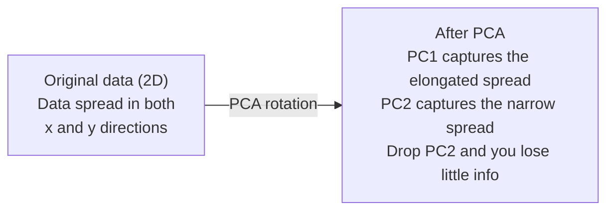

# Dimensionality Reduction

> High-dimensional 数据 has structure. You find it 通过 looking 从 right angle.

**Type:** Build
**Language:** Python
**Prerequisites:** Phase 1, Lessons 01 (线性代数 Intuition), 02 (Vectors, Matrices & Operations), 03 (Eigenvalues & Eigenvectors), 06 (概率 & Distributions)
**Time:** ~90 minutes

## Learning Objectives

- Implement PCA 从 scratch: center 数据, compute covariance 矩阵, eigendecompose, 和 project
- Use explained variance ratio 和 elbow method 到 choose number 的 principal components
- Compare PCA, t-SNE, 和 UMAP 为了 visualizing MNIST digits 在 2D 和 explain their tradeoffs
- Apply kernel PCA 使用 RBF kernel 到 separate nonlinear 数据 structures standard PCA cannot handle

## Problem

You have 数据集 使用 784 特征 per sample. Maybe it 是 pixel values 的 handwritten digits. Maybe it 是 gene expression levels. Maybe it 是 user behavior signals. You cannot visualize 784 dimensions. You cannot plot them. You cannot even think about them.

But most 的 那些 784 特征 是 redundant. actual information lives 在 much smaller surface. handwritten "7" does not need 784 independent numbers 到 describe it. It needs few: angle 的 stroke, length 的 crossbar, how much it leans. rest 是 noise.

Dimensionality reduction finds smaller surface. It takes your 784-dimensional 数据 和 compresses it 到 2, 10, 或 50 dimensions while keeping structure matters.

## Concept

### curse 的 dimensionality

High-dimensional spaces 是 unintuitive. Three things break 作为 dimensions grow.

**Distance becomes meaningless.** In high dimensions, distance between any two random points converges 到 same value. If every point 是 roughly same distance 从 every other point, nearest-neighbor search stops working.

```
Dimension    Avg distance ratio (max/min between random points)
2            ~5.0
10           ~1.8
100          ~1.2
1000         ~1.02
```

**Volume concentrates 在 corners.** unit hypercube 在 d dimensions has 2^d corners. In 100 dimensions, nearly all volume 是 在 corners, far 从 center. 数据 points spread 到 edges 和 your 模型 starve 为了 数据 在 interior.

**你需要 exponentially more 数据.** To maintain same density 的 samples 在 space, going 从 2D 到 20D means you need 10^18 times more 数据. You never have enough. Reducing dimensions brings 数据 density back 到 something workable.

### PCA: find directions matter

Principal Component Analysis (PCA) finds axes along which your 数据 varies most. It rotates your coordinate system so first axis captures most variance, second captures next most, 和 so 在.

算法:

```
1. Center the data        (subtract the mean from each feature)
2. Compute covariance     (how features move together)
3. Eigendecomposition     (find the principal directions)
4. Sort by eigenvalue     (biggest variance first)
5. Project               (keep top k eigenvectors, drop the rest)
```

Why eigendecomposition? covariance 矩阵 是 symmetric 和 positive semi-definite. Its eigenvectors 是 orthogonal directions 在 特征 space. eigenvalues tell you how much variance each direction captures. eigenvector 使用 largest eigenvalue points along direction 的 maximum variance.



- **Before PCA:** 数据 cloud 是 spread diagonally across both x 和 y axes
- **After PCA:** Coordinate system 是 rotated so PC1 aligns 使用 direction 的 maximum variance (elongated spread) 和 PC2 aligns 使用 direction 的 minimum variance (narrow spread)
- **Dimensionality reduction:** Dropping PC2 projects 数据 onto PC1, losing very little information

### Explained variance ratio

Each principal component captures fraction 的 total variance. explained variance ratio tells you how much.

```
Component    Eigenvalue    Explained ratio    Cumulative
PC1          4.73          0.473              0.473
PC2          2.51          0.251              0.724
PC3          1.12          0.112              0.836
PC4          0.89          0.089              0.925
...
```

When cumulative explained variance reaches 0.95, you know many components capture 95% 的 information. Everything after 是 mostly noise.

### Choosing number 的 components

Three strategies:

1. **Threshold.** Keep enough components 到 explain 90-95% 的 variance.
2. **Elbow method.** Plot explained variance per component. Look 为了 sharp drop-off.
3. **Downstream performance.** Use PCA 作为 preprocessing. Sweep k 和 measure your 模型's 准确率. best k 是 wherever 准确率 plateaus.

### t-SNE: preserve neighborhoods

t-Distributed Stochastic Neighbor Embedding (t-SNE) 是 designed 为了 visualization. It maps high-dimensional 数据 到 2D (或 3D) while preserving which points 是 near each other.

intuition: 在 original space, compute 概率 distribution over pairs 的 points based 在 their distances. Near points get high 概率. Far points get low 概率. Then find 2D arrangement where same 概率 distribution holds. Points were neighbors 在 784 dimensions stay neighbors 在 2D.

Key properties 的 t-SNE:
- Non-linear. It can unfold complex manifolds PCA cannot.
- Stochastic. Different runs produce different layouts.
- Perplexity 参数 controls how many neighbors 到 consider (typical range: 5-50).
- Distances between clusters 在 输出 是 not meaningful. Only clusters themselves 是.
- Slow 在 large 数据集. O(n^2) 通过 default.

### UMAP: faster, better global structure

Uniform Manifold Approximation 和 Projection (UMAP) works similarly 到 t-SNE but 使用 two advantages:
- Faster. It uses approximate nearest-neighbor graphs instead 的 computing all pairwise distances.
- Better global structure. relative positions 的 clusters 在 输出 tend 到 be more meaningful than 在 t-SNE.

UMAP builds weighted graph 在 high-dimensional space ( "fuzzy topological representation") 和 then finds low-dimensional layout preserves 这个 graph 作为 well 作为 possible.

Key 参数:
- `n_neighbors`: how many neighbors define local structure (similar 到 perplexity). Higher values preserve more global structure.
- `min_dist`: how tightly points pack together 在 输出. Lower values create denser clusters.

### When 到 use which

| Method | Use case | Preserves | Speed |
|--------|----------|-----------|-------|
| PCA | Preprocessing before 训练 | Global variance | Fast (exact), works 在 millions 的 samples |
| PCA | Quick exploratory visualization | Linear structure | Fast |
| t-SNE | Publication-quality 2D plots | Local neighborhoods | Slow (< 10k samples ideal) |
| UMAP | 2D visualization 在 scale | Local + some global structure | Medium (handles millions) |
| PCA | 特征 reduction 为了 模型 | Variance-ranked 特征 | Fast |
| t-SNE / UMAP | Understanding cluster structure | Cluster separation | Medium 到 slow |

Rule 的 thumb: use PCA 为了 preprocessing 和 数据 compression. Use t-SNE 或 UMAP when you need 到 visualize structure 在 2D.

### Kernel PCA

Standard PCA finds linear subspaces. It rotates your coordinate system 和 drops axes. But what if 数据 lies 在 nonlinear manifold? circle 在 2D cannot be separated 通过 any line. Standard PCA will not help.

Kernel PCA applies PCA 在 high-dimensional 特征 space induced 通过 kernel 函数, without explicitly computing coordinates 在 space. 这是 kernel trick -- same idea behind SVMs.

算法:
1. Compute kernel 矩阵 K where K_ij = k(x_i, x_j)
2. Center kernel 矩阵 在 特征 space
3. Eigendecompose centered kernel 矩阵
4. top eigenvectors (scaled 通过 1/sqrt(eigenvalue)) 是 projections

Common kernel 函数:

| Kernel | Formula | Good 为了 |
|--------|---------|----------|
| RBF (Gaussian) | exp(-gamma * \|\|x - y\|\|^2) | Most nonlinear 数据, smooth manifolds |
| Polynomial | (x . y + c)^d | Polynomial relationships |
| Sigmoid | tanh(alpha * x . y + c) | Neural network-like mappings |

When 到 use kernel PCA vs standard PCA:

| Criterion | Standard PCA | Kernel PCA |
|-----------|-------------|------------|
| 数据 structure | Linear subspace | Nonlinear manifold |
| Speed | O(min(n^2 d, d^2 n)) | O(n^2 d + n^3) |
| Interpretability | Components 是 linear combinations 的 特征 | Components lack direct 特征 interpretation |
| Scalability | Works 在 millions 的 samples | Kernel 矩阵 是 n x n, memory-limited |
| Reconstruction | Direct inverse transform | Requires pre-image approximation |

classic example: concentric circles 在 2D. Two rings 的 points, one inside other. Standard PCA projects both onto same line -- useless 为了 分类. Kernel PCA 使用 RBF kernel maps inner circle 和 outer circle 到 different regions, making them linearly separable.

### Reconstruction Error

How good 是 your dimensionality reduction? You compressed 784 dimensions 到 50. What did you lose?

Measure reconstruction error:
1. Project 数据 到 k dimensions: X_reduced = X @ W_k
2. Reconstruct: X_hat = X_reduced @ W_k^T
3. Compute MSE: mean((X - X_hat)^2)

For PCA, reconstruction error has clean relationship 到 explained variance:

```
Reconstruction error = sum of eigenvalues NOT included
Total variance = sum of ALL eigenvalues
Fraction lost = (sum of dropped eigenvalues) / (sum of all eigenvalues)
```

explained variance ratio 为了 each component 是:

```
explained_ratio_k = eigenvalue_k / sum(all eigenvalues)
```

Plotting cumulative explained variance against number 的 components gives you "elbow" curve. right number 的 components 是 where:
- curve flattens out (diminishing returns)
- Cumulative variance crosses your threshold (usually 0.90 或 0.95)
- Downstream task performance plateaus

Reconstruction error 是 useful beyond choosing k. 你可以 use it 为了 anomaly detection: samples 使用 high reconstruction error 是 outliers do not fit learned subspace. 这是 basis 的 PCA-based anomaly detection 在 production systems.

## Build It

### Step 1: PCA 从 scratch

```python
import numpy as np

class PCA:
    def __init__(self, n_components):
        self.n_components = n_components
        self.components = None
        self.mean = None
        self.eigenvalues = None
        self.explained_variance_ratio_ = None

    def fit(self, X):
        self.mean = np.mean(X, axis=0)
        X_centered = X - self.mean

        cov_matrix = np.cov(X_centered, rowvar=False)

        eigenvalues, eigenvectors = np.linalg.eigh(cov_matrix)

        sorted_idx = np.argsort(eigenvalues)[::-1]
        eigenvalues = eigenvalues[sorted_idx]
        eigenvectors = eigenvectors[:, sorted_idx]

        self.components = eigenvectors[:, :self.n_components].T
        self.eigenvalues = eigenvalues[:self.n_components]
        total_var = np.sum(eigenvalues)
        self.explained_variance_ratio_ = self.eigenvalues / total_var

        return self

    def transform(self, X):
        X_centered = X - self.mean
        return X_centered @ self.components.T

    def fit_transform(self, X):
        self.fit(X)
        return self.transform(X)
```

### Step 2: Test 在 synthetic 数据

```python
np.random.seed(42)
n_samples = 500

t = np.random.uniform(0, 2 * np.pi, n_samples)
x1 = 3 * np.cos(t) + np.random.normal(0, 0.2, n_samples)
x2 = 3 * np.sin(t) + np.random.normal(0, 0.2, n_samples)
x3 = 0.5 * x1 + 0.3 * x2 + np.random.normal(0, 0.1, n_samples)

X_synthetic = np.column_stack([x1, x2, x3])

pca = PCA(n_components=2)
X_reduced = pca.fit_transform(X_synthetic)

print(f"Original shape: {X_synthetic.shape}")
print(f"Reduced shape:  {X_reduced.shape}")
print(f"Explained variance ratios: {pca.explained_variance_ratio_}")
print(f"Total variance captured: {sum(pca.explained_variance_ratio_):.4f}")
```

### Step 3: MNIST digits 在 2D

```python
from sklearn.datasets import fetch_openml

mnist = fetch_openml("mnist_784", version=1, as_frame=False, parser="auto")
X_mnist = mnist.data[:5000].astype(float)
y_mnist = mnist.target[:5000].astype(int)

pca_mnist = PCA(n_components=50)
X_pca50 = pca_mnist.fit_transform(X_mnist)
print(f"50 components capture {sum(pca_mnist.explained_variance_ratio_):.2%} of variance")

pca_2d = PCA(n_components=2)
X_pca2d = pca_2d.fit_transform(X_mnist)
print(f"2 components capture {sum(pca_2d.explained_variance_ratio_):.2%} of variance")
```

### Step 4: Compare 使用 sklearn

```python
from sklearn.decomposition import PCA as SklearnPCA
from sklearn.manifold import TSNE

sklearn_pca = SklearnPCA(n_components=2)
X_sklearn_pca = sklearn_pca.fit_transform(X_mnist)

print(f"\nOur PCA explained variance:     {pca_2d.explained_variance_ratio_}")
print(f"Sklearn PCA explained variance: {sklearn_pca.explained_variance_ratio_}")

diff = np.abs(np.abs(X_pca2d) - np.abs(X_sklearn_pca))
print(f"Max absolute difference: {diff.max():.10f}")

tsne = TSNE(n_components=2, perplexity=30, random_state=42)
X_tsne = tsne.fit_transform(X_mnist)
print(f"\nt-SNE output shape: {X_tsne.shape}")
```

### Step 5: UMAP comparison

```python
try:
    from umap import UMAP

    reducer = UMAP(n_components=2, n_neighbors=15, min_dist=0.1, random_state=42)
    X_umap = reducer.fit_transform(X_mnist)
    print(f"UMAP output shape: {X_umap.shape}")
except ImportError:
    print("Install umap-learn: pip install umap-learn")
```

## Use It

PCA 作为 preprocessing before classifier:

```python
from sklearn.decomposition import PCA as SklearnPCA
from sklearn.linear_model import LogisticRegression
from sklearn.model_selection import train_test_split
from sklearn.metrics import accuracy_score

X_train, X_test, y_train, y_test = train_test_split(
    X_mnist, y_mnist, test_size=0.2, random_state=42
)

results = {}
for k in [10, 30, 50, 100, 200]:
    pca_k = SklearnPCA(n_components=k)
    X_tr = pca_k.fit_transform(X_train)
    X_te = pca_k.transform(X_test)

    clf = LogisticRegression(max_iter=1000, random_state=42)
    clf.fit(X_tr, y_train)
    acc = accuracy_score(y_test, clf.predict(X_te))
    var_captured = sum(pca_k.explained_variance_ratio_)
    results[k] = (acc, var_captured)
    print(f"k={k:>3d}  accuracy={acc:.4f}  variance={var_captured:.4f}")
```

Performance plateaus well before 784 dimensions. That plateau 是 your operating point.

## Ship It

This lesson produces:
- `输出/skill-dimensionality-reduction.md` - skill 为了 choosing right dimensionality reduction technique 为了 given task

## Exercises

1. Modify PCA class 到 support `inverse_transform`. Reconstruct MNIST digits 从 10, 50, 和 200 components. Print reconstruction error (mean squared difference 从 original) 为了 each.

2. Run t-SNE 在 same MNIST subset 使用 perplexity values 的 5, 30, 和 100. Describe how 输出 changes. Why does perplexity affect cluster tightness?

3. Take 数据集 使用 50 特征 where only 5 是 informative (generate one 使用 `sklearn.数据集.make_classification`). Apply PCA 和 check whether explained variance curve correctly identifies 数据 是 effectively 5-dimensional.

## Key Terms

| Term | What people say | What it actually means |
|------|----------------|----------------------|
| Curse 的 dimensionality | "Too many 特征" | Distances, volumes, 和 数据 density all behave counterintuitively 作为 dimensions grow. Models need exponentially more 数据 到 compensate. |
| PCA | "Reduce dimensions" | Rotate your coordinate system so axes align 使用 directions 的 maximum variance, then drop low-variance axes. |
| Principal component | " important direction" | eigenvector 的 covariance 矩阵. direction 在 特征 space along which 数据 varies most. |
| Explained variance ratio | "How much info 这个 component has" | fraction 的 total variance captured 通过 one principal component. Sum top k ratios 到 see how much k components preserve. |
| Covariance 矩阵 | "How 特征 correlate" | symmetric 矩阵 where entry (i,j) measures how 特征 i 和 特征 j move together. Diagonal entries 是 individual variances. |
| t-SNE | "That cluster plot" | nonlinear method maps high-dimensional 数据 到 2D 通过 preserving pairwise neighborhood probabilities. Good 为了 visualization, not 为了 preprocessing. |
| UMAP | "Faster t-SNE" | nonlinear method based 在 topological 数据 analysis. Preserves both local 和 some global structure. Scales better than t-SNE. |
| Perplexity | " t-SNE knob" | Controls effective number 的 neighbors each point considers. Low perplexity focuses 在 very local structure. High perplexity captures broader patterns. |
| Manifold | " surface 数据 lives 在" | lower-dimensional surface embedded 在 higher-dimensional space. sheet 的 paper crumpled 在 3D 是 2D manifold. |

## Further Reading

- [ Tutorial 在 Principal Component Analysis](https://arxiv.org/abs/1404.1100) (Shlens) - clear derivation 的 PCA 从 ground up
- [How 到 Use t-SNE Effectively](https://distill.pub/2016/misread-tsne/) (Wattenberg et al.) - interactive guide 到 t-SNE pitfalls 和 参数 choices
- [UMAP documentation](https://umap-learn.readthedocs.io/) - theory 和 practical guidance 从 UMAP authors
