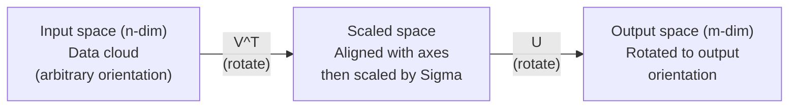
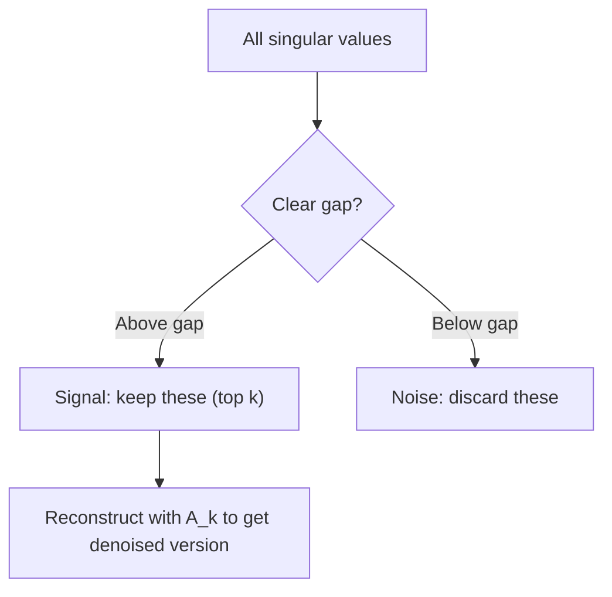

# Singular Value Decomposition

> SVD 是 Swiss Army knife 的 线性代数. Every 矩阵 has one. Every 数据 scientist needs one.

**Type:** Build
**Languages:** Python, Julia
**Prerequisites:** Phase 1, Lessons 01 (线性代数 Intuition), 02 (Vectors & Matrices Operations), 03 (矩阵 Transformations)
**Time:** ~120 minutes

## Learning Objectives

- Implement SVD via power iteration 和 explain geometric meaning 的 U, Sigma, 和 V^T
- Apply truncated SVD 为了 image compression 和 measure compression ratio vs reconstruction error
- Compute Moore-Penrose pseudoinverse via SVD 到 solve overdetermined least-squares systems
- Connect SVD 到 PCA, recommendation systems (latent factors), 和 Latent Semantic Analysis 在 NLP

## Problem

You have 1000x2000 矩阵. Maybe it 是 user-movie ratings. Maybe it 是 document-term frequency table. Maybe it 是 pixel values 的 image. 你需要 到 compress it, denoise it, find hidden structure 在 it, 或 solve least-squares system 使用 it. Eigendecomposition only works 在 square 矩阵. Even then, it requires 矩阵 到 have full set 的 linearly independent eigenvectors.

SVD works 在 any 矩阵. Any shape. Any rank. No conditions. It decomposes 矩阵 into three factors reveal geometry 的 what 矩阵 does 到 space. 它是 most general 和 most useful factorization 在 all 的 线性代数.

## Concept

### What SVD does geometrically

Every 矩阵, regardless 的 shape, performs three operations 在 sequence: rotate, scale, rotate. SVD makes 这个 decomposition explicit.

```
A = U * Sigma * V^T

      m x n     m x m    m x n    n x n
     (any)    (rotate)  (scale)  (rotate)
```

Given any 矩阵 , SVD factors it into:
- V^T rotates 向量 在 输入 space (n-dimensional)
- Sigma scales along each axis (stretches 或 compresses)
- U rotates result into 输出 space (m-dimensional)



Think 的 it 这个 way. You hand SVD 矩阵. It tells you: "This 矩阵 takes sphere 的 输入, first rotates it 通过 V^T, then stretches it into ellipsoid 通过 Sigma, then rotates ellipsoid 通过 U." singular values 是 lengths 的 ellipsoid's axes.

### full decomposition

For 矩阵 使用 shape m x n:

```
A = U * Sigma * V^T

where:
  U     is m x m, orthogonal (U^T U = I)
  Sigma is m x n, diagonal (singular values on the diagonal)
  V     is n x n, orthogonal (V^T V = I)

The singular values sigma_1 >= sigma_2 >= ... >= sigma_r > 0
where r = rank(A)
```

columns 的 U 是 called left singular 向量. columns 的 V 是 called right singular 向量. diagonal entries 的 Sigma 是 called singular values. They 是 always non-negative 和 conventionally sorted 在 decreasing order.

### Left singular 向量, singular values, right singular 向量

Each component 的 SVD has distinct geometric meaning.

**Right singular 向量 (columns 的 V):** These form orthonormal basis 为了 输入 space (R^n). They 是 directions 在 输入 space 矩阵 maps 到 orthogonal directions 在 输出 space. Think 的 them 作为 natural coordinate system 为了 domain.

**Singular values (diagonal 的 Sigma):** These 是 scaling factors. i-th singular value tells you how much 矩阵 stretches 向量 along i-th right singular 向量. singular value 的 zero means 矩阵 crushes direction entirely.

**Left singular 向量 (columns 的 U):** These form orthonormal basis 为了 输出 space (R^m). i-th left singular 向量 是 direction 在 输出 space where i-th right singular 向量 lands (after scaling).

relationship between them:

```
A * v_i = sigma_i * u_i

The matrix A takes the i-th right singular vector v_i,
scales it by sigma_i, and maps it to the i-th left singular vector u_i.
```

This gives you coordinate-通过-coordinate picture 的 what any 矩阵 does.

### Outer product form

SVD can be written 作为 sum 的 rank-1 矩阵:

```
A = sigma_1 * u_1 * v_1^T + sigma_2 * u_2 * v_2^T + ... + sigma_r * u_r * v_r^T

Each term sigma_i * u_i * v_i^T is a rank-1 matrix (an outer product).
The full matrix is the sum of r such matrices, where r is the rank.
```

This form 是 foundation 的 low-rank approximation. Each term adds one 层 的 structure. first term captures single most important pattern. second captures next most important. And so 在. Truncating 这个 sum gives you best possible approximation 在 any given rank.

```
Rank-1 approx:    A_1 = sigma_1 * u_1 * v_1^T
                  (captures the dominant pattern)

Rank-2 approx:    A_2 = sigma_1 * u_1 * v_1^T + sigma_2 * u_2 * v_2^T
                  (captures the two most important patterns)

Rank-k approx:    A_k = sum of top k terms
                  (optimal by the Eckart-Young theorem)
```

### Relationship 到 eigendecomposition

SVD 和 eigendecomposition 是 deeply connected. singular values 和 向量 的 come directly 从 eigenvalues 和 eigenvectors 的 ^T 和 ^T.

```
A^T A = V * Sigma^T * U^T * U * Sigma * V^T
      = V * Sigma^T * Sigma * V^T
      = V * D * V^T

where D = Sigma^T * Sigma is a diagonal matrix with sigma_i^2 on the diagonal.

So:
- The right singular vectors (V) are eigenvectors of A^T A
- The singular values squared (sigma_i^2) are eigenvalues of A^T A

Similarly:
A A^T = U * Sigma * V^T * V * Sigma^T * U^T
      = U * Sigma * Sigma^T * U^T

So:
- The left singular vectors (U) are eigenvectors of A A^T
- The eigenvalues of A A^T are also sigma_i^2
```

This connection tells you three things:
1. Singular values 是 always real 和 non-negative (they 是 square roots 的 eigenvalues 的 positive semi-definite 矩阵).
2. You could compute SVD via eigendecomposition 的 ^T , but 这个 squares condition number 和 loses numerical 精确率. Dedicated SVD 算法 avoid 这个.
3. When 是 square 和 symmetric positive semi-definite, SVD 和 eigendecomposition 是 same thing.

### Truncated SVD: low-rank approximation

Eckart-Young-Mirsky theorem states best rank-k approximation 到 (在 both Frobenius 和 spectral norm) 是 obtained 通过 keeping only top k singular values 和 their corresponding 向量:

```
A_k = U_k * Sigma_k * V_k^T

where:
  U_k     is m x k  (first k columns of U)
  Sigma_k is k x k  (top-left k x k block of Sigma)
  V_k     is n x k  (first k columns of V)

Approximation error = sigma_{k+1}  (in spectral norm)
                    = sqrt(sigma_{k+1}^2 + ... + sigma_r^2)  (in Frobenius norm)
```

这是 not just " good" approximation. 它是 provably best possible approximation 的 rank k. No other rank-k 矩阵 是 closer 到 .

| Component | Relative magnitude | Kept 在 rank-3 approx? |
|-----------|-------------------|------------------------|
| sigma_1 | Largest | Yes |
| sigma_2 | Large | Yes |
| sigma_3 | Medium-large | Yes |
| sigma_4 | Medium | No (error) |
| sigma_5 | Medium-small | No (error) |
| sigma_6 | Small | No (error) |
| sigma_7 | Very small | No (error) |
| sigma_8 | Tiny | No (error) |

Keep top 3: A_3 captures three largest singular values. Error = remaining values (sigma_4 through sigma_8).

If singular values decay fast, small k captures most 的 矩阵. If they decay slowly, 矩阵 has no low-rank structure.

### Image compression 使用 SVD

grayscale image 是 矩阵 的 pixel intensities. 800x600 image has 480,000 values. SVD lets you approximate it 使用 far fewer.

```
Original image: 800 x 600 = 480,000 values

SVD with rank k:
  U_k:      800 x k values
  Sigma_k:  k values
  V_k:      600 x k values
  Total:    k * (800 + 600 + 1) = k * 1401 values

  k=10:   14,010 values   (2.9% of original)
  k=50:   70,050 values  (14.6% of original)
  k=100: 140,100 values  (29.2% of original)

  The compression ratio improves as k gets smaller,
  but visual quality degrades.
```

key insight: natural images have rapidly decaying singular values. first few singular values capture broad structure (shapes, gradients). later ones capture fine detail 和 noise. Truncating 在 rank 50 often produces image looks nearly identical 到 original while using 85% less storage.

### SVD 为了 recommendation systems

Netflix Prize made 这个 famous. You have user-movie ratings 矩阵 where most entries 是 missing.

```
             Movie1  Movie2  Movie3  Movie4  Movie5
  User1      [  5      ?       3       ?       1  ]
  User2      [  ?      4       ?       2       ?  ]
  User3      [  3      ?       5       ?       ?  ]
  User4      [  ?      ?       ?       4       3  ]

  ? = unknown rating
```

idea: 这个 ratings 矩阵 has low rank. Users do not have completely independent tastes. 有 handful 的 latent factors (action vs. drama, old vs. new, cerebral vs. visceral) explain most preferences.

SVD 在 (filled-在) ratings 矩阵 decomposes it into:
- U: user profiles 在 latent factor space
- Sigma: importance 的 each latent factor
- V^T: movie profiles 在 latent factor space

user's predicted rating 为了 movie 是 dot product 的 their user profile 使用 movie's profile (weighted 通过 singular values). low-rank approximation fills 在 missing entries.

In practice, you use variants like Simon Funk's incremental SVD 或 ALS (alternating least squares) handle missing 数据 directly. But core idea 是 same: latent factor decomposition via SVD.

### SVD 在 NLP: Latent Semantic Analysis

Latent Semantic Analysis (LSA), also called Latent Semantic Indexing (LSI), applies SVD 到 term-document 矩阵.

```
             Doc1   Doc2   Doc3   Doc4
  "cat"      [  3      0      1      0  ]
  "dog"      [  2      0      0      1  ]
  "fish"     [  0      4      1      0  ]
  "pet"      [  1      1      1      1  ]
  "ocean"    [  0      3      0      0  ]

After SVD with rank k=2:

  Each document becomes a point in 2D "concept space."
  Each term becomes a point in the same 2D space.
  Documents about similar topics cluster together.
  Terms with similar meanings cluster together.

  "cat" and "dog" end up near each other (land pets).
  "fish" and "ocean" end up near each other (water concepts).
  Doc1 and Doc3 cluster if they share similar topics.
```

LSA was one 的 first successful methods 为了 capturing semantic similarity 从 raw text. It works because synonymous terms tend 到 appear 在 similar documents, so SVD groups them into same latent dimensions. Modern word embeddings (Word2Vec, GloVe) can be seen 作为 descendants 的 这个 idea.

### SVD 为了 noise reduction

Noisy 数据 has signal concentrated 在 top singular values 和 noise spread across all singular values. Truncating removes noise floor.

**Clean signal singular values:**

| Component | Magnitude | Type |
|-----------|-----------|------|
| sigma_1 | Very large | Signal |
| sigma_2 | Large | Signal |
| sigma_3 | Medium | Signal |
| sigma_4 | Near zero | Negligible |
| sigma_5 | Near zero | Negligible |

**Noisy signal singular values (noise adds 到 all):**

| Component | Magnitude | Type |
|-----------|-----------|------|
| sigma_1 | Very large | Signal |
| sigma_2 | Large | Signal |
| sigma_3 | Medium | Signal |
| sigma_4 | Small | Noise |
| sigma_5 | Small | Noise |
| sigma_6 | Small | Noise |
| sigma_7 | Small | Noise |



这是 used 在 signal processing, scientific measurement, 和 数据 cleaning. Any time you have 矩阵 corrupted 通过 additive noise, truncated SVD 是 principled way 到 separate signal 从 noise.

### Pseudoinverse via SVD

Moore-Penrose pseudoinverse + generalizes 矩阵 inversion 到 non-square 和 singular 矩阵. SVD makes computing it trivial.

```
If A = U * Sigma * V^T, then:

A+ = V * Sigma+ * U^T

where Sigma+ is formed by:
  1. Transpose Sigma (swap rows and columns)
  2. Replace each non-zero diagonal entry sigma_i with 1/sigma_i
  3. Leave zeros as zeros

For A (m x n):      A+ is (n x m)
For Sigma (m x n):  Sigma+ is (n x m)
```

pseudoinverse solves least-squares problems. If Ax = b has no exact solution (overdetermined system), then x = + b 是 least-squares solution (minimizes ||Ax - b||).

```
Overdetermined system (more equations than unknowns):

  [1  1]         [3]
  [2  1] x   =   [5]       No exact solution exists.
  [3  1]         [6]

  x_ls = A+ b = V * Sigma+ * U^T * b

  This gives the x that minimizes the sum of squared residuals.
  Same result as the normal equations (A^T A)^(-1) A^T b,
  but numerically more stable.
```

### Numerical stability advantages

Computing eigendecomposition 的 ^T squares singular values (eigenvalues 的 ^T 是 sigma_i^2). This squares condition number, amplifying numerical errors.

```
Example:
  A has singular values [1000, 1, 0.001]
  Condition number of A: 1000 / 0.001 = 10^6

  A^T A has eigenvalues [10^6, 1, 10^{-6}]
  Condition number of A^T A: 10^6 / 10^{-6} = 10^{12}

  Computing SVD directly: works with condition number 10^6
  Computing via A^T A:     works with condition number 10^{12}
                           (6 extra digits of precision lost)
```

Modern SVD 算法 (Golub-Kahan bidiagonalization) work directly 在 , never forming ^T . 这是 why you should always prefer `np.linalg.svd()` over `np.linalg.eig(.T @ )`.

### Connection 到 PCA

PCA IS SVD 在 centered 数据. 这是 not analogy. 它是 literally same computation.

```
Given data matrix X (n_samples x n_features), centered (mean subtracted):

Covariance matrix: C = (1/(n-1)) * X^T X

PCA finds eigenvectors of C. But:

  X = U * Sigma * V^T    (SVD of X)

  X^T X = V * Sigma^2 * V^T

  C = (1/(n-1)) * V * Sigma^2 * V^T

So the principal components are exactly the right singular vectors V.
The explained variance for each component is sigma_i^2 / (n-1).

In sklearn, PCA is implemented using SVD, not eigendecomposition.
It is faster and more numerically stable.
```

This means everything you learned about dimensionality reduction 在 Lesson 10 是 SVD under hood. PCA 是 most common application 的 SVD 在 machine learning.

## Build It

### Step 1: SVD 从 scratch using power iteration

idea: 到 find largest singular value 和 its 向量, use power iteration 在 ^T (或 ^T). Then deflate 矩阵 和 repeat 为了 next singular value.

```python
import numpy as np

def power_iteration(M, num_iters=100):
    n = M.shape[1]
    v = np.random.randn(n)
    v = v / np.linalg.norm(v)

    for _ in range(num_iters):
        Mv = M @ v
        v = Mv / np.linalg.norm(Mv)

    eigenvalue = v @ M @ v
    return eigenvalue, v

def svd_from_scratch(A, k=None):
    m, n = A.shape
    if k is None:
        k = min(m, n)

    sigmas = []
    us = []
    vs = []

    A_residual = A.copy().astype(float)

    for _ in range(k):
        AtA = A_residual.T @ A_residual
        eigenvalue, v = power_iteration(AtA, num_iters=200)

        if eigenvalue < 1e-10:
            break

        sigma = np.sqrt(eigenvalue)
        u = A_residual @ v / sigma

        sigmas.append(sigma)
        us.append(u)
        vs.append(v)

        A_residual = A_residual - sigma * np.outer(u, v)

    U = np.column_stack(us) if us else np.empty((m, 0))
    S = np.array(sigmas)
    V = np.column_stack(vs) if vs else np.empty((n, 0))

    return U, S, V
```

### Step 2: Test 和 compare 使用 NumPy

```python
np.random.seed(42)
A = np.random.randn(5, 4)

U_ours, S_ours, V_ours = svd_from_scratch(A)
U_np, S_np, Vt_np = np.linalg.svd(A, full_matrices=False)

print("Our singular values:", np.round(S_ours, 4))
print("NumPy singular values:", np.round(S_np, 4))

A_reconstructed = U_ours @ np.diag(S_ours) @ V_ours.T
print(f"Reconstruction error: {np.linalg.norm(A - A_reconstructed):.8f}")
```

### Step 3: Image compression demo

```python
def compress_image_svd(image_matrix, k):
    U, S, Vt = np.linalg.svd(image_matrix, full_matrices=False)
    compressed = U[:, :k] @ np.diag(S[:k]) @ Vt[:k, :]
    return compressed

image = np.random.seed(42)
rows, cols = 200, 300
image = np.random.randn(rows, cols)

for k in [1, 5, 10, 20, 50]:
    compressed = compress_image_svd(image, k)
    error = np.linalg.norm(image - compressed) / np.linalg.norm(image)
    original_size = rows * cols
    compressed_size = k * (rows + cols + 1)
    ratio = compressed_size / original_size
    print(f"k={k:>3d}  error={error:.4f}  storage={ratio:.1%}")
```

### Step 4: Noise reduction

```python
np.random.seed(42)
clean = np.outer(np.sin(np.linspace(0, 4*np.pi, 100)),
                 np.cos(np.linspace(0, 2*np.pi, 80)))
noise = 0.3 * np.random.randn(100, 80)
noisy = clean + noise

U, S, Vt = np.linalg.svd(noisy, full_matrices=False)
denoised = U[:, :5] @ np.diag(S[:5]) @ Vt[:5, :]

print(f"Noisy error:    {np.linalg.norm(noisy - clean):.4f}")
print(f"Denoised error: {np.linalg.norm(denoised - clean):.4f}")
print(f"Improvement:    {(1 - np.linalg.norm(denoised - clean) / np.linalg.norm(noisy - clean)):.1%}")
```

### Step 5: Pseudoinverse

```python
A = np.array([[1, 1], [2, 1], [3, 1]], dtype=float)
b = np.array([3, 5, 6], dtype=float)

U, S, Vt = np.linalg.svd(A, full_matrices=False)
S_inv = np.diag(1.0 / S)
A_pinv = Vt.T @ S_inv @ U.T

x_svd = A_pinv @ b
x_lstsq = np.linalg.lstsq(A, b, rcond=None)[0]
x_pinv = np.linalg.pinv(A) @ b

print(f"SVD pseudoinverse solution:  {x_svd}")
print(f"np.linalg.lstsq solution:   {x_lstsq}")
print(f"np.linalg.pinv solution:    {x_pinv}")
```

## Use It

Full working demos 是 在 `代码/svd.py`. Run it 到 see SVD applied 到 image compression, recommendation systems, latent semantic analysis, 和 noise reduction.

```bash
python svd.py
```

Julia version 在 `代码/svd.jl` demonstrates same concepts using Julia's native `svd()` 函数 和 `LinearAlgebra` package.

```bash
julia svd.jl
```

## Ship It

This lesson produces:
- `输出/skill-svd.md` - skill 为了 knowing when 和 how 到 apply SVD 在 real projects

## Exercises

1. Implement full SVD 从 scratch without using power iteration. Instead, compute eigendecomposition 的 ^T 到 get V 和 singular values, then compute U = V Sigma^{-1}. Compare numerical 准确率 使用 your power iteration version 和 使用 NumPy.

2. Load real grayscale image (或 convert one 到 grayscale). Compress it 在 ranks 1, 5, 10, 25, 50, 100. For each rank, compute compression ratio 和 relative error. Find rank where image becomes visually acceptable.

3. Build tiny recommendation system. Create 10x8 user-movie ratings 矩阵 使用 some known entries. Fill missing entries 使用 row means. Compute SVD 和 reconstruct rank-3 approximation. Use reconstructed 矩阵 到 predict missing ratings. Verify predictions 是 reasonable.

4. Create 100x50 document-term 矩阵 使用 3 synthetic topics. Each topic has 5 associated terms. Add noise. Apply SVD 和 verify top 3 singular values 是 much larger than rest. Project documents into 3D latent space 和 check documents 从 same topic cluster together.

5. Generate clean low-rank 矩阵 (rank 3, size 50x40) 和 add Gaussian noise 在 different levels (sigma = 0.1, 0.5, 1.0, 2.0). For each noise level, find optimal truncation rank 通过 sweeping k 从 1 到 40 和 measuring reconstruction error against clean 矩阵. Plot how optimal k changes 使用 noise level.

## Key Terms

| Term | What people say | What it actually means |
|------|----------------|----------------------|
| SVD | "Factor any 矩阵" | Decompose into U Sigma V^T where U 和 V 是 orthogonal 和 Sigma 是 diagonal 使用 non-negative entries. Works 为了 any 矩阵 的 any shape. |
| Singular value | "How important 这个 component 是" | i-th diagonal entry 的 Sigma. Measures how much 矩阵 stretches along i-th principal direction. Always non-negative, sorted 在 decreasing order. |
| Left singular 向量 | "输出 direction" | column 的 U. direction 在 输出 space i-th right singular 向量 maps 到 (after scaling 通过 sigma_i). |
| Right singular 向量 | "输入 direction" | column 的 V. direction 在 输入 space 矩阵 maps 到 i-th left singular 向量 (after scaling 通过 sigma_i). |
| Truncated SVD | "Low-rank approximation" | Keep only top k singular values 和 their 向量. Produces provably best rank-k approximation 到 original 矩阵 (Eckart-Young theorem). |
| Rank | "True dimensionality" | number 的 non-zero singular values. Tells you how many independent directions 矩阵 actually uses. |
| Pseudoinverse | "Generalized inverse" | V Sigma+ U^T. Inverts non-zero singular values, leaves zeros 作为 zeros. Solves least-squares problems 为了 non-square 或 singular 矩阵. |
| Condition number | "How sensitive 到 errors" | sigma_max / sigma_min. large condition number means small 输入 changes cause large 输出 changes. SVD reveals 这个 directly. |
| Latent factor | "Hidden variable" | dimension 在 low-rank space discovered 通过 SVD. In recommendations, latent factor might correspond 到 genre preference. In NLP, it might correspond 到 topic. |
| Frobenius norm | "Total 矩阵 size" | Square root 的 sum 的 squared entries. Equals square root 的 sum 的 squared singular values. Used 到 measure approximation error. |
| Eckart-Young theorem | "SVD gives best compression" | For any target rank k, truncated SVD minimizes approximation error over all possible rank-k 矩阵. |
| Power iteration | "Find biggest eigenvector" | Repeatedly multiply random 向量 通过 矩阵 和 normalize. Converges 到 eigenvector 使用 largest eigenvalue. building block 的 many SVD 算法. |

## Further Reading

- [Gilbert Strang: 线性代数 和 Its Applications, Chapter 7](https://math.mit.edu/~gs/linearalgebra/) - thorough treatment 的 SVD 使用 applications
- [3Blue1Brown: But what 是 SVD?](https://www.youtube.com/watch?v=vSczTbgc8Rc) - geometric intuition 为了 SVD
- [We Recommend Singular Value Decomposition](https://www.ams.org/publicoutreach/特征-column/fcarc-svd) - accessible overview 从 American Mathematical Society
- [Netflix Prize 和 矩阵 Factorization](https://sifter.org/~simon/journal/20061211.html) - Simon Funk's original blog post 在 SVD 为了 recommendations
- [Latent Semantic Analysis](https://en.wikipedia.org/wiki/Latent_semantic_analysis) - original NLP application 的 SVD
- [Numerical 线性代数 通过 Trefethen 和 Bau](https://people.maths.ox.ac.uk/trefethen/text.html) - gold standard 为了 understanding SVD 算法 和 their numerical properties
