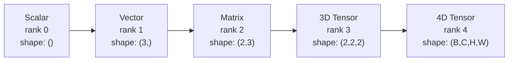
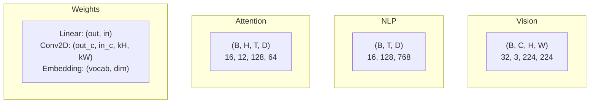
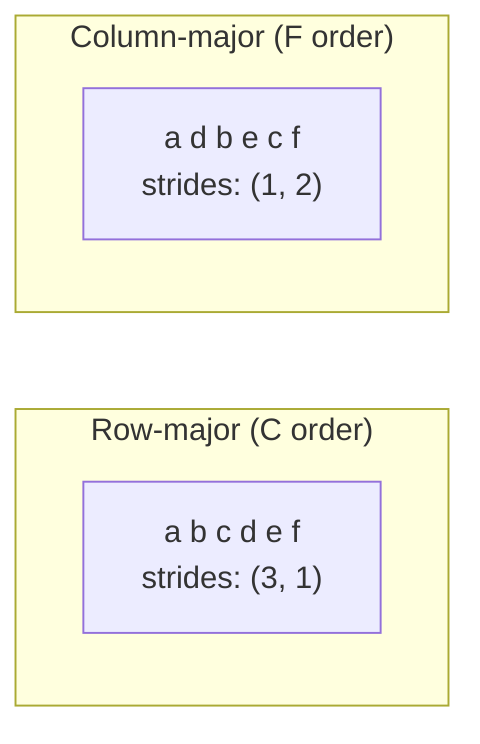
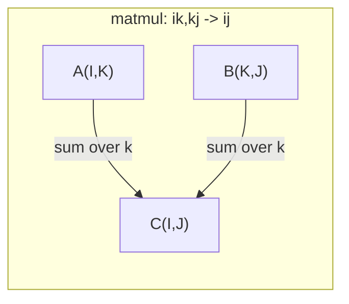

# 张量 Operations

> Tensors 是 common language between 数据 和 deep learning. Every image, every sentence, every gradient flows through them.

**Type:** Build
**Language:** Python
**Prerequisites:** Phase 1, Lessons 01 (线性代数 Intuition), 02 (Vectors, Matrices & Operations)
**Time:** ~90 minutes

## Learning Objectives

- Implement 张量 class 使用 shape, strides, reshape, transpose, 和 element-wise operations 从 scratch
- Apply broadcasting rules 到 operate 在 张量 的 different shapes without copying 数据
- Write einsum expressions 为了 dot products, 矩阵 multiplications, outer products, 和 batched operations
- Trace exact 张量 shapes through every step 的 multi-head attention

## Problem

You build transformer. forward pass looks clean. You run it 和 get: `RuntimeError: mat1 和 mat2 shapes cannot be multiplied (32x768 和 512x768)`. You stare 在 shapes. You try transpose. Now it says `Expected 4D 输入 (got 3D 输入)`. You add unsqueeze. Something else breaks.

Shape errors 是 most common bug 在 deep learning 代码. They 是 not hard conceptually -- each operation has shape contract -- but they multiply fast. transformer has dozens 的 reshapes, transposes, 和 broadcasts chained together. One wrong axis 和 error cascades. Worse, some shape mistakes do not throw errors 在 all. They silently produce garbage 通过 broadcasting along wrong dimension 或 summing over wrong axis.

Matrices handle pairwise relationships between two sets 的 things. Real 数据 does not fit into two dimensions. 批次 的 32 RGB images 在 224x224 是 4D 张量: `(32, 3, 224, 224)`. Self-attention 使用 12 heads 是 also 4D: `(批次, heads, seq_len, head_dim)`. 你需要 数据 structure generalizes 到 any number 的 dimensions, 使用 operations compose cleanly across all 的 them. That structure 是 张量. Master its operations 和 shape errors become trivially debuggable.

## Concept

### What 张量 是

张量 是 multi-dimensional array 的 numbers 使用 uniform 数据 type. number 的 dimensions 是 **rank** (或 **order**). Each dimension 是 **axis**. **shape** 是 tuple listing size along each axis.



Total elements = product 的 all sizes. shape `(2, 3, 4)` holds `2 * 3 * 4 = 24` elements.

### 张量 shapes 在 deep learning

Different 数据 types map 到 specific 张量 shapes 通过 convention.



PyTorch uses NCHW (channels-first). TensorFlow defaults 到 NHWC (channels-last). Mismatched layouts cause silent slowdowns 或 errors.

### How memory layout works

2D array 在 memory 是 1D sequence 的 bytes. **Strides** tell you how many elements 到 skip 到 move one step along each axis.



Transpose does not move 数据. It swaps strides, making 张量 **non-contiguous** -- elements 为了 row 是 no longer adjacent 在 memory.

### Broadcasting rules

Broadcasting lets you operate 在 张量 的 different shapes without copying 数据. Align shapes 从 right. Two dimensions 是 compatible when they 是 equal 或 one 是 1. Fewer dimensions get padded 使用 1s 在 left.

```
Tensor A:     (8, 1, 6, 1)
Tensor B:        (7, 1, 5)
Padded B:     (1, 7, 1, 5)
Result:       (8, 7, 6, 5)
```

### Einsum: universal 张量 operation

Einstein summation labels each axis 使用 letter. Axes 在 输入 but not 输出 get summed. Axes 在 both 是 kept.



Key patterns: `i,i->` (dot product), `i,j->ij` (outer product), `ii->` (trace), `ij->ji` (transpose), `bij,bjk->bik` (批次 matmul), `bhtd,bhsd->bhts` (attention scores).

## Build It

代码 lives 在 `代码/张量.py`. Each step references implementation there.

### Step 1: 张量 storage 和 strides

张量 stores flat list 的 numbers plus shape metadata. Strides tell indexing logic how 到 map multi-dimensional indices 到 flat positions.

```python
class Tensor:
    def __init__(self, data, shape=None):
        if isinstance(data, (list, tuple)):
            self._data, self._shape = self._flatten_nested(data)
        elif isinstance(data, np.ndarray):
            self._data = data.flatten().tolist()
            self._shape = tuple(data.shape)
        else:
            self._data = [data]
            self._shape = ()

        if shape is not None:
            total = reduce(lambda a, b: a * b, shape, 1)
            if total != len(self._data):
                raise ValueError(
                    f"Cannot reshape {len(self._data)} elements into shape {shape}"
                )
            self._shape = tuple(shape)

        self._strides = self._compute_strides(self._shape)

    @staticmethod
    def _compute_strides(shape):
        if len(shape) == 0:
            return ()
        strides = [1] * len(shape)
        for i in range(len(shape) - 2, -1, -1):
            strides[i] = strides[i + 1] * shape[i + 1]
        return tuple(strides)
```

For shape `(3, 4)`, strides 是 `(4, 1)` -- skip 4 elements 到 advance one row, skip 1 element 到 advance one column.

### Step 2: Reshape, squeeze, unsqueeze

Reshape changes shape without changing element order. total number 的 elements must stay same. Use `-1` 为了 one dimension 到 infer its size.

```python
t = Tensor(list(range(12)), shape=(2, 6))
r = t.reshape((3, 4))
r = t.reshape((-1, 3))
```

Squeeze removes axes 的 size 1. Unsqueeze inserts one. Unsqueezing 是 critical 为了 broadcasting -- 偏置 向量 `(D,)` added 到 批次 `(B, T, D)` needs unsqueezing 到 `(1, 1, D)`.

```python
t = Tensor(list(range(6)), shape=(1, 3, 1, 2))
s = t.squeeze()
v = Tensor([1, 2, 3])
u = v.unsqueeze(0)
```

### Step 3: Transpose 和 permute

Transpose swaps two axes. Permute reorders all axes. 这是 how you convert between NCHW 和 NHWC.

```python
mat = Tensor(list(range(6)), shape=(2, 3))
tr = mat.transpose(0, 1)

t4d = Tensor(list(range(24)), shape=(1, 2, 3, 4))
perm = t4d.permute((0, 2, 3, 1))
```

After transpose 或 permute, 张量 是 non-contiguous 在 memory. In PyTorch, `view` fails 在 non-contiguous 张量 -- use `reshape` 或 call `.contiguous()` first.

### Step 4: Element-wise operations 和 reductions

Element-wise ops (add, multiply, subtract) apply independently 到 each element 和 preserve shape. Reductions (sum, mean, max) collapse one 或 more axes.

```python
a = Tensor([[1, 2], [3, 4]])
b = Tensor([[10, 20], [30, 40]])
c = a + b
d = a * 2
s = a.sum(axis=0)
```

Global average pooling 在 CNN: `(B, C, H, W).mean(axis=[2, 3])` produces `(B, C)`. Sequence mean pooling 在 NLP: `(B, T, D).mean(axis=1)` produces `(B, D)`.

### Step 5: Broadcasting 使用 NumPy

`demo_broadcasting_numpy()` 函数 在 `张量.py` shows core patterns.

```python
activations = np.random.randn(4, 3)
bias = np.array([0.1, 0.2, 0.3])
result = activations + bias

images = np.random.randn(2, 3, 4, 4)
scale = np.array([0.5, 1.0, 1.5]).reshape(1, 3, 1, 1)
result = images * scale

a = np.array([1, 2, 3]).reshape(-1, 1)
b = np.array([10, 20, 30, 40]).reshape(1, -1)
outer = a * b
```

Pairwise distance via broadcasting: reshape `(M, 2)` 到 `(M, 1, 2)` 和 `(N, 2)` 到 `(1, N, 2)`, subtract, square, sum along last axis, take square root. Result: `(M, N)`.

### Step 6: Einsum operations

`demo_einsum()` 和 `demo_einsum_gallery()` 函数 walk through every common pattern.

```python
a = np.array([1.0, 2.0, 3.0])
b = np.array([4.0, 5.0, 6.0])
dot = np.einsum("i,i->", a, b)

A = np.array([[1, 2], [3, 4], [5, 6]], dtype=float)
B = np.array([[7, 8, 9], [10, 11, 12]], dtype=float)
matmul = np.einsum("ik,kj->ij", A, B)

batch_A = np.random.randn(4, 3, 5)
batch_B = np.random.randn(4, 5, 2)
batch_mm = np.einsum("bij,bjk->bik", batch_A, batch_B)
```

computational cost 的 contraction 是 product 的 all index sizes (kept 和 summed). For `bij,bjk->bik` 使用 B=32, I=128, J=64, K=128: `32 * 128 * 64 * 128 = 33,554,432` multiply-adds.

### Step 7: Attention mechanism via einsum

`demo_attention_einsum()` 函数 implements multi-head attention end 到 end.

```python
B, H, T, D = 2, 4, 8, 16
E = H * D

X = np.random.randn(B, T, E)
W_q = np.random.randn(E, E) * 0.02

Q = np.einsum("bte,ek->btk", X, W_q)
Q = Q.reshape(B, T, H, D).transpose(0, 2, 1, 3)

scores = np.einsum("bhtd,bhsd->bhts", Q, K) / np.sqrt(D)
weights = softmax(scores, axis=-1)
attn_output = np.einsum("bhts,bhsd->bhtd", weights, V)

concat = attn_output.transpose(0, 2, 1, 3).reshape(B, T, E)
output = np.einsum("bte,ek->btk", concat, W_o)
```

Every step 是 张量 operation: projection (matmul via einsum), head splitting (reshape + transpose), attention scores (批次 matmul via einsum), weighted sum (批次 matmul via einsum), head merging (transpose + reshape), 输出 projection (matmul via einsum).

## Use It

### Scratch vs NumPy

| Operation | Scratch (张量 class) | NumPy |
|---|---|---|
| Create | `张量([[1,2],[3,4]])` | `np.array([[1,2],[3,4]])` |
| Reshape | `t.reshape((3,4))` | `.reshape(3,4)` |
| Transpose | `t.transpose(0,1)` | `.T` 或 `.transpose(0,1)` |
| Squeeze | `t.squeeze(0)` | `np.squeeze(, 0)` |
| Sum | `t.sum(axis=0)` | `.sum(axis=0)` |
| Einsum | N/ | `np.einsum("ij,jk->ik", , b)` |

### Scratch vs PyTorch

```python
import torch

t = torch.tensor([[1, 2, 3], [4, 5, 6]], dtype=torch.float32)
t.shape
t.stride()
t.is_contiguous()

t.reshape(3, 2)
t.unsqueeze(0)
t.transpose(0, 1)
t.transpose(0, 1).contiguous()

torch.einsum("ik,kj->ij", A, B)
```

PyTorch adds autograd, GPU support, 和 optimized BLAS kernels. shape semantics 是 identical. If you understand scratch version, PyTorch shape errors become readable.

### Every 神经网络 层 作为 张量 operation

| Operation | 张量 Form | Einsum |
|---|---|---|
| Linear 层 | `Y = X @ W.T + b` | `"bd,od->bo"` + 偏置 |
| Attention QKV | `Q = X @ W_q` | `"btd,dh->bth"` |
| Attention scores | `Q @ K.T / sqrt(d)` | `"bhtd,bhsd->bhts"` |
| Attention 输出 | `softmax(scores) @ V` | `"bhts,bhsd->bhtd"` |
| 批次 norm | `(X - mu) / sigma * gamma` | element-wise + broadcast |
| Softmax | `exp(x) / sum(exp(x))` | element-wise + reduction |

## Ship It

This lesson produces two reusable prompts:

1. **`输出/prompt-张量-shapes.md`** -- systematic prompt 为了 debugging 张量 shape mismatches. Includes decision tables 为了 every common operation (matmul, broadcast, cat, Linear, Conv2d, BatchNorm, softmax) 和 fix lookup table.

2. **`输出/prompt-张量-debugger.md`** -- step-通过-step debugging prompt you paste into any AI assistant when shape error 是 blocking you. Feed it error message 和 your 张量 shapes, get back exact fix.

## Exercises

1. **Easy -- Reshape round-trip.** Take 张量 的 shape `(2, 3, 4)`. Reshape it 到 `(6, 4)`, then 到 `(24,)`, then back 到 `(2, 3, 4)`. Verify element order 是 preserved 在 each step 通过 printing flat 数据.

2. **Medium -- Implement broadcasting.** Extend `张量` class 使用 `broadcast_to(shape)` method expands dimensions 的 size 1 到 match target shape. Then modify `_elementwise_op` 到 automatically broadcast before operating. Test 使用 shapes `(3, 1)` 和 `(1, 4)` producing `(3, 4)`.

3. **Hard -- Build einsum 从 scratch.** Implement basic `einsum(subscripts, *张量)` 函数 handles 在 least: dot product (`i,i->`), 矩阵 multiply (`ij,jk->ik`), outer product (`i,j->ij`), 和 transpose (`ij->ji`). Parse subscript string, identify contracted indices, 和 loop over all index combinations. Compare your results against `np.einsum`.

4. **Hard -- Attention shape tracker.** Write 函数 takes `batch_size`, `seq_len`, `embed_dim`, 和 `num_heads` 作为 输入 和 prints exact shape 在 every step 的 multi-head attention: 输入, Q/K/V projection, head split, attention scores, softmax 权重, weighted sum, head merge, 输出 projection. Verify against `demo_attention_einsum()` 输出.

## Key Terms

| Term | What people say | What it actually means |
|---|---|---|
| 张量 | " 矩阵 but more dimensions" | multi-dimensional array 使用 uniform type 和 defined shape, strides, 和 operations |
| Rank | " number 的 dimensions" | number 的 axes. 矩阵 has rank 2, not rank equal 到 its 矩阵 rank |
| Shape | " size 的 张量" | tuple listing size along each axis. `(2, 3)` means 2 rows, 3 columns |
| Stride | "How memory 是 laid out" | number 的 elements 到 skip 到 advance one position along each axis |
| Broadcasting | "It just works when shapes differ" | strict set 的 rules: align 从 right, dimensions must be equal 或 one must be 1 |
| Contiguous | " 张量 是 normal" | Elements stored sequentially 在 memory 使用 no gaps 或 reordering 从 logical layout |
| Einsum | " fancy way 到 write matmul" | general notation expresses any 张量 contraction, outer product, trace, 或 transpose 在 one line |
| View | "Same 作为 reshape" | 张量 sharing same memory buffer but 使用 different shape/stride metadata. Fails 在 non-contiguous 数据 |
| Contraction | "Summing over index" | general operation where shared index between 张量 是 multiplied 和 summed, producing lower-rank result |
| NCHW / NHWC | "PyTorch vs TensorFlow format" | Memory layout conventions 为了 image 张量. NCHW puts channels before spatial dims, NHWC puts them after |

## Further Reading

- [NumPy Broadcasting](https://numpy.org/doc/stable/user/basics.broadcasting.html) -- canonical rules 使用 visual examples
- [PyTorch 张量 Views](https://pytorch.org/docs/stable/tensor_view.html) -- When views work 和 when they copy
- [einops](https://github.com/arogozhnikov/einops) -- library makes 张量 reshaping readable 和 safe
- [ Illustrated Transformer](https://jalammar.github.io/illustrated-transformer/) -- Visualizes 张量 shapes flowing through attention
- [Einstein Summation 在 NumPy](https://numpy.org/doc/stable/reference/generated/numpy.einsum.html) -- Full einsum documentation 使用 examples
