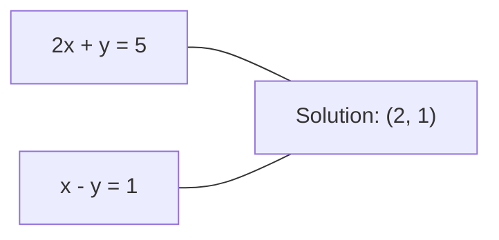
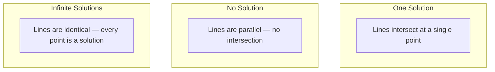

# Linear Systems

> Solving Ax = b 是 oldest problem 在 mathematics still runs your 神经网络.

**Type:** Build
**Language:** Python
**Prerequisites:** Phase 1, Lessons 01 (线性代数 Intuition), 02 (Vectors & Matrices), 03 (矩阵 Transformations)
**Time:** ~120 minutes

## Learning Objectives

- Solve Ax = b using Gaussian elimination 使用 partial pivoting 和 back substitution
- Factor 矩阵 使用 LU, QR, 和 Cholesky decompositions 和 explain when each 是 appropriate
- Derive normal equations 为了 least squares 和 connect them 到 linear 和 ridge 回归
- Diagnose ill-conditioned systems using condition number 和 apply 正则化 到 stabilize them

## Problem

Every time you train linear 回归, you solve linear system. Every time you compute least-squares fit, you solve linear system. Every time 神经网络 层 computes `y = Wx + b`, it 是 evaluating one side 的 linear system. When you add 正则化, you modify system. When you use Gaussian processes, you factor 矩阵. When you invert covariance 矩阵 为了 Mahalanobis distance, you solve linear system.

equation Ax = b appears everywhere. 是 矩阵 的 known coefficients. b 是 向量 的 known 输出. x 是 向量 的 unknowns you want 到 find. In linear 回归, 是 your 数据 矩阵, b 是 your target 向量, 和 x 是 权重 向量. entire 模型 reduces 到: find x such Ax 是 作为 close 到 b 作为 possible.

This lesson builds every major method 为了 solving equation 从 scratch. 你将理解 why some methods 是 fast 和 others 是 stable, why some work only 为了 square systems 和 others handle overdetermined ones, 和 why condition number 的 your 矩阵 determines whether your answer means anything 在 all.

## Concept

### What Ax = b means geometrically

system 的 linear equations has geometric interpretation. Each equation defines hyperplane. solution 是 point (或 set 的 points) where all hyperplanes intersect.

```
2x + y = 5          Two lines in 2D.
x - y  = 1          They intersect at x=2, y=1.
```



Three things can happen:



In 矩阵 form, "one solution" means 是 invertible. "No solution" means system 是 inconsistent. "Infinite solutions" means has null space. Most ML problems fall 在 "no exact solution" category because you have more equations (数据 points) than unknowns (参数). 那是 where least squares comes 在.

### Column picture vs row picture

有 two ways 到 read Ax = b.

**Row picture.** Each row 的 defines one equation. Each equation 是 hyperplane. solution 是 where they all intersect.

**Column picture.** Each column 的 是 向量. question becomes: what linear combination 的 columns 的 produces b?

```
A = | 2  1 |    b = | 5 |
    | 1 -1 |        | 1 |

Row picture: solve 2x + y = 5 and x - y = 1 simultaneously.

Column picture: find x1, x2 such that:
  x1 * [2, 1] + x2 * [1, -1] = [5, 1]
  2 * [2, 1] + 1 * [1, -1] = [4+1, 2-1] = [5, 1]   check.
```

column picture 是 more fundamental. If b lies 在 column space 的 , system has solution. If b does not, you find closest point 在 column space. That closest point 是 least-squares solution.

### Gaussian elimination

Gaussian elimination transforms Ax = b into upper triangular system Ux = c you solve 通过 back substitution. 它是 most direct method.

算法:

```
1. For each column k (the pivot column):
   a. Find the largest entry in column k at or below row k (partial pivoting).
   b. Swap that row with row k.
   c. For each row i below k:
      - Compute multiplier m = A[i][k] / A[k][k]
      - Subtract m times row k from row i.
2. Back substitute: solve from the last equation upward.
```

Example:

```
Original:
| 2  1  1 | 8 |       R2 = R2 - (2)R1     | 2  1   1 |  8 |
| 4  3  3 |20 |  -->  R3 = R3 - (1)R1 --> | 0  1   1 |  4 |
| 2  3  1 |12 |                            | 0  2   0 |  4 |

                       R3 = R3 - (2)R2     | 2  1   1 |  8 |
                                       --> | 0  1   1 |  4 |
                                           | 0  0  -2 | -4 |

Back substitute:
  -2 * x3 = -4    -->  x3 = 2
  x2 + 2  = 4     -->  x2 = 2
  2*x1 + 2 + 2 = 8 --> x1 = 2
```

Gaussian elimination costs O(n^3) operations. For 1000x1000 system, 是 about billion floating-point operations. Fast, but you can do better if you need 到 solve multiple systems 使用 same .

### Partial pivoting: why it matters

Without pivoting, Gaussian elimination can fail 或 produce garbage. If pivot element 是 zero, you divide 通过 zero. If it 是 small, you amplify rounding errors.

```
Bad pivot:                       With partial pivoting:
| 0.001  1 | 1.001 |            Swap rows first:
| 1      1 | 2     |            | 1      1 | 2     |
                                 | 0.001  1 | 1.001 |
m = 1/0.001 = 1000              m = 0.001/1 = 0.001
R2 = R2 - 1000*R1               R2 = R2 - 0.001*R1
| 0.001  1     | 1.001   |      | 1      1     | 2     |
| 0     -999   | -999.0  |      | 0      0.999 | 0.999 |

x2 = 1.000 (correct)            x2 = 1.000 (correct)
x1 = (1.001 - 1)/0.001          x1 = (2 - 1)/1 = 1.000 (correct)
   = 0.001/0.001 = 1.000        Stable because the multiplier is small.
```

In floating-point arithmetic 使用 limited 精确率, unpivoted version can lose significant digits. Partial pivoting always selects largest available pivot 到 minimize error amplification.

### LU decomposition

LU decomposition factors into lower triangular 矩阵 L 和 upper triangular 矩阵 U: = LU. L 矩阵 stores multipliers 从 Gaussian elimination. U 矩阵 是 result 的 elimination.

```
A = L @ U

| 2  1  1 |   | 1  0  0 |   | 2  1   1 |
| 4  3  3 | = | 2  1  0 | @ | 0  1   1 |
| 2  3  1 |   | 1  2  1 |   | 0  0  -2 |
```

Why factor instead 的 just eliminating? Because once you have L 和 U, solving Ax = b 为了 any new b costs only O(n^2):

```
Ax = b
LUx = b
Let y = Ux:
  Ly = b    (forward substitution, O(n^2))
  Ux = y    (back substitution, O(n^2))
```

O(n^3) cost 是 paid once during factorization. Every subsequent solve 是 O(n^2). If you need 到 solve 1000 systems 使用 same but different b 向量, LU saves factor 的 1000/3 在 total work.

With partial pivoting, you get PA = LU where P 是 permutation 矩阵 recording row swaps.

### QR decomposition

QR decomposition factors into orthogonal 矩阵 Q 和 upper triangular 矩阵 R: = QR.

orthogonal 矩阵 has property Q^T Q = I. Its columns 是 orthonormal 向量. Multiplying 通过 Q preserves lengths 和 angles.

```
A = Q @ R

Q has orthonormal columns: Q^T Q = I
R is upper triangular

To solve Ax = b:
  QRx = b
  Rx = Q^T b    (just multiply by Q^T, no inversion needed)
  Back substitute to get x.
```

QR 是 numerically more stable than LU 为了 solving least-squares problems. Gram-Schmidt process builds Q column 通过 column:

```
Given columns a1, a2, ... of A:

q1 = a1 / ||a1||

q2 = a2 - (a2 . q1) * q1        (subtract projection onto q1)
q2 = q2 / ||q2||                (normalize)

q3 = a3 - (a3 . q1) * q1 - (a3 . q2) * q2
q3 = q3 / ||q3||

R[i][j] = qi . aj    for i <= j
```

Each step removes component along all previous q 向量, leaving only new orthogonal direction.

### Cholesky decomposition

When 是 symmetric ( = ^T) 和 positive definite (all eigenvalues positive), you can factor it 作为 = L L^T where L 是 lower triangular. 这是 Cholesky decomposition.

```
A = L @ L^T

| 4  2 |   | 2  0 |   | 2  1 |
| 2  5 | = | 1  2 | @ | 0  2 |

L[i][i] = sqrt(A[i][i] - sum(L[i][k]^2 for k < i))
L[i][j] = (A[i][j] - sum(L[i][k]*L[j][k] for k < j)) / L[j][j]    for i > j
```

Cholesky 是 twice 作为 fast 作为 LU 和 requires half storage. It only works 为了 symmetric positive definite 矩阵, but 那些 show up constantly:

- Covariance 矩阵 是 symmetric positive semi-definite (positive definite 使用 正则化).
- kernel 矩阵 在 Gaussian processes 是 symmetric positive definite.
- Hessian 的 convex 函数 在 minimum 是 symmetric positive definite.
- ^T 是 always symmetric positive semi-definite.

In Gaussian processes, you factor kernel 矩阵 K 使用 Cholesky, then solve K alpha = y 到 get predictive mean. Cholesky factor also gives you log-determinant 为了 marginal likelihood: log det(K) = 2 * sum(log(diag(L))).

### Least squares: when Ax = b has no exact solution

If 是 m x n 使用 m > n (more equations than unknowns), system 是 overdetermined. 有 no exact solution. Instead, you minimize squared error:

```
minimize ||Ax - b||^2

This is the sum of squared residuals:
  sum((A[i,:] @ x - b[i])^2 for i in range(m))
```

minimizer satisfies normal equations:

```
A^T A x = A^T b
```

Derivation: expand ||Ax - b||^2 = (Ax - b)^T (Ax - b) = x^T ^T x - 2 x^T ^T b + b^T b. Take gradient 使用 respect 到 x, set it 到 zero: 2 ^T x - 2 ^T b = 0.

```
Original system (overdetermined, 4 equations, 2 unknowns):
| 1  1 |         | 3 |
| 1  2 | x     = | 5 |       No exact x satisfies all 4 equations.
| 1  3 |         | 6 |
| 1  4 |         | 8 |

Normal equations:
A^T A = | 4  10 |    A^T b = | 22 |
        | 10 30 |            | 63 |

Solve: x = [1.5, 1.7]

This is linear regression. x[0] is the intercept, x[1] is the slope.
```

### Normal equations = linear 回归

connection 是 exact. In linear 回归, your 数据 矩阵 X has one row per sample 和 one column per 特征. Your target 向量 y has one entry per sample. 权重 向量 w satisfies:

```
X^T X w = X^T y
w = (X^T X)^(-1) X^T y
```

这是 closed-form solution 到 linear 回归. Every call 到 `sklearn.linear_model.LinearRegression.fit()` computes 这个 (或 equivalent via QR 或 SVD).

Add 正则化 term lambda * I 到 矩阵 和 you get ridge 回归:

```
(X^T X + lambda * I) w = X^T y
w = (X^T X + lambda * I)^(-1) X^T y
```

正则化 makes 矩阵 better conditioned (easier 到 invert accurately) 和 prevents 过拟合 通过 shrinking 权重 toward zero. 矩阵 X^T X + lambda * I 是 always symmetric positive definite when lambda > 0, so you can use Cholesky 到 solve it.

### Pseudoinverse (Moore-Penrose)

pseudoinverse + generalizes 矩阵 inversion 到 non-square 和 singular 矩阵. For any 矩阵 :

```
x = A+ b

where A+ = V Sigma+ U^T    (computed via SVD)
```

Sigma+ 是 formed 通过 taking reciprocal 的 each nonzero singular value 和 transposing result. If = U Sigma V^T, then + = V Sigma+ U^T.

```
A = U Sigma V^T        (SVD)

Sigma = | 5  0 |       Sigma+ = | 1/5  0  0 |
        | 0  2 |                | 0  1/2  0 |
        | 0  0 |

A+ = V Sigma+ U^T
```

pseudoinverse gives minimum-norm least-squares solution. If system has:
- One solution: + b gives it.
- No solution: + b gives least-squares solution.
- Infinite solutions: + b gives one 使用 smallest ||x||.

NumPy's `np.linalg.lstsq` 和 `np.linalg.pinv` both use SVD internally.

### Condition number

condition number measures how sensitive solution 是 到 small changes 在 输入. For 矩阵 , condition number 是:

```
kappa(A) = ||A|| * ||A^(-1)|| = sigma_max / sigma_min
```

where sigma_max 和 sigma_min 是 largest 和 smallest singular values.

```
Well-conditioned (kappa ~ 1):        Ill-conditioned (kappa ~ 10^15):
Small change in b -->                Small change in b -->
small change in x                    huge change in x

| 2  0 |   kappa = 2/1 = 2          | 1   1          |   kappa ~ 10^15
| 0  1 |   safe to solve            | 1   1+10^(-15) |   solution is garbage
```

Rules 的 thumb:
- kappa < 100: safe, solution 是 accurate.
- kappa ~ 10^k: you lose about k digits 的 精确率 从 your floating-point arithmetic.
- kappa ~ 10^16 (为了 float64): solution 是 meaningless. 矩阵 是 effectively singular.

In ML, ill-conditioning happens when 特征 是 nearly collinear. 正则化 (adding lambda * I) improves condition number 从 sigma_max / sigma_min 到 (sigma_max + lambda) / (sigma_min + lambda).

### Iterative methods: conjugate gradient

For very large sparse systems (millions 的 unknowns), direct methods like LU 或 Cholesky 是 too expensive. Iterative methods approximate solution 通过 improving guess over many iterations.

Conjugate gradient (CG) solves Ax = b when 是 symmetric positive definite. It finds exact solution 在 在 most n iterations (在 exact arithmetic), but typically converges much faster if eigenvalues 的 是 clustered.

```
Algorithm sketch:
  x0 = initial guess (often zero)
  r0 = b - A x0           (residual)
  p0 = r0                 (search direction)

  For k = 0, 1, 2, ...:
    alpha = (rk . rk) / (pk . A pk)
    x_{k+1} = xk + alpha * pk
    r_{k+1} = rk - alpha * A pk
    beta = (r_{k+1} . r_{k+1}) / (rk . rk)
    p_{k+1} = r_{k+1} + beta * pk
    if ||r_{k+1}|| < tolerance: stop
```

CG 是 used 在:
- Large-scale optimization (Newton-CG method)
- Solving PDE discretizations
- Kernel methods where kernel 矩阵 是 too large 到 factor
- Preconditioning 为了 other iterative solvers

收敛 rate depends 在 condition number. Better conditioned systems converge faster, which 是 another reason 正则化 helps.

### full picture: which method when

| Method | Requirements | Cost | Use case |
|--------|-------------|------|----------|
| Gaussian elimination | Square, nonsingular | O(n^3) | One-off solve 的 square system |
| LU decomposition | Square, nonsingular | O(n^3) factor + O(n^2) solve | Multiple solves 使用 same |
| QR decomposition | Any (m >= n) | O(mn^2) | Least squares, numerically stable |
| Cholesky | Symmetric positive definite | O(n^3/3) | Covariance 矩阵, Gaussian processes, ridge 回归 |
| Normal equations | Overdetermined (m > n) | O(mn^2 + n^3) | Linear 回归 (small n) |
| SVD / pseudoinverse | Any | O(mn^2) | Rank-deficient systems, minimum-norm solutions |
| Conjugate gradient | Symmetric positive definite, sparse | O(n * k * nnz) | Large sparse systems, k = iterations |

### Connection 到 ML

Every method 在 这个 lesson appears 在 production ML:

**Linear 回归.** closed-form solution solves normal equations X^T X w = X^T y. 这是 done via Cholesky (if n 是 small) 或 QR (if numerical stability matters) 或 SVD (if 矩阵 might be rank-deficient).

**Ridge 回归.** Adds lambda * I 到 X^T X. regularized system (X^T X + lambda * I) w = X^T y 是 always solvable via Cholesky because X^T X + lambda * I 是 symmetric positive definite 为了 lambda > 0.

**Gaussian processes.** predictive mean requires solving K alpha = y where K 是 kernel 矩阵. Cholesky factorization 的 K 是 standard approach. log marginal likelihood uses log det(K) = 2 sum(log(diag(L))).

**Neural network initialization.** Orthogonal initialization uses QR decomposition 到 create 权重 矩阵 whose columns 是 orthonormal. This prevents signal collapse 在 deep networks.

**Preconditioning.** Large-scale optimizers use incomplete Cholesky 或 incomplete LU 作为 preconditioners 为了 conjugate gradient solvers.

**特征 engineering.** condition number 的 X^T X tells you if your 特征 是 collinear. If kappa 是 large, drop 特征 或 add 正则化.

## Build It

### Step 1: Gaussian elimination 使用 partial pivoting

```python
import numpy as np

def gaussian_elimination(A, b):
    n = len(b)
    Ab = np.hstack([A.astype(float), b.reshape(-1, 1).astype(float)])

    for k in range(n):
        max_row = k + np.argmax(np.abs(Ab[k:, k]))
        Ab[[k, max_row]] = Ab[[max_row, k]]

        if abs(Ab[k, k]) < 1e-12:
            raise ValueError(f"Matrix is singular or nearly singular at pivot {k}")

        for i in range(k + 1, n):
            m = Ab[i, k] / Ab[k, k]
            Ab[i, k:] -= m * Ab[k, k:]

    x = np.zeros(n)
    for i in range(n - 1, -1, -1):
        x[i] = (Ab[i, -1] - Ab[i, i+1:n] @ x[i+1:n]) / Ab[i, i]

    return x
```

### Step 2: LU decomposition

```python
def lu_decompose(A):
    n = A.shape[0]
    L = np.eye(n)
    U = A.astype(float).copy()
    P = np.eye(n)

    for k in range(n):
        max_row = k + np.argmax(np.abs(U[k:, k]))
        if max_row != k:
            U[[k, max_row]] = U[[max_row, k]]
            P[[k, max_row]] = P[[max_row, k]]
            if k > 0:
                L[[k, max_row], :k] = L[[max_row, k], :k]

        for i in range(k + 1, n):
            L[i, k] = U[i, k] / U[k, k]
            U[i, k:] -= L[i, k] * U[k, k:]

    return P, L, U

def lu_solve(P, L, U, b):
    n = len(b)
    Pb = P @ b.astype(float)

    y = np.zeros(n)
    for i in range(n):
        y[i] = Pb[i] - L[i, :i] @ y[:i]

    x = np.zeros(n)
    for i in range(n - 1, -1, -1):
        x[i] = (y[i] - U[i, i+1:] @ x[i+1:]) / U[i, i]

    return x
```

### Step 3: Cholesky decomposition

```python
def cholesky(A):
    n = A.shape[0]
    L = np.zeros_like(A, dtype=float)

    for i in range(n):
        for j in range(i + 1):
            s = A[i, j] - L[i, :j] @ L[j, :j]
            if i == j:
                if s <= 0:
                    raise ValueError("Matrix is not positive definite")
                L[i, j] = np.sqrt(s)
            else:
                L[i, j] = s / L[j, j]

    return L
```

### Step 4: Least squares via normal equations

```python
def least_squares_normal(A, b):
    AtA = A.T @ A
    Atb = A.T @ b
    return gaussian_elimination(AtA, Atb)

def ridge_regression(A, b, lam):
    n = A.shape[1]
    AtA = A.T @ A + lam * np.eye(n)
    Atb = A.T @ b
    L = cholesky(AtA)
    y = np.zeros(n)
    for i in range(n):
        y[i] = (Atb[i] - L[i, :i] @ y[:i]) / L[i, i]
    x = np.zeros(n)
    for i in range(n - 1, -1, -1):
        x[i] = (y[i] - L.T[i, i+1:] @ x[i+1:]) / L.T[i, i]
    return x
```

### Step 5: Condition number

```python
def condition_number(A):
    U, S, Vt = np.linalg.svd(A)
    return S[0] / S[-1]
```

## Use It

Putting pieces together 为了 linear 回归 和 ridge 回归 在 real 数据:

```python
np.random.seed(42)
X_raw = np.random.randn(100, 3)
w_true = np.array([2.0, -1.0, 0.5])
y = X_raw @ w_true + np.random.randn(100) * 0.1

X = np.column_stack([np.ones(100), X_raw])

w_ols = least_squares_normal(X, y)
print(f"OLS weights (ours):    {w_ols}")

w_np = np.linalg.lstsq(X, y, rcond=None)[0]
print(f"OLS weights (numpy):   {w_np}")
print(f"Max difference: {np.max(np.abs(w_ols - w_np)):.2e}")

w_ridge = ridge_regression(X, y, lam=1.0)
print(f"Ridge weights (ours):  {w_ridge}")

from sklearn.linear_model import Ridge
ridge_sk = Ridge(alpha=1.0, fit_intercept=False)
ridge_sk.fit(X, y)
print(f"Ridge weights (sklearn): {ridge_sk.coef_}")
```

## Ship It

This lesson produces:
- `代码/linear_systems.py` containing 从-scratch implementations 的 Gaussian elimination, LU decomposition, Cholesky decomposition, least squares, 和 ridge 回归
- working demonstration normal equations 和 sklearn's LinearRegression produce same 权重

## Exercises

1. Solve system `[[1,2,3],[4,5,6],[7,8,10]] x = [6, 15, 27]` using your Gaussian elimination, your LU solver, 和 `np.linalg.solve`. Verify all three give same answer within floating-point tolerance.

2. Generate 50x5 random 矩阵 X 和 target y = X @ w_true + noise. Solve 为了 w using normal equations, QR (via `np.linalg.qr`), SVD (via `np.linalg.svd`), 和 `np.linalg.lstsq`. Compare all four solutions. Measure condition number 的 X^T X 和 explain how it affects which method you trust.

3. Create nearly singular 矩阵 通过 making two columns almost identical (e.g., column 2 = column 1 + 1e-10 * noise). Compute its condition number. Solve Ax = b 使用 和 without 正则化 (add 0.01 * I). Compare solutions 和 residuals. Explain why 正则化 helps.

4. Implement conjugate gradient 算法 为了 100x100 random symmetric positive definite 矩阵. Count how many iterations it takes 到 converge 到 tolerance 1e-8. Compare 使用 theoretical maximum 的 n iterations.

5. Time your Cholesky solver vs your LU solver vs `np.linalg.solve` 在 symmetric positive definite 矩阵 的 size 10, 50, 200, 500. Plot results. Verify Cholesky 是 roughly 2x faster than LU.

## Key Terms

| Term | What people say | What it actually means |
|------|----------------|----------------------|
| Linear system | "Solve 为了 x" | set 的 linear equations Ax = b. Finding x means finding 输入 produces 输出 b under transformation . |
| Gaussian elimination | "Row reduce" | Systematically zero out entries below diagonal using row operations, producing upper triangular system solvable 通过 back substitution. O(n^3). |
| Partial pivoting | "Swap rows 为了 stability" | Before eliminating 在 column k, swap row 使用 largest absolute value 在 column 到 pivot position. Prevents division 通过 small numbers. |
| LU decomposition | "Factor into triangles" | Write = LU where L 是 lower triangular (stores multipliers) 和 U 是 upper triangular ( eliminated 矩阵). Amortizes O(n^3) cost over multiple solves. |
| QR decomposition | "Orthogonal factorization" | Write = QR where Q has orthonormal columns 和 R 是 upper triangular. More stable than LU 为了 least squares. |
| Cholesky decomposition | "Square root 的 矩阵" | For symmetric positive definite , write = LL^T. Half cost 的 LU. Used 为了 covariance 矩阵, kernel 矩阵, 和 ridge 回归. |
| Least squares | "Best fit when exact 是 impossible" | Minimize sum 的 squared residuals ||Ax - b||^2 when system 是 overdetermined (more equations than unknowns). |
| Normal equations | " 微积分 shortcut" | ^T x = ^T b. Setting gradient 的 ||Ax - b||^2 到 zero. This IS closed-form solution 到 linear 回归. |
| Pseudoinverse | "Inversion 为了 non-square 矩阵" | + = V Sigma+ U^T via SVD. Gives minimum-norm least-squares solution 为了 any 矩阵, square 或 rectangular, singular 或 not. |
| Condition number | "How trustworthy 是 这个 answer" | kappa = sigma_max / sigma_min. Measures sensitivity 到 输入 perturbations. Lose about log10(kappa) digits 的 精确率. |
| Ridge 回归 | "Regularized least squares" | Solve (X^T X + lambda I) w = X^T y. Adding lambda I improves conditioning 和 shrinks 权重 toward zero. Prevents 过拟合. |
| Conjugate gradient | "Iterative Ax=b 为了 big 矩阵" | iterative solver 为了 symmetric positive definite systems. Converges 在 在 most n steps. Practical 为了 large sparse systems where factorization 是 too expensive. |
| Overdetermined system | "More 数据 than 参数" | m > n 在 m-通过-n system. No exact solution exists. Least squares finds best approximation. 这是 every 回归 problem. |
| Back substitution | "Solve 从 bottom up" | Given upper triangular system, solve last equation first, then substitute backward. O(n^2). |
| Forward substitution | "Solve 从 top down" | Given lower triangular system, solve first equation first, then substitute forward. O(n^2). Used 在 L step 的 LU solves. |

## Further Reading

- [MIT 18.06: 线性代数](https://ocw.mit.edu/courses/18-06-linear-algebra-spring-2010/) (Gilbert Strang) -- definitive course 在 linear systems 和 矩阵 factorizations
- [Numerical 线性代数](https://people.maths.ox.ac.uk/trefethen/text.html) (Trefethen & Bau) -- standard reference 为了 understanding numerical stability, conditioning, 和 why 算法 fail
- [矩阵 Computations](https://www.cs.cornell.edu/cv/GolubVanLoan4/golubandvanloan.htm) (Golub & Van Loan) -- encyclopedic reference 为了 every 矩阵 算法
- [3Blue1Brown: Inverse Matrices](https://www.3blue1brown.com/lessons/inverse-矩阵) -- visual intuition 为了 what solving Ax = b means geometrically
