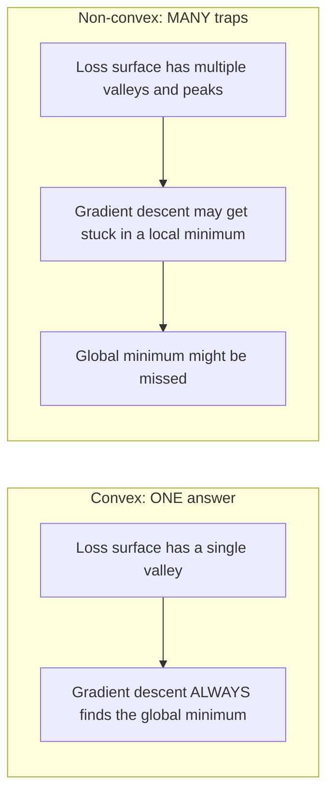
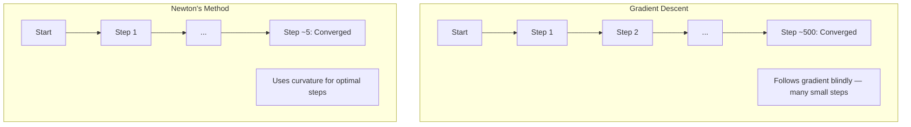
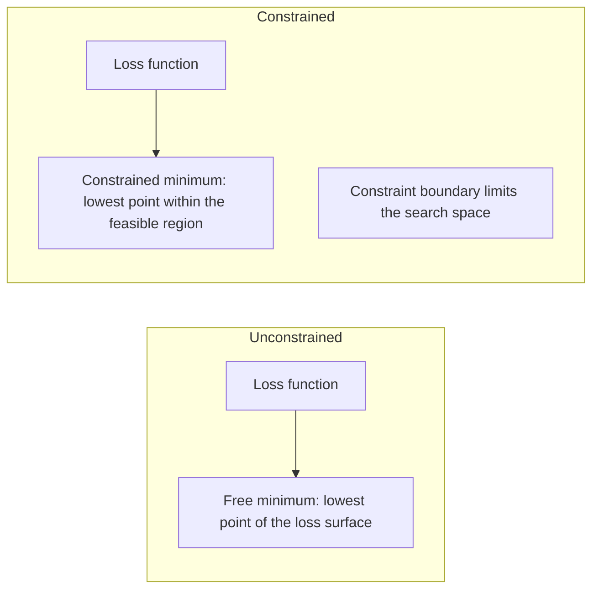
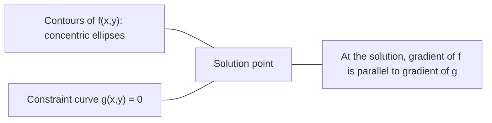

# Convex Optimization

> Convex problems have one valley. Neural networks have millions. Knowing difference matters.

**Type:** Build
**Language:** Python
**Prerequisites:** Phase 1, Lessons 04 (微积分 为了 ML), 08 (Optimization)
**Time:** ~90 minutes

## Learning Objectives

- Test whether 函数 是 convex using definition, second derivative, 和 Hessian criteria
- Implement Newton's method 和 compare its quadratic 收敛 against 梯度下降
- Solve constrained optimization problems using Lagrange multipliers 和 interpret KKT conditions
- Explain why 神经网络 loss landscapes 是 non-convex yet SGD still finds good solutions

## Problem

Lesson 08 taught you 梯度下降, momentum, 和 Adam. Those optimizers walk downhill 在 any surface. But they come 使用 no guarantees. Gradient descent 在 non-convex landscape might land 在 bad local minimum, get stuck 在 saddle point, 或 oscillate forever. You used it anyway because 神经网络 是 non-convex 和 there 是 no alternative.

But many problems 在 machine learning 是 convex. Linear 回归, logistic 回归, SVMs, LASSO, ridge 回归. For 这些, something stronger exists: optimization 使用 mathematical guarantees. convex problem has exactly one valley. Any 算法 walks downhill will reach global minimum. No restarts needed. No 学习率 schedules. No prayer.

Understanding convexity does three things. First, it tells you when your problem 是 easy (convex) versus hard (non-convex). Second, it gives you faster tools like Newton's method 为了 convex problems. Third, it explains concepts appear throughout ML: 正则化 作为 constraint, duality 在 SVMs, 和 why deep learning works despite violating every nice property convexity gives you.

## Concept

### Convex sets

set S 是 convex if 为了 any two points 在 S, line segment between them also lies entirely 在 S.

| Convex sets | Not convex |
|---|---|
| **Rectangle**: any two points inside can be connected 通过 line segment stays inside | **Star/crescent shape**: line between two interior points can pass outside set |
| **Triangle**: same property holds 为了 all interior points | **Donut/annulus**: hole means some line segments leave set |
| line segment between any two points stays within set | line segment between some pairs 的 points exits set |

Formal test: 为了 any points x, y 在 S 和 any t 在 [0, 1], point tx + (1-t)y 是 also 在 S.

Examples 的 convex sets:
- line, plane, all 的 R^n
- ball (circle, sphere, hypersphere)
- halfspace: {x : ^T x <= b}
- intersection 的 any number 的 convex sets

Examples 的 non-convex sets:
- donut (annulus)
- union 的 two disjoint circles
- Any set 使用 "dent" 或 "hole"

### Convex 函数

函数 f 是 convex if its domain 是 convex set 和 为了 any two points x, y 在 its domain 和 any t 在 [0, 1]:

```
f(tx + (1-t)y) <= t*f(x) + (1-t)*f(y)
```

Geometrically: line segment between any two points 在 graph lies above 或 在 graph.

| Property | Convex 函数 | Non-convex 函数 |
|---|---|---|
| **Line segment test** | line between any two points 在 graph lies **above 或 在** curve | line between some points 在 graph dips **below** curve |
| **Shape** | Single bowl/valley curving upward | Multiple peaks 和 valleys 使用 mixed curvature |
| **Local minima** | Every local minimum 是 global minimum | Multiple local minima may exist 在 different heights |

Common convex 函数:
- f(x) = x^2 (parabola)
- f(x) = |x| (absolute value)
- f(x) = e^x (exponential)
- f(x) = max(0, x) (ReLU, though piecewise linear)
- f(x) = -log(x) 为了 x > 0 (negative log)
- Any linear 函数 f(x) = ^T x + b (both convex 和 concave)

### 测试 为了 convexity

Three practical tests, 从 easiest 到 most rigorous.

**Test 1: Second derivative test (1D).** If f''(x) >= 0 为了 all x, then f 是 convex.

- f(x) = x^2: f''(x) = 2 >= 0. Convex.
- f(x) = x^3: f''(x) = 6x. Negative 为了 x < 0. Not convex.
- f(x) = e^x: f''(x) = e^x > 0. Convex.

**Test 2: Hessian test (multivariate).** If Hessian 矩阵 H(x) 是 positive semidefinite 为了 all x, then f 是 convex. Hessian 是 矩阵 的 second partial derivatives.

**Test 3: Definition test.** Check inequality f(tx + (1-t)y) <= t*f(x) + (1-t)*f(y) directly. Useful 为了 函数 where derivatives 是 hard 到 compute.

### Why convexity matters

central theorem 的 convex optimization:

**For convex 函数, every local minimum 是 global minimum.**

This means 梯度下降 cannot get trapped. Any downhill path leads 到 same answer. 算法 是 guaranteed 到 converge 到 optimal solution.



Consequences:
- No need 为了 random restarts
- No need 为了 sophisticated 学习率 schedules
- 收敛 proofs 是 possible (rate depends 在 函数 properties)
- solution 是 unique (up 到 flat regions)

### Convex vs non-convex 在 ML

| Problem | Convex? | Why |
|---------|---------|-----|
| Linear 回归 (MSE) | Yes | Loss 是 quadratic 在 权重 |
| Logistic 回归 | Yes | Log-loss 是 convex 在 权重 |
| SVM (hinge loss) | Yes | Maximum 的 linear 函数 |
| LASSO (L1 回归) | Yes | Sum 的 convex 函数 是 convex |
| Ridge 回归 (L2) | Yes | Quadratic + quadratic = convex |
| Neural network (any loss) | No | Nonlinear activations create non-convex landscape |
| k-means 聚类 | No | Discrete assignment step |
| 矩阵 factorization | No | Product 的 unknowns |

Linear 模型 使用 convex losses 是 convex. moment you add hidden 层 使用 nonlinear activations, convexity breaks.

### Hessian 矩阵

Hessian H 的 函数 f: R^n -> R 是 n x n 矩阵 的 second partial derivatives.

```
H[i][j] = d^2 f / (dx_i dx_j)
```

For f(x, y) = x^2 + 3xy + y^2:

```
df/dx = 2x + 3y       d^2f/dx^2 = 2      d^2f/dxdy = 3
df/dy = 3x + 2y       d^2f/dydx = 3      d^2f/dy^2 = 2

H = [ 2  3 ]
    [ 3  2 ]
```

Hessian tells you about curvature:
- Eigenvalues all positive: 函数 curves upward 在 every direction (convex 在 point)
- Eigenvalues all negative: curves downward 在 every direction (concave, local max)
- Mixed signs: saddle point (curves up 在 some directions, down 在 others)
- Zero eigenvalue: flat 在 direction (degenerate)

For convexity, Hessian must be positive semidefinite (all eigenvalues >= 0) everywhere, not just 在 one point.

### Newton's method

Gradient descent uses first-order information ( gradient). Newton's method uses second-order information ( Hessian). It fits quadratic approximation 在 current point 和 jumps directly 到 minimum 的 quadratic.

```
Update rule:
  x_new = x - H^(-1) * gradient

Compare to gradient descent:
  x_new = x - lr * gradient
```

Newton's method replaces scalar 学习率 使用 inverse Hessian. This automatically adjusts step size 和 direction based 在 local curvature.



Advantages:
- Quadratic 收敛 near minimum (error squares each step)
- No 学习率 到 tune
- Scale-invariant (works regardless 的 how you parameterize problem)

Disadvantages:
- Computing Hessian costs O(n^2) memory 和 O(n^3) 到 invert
- For 神经网络 使用 1 million 权重, 是 10^12 entries 和 10^18 operations
- Not practical 为了 deep learning

### Constrained optimization

Unconstrained optimization: minimize f(x) over all x.
Constrained optimization: minimize f(x) subject 到 constraints.

Real problems have constraints. You want 到 minimize cost but your budget 是 limited. You want 到 minimize error but your 模型 complexity 是 bounded.



### Lagrange multipliers

method 的 Lagrange multipliers converts constrained problem into unconstrained one.

Problem: minimize f(x) subject 到 g(x) = 0.

Solution: introduce new variable ( Lagrange multiplier lambda) 和 solve unconstrained problem:

```
L(x, lambda) = f(x) + lambda * g(x)
```

At solution, gradient 的 L 是 zero:

```
dL/dx = df/dx + lambda * dg/dx = 0
dL/dlambda = g(x) = 0
```

Geometric intuition: 在 constrained minimum, gradient 的 f must be parallel 到 gradient 的 constraint g. If they were not parallel, you could move along constraint surface 和 reduce f further.



Example: minimize f(x,y) = x^2 + y^2 subject 到 x + y = 1.

```
L = x^2 + y^2 + lambda(x + y - 1)

dL/dx = 2x + lambda = 0  =>  x = -lambda/2
dL/dy = 2y + lambda = 0  =>  y = -lambda/2
dL/dlambda = x + y - 1 = 0

From first two: x = y
Substituting: 2x = 1, so x = y = 0.5, lambda = -1
```

closest point 在 line x + y = 1 到 origin 是 (0.5, 0.5).

### KKT conditions

Karush-Kuhn-Tucker conditions extend Lagrange multipliers 到 inequality constraints.

Problem: minimize f(x) subject 到 g_i(x) <= 0 为了 i = 1, ..., m.

KKT conditions (necessary 为了 optimality):

```
1. Stationarity:    df/dx + sum(lambda_i * dg_i/dx) = 0
2. Primal feasibility:  g_i(x) <= 0  for all i
3. Dual feasibility:    lambda_i >= 0  for all i
4. Complementary slackness:  lambda_i * g_i(x) = 0  for all i
```

Complementary slackness 是 key insight: either constraint 是 active (g_i = 0, solution sits 在 boundary) 或 multiplier 是 zero ( constraint does not matter). constraint does not affect solution has lambda = 0.

KKT conditions 是 central 到 SVMs. support 向量 是 数据 points where constraint 是 active (lambda > 0). All other 数据 points have lambda = 0 和 do not affect decision boundary.

### 正则化 作为 constrained optimization

L1 和 L2 正则化 是 not arbitrary tricks. They 是 constrained optimization problems 在 disguise.

**L2 正则化 (Ridge):**

```
minimize  Loss(w)  subject to  ||w||^2 <= t

Equivalent unconstrained form:
minimize  Loss(w) + lambda * ||w||^2
```

constraint ||w||^2 <= t defines ball (circle 在 2D, sphere 在 3D). solution 是 where loss contours first touch 这个 ball.

**L1 正则化 (LASSO):**

```
minimize  Loss(w)  subject to  ||w||_1 <= t

Equivalent unconstrained form:
minimize  Loss(w) + lambda * ||w||_1
```

constraint ||w||_1 <= t defines diamond (rotated square 在 2D).

| Property | L2 constraint (circle) | L1 constraint (diamond) |
|---|---|---|
| **Constraint shape** | Circle (sphere 在 higher dims) | Diamond (rotated square 在 2D) |
| **Where loss contour touches** | Smooth boundary — any point 在 circle | Corner — aligned 使用 axis |
| **Solution behavior** | Weights 是 small but nonzero | Some 权重 是 exactly zero (sparse) |
| **Result** | 权重 shrinkage | 特征 selection |

This explains why L1 produces sparse 模型 (特征 selection) while L2 only shrinks 权重. diamond has corners aligned 使用 axes. Loss contours 是 more likely 到 touch corner, setting one 或 more 权重 exactly 到 zero.

### Duality

Every constrained optimization problem ( primal) has companion problem ( dual). For convex problems, primal 和 dual have same optimal value. 这是 strong duality.

Lagrangian dual 函数:

```
Primal: minimize f(x) subject to g(x) <= 0
Lagrangian: L(x, lambda) = f(x) + lambda * g(x)
Dual function: d(lambda) = min_x L(x, lambda)
Dual problem: maximize d(lambda) subject to lambda >= 0
```

Why duality matters:
- dual problem 是 sometimes easier 到 solve than primal
- SVMs 是 solved 在 their dual form, where problem depends 在 dot products between 数据 points (enabling kernel trick)
- dual provides lower bound 在 primal optimum, useful 为了 checking solution quality

For SVMs specifically:

```
Primal: find w, b that maximize the margin 2/||w|| subject to
        y_i(w^T x_i + b) >= 1 for all i

Dual:   maximize sum(alpha_i) - 0.5 * sum_ij(alpha_i * alpha_j * y_i * y_j * x_i^T x_j)
        subject to alpha_i >= 0 and sum(alpha_i * y_i) = 0

The dual only involves dot products x_i^T x_j.
Replace x_i^T x_j with K(x_i, x_j) to get the kernel trick.
```

### Why deep learning works despite non-convexity

Neural network loss 函数 是 wildly non-convex. By every classical measure, optimizing them should fail. Yet stochastic 梯度下降 finds good solutions reliably. Several factors explain 这个.

**Most local minima 是 good enough.** In high-dimensional spaces, random critical points (where gradient 是 zero) 是 overwhelmingly saddle points, not local minima. few local minima exist tend 到 have loss values close 到 global minimum. Getting trapped 在 terrible local minimum 是 extremely unlikely when 参数 space has millions 的 dimensions.

**Saddle points, not local minima, 是 real obstacle.** In 函数 使用 n 参数, saddle point has mix 的 positive 和 negative curvature directions. For random critical point 在 high dimensions, 概率 的 all n eigenvalues being positive (local minimum) 是 roughly 2^(-n). Almost all critical points 是 saddle points. SGD's noise helps escape them.

**Overparameterization smooths landscape.** Networks 使用 more 参数 than 训练 examples have smoother, more connected loss surfaces. Wider networks have fewer bad local minima. 这是 counterintuitive but empirically consistent.

**Loss landscape structure:**

| Property | Low-dimensional space | High-dimensional space |
|---|---|---|
| **Landscape** | Many isolated peaks 和 valleys | Smoothly connected valleys |
| **Minima** | Many isolated local minima | Few bad local minima; most 是 near-optimal |
| **Navigation** | Hard 到 find global minimum | Many paths lead 到 good solutions |
| **Critical points** | Mix 的 local minima 和 saddle points | Overwhelmingly saddle points, not local minima |

**Stochastic noise acts 作为 implicit 正则化.** Mini-批次 SGD adds noise prevents settling into sharp minima. Sharp minima overfit; flat minima generalize. noise 偏置 optimization toward flat regions 的 loss landscape.

### Second-order methods 在 practice

Pure Newton's method 是 impractical 为了 large 模型. Several approximations make second-order information usable.

**L-BFGS (Limited-memory BFGS):** Approximates inverse Hessian using last m gradient differences. Requires O(mn) memory instead 的 O(n^2). Works well 为了 problems 使用 up 到 ~10,000 参数. Used 在 classical ML (logistic 回归, CRFs) but not deep learning.

**Natural gradient:** Uses Fisher information 矩阵 (expected Hessian 的 log-likelihood) instead 的 standard Hessian. This accounts 为了 geometry 的 概率 distributions. K-FAC (Kronecker-Factored Approximate Curvature) approximates Fisher 矩阵 作为 Kronecker product, making it practical 为了 神经网络.

**Hessian-free optimization:** Uses conjugate gradient 到 solve Hx = g without ever forming H. Only requires Hessian-向量 products, which can be computed 在 O(n) time via automatic differentiation.

**Diagonal approximations:** Adam's second moment 是 diagonal approximation 的 Hessian's diagonal. AdaHessian extends 这个 通过 using actual Hessian diagonal elements via Hutchinson's estimator.

| Method | Memory | Per-step cost | When 到 use |
|--------|--------|--------------|-------------|
| Gradient descent | O(n) | O(n) | Baseline, large 模型 |
| Newton's method | O(n^2) | O(n^3) | Small convex problems |
| L-BFGS | O(mn) | O(mn) | Medium convex problems |
| Adam | O(n) | O(n) | Deep learning default |
| K-FAC | O(n) | O(n) per 层 | Research, large-批次 训练 |

## Build It

### Step 1: Convexity checker

Build 函数 tests convexity empirically 通过 sampling points 和 checking definition.

```python
import random
import math

def check_convexity(f, dim, bounds=(-5, 5), samples=1000):
    violations = 0
    for _ in range(samples):
        x = [random.uniform(*bounds) for _ in range(dim)]
        y = [random.uniform(*bounds) for _ in range(dim)]
        t = random.uniform(0, 1)
        mid = [t * xi + (1 - t) * yi for xi, yi in zip(x, y)]
        lhs = f(mid)
        rhs = t * f(x) + (1 - t) * f(y)
        if lhs > rhs + 1e-10:
            violations += 1
    return violations == 0, violations
```

### Step 2: Newton's method 为了 2D

Implement Newton's method using explicit Hessian. Compare 收敛 speed against 梯度下降.

```python
def newtons_method(f, grad_f, hessian_f, x0, steps=50, tol=1e-12):
    x = list(x0)
    history = [x[:]]
    for _ in range(steps):
        g = grad_f(x)
        H = hessian_f(x)
        det = H[0][0] * H[1][1] - H[0][1] * H[1][0]
        if abs(det) < 1e-15:
            break
        H_inv = [
            [H[1][1] / det, -H[0][1] / det],
            [-H[1][0] / det, H[0][0] / det],
        ]
        dx = [
            H_inv[0][0] * g[0] + H_inv[0][1] * g[1],
            H_inv[1][0] * g[0] + H_inv[1][1] * g[1],
        ]
        x = [x[0] - dx[0], x[1] - dx[1]]
        history.append(x[:])
        if sum(gi ** 2 for gi in g) < tol:
            break
    return history
```

### Step 3: Lagrange multiplier solver

Solve constrained optimization using 梯度下降 在 Lagrangian.

```python
def lagrange_solve(f_grad, g_val, g_grad, x0, lr=0.01,
                   lr_lambda=0.01, steps=5000):
    x = list(x0)
    lam = 0.0
    history = []
    for _ in range(steps):
        fg = f_grad(x)
        gv = g_val(x)
        gg = g_grad(x)
        x = [
            xi - lr * (fgi + lam * ggi)
            for xi, fgi, ggi in zip(x, fg, gg)
        ]
        lam = lam + lr_lambda * gv
        history.append((x[:], lam, gv))
    return history
```

### Step 4: Compare first-order vs second-order

Run 梯度下降 和 Newton's method 在 same quadratic 函数. Count steps 到 收敛.

```python
def quadratic(x):
    return 5 * x[0] ** 2 + x[1] ** 2

def quadratic_grad(x):
    return [10 * x[0], 2 * x[1]]

def quadratic_hessian(x):
    return [[10, 0], [0, 2]]
```

Newton's method will converge 在 1 step (it 是 exact 为了 quadratics). Gradient descent will take hundreds 的 steps because eigenvalues 的 Hessian differ 通过 factor 的 5, creating elongated valley.

## Use It

Convexity analysis applies directly when choosing ML 模型 和 solvers.

For convex problems (logistic 回归, SVMs, LASSO):
- Use dedicated solvers (liblinear, CVXPY, scipy.optimize.minimize 使用 method='L-BFGS-B')
- Expect unique global solution
- Second-order methods 是 practical 和 fast

For non-convex problems (神经网络):
- Use first-order methods (SGD, Adam)
- Accept solution depends 在 initialization 和 randomness
- Use overparameterization, noise, 和 学习率 schedules 作为 implicit 正则化
- Do not waste time searching 为了 global minimum. good local minimum 是 sufficient.

```python
from scipy.optimize import minimize

result = minimize(
    fun=lambda w: sum((y - X @ w) ** 2) + 0.1 * sum(w ** 2),
    x0=np.zeros(d),
    method='L-BFGS-B',
    jac=lambda w: -2 * X.T @ (y - X @ w) + 0.2 * w,
)
```

For SVMs, dual formulation lets you use kernel trick:

```python
from sklearn.svm import SVC

svm = SVC(kernel='rbf', C=1.0)
svm.fit(X_train, y_train)
print(f"Support vectors: {svm.n_support_}")
```

## Exercises

1. **Convexity gallery.** Test 这些 函数 为了 convexity using checker: f(x) = x^4, f(x) = sin(x), f(x,y) = x^2 + y^2, f(x,y) = x*y, f(x) = max(x, 0). Explain why each result makes sense.

2. **Newton vs 梯度下降 race.** Run both methods 在 f(x,y) = 50*x^2 + y^2 从 starting point (10, 10). How many steps does each need 到 reach loss < 1e-10? What happens 到 梯度下降 when condition number (ratio 的 largest 到 smallest Hessian eigenvalue) increases?

3. **Lagrange multiplier geometry.** Minimize f(x,y) = (x-3)^2 + (y-3)^2 subject 到 x + 2y = 4. Verify solution 通过 checking gradient 的 f 是 parallel 到 gradient 的 g 在 solution.

4. **正则化 constraint.** Implement L1-constrained optimization: minimize (x-3)^2 + (y-2)^2 subject 到 |x| + |y| <= 1. Show solution has one coordinate equal 到 zero (sparsity 从 diamond constraint).

5. **Hessian eigenvalue analysis.** Compute Hessian 的 Rosenbrock 函数 在 (1,1) 和 在 (-1,1). Compute eigenvalues 在 both points. What do eigenvalues tell you about curvature 在 minimum versus far 从 it?

## Key Terms

| Term | What it means |
|------|---------------|
| Convex set | set where line segment between any two points 在 set stays inside set |
| Convex 函数 | 函数 where line between any two points 在 its graph lies above 或 在 graph. Equivalently, Hessian 是 positive semidefinite everywhere |
| Local minimum | point lower than all nearby points. For convex 函数, every local minimum 是 global minimum |
| Global minimum | lowest point 的 函数 over its entire domain |
| Hessian 矩阵 | 矩阵 的 all second partial derivatives. Encodes curvature information |
| Positive semidefinite | 矩阵 whose eigenvalues 是 all non-negative. multidimensional analogue 的 "second derivative >= 0" |
| Condition number | Ratio 的 largest 到 smallest eigenvalue 的 Hessian. High condition number means elongated valleys 和 slow 梯度下降 |
| Newton's method | Second-order 优化器 uses inverse Hessian 到 determine step direction 和 size. Quadratic 收敛 near minimum |
| Lagrange multiplier | variable introduced 到 convert constrained optimization problem into unconstrained one |
| KKT conditions | Necessary conditions 为了 optimality 使用 inequality constraints. Generalize Lagrange multipliers |
| Complementary slackness | At solution, either constraint 是 active 或 its multiplier 是 zero. Never both nonzero |
| Duality | Every constrained problem has companion dual problem. For convex problems, both have same optimal value |
| Strong duality | Primal 和 dual optimal values 是 equal. Holds 为了 convex problems satisfying Slater's condition |
| L-BFGS | Approximate second-order method stores last m gradient differences instead 的 full Hessian |
| Saddle point | point where gradient 是 zero but it 是 minimum 在 some directions 和 maximum 在 others |
| Overparameterization | Using more 参数 than 训练 examples. Smooths loss landscape 和 reduces bad local minima |

## Further Reading

- [Boyd & Vandenberghe: Convex Optimization](https://web.stanford.edu/~boyd/cvxbook/) - standard textbook, freely available online
- [Bottou, Curtis, Nocedal: Optimization Methods 为了 Large-Scale Machine Learning (2018)](https://arxiv.org/abs/1606.04838) - bridges convex optimization theory 和 deep learning practice
- [Choromanska et al.: Loss Surfaces 的 Multilayer Networks (2015)](https://arxiv.org/abs/1412.0233) - why non-convex 神经网络 landscapes 是 not 作为 bad 作为 they seem
- [Nocedal & Wright: Numerical Optimization](https://link.springer.com/book/10.1007/978-0-387-40065-5) - comprehensive reference 为了 Newton's method, L-BFGS, 和 constrained optimization
