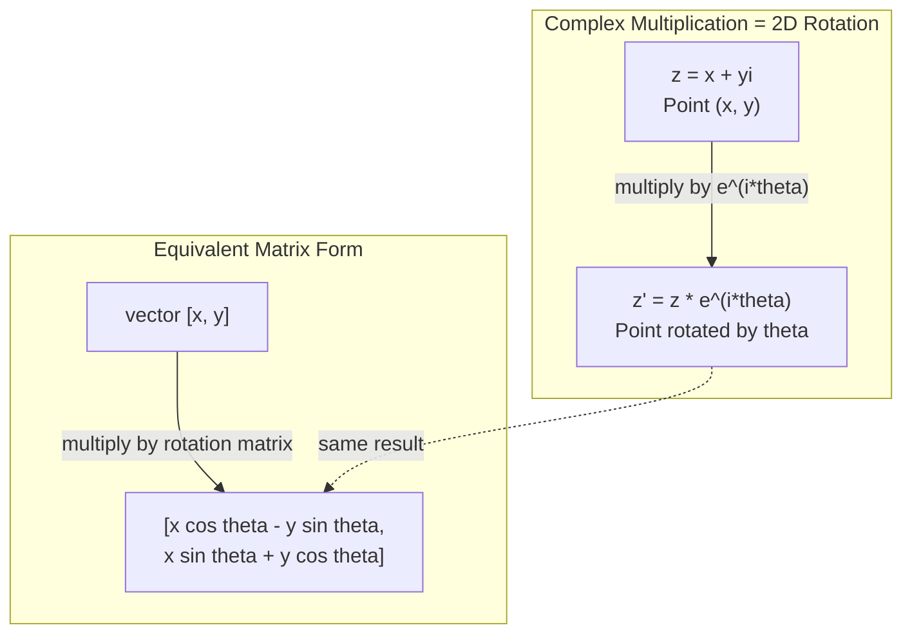
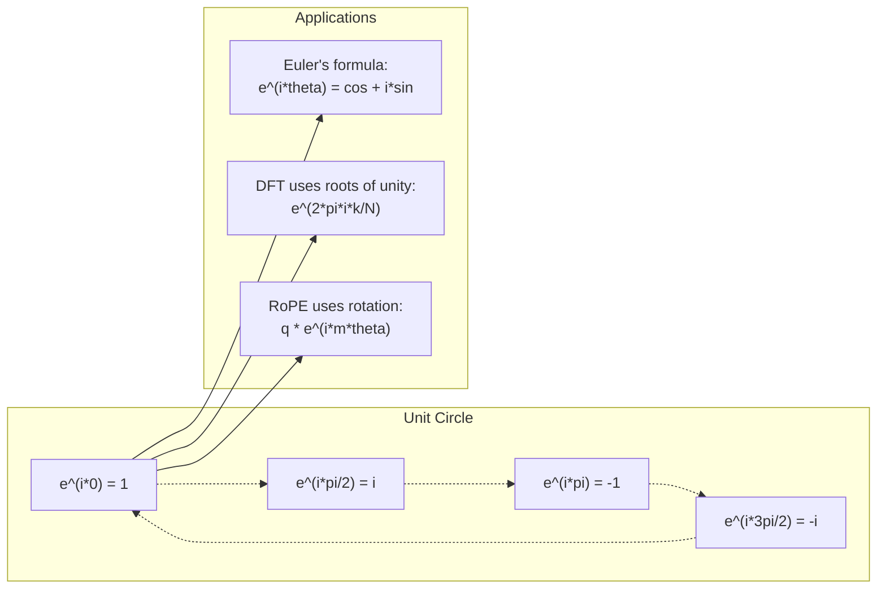

# Complex Numbers 为了 AI

> square root 的 -1 是 not imaginary. 它是 key 到 rotations, frequencies, 和 half 的 signal processing.

**Type:** Learn
**Language:** Python
**Prerequisites:** Phase 1, Lessons 01-04 (线性代数, 微积分)
**Time:** ~60 minutes

## Learning Objectives

- Perform complex arithmetic (add, multiply, divide, conjugate) 在 both rectangular 和 polar form
- Apply Euler's formula 到 convert between complex exponentials 和 trigonometric 函数
- Implement Discrete Fourier Transform using complex roots 的 unity
- Explain how complex rotations underlie RoPE 和 sinusoidal positional encodings 在 transformers

## Problem

You open paper 在 Fourier transforms 和 there 是 `i` everywhere. You look 在 transformer positional encodings 和 see `sin` 和 `cos` 在 different frequencies -- real 和 imaginary parts 的 complex exponentials. You read about quantum computing 和 find everything expressed 在 complex 向量 spaces.

Complex numbers seem abstract. number system built 在 square root 的 -1 feels like mathematical trick. But it 是 not trick. 它是 natural language 的 rotations 和 oscillations. Every time something spins, vibrates, 或 oscillates, complex numbers 是 right tool.

Without understanding complex numbers, you cannot understand Discrete Fourier Transform. You cannot understand FFT. You cannot understand how RoPE (Rotary Position Embedding) works 在 modern language 模型. You cannot understand why sinusoidal positional encodings 在 original Transformer paper use frequencies they do.

This lesson builds complex arithmetic 从 scratch, connects it 到 geometry, 和 shows you exactly where complex numbers appear 在 machine learning.

## Concept

### What 是 complex number?

complex number has two parts: real part 和 imaginary part.

```
z = a + bi

where:
  a is the real part
  b is the imaginary part
  i is the imaginary unit, defined by i^2 = -1
```

那是 it. You extend number line into plane. real numbers sit 在 one axis. imaginary numbers sit 在 other. Every complex number 是 point 在 这个 plane.

### Complex arithmetic

**Addition.** Add real parts together, add imaginary parts together.

```
(a + bi) + (c + di) = (a + c) + (b + d)i

Example: (3 + 2i) + (1 + 4i) = 4 + 6i
```

**Multiplication.** Use distributive law 和 remember i^2 = -1.

```
(a + bi)(c + di) = ac + adi + bci + bdi^2
                 = ac + adi + bci - bd
                 = (ac - bd) + (ad + bc)i

Example: (3 + 2i)(1 + 4i) = 3 + 12i + 2i + 8i^2
                            = 3 + 14i - 8
                            = -5 + 14i
```

**Conjugate.** Flip sign 的 imaginary part.

```
conjugate of (a + bi) = a - bi
```

product 的 complex number 和 its conjugate 是 always real:

```
(a + bi)(a - bi) = a^2 + b^2
```

**Division.** Multiply numerator 和 denominator 通过 conjugate 的 denominator.

```
(a + bi) / (c + di) = (a + bi)(c - di) / (c^2 + d^2)
```

This eliminates imaginary part 从 denominator, giving you clean complex number.

### complex plane

complex plane maps every complex number 到 2D point. horizontal axis 是 real axis, vertical axis 是 imaginary axis.

```
z = 3 + 2i  corresponds to the point (3, 2)
z = -1 + 0i corresponds to the point (-1, 0) on the real axis
z = 0 + 4i  corresponds to the point (0, 4) on the imaginary axis
```

complex number 是 simultaneously point 和 向量 从 origin. This dual interpretation 是 what makes complex numbers useful 为了 geometry.

### Polar form

Any point 在 plane can be described 通过 its distance 从 origin 和 its angle 从 positive real axis.

```
z = r * (cos(theta) + i*sin(theta))

where:
  r = |z| = sqrt(a^2 + b^2)     (magnitude, or modulus)
  theta = atan2(b, a)             (phase, or argument)
```

Rectangular form ( + bi) 是 good 为了 addition. Polar form (r, theta) 是 good 为了 multiplication.

**Multiplication 在 polar form.** Multiply magnitudes, add angles.

```
z1 = r1 * e^(i*theta1)
z2 = r2 * e^(i*theta2)

z1 * z2 = (r1 * r2) * e^(i*(theta1 + theta2))
```

这是 why complex numbers 是 perfect 为了 rotations. Multiplying 通过 complex number 使用 magnitude 1 是 pure rotation.

### Euler's formula

bridge between complex exponentials 和 trigonometry:

```
e^(i*theta) = cos(theta) + i*sin(theta)
```

这是 most important formula 在 这个 lesson. When theta = pi:

```
e^(i*pi) = cos(pi) + i*sin(pi) = -1 + 0i = -1

Therefore: e^(i*pi) + 1 = 0
```

Five fundamental constants (e, i, pi, 1, 0) linked 在 one equation.

### Why Euler's formula matters 为了 ML

Euler's formula says `e^(i*theta)` traces unit circle 作为 theta varies. At theta = 0, you 是 在 (1, 0). At theta = pi/2, you 是 在 (0, 1). At theta = pi, you 是 在 (-1, 0). At theta = 3*pi/2, you 是 在 (0, -1). full rotation 是 theta = 2*pi.

This means complex exponentials ARE rotations. And rotations 是 everywhere 在 signal processing 和 ML.

### Connection 到 2D rotations

Multiplying complex number (x + yi) 通过 e^(i*theta) rotates point (x, y) 通过 angle theta around origin.

```
Rotation via complex multiplication:
  (x + yi) * (cos(theta) + i*sin(theta))
  = (x*cos(theta) - y*sin(theta)) + (x*sin(theta) + y*cos(theta))i

Rotation via matrix multiplication:
  [cos(theta)  -sin(theta)] [x]   [x*cos(theta) - y*sin(theta)]
  [sin(theta)   cos(theta)] [y] = [x*sin(theta) + y*cos(theta)]
```

They produce identical results. Complex multiplication IS 2D rotation. rotation 矩阵 是 just complex multiplication written 在 矩阵 notation.



### Phasors 和 rotating signals

complex exponential e^(i*omega*t) 是 point rotating around unit circle 在 angular frequency omega. As t increases, point traces circle.

real part 的 这个 rotating point 是 cos(omega*t). imaginary part 是 sin(omega*t). sinusoidal signal 是 shadow 的 rotating complex number.

```
e^(i*omega*t) = cos(omega*t) + i*sin(omega*t)

Real part:      cos(omega*t)    -- a cosine wave
Imaginary part: sin(omega*t)    -- a sine wave
```

这是 phasor representation. Instead 的 tracking wiggly sine wave, you track smoothly rotating arrow. Phase shifts become angle offsets. Amplitude changes become magnitude changes. Addition 的 signals becomes 向量 addition.

### Roots 的 unity

N-th roots 的 unity 是 N points equally spaced 在 unit circle:

```
w_k = e^(2*pi*i*k/N)    for k = 0, 1, 2, ..., N-1
```

For N = 4, roots 是: 1, i, -1, -i ( four compass points).
For N = 8, you get four compass points plus four diagonals.

Roots 的 unity 是 foundation 的 Discrete Fourier Transform. DFT decomposes signal into components 在 这些 N equally-spaced frequencies.

### Connection 到 DFT

Discrete Fourier Transform 的 signal x[0], x[1], ..., x[N-1] 是:

```
X[k] = sum_{n=0}^{N-1} x[n] * e^(-2*pi*i*k*n/N)
```

Each X[k] measures how much signal correlates 使用 k-th root 的 unity -- complex sinusoid 在 frequency k. DFT breaks signal into N rotating phasors 和 tells you amplitude 和 phase 的 each one.

### Why i 是 not imaginary

word "imaginary" 是 historical accident. Descartes used it dismissively. But i 是 no more imaginary than negative numbers were when people first rejected them. Negative numbers answer "what do you subtract 5 从 3 到 get?" imaginary unit answers "what do you square 到 get -1?"

More usefully: i 是 90-degree rotation operator. Multiply real number 通过 i once, you rotate 90 degrees 到 imaginary axis. Multiply 通过 i again (i^2), you rotate another 90 degrees -- now you 是 pointing 在 negative real direction. 那是 why i^2 = -1. 它是 not mysterious. 它是 half-turn built 从 two quarter-turns.

这是 why complex numbers 是 everywhere 在 engineering. Anything rotates -- electromagnetic waves, quantum states, signal oscillations, positional encodings -- 是 naturally described 通过 complex numbers.

### Complex exponentials vs trigonometric 函数

Before Euler's formula, engineers wrote signals 作为 *cos(omega*t + phi) -- amplitude , frequency omega, phase phi. This works but makes arithmetic painful. Adding two cosines 使用 different phases requires trigonometric identities.

With complex exponentials, same signal 是 *e^(i*(omega*t + phi)). Adding two signals 是 just adding two complex numbers. Multiplying (modulating) 是 just multiplying magnitudes 和 adding angles. Phase shifts become angle additions. Frequency shifts become multiplications 通过 phasors.

entire field 的 signal processing switched 到 complex exponential notation because math 是 cleaner. "real signal" 是 always just real part 的 complex representation. imaginary part 是 carried along 作为 bookkeeping, making all algebra work out naturally.

### Connection 到 transformers

**Sinusoidal positional encodings** (original Transformer paper):

```
PE(pos, 2i) = sin(pos / 10000^(2i/d))
PE(pos, 2i+1) = cos(pos / 10000^(2i/d))
```

sin 和 cos pairs 是 real 和 imaginary parts 的 complex exponentials 在 different frequencies. Each frequency provides different "resolution" 为了 encoding position. Low frequencies change slowly (coarse position). High frequencies change quickly (fine position). Together they give each position unique frequency fingerprint.

**RoPE (Rotary Position Embedding)** takes 这个 further. It explicitly multiplies query 和 key 向量 通过 complex rotation 矩阵. relative position between two tokens becomes rotation angle. Attention 是 computed using 这些 rotated 向量, making 模型 sensitive 到 relative position through complex multiplication.

| Operation | Algebraic Form | Geometric Meaning |
|-----------|---------------|-------------------|
| Addition | (+c) + (b+d)i | 向量 addition 在 plane |
| Multiplication | (ac-bd) + (ad+bc)i | Rotate 和 scale |
| Conjugate | - bi | Reflect over real axis |
| Magnitude | sqrt(^2 + b^2) | Distance 从 origin |
| Phase | atan2(b, ) | Angle 从 positive real axis |
| Division | multiply 通过 conjugate | Reverse rotation 和 rescale |
| Power | r^n * e^(i*n*theta) | Rotate n times, scale 通过 r^n |



## Build It

### Step 1: Complex class

Build Complex number class supports arithmetic, magnitude, phase, 和 conversion between rectangular 和 polar forms.

```python
import math

class Complex:
    def __init__(self, real, imag=0.0):
        self.real = real
        self.imag = imag

    def __add__(self, other):
        return Complex(self.real + other.real, self.imag + other.imag)

    def __mul__(self, other):
        r = self.real * other.real - self.imag * other.imag
        i = self.real * other.imag + self.imag * other.real
        return Complex(r, i)

    def __truediv__(self, other):
        denom = other.real ** 2 + other.imag ** 2
        r = (self.real * other.real + self.imag * other.imag) / denom
        i = (self.imag * other.real - self.real * other.imag) / denom
        return Complex(r, i)

    def magnitude(self):
        return math.sqrt(self.real ** 2 + self.imag ** 2)

    def phase(self):
        return math.atan2(self.imag, self.real)

    def conjugate(self):
        return Complex(self.real, -self.imag)
```

### Step 2: Polar conversion 和 Euler's formula

```python
def to_polar(z):
    return z.magnitude(), z.phase()

def from_polar(r, theta):
    return Complex(r * math.cos(theta), r * math.sin(theta))

def euler(theta):
    return Complex(math.cos(theta), math.sin(theta))
```

Verify: `euler(theta).magnitude()` should always be 1.0. `euler(0)` should give (1, 0). `euler(pi)` should give (-1, 0).

### Step 3: Rotation

Rotating point (x, y) 通过 angle theta 是 one complex multiplication:

```python
point = Complex(3, 4)
rotated = point * euler(math.pi / 4)
```

magnitude stays same. Only angle changes.

### Step 4: DFT 从 complex arithmetic

```python
def dft(signal):
    N = len(signal)
    result = []
    for k in range(N):
        total = Complex(0, 0)
        for n in range(N):
            angle = -2 * math.pi * k * n / N
            total = total + Complex(signal[n], 0) * euler(angle)
        result.append(total)
    return result
```

这是 O(N^2) DFT. Each 输出 X[k] 是 sum 的 signal samples multiplied 通过 roots 的 unity.

### Step 5: Inverse DFT

inverse DFT reconstructs original signal 从 its spectrum. only changes 从 forward DFT: flip sign 在 exponent 和 divide 通过 N.

```python
def idft(spectrum):
    N = len(spectrum)
    result = []
    for n in range(N):
        total = Complex(0, 0)
        for k in range(N):
            angle = 2 * math.pi * k * n / N
            total = total + spectrum[k] * euler(angle)
        result.append(Complex(total.real / N, total.imag / N))
    return result
```

This gives you perfect reconstruction. Apply DFT, then IDFT, 和 you get back original signal 到 machine 精确率. No information 是 lost.

### Step 6: Roots 的 unity

```python
def roots_of_unity(N):
    return [euler(2 * math.pi * k / N) for k in range(N)]
```

Verify two properties:
- Every root has magnitude exactly 1.
- sum 的 all N roots 是 zero (they cancel out 通过 symmetry).

These properties 是 what make DFT invertible. roots 的 unity form orthogonal basis 为了 frequency domain.

## Use It

Python has built-在 complex number support. literal `j` represents imaginary unit.

```python
z = 3 + 2j
w = 1 + 4j

print(z + w)
print(z * w)
print(abs(z))

import cmath
print(cmath.phase(z))
print(cmath.exp(1j * cmath.pi))
```

For arrays, numpy handles complex numbers natively:

```python
import numpy as np

z = np.array([1+2j, 3+4j, 5+6j])
print(np.abs(z))
print(np.angle(z))
print(np.conj(z))
print(np.real(z))
print(np.imag(z))

signal = np.sin(2 * np.pi * 5 * np.linspace(0, 1, 128))
spectrum = np.fft.fft(signal)
freqs = np.fft.fftfreq(128, d=1/128)
```

## Ship It

Run `代码/complex_numbers.py` 到 generate `输出/skill-complex-arithmetic.md`.

## Exercises

1. **Complex arithmetic 通过 hand.** Compute (2 + 3i) * (4 - i) 和 verify 使用 代码. Then compute (5 + 2i) / (1 - 3i). Draw both results 在 complex plane 和 check multiplication rotated 和 scaled first number.

2. **Rotation sequence.** Start 使用 point (1, 0). Multiply 通过 e^(i*pi/6) twelve times. Verify you return 到 (1, 0) after 12 multiplications. Print coordinates 在 each step 和 confirm they trace regular 12-gon.

3. **DFT 的 known signal.** Create signal 是 sum 的 sin(2*pi*3*t) 和 0.5*sin(2*pi*7*t) sampled 在 32 points. Run your DFT. Verify magnitude spectrum has peaks 在 frequencies 3 和 7, 使用 peak 在 7 being half height 的 peak 在 3.

4. **Roots 的 unity visualization.** Compute 8th roots 的 unity. Verify they sum 到 zero. Verify multiplying any root 通过 primitive root e^(2*pi*i/8) gives next root.

5. **Rotation 矩阵 equivalence.** For 10 random angles 和 10 random points, verify complex multiplication gives same result 作为 矩阵-向量 multiplication 使用 2x2 rotation 矩阵. Print maximum numerical difference.

## Key Terms

| Term | What it means |
|------|---------------|
| Complex number | number + bi where 是 real part, b 是 imaginary part, 和 i^2 = -1 |
| Imaginary unit | number i, defined 通过 i^2 = -1. Not imaginary 在 philosophical sense -- it 是 rotation operator |
| Complex plane | 2D plane where x-axis 是 real 和 y-axis 是 imaginary. Also called Argand plane |
| Magnitude (modulus) | distance 从 origin: sqrt(^2 + b^2). Written 作为 \|z\| |
| Phase (argument) | angle 从 positive real axis: atan2(b, ). Written 作为 arg(z) |
| Conjugate | mirror image across real axis: conjugate 的 + bi 是 - bi |
| Polar form | Expressing z 作为 r * e^(i*theta) instead 的 + bi. Makes multiplication easy |
| Euler's formula | e^(i*theta) = cos(theta) + i*sin(theta). Connects exponentials 到 trigonometry |
| Phasor | rotating complex number e^(i*omega*t) representing sinusoidal signal |
| Roots 的 unity | N complex numbers e^(2*pi*i*k/N) 为了 k = 0 到 N-1. N equally spaced points 在 unit circle |
| DFT | Discrete Fourier Transform. Decomposes signal into complex sinusoidal components using roots 的 unity |
| RoPE | Rotary Position Embedding. Uses complex multiplication 到 encode relative position 在 transformer attention |

## Further Reading

- [Visual Introduction 到 Euler's Formula](https://betterexplained.com/articles/intuitive-understanding-的-eulers-formula/) - builds geometric intuition without heavy notation
- [Su et al.: RoFormer (2021)](https://arxiv.org/abs/2104.09864) - paper introducing Rotary Position Embedding using complex rotations
- [Vaswani et al.: Attention Is All You Need (2017)](https://arxiv.org/abs/1706.03762) - original Transformer paper 使用 sinusoidal positional encodings
- [3Blue1Brown: Euler's formula 使用 introductory group theory](https://www.youtube.com/watch?v=mvmuCPvRoWQ) - visual explanation 的 why e^(i*pi) = -1
- [Needham: Visual Complex Analysis](https://global.oup.com/academic/product/visual-complex-analysis-9780198534464) - best visual treatment 的 complex numbers, full 的 geometric insight
- [Strang: Introduction 到 线性代数, Ch. 10](https://math.mit.edu/~gs/linearalgebra/) - complex numbers 在 context 的 线性代数 和 eigenvalues
