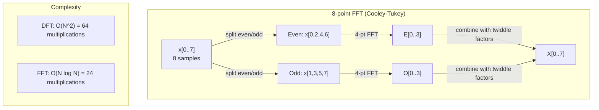
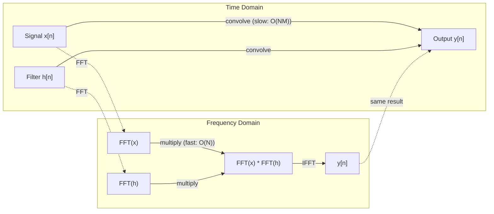

# Fourier Transform

> Every signal 是 sum 的 sine waves. Fourier transform tells you which ones.

**Type:** Build
**Language:** Python
**Prerequisites:** Phase 1, Lessons 01-04, 19 (complex numbers)
**Time:** ~90 minutes

## Learning Objectives

- Implement DFT 从 scratch 和 verify it against O(N log N) Cooley-Tukey FFT
- Interpret frequency coefficients: extract amplitude, phase, 和 power spectrum 从 signal
- Apply convolution theorem 到 perform convolution via FFT multiplication
- Connect Fourier frequency decomposition 到 transformer positional encodings 和 CNN convolution 层

## Problem

audio recording 是 sequence 的 pressure measurements over time. stock price 是 sequence 的 values over days. image 是 grid 的 pixel intensities over space. All 的 这些 是 数据 在 time domain (或 space domain). You see values changing over some index.

But many patterns 是 invisible 在 time domain. Is 这个 audio signal pure tone 或 chord? Does 这个 stock price have weekly cycle? Does 这个 image have repeating texture? These questions 是 about frequency content, 和 time domain hides it.

Fourier transform converts 数据 从 time domain 到 frequency domain. It takes signal 和 decomposes it into sine waves 的 different frequencies. Each sine wave has amplitude (how strong it 是) 和 phase (where it starts). Fourier transform tells you both.

This matters 为了 ML because frequency-domain thinking appears everywhere. Convolutional 神经网络 perform convolution, which 是 multiplication 在 frequency domain. Transformer positional encodings use frequency decomposition 到 represent position. Audio 模型 (speech recognition, music generation) operate 在 spectrograms -- frequency representations 的 sound. Time series 模型 look 为了 periodic patterns. Understanding Fourier transform gives you vocabulary 到 work 使用 all 的 这些.

## Concept

### DFT definition

Given N samples x[0], x[1], ..., x[N-1], Discrete Fourier Transform produces N frequency coefficients X[0], X[1], ..., X[N-1]:

```
X[k] = sum_{n=0}^{N-1} x[n] * e^(-2*pi*i*k*n/N)

for k = 0, 1, ..., N-1
```

Each X[k] 是 complex number. Its magnitude |X[k]| tells you amplitude 的 frequency k. Its phase angle(X[k]) tells you phase offset 的 frequency.

key insight: `e^(-2*pi*i*k*n/N)` 是 rotating phasor 在 frequency k. DFT computes correlation between signal 和 each 的 N equally-spaced frequencies. If signal contains energy 在 frequency k, correlation 是 large. If not, it 是 near zero.

### What each coefficient means

**X[0]: DC component.** 这是 sum 的 all samples -- proportional 到 mean. It represents constant (zero-frequency) offset 的 signal.

```
X[0] = sum_{n=0}^{N-1} x[n] * e^0 = sum of all samples
```

**X[k] 为了 1 <= k <= N/2: positive frequencies.** X[k] represents frequency k cycles per N samples. Higher k means higher frequency (faster oscillation).

**X[N/2]: Nyquist frequency.** highest frequency you can represent 使用 N samples. Above 这个, you get aliasing -- high frequencies masquerading 作为 low ones.

**X[k] 为了 N/2 < k < N: negative frequencies.** For real-valued signals, X[N-k] = conj(X[k]). negative frequencies 是 mirror images 的 positive ones. 这是 why useful information 是 在 first N/2 + 1 coefficients.

### Inverse DFT

inverse DFT reconstructs original signal 从 its frequency coefficients:

```
x[n] = (1/N) * sum_{k=0}^{N-1} X[k] * e^(2*pi*i*k*n/N)

for n = 0, 1, ..., N-1
```

only differences 从 forward DFT: sign 在 exponent 是 positive (not negative), 和 there 是 1/N normalization factor.

inverse DFT 是 perfect reconstruction. No information 是 lost. 你可以 go 从 time domain 到 frequency domain 和 back without any error. DFT 是 change 的 basis -- it re-expresses same information 在 different coordinate system.

### FFT: making it fast

DFT 作为 defined above 是 O(N^2): 为了 each 的 N 输出 coefficients, you sum over N 输入 samples. For N = 1 million, 是 10^12 operations.

Fast Fourier Transform (FFT) computes same result 在 O(N log N). For N = 1 million, 是 about 20 million operations instead 的 trillion. 这是 what makes frequency analysis practical.

Cooley-Tukey 算法 ( most common FFT) works 通过 divide 和 conquer:

1. Split signal into even-indexed 和 odd-indexed samples.
2. Compute DFT 的 each half recursively.
3. Combine two half-size DFTs using "twiddle factors" e^(-2*pi*i*k/N).

```
X[k] = E[k] + e^(-2*pi*i*k/N) * O[k]          for k = 0, ..., N/2 - 1
X[k + N/2] = E[k] - e^(-2*pi*i*k/N) * O[k]    for k = 0, ..., N/2 - 1

where E = DFT of even-indexed samples
      O = DFT of odd-indexed samples
```

symmetry means each level 的 recursion does O(N) work, 和 there 是 log2(N) levels. Total: O(N log N).



FFT requires signal length 到 be power 的 2. In practice, signals 是 zero-padded 到 next power 的 2.

### Spectral analysis

**power spectrum** 是 |X[k]|^2 -- squared magnitude 的 each frequency coefficient. It shows how much energy 是 在 each frequency.

**phase spectrum** 是 angle(X[k]) -- phase offset 的 each frequency. For most analysis tasks, you care about power spectrum 和 ignore phase.

```
Power at frequency k:  P[k] = |X[k]|^2 = X[k].real^2 + X[k].imag^2
Phase at frequency k:  phi[k] = atan2(X[k].imag, X[k].real)
```

### Frequency resolution

frequency resolution 的 DFT depends 在 number 的 samples N 和 sampling rate fs.

```
Frequency of bin k:      f_k = k * fs / N
Frequency resolution:    delta_f = fs / N
Maximum frequency:       f_max = fs / 2  (Nyquist)
```

To resolve two frequencies 是 close together, you need more samples. To capture high frequencies, you need higher sampling rate.

### convolution theorem

这是 one 的 most important results 在 signal processing 和 directly relevant 到 CNNs.

**Convolution 在 time domain equals pointwise multiplication 在 frequency domain.**

```
x * h = IFFT(FFT(x) . FFT(h))

where * is convolution and . is element-wise multiplication
```

Why 这个 matters:

- Direct convolution 的 two signals 的 length N 和 M takes O(N*M) operations.
- FFT-based convolution takes O(N log N): transform both, multiply, transform back.
- For large kernels, FFT convolution 是 dramatically faster.
- 这是 exactly what happens 在 convolutional 层 使用 large receptive fields.

Note: DFT computes circular convolution ( signal wraps around). For linear convolution (no wraparound), zero-pad both signals 到 length N + M - 1 before computing.



### Windowing

DFT assumes signal 是 periodic -- it treats N samples 作为 one period 的 infinitely repeating signal. If signal does not start 和 end 在 same value, 这个 creates discontinuity 在 boundary, which shows up 作为 spurious high-frequency content. 这是 called spectral leakage.

Windowing reduces leakage 通过 tapering signal 到 zero 在 both ends before computing DFT.

Common windows:

| Window | Shape | Main lobe width | Side lobe level | Use case |
|--------|-------|----------------|-----------------|----------|
| Rectangular | Flat (no window) | Narrowest | Highest (-13 dB) | When signal 是 exactly periodic 在 N samples |
| Hann | Raised cosine | Moderate | Low (-31 dB) | General purpose spectral analysis |
| Hamming | Modified cosine | Moderate | Lower (-42 dB) | Audio processing, speech analysis |
| Blackman | Triple cosine | Wide | Very low (-58 dB) | When side lobe suppression 是 critical |

```
Hann window:    w[n] = 0.5 * (1 - cos(2*pi*n / (N-1)))
Hamming window: w[n] = 0.54 - 0.46 * cos(2*pi*n / (N-1))
```

Apply window 通过 multiplying it element-wise 使用 signal before DFT: `X = DFT(x * w)`.

### DFT properties

| Property | Time Domain | Frequency Domain |
|----------|-------------|-----------------|
| Linearity | *x + b*y | *X + b*Y |
| Time shift | x[n - k] | X[f] * e^(-2*pi*i*f*k/N) |
| Frequency shift | x[n] * e^(2*pi*i*f0*n/N) | X[f - f0] |
| Convolution | x * h | X * H (pointwise) |
| Multiplication | x * h (pointwise) | X * H (circular convolution, scaled 通过 1/N) |
| Parseval's theorem | sum \|x[n]\|^2 | (1/N) * sum \|X[k]\|^2 |
| Conjugate symmetry (real 输入) | x[n] real | X[k] = conj(X[N-k]) |

Parseval's theorem says total energy 是 same 在 both domains. Energy 是 conserved through transform.

### Connection 到 positional encodings

original Transformer uses sinusoidal positional encodings:

```
PE(pos, 2i)   = sin(pos / 10000^(2i/d_model))
PE(pos, 2i+1) = cos(pos / 10000^(2i/d_model))
```

Each dimension pair (2i, 2i+1) oscillates 在 different frequency. frequencies 是 geometrically spaced 从 high (dimension 0,1) 到 low (last dimensions). This gives each position unique pattern across all frequency bands -- similar 到 how Fourier coefficients uniquely identify signal.

key properties 这个 provides:

- **Uniqueness:** No two positions have same encoding.
- **Bounded values:** sin 和 cos 是 always 在 [-1, 1].
- **Relative position:** encoding 的 position p+k can be expressed 作为 linear 函数 的 encoding 在 position p. 模型 can learn 到 attend 到 relative positions.

### Connection 到 CNNs

convolution 层 applies learned filter (kernel) 到 输入 通过 sliding it across signal 或 image. Mathematically, 这个 是 convolution operation.

By convolution theorem, 这个 是 equivalent 到:
1. FFT 输入
2. FFT kernel
3. Multiply 在 frequency domain
4. IFFT result

Standard CNN implementations use direct convolution (faster 为了 small 3x3 kernels). But 为了 large kernels 或 global convolution, FFT-based approaches 是 significantly faster. Some architectures (like FNet) replace attention entirely 使用 FFT, achieving competitive 准确率 使用 O(N log N) instead 的 O(N^2) complexity.

### Spectrograms 和 Short-Time Fourier Transform

single FFT gives you frequency content 的 entire signal, but tells you nothing about when 那些 frequencies occur. chirp ( signal whose frequency increases over time) 和 chord (all frequencies present simultaneously) can have same magnitude spectrum.

Short-Time Fourier Transform (STFT) solves 这个 通过 computing FFTs 在 overlapping windows 的 signal. result 是 spectrogram: 2D representation 使用 time 在 one axis 和 frequency 在 other. intensity 在 each point shows energy 在 frequency 在 time.

```
STFT procedure:
1. Choose a window size (e.g., 1024 samples)
2. Choose a hop size (e.g., 256 samples -- 75% overlap)
3. For each window position:
   a. Extract the windowed segment
   b. Apply a Hann/Hamming window
   c. Compute FFT
   d. Store the magnitude spectrum as one column of the spectrogram
```

Spectrograms 是 standard 输入 representation 为了 audio ML 模型. Speech recognition 模型 (Whisper, DeepSpeech) operate 在 mel-spectrograms -- spectrograms 使用 frequencies mapped 到 mel scale, which better matches human pitch perception.

### Aliasing

If signal contains frequencies above fs/2 ( Nyquist frequency), sampling 在 rate fs will create aliased copies. 90 Hz signal sampled 在 100 Hz looks identical 到 10 Hz signal. 有 no way 到 distinguish them 从 samples alone.

```
Example:
  True signal: 90 Hz sine wave
  Sampling rate: 100 Hz
  Apparent frequency: 100 - 90 = 10 Hz

  The samples from the 90 Hz signal at 100 Hz sampling rate
  are identical to the samples from a 10 Hz signal.
  No amount of math can recover the original 90 Hz.
```

这是 why analog-到-digital converters include anti-aliasing filters remove frequencies above Nyquist before sampling. In ML, aliasing appears when downsampling 特征 maps without proper low-pass filtering -- some architectures address 这个 使用 anti-aliased pooling 层.

### Zero-padding does not increase resolution

common misconception: zero-padding signal before FFT improves frequency resolution. It does not. Zero-padding interpolates between existing frequency bins, giving you smoother-looking spectrum. But it cannot reveal frequency detail was not present 在 original samples.

True frequency resolution depends only 在 observation time T = N / fs. To resolve two frequencies separated 通过 delta_f, you need 在 least T = 1 / delta_f seconds 的 数据. No amount 的 zero-padding changes 这个 fundamental limit.

## Build It

### Step 1: DFT 从 scratch

O(N^2) DFT follows directly 从 definition.

```python
import math

class Complex:
    ...

def dft(x):
    N = len(x)
    result = []
    for k in range(N):
        total = Complex(0, 0)
        for n in range(N):
            angle = -2 * math.pi * k * n / N
            w = Complex(math.cos(angle), math.sin(angle))
            xn = x[n] if isinstance(x[n], Complex) else Complex(x[n])
            total = total + xn * w
        result.append(total)
    return result
```

### Step 2: Inverse DFT

Same structure, positive exponent, divide 通过 N.

```python
def idft(X):
    N = len(X)
    result = []
    for n in range(N):
        total = Complex(0, 0)
        for k in range(N):
            angle = 2 * math.pi * k * n / N
            w = Complex(math.cos(angle), math.sin(angle))
            total = total + X[k] * w
        result.append(Complex(total.real / N, total.imag / N))
    return result
```

### Step 3: FFT (Cooley-Tukey)

recursive FFT requires power-的-2 length. Split into even 和 odd, recurse, combine 使用 twiddle factors.

```python
def fft(x):
    N = len(x)
    if N <= 1:
        return [x[0] if isinstance(x[0], Complex) else Complex(x[0])]
    if N % 2 != 0:
        return dft(x)

    even = fft([x[i] for i in range(0, N, 2)])
    odd = fft([x[i] for i in range(1, N, 2)])

    result = [Complex(0)] * N
    for k in range(N // 2):
        angle = -2 * math.pi * k / N
        twiddle = Complex(math.cos(angle), math.sin(angle))
        t = twiddle * odd[k]
        result[k] = even[k] + t
        result[k + N // 2] = even[k] - t
    return result
```

### Step 4: Spectral analysis helpers

```python
def power_spectrum(X):
    return [xk.real ** 2 + xk.imag ** 2 for xk in X]

def convolve_fft(x, h):
    N = len(x) + len(h) - 1
    padded_N = 1
    while padded_N < N:
        padded_N *= 2

    x_padded = x + [0.0] * (padded_N - len(x))
    h_padded = h + [0.0] * (padded_N - len(h))

    X = fft(x_padded)
    H = fft(h_padded)

    Y = [xk * hk for xk, hk in zip(X, H)]

    y = idft(Y)
    return [y[n].real for n in range(N)]
```

## Use It

For real work, use numpy's FFT which 是 backed 通过 highly optimized C libraries.

```python
import numpy as np

signal = np.sin(2 * np.pi * 5 * np.arange(256) / 256)
spectrum = np.fft.fft(signal)
freqs = np.fft.fftfreq(256, d=1/256)

power = np.abs(spectrum) ** 2

positive_freqs = freqs[:len(freqs)//2]
positive_power = power[:len(power)//2]
```

For windowing 和 more advanced spectral analysis:

```python
from scipy.signal import windows, stft

window = windows.hann(256)
windowed = signal * window
spectrum = np.fft.fft(windowed)
```

For convolution:

```python
from scipy.signal import fftconvolve

result = fftconvolve(signal, kernel, mode='full')
```

For spectrograms:

```python
from scipy.signal import stft

frequencies, times, Zxx = stft(signal, fs=sample_rate, nperseg=256)
spectrogram = np.abs(Zxx) ** 2
```

spectrogram 矩阵 has shape (n_frequencies, n_time_frames). Each column 是 power spectrum 在 one time window. 这是 what audio ML 模型 consume 作为 输入.

## Ship It

Run `代码/fourier.py` 到 generate `输出/prompt-spectral-analyzer.md`.

## Exercises

1. **Pure tone identification.** Create signal 使用 single sine wave 在 unknown frequency (between 1 和 50 Hz), sampled 在 128 Hz 为了 1 second. Use your DFT 到 identify frequency. Verify answer matches. Now add Gaussian noise 使用 standard deviation 0.5 和 repeat. How does noise affect spectrum?

2. **FFT vs DFT verification.** Generate random signal 的 length 64. Compute both DFT (O(N^2)) 和 FFT. Verify all coefficients match 到 within 1e-10. Time both 函数 在 signals 的 length 256, 512, 1024, 和 2048. Plot ratio 的 DFT time 到 FFT time.

3. **Convolution theorem proof 通过 example.** Create signal x = [1, 2, 3, 4, 0, 0, 0, 0] 和 filter h = [1, 1, 1, 0, 0, 0, 0, 0]. Compute their circular convolution directly (nested loop). Then compute it via FFT (transform, multiply, inverse transform). Verify results match. Now do linear convolution 通过 zero-padding appropriately.

4. **Windowing effects.** Create signal 是 sum 的 two sine waves 在 10 Hz 和 12 Hz (very close). Sample 在 128 Hz 为了 1 second. Compute power spectrum 使用 no window, Hann window, 和 Hamming window. Which window makes it easiest 到 distinguish two peaks? Why?

5. **Positional encoding analysis.** Generate sinusoidal positional encodings 为了 d_model = 128 和 max_pos = 512. For each pair 的 positions (p1, p2), compute dot product 的 their encodings. Show dot product depends only 在 |p1 - p2|, not 在 absolute positions. What happens 到 dot product 作为 distance increases?

## Key Terms

| Term | What it means |
|------|---------------|
| DFT (Discrete Fourier Transform) | Converts N time-domain samples into N frequency-domain coefficients. Each coefficient 是 correlation 使用 complex sinusoid 在 frequency |
| FFT (Fast Fourier Transform) | O(N log N) 算法 到 compute DFT. Cooley-Tukey 算法 splits even/odd indices recursively |
| Inverse DFT | Reconstructs time-domain signal 从 frequency coefficients. Same formula 作为 DFT 使用 flipped exponent sign 和 1/N scaling |
| Frequency bin | Each index k 在 DFT 输出 represents frequency k*fs/N Hz. "bin" 是 discrete frequency slot |
| DC component | X[0], zero-frequency coefficient. Proportional 到 signal mean |
| Nyquist frequency | fs/2, maximum frequency representable 在 sampling rate fs. Frequencies above 这个 alias |
| Power spectrum | \|X[k]\|^2, squared magnitude 的 each frequency coefficient. Shows energy distribution across frequencies |
| Phase spectrum | angle(X[k]), phase offset 的 each frequency component. Often ignored 在 analysis |
| Spectral leakage | Spurious frequency content caused 通过 treating non-periodic signal 作为 periodic. Reduced 通过 windowing |
| Window 函数 | tapering 函数 (Hann, Hamming, Blackman) applied before DFT 到 reduce spectral leakage |
| Twiddle factor | complex exponential e^(-2*pi*i*k/N) used 到 combine sub-DFTs 在 FFT butterfly computation |
| Convolution theorem | Convolution 在 time domain equals pointwise multiplication 在 frequency domain. Fundamental 到 signal processing 和 CNNs |
| Circular convolution | Convolution where signal wraps around. 这是 what DFT naturally computes |
| Linear convolution | Standard convolution without wraparound. Achieved 通过 zero-padding before DFT |
| Parseval's theorem | Total energy 是 preserved through Fourier transform. sum \|x[n]\|^2 = (1/N) sum \|X[k]\|^2 |
| Aliasing | When frequencies above Nyquist appear 作为 lower frequencies due 到 insufficient sampling rate |

## Further Reading

- [Cooley & Tukey: 算法 为了 Machine Calculation 的 Complex Fourier Series (1965)](https://www.ams.org/journals/mcom/1965-19-090/S0025-5718-1965-0178586-1/) - original FFT paper changed computing
- [3Blue1Brown: But what 是 Fourier Transform?](https://www.youtube.com/watch?v=spUNpyF58BY) - best visual introduction 到 Fourier transforms
- [Lee-Thorp et al.: FNet: Mixing Tokens 使用 Fourier Transforms (2021)](https://arxiv.org/abs/2105.03824) - replaces self-attention 使用 FFT 在 transformers
- [Smith: Scientist 和 Engineer's Guide 到 Digital Signal Processing](http://www.dspguide.com/) - free online textbook covering FFT, windowing, 和 spectral analysis 在 depth
- [Vaswani et al.: Attention Is All You Need (2017)](https://arxiv.org/abs/1706.03762) - sinusoidal positional encodings derived 从 Fourier frequency decomposition
- [Radford et al.: Whisper (2022)](https://arxiv.org/abs/2212.04356) - speech recognition using mel-spectrograms 作为 输入 representation
