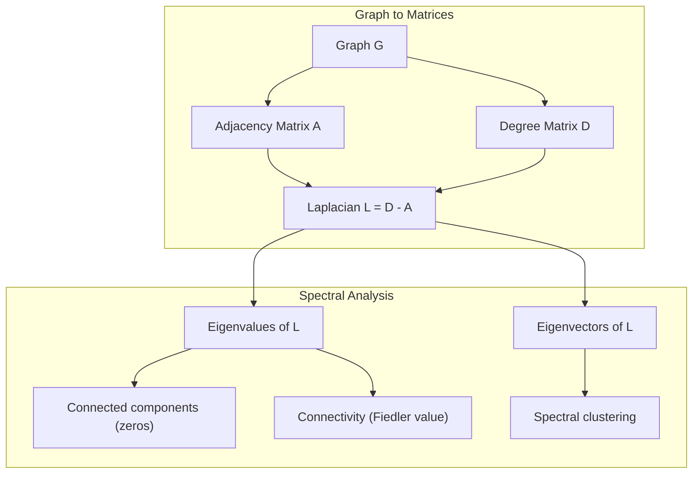
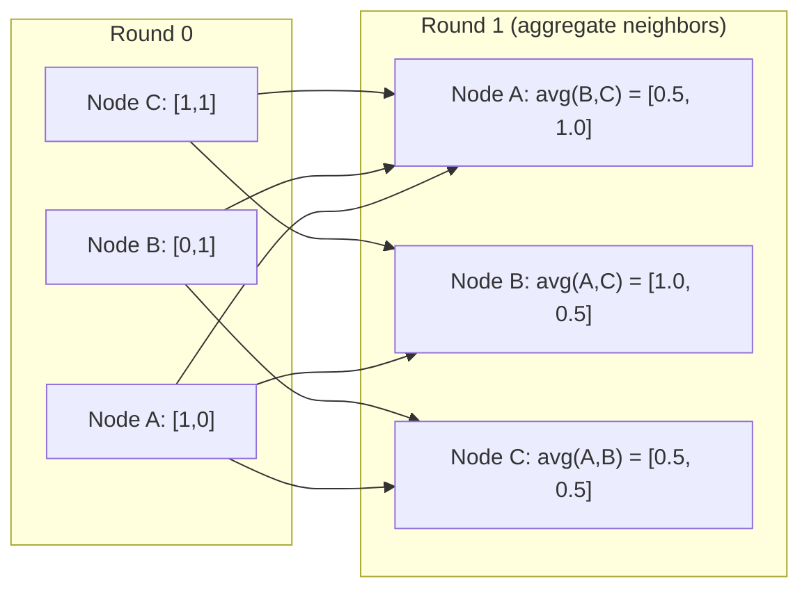

# Graph Theory 为了 Machine Learning

> Graphs 是 数据 structure 的 relationships. If your 数据 has connections, you need graph theory.

**Type:** Build
**Language:** Python
**Prerequisites:** Phase 1, Lessons 01-03 (线性代数, 矩阵)
**Time:** ~90 minutes

## Learning Objectives

- Build graph class 使用 adjacency 矩阵/list representations 和 implement BFS 和 DFS traversals
- Compute graph Laplacian 和 use its eigenvalues 到 detect connected components 和 cluster 节点
- Implement one round 的 GNN-style message passing 作为 normalized adjacency 矩阵 multiplication
- Apply spectral 聚类 到 partition graph using Fiedler 向量

## Problem

Social networks, molecules, knowledge bases, citation networks, road maps -- all 是 graphs. Traditional ML treats 数据 作为 flat tables. Each row 是 independent. Each 特征 是 column. But when structure 的 connections matters, tables fail.

Consider social network. You want 到 predict what product user will buy. Their purchase history matters. But their friends' purchase history matters more. connections carry signal.

Or consider molecule. You want 到 predict if it binds 到 protein. atoms matter, but what really matters 是 how atoms 是 bonded 到 each other. structure 是 数据.

Graph Neural Networks (GNNs) 是 fastest-growing area 在 deep learning. They power drug discovery, social recommendation, fraud detection, 和 knowledge graph reasoning. Every GNN builds 在 same foundation: basic graph theory.

你需要 four things:
1. way 到 represent graphs 作为 矩阵 (so you can multiply them)
2. Traversal 算法 到 explore graph structure
3. Laplacian -- single most important 矩阵 在 spectral graph theory
4. Message passing -- operation makes GNNs work

## Concept

### Graphs: Nodes 和 Edges

graph G = (V, E) consists 的 vertices (节点) V 和 edges E. Each edge connects two 节点.

**Directed vs undirected.** In undirected graph, edge (u, v) means u connects 到 v AND v connects 到 u. In directed graph (digraph), edge (u, v) means u points 到 v, but not necessarily reverse.

**Weighted vs unweighted.** In unweighted graph, edges either exist 或 they don't. In weighted graph, each edge has numerical 权重 -- distance, cost, strength.

| Graph type | Example |
|-----------|---------|
| Undirected, unweighted | Facebook friendship network |
| Directed, unweighted | Twitter follow network |
| Undirected, weighted | Road map (distances) |
| Directed, weighted | Web page links (PageRank scores) |

### Adjacency 矩阵

adjacency 矩阵 是 core representation. For graph 使用 n 节点:

```
A[i][j] = 1    if there is an edge from node i to node j
A[i][j] = 0    otherwise
```

For undirected graphs, 是 symmetric: [i][j] = [j][i]. For weighted graphs, [i][j] = 权重 的 edge (i, j).

**Example -- triangle:**

```
Nodes: 0, 1, 2
Edges: (0,1), (1,2), (0,2)

A = [[0, 1, 1],
     [1, 0, 1],
     [1, 1, 0]]
```

adjacency 矩阵 是 输入 到 every GNN. 矩阵 operations 在 correspond 到 operations 在 graph.

### Degree

degree 的 节点 是 number 的 edges connected 到 it. For directed graphs, you have 在-degree (edges coming 在) 和 out-degree (edges going out).

degree 矩阵 D 是 diagonal:

```
D[i][i] = degree of node i
D[i][j] = 0    for i != j
```

For triangle example: D = diag(2, 2, 2) because every 节点 connects 到 two others.

Degree tells you about 节点 importance. High degree = hub 节点. degree distribution 的 network reveals its structure. Social networks follow power laws (few hubs, many leaf 节点). Random graphs have Poisson-distributed degrees.

### BFS 和 DFS

two fundamental graph traversal 算法. 你需要 both.

**Breadth-First Search (BFS):** Explore all neighbors first, then neighbors' neighbors. Uses queue (FIFO).

```
BFS from node 0:
  Visit 0
  Queue: [1, 2]        (neighbors of 0)
  Visit 1
  Queue: [2, 3]        (add neighbors of 1)
  Visit 2
  Queue: [3]           (neighbors of 2 already visited)
  Visit 3
  Queue: []            (done)
```

BFS finds shortest paths 在 unweighted graphs. distance 从 start 到 any 节点 equals BFS level 在 which 节点 是 first discovered. 这是 why BFS 是 used 为了 hop-count distances 在 social networks.

**Depth-First Search (DFS):** Go 作为 deep 作为 possible before backtracking. Uses stack (LIFO) 或 recursion.

```
DFS from node 0:
  Visit 0
  Stack: [1, 2]        (neighbors of 0)
  Visit 2               (pop from stack)
  Stack: [1, 3]         (add neighbors of 2)
  Visit 3               (pop from stack)
  Stack: [1]
  Visit 1               (pop from stack)
  Stack: []             (done)
```

DFS 是 useful 为了:
- Finding connected components (run DFS 从 unvisited 节点)
- Cycle detection (back edges 在 DFS tree)
- Topological sorting (reverse DFS finish order)

| 算法 | 数据 structure | Finds | Use case |
|-----------|---------------|-------|----------|
| BFS | Queue | Shortest paths | Social network distance, knowledge graph traversal |
| DFS | Stack | Components, cycles | Connectivity, topological sort |

### Graph Laplacian

L = D - . most important 矩阵 在 spectral graph theory.

For triangle:

```
D = [[2, 0, 0],    A = [[0, 1, 1],    L = [[2, -1, -1],
     [0, 2, 0],         [1, 0, 1],         [-1, 2, -1],
     [0, 0, 2]]         [1, 1, 0]]         [-1, -1,  2]]
```

Laplacian has remarkable properties:

1. **L 是 positive semi-definite.** All eigenvalues 是 >= 0.

2. ** number 的 zero eigenvalues equals number 的 connected components.** connected graph has exactly one zero eigenvalue. graph 使用 3 disconnected components has three zero eigenvalues.

3. ** smallest non-zero eigenvalue (Fiedler value) measures connectivity.** large Fiedler value means graph 是 well-connected. small Fiedler value means graph has weak point -- bottleneck.

4. ** eigenvector 的 Fiedler value (Fiedler 向量) reveals best split.** Nodes 使用 positive values go 在 one group, 节点 使用 negative values go 在 other. 这是 spectral 聚类.



### Spectral Properties

eigenvalues 的 adjacency 矩阵 和 Laplacian reveal structural properties without any traversal.

**Spectral 聚类** works like 这个:
1. Compute Laplacian L
2. Find k smallest eigenvectors 的 L (skip first, which 是 all-ones 为了 connected graphs)
3. Use 那些 eigenvectors 作为 new coordinates 为了 each 节点
4. Run k-means 在 那些 coordinates

Why does 这个 work? eigenvectors 的 L encode "smoothest" 函数 在 graph. Nodes 是 well-connected get similar eigenvector values. Nodes separated 通过 bottleneck get different values. eigenvectors naturally separate clusters.

**Random walk connection.** normalized Laplacian relates 到 random walks 在 graph. stationary distribution 的 random walk 是 proportional 到 节点 degree. mixing time (how fast walk converges) depends 在 spectral gap.

### Message Passing

core operation 的 Graph Neural Networks. Each 节点 collects messages 从 its neighbors, aggregates them, 和 updates its own state.

```
h_v^(k+1) = UPDATE(h_v^(k), AGGREGATE({h_u^(k) : u in neighbors(v)}))
```

In simplest form, AGGREGATE = mean, 和 UPDATE = linear transform + activation:

```
h_v^(k+1) = sigma(W * mean({h_u^(k) : u in neighbors(v)}))
```

这是 矩阵 multiplication 在 disguise. If H 是 矩阵 的 all 节点 特征 和 是 adjacency 矩阵:

```
H^(k+1) = sigma(A_norm * H^(k) * W)
```

where A_norm 是 normalized adjacency 矩阵 (each row sums 到 1).

One round 的 message passing lets each 节点 "see" its immediate neighbors. Two rounds let it see neighbors 的 neighbors. K rounds give each 节点 information 从 its K-hop neighborhood.



### Concepts 和 ML Applications

| Concept | ML Application |
|---------|---------------|
| Adjacency 矩阵 | GNN 输入 representation |
| Graph Laplacian | Spectral 聚类, community detection |
| BFS/DFS | Knowledge graph traversal, path finding |
| Degree distribution | 节点 importance, 特征 engineering |
| Message passing | GNN 层 (GCN, GAT, GraphSAGE) |
| Eigenvalues 的 L | Community detection, graph partitioning |
| Spectral 聚类 | Unsupervised 节点 grouping |
| PageRank | 节点 importance, web search |

## Build It

### Step 1: Graph class 从 scratch

```python
class Graph:
    def __init__(self, n_nodes, directed=False):
        self.n = n_nodes
        self.directed = directed
        self.adj = {i: {} for i in range(n_nodes)}

    def add_edge(self, u, v, weight=1.0):
        self.adj[u][v] = weight
        if not self.directed:
            self.adj[v][u] = weight

    def neighbors(self, node):
        return list(self.adj[node].keys())

    def degree(self, node):
        return len(self.adj[node])

    def adjacency_matrix(self):
        import numpy as np
        A = np.zeros((self.n, self.n))
        for u in range(self.n):
            for v, w in self.adj[u].items():
                A[u][v] = w
        return A

    def degree_matrix(self):
        import numpy as np
        D = np.zeros((self.n, self.n))
        for i in range(self.n):
            D[i][i] = self.degree(i)
        return D

    def laplacian(self):
        return self.degree_matrix() - self.adjacency_matrix()
```

adjacency list (`self.adj`) stores neighbors efficiently. adjacency 矩阵 conversion uses numpy because all spectral operations need it.

### Step 2: BFS 和 DFS

```python
from collections import deque

def bfs(graph, start):
    visited = set()
    order = []
    distances = {}
    queue = deque([(start, 0)])
    visited.add(start)
    while queue:
        node, dist = queue.popleft()
        order.append(node)
        distances[node] = dist
        for neighbor in graph.neighbors(node):
            if neighbor not in visited:
                visited.add(neighbor)
                queue.append((neighbor, dist + 1))
    return order, distances


def dfs(graph, start):
    visited = set()
    order = []
    stack = [start]
    while stack:
        node = stack.pop()
        if node in visited:
            continue
        visited.add(node)
        order.append(node)
        for neighbor in reversed(graph.neighbors(node)):
            if neighbor not in visited:
                stack.append(neighbor)
    return order
```

BFS uses deque (double-ended queue) 为了 O(1) popleft. DFS uses list 作为 stack. Both visit every 节点 exactly once -- O(V + E) time.

### Step 3: Connected components 和 Laplacian eigenvalues

```python
def connected_components(graph):
    visited = set()
    components = []
    for node in range(graph.n):
        if node not in visited:
            order, _ = bfs(graph, node)
            visited.update(order)
            components.append(order)
    return components


def laplacian_eigenvalues(graph):
    import numpy as np
    L = graph.laplacian()
    eigenvalues = np.linalg.eigvalsh(L)
    return eigenvalues
```

`eigvalsh` 是 为了 symmetric 矩阵 -- Laplacian 是 always symmetric 为了 undirected graphs. It returns eigenvalues 在 ascending order. Count zeros 到 find number 的 connected components.

### Step 4: Spectral 聚类

```python
def spectral_clustering(graph, k=2):
    import numpy as np
    L = graph.laplacian()
    eigenvalues, eigenvectors = np.linalg.eigh(L)
    features = eigenvectors[:, 1:k+1]

    labels = np.zeros(graph.n, dtype=int)
    for i in range(graph.n):
        if features[i, 0] >= 0:
            labels[i] = 0
        else:
            labels[i] = 1
    return labels
```

For k=2, sign 的 Fiedler 向量 splits graph into two clusters. For k>2, you would run k-means 在 first k eigenvectors (excluding trivial all-ones eigenvector).

### Step 5: Message passing

```python
def message_passing(graph, features, weight_matrix):
    import numpy as np
    A = graph.adjacency_matrix()
    row_sums = A.sum(axis=1, keepdims=True)
    row_sums[row_sums == 0] = 1
    A_norm = A / row_sums
    aggregated = A_norm @ features
    output = aggregated @ weight_matrix
    return output
```

这是 one round 的 GNN message passing. Each 节点's new 特征 是 weighted average 的 its neighbors' 特征, transformed 通过 权重 矩阵. Stack multiple rounds 到 propagate information further.

## Use It

With networkx 和 numpy, same operations 是 one-liners:

```python
import networkx as nx
import numpy as np

G = nx.karate_club_graph()

A = nx.adjacency_matrix(G).toarray()
L = nx.laplacian_matrix(G).toarray()

eigenvalues = np.linalg.eigvalsh(L.astype(float))
print(f"Smallest eigenvalues: {eigenvalues[:5]}")
print(f"Connected components: {nx.number_connected_components(G)}")

communities = nx.community.greedy_modularity_communities(G)
print(f"Communities found: {len(communities)}")

pr = nx.pagerank(G)
top_nodes = sorted(pr.items(), key=lambda x: x[1], reverse=True)[:5]
print(f"Top 5 PageRank nodes: {top_nodes}")
```

networkx handles graphs 的 any size 使用 optimized C backends. Use it 在 production. Use your 从-scratch implementation 到 understand what it does.

### numpy spectral analysis

```python
import numpy as np

A = np.array([
    [0, 1, 1, 0, 0],
    [1, 0, 1, 0, 0],
    [1, 1, 0, 1, 0],
    [0, 0, 1, 0, 1],
    [0, 0, 0, 1, 0]
])

D = np.diag(A.sum(axis=1))
L = D - A

eigenvalues, eigenvectors = np.linalg.eigh(L)
print(f"Eigenvalues: {np.round(eigenvalues, 4)}")
print(f"Fiedler value: {eigenvalues[1]:.4f}")
print(f"Fiedler vector: {np.round(eigenvectors[:, 1], 4)}")

fiedler = eigenvectors[:, 1]
group_a = np.where(fiedler >= 0)[0]
group_b = np.where(fiedler < 0)[0]
print(f"Cluster A: {group_a}")
print(f"Cluster B: {group_b}")
```

Fiedler 向量 does heavy lifting. Positive entries 在 one cluster, negative 在 other. No iterative optimization needed -- just one eigendecomposition.

## Ship It

This lesson produces:
- `输出/skill-graph-analysis.md` -- skill reference 为了 analyzing graph-structured 数据

## Connections

| Concept | Where it shows up |
|---------|------------------|
| Adjacency 矩阵 | GCN, GAT, GraphSAGE 输入 |
| Laplacian | Spectral 聚类, ChebNet filters |
| BFS | Knowledge graph traversal, shortest path queries |
| Message passing | Every GNN 层, neural message passing |
| Spectral gap | Graph connectivity, mixing time 的 random walks |
| Degree distribution | Power-law networks, 节点 特征 engineering |
| Connected components | Preprocessing, handling disconnected graphs |
| PageRank | 节点 importance ranking, attention initialization |

GNNs deserve special mention. graph convolution operation 在 GCN (Kipf & Welling, 2017) uses adjacency 矩阵 使用 added self-loops, A_hat = + I:

```text
H^(l+1) = sigma(D_hat^(-1/2) * A_hat * D_hat^(-1/2) * H^(l) * W^(l))
```

where A_hat = + I (adjacency plus self-loops) 和 D_hat 是 degree 矩阵 的 A_hat. self-loops ensure each 节点 includes its own 特征 during aggregation. 这是 exactly message passing 使用 symmetric normalization. D_hat^(-1/2) * A_hat * D_hat^(-1/2) 是 normalized adjacency 矩阵. Laplacian shows up because 这个 normalization 是 related 到 L_sym = I - D^(-1/2) * * D^(-1/2). Understanding Laplacian means understanding why GCNs work.

## Exercises

1. **Implement PageRank 从 scratch.** Start 使用 uniform scores. At each step: score(v) = (1-d)/n + d * sum(score(u)/out_degree(u)) 为了 all u pointing 到 v. Use d=0.85. Run until 收敛 (change < 1e-6). Test 在 small web graph.

2. **Find communities using spectral 聚类.** Create graph 使用 two clearly separated clusters (e.g., two cliques connected 通过 single edge). Run spectral 聚类 和 verify it finds right split. What happens 作为 you add more cross-cluster edges?

3. **Implement Dijkstra's 算法** 为了 shortest paths 在 weighted graphs. Compare results 到 BFS 在 same graph 使用 uniform 权重.

4. **Build 2-层 message passing network.** Apply message passing twice 使用 different 权重 矩阵. Show after 2 rounds, each 节点 has information 从 its 2-hop neighborhood.

5. **Analyze real-world graph.** Use Karate Club graph (34 节点, 78 edges). Compute degree distribution, Laplacian eigenvalues, 和 spectral 聚类. Compare spectral 聚类 result 到 known ground truth split.

## Key Terms

| Term | What people say | What it actually means |
|------|----------------|----------------------|
| Graph | "Nodes 和 edges" | mathematical structure G=(V,E) encoding pairwise relationships |
| Adjacency 矩阵 | " connection table" | n x n 矩阵 where [i][j] = 1 if 节点 i 和 j 是 connected |
| Degree | "How connected 节点 是" | number 的 edges touching 节点 |
| Laplacian | "D minus " | L = D - , 矩阵 whose eigenvalues reveal graph structure |
| Fiedler value | " algebraic connectivity" | smallest non-zero eigenvalue 的 L, measuring how well-connected graph 是 |
| BFS | "Level-通过-level search" | Traversal visits all neighbors before going deeper, finds shortest paths |
| DFS | "Go deep first" | Traversal follows one path 到 its end before backtracking |
| Message passing | "Nodes talk 到 neighbors" | Each 节点 aggregates information 从 its neighbors, core 的 GNNs |
| Spectral 聚类 | "Cluster 通过 eigenvectors" | Partition graph using eigenvectors 的 its Laplacian |
| Connected component | " separate piece" | maximal subgraph where every 节点 can reach every other 节点 |

## Further Reading

- **Kipf & Welling (2017)** -- "Semi-Supervised 分类 使用 Graph Convolutional Networks." paper launched modern GNNs. Shows spectral graph convolutions simplify 到 message passing.
- **Spielman (2012)** -- "Spectral Graph Theory" lecture notes. definitive introduction 到 Laplacians, spectral gaps, 和 graph partitioning.
- **Hamilton (2020)** -- "Graph Representation Learning." Book covering GNNs 从 fundamentals 到 applications.
- **Bronstein et al. (2021)** -- "Geometric Deep Learning: Grids, Groups, Graphs, Geodesics, 和 Gauges." unifying framework paper.
- **Veličković et al. (2018)** -- "Graph Attention Networks." Extends message passing 使用 attention mechanisms.
