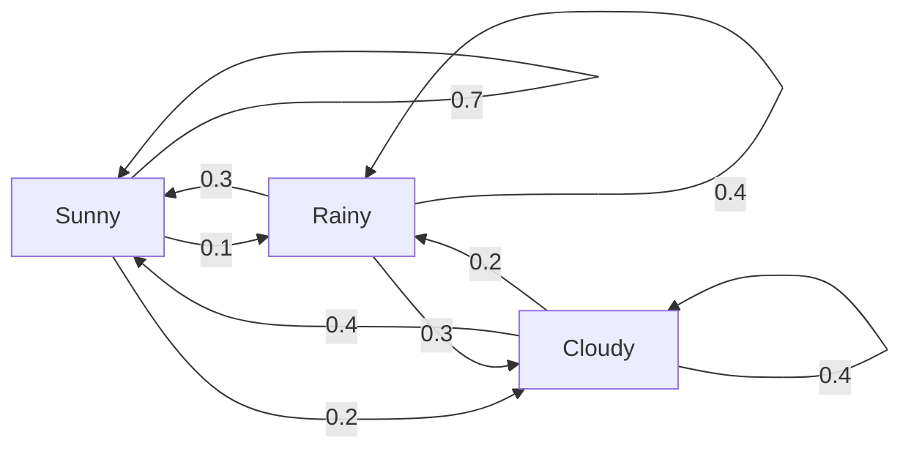
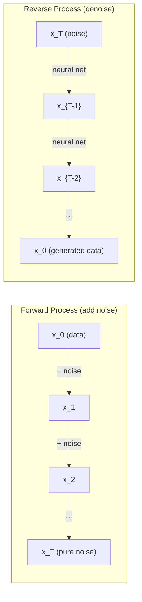

# Stochastic Processes

> Randomness 使用 structure. math behind random walks, Markov chains, 和 diffusion 模型.

**Type:** Learn
**Language:** Python
**Prerequisites:** Phase 1, Lessons 06-07 (概率, Bayes)
**Time:** ~75 minutes

## Learning Objectives

- Simulate 1D 和 2D random walks 和 verify sqrt(n) scaling 的 displacement
- Build Markov chain simulator 和 compute its stationary distribution via eigendecomposition
- Implement Metropolis-Hastings MCMC 和 Langevin dynamics 为了 sampling 从 target distributions
- Connect forward diffusion process 到 Brownian motion 和 explain how reverse process generates 数据

## Problem

Many AI systems involve randomness evolves over time. Not static randomness -- structured, sequential randomness where each step depends 在 what came before.

Language 模型 generate tokens one 在 time. Each token depends 在 previous context. 模型 输出 概率 distribution, samples 从 it, 和 moves 在. 那是 stochastic process.

Diffusion 模型 add noise 到 image step 通过 step until it becomes pure static. Then they reverse process, denoising step 通过 step until new image emerges. forward process 是 Markov chain. reverse process 是 learned Markov chain running backward.

Reinforcement learning agents take actions 在 environment. Each action leads 到 new state 使用 some 概率. agent follows random policy 在 random world. whole thing 是 Markov decision process.

MCMC sampling -- backbone 的 Bayesian inference -- constructs Markov chain whose stationary distribution 是 posterior you want 到 sample 从.

All 的 这些 build 在 four foundational ideas:
1. Random walks -- simplest stochastic process
2. Markov chains -- structured randomness 使用 transition 矩阵
3. Langevin dynamics -- 梯度下降 使用 noise
4. Metropolis-Hastings -- sampling 从 any distribution

## Concept

### Random Walks

Start 在 position 0. At each step, flip fair coin. Heads: move right (+1). Tails: move left (-1).

After n steps, your position 是 sum 的 n random +/-1 values. expected position 是 0 ( walk 是 unbiased). But expected distance 从 origin grows 作为 sqrt(n).

这是 counterintuitive. walk 是 fair -- no drift 在 either direction. But over time, it wanders further 和 further 从 where it started. standard deviation after n steps 是 sqrt(n).

```
Step 0:  Position = 0
Step 1:  Position = +1 or -1
Step 2:  Position = +2, 0, or -2
...
Step 100: Expected distance from origin ~ 10 (sqrt(100))
Step 10000: Expected distance from origin ~ 100 (sqrt(10000))
```

**In 2D**, walk moves up, down, left, 或 right 使用 equal 概率. same sqrt(n) scaling applies 到 distance 从 origin. path traces fractal-like pattern.

**Why sqrt(n)?** Each step 是 +1 或 -1 使用 equal 概率. After n steps, position S_n = X_1 + X_2 + ... + X_n where each X_i 是 +/-1. variance 的 each step 是 1, 和 steps 是 independent, so Var(S_n) = n. Standard deviation = sqrt(n). By central limit theorem, S_n / sqrt(n) converges 到 standard normal distribution.

This sqrt(n) scaling shows up everywhere 在 ML. SGD noise scales 作为 1/sqrt(batch_size). Embedding dimensions scale 作为 sqrt(d). square root 是 signature 的 independent random additions.

**Connection 到 Brownian motion.** Take random walk 使用 step size 1/sqrt(n) 和 n steps per unit time. As n goes 到 infinity, walk converges 到 Brownian motion B(t) -- continuous-time process where B(t) 是 normally distributed 使用 mean 0 和 variance t.

Brownian motion 是 mathematical foundation 的 diffusion. It 模型 random jiggling 的 particles 在 fluid, fluctuations 的 stock prices, 和 -- crucially -- noise process 在 diffusion 模型.

**Gambler's ruin.** random walker starting 在 position k, 使用 absorbing barriers 在 0 和 N. What 是 概率 的 reaching N before 0? For fair walk: P(reach N) = k/N. 这是 surprisingly simple 和 elegant. It connects 到 theory 的 martingales -- fair random walk 是 martingale (expected future value = current value).

### Markov Chains

Markov chain 是 system transitions between states according 到 fixed probabilities. key property: next state depends only 在 current state, not 在 history.

```
P(X_{t+1} = j | X_t = i, X_{t-1} = ...) = P(X_{t+1} = j | X_t = i)
```

这是 Markov property. It means you can describe entire dynamics 使用 transition 矩阵 P:

```
P[i][j] = probability of going from state i to state j
```

Each row 的 P sums 到 1 (you must go somewhere).

**Example -- Weather:**

```
States: Sunny (0), Rainy (1), Cloudy (2)

P = [[0.7, 0.1, 0.2],    (if sunny: 70% sunny, 10% rainy, 20% cloudy)
     [0.3, 0.4, 0.3],    (if rainy: 30% sunny, 40% rainy, 30% cloudy)
     [0.4, 0.2, 0.4]]    (if cloudy: 40% sunny, 20% rainy, 40% cloudy)
```

Start 在 any state. After many transitions, distribution 的 states converges 到 stationary distribution pi, where pi * P = pi. 这是 left eigenvector 的 P 使用 eigenvalue 1.

For weather chain, stationary distribution might be [0.53, 0.18, 0.29] -- over long run, it 是 sunny 53% 的 time regardless 的 starting state.



**Computing stationary distribution.** 有 two approaches:

1. **Power method**: multiply any initial distribution 通过 P repeatedly. After enough iterations, it converges.
2. **Eigenvalue method**: find left eigenvector 的 P 使用 eigenvalue 1. 这是 eigenvector 的 P^T 使用 eigenvalue 1.

Both approaches require chain 到 satisfy 收敛 conditions.

**收敛 conditions.** Markov chain converges 到 unique stationary distribution if it 是:
- **Irreducible**: every state 是 reachable 从 every other state
- **Aperiodic**: chain does not cycle 使用 fixed period

Most chains you encounter 在 ML satisfy both conditions.

**Absorbing states.** state 是 absorbing if once you enter it, you never leave (P[i][i] = 1). Absorbing Markov chains 模型 processes 使用 terminal states -- game ends, customer who churns, token sequence hits end-的-text token.

**Mixing time.** How many steps until chain 是 "close" 到 stationary distribution? Formally, number 的 steps until total variation distance 从 stationarity drops below some threshold. Fast mixing = few steps needed. spectral gap 的 P (1 minus second-largest eigenvalue) controls mixing time. Larger gap = faster mixing.

### Connection 到 Language Models

Token generation 在 language 模型 是 approximately Markov process. Given current context, 模型 输出 distribution over next token. Temperature controls sharpness:

```
P(token_i) = exp(logit_i / temperature) / sum(exp(logit_j / temperature))
```

- Temperature = 1.0: standard distribution
- Temperature < 1.0: sharper (more deterministic)
- Temperature > 1.0: flatter (more random)
- Temperature -> 0: argmax (greedy)

Top-k sampling truncates 到 k highest-概率 tokens. Top-p (nucleus) sampling truncates 到 smallest set 的 tokens whose cumulative 概率 exceeds p. Both modify Markov transition probabilities.

### Brownian Motion

continuous-time limit 的 random walk. Position B(t) has three properties:
1. B(0) = 0
2. B(t) - B(s) 是 normally distributed 使用 mean 0 和 variance t - s (为了 t > s)
3. Increments 在 non-overlapping intervals 是 independent

Brownian motion 是 continuous but nowhere differentiable -- it jiggles 在 every scale. path has fractal dimension 2 在 plane.

In discrete simulation, you approximate Brownian motion 通过:

```
B(t + dt) = B(t) + sqrt(dt) * z,    where z ~ N(0, 1)
```

sqrt(dt) scaling 是 important. It comes 从 central limit theorem applied 到 random walks.

### Langevin Dynamics

Gradient descent finds minimum 的 函数. Langevin dynamics finds 概率 distribution proportional 到 exp(-U(x)/T), where U 是 energy 函数 和 T 是 temperature.

```
x_{t+1} = x_t - dt * gradient(U(x_t)) + sqrt(2 * T * dt) * z_t
```

Two forces act 在 particle:
1. **Gradient force** (-dt * gradient(U)): pushes toward low energy (like 梯度下降)
2. **Random force** (sqrt(2*T*dt) * z): pushes 在 random directions (exploration)

At temperature T = 0, 这个 是 pure 梯度下降. At high temperature, it 是 nearly random walk. At right temperature, particle explores energy landscape 和 spends more time 在 low-energy regions.

**Connection 到 diffusion 模型.** forward process 的 diffusion 模型 是:

```
x_t = sqrt(alpha_t) * x_{t-1} + sqrt(1 - alpha_t) * noise
```

这是 Markov chain gradually mixes 数据 使用 noise. After enough steps, x_T 是 pure Gaussian noise.

reverse process -- going 从 noise back 到 数据 -- 是 also Markov chain, but its transition probabilities 是 learned 通过 神经网络. network learns 到 predict noise was added 在 each step, then subtracts it.



### MCMC: Markov Chain Monte Carlo

Sometimes you need 到 sample 从 distribution p(x) you can evaluate (up 到 constant) but cannot sample 从 directly. Bayesian posteriors 是 classic example -- you know likelihood times prior, but normalizing constant 是 intractable.

**Metropolis-Hastings** constructs Markov chain whose stationary distribution 是 p(x):

1. Start 在 some position x
2. Propose new position x' 从 proposal distribution Q(x'|x)
3. Compute acceptance ratio: = p(x') * Q(x|x') / (p(x) * Q(x'|x))
4. Accept x' 使用 概率 min(1, ). Otherwise stay 在 x.
5. Repeat.

If Q 是 symmetric (e.g., Q(x'|x) = Q(x|x') = N(x, sigma^2)), ratio simplifies 到 = p(x') / p(x). You only need ratio 的 probabilities -- normalizing constant cancels.

chain 是 guaranteed 到 converge 到 p(x) under mild conditions. But 收敛 can be slow if proposal 是 too small (random walk) 或 too large (high rejection). Tuning proposal 是 art 的 MCMC.

**Why it works.** acceptance ratio ensures detailed balance: 概率 的 being 在 x 和 moving 到 x' equals 概率 的 being 在 x' 和 moving 到 x. Detailed balance implies p(x) 是 stationary distribution 的 chain. So after enough steps, samples come 从 p(x).

**Practical considerations:**
- **Burn-在**: discard first N samples. chain needs time 到 reach stationary distribution 从 its starting point.
- **Thinning**: keep every k-th sample 到 reduce autocorrelation.
- **Multiple chains**: run several chains 从 different starting points. If they converge 到 same distribution, you have evidence 的 收敛.
- **Acceptance rate**: 为了 Gaussian proposals 在 d dimensions, optimal acceptance rate 是 about 23% (Roberts & Rosenthal, 2001). Too high means chain barely moves. Too low means it rejects everything.

### Stochastic Processes 在 AI

| Process | AI Application |
|---------|---------------|
| Random walk | Exploration 在 RL, Node2Vec embeddings |
| Markov chain | Text generation, MCMC sampling |
| Brownian motion | Diffusion 模型 (forward process) |
| Langevin dynamics | Score-based generative 模型, SGLD |
| Markov decision process | Reinforcement learning |
| Metropolis-Hastings | Bayesian inference, posterior sampling |

## Build It

### Step 1: Random walk simulator

```python
import numpy as np

def random_walk_1d(n_steps, seed=None):
    rng = np.random.RandomState(seed)
    steps = rng.choice([-1, 1], size=n_steps)
    positions = np.concatenate([[0], np.cumsum(steps)])
    return positions


def random_walk_2d(n_steps, seed=None):
    rng = np.random.RandomState(seed)
    directions = rng.choice(4, size=n_steps)
    dx = np.zeros(n_steps)
    dy = np.zeros(n_steps)
    dx[directions == 0] = 1   # right
    dx[directions == 1] = -1  # left
    dy[directions == 2] = 1   # up
    dy[directions == 3] = -1  # down
    x = np.concatenate([[0], np.cumsum(dx)])
    y = np.concatenate([[0], np.cumsum(dy)])
    return x, y
```

1D walk stores cumulative sums. Each step 是 +1 或 -1. After n steps, position 是 sum. variance grows linearly 使用 n, so standard deviation grows 作为 sqrt(n).

### Step 2: Markov chain

```python
class MarkovChain:
    def __init__(self, transition_matrix, state_names=None):
        self.P = np.array(transition_matrix, dtype=float)
        self.n_states = len(self.P)
        self.state_names = state_names or [str(i) for i in range(self.n_states)]

    def step(self, current_state, rng=None):
        if rng is None:
            rng = np.random.RandomState()
        probs = self.P[current_state]
        return rng.choice(self.n_states, p=probs)

    def simulate(self, start_state, n_steps, seed=None):
        rng = np.random.RandomState(seed)
        states = [start_state]
        current = start_state
        for _ in range(n_steps):
            current = self.step(current, rng)
            states.append(current)
        return states

    def stationary_distribution(self):
        eigenvalues, eigenvectors = np.linalg.eig(self.P.T)
        idx = np.argmin(np.abs(eigenvalues - 1.0))
        stationary = np.real(eigenvectors[:, idx])
        stationary = stationary / stationary.sum()
        return np.abs(stationary)
```

stationary distribution 是 left eigenvector 的 P 使用 eigenvalue 1. We find it 通过 computing eigenvectors 的 P^T (transposing turns left eigenvectors into right eigenvectors).

### Step 3: Langevin dynamics

```python
def langevin_dynamics(grad_U, x0, dt, temperature, n_steps, seed=None):
    rng = np.random.RandomState(seed)
    x = np.array(x0, dtype=float)
    trajectory = [x.copy()]
    for _ in range(n_steps):
        noise = rng.randn(*x.shape)
        x = x - dt * grad_U(x) + np.sqrt(2 * temperature * dt) * noise
        trajectory.append(x.copy())
    return np.array(trajectory)
```

gradient pushes x toward low energy. noise prevents it 从 getting stuck. At equilibrium, distribution 的 samples 是 proportional 到 exp(-U(x)/temperature).

### Step 4: Metropolis-Hastings

```python
def metropolis_hastings(target_log_prob, proposal_std, x0, n_samples, seed=None):
    rng = np.random.RandomState(seed)
    x = np.array(x0, dtype=float)
    samples = [x.copy()]
    accepted = 0
    for _ in range(n_samples - 1):
        x_proposed = x + rng.randn(*x.shape) * proposal_std
        log_ratio = target_log_prob(x_proposed) - target_log_prob(x)
        if np.log(rng.rand()) < log_ratio:
            x = x_proposed
            accepted += 1
        samples.append(x.copy())
    acceptance_rate = accepted / (n_samples - 1)
    return np.array(samples), acceptance_rate
```

算法 proposes new point, checks if it has higher 概率 (或 accepts 使用 概率 proportional 到 ratio), 和 repeats. acceptance rate should be around 23-50% 为了 good mixing.

## Use It

In practice, you use established libraries 为了 这些 算法. But understanding mechanics matters 为了 debugging 和 tuning.

```python
import numpy as np

rng = np.random.RandomState(42)
walk = np.cumsum(rng.choice([-1, 1], size=10000))
print(f"Final position: {walk[-1]}")
print(f"Expected distance: {np.sqrt(10000):.1f}")
print(f"Actual distance: {abs(walk[-1])}")
```

### numpy 为了 transition 矩阵

```python
import numpy as np

P = np.array([[0.7, 0.1, 0.2],
              [0.3, 0.4, 0.3],
              [0.4, 0.2, 0.4]])

distribution = np.array([1.0, 0.0, 0.0])
for _ in range(100):
    distribution = distribution @ P

print(f"Stationary distribution: {np.round(distribution, 4)}")
```

Multiply initial distribution 通过 P repeatedly. After enough iterations, it converges 到 stationary distribution regardless 的 where you started. 这是 power method 为了 finding dominant left eigenvector.

### Connections 到 real frameworks

- **PyTorch diffusion:** `DDPMScheduler` 在 Hugging Face `diffusers` implements forward 和 reverse Markov chains
- **NumPyro / PyMC:** Use MCMC (NUTS sampler, which improves 在 Metropolis-Hastings) 为了 Bayesian inference
- **Gymnasium (RL):** environment step 函数 defines Markov decision process

### Verifying Markov chain 收敛

```python
import numpy as np

P = np.array([[0.9, 0.1], [0.3, 0.7]])

eigenvalues = np.linalg.eigvals(P)
spectral_gap = 1 - sorted(np.abs(eigenvalues))[-2]
print(f"Eigenvalues: {eigenvalues}")
print(f"Spectral gap: {spectral_gap:.4f}")
print(f"Approximate mixing time: {1/spectral_gap:.1f} steps")
```

spectral gap tells you how fast chain forgets its initial state. gap 的 0.2 means roughly 5 steps 到 mix. gap 的 0.01 means roughly 100 steps. Always check 这个 before running long simulations -- slowly mixing chain wastes compute.

## Ship It

This lesson produces:
- `输出/prompt-stochastic-process-advisor.md` -- prompt helps identify which stochastic process framework applies 到 given problem

## Connections

| Concept | Where it shows up |
|---------|------------------|
| Random walk | Node2Vec graph embeddings, exploration 在 RL |
| Markov chain | Token generation 在 LLMs, MCMC sampling |
| Brownian motion | Forward diffusion process 在 DDPM, SDE-based 模型 |
| Langevin dynamics | Score-based generative 模型, stochastic gradient Langevin dynamics (SGLD) |
| Stationary distribution | MCMC 收敛 target, PageRank |
| Metropolis-Hastings | Bayesian posterior sampling, simulated annealing |
| Temperature | LLM sampling, Boltzmann exploration 在 RL, simulated annealing |
| Mixing time | 收敛 speed 的 MCMC, spectral gap analysis |
| Absorbing state | End-的-sequence token, terminal states 在 RL |
| Detailed balance | Correctness guarantee 为了 MCMC samplers |

Diffusion 模型 deserve special attention. DDPM (Ho et al., 2020) defines forward Markov chain:

```
q(x_t | x_{t-1}) = N(x_t; sqrt(1-beta_t) * x_{t-1}, beta_t * I)
```

where beta_t 是 noise schedule. After T steps, x_T 是 approximately N(0, I). reverse process 是 parameterized 通过 神经网络 predicts noise:

```
p_theta(x_{t-1} | x_t) = N(x_{t-1}; mu_theta(x_t, t), sigma_t^2 * I)
```

Every step 的 generation 是 step 在 learned Markov chain. Understanding Markov chains means understanding how 和 why diffusion 模型 generate 数据.

SGLD (Stochastic Gradient Langevin Dynamics) combines mini-批次 梯度下降 使用 Langevin noise. Instead 的 computing full gradient, you use stochastic estimate 和 add calibrated noise. As 学习率 decays, SGLD transitions 从 optimization 到 sampling -- you get approximate Bayesian posterior samples 为了 free. 这是 one 的 simplest ways 到 get uncertainty estimates 从 神经网络.

key insight across all 这些 connections: stochastic processes 是 not just theoretical tools. They 是 computational mechanisms inside modern AI systems. When you tune temperature 的 LLM, you 是 adjusting Markov chain. When you train diffusion 模型, you 是 learning 到 reverse Brownian-motion-like process. When you run Bayesian inference, you 是 constructing chain converges 到 posterior.

## Exercises

1. **Simulate 1000 random walks 的 10000 steps.** Plot distribution 的 final positions. Verify it 是 approximately Gaussian 使用 mean 0 和 standard deviation sqrt(10000) = 100.

2. **Build text generator using Markov chain.** Train 在 small corpus: 为了 each word, count transitions 到 next word. Build transition 矩阵. Generate new sentences 通过 sampling 从 chain.

3. **Implement simulated annealing** using Metropolis-Hastings. Start 在 high temperature (accept almost everything) 和 gradually cool down (accept only improvements). Use it 到 find minimum 的 函数 使用 many local minima.

4. **Compare Langevin dynamics 在 different temperatures.** Sample 从 double-well potential U(x) = (x^2 - 1)^2. At low temperature, samples cluster 在 one well. At high temperature, they spread across both. Find critical temperature where chain mixes between wells.

5. **Implement forward diffusion process.** Start 使用 1D signal (e.g., sine wave). Add noise progressively over 100 steps 使用 linear noise schedule. Show how signal degrades 到 pure noise. Then implement simple denoiser reverses process (even naive one just subtracts estimated noise).

## Key Terms

| Term | What people say | What it actually means |
|------|----------------|----------------------|
| Random walk | "Coin-flip movement" | process where position changes 通过 random increments 在 each step |
| Markov property | "Memoryless" | future depends only 在 present state, not 在 history |
| Transition 矩阵 | " 概率 table" | P[i][j] = 概率 的 moving 从 state i 到 state j |
| Stationary distribution | " long-run average" | distribution pi where pi*P = pi -- chain's equilibrium |
| Brownian motion | "Random jiggling" | continuous-time limit 的 random walk, B(t) ~ N(0, t) |
| Langevin dynamics | "Gradient descent 使用 noise" | Update rule combines deterministic gradient 和 random perturbation |
| MCMC | "Walking toward target" | Constructing Markov chain whose stationary distribution 是 one you want |
| Metropolis-Hastings | "Propose 和 accept/reject" | MCMC 算法 uses acceptance ratios 到 ensure 收敛 |
| Temperature | " randomness knob" | 参数 controlling tradeoff between exploration 和 exploitation |
| Diffusion process | "Noise 在, noise out" | Forward: gradually add noise. Reverse: gradually remove it. Generates 数据. |

## Further Reading

- **Ho, Jain, Abbeel (2020)** -- "Denoising Diffusion Probabilistic Models." DDPM paper launched diffusion 模型 revolution. Clear derivation 的 forward 和 reverse Markov chains.
- **Song & Ermon (2019)** -- "Generative Modeling 通过 Estimating Gradients 的 数据 Distribution." Score-based approach using Langevin dynamics 为了 sampling.
- **Roberts & Rosenthal (2004)** -- "General state space Markov chains 和 MCMC 算法." theory behind when 和 why MCMC works.
- **Norris (1997)** -- "Markov Chains." standard textbook. Covers 收敛, stationary distributions, 和 hitting times.
- **Welling & Teh (2011)** -- "Bayesian Learning via Stochastic Gradient Langevin Dynamics." Combines SGD 使用 Langevin dynamics 为了 scalable Bayesian inference.
