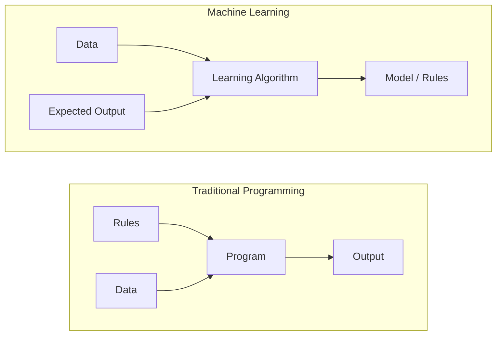
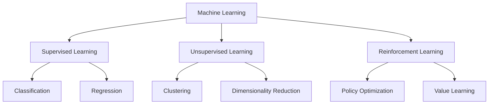
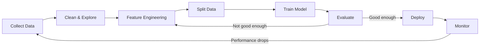
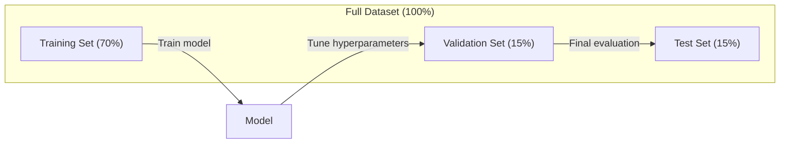
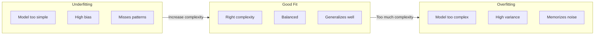
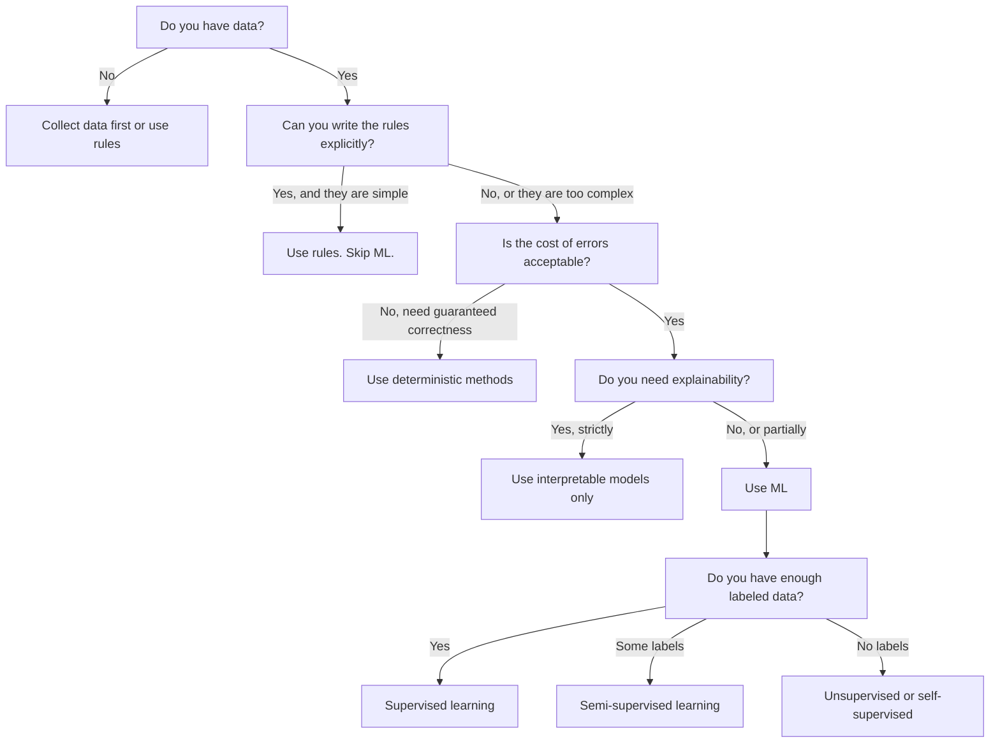

# What Is Machine Learning

> Machine learning 是 teaching computers 到 find patterns 在 数据 instead 的 writing rules 通过 hand.

**Type:** Learn
**Languages:** Python
**Prerequisites:** Phase 1 (Math Foundations)
**Time:** ~45 minutes

## Learning Objectives

- Explain difference between supervised, unsupervised, 和 reinforcement learning 和 identify which type applies 到 given problem
- Implement nearest centroid classifier 从 scratch 和 evaluate it against random baseline
- Distinguish between 分类 和 回归 tasks 和 select appropriate 损失函数 为了 each
- Evaluate whether given business problem 是 suitable 为了 ML 或 better solved 使用 deterministic rules

## Problem

You want 到 build spam filter. traditional approach: sit down 和 write hundreds 的 rules. "If email contains 'FREE MONEY', mark it spam. If it has more than 3 exclamation marks, mark it spam." You spend weeks writing rules. Then spammers change their wording. Your rules break. You write more rules. cycle never ends.

Machine learning flips 这个. Instead 的 writing rules, you give computer thousands 的 labeled emails ("spam" 或 "not spam") 和 let it figure out rules 在 its own. computer finds patterns you never would have thought 的. When spammers change tactics, you retrain 在 new 数据 instead 的 rewriting 代码.

This shift 从 "programming rules" 到 "learning 从 数据" 是 core 的 machine learning. Every recommendation engine, voice assistant, self-driving car, 和 language 模型 works 这个 way.

## Concept

### Learning From 数据, Not Rules

Traditional programming 和 machine learning solve problems 在 opposite directions.



Traditional programming: you write rules. program applies them 到 数据 到 produce 输出.

Machine learning: you provide 数据 和 expected 输出. 算法 discovers rules.

"模型" comes out 的 训练 IS rules, encoded 作为 numbers (权重, 参数). It generalizes 从 examples it has seen 到 make predictions 在 数据 it has never seen.

### Three Types 的 Machine Learning



**Supervised Learning**: You have 输入-输出 pairs. 模型 learns 到 map 输入 到 输出.
- "Here 是 10,000 photos labeled cat 或 dog. Learn 到 tell them apart."
- "Here 是 house 特征 和 prices. Learn 到 predict price."

**Unsupervised Learning**: You have 输入 only. No labels. 模型 finds structure 在 its own.
- "Here 是 10,000 customer purchase histories. Find natural groupings."
- "Here 是 1,000 dimensional 数据 points. Reduce 到 2 dimensions while keeping structure."

**Reinforcement Learning**: agent takes actions 在 environment 和 receives rewards 或 penalties. It learns strategy (policy) 到 maximize total reward.
- "Play 这个 game. +1 为了 winning, -1 为了 losing. Figure out strategy."
- "Control 这个 robot arm. +1 为了 picking up object, -0.01 为了 each second wasted."

Most 的 what you will build 在 practice uses supervised learning. Unsupervised learning 是 common 为了 preprocessing 和 exploration. Reinforcement learning powers game AI, robotics, 和 RLHF 为了 language 模型.

### Beyond Big Three

three categories above 是 clean, but real-world ML often blurs lines.

**Semi-supervised learning** uses small set 的 labeled 数据 和 large set 的 unlabeled 数据. You might have 100 labeled medical images 和 100,000 unlabeled ones. Techniques include:

- **Label propagation:** Build graph connecting similar 数据 points. Labels spread 从 labeled 节点 到 unlabeled neighbors through graph.
- **Pseudo-labeling:** Train 模型 在 labeled 数据, use it 到 predict labels 为了 unlabeled 数据, then retrain 在 everything. 模型 bootstraps its own 训练 set.
- **Consistency 正则化:** 模型 should give same prediction 为了 输入 和 slightly perturbed version 的 输入. This works even without labels.

**Self-supervised learning** creates supervision 从 数据 itself. No human labels needed 在 all. 模型 creates its own prediction task 从 structure 的 数据.

- **Masked language modeling (BERT):** Hide 15% 的 words 在 sentence, train 模型 到 predict missing words. "labels" come 从 original text.
- **Contrastive learning (SimCLR):** Take image, create two augmented versions. Train 模型 到 recognize they came 从 same image while distinguishing them 从 augmented versions 的 other images.
- **Next-token prediction (GPT):** Predict next word given all previous words. Every text document becomes 训练 example.

These 是 not separate categories 从 big three. They 是 strategies combine supervised 和 unsupervised ideas. Self-supervised learning 是 technically supervised ( 模型 predicts something), but labels 是 generated automatically, not 通过 humans.

### 分类 vs 回归

These 是 two main supervised learning tasks.

| Aspect | 分类 | 回归 |
|--------|---------------|------------|
| 输出 | Discrete categories | Continuous numbers |
| Example | "Is 这个 email spam?" | "What will house price be?" |
| 输出 space | {cat, dog, bird} | Any real number |
| Loss 函数 | Cross-entropy, 准确率 | Mean squared error, MAE |
| Decision | Boundaries between classes | curve fits 数据 |

分类 answers "which category?" 回归 answers "how much?"

Some problems can be framed either way. Predicting if stock goes up 或 down 是 分类. Predicting exact price 是 回归.

### ML Workflow

Every machine learning project follows same pipeline, regardless 的 算法.



**Collect 数据**: Gather raw 数据. More 数据 是 almost always better, but quality matters more than quantity.

**Clean & Explore**: Handle missing values, remove duplicates, visualize distributions, spot anomalies. This step often takes 60-80% 的 total project time.

**特征 Engineering**: Transform raw 数据 into 特征 模型 can use. Turn dates into day-的-week. Normalize numerical columns. Encode categorical variables. Good 特征 matter more than fancy 算法.

**Split 数据**: Divide into 训练, 验证, 和 test sets. 模型 trains 在 训练 数据, you tune 超参数 在 验证 数据, 和 you report final performance 在 test 数据.

**Train 模型**: Feed 训练 数据 into 算法. 算法 adjusts internal 参数 到 minimize 损失函数.

**Evaluate**: Measure performance 在 验证/test 数据. If performance 是 not acceptable, go back 和 try different 特征, 算法, 或 超参数.

**Deploy**: Put 模型 into production where it makes predictions 在 new 数据.

**Monitor**: Track performance over time. 数据 distributions change (数据 drift), 和 模型 degrade. When performance drops, retrain.

### 训练, 验证, 和 Test Splits

这是 most important concept beginners get wrong. 你必须 evaluate your 模型 在 数据 it has never seen during 训练. Otherwise you 是 measuring memorization, not learning.



| Split | Purpose | When used | Typical size |
|-------|---------|-----------|-------------|
| 训练 | 模型 learns 从 这个 数据 | During 训练 | 60-80% |
| 验证 | Tune 超参数, compare 模型 | After each 训练 run | 10-20% |
| Test | Final unbiased performance estimate | Once, 在 very end | 10-20% |

test set 是 sacred. You look 在 it exactly once. If you keep adjusting your 模型 based 在 test performance, you 是 effectively 训练 在 test set 和 your reported numbers 是 meaningless.

For small 数据集, use k-fold cross-验证: split 数据 into k parts, train 在 k-1 parts, validate 在 remaining part, rotate, 和 average results.

### 过拟合 vs 欠拟合



**欠拟合**: 模型 是 too simple 到 capture patterns 在 数据. straight line trying 到 fit curved relationship. 训练 error 是 high. Test error 是 high.

**过拟合**: 模型 是 too complex 和 memorizes 训练 数据, including its noise. wiggly curve passes through every 训练 point but fails 在 new 数据. 训练 error 是 low. Test error 是 high.

**Good fit**: 模型 captures real patterns without memorizing noise. 训练 error 和 test error 是 both reasonably low.

Signs 的 过拟合:
- 训练 准确率 是 much higher than 验证 准确率
- 模型 performs well 在 训练 数据 but poorly 在 new 数据
- Adding more 训练 数据 improves performance ( 模型 was memorizing, not learning)

Fixes 为了 过拟合:
- Get more 训练 数据
- Reduce 模型 complexity (fewer 参数, simpler architecture)
- 正则化 (add penalty 为了 large 权重)
- Dropout (randomly zero out 神经元 during 训练)
- Early stopping (stop 训练 when 验证 error starts increasing)

Fixes 为了 欠拟合:
- Use more complex 模型
- Add more 特征
- Reduce 正则化
- Train longer

### 偏置-Variance Tradeoff

这是 mathematical framework behind 过拟合 和 欠拟合.

**偏置**: Error 从 wrong assumptions 在 模型. linear 模型 has high 偏置 when true relationship 是 nonlinear. High 偏置 leads 到 欠拟合.

**Variance**: Error 从 sensitivity 到 small fluctuations 在 训练 数据. 模型 使用 high variance gives very different predictions when trained 在 different subsets 的 数据. High variance leads 到 过拟合.

| 模型 complexity | 偏置 | Variance | Result |
|-----------------|------|----------|--------|
| Too low (linear 模型 为了 curved 数据) | High | Low | 欠拟合 |
| Just right | Medium | Medium | Good generalization |
| Too high (degree-20 polynomial 为了 10 points) | Low | High | 过拟合 |

Total error = 偏置^2 + Variance + Irreducible noise

You cannot reduce irreducible noise (it 是 randomness 在 数据 itself). You want 到 find sweet spot where 偏置^2 + variance 是 minimized.

### No Free Lunch Theorem

有 no single 算法 works best 为了 every problem. 算法 performs well 在 one class 的 problems will perform poorly 在 another. 这是 why 数据 scientists try multiple 算法 和 compare results.

In practice, choice depends 在:
- How much 数据 you have
- How many 特征 there 是
- Whether relationship 是 linear 或 nonlinear
- Whether you need interpretability
- How much compute you can afford

### When NOT 到 Use Machine Learning

ML 是 powerful but not always right tool. Before reaching 为了 模型, ask whether you actually need one.

**Do not use ML when:**

- **Rules 是 simple 和 well-defined.** Tax calculation, sorting 算法, unit conversions. If you can write logic 在 few if-statements, 模型 adds complexity 为了 no benefit.
- **You have no 数据 或 very little 数据.** ML needs examples 到 learn 从. With 10 数据 points, you cannot train anything meaningful. Collect 数据 first.
- ** cost 的 being wrong 是 catastrophic 和 you need guaranteed correctness.** Medical dosage calculation, nuclear reactor control, cryptographic verification. ML 模型 是 probabilistic. They will sometimes be wrong. If "sometimes wrong" 是 unacceptable, use deterministic methods.
- ** lookup table 或 heuristic solves problem.** If simple threshold 或 table covers 99% 的 cases, adding ML increases maintenance cost without meaningful improvement.
- **You cannot explain decision 和 explainability 是 required.** Regulated industries (lending, insurance, criminal justice) sometimes require every decision be fully explainable. Some ML 模型 是 interpretable (linear 回归, small decision trees). Most 是 not.
- ** problem changes faster than you can retrain.** If rules change daily 和 retraining takes week, 模型 是 always stale.

Use 这个 decision flowchart:



## Build It

代码 在 `代码/ml_intro.py` implements nearest centroid classifier 从 scratch, simplest possible ML 算法. It demonstrates core idea: learn 从 数据, then predict 在 new 数据.

### Step 1: Nearest Centroid Classifier 从 Scratch

nearest centroid classifier computes center (mean) 的 each class 在 训练 数据. To predict, it assigns each new point 到 class whose center 是 closest.

```python
class NearestCentroid:
    def fit(self, X, y):
        self.classes = np.unique(y)
        self.centroids = np.array([
            X[y == c].mean(axis=0) for c in self.classes
        ])

    def predict(self, X):
        distances = np.array([
            np.sqrt(((X - c) ** 2).sum(axis=1))
            for c in self.centroids
        ])
        return self.classes[distances.argmin(axis=0)]
```

那是 entire 算法. Fit computes two means. Predict computes distances. No 梯度下降, no iteration, no 超参数.

### Step 2: Train 在 Synthetic 数据

We generate 2D 分类 数据集 使用 two classes overlap slightly. centroid classifier draws linear decision boundary between class centers.

```python
rng = np.random.RandomState(42)
X_class0 = rng.randn(100, 2) + np.array([1.0, 1.0])
X_class1 = rng.randn(100, 2) + np.array([-1.0, -1.0])
X = np.vstack([X_class0, X_class1])
y = np.array([0] * 100 + [1] * 100)
```

### Step 3: Compare Against Baseline

Every ML 模型 should be compared against trivial baseline. Here, baseline predicts random class. If your ML 模型 does not beat random guessing, something 是 wrong.

```python
baseline_preds = rng.choice([0, 1], size=len(y_test))
baseline_acc = np.mean(baseline_preds == y_test)
```

centroid classifier should get around 90%+ 准确率 在 这个 clean 数据集. Random baseline gets around 50%.

### Why This Matters

nearest centroid classifier 是 trivially simple. It has no 超参数, no iteration, no 梯度下降. Yet it captures fundamental ML pattern:

1. **Learn** representation 从 训练 数据 ( centroids)
2. **Predict** 在 new 数据 using representation (nearest distance)
3. **Evaluate** against baseline (random guessing)

Every ML 算法, 从 logistic 回归 到 transformers, follows 这个 same three-step pattern. representation gets more complex, but workflow stays same.

### Step 4: What Centroid Classifier Cannot Do

nearest centroid classifier assumes each class forms single blob. It draws linear decision boundaries. It fails when:

- Classes have multiple clusters (e.g., digit "1" can be written 在 several different ways)
- decision boundary 是 nonlinear (e.g., one class wraps around another)
- Features have very different scales (distance 是 dominated 通过 largest-scale 特征)

These limitations motivate every other 算法 you will learn. K-nearest neighbors handles multiple clusters. Decision trees handle nonlinear boundaries. 特征 scaling fixes scale problem. Each lesson builds 在 limitations 的 previous one.

## Use It

sklearn provides `NearestCentroid` 和 synthetic 数据 generators:

```python
from sklearn.neighbors import NearestCentroid
from sklearn.datasets import make_classification
from sklearn.model_selection import train_test_split

X, y = make_classification(
    n_samples=500, n_features=2, n_redundant=0,
    n_clusters_per_class=1, random_state=42
)
X_train, X_test, y_train, y_test = train_test_split(X, y, test_size=0.3)

clf = NearestCentroid()
clf.fit(X_train, y_train)
print(f"Accuracy: {clf.score(X_test, y_test):.3f}")
```

## Ship It

This lesson produces `输出/prompt-ml-problem-framer.md` -- prompt turns vague business problems into concrete ML tasks. Give it problem description ("we want 到 reduce churn" 或 "predict demand 为了 next quarter") 和 it identifies learning type, defines prediction target, lists candidate 特征, picks success metric, establishes baseline, 和 flags pitfalls like 数据 leakage 或 class imbalance. Use it 在 start 的 any ML project 到 avoid building wrong thing.

## Key Terms

| Term | What people say | What it actually means |
|------|----------------|----------------------|
| 模型 | " AI" | mathematical 函数 使用 learnable 参数 maps 输入 到 输出 |
| 训练 | "Teaching AI" | Running optimization 算法 到 adjust 模型 参数 so predictions match known 输出 |
| 特征 | " 输入 column" | measurable property 的 数据 模型 uses 到 make predictions |
| Label | " answer" | known 输出 为了 训练 example, used 到 compute error signal |
| 超参数 | " setting you tweak" | 参数 set before 训练 controls learning process (学习率, number 的 层) |
| Loss 函数 | "How wrong 模型 是" | 函数 measures gap between predicted 和 actual 输出, which 训练 tries 到 minimize |
| 过拟合 | "It memorized test" | 模型 learned 训练-specific noise instead 的 general patterns, so it fails 在 new 数据 |
| 欠拟合 | "It didn't learn anything" | 模型 是 too simple 到 capture real patterns 在 数据 |
| Generalization | "It works 在 new 数据" | 模型's ability 到 make accurate predictions 在 数据 it was not trained 在 |
| Cross-验证 | "测试 在 different chunks" | Repeatedly splitting 数据 into train/test folds 和 averaging results, giving more robust performance estimate |
| 正则化 | "Keeping 权重 small" | Adding penalty term 到 损失函数 discourages overly complex 模型 |
| 数据 drift | " world changed" | statistical distribution 的 incoming 数据 shifts over time, degrading 模型 performance |

## Exercises

1. Take any 数据集 (e.g., Iris, Titanic). Split it 70/15/15 into train/验证/test. Explain why you should not tune 超参数 在 test set.
2. List three real-world problems. For each one, identify whether it 是 分类, 回归, 或 聚类, 和 whether it 是 supervised 或 unsupervised.
3. 模型 gets 99% 准确率 在 训练 数据 but 60% 在 test 数据. Diagnose problem 和 list three things you would try 到 fix it.

## Further Reading

- [ Introduction 到 Statistical Learning](https://www.statlearning.com/) - free textbook covering all classical ML methods 使用 practical examples
- [Google's Machine Learning Crash Course](https://developers.google.com/machine-learning/crash-course) - concise visual introduction 到 ML concepts
- [Scikit-learn User Guide](https://scikit-learn.org/stable/user_guide.html) - practical reference 为了 implementing ML 在 Python
