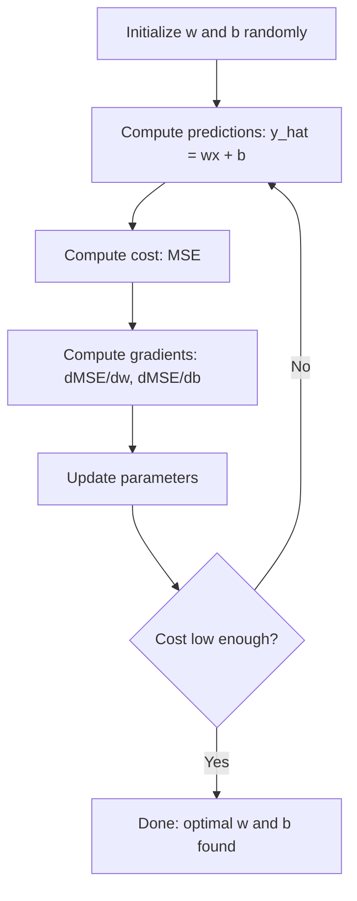

# Linear 回归

> Linear 回归 draws best straight line through your 数据. 它是 "hello world" 的 machine learning.

**Type:** Build
**Languages:** Python
**Prerequisites:** Phase 1 (线性代数, 微积分, Optimization), Phase 2 Lesson 1
**Time:** ~90 minutes

## Learning Objectives

- Derive 梯度下降 update rules 为了 mean squared error 和 implement linear 回归 从 scratch
- Compare 梯度下降 和 normal equation 在 terms 的 computational complexity 和 when 到 use each
- Build multiple linear 回归 模型 使用 特征 standardization 和 interpret learned 权重
- Explain how Ridge 回归 (L2 正则化) prevents 过拟合 通过 penalizing large 权重

## Problem

You have 数据: house sizes 和 their sale prices. You want 到 predict price 的 new house given its size. You could eyeball it 在 scatter plot, but you need formula. 你需要 line best fits 数据 so you can plug 在 any size 和 get price prediction.

Linear 回归 gives you line. More importantly, it introduces entire ML 训练 loop: define 模型, define cost 函数, optimize 参数. Every ML 算法 follows 这个 same pattern. Master it here 使用 simplest case, 和 you will recognize it everywhere.

这是 not just 为了 simple problems. Linear 回归 是 used 在 production systems 为了 demand forecasting, /B test analysis, financial modeling, 和 作为 baseline 为了 every 回归 task.

## Concept

### 模型

Linear 回归 assumes linear relationship between 输入 (x) 和 输出 (y):

```
y = wx + b
```

- `w` (权重/slope): how much y changes when x increases 通过 1
- `b` (偏置/intercept): value 的 y when x = 0

For multiple 输入 (特征), 这个 extends 到:

```
y = w1*x1 + w2*x2 + ... + wn*xn + b
```

Or 在 向量 form: `y = w^T * x + b`

goal: find values 的 w 和 b make predicted y 作为 close 作为 possible 到 actual y across all 训练 examples.

### Cost 函数 (Mean Squared Error)

How do you measure "作为 close 作为 possible"? 你需要 single number captures how wrong your predictions 是. most common choice 是 Mean Squared Error (MSE):

```
MSE = (1/n) * sum((y_predicted - y_actual)^2)
```

Why squared? Two reasons. First, it penalizes large errors more than small errors ( error 的 10 是 100x worse than error 的 1, not 10x). Second, squared 函数 是 smooth 和 differentiable everywhere, which makes optimization straightforward.

cost 函数 creates surface. For single 权重 w 和 偏置 b, MSE surface looks like bowl ( convex paraboloid). bottom 的 bowl 是 where MSE 是 minimized. 训练 means finding bottom.

### 梯度下降

Gradient descent finds bottom 的 bowl 通过 taking steps downhill.



gradients tell you two things: which direction 到 move each 参数, 和 how much 到 move.

For MSE 使用 y_hat = wx + b:

```
dMSE/dw = (2/n) * sum((y_hat - y) * x)
dMSE/db = (2/n) * sum(y_hat - y)
```

update rule:

```
w = w - learning_rate * dMSE/dw
b = b - learning_rate * dMSE/db
```

学习率 controls step size. Too large: you overshoot minimum 和 diverge. Too small: 训练 takes forever. Typical starting values: 0.01, 0.001, 或 0.0001.

### Normal Equation (Closed-Form Solution)

For linear 回归 specifically, there 是 direct formula gives optimal 权重 without any iteration:

```
w = (X^T * X)^(-1) * X^T * y
```

This inverts 矩阵 到 solve 为了 w 在 one step. It works perfectly 为了 small 数据集. For large 数据集 (millions 的 rows 或 thousands 的 特征), 梯度下降 是 preferred because 矩阵 inversion 是 O(n^3) 在 number 的 特征.

### Multiple Linear 回归

With multiple 特征, 模型 becomes:

```
y = w1*x1 + w2*x2 + ... + wn*xn + b
```

Everything works same: MSE 是 cost 函数, 梯度下降 updates all 权重 simultaneously. only difference 是 you 是 fitting hyperplane instead 的 line.

特征 scaling matters here. If one 特征 ranges 从 0 到 1 和 another ranges 从 0 到 1,000,000, 梯度下降 will struggle because cost surface becomes elongated. Standardize 特征 (subtract mean, divide 通过 standard deviation) before 训练.

### Polynomial 回归

What if relationship 是 not linear? 你可以 still use linear 回归 通过 creating polynomial 特征:

```
y = w1*x + w2*x^2 + w3*x^3 + b
```

这是 still "linear" 回归 because 模型 是 linear 在 权重 (w1, w2, w3). You 是 just using nonlinear 特征 的 x.

Higher-degree polynomials can fit more complex curves but risk 过拟合. degree-10 polynomial will pass through every point 在 10-point 数据集 but predict poorly 在 new 数据.

### R-Squared Score

MSE tells you how wrong you 是, but number depends 在 scale 的 y. R-squared (R^2) gives scale-independent measure:

```
R^2 = 1 - (sum of squared residuals) / (sum of squared deviations from mean)
    = 1 - SS_res / SS_tot
```

- R^2 = 1.0: perfect predictions
- R^2 = 0.0: 模型 是 no better than predicting mean every time
- R^2 < 0.0: 模型 是 worse than predicting mean

### 正则化 Preview (Ridge 回归)

When you have many 特征, 模型 can overfit 通过 assigning large 权重. Ridge 回归 (L2 正则化) adds penalty:

```
Cost = MSE + lambda * sum(w_i^2)
```

penalty term discourages large 权重. 超参数 lambda controls tradeoff: higher lambda means smaller 权重 和 more 正则化. 这是 covered 在 depth 在 later lesson. For now, know it exists 和 why it helps.

## Build It

### Step 1: Generate sample 数据

```python
import random
import math

random.seed(42)

TRUE_W = 3.0
TRUE_B = 7.0
N_SAMPLES = 100

X = [random.uniform(0, 10) for _ in range(N_SAMPLES)]
y = [TRUE_W * x + TRUE_B + random.gauss(0, 2.0) for x in X]

print(f"Generated {N_SAMPLES} samples")
print(f"True relationship: y = {TRUE_W}x + {TRUE_B} (+ noise)")
print(f"First 5 points: {[(round(X[i], 2), round(y[i], 2)) for i in range(5)]}")
```

### Step 2: Linear 回归 从 scratch 使用 梯度下降

```python
class LinearRegression:
    def __init__(self, learning_rate=0.01):
        self.w = 0.0
        self.b = 0.0
        self.lr = learning_rate
        self.cost_history = []

    def predict(self, X):
        return [self.w * x + self.b for x in X]

    def compute_cost(self, X, y):
        predictions = self.predict(X)
        n = len(y)
        cost = sum((pred - actual) ** 2 for pred, actual in zip(predictions, y)) / n
        return cost

    def compute_gradients(self, X, y):
        predictions = self.predict(X)
        n = len(y)
        dw = (2 / n) * sum((pred - actual) * x for pred, actual, x in zip(predictions, y, X))
        db = (2 / n) * sum(pred - actual for pred, actual in zip(predictions, y))
        return dw, db

    def fit(self, X, y, epochs=1000, print_every=200):
        for epoch in range(epochs):
            dw, db = self.compute_gradients(X, y)
            self.w -= self.lr * dw
            self.b -= self.lr * db
            cost = self.compute_cost(X, y)
            self.cost_history.append(cost)
            if epoch % print_every == 0:
                print(f"  Epoch {epoch:4d} | Cost: {cost:.4f} | w: {self.w:.4f} | b: {self.b:.4f}")
        return self

    def r_squared(self, X, y):
        predictions = self.predict(X)
        y_mean = sum(y) / len(y)
        ss_res = sum((actual - pred) ** 2 for actual, pred in zip(y, predictions))
        ss_tot = sum((actual - y_mean) ** 2 for actual in y)
        return 1 - (ss_res / ss_tot)


print("=== Training Linear Regression (Gradient Descent) ===")
model = LinearRegression(learning_rate=0.005)
model.fit(X, y, epochs=1000, print_every=200)
print(f"\nLearned: y = {model.w:.4f}x + {model.b:.4f}")
print(f"True:    y = {TRUE_W}x + {TRUE_B}")
print(f"R-squared: {model.r_squared(X, y):.4f}")
```

### Step 3: Normal equation (closed-form solution)

```python
class LinearRegressionNormal:
    def __init__(self):
        self.w = 0.0
        self.b = 0.0

    def fit(self, X, y):
        n = len(X)
        x_mean = sum(X) / n
        y_mean = sum(y) / n
        numerator = sum((X[i] - x_mean) * (y[i] - y_mean) for i in range(n))
        denominator = sum((X[i] - x_mean) ** 2 for i in range(n))
        self.w = numerator / denominator
        self.b = y_mean - self.w * x_mean
        return self

    def predict(self, X):
        return [self.w * x + self.b for x in X]

    def r_squared(self, X, y):
        predictions = self.predict(X)
        y_mean = sum(y) / len(y)
        ss_res = sum((actual - pred) ** 2 for actual, pred in zip(y, predictions))
        ss_tot = sum((actual - y_mean) ** 2 for actual in y)
        return 1 - (ss_res / ss_tot)


print("\n=== Normal Equation (Closed-Form) ===")
model_normal = LinearRegressionNormal()
model_normal.fit(X, y)
print(f"Learned: y = {model_normal.w:.4f}x + {model_normal.b:.4f}")
print(f"R-squared: {model_normal.r_squared(X, y):.4f}")
```

### Step 4: Multiple linear 回归

```python
class MultipleLinearRegression:
    def __init__(self, n_features, learning_rate=0.01):
        self.weights = [0.0] * n_features
        self.bias = 0.0
        self.lr = learning_rate
        self.cost_history = []

    def predict_single(self, x):
        return sum(w * xi for w, xi in zip(self.weights, x)) + self.bias

    def predict(self, X):
        return [self.predict_single(x) for x in X]

    def compute_cost(self, X, y):
        predictions = self.predict(X)
        n = len(y)
        return sum((pred - actual) ** 2 for pred, actual in zip(predictions, y)) / n

    def fit(self, X, y, epochs=1000, print_every=200):
        n = len(y)
        n_features = len(X[0])
        for epoch in range(epochs):
            predictions = self.predict(X)
            errors = [pred - actual for pred, actual in zip(predictions, y)]
            for j in range(n_features):
                grad = (2 / n) * sum(errors[i] * X[i][j] for i in range(n))
                self.weights[j] -= self.lr * grad
            grad_b = (2 / n) * sum(errors)
            self.bias -= self.lr * grad_b
            cost = self.compute_cost(X, y)
            self.cost_history.append(cost)
            if epoch % print_every == 0:
                print(f"  Epoch {epoch:4d} | Cost: {cost:.4f}")
        return self

    def r_squared(self, X, y):
        predictions = self.predict(X)
        y_mean = sum(y) / len(y)
        ss_res = sum((actual - pred) ** 2 for actual, pred in zip(y, predictions))
        ss_tot = sum((actual - y_mean) ** 2 for actual in y)
        return 1 - (ss_res / ss_tot)


random.seed(42)
N = 100
X_multi = []
y_multi = []
for _ in range(N):
    size = random.uniform(500, 3000)
    bedrooms = random.randint(1, 5)
    age = random.uniform(0, 50)
    price = 50 * size + 10000 * bedrooms - 1000 * age + 50000 + random.gauss(0, 20000)
    X_multi.append([size, bedrooms, age])
    y_multi.append(price)


def standardize(X):
    n_features = len(X[0])
    means = [sum(X[i][j] for i in range(len(X))) / len(X) for j in range(n_features)]
    stds = []
    for j in range(n_features):
        variance = sum((X[i][j] - means[j]) ** 2 for i in range(len(X))) / len(X)
        stds.append(variance ** 0.5)
    X_scaled = []
    for i in range(len(X)):
        row = [(X[i][j] - means[j]) / stds[j] if stds[j] > 0 else 0 for j in range(n_features)]
        X_scaled.append(row)
    return X_scaled, means, stds


y_mean_val = sum(y_multi) / len(y_multi)
y_std_val = (sum((yi - y_mean_val) ** 2 for yi in y_multi) / len(y_multi)) ** 0.5
y_scaled = [(yi - y_mean_val) / y_std_val for yi in y_multi]

X_scaled, x_means, x_stds = standardize(X_multi)

print("\n=== Multiple Linear Regression (3 features) ===")
print("Features: house size, bedrooms, age")
multi_model = MultipleLinearRegression(n_features=3, learning_rate=0.01)
multi_model.fit(X_scaled, y_scaled, epochs=1000, print_every=200)

print(f"\nWeights (standardized): {[round(w, 4) for w in multi_model.weights]}")
print(f"Bias (standardized): {multi_model.bias:.4f}")
print(f"R-squared: {multi_model.r_squared(X_scaled, y_scaled):.4f}")
```

### Step 5: Polynomial 回归

```python
class PolynomialRegression:
    def __init__(self, degree, learning_rate=0.01):
        self.degree = degree
        self.weights = [0.0] * degree
        self.bias = 0.0
        self.lr = learning_rate

    def make_features(self, X):
        return [[x ** (d + 1) for d in range(self.degree)] for x in X]

    def predict(self, X):
        features = self.make_features(X)
        return [sum(w * f for w, f in zip(self.weights, row)) + self.bias for row in features]

    def fit(self, X, y, epochs=1000, print_every=200):
        features = self.make_features(X)
        n = len(y)
        for epoch in range(epochs):
            predictions = [sum(w * f for w, f in zip(self.weights, row)) + self.bias for row in features]
            errors = [pred - actual for pred, actual in zip(predictions, y)]
            for j in range(self.degree):
                grad = (2 / n) * sum(errors[i] * features[i][j] for i in range(n))
                self.weights[j] -= self.lr * grad
            grad_b = (2 / n) * sum(errors)
            self.bias -= self.lr * grad_b
            if epoch % print_every == 0:
                cost = sum(e ** 2 for e in errors) / n
                print(f"  Epoch {epoch:4d} | Cost: {cost:.6f}")
        return self

    def r_squared(self, X, y):
        predictions = self.predict(X)
        y_mean = sum(y) / len(y)
        ss_res = sum((actual - pred) ** 2 for actual, pred in zip(y, predictions))
        ss_tot = sum((actual - y_mean) ** 2 for actual in y)
        return 1 - (ss_res / ss_tot)


random.seed(42)
X_poly = [x / 10.0 for x in range(0, 50)]
y_poly = [0.5 * x ** 2 - 2 * x + 3 + random.gauss(0, 1.0) for x in X_poly]

x_max = max(abs(x) for x in X_poly)
X_poly_norm = [x / x_max for x in X_poly]
y_poly_mean = sum(y_poly) / len(y_poly)
y_poly_std = (sum((yi - y_poly_mean) ** 2 for yi in y_poly) / len(y_poly)) ** 0.5
y_poly_norm = [(yi - y_poly_mean) / y_poly_std for yi in y_poly]

print("\n=== Polynomial Regression (degree 2 vs degree 5) ===")
print("True relationship: y = 0.5x^2 - 2x + 3")

print("\nDegree 2:")
poly2 = PolynomialRegression(degree=2, learning_rate=0.1)
poly2.fit(X_poly_norm, y_poly_norm, epochs=2000, print_every=500)
print(f"  R-squared: {poly2.r_squared(X_poly_norm, y_poly_norm):.4f}")

print("\nDegree 5:")
poly5 = PolynomialRegression(degree=5, learning_rate=0.1)
poly5.fit(X_poly_norm, y_poly_norm, epochs=2000, print_every=500)
print(f"  R-squared: {poly5.r_squared(X_poly_norm, y_poly_norm):.4f}")

print("\nDegree 2 fits the true curve well. Degree 5 fits training data slightly better")
print("but risks overfitting on new data.")
```

### Step 6: Ridge 回归 (L2 正则化)

```python
class RidgeRegression:
    def __init__(self, n_features, learning_rate=0.01, alpha=1.0):
        self.weights = [0.0] * n_features
        self.bias = 0.0
        self.lr = learning_rate
        self.alpha = alpha

    def predict_single(self, x):
        return sum(w * xi for w, xi in zip(self.weights, x)) + self.bias

    def predict(self, X):
        return [self.predict_single(x) for x in X]

    def fit(self, X, y, epochs=1000, print_every=200):
        n = len(y)
        n_features = len(X[0])
        for epoch in range(epochs):
            predictions = self.predict(X)
            errors = [pred - actual for pred, actual in zip(predictions, y)]
            mse = sum(e ** 2 for e in errors) / n
            reg_term = self.alpha * sum(w ** 2 for w in self.weights)
            cost = mse + reg_term
            for j in range(n_features):
                grad = (2 / n) * sum(errors[i] * X[i][j] for i in range(n))
                grad += 2 * self.alpha * self.weights[j]
                self.weights[j] -= self.lr * grad
            grad_b = (2 / n) * sum(errors)
            self.bias -= self.lr * grad_b
            if epoch % print_every == 0:
                print(f"  Epoch {epoch:4d} | Cost: {cost:.4f} | L2 penalty: {reg_term:.4f}")
        return self


print("\n=== Ridge Regression (L2 Regularization) ===")
print("Same data as multiple regression, with alpha=0.1")
ridge = RidgeRegression(n_features=3, learning_rate=0.01, alpha=0.1)
ridge.fit(X_scaled, y_scaled, epochs=1000, print_every=200)
print(f"\nRidge weights: {[round(w, 4) for w in ridge.weights]}")
print(f"Plain weights: {[round(w, 4) for w in multi_model.weights]}")
print("Ridge weights are smaller (shrunk toward zero) due to the L2 penalty.")
```

## Use It

Now same thing 使用 scikit-learn, which 是 what you will actually use 在 production.

```python
from sklearn.linear_model import LinearRegression as SklearnLR
from sklearn.linear_model import Ridge
from sklearn.preprocessing import PolynomialFeatures, StandardScaler
from sklearn.model_selection import train_test_split
from sklearn.metrics import mean_squared_error, r2_score
import numpy as np

np.random.seed(42)
X_sk = np.random.uniform(0, 10, (100, 1))
y_sk = 3.0 * X_sk.squeeze() + 7.0 + np.random.normal(0, 2.0, 100)

X_train, X_test, y_train, y_test = train_test_split(X_sk, y_sk, test_size=0.2, random_state=42)

lr = SklearnLR()
lr.fit(X_train, y_train)
y_pred = lr.predict(X_test)

print("=== Scikit-learn Linear Regression ===")
print(f"Coefficient (w): {lr.coef_[0]:.4f}")
print(f"Intercept (b): {lr.intercept_:.4f}")
print(f"R-squared (test): {r2_score(y_test, y_pred):.4f}")
print(f"MSE (test): {mean_squared_error(y_test, y_pred):.4f}")

poly = PolynomialFeatures(degree=2, include_bias=False)
X_poly_sk = poly.fit_transform(X_train)
X_poly_test = poly.transform(X_test)

lr_poly = SklearnLR()
lr_poly.fit(X_poly_sk, y_train)
print(f"\nPolynomial degree 2 R-squared: {r2_score(y_test, lr_poly.predict(X_poly_test)):.4f}")

scaler = StandardScaler()
X_train_scaled = scaler.fit_transform(X_train)
X_test_scaled = scaler.transform(X_test)

ridge = Ridge(alpha=1.0)
ridge.fit(X_train_scaled, y_train)
print(f"Ridge R-squared: {r2_score(y_test, ridge.predict(X_test_scaled)):.4f}")
print(f"Ridge coefficient: {ridge.coef_[0]:.4f}")
```

Your 从-scratch implementation 和 scikit-learn produce same results. difference: scikit-learn handles edge cases, numerical stability, 和 performance optimizations. Use library 为了 production. Use 从-scratch version 到 understand what 是 happening.

## Ship It

This lesson produces:
- `输出/skill-回归.md` - skill 为了 choosing right 回归 approach based 在 problem

## Exercises

1. Implement 批次 梯度下降, stochastic 梯度下降 (SGD), 和 mini-批次 梯度下降. Compare 收敛 speed 在 same 数据集. Which converges fastest? Which has smoothest cost curve?
2. Generate 数据 从 cubic 函数 (y = ax^3 + bx^2 + cx + d + noise). Fit polynomials 的 degree 1, 3, 和 10. Compare 训练 R^2 和 test R^2. At what degree does 过拟合 become obvious?
3. Implement Lasso 回归 (L1 正则化: penalty = alpha * sum(|w_i|)). Train 在 multi-特征 housing 数据. Compare which 权重 go 到 zero vs Ridge. Why does L1 produce sparse solutions while L2 does not?

## Key Terms

| Term | What people say | What it actually means |
|------|----------------|----------------------|
| Linear 回归 | "Draw line through 数据" | Find 权重 w 和 偏置 b minimize sum 的 squared differences between wx+b 和 actual y values |
| Cost 函数 | "How bad 模型 是" | 函数 maps 模型 参数 到 single number measuring prediction error, which optimization minimizes |
| Mean squared error | "Average 的 squared errors" | (1/n) * sum 的 (predicted - actual)^2, penalizing large errors disproportionately |
| Gradient descent | "Walk downhill" | Iteratively adjust 参数 在 direction reduces cost 函数, using partial derivatives |
| Learning rate | "Step size" | scalar controls how much 参数 change per 梯度下降 step |
| Normal equation | "Solve it directly" | closed-form solution w = (X^T X)^-1 X^T y gives optimal 权重 without iteration |
| R-squared | "How good fit 是" | fraction 的 variance 在 y explained 通过 模型, ranging 从 negative infinity 到 1.0 |
| 特征 scaling | "Make 特征 comparable" | Transforming 特征 到 similar ranges (e.g., zero mean, unit variance) so 梯度下降 converges faster |
| 正则化 | "Penalize complexity" | Adding term 到 cost 函数 shrinks 权重, preventing 过拟合 |
| Ridge 回归 | "L2 正则化" | Linear 回归 使用 penalty 的 lambda * sum(w_i^2) added 到 MSE |
| Polynomial 回归 | "Fitting curves 使用 linear math" | Linear 回归 在 polynomial 特征 (x, x^2, x^3, ...), still linear 在 权重 |
| 过拟合 | "Memorizing 训练 数据" | Using 模型 so complex it fits noise 在 训练 数据 和 fails 在 new 数据 |

## Further Reading

- [ Introduction 到 Statistical Learning (ISLR)](https://www.statlearning.com/) -- free PDF, chapters 3 和 6 cover linear 回归 和 正则化 使用 practical R examples
- [ Elements 的 Statistical Learning (ESL)](https://hastie.su.domains/ElemStatLearn/) -- free PDF, more mathematical companion 到 ISLR 使用 deeper treatment 的 ridge 和 lasso
- [Stanford CS229 Lecture Notes 在 Linear 回归](https://cs229.stanford.edu/main_notes.pdf) -- Andrew Ng's notes deriving normal equation 和 梯度下降 从 first principles
- [scikit-learn LinearRegression documentation](https://scikit-learn.org/stable/modules/linear_model.html) -- practical reference 为了 LinearRegression, Ridge, Lasso, 和 ElasticNet 使用 代码 examples
