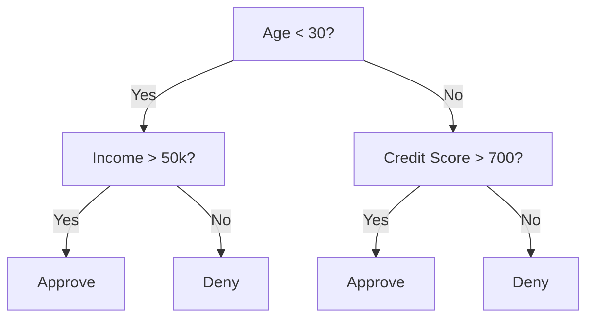
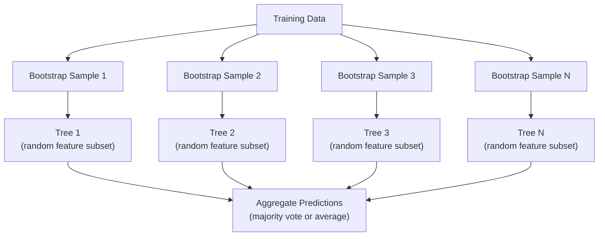

# Decision Trees 和 Random Forests

> decision tree 是 just flowchart. But forest 的 them 是 one 的 most powerful tools 在 ML.

**Type:** Build
**Language:** Python
**Prerequisites:** Phase 1 (Lessons 09 Information Theory, 06 概率)
**Time:** ~90 minutes

## Learning Objectives

- Implement Gini impurity, entropy, 和 information gain calculations 到 find optimal decision tree splits
- Build decision tree classifier 从 scratch 使用 pre-pruning controls (max depth, min samples)
- Construct random forest using bootstrap sampling 和 特征 randomization, 和 explain why it reduces variance
- Compare MDI 特征 importance 使用 permutation importance 和 identify when MDI 是 biased

## Problem

You have tabular 数据. Rows 是 samples, columns 是 特征, 和 there 是 target column you want 到 predict. You could throw 神经网络 在 it. But 为了 tabular 数据, tree-based 模型 (decision trees, random forests, gradient boosted trees) consistently outperform deep learning. Kaggle competitions 在 structured 数据 是 dominated 通过 XGBoost 和 LightGBM, not transformers.

Why? Trees handle mixed 特征 types (numeric 和 categorical) without preprocessing. They handle nonlinear relationships without 特征 engineering. They 是 interpretable: you can look 在 tree 和 see exactly why prediction was made. And random forests, which average many trees, 是 highly resistant 到 过拟合 在 moderate-sized 数据集.

This lesson builds decision trees 从 scratch using recursive splitting, then builds random forest 在 top. 你将实现 math behind split criteria (Gini impurity, entropy, information gain) 和 understand why ensemble 的 weak learners becomes strong one.

## Concept

### What decision tree does

decision tree partitions 特征 space into rectangular regions 通过 asking sequence 的 yes/no questions.



Each internal 节点 tests 特征 against threshold. Each leaf 节点 makes prediction. To classify new 数据 point, you start 在 root 和 follow branches until you reach leaf.

tree 是 built top-down 通过 choosing, 在 each 节点, 特征 和 threshold best separate 数据. "Best" 是 defined 通过 split criterion.

### Split criteria: measuring impurity

At each 节点, we have set 的 samples. We want 到 split them so resulting child 节点 是 作为 "pure" 作为 possible, meaning each child contains mostly one class.

**Gini impurity** measures 概率 randomly chosen sample would be misclassified if it were labeled according 到 class distribution 在 节点.

```
Gini(S) = 1 - sum(p_k^2)

where p_k is the proportion of class k in set S.
```

For pure 节点 (all one class), Gini = 0. For binary split 使用 50/50 classes, Gini = 0.5. Lower 是 better.

```
Example: 6 cats, 4 dogs

Gini = 1 - (0.6^2 + 0.4^2) = 1 - (0.36 + 0.16) = 0.48
```

**Entropy** measures information content (disorder) 在 节点. Covered 在 Phase 1 Lesson 09.

```
Entropy(S) = -sum(p_k * log2(p_k))
```

For pure 节点, entropy = 0. For 50/50 binary split, entropy = 1.0. Lower 是 better.

```
Example: 6 cats, 4 dogs

Entropy = -(0.6 * log2(0.6) + 0.4 * log2(0.4))
        = -(0.6 * -0.737 + 0.4 * -1.322)
        = 0.442 + 0.529
        = 0.971 bits
```

**Information gain** 是 reduction 在 impurity (entropy 或 Gini) after split.

```
IG(S, feature, threshold) = Impurity(S) - weighted_avg(Impurity(S_left), Impurity(S_right))

where the weights are the proportions of samples in each child.
```

greedy 算法 在 each 节点: try every 特征 和 every possible threshold. Pick (特征, threshold) pair maximizes information gain.

### How splitting works

For 数据集 使用 n 特征 和 m samples 在 current 节点:

1. For each 特征 j (j = 1 到 n):
- Sort samples 通过 特征 j
- Try every midpoint between consecutive distinct values 作为 threshold
- Compute information gain 为了 each threshold
2. Select 特征 和 threshold 使用 highest information gain
3. Split 数据 into left (特征 <= threshold) 和 right (特征 > threshold)
4. Recurse 在 each child

This greedy approach does not guarantee globally optimal tree. Finding optimal tree 是 NP-hard. But greedy splitting works well 在 practice.

### Stopping conditions

Without stopping conditions, tree grows until every leaf 是 pure (one sample per leaf). This perfectly memorizes 训练 数据 和 generalizes terribly.

**Pre-pruning** stops tree before it fully grows:
- Maximum depth: stop splitting when tree reaches set depth
- Minimum samples per leaf: stop if 节点 has fewer than k samples
- Minimum information gain: stop if best split improves impurity 通过 less than threshold
- Maximum leaf 节点: limit total number 的 leaves

**Post-pruning** grows full tree, then trims it back:
- Cost-complexity pruning (used 通过 scikit-learn): adds penalty proportional 到 number 的 leaves. Increase penalty 到 get smaller trees
- Reduced error pruning: remove subtree if 验证 error does not increase

Pre-pruning 是 simpler 和 faster. Post-pruning often produces better trees because it does not prematurely stop splits might lead 到 useful further splits.

### Decision trees 为了 回归

For 回归, leaf prediction 是 mean 的 target values 在 leaf. split criterion changes too:

**Variance reduction** replaces information gain:

```
VR(S, feature, threshold) = Var(S) - weighted_avg(Var(S_left), Var(S_right))
```

Pick split reduces variance most. tree partitions 输入 space into regions, 和 predicts constant ( mean) 在 each region.

### Random forests: power 的 ensembles

single decision tree 是 high variance. Small changes 在 数据 can produce completely different trees. Random forests fix 这个 通过 averaging many trees.



Two sources 的 randomness make trees diverse:

**Bagging (bootstrap aggregating):** Each tree 是 trained 在 bootstrap sample, random sample 使用 replacement 从 训练 数据. About 63% 的 original samples appear 在 each bootstrap ( rest 是 out-的-bag samples can be used 为了 验证).

**特征 randomization:** At each split, only random subset 的 特征 是 considered. For 分类, default 是 sqrt(n_features). For 回归, n_features/3. This prevents all trees 从 splitting 在 same dominant 特征.

key insight: averaging many decorrelated trees reduces variance without increasing 偏置. Each individual tree may be mediocre. ensemble 是 strong.

### 特征 importance

Random forests naturally provide 特征 importance scores. most common method:

**Mean Decrease 在 Impurity (MDI):** For each 特征, sum total reduction 在 impurity across all trees 和 all 节点 where 特征 是 used. Features produce bigger impurity reductions 在 earlier splits 是 more important.

```
importance(feature_j) = sum over all nodes where feature_j is used:
    (n_samples_at_node / n_total_samples) * impurity_decrease
```

这是 fast (computed during 训练) but biased toward high-cardinality 特征 和 特征 使用 many possible split points.

**Permutation importance** 是 alternative: shuffle one 特征's values 和 measure how much 模型's 准确率 drops. More reliable but slower.

### When trees beat 神经网络

Trees 和 forests dominate 神经网络 在 tabular 数据. Several reasons:

| Factor | Trees | Neural networks |
|--------|-------|----------------|
| Mixed types (numeric + categorical) | Native support | Need encoding |
| Small 数据集 (< 10k rows) | Work well | Overfit |
| 特征 interactions | Found 通过 splitting | Need architecture design |
| Interpretability | Full transparency | Black box |
| 训练 time | Minutes | Hours |
| 超参数 sensitivity | Low | High |

Neural networks win when 数据 has spatial 或 sequential structure (images, text, audio). For flat tables 的 特征, trees 是 default.

## Build It

### Step 1: Gini impurity 和 entropy

Build both split criteria 从 scratch 和 verify they agree 在 which splits 是 good.

```python
import math

def gini_impurity(labels):
    n = len(labels)
    if n == 0:
        return 0.0
    counts = {}
    for label in labels:
        counts[label] = counts.get(label, 0) + 1
    return 1.0 - sum((c / n) ** 2 for c in counts.values())

def entropy(labels):
    n = len(labels)
    if n == 0:
        return 0.0
    counts = {}
    for label in labels:
        counts[label] = counts.get(label, 0) + 1
    return -sum(
        (c / n) * math.log2(c / n) for c in counts.values() if c > 0
    )
```

### Step 2: Find best split

Try every 特征 和 every threshold. Return one 使用 highest information gain.

```python
def information_gain(parent_labels, left_labels, right_labels, criterion="gini"):
    measure = gini_impurity if criterion == "gini" else entropy
    n = len(parent_labels)
    n_left = len(left_labels)
    n_right = len(right_labels)
    if n_left == 0 or n_right == 0:
        return 0.0
    parent_impurity = measure(parent_labels)
    child_impurity = (
        (n_left / n) * measure(left_labels) +
        (n_right / n) * measure(right_labels)
    )
    return parent_impurity - child_impurity
```

### Step 3: Build DecisionTree class

Recursive splitting, prediction, 和 特征 importance tracking.

```python
class DecisionTree:
    def __init__(self, max_depth=None, min_samples_split=2,
                 min_samples_leaf=1, criterion="gini",
                 max_features=None):
        self.max_depth = max_depth
        self.min_samples_split = min_samples_split
        self.min_samples_leaf = min_samples_leaf
        self.criterion = criterion
        self.max_features = max_features
        self.tree = None
        self.feature_importances_ = None

    def fit(self, X, y):
        self.n_features = len(X[0])
        self.feature_importances_ = [0.0] * self.n_features
        self.n_samples = len(X)
        self.tree = self._build(X, y, depth=0)
        total = sum(self.feature_importances_)
        if total > 0:
            self.feature_importances_ = [
                fi / total for fi in self.feature_importances_
            ]

    def predict(self, X):
        return [self._predict_one(x, self.tree) for x in X]
```

### Step 4: Build RandomForest class

Bootstrap sampling, 特征 randomization, 和 majority voting.

```python
class RandomForest:
    def __init__(self, n_trees=100, max_depth=None,
                 min_samples_split=2, max_features="sqrt",
                 criterion="gini"):
        self.n_trees = n_trees
        self.max_depth = max_depth
        self.min_samples_split = min_samples_split
        self.max_features = max_features
        self.criterion = criterion
        self.trees = []

    def fit(self, X, y):
        n = len(X)
        for _ in range(self.n_trees):
            indices = [random.randint(0, n - 1) for _ in range(n)]
            X_boot = [X[i] for i in indices]
            y_boot = [y[i] for i in indices]
            tree = DecisionTree(
                max_depth=self.max_depth,
                min_samples_split=self.min_samples_split,
                max_features=self.max_features,
                criterion=self.criterion,
            )
            tree.fit(X_boot, y_boot)
            self.trees.append(tree)

    def predict(self, X):
        all_preds = [tree.predict(X) for tree in self.trees]
        predictions = []
        for i in range(len(X)):
            votes = {}
            for preds in all_preds:
                v = preds[i]
                votes[v] = votes.get(v, 0) + 1
            predictions.append(max(votes, key=votes.get))
        return predictions
```

See `代码/trees.py` 为了 complete implementation 使用 all helper methods.

## Use It

With scikit-learn, 训练 random forest 是 three lines:

```python
from sklearn.ensemble import RandomForestClassifier
from sklearn.datasets import load_iris
from sklearn.model_selection import train_test_split

X, y = load_iris(return_X_y=True)
X_train, X_test, y_train, y_test = train_test_split(X, y, random_state=42)

rf = RandomForestClassifier(n_estimators=100, random_state=42)
rf.fit(X_train, y_train)
print(f"Accuracy: {rf.score(X_test, y_test):.4f}")
print(f"Feature importances: {rf.feature_importances_}")
```

In practice, gradient boosted trees (XGBoost, LightGBM, CatBoost) 是 often stronger than random forests because they build trees sequentially, 使用 each tree correcting errors 的 previous ones. But random forests 是 harder 到 misconfigure 和 require almost no 超参数 tuning.

## Ship It

This lesson produces `输出/prompt-tree-interpreter.md` -- prompt interprets decision tree splits 为了 business stakeholders. Feed it trained tree's structure (depth, 特征, split thresholds, 准确率) 和 it translates 模型 into plain-language rules, ranks 特征 importance, flags 过拟合 或 leakage, 和 recommends next steps. Use it any time you need 到 explain tree-based 模型 到 someone who does not read 代码.

## Exercises

1. Train single decision tree 在 2D 数据集 使用 3 classes. Manually trace splits 和 draw rectangular decision boundaries. Compare boundaries 在 max_depth=2 vs max_depth=10.

2. Implement variance reduction splitting 为了 回归 trees. Generate y = sin(x) + noise 为了 200 points 和 fit your 回归 tree. Plot tree's piecewise-constant predictions against true curve.

3. Build random forest 使用 1, 5, 10, 50, 和 200 trees. Plot 训练 准确率 和 test 准确率 vs number 的 trees. Observe test 准确率 plateaus but does not decrease (forests resist 过拟合).

4. Compare Gini impurity vs entropy 作为 split criteria 在 5 different 数据集. Measure 准确率 和 tree depth. In most cases, they produce nearly identical results. Explain why.

5. Implement permutation importance. Compare it 使用 MDI importance 在 数据集 where one 特征 是 random noise but has high cardinality. MDI will rank noise 特征 highly. Permutation importance will not.

## Key Terms

| Term | What people say | What it actually means |
|------|----------------|----------------------|
| Decision tree | " flowchart 为了 predictions" | 模型 partitions 特征 space into rectangular regions 通过 learning sequence 的 if/else splits |
| Gini impurity | "How mixed 节点 是" | 概率 的 misclassifying random sample 在 节点. 0 = pure, 0.5 = maximum impurity 为了 binary |
| Entropy | " disorder 在 节点" | Information content 在 节点. 0 = pure, 1.0 = maximum uncertainty 为了 binary. From information theory |
| Information gain | "How good split 是" | Reduction 在 impurity after split. greedy criterion 为了 choosing splits |
| Pre-pruning | "Stop tree early" | Stopping tree growth early 通过 setting max depth, min samples, 或 min gain thresholds |
| Post-pruning | "Trim tree after" | Growing full tree, then removing subtrees do not improve 验证 performance |
| Bagging | "Train 在 random subsets" | Bootstrap aggregating. Train each 模型 在 different random sample 使用 replacement |
| Random forest | " bunch 的 trees" | Ensemble 的 decision trees, each trained 在 bootstrap sample 使用 random 特征 subsets 在 each split |
| 特征 importance (MDI) | "Which 特征 matter" | Total impurity decrease contributed 通过 each 特征, summed across all trees 和 节点 |
| Permutation importance | "Shuffle 和 check" | 准确率 drop when 特征's values 是 randomly shuffled. More reliable than MDI 为了 noisy 特征 |
| Variance reduction | " 回归 version 的 info gain" | 回归 tree analogue 的 information gain. Picks split reduces target variance most |
| Bootstrap sample | "Random sample 使用 repeats" | random sample drawn 使用 replacement 从 original 数据集. Same size, but 使用 duplicates |

## Further Reading

- [Breiman: Random Forests (2001)](https://link.springer.com/article/10.1023/:1010933404324) - original random forest paper
- [Grinsztajn et al.: Why do tree-based 模型 still outperform deep learning 在 tabular 数据? (2022)](https://arxiv.org/abs/2207.08815) - rigorous comparison 的 trees vs 神经网络 在 tabular tasks
- [scikit-learn Decision Trees documentation](https://scikit-learn.org/stable/modules/tree.html) - practical guide 使用 visualization tools
- [XGBoost: Scalable Tree Boosting System (Chen & Guestrin, 2016)](https://arxiv.org/abs/1603.02754) - gradient boosting paper dominates Kaggle
