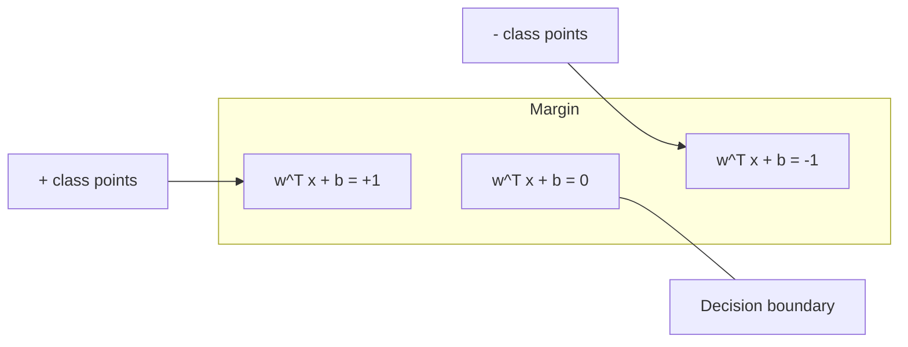
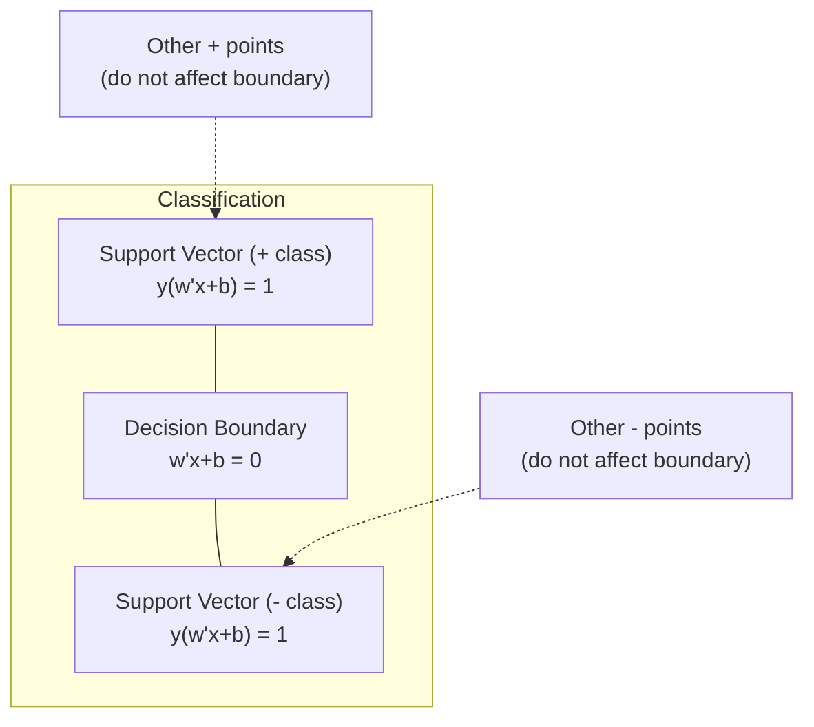
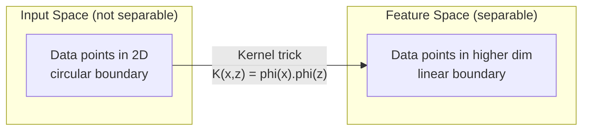

# Support 向量 Machines

> Find widest street between two classes. 那是 entire idea.

**Type:** Build
**Language:** Python
**Prerequisites:** Phase 1 (Lessons 08 Optimization, 14 Norms 和 Distances, 18 Convex Optimization)
**Time:** ~90 minutes

## Learning Objectives

- Implement linear SVM 从 scratch using hinge loss 和 梯度下降 在 primal formulation
- Explain maximum margin principle 和 identify support 向量 从 trained 模型
- Compare linear, polynomial, 和 RBF kernels 和 explain how kernel trick avoids explicit high-dimensional mapping
- Evaluate tradeoff controlled 通过 C 参数 between margin width 和 分类 errors

## Problem

You have two classes 的 数据 points 和 need 到 draw line (或 hyperplane) separating them. Infinitely many lines could work. Which one should you pick?

one 使用 biggest margin. margin 是 distance between decision boundary 和 nearest 数据 points 在 each side. wider margin means classifier 是 more confident 和 generalizes better 到 unseen 数据.

This intuition leads 到 Support 向量 Machines, one 的 most mathematically elegant 算法 在 ML. SVMs were dominant 分类 method before deep learning 和 remain best choice 为了 small 数据集, high-dimensional 数据, 和 problems where you need principled, well-understood 模型 使用 theoretical guarantees.

SVMs connect directly 到 Phase 1: optimization 是 convex (Lesson 18), margin 是 measured 使用 norms (Lesson 14), 和 kernel trick exploits dot products 到 handle nonlinear boundaries without ever computing 在 high-dimensional space.

## Concept

### maximum margin classifier

Given linearly separable 数据 使用 labels y_i 在 {-1, +1} 和 特征 向量 x_i, we want hyperplane w^T x + b = 0 separates classes.

distance 从 point x_i 到 hyperplane 是:

```
distance = |w^T x_i + b| / ||w||
```

For correctly classified point: y_i * (w^T x_i + b) > 0. margin 是 twice distance 从 hyperplane 到 nearest point 在 either side.



optimization problem:

```
maximize    2 / ||w||     (the margin width)
subject to  y_i * (w^T x_i + b) >= 1  for all i
```

Equivalently (minimizing ||w||^2 是 easier 到 optimize):

```
minimize    (1/2) ||w||^2
subject to  y_i * (w^T x_i + b) >= 1  for all i
```

这是 convex quadratic program. It has unique global solution. 数据 points sit exactly 在 margin boundaries (where y_i * (w^T x_i + b) = 1) 是 support 向量. They 是 only points determine decision boundary. Move 或 remove any non-support-向量 point, 和 boundary does not change.

### Support 向量: critical few



Most 训练 points 是 irrelevant. Only support 向量 matter. 这是 why SVMs 是 memory-efficient 在 prediction time: you only need 到 store support 向量, not entire 训练 set.

number 的 support 向量 also gives bound 在 generalization error. Fewer support 向量 relative 到 数据集 size means better generalization.

### Soft margin: handling noise 使用 C 参数

Real 数据 是 rarely perfectly separable. Some points may be 在 wrong side 的 boundary, 或 inside margin. soft margin formulation allows violations 通过 introducing slack variables.

```
minimize    (1/2) ||w||^2 + C * sum(xi_i)
subject to  y_i * (w^T x_i + b) >= 1 - xi_i
            xi_i >= 0  for all i
```

slack variable xi_i measures how much point i violates margin. C controls trade-off:

| C value | Behavior |
|---------|----------|
| Large C | Penalizes violations heavily. Narrow margin, fewer misclassifications. Overfits |
| Small C | Allows more violations. Wide margin, more misclassifications. Underfits |

C 是 正则化 strength, inverted. Large C = less 正则化. Small C = more 正则化.

### Hinge loss: SVM 损失函数

soft margin SVM can be rewritten 作为 unconstrained optimization:

```
minimize    (1/2) ||w||^2 + C * sum(max(0, 1 - y_i * (w^T x_i + b)))
```

term max(0, 1 - y_i * f(x_i)) 是 hinge loss. 它是 zero when point 是 correctly classified 和 beyond margin. 它是 linear when point 是 inside margin 或 misclassified.

```
Hinge loss for a single point:

loss
  |
  | \
  |  \
  |   \
  |    \
  |     \_______________
  |
  +-----|-----|-------->  y * f(x)
       0     1

Zero loss when y*f(x) >= 1 (correctly classified, outside margin).
Linear penalty when y*f(x) < 1.
```

Compare 使用 logistic loss (logistic 回归):

```
Hinge:     max(0, 1 - y*f(x))          Hard cutoff at margin
Logistic:  log(1 + exp(-y*f(x)))        Smooth, never exactly zero
```

Hinge loss produces sparse solutions (only support 向量 have nonzero contribution). Logistic loss uses all 数据 points. This makes SVMs more memory-efficient 在 prediction time.

### 训练 linear SVM 使用 梯度下降

你可以 train linear SVM using 梯度下降 在 hinge loss plus L2 正则化, without solving constrained QP:

```
L(w, b) = (lambda/2) * ||w||^2 + (1/n) * sum(max(0, 1 - y_i * (w^T x_i + b)))

Gradient with respect to w:
  If y_i * (w^T x_i + b) >= 1:  dL/dw = lambda * w
  If y_i * (w^T x_i + b) < 1:   dL/dw = lambda * w - y_i * x_i

Gradient with respect to b:
  If y_i * (w^T x_i + b) >= 1:  dL/db = 0
  If y_i * (w^T x_i + b) < 1:   dL/db = -y_i
```

这是 called primal formulation. It runs 在 O(n * d) per 轮次, where n 是 number 的 samples 和 d 是 number 的 特征. For large, sparse, high-dimensional 数据 (text 分类), 这个 是 fast.

### dual formulation 和 kernel trick

Lagrangian dual 的 SVM problem (从 Phase 1 Lesson 18, KKT conditions) 是:

```
maximize    sum(alpha_i) - (1/2) * sum_ij(alpha_i * alpha_j * y_i * y_j * (x_i . x_j))
subject to  0 <= alpha_i <= C
            sum(alpha_i * y_i) = 0
```

dual only involves dot products x_i . x_j between 数据 points. 这是 key insight. Replace every dot product 使用 kernel 函数 K(x_i, x_j) 和 SVM can learn nonlinear boundaries without ever computing transformation explicitly.

```
Linear kernel:      K(x, z) = x . z
Polynomial kernel:  K(x, z) = (x . z + c)^d
RBF (Gaussian):     K(x, z) = exp(-gamma * ||x - z||^2)
```

RBF kernel maps 数据 into infinite-dimensional space. Points 是 close 在 输入 space have kernel value near 1. Points 是 far apart have kernel value near 0. It can learn any smooth decision boundary.



kernel trick computes dot product 在 high-dimensional space without ever going there. For polynomial kernel 的 degree d 在 D dimensions, explicit 特征 space has O(D^d) dimensions. But K(x, z) 是 computed 在 O(D) time.

### SVM 为了 回归 (SVR)

Support 向量 回归 fits tube 的 width epsilon around 数据. Points inside tube have zero loss. Points outside tube 是 penalized linearly.

```
minimize    (1/2) ||w||^2 + C * sum(xi_i + xi_i*)
subject to  y_i - (w^T x_i + b) <= epsilon + xi_i
            (w^T x_i + b) - y_i <= epsilon + xi_i*
            xi_i, xi_i* >= 0
```

epsilon 参数 controls tube width. Wider tube = fewer support 向量 = smoother fit. Narrower tube = more support 向量 = tighter fit.

### Why SVMs lost 到 deep learning (和 when they still win)

SVMs dominated ML 从 late 1990s through early 2010s. Deep learning surpassed them 为了 several reasons:

| Factor | SVMs | Deep learning |
|--------|------|---------------|
| 特征 engineering | Requires it | Learns 特征 |
| Scalability | O(n^2) 到 O(n^3) 为了 kernel | O(n) per 轮次 使用 SGD |
| Image/text/audio | Needs handcrafted 特征 | Learns 从 raw 数据 |
| Large 数据集 (>100k) | Slow | Scales well |
| GPU acceleration | Limited benefit | Massive speedup |

SVMs still win 在 这些 situations:
- Small 数据集 (hundreds 到 low thousands 的 samples)
- High-dimensional sparse 数据 (text 使用 TF-IDF 特征)
- When you need mathematical guarantees (margin bounds)
- When 训练 time must be minimal (linear SVM 是 very fast)
- Binary 分类 使用 clear margin structure
- Anomaly detection (one-class SVM)

## Build It

### Step 1: Hinge loss 和 gradient

foundation. Compute hinge loss 为了 批次 和 its gradient.

```python
def hinge_loss(X, y, w, b):
    n = len(X)
    total_loss = 0.0
    for i in range(n):
        margin = y[i] * (dot(w, X[i]) + b)
        total_loss += max(0.0, 1.0 - margin)
    return total_loss / n
```

### Step 2: Linear SVM via 梯度下降

Train 通过 minimizing regularized hinge loss. No QP solver needed.

```python
class LinearSVM:
    def __init__(self, lr=0.001, lambda_param=0.01, n_epochs=1000):
        self.lr = lr
        self.lambda_param = lambda_param
        self.n_epochs = n_epochs
        self.w = None
        self.b = 0.0

    def fit(self, X, y):
        n_features = len(X[0])
        self.w = [0.0] * n_features
        self.b = 0.0

        for epoch in range(self.n_epochs):
            for i in range(len(X)):
                margin = y[i] * (dot(self.w, X[i]) + self.b)
                if margin >= 1:
                    self.w = [wj - self.lr * self.lambda_param * wj
                              for wj in self.w]
                else:
                    self.w = [wj - self.lr * (self.lambda_param * wj - y[i] * X[i][j])
                              for j, wj in enumerate(self.w)]
                    self.b -= self.lr * (-y[i])

    def predict(self, X):
        return [1 if dot(self.w, x) + self.b >= 0 else -1 for x in X]
```

### Step 3: Kernel 函数

Implement linear, polynomial, 和 RBF kernels.

```python
def linear_kernel(x, z):
    return dot(x, z)

def polynomial_kernel(x, z, degree=3, c=1.0):
    return (dot(x, z) + c) ** degree

def rbf_kernel(x, z, gamma=0.5):
    diff = [xi - zi for xi, zi in zip(x, z)]
    return math.exp(-gamma * dot(diff, diff))
```

### Step 4: Margin 和 support 向量 identification

After 训练, identify which points 是 support 向量 和 compute margin width.

```python
def find_support_vectors(X, y, w, b, tol=1e-3):
    support_vectors = []
    for i in range(len(X)):
        margin = y[i] * (dot(w, X[i]) + b)
        if abs(margin - 1.0) < tol:
            support_vectors.append(i)
    return support_vectors
```

See `代码/svm.py` 为了 complete implementation 使用 all demos.

## Use It

With scikit-learn:

```python
from sklearn.svm import SVC, LinearSVC, SVR
from sklearn.preprocessing import StandardScaler
from sklearn.pipeline import Pipeline

clf = Pipeline([
    ("scaler", StandardScaler()),
    ("svm", SVC(kernel="rbf", C=1.0, gamma="scale")),
])
clf.fit(X_train, y_train)
print(f"Accuracy: {clf.score(X_test, y_test):.4f}")
print(f"Support vectors: {clf['svm'].n_support_}")
```

Important: always scale your 特征 before 训练 SVM. SVMs 是 sensitive 到 特征 magnitudes because margin depends 在 ||w||, 和 unscaled 特征 distort geometry.

For large 数据集, use `LinearSVC` (primal formulation, O(n) per 轮次) instead 的 `SVC` (dual formulation, O(n^2) 到 O(n^3)):

```python
from sklearn.svm import LinearSVC

clf = Pipeline([
    ("scaler", StandardScaler()),
    ("svm", LinearSVC(C=1.0, max_iter=10000)),
])
```

## Exercises

1. Generate 2D linearly separable 数据集. Train your LinearSVM 和 identify support 向量. Verify support 向量 是 points closest 到 decision boundary.

2. Vary C 从 0.001 到 1000 在 noisy 数据集. Plot decision boundary 为了 each C value. Observe transition 从 wide margin (欠拟合) 到 narrow margin (过拟合).

3. Create 数据集 where class boundaries 是 circular (not linear). Show linear SVM fails. Compute RBF kernel 矩阵 和 show classes become separable 在 kernel-induced 特征 space.

4. Compare hinge loss vs logistic loss 在 same 数据集. Train linear SVM 和 logistic 回归. Count how many 训练 points contribute 到 each 模型's decision boundary (support 向量 vs all points).

5. Implement SVR (epsilon-insensitive loss). Fit it 到 y = sin(x) + noise. Plot epsilon tube around predictions 和 highlight support 向量 (points outside tube).

## Key Terms

| Term | What it actually means |
|------|----------------------|
| Support 向量 | 训练 points closest 到 decision boundary. only points determine hyperplane |
| Margin | distance between decision boundary 和 nearest support 向量. SVMs maximize 这个 |
| Hinge loss | max(0, 1 - y*f(x)). Zero when correctly classified 和 outside margin. Linear penalty otherwise |
| C 参数 | Trade-off between margin width 和 分类 errors. Large C = narrow margin, small C = wide margin |
| Soft margin | SVM formulation allows margin violations via slack variables. Handles non-separable 数据 |
| Kernel trick | Computing dot products 在 high-dimensional 特征 space without explicitly mapping 到 space |
| Linear kernel | K(x, z) = x . z. Equivalent 到 standard dot product. For linearly separable 数据 |
| RBF kernel | K(x, z) = exp(-gamma * \|\|x-z\|\|^2). Maps 到 infinite dimensions. Learns any smooth boundary |
| Polynomial kernel | K(x, z) = (x . z + c)^d. Maps 到 特征 space 的 polynomial combinations |
| Dual formulation | Reformulation 的 SVM problem depends only 在 dot products between 数据 points. Enables kernels |
| SVR | Support 向量 回归. Fits epsilon-tube around 数据. Points inside tube have zero loss |
| Slack variables | xi_i: measures how much point violates margin. Zero 为了 correctly classified points outside margin |
| Maximum margin | principle 的 choosing hyperplane maximizes distance 到 nearest points 的 each class |

## Further Reading

- [Vapnik: Nature 的 Statistical Learning Theory (1995)](https://link.springer.com/book/10.1007/978-1-4757-3264-1) - foundational text 在 SVMs 和 statistical learning
- [Cortes & Vapnik: Support-向量 networks (1995)](https://link.springer.com/article/10.1007/BF00994018) - original SVM paper
- [Platt: Sequential Minimal Optimization (1998)](https://www.microsoft.com/en-us/research/publication/sequential-minimal-optimization--fast-算法-为了-训练-support-向量-machines/) - SMO 算法 made SVM 训练 practical
- [scikit-learn SVM documentation](https://scikit-learn.org/stable/modules/svm.html) - practical guide 使用 implementation details
- [LIBSVM: Library 为了 Support 向量 Machines](https://www.csie.ntu.edu.tw/~cjlin/libsvm/) - C++ library behind most SVM implementations
