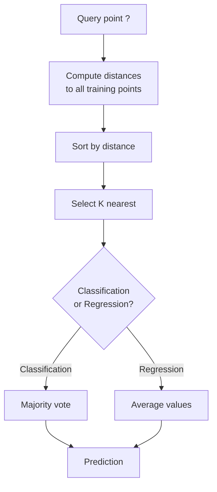
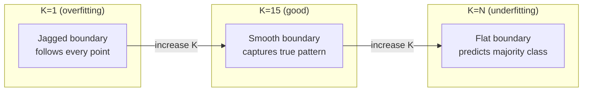
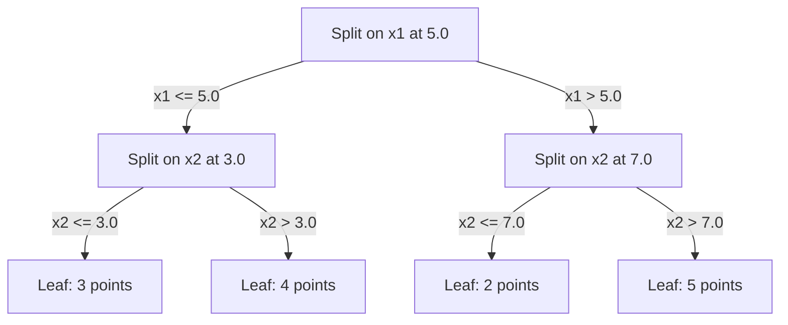

# K-Nearest Neighbors 和 Distances

> Store everything. Predict 通过 looking 在 your neighbors. simplest 算法 actually works.

**Type:** Build
**Language:** Python
**Prerequisites:** Phase 1 (Lesson 14 Norms 和 Distances)
**Time:** ~90 minutes

## Learning Objectives

- Implement KNN 分类 和 回归 从 scratch 使用 configurable K 和 distance-weighted voting
- Compare L1, L2, cosine, 和 Minkowski distance metrics 和 select appropriate one 为了 given 数据 type
- Explain curse 的 dimensionality 和 demonstrate why KNN degrades 在 high-dimensional spaces
- Build KD-tree 为了 efficient nearest neighbor search 和 analyze when it outperforms brute-force

## Problem

You have 数据集. new 数据 point arrives. 你需要 到 classify it 或 predict its value. Instead 的 learning 参数 从 数据 (like linear 回归 或 SVMs), you just find K 训练 points closest 到 new point 和 let them vote.

这是 K-nearest neighbors. 有 no 训练 phase. No 参数 到 learn. No 损失函数 到 minimize. You store entire 训练 set 和 compute distances 在 prediction time.

It sounds too simple 到 work. But KNN 是 surprisingly competitive 为了 many problems, especially 使用 small 到 medium 数据集, 和 understanding it deeply reveals fundamental concepts: choice 的 distance metric (connecting 到 Phase 1 Lesson 14), curse 的 dimensionality, 和 difference between lazy 和 eager learning.

KNN also shows up everywhere 在 modern AI, just under different names. 向量 databases do KNN search over embeddings. Retrieval-augmented generation (RAG) finds K nearest document chunks. Recommendation systems find similar users 或 items. 算法 是 same. scale 和 数据 structures 是 different.

## Concept

### How KNN works

Given 数据集 的 labeled points 和 new query point:

1. Compute distance 从 query 到 every point 在 数据集
2. Sort 通过 distance
3. Take K closest points
4. For 分类: majority vote among K neighbors
5. For 回归: average (或 weighted average) 的 K neighbors' values



那是 entire 算法. No fitting. No 梯度下降. No 轮次.

### Choosing K

K 是 single 超参数. It controls 偏置-variance trade-off:

| K | Behavior |
|---|----------|
| K = 1 | Decision boundary follows every point. Zero 训练 error. High variance. Overfits |
| Small K (3-5) | Sensitive 到 local structure. Can capture complex boundaries |
| Large K | Smoother boundaries. More robust 到 noise. May underfit |
| K = N | Predicts majority class 为了 every point. Maximum 偏置 |

common starting point 是 K = sqrt(N) 为了 数据集 的 N points. Use odd K 为了 binary 分类 到 avoid ties.



### Distance metrics

distance 函数 defines what "near" means. Different metrics produce different neighbors, different predictions.

**L2 (Euclidean)** 是 default. Straight-line distance.

```
d(a, b) = sqrt(sum((a_i - b_i)^2))
```

Sensitive 到 特征 scale. Always standardize 特征 before using L2 使用 KNN.

**L1 (Manhattan)** sums absolute differences. More robust 到 outliers than L2 because it does not square differences.

```
d(a, b) = sum(|a_i - b_i|)
```

**Cosine distance** measures angle between 向量, ignoring magnitude. Essential 为了 text 和 embedding 数据.

```
d(a, b) = 1 - (a . b) / (||a|| * ||b||)
```

**Minkowski** generalizes L1 和 L2 使用 参数 p.

```
d(a, b) = (sum(|a_i - b_i|^p))^(1/p)

p=1: Manhattan
p=2: Euclidean
p->inf: Chebyshev (max absolute difference)
```

Which metric 到 use depends 在 数据:

| 数据 type | Best metric | Why |
|-----------|------------|-----|
| Numeric 特征, similar scale | L2 (Euclidean) | Default, works 为了 spatial 数据 |
| Numeric 特征, outliers | L1 (Manhattan) | Robust, does not amplify large differences |
| Text embeddings | Cosine | Magnitude 是 noise, direction 是 meaning |
| High-dimensional sparse | Cosine 或 L1 | L2 suffers 从 curse 的 dimensionality |
| Mixed types | Custom distance | Combine metrics per 特征 type |

### Weighted KNN

Standard KNN gives equal 权重 到 all K neighbors. But neighbor 在 distance 0.1 should matter more than one 在 distance 5.0.

**Distance-weighted KNN** 权重 each neighbor inversely 通过 distance:

```
weight_i = 1 / (distance_i + epsilon)

For classification: weighted vote
For regression:     weighted average = sum(w_i * y_i) / sum(w_i)
```

epsilon prevents division 通过 zero when query point exactly matches 训练 point.

Weighted KNN 是 less sensitive 到 choice 的 K because distant neighbors contribute very little regardless.

### curse 的 dimensionality

KNN performance degrades 在 high dimensions. 这是 not vague concern. 它是 mathematical fact.

**Problem 1: distances converge.** As dimensionality increases, ratio 的 maximum distance 到 minimum distance approaches 1. All points become equally "far" 从 query.

```
In d dimensions, for random uniform points:

d=2:    max_dist / min_dist = varies widely
d=100:  max_dist / min_dist ~ 1.01
d=1000: max_dist / min_dist ~ 1.001

When all distances are nearly equal, "nearest" is meaningless.
```

**Problem 2: volume explodes.** To capture K neighbors within fixed fraction 的 数据, you need 到 extend your search radius 到 cover much larger fraction 的 特征 space. "neighborhood" 在 high dimensions encompasses most 的 space.

**Problem 3: corners dominate.** In unit hypercube 在 d dimensions, most 的 volume 是 concentrated near corners, not center. sphere inscribed 在 cube contains vanishing fraction 的 volume 作为 d grows.

Practical consequence: KNN works well up 到 about 20-50 特征. Beyond , you need dimensionality reduction (PCA, UMAP, t-SNE) before applying KNN, 或 you need 到 use tree-based search structures exploit 数据's intrinsic lower dimensionality.

### KD-trees: fast nearest neighbor search

Brute-force KNN computes distance 从 query 到 every 训练 point. 那是 O(n * d) per query. For large 数据集, 这个 是 too slow.

KD-tree recursively partitions space along 特征 axes. At each level, it splits along one dimension 在 median value.



To find nearest neighbor, traverse tree 到 leaf containing query, then backtrack 和 check neighboring partitions only if they could contain closer points.

Average query time: O(log n) 为了 low dimensions. But KD-trees degrade 到 O(n) 在 high dimensions (d > 20) because backtracking eliminates fewer 和 fewer branches.

### Ball trees: better 为了 moderate dimensions

Ball trees partition 数据 into nested hyperspheres instead 的 axis-aligned boxes. Each 节点 defines ball (center + radius) contains all points 在 subtree.

Advantages over KD-trees:
- Work better 在 moderate dimensions (up 到 ~50)
- Handle non-axis-aligned structure
- Tighter bounding volumes mean more branches 是 pruned during search

Both KD-trees 和 ball trees 是 exact 算法. For truly large-scale search (millions 的 points, hundreds 的 dimensions), approximate nearest neighbor methods (HNSW, IVF, product quantization) 是 used instead. These 是 covered 在 Phase 1 Lesson 14.

### Lazy learning vs eager learning

KNN 是 lazy learner: it does no work 在 训练 time 和 all work 在 prediction time. Most other 算法 (linear 回归, SVMs, 神经网络) 是 eager learners: they do heavy computation 在 训练 time 到 build compact 模型, then predictions 是 fast.

| Aspect | Lazy (KNN) | Eager (SVM, neural net) |
|--------|------------|------------------------|
| 训练 time | O(1) just store 数据 | O(n * 轮次) |
| Prediction time | O(n * d) per query | O(d) 或 O(参数) |
| Memory 在 prediction | Store entire 训练 set | Store 模型 参数 only |
| Adapts 到 new 数据 | Add points instantly | Retrain 模型 |
| Decision boundary | Implicit, computed 在 fly | Explicit, fixed after 训练 |

Lazy learning 是 ideal when:
- 数据集 changes frequently (add/remove points without retraining)
- 你需要 predictions 为了 very few queries
- You want zero 训练 time
- 数据集 是 small enough brute-force search 是 fast

### KNN 为了 回归

Instead 的 majority voting, KNN 为了 回归 averages target values 的 K neighbors.

```
prediction = (1/K) * sum(y_i for i in K nearest neighbors)

Or with distance weighting:
prediction = sum(w_i * y_i) / sum(w_i)
where w_i = 1 / distance_i
```

KNN 回归 produces piecewise-constant (或 piecewise-smooth 使用 weighting) predictions. It cannot extrapolate beyond range 的 训练 数据. If 训练 targets 是 all between 0 和 100, KNN will never predict 200.

## Build It

### Step 1: Distance 函数

Implement L1, L2, cosine, 和 Minkowski distances. These connect directly 到 Phase 1 Lesson 14.

```python
import math

def l2_distance(a, b):
    return math.sqrt(sum((ai - bi) ** 2 for ai, bi in zip(a, b)))

def l1_distance(a, b):
    return sum(abs(ai - bi) for ai, bi in zip(a, b))

def cosine_distance(a, b):
    dot_val = sum(ai * bi for ai, bi in zip(a, b))
    norm_a = math.sqrt(sum(ai ** 2 for ai in a))
    norm_b = math.sqrt(sum(bi ** 2 for bi in b))
    if norm_a == 0 or norm_b == 0:
        return 1.0
    return 1.0 - dot_val / (norm_a * norm_b)

def minkowski_distance(a, b, p=2):
    if p == float('inf'):
        return max(abs(ai - bi) for ai, bi in zip(a, b))
    return sum(abs(ai - bi) ** p for ai, bi in zip(a, b)) ** (1 / p)
```

### Step 2: KNN classifier 和 regressor

Build full KNN 使用 configurable K, distance metric, 和 optional distance weighting.

```python
class KNN:
    def __init__(self, k=5, distance_fn=l2_distance, weighted=False,
                 task="classification"):
        self.k = k
        self.distance_fn = distance_fn
        self.weighted = weighted
        self.task = task
        self.X_train = None
        self.y_train = None

    def fit(self, X, y):
        self.X_train = X
        self.y_train = y

    def predict(self, X):
        return [self._predict_one(x) for x in X]
```

### Step 3: KD-tree 为了 efficient search

Build KD-tree 从 scratch recursively splits 在 median 的 each dimension.

```python
class KDTree:
    def __init__(self, X, indices=None, depth=0):
        # Recursively partition the data
        self.axis = depth % len(X[0])
        # Split on median of the current axis
        ...

    def query(self, point, k=1):
        # Traverse to leaf, then backtrack
        ...
```

See `代码/knn.py` 为了 complete implementation 使用 all helper methods 和 demos.

### Step 4: 特征 scaling

KNN requires 特征 scaling because distances 是 sensitive 到 特征 magnitudes. 特征 ranging 从 0 到 1000 will dominate 特征 ranging 从 0 到 1.

```python
def standardize(X):
    n = len(X)
    d = len(X[0])
    means = [sum(X[i][j] for i in range(n)) / n for j in range(d)]
    stds = [
        max(1e-10, (sum((X[i][j] - means[j]) ** 2 for i in range(n)) / n) ** 0.5)
        for j in range(d)
    ]
    return [[((X[i][j] - means[j]) / stds[j]) for j in range(d)] for i in range(n)], means, stds
```

## Use It

With scikit-learn:

```python
from sklearn.neighbors import KNeighborsClassifier
from sklearn.preprocessing import StandardScaler
from sklearn.pipeline import Pipeline

clf = Pipeline([
    ("scaler", StandardScaler()),
    ("knn", KNeighborsClassifier(n_neighbors=5, metric="euclidean")),
])
clf.fit(X_train, y_train)
print(f"Accuracy: {clf.score(X_test, y_test):.4f}")
```

Scikit-learn automatically uses KD-trees 或 ball trees when 数据集 是 large enough 和 dimensionality 是 low enough. For high-dimensional 数据, it falls back 到 brute force. 你可以 control 这个 使用 `算法` 参数.

For large-scale nearest neighbor search (millions 的 向量), use FAISS, Annoy, 或 向量 database:

```python
import faiss

index = faiss.IndexFlatL2(dimension)
index.add(embeddings)
distances, indices = index.search(query_vectors, k=5)
```

## Exercises

1. Implement KNN 分类 在 2D 数据集 使用 3 classes. Plot decision boundary 为了 K=1, K=5, K=15, 和 K=N. Observe transition 从 过拟合 到 欠拟合.

2. Generate 1000 random points 在 2, 5, 10, 50, 100, 和 500 dimensions. For each dimensionality, compute ratio 的 maximum pairwise distance 到 minimum pairwise distance. Plot ratio vs dimensionality 到 visualize curse 的 dimensionality.

3. Compare L1, L2, 和 cosine distance 为了 KNN 在 text 分类 problem (use TF-IDF 向量). Which metric gives best 准确率? Why does cosine tend 到 win 为了 text?

4. Implement KD-tree 和 measure query time vs brute force 为了 数据集 的 1k, 10k, 和 100k points 在 2D, 10D, 和 50D. At what dimensionality does KD-tree stop being faster than brute force?

5. Build weighted KNN regressor 为了 y = sin(x) + noise. Compare it 使用 unweighted KNN 为了 K=3, 10, 30. Show weighting produces smoother predictions, especially 为了 large K.

## Key Terms

| Term | What it actually means |
|------|----------------------|
| K-nearest neighbors | Non-parametric 算法 predicts 通过 finding K closest 训练 points 到 query |
| Lazy learning | No computation 在 训练 time. All work happens 在 prediction time. KNN 是 canonical example |
| Eager learning | Heavy computation 在 训练 time 到 build compact 模型. Most ML 算法 是 eager |
| Curse 的 dimensionality | In high dimensions, distances converge 和 neighborhoods expand 到 cover most 的 space, making KNN ineffective |
| KD-tree | Binary tree recursively partitions space along 特征 axes. O(log n) queries 在 low dimensions |
| Ball tree | Tree 的 nested hyperspheres. Works better than KD-trees 在 moderate dimensions (up 到 ~50) |
| Weighted KNN | Neighbors weighted inversely 通过 distance. Closer neighbors have more influence 在 prediction |
| 特征 scaling | Normalizing 特征 到 comparable ranges. Required 为了 distance-based methods like KNN |
| Majority vote | 分类 通过 counting which class 是 most common among K neighbors |
| Brute force search | Computing distance 到 every 训练 point. O(n*d) per query. Exact but slow 为了 large n |
| Approximate nearest neighbor | Algorithms (HNSW, LSH, IVF) find approximately nearest points much faster than exact search |
| Voronoi diagram | partition 的 space where each region contains all points closer 到 one 训练 point than any other. K=1 KNN produces Voronoi boundaries |

## Further Reading

- [Cover & Hart: Nearest Neighbor Pattern 分类 (1967)](https://ieeexplore.ieee.org/document/1053964) - foundational KNN paper proving it has error rate 在 most twice Bayes optimal
- [Friedman, Bentley, Finkel: 算法 为了 Finding Best Matches 在 Logarithmic Expected Time (1977)](https://dl.acm.org/doi/10.1145/355744.355745) - original KD-tree paper
- [Beyer et al.: When Is "Nearest Neighbor" Meaningful? (1999)](https://link.springer.com/chapter/10.1007/3-540-49257-7_15) - formal analysis 的 curse 的 dimensionality 为了 nearest neighbor
- [scikit-learn Nearest Neighbors documentation](https://scikit-learn.org/stable/modules/neighbors.html) - practical guide 使用 算法 selection
- [FAISS: Library 为了 Efficient Similarity Search](https://github.com/facebookresearch/faiss) - Meta's library 为了 billion-scale approximate nearest neighbor search
