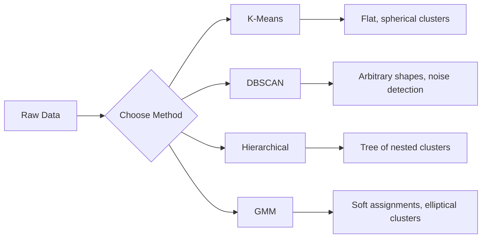

# Unsupervised Learning

> No labels, no teacher. 算法 finds structure 在 its own.

**Type:** Build
**Languages:** Python
**Prerequisites:** Phase 1 (Norms & Distances, 概率 & Distributions), Phase 2 Lessons 1-6
**Time:** ~90 minutes

## Learning Objectives

- Implement K-Means, DBSCAN, 和 Gaussian Mixture Models 从 scratch 和 compare their 聚类 behavior
- Evaluate cluster quality using silhouette score 和 elbow method 到 select optimal K
- Explain when DBSCAN outperforms K-Means 和 identify which 算法 handles non-spherical clusters 和 outliers
- Build anomaly detection pipeline using 聚类 methods 到 flag points deviate 从 normal patterns

## Problem

Every ML lesson so far has assumed labeled 数据: "here 是 输入, here 是 correct 输出." In real world, labels 是 expensive. hospital has millions 的 patient records but no one has manually tagged each one 使用 disease category. e-commerce site has millions 的 user sessions but no one has hand-labeled customer segments. security team has network logs but nobody has flagged every anomaly.

Unsupervised learning finds patterns without being told what 到 look 为了. It groups similar 数据 points, discovers hidden structures, 和 surfaces anomalies. If supervised learning 是 learning 从 textbook 使用 answer key, unsupervised learning 是 staring 在 raw 数据 until patterns reveal themselves.

catch: without labels, you cannot directly measure "right" 或 "wrong." 你需要 different tools 到 evaluate whether structure your 算法 found 是 meaningful.

## Concept

### 聚类: Grouping Similar Things Together

聚类 assigns each 数据 point 到 group (cluster) so points within same group 是 more similar 到 each other than 到 points 在 other groups. question 是 always: what does "similar" mean?



### K-Means: Workhorse

K-Means partitions 数据 into exactly K clusters. Each cluster has centroid (its center 的 mass), 和 every point belongs 到 nearest centroid.

Lloyd's 算法:

1. Pick K random points 作为 initial centroids
2. Assign each 数据 point 到 nearest centroid
3. Recompute each centroid 作为 mean 的 its assigned points
4. Repeat steps 2-3 until assignments stop changing

objective 函数 (inertia) measures total squared distance 从 each point 到 its assigned centroid. K-Means minimizes 这个, but only finds local minimum. Different initializations can give different results.

### Choosing K

Two standard methods:

**Elbow method:** Run K-Means 为了 K = 1, 2, 3, ..., n. Plot inertia vs K. Look 为了 "elbow" where adding more clusters stops reducing inertia significantly.

**Silhouette score:** For each point, measure how similar it 是 到 its own cluster () versus nearest other cluster (b). silhouette coefficient 是 (b - ) / max(, b), ranging 从 -1 (wrong cluster) 到 +1 (well-clustered). Average across all points 为了 global score.

### DBSCAN: Density-Based 聚类

K-Means assumes clusters 是 spherical 和 requires you 到 pick K upfront. DBSCAN makes neither assumption. It finds clusters 作为 dense regions separated 通过 sparse regions.

Two 参数:
- **eps**: radius 的 neighborhood
- **min_samples**: minimum number 的 points needed 到 form dense region

Three types 的 points:
- **Core point**: has 在 least min_samples points within eps distance
- **Border point**: within eps 的 core point but not itself core point
- **Noise point**: neither core nor border. These 是 outliers.

DBSCAN connects core points 是 within eps 的 each other into same cluster. Border points join cluster 的 nearby core point. Noise points belong 到 no cluster.

Strengths: finds clusters 的 any shape, automatically determines number 的 clusters, identifies outliers. Weakness: struggles 使用 clusters 的 varying densities.

### Hierarchical 聚类

Builds tree (dendrogram) 的 nested clusters.

Agglomerative (bottom-up):
1. Start 使用 each point 作为 its own cluster
2. Merge two closest clusters
3. Repeat until only one cluster remains
4. Cut dendrogram 在 desired level 到 get K clusters

"closeness" between clusters can be measured 作为:
- **Single linkage**: minimum distance between any two points 在 two clusters
- **Complete linkage**: maximum distance between any two points
- **Average linkage**: average distance between all pairs
- **Ward's method**: merge causes smallest increase 在 total within-cluster variance

### Gaussian Mixture Models (GMM)

K-Means gives hard assignments: each point belongs 到 exactly one cluster. GMM gives soft assignments: each point has 概率 的 belonging 到 each cluster.

GMM assumes 数据 是 generated 从 mixture 的 K Gaussian distributions, each 使用 its own mean 和 covariance. Expectation-Maximization (EM) 算法 alternates between:

- **E-step**: compute 概率 each point belongs 到 each Gaussian
- **M-step**: update mean, covariance, 和 mixing 权重 的 each Gaussian 到 maximize likelihood 的 数据

GMM can 模型 elliptical clusters (not just spherical like K-Means) 和 naturally handles overlapping clusters.

### When 到 Use Which

| Method | Best 为了 | Avoid when |
|--------|----------|------------|
| K-Means | Large 数据集, spherical clusters, known K | Irregular shapes, outliers present |
| DBSCAN | Unknown K, arbitrary shapes, outlier detection | Varying densities, very high dimensions |
| Hierarchical | Small 数据集, need dendrogram, unknown K | Large 数据集 (O(n^2) memory) |
| GMM | Overlapping clusters, soft assignments needed | Very large 数据集, too many dimensions |

### Anomaly Detection 使用 聚类

聚类 naturally supports anomaly detection:
- **K-Means**: points far 从 any centroid 是 anomalies
- **DBSCAN**: noise points 是 anomalies 通过 definition
- **GMM**: points 使用 low 概率 under all Gaussians 是 anomalies

## Build It

### Step 1: K-Means 从 scratch

```python
import math
import random


def euclidean_distance(a, b):
    return math.sqrt(sum((ai - bi) ** 2 for ai, bi in zip(a, b)))


def kmeans(data, k, max_iterations=100, seed=42):
    random.seed(seed)
    n_features = len(data[0])

    centroids = random.sample(data, k)

    for iteration in range(max_iterations):
        clusters = [[] for _ in range(k)]
        assignments = []

        for point in data:
            distances = [euclidean_distance(point, c) for c in centroids]
            nearest = distances.index(min(distances))
            clusters[nearest].append(point)
            assignments.append(nearest)

        new_centroids = []
        for cluster in clusters:
            if len(cluster) == 0:
                new_centroids.append(random.choice(data))
                continue
            centroid = [
                sum(point[j] for point in cluster) / len(cluster)
                for j in range(n_features)
            ]
            new_centroids.append(centroid)

        if all(
            euclidean_distance(old, new) < 1e-6
            for old, new in zip(centroids, new_centroids)
        ):
            print(f"  Converged at iteration {iteration + 1}")
            break

        centroids = new_centroids

    return assignments, centroids
```

### Step 2: Elbow method 和 silhouette score

```python
def compute_inertia(data, assignments, centroids):
    total = 0.0
    for point, cluster_id in zip(data, assignments):
        total += euclidean_distance(point, centroids[cluster_id]) ** 2
    return total


def silhouette_score(data, assignments):
    n = len(data)
    if n < 2:
        return 0.0

    clusters = {}
    for i, c in enumerate(assignments):
        clusters.setdefault(c, []).append(i)

    if len(clusters) < 2:
        return 0.0

    scores = []
    for i in range(n):
        own_cluster = assignments[i]
        own_members = [j for j in clusters[own_cluster] if j != i]

        if len(own_members) == 0:
            scores.append(0.0)
            continue

        a = sum(euclidean_distance(data[i], data[j]) for j in own_members) / len(own_members)

        b = float("inf")
        for cluster_id, members in clusters.items():
            if cluster_id == own_cluster:
                continue
            avg_dist = sum(euclidean_distance(data[i], data[j]) for j in members) / len(members)
            b = min(b, avg_dist)

        if max(a, b) == 0:
            scores.append(0.0)
        else:
            scores.append((b - a) / max(a, b))

    return sum(scores) / len(scores)


def find_best_k(data, max_k=10):
    print("Elbow method:")
    inertias = []
    for k in range(1, max_k + 1):
        assignments, centroids = kmeans(data, k)
        inertia = compute_inertia(data, assignments, centroids)
        inertias.append(inertia)
        print(f"  K={k}: inertia={inertia:.2f}")

    print("\nSilhouette scores:")
    for k in range(2, max_k + 1):
        assignments, centroids = kmeans(data, k)
        score = silhouette_score(data, assignments)
        print(f"  K={k}: silhouette={score:.4f}")

    return inertias
```

### Step 3: DBSCAN 从 scratch

```python
def dbscan(data, eps, min_samples):
    n = len(data)
    labels = [-1] * n
    cluster_id = 0

    def region_query(point_idx):
        neighbors = []
        for i in range(n):
            if euclidean_distance(data[point_idx], data[i]) <= eps:
                neighbors.append(i)
        return neighbors

    visited = [False] * n

    for i in range(n):
        if visited[i]:
            continue
        visited[i] = True

        neighbors = region_query(i)

        if len(neighbors) < min_samples:
            labels[i] = -1
            continue

        labels[i] = cluster_id
        seed_set = list(neighbors)
        seed_set.remove(i)

        j = 0
        while j < len(seed_set):
            q = seed_set[j]

            if not visited[q]:
                visited[q] = True
                q_neighbors = region_query(q)
                if len(q_neighbors) >= min_samples:
                    for nb in q_neighbors:
                        if nb not in seed_set:
                            seed_set.append(nb)

            if labels[q] == -1:
                labels[q] = cluster_id

            j += 1

        cluster_id += 1

    return labels
```

### Step 4: Gaussian Mixture 模型 (EM 算法)

```python
def gmm(data, k, max_iterations=100, seed=42):
    random.seed(seed)
    n = len(data)
    d = len(data[0])

    indices = random.sample(range(n), k)
    means = [list(data[i]) for i in indices]
    variances = [1.0] * k
    weights = [1.0 / k] * k

    def gaussian_pdf(x, mean, variance):
        d = len(x)
        coeff = 1.0 / ((2 * math.pi * variance) ** (d / 2))
        exponent = -sum((xi - mi) ** 2 for xi, mi in zip(x, mean)) / (2 * variance)
        return coeff * math.exp(max(exponent, -500))

    for iteration in range(max_iterations):
        responsibilities = []
        for i in range(n):
            probs = []
            for j in range(k):
                probs.append(weights[j] * gaussian_pdf(data[i], means[j], variances[j]))
            total = sum(probs)
            if total == 0:
                total = 1e-300
            responsibilities.append([p / total for p in probs])

        old_means = [list(m) for m in means]

        for j in range(k):
            r_sum = sum(responsibilities[i][j] for i in range(n))
            if r_sum < 1e-10:
                continue

            weights[j] = r_sum / n

            for dim in range(d):
                means[j][dim] = sum(
                    responsibilities[i][j] * data[i][dim] for i in range(n)
                ) / r_sum

            variances[j] = sum(
                responsibilities[i][j]
                * sum((data[i][dim] - means[j][dim]) ** 2 for dim in range(d))
                for i in range(n)
            ) / (r_sum * d)
            variances[j] = max(variances[j], 1e-6)

        shift = sum(
            euclidean_distance(old_means[j], means[j]) for j in range(k)
        )
        if shift < 1e-6:
            print(f"  GMM converged at iteration {iteration + 1}")
            break

    assignments = []
    for i in range(n):
        assignments.append(responsibilities[i].index(max(responsibilities[i])))

    return assignments, means, weights, responsibilities
```

### Step 5: Generate test 数据 和 run everything

```python
def make_blobs(centers, n_per_cluster=50, spread=0.5, seed=42):
    random.seed(seed)
    data = []
    true_labels = []
    for label, (cx, cy) in enumerate(centers):
        for _ in range(n_per_cluster):
            x = cx + random.gauss(0, spread)
            y = cy + random.gauss(0, spread)
            data.append([x, y])
            true_labels.append(label)
    return data, true_labels


def make_moons(n_samples=200, noise=0.1, seed=42):
    random.seed(seed)
    data = []
    labels = []
    n_half = n_samples // 2
    for i in range(n_half):
        angle = math.pi * i / n_half
        x = math.cos(angle) + random.gauss(0, noise)
        y = math.sin(angle) + random.gauss(0, noise)
        data.append([x, y])
        labels.append(0)
    for i in range(n_half):
        angle = math.pi * i / n_half
        x = 1 - math.cos(angle) + random.gauss(0, noise)
        y = 1 - math.sin(angle) - 0.5 + random.gauss(0, noise)
        data.append([x, y])
        labels.append(1)
    return data, labels


if __name__ == "__main__":
    centers = [[2, 2], [8, 3], [5, 8]]
    data, true_labels = make_blobs(centers, n_per_cluster=50, spread=0.8)

    print("=== K-Means on 3 blobs ===")
    assignments, centroids = kmeans(data, k=3)
    print(f"  Centroids: {[[round(c, 2) for c in cent] for cent in centroids]}")
    sil = silhouette_score(data, assignments)
    print(f"  Silhouette score: {sil:.4f}")

    print("\n=== Elbow Method ===")
    find_best_k(data, max_k=6)

    print("\n=== DBSCAN on 3 blobs ===")
    db_labels = dbscan(data, eps=1.5, min_samples=5)
    n_clusters = len(set(db_labels) - {-1})
    n_noise = db_labels.count(-1)
    print(f"  Found {n_clusters} clusters, {n_noise} noise points")

    print("\n=== GMM on 3 blobs ===")
    gmm_assignments, gmm_means, gmm_weights, _ = gmm(data, k=3)
    print(f"  Means: {[[round(m, 2) for m in mean] for mean in gmm_means]}")
    print(f"  Weights: {[round(w, 3) for w in gmm_weights]}")
    gmm_sil = silhouette_score(data, gmm_assignments)
    print(f"  Silhouette score: {gmm_sil:.4f}")

    print("\n=== DBSCAN on moons (non-spherical clusters) ===")
    moon_data, moon_labels = make_moons(n_samples=200, noise=0.1)
    moon_db = dbscan(moon_data, eps=0.3, min_samples=5)
    n_moon_clusters = len(set(moon_db) - {-1})
    n_moon_noise = moon_db.count(-1)
    print(f"  Found {n_moon_clusters} clusters, {n_moon_noise} noise points")

    print("\n=== K-Means on moons (will fail to separate) ===")
    moon_km, moon_centroids = kmeans(moon_data, k=2)
    moon_sil = silhouette_score(moon_data, moon_km)
    print(f"  Silhouette score: {moon_sil:.4f}")
    print("  K-Means splits moons poorly because they are not spherical")

    print("\n=== Anomaly detection with DBSCAN ===")
    anomaly_data = list(data)
    anomaly_data.append([20.0, 20.0])
    anomaly_data.append([-5.0, -5.0])
    anomaly_data.append([15.0, 0.0])
    anomaly_labels = dbscan(anomaly_data, eps=1.5, min_samples=5)
    anomalies = [
        anomaly_data[i]
        for i in range(len(anomaly_labels))
        if anomaly_labels[i] == -1
    ]
    print(f"  Detected {len(anomalies)} anomalies")
    for a in anomalies[-3:]:
        print(f"    Point {[round(v, 2) for v in a]}")
```

## Use It

With scikit-learn, same 算法 是 one-liners:

```python
from sklearn.cluster import KMeans, DBSCAN, AgglomerativeClustering
from sklearn.mixture import GaussianMixture
from sklearn.metrics import silhouette_score as sklearn_silhouette

km = KMeans(n_clusters=3, random_state=42).fit(data)
db = DBSCAN(eps=1.5, min_samples=5).fit(data)
agg = AgglomerativeClustering(n_clusters=3).fit(data)
gmm_model = GaussianMixture(n_components=3, random_state=42).fit(data)
```

从-scratch versions show you exactly what 这些 libraries compute. K-Means iterates between assigning 和 recomputing. DBSCAN grows clusters 从 dense seeds. GMM alternates between expectation 和 maximization. library versions add numerical stability, smarter initialization (K-Means++), 和 GPU acceleration, but core logic 是 same.

## Ship It

This lesson produces working implementations 的 K-Means, DBSCAN, 和 GMM 从 scratch. 聚类 代码 can be reused 作为 foundation 为了 more advanced unsupervised methods.

## Exercises

1. Implement K-Means++ initialization: instead 的 picking random centroids, pick first randomly 和 each subsequent centroid 使用 概率 proportional 到 its squared distance 从 nearest existing centroid. Compare 收敛 speed 到 random initialization.
2. Add hierarchical agglomerative 聚类 到 代码. Implement Ward's linkage 和 produce dendrogram (作为 nested list 的 merges). Cut it 在 different levels 和 compare 到 K-Means results.
3. Build simple anomaly detection pipeline: run DBSCAN 和 GMM 在 same 数据, flag points both methods agree 是 outliers (noise 在 DBSCAN, low 概率 在 GMM). Measure overlap 和 discuss when methods disagree.

## Key Terms

| Term | What people say | What it actually means |
|------|----------------|----------------------|
| 聚类 | "Grouping similar things" | Partitioning 数据 into subsets where within-group similarity exceeds between-group similarity, measured 通过 specific distance metric |
| Centroid | " center 的 cluster" | mean 的 all points assigned 到 cluster; used 通过 K-Means 作为 cluster representative |
| Inertia | "How tight clusters 是" | Sum 的 squared distances 从 each point 到 its assigned centroid; lower 是 tighter |
| Silhouette score | "How well-separated clusters 是" | For each point, (b - ) / max(, b) where 是 mean intra-cluster distance 和 b 是 mean nearest-cluster distance |
| Core point | " point 在 dense region" | point 使用 在 least min_samples neighbors within eps distance, 在 DBSCAN |
| EM 算法 | "Soft K-Means" | Expectation-Maximization: iteratively compute membership probabilities (E-step) 和 update distribution 参数 (M-step) |
| Dendrogram | " tree 的 clusters" | tree diagram showing order 和 distance 在 which clusters were merged 在 hierarchical 聚类 |
| Anomaly | " outlier" | 数据 point does not conform 到 expected pattern, identified 作为 noise 通过 DBSCAN 或 low-概率 通过 GMM |

## Further Reading

- [Stanford CS229 - Unsupervised Learning](https://cs229.stanford.edu/notes2022fall/main_notes.pdf) - Andrew Ng's lecture notes 在 聚类 和 EM
- [scikit-learn 聚类 Guide](https://scikit-learn.org/stable/modules/聚类.html) - practical comparison 的 all 聚类 算法 使用 visual examples
- [DBSCAN original paper (Ester et al., 1996)](https://www.aaai.org/Papers/KDD/1996/KDD96-037.pdf) - paper introduced density-based 聚类
