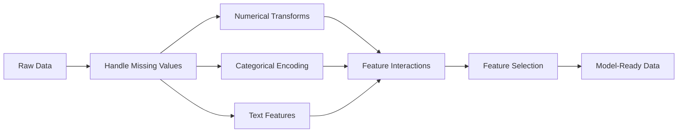

# 特征 Engineering & Selection

> good 特征 是 worth thousand 数据 points.

**Type:** Build
**Languages:** Python
**Prerequisites:** Phase 1 (统计学 为了 ML, 线性代数), Phase 2 Lessons 1-7
**Time:** ~90 minutes

## Learning Objectives

- Implement numerical transforms (standardization, min-max scaling, log transform, binning) 和 explain when each 是 appropriate
- Build one-hot, label, 和 target encoding 为了 categorical 特征 和 identify 数据 leakage risk 在 target encoding
- Construct TF-IDF vectorizer 从 scratch 和 explain why it outperforms raw word counts 为了 text 分类
- Apply filter-based 特征 selection (variance threshold, correlation, mutual information) 到 reduce dimensionality

## Problem

You have 数据集. You pick 算法. You train it. results 是 mediocre. You try fancier 算法. Still mediocre. You spend week tuning 超参数. Marginal improvement.

Then someone transforms raw 数据 into better 特征 和 simple logistic 回归 beats your tuned gradient-boosted ensemble.

This happens constantly. In classical ML, representation 的 数据 matters more than choice 的 算法. house price 模型 使用 "square footage" 和 "number 的 bedrooms" will beat 模型 使用 "address 作为 raw string" no matter how sophisticated learner 是. 算法 can only work 使用 what you give it.

特征 engineering 是 process 的 transforming raw 数据 into representations make patterns easier 为了 模型 到 find. 特征 selection 是 process 的 throwing away 特征 add noise without adding signal. Together, they 是 highest-leverage activity 在 classical ML.

## Concept

### 特征 Pipeline



### Numerical Features

Raw numbers 是 rarely 模型-ready. Common transforms:

**Scaling:** Put 特征 在 same range so distance-based 算法 (K-Means, KNN, SVM) treat all 特征 equally. Min-max scaling maps 到 [0, 1]. Standardization (z-score) maps 到 mean=0, std=1.

**Log transform:** Compresses right-skewed distributions (income, population, word counts). Turns multiplicative relationships into additive ones.

**Binning:** Converts continuous values into categories. Useful when relationship between 特征 和 target 是 non-linear but step-wise (e.g., age groups).

**Polynomial 特征:** Creates x^2, x^3, x1*x2 terms. Lets linear 模型 capture non-linear relationships 在 cost 的 more 特征.

### Categorical Features

Models need numbers. Categories need encoding.

**One-hot encoding:** Creates binary column 为了 each category. "color = red/blue/green" becomes three columns: is_red, is_blue, is_green. Works well 为了 low-cardinality 特征 but explodes 使用 many categories.

**Label encoding:** Maps each category 到 integer: red=0, blue=1, green=2. Introduces false ordering ( 模型 might think green > blue > red). Only appropriate 为了 tree-based 模型 split 在 individual values.

**Target encoding:** Replaces each category 使用 mean 的 target variable 为了 category. Powerful but dangerous: high risk 的 数据 leakage. Must be computed only 在 训练 数据 和 applied 到 test 数据.

### Text Features

**Count vectorizer:** Counts how many times each word appears 在 document. " cat sat 在 mat" becomes {: 2, cat: 1, sat: 1, 在: 1, mat: 1}.

**TF-IDF:** Term Frequency-Inverse Document Frequency. Weighs words 通过 how unique they 是 across documents. Common words like "" get low 权重. Rare, distinctive words get high 权重.

```
TF(word, doc) = count(word in doc) / total words in doc
IDF(word) = log(total docs / docs containing word)
TF-IDF = TF * IDF
```

### Missing Values

Real 数据 has holes. Strategies:

- **Drop rows:** Only when missing 数据 是 rare 和 random
- **Mean/median imputation:** Simple, preserves distribution shape (median 是 more robust 到 outliers)
- **Mode imputation:** For categorical 特征
- **Indicator column:** Add binary column "was_this_missing" before imputing. fact 数据 是 missing can itself be informative
- **Forward/backward fill:** For time series 数据

### 特征 Interaction

Sometimes relationship 是 在 combination. "Height" 和 "权重" alone 是 less predictive than "BMI = 权重 / height^2". 特征 interactions multiply 特征 space, so use domain knowledge 到 pick right ones.

### 特征 Selection

More 特征 是 not always better. Irrelevant 特征 add noise, increase 训练 time, 和 can cause 过拟合.

**Filter methods (pre-模型):**
- Correlation: remove 特征 highly correlated 使用 each other (redundant)
- Mutual information: measures how much knowing 特征 reduces uncertainty about target
- Variance threshold: remove 特征 barely vary

**Wrapper methods (模型-based):**
- L1 正则化 (Lasso): drives irrelevant 特征 权重 到 exactly zero
- Recursive 特征 elimination: train, remove least important 特征, repeat

**Why selection matters:** 模型 使用 10 good 特征 will usually outperform 模型 使用 10 good 特征 和 90 noisy ones. noisy 特征 give 模型 opportunities 到 overfit 在 训练 数据 patterns do not generalize.

## Build It

### Step 1: Numerical transforms 从 scratch

```python
import math


def min_max_scale(values):
    min_val = min(values)
    max_val = max(values)
    if max_val == min_val:
        return [0.0] * len(values)
    return [(v - min_val) / (max_val - min_val) for v in values]


def standardize(values):
    n = len(values)
    mean = sum(values) / n
    variance = sum((v - mean) ** 2 for v in values) / n
    std = math.sqrt(variance) if variance > 0 else 1.0
    return [(v - mean) / std for v in values]


def log_transform(values):
    return [math.log(v + 1) for v in values]


def bin_values(values, n_bins=5):
    min_val = min(values)
    max_val = max(values)
    bin_width = (max_val - min_val) / n_bins
    if bin_width == 0:
        return [0] * len(values)
    result = []
    for v in values:
        bin_idx = int((v - min_val) / bin_width)
        bin_idx = min(bin_idx, n_bins - 1)
        result.append(bin_idx)
    return result


def polynomial_features(row, degree=2):
    n = len(row)
    result = list(row)
    if degree >= 2:
        for i in range(n):
            result.append(row[i] ** 2)
        for i in range(n):
            for j in range(i + 1, n):
                result.append(row[i] * row[j])
    return result
```

### Step 2: Categorical encoding 从 scratch

```python
def one_hot_encode(values):
    categories = sorted(set(values))
    cat_to_idx = {cat: i for i, cat in enumerate(categories)}
    n_cats = len(categories)

    encoded = []
    for v in values:
        row = [0] * n_cats
        row[cat_to_idx[v]] = 1
        encoded.append(row)

    return encoded, categories


def label_encode(values):
    categories = sorted(set(values))
    cat_to_int = {cat: i for i, cat in enumerate(categories)}
    return [cat_to_int[v] for v in values], cat_to_int


def target_encode(feature_values, target_values, smoothing=10):
    global_mean = sum(target_values) / len(target_values)

    category_stats = {}
    for feat, target in zip(feature_values, target_values):
        if feat not in category_stats:
            category_stats[feat] = {"sum": 0.0, "count": 0}
        category_stats[feat]["sum"] += target
        category_stats[feat]["count"] += 1

    encoding = {}
    for cat, stats in category_stats.items():
        cat_mean = stats["sum"] / stats["count"]
        weight = stats["count"] / (stats["count"] + smoothing)
        encoding[cat] = weight * cat_mean + (1 - weight) * global_mean

    return [encoding[v] for v in feature_values], encoding
```

### Step 3: Text 特征 从 scratch

```python
def count_vectorize(documents):
    vocab = {}
    idx = 0
    for doc in documents:
        for word in doc.lower().split():
            if word not in vocab:
                vocab[word] = idx
                idx += 1

    vectors = []
    for doc in documents:
        vec = [0] * len(vocab)
        for word in doc.lower().split():
            vec[vocab[word]] += 1
        vectors.append(vec)

    return vectors, vocab


def tfidf(documents):
    n_docs = len(documents)

    vocab = {}
    idx = 0
    for doc in documents:
        for word in doc.lower().split():
            if word not in vocab:
                vocab[word] = idx
                idx += 1

    doc_freq = {}
    for doc in documents:
        seen = set()
        for word in doc.lower().split():
            if word not in seen:
                doc_freq[word] = doc_freq.get(word, 0) + 1
                seen.add(word)

    vectors = []
    for doc in documents:
        words = doc.lower().split()
        word_count = len(words)
        tf_map = {}
        for word in words:
            tf_map[word] = tf_map.get(word, 0) + 1

        vec = [0.0] * len(vocab)
        for word, count in tf_map.items():
            tf = count / word_count
            idf = math.log(n_docs / doc_freq[word])
            vec[vocab[word]] = tf * idf
        vectors.append(vec)

    return vectors, vocab
```

### Step 4: Missing value imputation 从 scratch

```python
def impute_mean(values):
    present = [v for v in values if v is not None]
    if not present:
        return [0.0] * len(values), 0.0
    mean = sum(present) / len(present)
    return [v if v is not None else mean for v in values], mean


def impute_median(values):
    present = sorted(v for v in values if v is not None)
    if not present:
        return [0.0] * len(values), 0.0
    n = len(present)
    if n % 2 == 0:
        median = (present[n // 2 - 1] + present[n // 2]) / 2
    else:
        median = present[n // 2]
    return [v if v is not None else median for v in values], median


def impute_mode(values):
    present = [v for v in values if v is not None]
    if not present:
        return values, None
    counts = {}
    for v in present:
        counts[v] = counts.get(v, 0) + 1
    mode = max(counts, key=counts.get)
    return [v if v is not None else mode for v in values], mode


def add_missing_indicator(values):
    return [0 if v is not None else 1 for v in values]
```

### Step 5: 特征 selection 从 scratch

```python
def correlation(x, y):
    n = len(x)
    mean_x = sum(x) / n
    mean_y = sum(y) / n
    cov = sum((xi - mean_x) * (yi - mean_y) for xi, yi in zip(x, y)) / n
    std_x = math.sqrt(sum((xi - mean_x) ** 2 for xi in x) / n)
    std_y = math.sqrt(sum((yi - mean_y) ** 2 for yi in y) / n)
    if std_x == 0 or std_y == 0:
        return 0.0
    return cov / (std_x * std_y)


def mutual_information(feature, target, n_bins=10):
    feat_min = min(feature)
    feat_max = max(feature)
    bin_width = (feat_max - feat_min) / n_bins if feat_max != feat_min else 1.0
    feat_binned = [
        min(int((f - feat_min) / bin_width), n_bins - 1) for f in feature
    ]

    n = len(feature)
    target_classes = sorted(set(target))

    feat_bins = sorted(set(feat_binned))
    p_feat = {}
    for b in feat_bins:
        p_feat[b] = feat_binned.count(b) / n

    p_target = {}
    for t in target_classes:
        p_target[t] = target.count(t) / n

    mi = 0.0
    for b in feat_bins:
        for t in target_classes:
            joint_count = sum(
                1 for fb, tv in zip(feat_binned, target) if fb == b and tv == t
            )
            p_joint = joint_count / n
            if p_joint > 0:
                mi += p_joint * math.log(p_joint / (p_feat[b] * p_target[t]))

    return mi


def variance_threshold(features, threshold=0.01):
    n_features = len(features[0])
    n_samples = len(features)
    selected = []

    for j in range(n_features):
        col = [features[i][j] for i in range(n_samples)]
        mean = sum(col) / n_samples
        var = sum((v - mean) ** 2 for v in col) / n_samples
        if var >= threshold:
            selected.append(j)

    return selected


def remove_correlated(features, threshold=0.9):
    n_features = len(features[0])
    n_samples = len(features)

    to_remove = set()
    for i in range(n_features):
        if i in to_remove:
            continue
        col_i = [features[r][i] for r in range(n_samples)]
        for j in range(i + 1, n_features):
            if j in to_remove:
                continue
            col_j = [features[r][j] for r in range(n_samples)]
            corr = abs(correlation(col_i, col_j))
            if corr >= threshold:
                to_remove.add(j)

    return [i for i in range(n_features) if i not in to_remove]
```

### Step 6: Full pipeline 和 demo

```python
import random


def make_housing_data(n=200, seed=42):
    random.seed(seed)
    data = []
    for _ in range(n):
        sqft = random.uniform(500, 5000)
        bedrooms = random.choice([1, 2, 3, 4, 5])
        age = random.uniform(0, 50)
        neighborhood = random.choice(["downtown", "suburbs", "rural"])
        has_pool = random.choice([True, False])

        sqft_with_missing = sqft if random.random() > 0.05 else None
        age_with_missing = age if random.random() > 0.08 else None

        price = (
            50 * sqft
            + 20000 * bedrooms
            - 1000 * age
            + (50000 if neighborhood == "downtown" else 10000 if neighborhood == "suburbs" else 0)
            + (15000 if has_pool else 0)
            + random.gauss(0, 20000)
        )

        data.append({
            "sqft": sqft_with_missing,
            "bedrooms": bedrooms,
            "age": age_with_missing,
            "neighborhood": neighborhood,
            "has_pool": has_pool,
            "price": price,
        })
    return data


if __name__ == "__main__":
    data = make_housing_data(200)

    print("=== Raw Data Sample ===")
    for row in data[:3]:
        print(f"  {row}")

    sqft_raw = [d["sqft"] for d in data]
    age_raw = [d["age"] for d in data]
    prices = [d["price"] for d in data]

    print("\n=== Missing Value Handling ===")
    sqft_missing = sum(1 for v in sqft_raw if v is None)
    age_missing = sum(1 for v in age_raw if v is None)
    print(f"  sqft missing: {sqft_missing}/{len(sqft_raw)}")
    print(f"  age missing: {age_missing}/{len(age_raw)}")

    sqft_indicator = add_missing_indicator(sqft_raw)
    age_indicator = add_missing_indicator(age_raw)
    sqft_imputed, sqft_fill = impute_median(sqft_raw)
    age_imputed, age_fill = impute_mean(age_raw)
    print(f"  sqft filled with median: {sqft_fill:.0f}")
    print(f"  age filled with mean: {age_fill:.1f}")

    print("\n=== Numerical Transforms ===")
    sqft_scaled = standardize(sqft_imputed)
    age_scaled = min_max_scale(age_imputed)
    sqft_log = log_transform(sqft_imputed)
    age_binned = bin_values(age_imputed, n_bins=5)
    print(f"  sqft standardized: mean={sum(sqft_scaled)/len(sqft_scaled):.4f}, std={math.sqrt(sum(v**2 for v in sqft_scaled)/len(sqft_scaled)):.4f}")
    print(f"  age min-max: [{min(age_scaled):.2f}, {max(age_scaled):.2f}]")
    print(f"  age bins: {sorted(set(age_binned))}")

    print("\n=== Categorical Encoding ===")
    neighborhoods = [d["neighborhood"] for d in data]

    ohe, ohe_cats = one_hot_encode(neighborhoods)
    print(f"  One-hot categories: {ohe_cats}")
    print(f"  Sample encoding: {neighborhoods[0]} -> {ohe[0]}")

    le, le_map = label_encode(neighborhoods)
    print(f"  Label encoding map: {le_map}")

    te, te_map = target_encode(neighborhoods, prices, smoothing=10)
    print(f"  Target encoding: {({k: round(v) for k, v in te_map.items()})}")

    print("\n=== Text Features ===")
    descriptions = [
        "large modern house with pool",
        "small cozy cottage near downtown",
        "spacious family home with large yard",
        "modern apartment downtown with view",
        "rustic cabin in rural area",
    ]
    cv, cv_vocab = count_vectorize(descriptions)
    print(f"  Vocabulary size: {len(cv_vocab)}")
    print(f"  Doc 0 non-zero features: {sum(1 for v in cv[0] if v > 0)}")

    tf, tf_vocab = tfidf(descriptions)
    print(f"  TF-IDF vocabulary size: {len(tf_vocab)}")
    top_words = sorted(tf_vocab.keys(), key=lambda w: tf[0][tf_vocab[w]], reverse=True)[:3]
    print(f"  Doc 0 top TF-IDF words: {top_words}")

    print("\n=== Polynomial Features ===")
    sample_row = [sqft_scaled[0], age_scaled[0]]
    poly = polynomial_features(sample_row, degree=2)
    print(f"  Input: {[round(v, 4) for v in sample_row]}")
    print(f"  Polynomial: {[round(v, 4) for v in poly]}")
    print(f"  Features: [x1, x2, x1^2, x2^2, x1*x2]")

    print("\n=== Feature Selection ===")
    feature_matrix = [
        [sqft_scaled[i], age_scaled[i], float(sqft_indicator[i]), float(age_indicator[i])]
        + ohe[i]
        for i in range(len(data))
    ]

    print(f"  Total features: {len(feature_matrix[0])}")

    surviving_var = variance_threshold(feature_matrix, threshold=0.01)
    print(f"  After variance threshold (0.01): {len(surviving_var)} features kept")

    surviving_corr = remove_correlated(feature_matrix, threshold=0.9)
    print(f"  After correlation filter (0.9): {len(surviving_corr)} features kept")

    binary_prices = [1 if p > sum(prices) / len(prices) else 0 for p in prices]
    print("\n  Mutual information with target:")
    feature_names = ["sqft", "age", "sqft_missing", "age_missing"] + [f"neigh_{c}" for c in ohe_cats]
    for j in range(len(feature_matrix[0])):
        col = [feature_matrix[i][j] for i in range(len(feature_matrix))]
        mi = mutual_information(col, binary_prices, n_bins=10)
        print(f"    {feature_names[j]}: MI={mi:.4f}")

    print("\n  Correlation with price:")
    for j in range(len(feature_matrix[0])):
        col = [feature_matrix[i][j] for i in range(len(feature_matrix))]
        corr = correlation(col, prices)
        print(f"    {feature_names[j]}: r={corr:.4f}")
```

## Use It

With scikit-learn, 这些 transforms 是 composable pipelines:

```python
from sklearn.preprocessing import StandardScaler, OneHotEncoder, PolynomialFeatures
from sklearn.impute import SimpleImputer
from sklearn.feature_extraction.text import TfidfVectorizer
from sklearn.feature_selection import mutual_info_classif, VarianceThreshold
from sklearn.compose import ColumnTransformer
from sklearn.pipeline import Pipeline

numeric_pipe = Pipeline([
    ("imputer", SimpleImputer(strategy="median")),
    ("scaler", StandardScaler()),
])

categorical_pipe = Pipeline([
    ("encoder", OneHotEncoder(sparse_output=False)),
])

preprocessor = ColumnTransformer([
    ("num", numeric_pipe, ["sqft", "age"]),
    ("cat", categorical_pipe, ["neighborhood"]),
])
```

从-scratch versions show exactly what happens inside each transform. library versions add edge-case handling, sparse 矩阵 support, 和 pipeline composition, but math 是 same.

## Ship It

This lesson produces:
- `输出/prompt-特征-engineer.md` - prompt 为了 systematically engineering 特征 从 raw 数据

## Exercises

1. Add robust scaling (using median 和 interquartile range instead 的 mean 和 standard deviation) 到 numerical transforms. Compare it 到 standard scaling 在 数据 使用 extreme outliers.
2. Implement leave-one-out target encoding: 为了 each row, compute target mean excluding row's own target value. Show how 这个 reduces 过拟合 compared 到 naive target encoding.
3. Build automated 特征 selection pipeline combines variance threshold, correlation filtering, 和 mutual information ranking. Apply it 到 housing 数据集 和 compare 模型 performance (use simple linear 回归) 使用 all 特征 vs selected 特征.

## Key Terms

| Term | What people say | What it actually means |
|------|----------------|----------------------|
| 特征 engineering | "Making new columns" | Transforming raw 数据 into representations expose patterns 到 模型 |
| Standardization | "Making it normal" | Subtracting mean 和 dividing 通过 standard deviation so 特征 has mean=0 和 std=1 |
| One-hot encoding | "Making dummy variables" | Creating one binary column per category, where exactly one column 是 1 为了 each row |
| Target encoding | "Using answer 到 encode" | Replacing each category 使用 average target value 为了 category, 使用 smoothing 到 prevent 过拟合 |
| TF-IDF | "Fancy word counts" | Term Frequency times Inverse Document Frequency: words weighted 通过 how distinctive they 是 across corpus |
| Imputation | "Filling 在 blanks" | Replacing missing values 使用 estimated values (mean, median, mode, 或 模型-predicted) |
| 特征 selection | "Throwing out bad columns" | Removing 特征 add noise 或 redundancy, keeping only 那些 使用 signal about target |
| Mutual information | "How much one thing tells you about another" | measure 的 reduction 在 uncertainty about variable Y gained 通过 observing variable X |
| 数据 leakage | "Accidentally cheating" | Using information during 训练 would not be available 在 prediction time, giving falsely optimistic results |

## Further Reading

- [特征 Engineering 和 Selection (Max Kuhn & Kjell Johnson)](http://www.feat.engineering/) - free online book covering full landscape 的 特征 engineering
- [scikit-learn Preprocessing Guide](https://scikit-learn.org/stable/modules/preprocessing.html) - practical reference 为了 all standard transforms
- [Target Encoding Done Right (Micci-Barreca, 2001)](https://dl.acm.org/doi/10.1145/507533.507538) - original paper 在 target encoding 使用 smoothing
