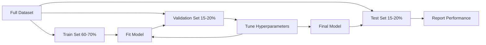

# 模型 Evaluation

> 模型 是 only 作为 good 作为 way you measure it.

**Type:** Build
**Languages:** Python
**Prerequisites:** Phase 1 (概率 & Distributions, 统计学 为了 ML), Phase 2 Lessons 1-8
**Time:** ~90 minutes

## Learning Objectives

- Implement K-fold 和 stratified K-fold cross-验证 从 scratch 和 explain why stratification matters 为了 imbalanced 数据
- Compute 精确率, 召回率, F1, AUC-ROC, 和 回归 metrics (MSE, RMSE, MAE, R-squared) 从 scratch
- Interpret learning curves 到 diagnose whether 模型 suffers 从 high 偏置 或 high variance
- Identify common evaluation mistakes including 数据 leakage, wrong metric selection, 和 test set contamination

## Problem

You trained 模型. It gets 95% 准确率 在 your 数据. Is it good?

Maybe. Maybe not. If 95% 的 your 数据 belongs 到 one class, 模型 always predicts class gets 95% 准确率 while being completely useless. If you evaluated 在 same 数据 you trained 在, 95% number 是 meaningless because 模型 just memorized answers. If your 数据集 has time component 和 you randomly shuffled before splitting, your 模型 might be using future 数据 到 predict past.

模型 evaluation 是 where most ML projects go wrong. wrong metric makes bad 模型 look good. wrong split lets 模型 cheat. wrong comparison makes you pick worse 模型. Getting evaluation right 是 not optional. 它是 difference between 模型 works 在 production 和 one fails moment it sees real 数据.

## Concept

### Train, 验证, Test



Three splits, three purposes:

- **训练 set**: 模型 learns 从 这个 数据. It sees 这些 examples during 训练.
- **验证 set**: used 到 tune 超参数 和 select between 模型. 模型 never trains 在 这个 数据, but your decisions 是 influenced 通过 it.
- **Test set**: touched exactly once, 在 very end, 到 report final performance. If you look 在 test performance 和 then go back 到 change your 模型, it 是 no longer test set. It has become second 验证 set.

test set 是 your hold-out guarantee reported performance reflects how 模型 will do 在 truly unseen 数据.

### K-Fold Cross-验证

With small 数据集, single train/验证 split wastes 数据 和 gives noisy estimates. K-fold cross-验证 uses all 数据 为了 both 训练 和 验证:

```mermaid
flowchart TB
    subgraph Fold1["Fold 1"]
        direction LR
        V1["Val"] --- T1a["Train"] --- T1b["Train"] --- T1c["Train"] --- T1d["Train"]
    end
    subgraph Fold2["Fold 2"]
        direction LR
        T2a["Train"] --- V2["Val"] --- T2b["Train"] --- T2c["Train"] --- T2d["Train"]
    end
    subgraph Fold3["Fold 3"]
        direction LR
        T3a["Train"] --- T3b["Train"] --- V3["Val"] --- T3c["Train"] --- T3d["Train"]
    end
    subgraph Fold4["Fold 4"]
        direction LR
        T4a["Train"] --- T4b["Train"] --- T4c["Train"] --- V4["Val"] --- T4d["Train"]
    end
    subgraph Fold5["Fold 5"]
        direction LR
        T5a["Train"] --- T5b["Train"] --- T5c["Train"] --- T5d["Train"] --- V5["Val"]
    end
    Fold1 --> R["Average scores"]
    Fold2 --> R
    Fold3 --> R
    Fold4 --> R
    Fold5 --> R
```



1. Split 数据 into K equal-sized folds
2. For each fold, train 在 K-1 folds 和 validate 在 remaining fold
3. Average K 验证 scores

K=5 或 K=10 是 standard choices. Every 数据 point gets used 为了 验证 exactly once. average score 是 more stable estimate than any single split.

**Stratified K-fold**: preserves class distribution 在 each fold. If your 数据集 是 70% class 和 30% class B, each fold will have roughly same ratio. 这是 important 为了 imbalanced 数据集 where random split might put all minority samples 在 one fold.

### 分类 Metrics

**Confusion 矩阵**: foundation. For binary 分类:

| | Predicted Positive | Predicted Negative |
|--|---|---|
| Actually Positive | True Positive (TP) | False Negative (FN) |
| Actually Negative | False Positive (FP) | True Negative (TN) |

From 这个 矩阵, all other metrics follow:

- **准确率** = (TP + TN) / (TP + TN + FP + FN). Fraction 的 correct predictions. Misleading when classes 是 imbalanced.
- **精确率** = TP / (TP + FP). Of all things predicted positive, how many actually were? Use when false positives 是 costly (e.g., spam filter marking real email 作为 spam).
- **召回率** (sensitivity) = TP / (TP + FN). Of all actual positives, how many did we catch? Use when false negatives 是 costly (e.g., cancer screening missing tumor).
- **F1 score** = 2 * 精确率 * 召回率 / (精确率 + 召回率). Harmonic mean 的 精确率 和 召回率. Balances both when neither clearly dominates.
- **AUC-ROC**: Area Under Receiver Operating Characteristic curve. Plots true positive rate vs false positive rate 在 various 分类 thresholds. AUC = 0.5 means random guessing, AUC = 1.0 means perfect separation. Threshold-independent: it measures how well 模型 ranks positives above negatives, regardless 的 cutoff you pick.

### 回归 Metrics

- **MSE** (Mean Squared Error) = mean((y_true - y_pred)^2). Penalizes large errors quadratically. Sensitive 到 outliers.
- **RMSE** (Root Mean Squared Error) = sqrt(MSE). Same units 作为 target variable. Easier 到 interpret than MSE.
- **MAE** (Mean Absolute Error) = mean(|y_true - y_pred|). Treats all errors linearly. More robust 到 outliers than MSE.
- **R-squared** = 1 - SS_res / SS_tot, where SS_res = sum((y_true - y_pred)^2) 和 SS_tot = sum((y_true - y_mean)^2). Fraction 的 variance explained 通过 模型. R^2 = 1.0 是 perfect. R^2 = 0.0 means 模型 是 no better than always predicting mean. R^2 can be negative if 模型 是 worse than mean.

### Learning Curves

Plot 训练 和 验证 scores 作为 函数 的 训练 set size:

- **High 偏置 (欠拟合)**: both curves converge 到 low score. Adding more 数据 will not help. 你需要 more complex 模型.
- **High variance (过拟合)**: 训练 score 是 high but 验证 score 是 much lower. gap between them 是 large. Adding more 数据 should help.

### 验证 Curves

Plot 训练 和 验证 scores 作为 函数 的 超参数:

- At low complexity: both scores 是 low (欠拟合)
- At right complexity: both scores 是 high 和 close together
- At high complexity: 训练 score stays high but 验证 score drops (过拟合)

optimal 超参数 value 是 where 验证 score peaks.

### Common Evaluation Mistakes

**数据 leakage**: information 从 test set leaks into 训练. Examples: fitting scaler 在 full 数据集 before splitting, including future 数据 在 time series prediction, using 特征 是 derived 从 target. Always split first, then preprocess.

**Class imbalance**: 99% 的 transactions 是 legitimate, 1% 是 fraud. 模型 always predicts "legitimate" gets 99% 准确率. Use 精确率, 召回率, F1, 或 AUC-ROC instead.

**Wrong metric**: optimizing 准确率 when you should optimize 召回率 (medical diagnosis), 或 optimizing RMSE when your 数据 has heavy outliers (use MAE instead).

**Not using stratified splits**: 使用 imbalanced 数据, random split might put very few minority samples 在 验证 fold, giving unstable estimates.

**测试 too often**: every time you look 在 test performance 和 adjust, you overfit 到 test set. test set 是 single-use.

## Build It

### Step 1: Train/验证/test split

```python
import random
import math


def train_val_test_split(X, y, train_ratio=0.6, val_ratio=0.2, seed=42):
    random.seed(seed)
    n = len(X)
    indices = list(range(n))
    random.shuffle(indices)

    train_end = int(n * train_ratio)
    val_end = int(n * (train_ratio + val_ratio))

    train_idx = indices[:train_end]
    val_idx = indices[train_end:val_end]
    test_idx = indices[val_end:]

    X_train = [X[i] for i in train_idx]
    y_train = [y[i] for i in train_idx]
    X_val = [X[i] for i in val_idx]
    y_val = [y[i] for i in val_idx]
    X_test = [X[i] for i in test_idx]
    y_test = [y[i] for i in test_idx]

    return X_train, y_train, X_val, y_val, X_test, y_test
```

### Step 2: K-fold 和 stratified K-fold cross-验证

```python
def kfold_split(n, k=5, seed=42):
    random.seed(seed)
    indices = list(range(n))
    random.shuffle(indices)

    fold_size = n // k
    folds = []

    for i in range(k):
        start = i * fold_size
        end = start + fold_size if i < k - 1 else n
        val_idx = indices[start:end]
        train_idx = indices[:start] + indices[end:]
        folds.append((train_idx, val_idx))

    return folds


def stratified_kfold_split(y, k=5, seed=42):
    random.seed(seed)

    class_indices = {}
    for i, label in enumerate(y):
        class_indices.setdefault(label, []).append(i)

    for label in class_indices:
        random.shuffle(class_indices[label])

    folds = [{"train": [], "val": []} for _ in range(k)]

    for label, indices in class_indices.items():
        fold_size = len(indices) // k
        for i in range(k):
            start = i * fold_size
            end = start + fold_size if i < k - 1 else len(indices)
            val_part = indices[start:end]
            train_part = indices[:start] + indices[end:]
            folds[i]["val"].extend(val_part)
            folds[i]["train"].extend(train_part)

    return [(f["train"], f["val"]) for f in folds]


def cross_validate(X, y, model_fn, k=5, metric_fn=None, stratified=False):
    n = len(X)

    if stratified:
        folds = stratified_kfold_split(y, k)
    else:
        folds = kfold_split(n, k)

    scores = []
    for train_idx, val_idx in folds:
        X_train = [X[i] for i in train_idx]
        y_train = [y[i] for i in train_idx]
        X_val = [X[i] for i in val_idx]
        y_val = [y[i] for i in val_idx]

        model = model_fn()
        model.fit(X_train, y_train)
        predictions = [model.predict(x) for x in X_val]

        if metric_fn:
            score = metric_fn(y_val, predictions)
        else:
            score = sum(1 for yt, yp in zip(y_val, predictions) if yt == yp) / len(y_val)
        scores.append(score)

    return scores
```

### Step 3: Confusion 矩阵 和 分类 metrics

```python
def confusion_matrix(y_true, y_pred):
    tp = sum(1 for yt, yp in zip(y_true, y_pred) if yt == 1 and yp == 1)
    tn = sum(1 for yt, yp in zip(y_true, y_pred) if yt == 0 and yp == 0)
    fp = sum(1 for yt, yp in zip(y_true, y_pred) if yt == 0 and yp == 1)
    fn = sum(1 for yt, yp in zip(y_true, y_pred) if yt == 1 and yp == 0)
    return tp, tn, fp, fn


def accuracy(y_true, y_pred):
    tp, tn, fp, fn = confusion_matrix(y_true, y_pred)
    total = tp + tn + fp + fn
    return (tp + tn) / total if total > 0 else 0.0


def precision(y_true, y_pred):
    tp, tn, fp, fn = confusion_matrix(y_true, y_pred)
    return tp / (tp + fp) if (tp + fp) > 0 else 0.0


def recall(y_true, y_pred):
    tp, tn, fp, fn = confusion_matrix(y_true, y_pred)
    return tp / (tp + fn) if (tp + fn) > 0 else 0.0


def f1_score(y_true, y_pred):
    p = precision(y_true, y_pred)
    r = recall(y_true, y_pred)
    return 2 * p * r / (p + r) if (p + r) > 0 else 0.0


def roc_curve(y_true, y_scores):
    thresholds = sorted(set(y_scores), reverse=True)
    tpr_list = []
    fpr_list = []

    total_positives = sum(y_true)
    total_negatives = len(y_true) - total_positives

    for threshold in thresholds:
        y_pred = [1 if s >= threshold else 0 for s in y_scores]
        tp = sum(1 for yt, yp in zip(y_true, y_pred) if yt == 1 and yp == 1)
        fp = sum(1 for yt, yp in zip(y_true, y_pred) if yt == 0 and yp == 1)

        tpr = tp / total_positives if total_positives > 0 else 0.0
        fpr = fp / total_negatives if total_negatives > 0 else 0.0

        tpr_list.append(tpr)
        fpr_list.append(fpr)

    return fpr_list, tpr_list, thresholds


def auc_roc(y_true, y_scores):
    fpr_list, tpr_list, _ = roc_curve(y_true, y_scores)

    pairs = sorted(zip(fpr_list, tpr_list))
    fpr_sorted = [p[0] for p in pairs]
    tpr_sorted = [p[1] for p in pairs]

    area = 0.0
    for i in range(1, len(fpr_sorted)):
        width = fpr_sorted[i] - fpr_sorted[i - 1]
        height = (tpr_sorted[i] + tpr_sorted[i - 1]) / 2
        area += width * height

    return area
```

### Step 4: 回归 metrics

```python
def mse(y_true, y_pred):
    n = len(y_true)
    return sum((yt - yp) ** 2 for yt, yp in zip(y_true, y_pred)) / n


def rmse(y_true, y_pred):
    return math.sqrt(mse(y_true, y_pred))


def mae(y_true, y_pred):
    n = len(y_true)
    return sum(abs(yt - yp) for yt, yp in zip(y_true, y_pred)) / n


def r_squared(y_true, y_pred):
    mean_y = sum(y_true) / len(y_true)
    ss_res = sum((yt - yp) ** 2 for yt, yp in zip(y_true, y_pred))
    ss_tot = sum((yt - mean_y) ** 2 for yt in y_true)
    if ss_tot == 0:
        return 0.0
    return 1.0 - ss_res / ss_tot
```

### Step 5: Learning curves

```python
def learning_curve(X, y, model_fn, metric_fn, train_sizes=None, val_ratio=0.2, seed=42):
    random.seed(seed)
    n = len(X)
    indices = list(range(n))
    random.shuffle(indices)

    val_size = int(n * val_ratio)
    val_idx = indices[:val_size]
    pool_idx = indices[val_size:]

    X_val = [X[i] for i in val_idx]
    y_val = [y[i] for i in val_idx]

    if train_sizes is None:
        train_sizes = [int(len(pool_idx) * r) for r in [0.1, 0.2, 0.4, 0.6, 0.8, 1.0]]

    train_scores = []
    val_scores = []

    for size in train_sizes:
        subset = pool_idx[:size]
        X_train = [X[i] for i in subset]
        y_train = [y[i] for i in subset]

        model = model_fn()
        model.fit(X_train, y_train)

        train_pred = [model.predict(x) for x in X_train]
        val_pred = [model.predict(x) for x in X_val]

        train_scores.append(metric_fn(y_train, train_pred))
        val_scores.append(metric_fn(y_val, val_pred))

    return train_sizes, train_scores, val_scores
```

### Step 6: simple classifier 为了 测试, plus full demo

```python
class SimpleLogistic:
    def __init__(self, lr=0.1, epochs=100):
        self.lr = lr
        self.epochs = epochs
        self.weights = None
        self.bias = 0.0

    def sigmoid(self, z):
        z = max(-500, min(500, z))
        return 1.0 / (1.0 + math.exp(-z))

    def fit(self, X, y):
        n_features = len(X[0])
        self.weights = [0.0] * n_features
        self.bias = 0.0

        for _ in range(self.epochs):
            for xi, yi in zip(X, y):
                z = sum(w * x for w, x in zip(self.weights, xi)) + self.bias
                pred = self.sigmoid(z)
                error = yi - pred
                for j in range(n_features):
                    self.weights[j] += self.lr * error * xi[j]
                self.bias += self.lr * error

    def predict_proba(self, x):
        z = sum(w * xi for w, xi in zip(self.weights, x)) + self.bias
        return self.sigmoid(z)

    def predict(self, x):
        return 1 if self.predict_proba(x) >= 0.5 else 0


class SimpleLinearRegression:
    def __init__(self, lr=0.001, epochs=200):
        self.lr = lr
        self.epochs = epochs
        self.weights = None
        self.bias = 0.0

    def fit(self, X, y):
        n_features = len(X[0])
        self.weights = [0.0] * n_features
        self.bias = 0.0
        n = len(X)

        for _ in range(self.epochs):
            for xi, yi in zip(X, y):
                pred = sum(w * x for w, x in zip(self.weights, xi)) + self.bias
                error = yi - pred
                for j in range(n_features):
                    self.weights[j] += self.lr * error * xi[j] / n
                self.bias += self.lr * error / n

    def predict(self, x):
        return sum(w * xi for w, xi in zip(self.weights, x)) + self.bias


def standardize(values):
    n = len(values)
    mean = sum(values) / n
    var = sum((v - mean) ** 2 for v in values) / n
    std = math.sqrt(var) if var > 0 else 1.0
    return [(v - mean) / std for v in values], mean, std


def make_classification_data(n=300, seed=42):
    random.seed(seed)
    X = []
    y = []
    for _ in range(n):
        x1 = random.gauss(0, 1)
        x2 = random.gauss(0, 1)
        label = 1 if (x1 + x2 + random.gauss(0, 0.5)) > 0 else 0
        X.append([x1, x2])
        y.append(label)
    return X, y


def make_regression_data(n=200, seed=42):
    random.seed(seed)
    X = []
    y = []
    for _ in range(n):
        x1 = random.uniform(0, 10)
        x2 = random.uniform(0, 5)
        target = 3 * x1 + 2 * x2 + random.gauss(0, 2)
        X.append([x1, x2])
        y.append(target)
    return X, y


def make_imbalanced_data(n=300, minority_ratio=0.05, seed=42):
    random.seed(seed)
    X = []
    y = []
    for _ in range(n):
        if random.random() < minority_ratio:
            x1 = random.gauss(3, 0.5)
            x2 = random.gauss(3, 0.5)
            label = 1
        else:
            x1 = random.gauss(0, 1)
            x2 = random.gauss(0, 1)
            label = 0
        X.append([x1, x2])
        y.append(label)
    return X, y


if __name__ == "__main__":
    X_clf, y_clf = make_classification_data(300)

    print("=== Train/Validation/Test Split ===")
    X_train, y_train, X_val, y_val, X_test, y_test = train_val_test_split(X_clf, y_clf)
    print(f"  Train: {len(X_train)}, Val: {len(X_val)}, Test: {len(X_test)}")
    print(f"  Train class distribution: {sum(y_train)}/{len(y_train)} positive")
    print(f"  Val class distribution: {sum(y_val)}/{len(y_val)} positive")

    model = SimpleLogistic(lr=0.1, epochs=200)
    model.fit(X_train, y_train)

    print("\n=== Classification Metrics ===")
    y_pred = [model.predict(x) for x in X_test]
    tp, tn, fp, fn = confusion_matrix(y_test, y_pred)
    print(f"  Confusion matrix: TP={tp}, TN={tn}, FP={fp}, FN={fn}")
    print(f"  Accuracy:  {accuracy(y_test, y_pred):.4f}")
    print(f"  Precision: {precision(y_test, y_pred):.4f}")
    print(f"  Recall:    {recall(y_test, y_pred):.4f}")
    print(f"  F1 Score:  {f1_score(y_test, y_pred):.4f}")

    y_scores = [model.predict_proba(x) for x in X_test]
    auc = auc_roc(y_test, y_scores)
    print(f"  AUC-ROC:   {auc:.4f}")

    print("\n=== K-Fold Cross-Validation (K=5) ===")
    cv_scores = cross_validate(
        X_clf, y_clf,
        model_fn=lambda: SimpleLogistic(lr=0.1, epochs=200),
        k=5,
        metric_fn=accuracy,
    )
    mean_cv = sum(cv_scores) / len(cv_scores)
    std_cv = math.sqrt(sum((s - mean_cv) ** 2 for s in cv_scores) / len(cv_scores))
    print(f"  Fold scores: {[round(s, 4) for s in cv_scores]}")
    print(f"  Mean: {mean_cv:.4f} (+/- {std_cv:.4f})")

    print("\n=== Stratified K-Fold Cross-Validation (K=5) ===")
    strat_scores = cross_validate(
        X_clf, y_clf,
        model_fn=lambda: SimpleLogistic(lr=0.1, epochs=200),
        k=5,
        metric_fn=accuracy,
        stratified=True,
    )
    strat_mean = sum(strat_scores) / len(strat_scores)
    strat_std = math.sqrt(sum((s - strat_mean) ** 2 for s in strat_scores) / len(strat_scores))
    print(f"  Fold scores: {[round(s, 4) for s in strat_scores]}")
    print(f"  Mean: {strat_mean:.4f} (+/- {strat_std:.4f})")

    print("\n=== Imbalanced Data: Why Accuracy Lies ===")
    X_imb, y_imb = make_imbalanced_data(300, minority_ratio=0.05)
    positives = sum(y_imb)
    print(f"  Class distribution: {positives} positive, {len(y_imb) - positives} negative ({positives/len(y_imb)*100:.1f}% positive)")

    always_negative = [0] * len(y_imb)
    print(f"  Always-negative baseline:")
    print(f"    Accuracy:  {accuracy(y_imb, always_negative):.4f}")
    print(f"    Precision: {precision(y_imb, always_negative):.4f}")
    print(f"    Recall:    {recall(y_imb, always_negative):.4f}")
    print(f"    F1 Score:  {f1_score(y_imb, always_negative):.4f}")

    X_tr_i, y_tr_i, X_v_i, y_v_i, X_te_i, y_te_i = train_val_test_split(X_imb, y_imb)
    model_imb = SimpleLogistic(lr=0.5, epochs=500)
    model_imb.fit(X_tr_i, y_tr_i)
    y_pred_imb = [model_imb.predict(x) for x in X_te_i]
    print(f"\n  Trained model on imbalanced data:")
    print(f"    Accuracy:  {accuracy(y_te_i, y_pred_imb):.4f}")
    print(f"    Precision: {precision(y_te_i, y_pred_imb):.4f}")
    print(f"    Recall:    {recall(y_te_i, y_pred_imb):.4f}")
    print(f"    F1 Score:  {f1_score(y_te_i, y_pred_imb):.4f}")

    print("\n=== Regression Metrics ===")
    X_reg, y_reg = make_regression_data(200)

    col0 = [x[0] for x in X_reg]
    col1 = [x[1] for x in X_reg]
    col0_s, m0, s0 = standardize(col0)
    col1_s, m1, s1 = standardize(col1)
    X_reg_scaled = [[col0_s[i], col1_s[i]] for i in range(len(X_reg))]

    X_tr_r, y_tr_r, X_v_r, y_v_r, X_te_r, y_te_r = train_val_test_split(X_reg_scaled, y_reg)
    reg_model = SimpleLinearRegression(lr=0.01, epochs=500)
    reg_model.fit(X_tr_r, y_tr_r)
    y_pred_r = [reg_model.predict(x) for x in X_te_r]

    print(f"  MSE:       {mse(y_te_r, y_pred_r):.4f}")
    print(f"  RMSE:      {rmse(y_te_r, y_pred_r):.4f}")
    print(f"  MAE:       {mae(y_te_r, y_pred_r):.4f}")
    print(f"  R-squared: {r_squared(y_te_r, y_pred_r):.4f}")

    mean_baseline = [sum(y_tr_r) / len(y_tr_r)] * len(y_te_r)
    print(f"\n  Mean baseline:")
    print(f"    MSE:       {mse(y_te_r, mean_baseline):.4f}")
    print(f"    R-squared: {r_squared(y_te_r, mean_baseline):.4f}")

    print("\n=== Learning Curve ===")
    sizes, train_sc, val_sc = learning_curve(
        X_clf, y_clf,
        model_fn=lambda: SimpleLogistic(lr=0.1, epochs=200),
        metric_fn=accuracy,
    )
    print(f"  {'Size':>6} {'Train':>8} {'Val':>8}")
    for s, tr, va in zip(sizes, train_sc, val_sc):
        print(f"  {s:>6} {tr:>8.4f} {va:>8.4f}")

    print("\n=== Statistical Model Comparison ===")
    model_a_scores = cross_validate(
        X_clf, y_clf,
        model_fn=lambda: SimpleLogistic(lr=0.1, epochs=100),
        k=5, metric_fn=accuracy,
    )
    model_b_scores = cross_validate(
        X_clf, y_clf,
        model_fn=lambda: SimpleLogistic(lr=0.1, epochs=500),
        k=5, metric_fn=accuracy,
    )
    diffs = [a - b for a, b in zip(model_a_scores, model_b_scores)]
    mean_diff = sum(diffs) / len(diffs)
    std_diff = math.sqrt(sum((d - mean_diff) ** 2 for d in diffs) / len(diffs))
    t_stat = mean_diff / (std_diff / math.sqrt(len(diffs))) if std_diff > 0 else 0.0
    print(f"  Model A (100 epochs) mean: {sum(model_a_scores)/len(model_a_scores):.4f}")
    print(f"  Model B (500 epochs) mean: {sum(model_b_scores)/len(model_b_scores):.4f}")
    print(f"  Mean difference: {mean_diff:.4f}")
    print(f"  Paired t-statistic: {t_stat:.4f}")
    print(f"  (|t| > 2.78 for significance at p<0.05 with df=4)")
```

## Use It

With scikit-learn, evaluation 是 built into workflow:

```python
from sklearn.model_selection import cross_val_score, StratifiedKFold, learning_curve
from sklearn.metrics import (
    accuracy_score, precision_score, recall_score, f1_score,
    roc_auc_score, confusion_matrix, mean_squared_error, r2_score,
)
from sklearn.linear_model import LogisticRegression

model = LogisticRegression()
scores = cross_val_score(model, X, y, cv=StratifiedKFold(5), scoring="f1")
```

从-scratch versions show exactly what cross-验证 does (no magic, just 为了-loops 和 index tracking), how each metric 是 computed (just counting TP/FP/TN/FN), 和 why stratification matters (preserving class ratios 在 each fold). library versions add parallelism, more scoring options, 和 integration 使用 pipelines.

## Ship It

This lesson produces:
- `输出/skill-evaluation.md` - skill covering evaluation strategy 为了 分类 和 回归 模型

## Exercises

1. Implement 精确率-召回率 curves: plot 精确率 vs 召回率 在 different thresholds. Compute average 精确率 (area under PR curve). Compare PR curve 到 ROC curve 在 imbalanced 数据集 和 explain when each 是 more informative.
2. Build nested cross-验证 loop: outer loop evaluates 模型 performance, inner loop tunes 超参数. Use it 到 compare two 模型 fairly without leaking 验证 数据 into evaluation.
3. Implement permutation test 为了 模型 comparison: shuffle labels, retrain, 和 measure performance. Repeat 100 times 到 build null distribution. Compute p-value 为了 observed 模型 performance against 这个 distribution.

## Key Terms

| Term | What people say | What it actually means |
|------|----------------|----------------------|
| 过拟合 | "Memorizing 训练 数据" | 模型 captures noise 在 训练 数据, performing well 在 训练 but poorly 在 unseen 数据 |
| Cross-验证 | "测试 在 different subsets" | Systematically rotating which portion 的 数据 是 used 为了 验证, averaging results across all rotations |
| 精确率 | "How many predicted positives 是 correct" | TP / (TP + FP): fraction 的 positive predictions 是 actually positive |
| 召回率 | "How many actual positives we found" | TP / (TP + FN): fraction 的 actual positives were correctly identified |
| AUC-ROC | "How well 模型 separates classes" | area under curve 的 true positive rate vs false positive rate across all thresholds, 从 0.5 (random) 到 1.0 (perfect) |
| R-squared | "How much variance 是 explained" | 1 - (sum 的 squared residuals / total sum 的 squares): fraction 的 target variance captured 通过 模型 |
| 数据 leakage | " 模型 cheated" | Using information during 训练 would not be available 在 prediction time, leading 到 optimistic evaluation |
| Learning curve | "How performance changes 使用 more 数据" | plot 的 训练 和 验证 scores vs 训练 set size, revealing 欠拟合 或 过拟合 |
| Stratified split | "Keeping class ratios balanced" | Splitting 数据 so each subset has same proportion 的 each class 作为 full 数据集 |

## Further Reading

- [scikit-learn 模型 Selection Guide](https://scikit-learn.org/stable/model_selection.html) - comprehensive reference 在 cross-验证, metrics, 和 超参数 tuning
- [Beyond 准确率: 精确率 和 召回率 (Google ML Crash Course)](https://developers.google.com/machine-learning/crash-course/分类/精确率-和-召回率) - clear explanation 使用 interactive examples
- [ Survey 的 Cross-验证 Procedures (Arlot & Celisse, 2010)](https://projecteuclid.org/journals/统计学-surveys/volume-4/issue-none/-survey-的-cross-验证-procedures-为了-模型-selection/10.1214/09-SS054.full) - rigorous treatment 的 when 和 why different CV strategies work
