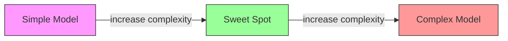
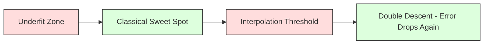
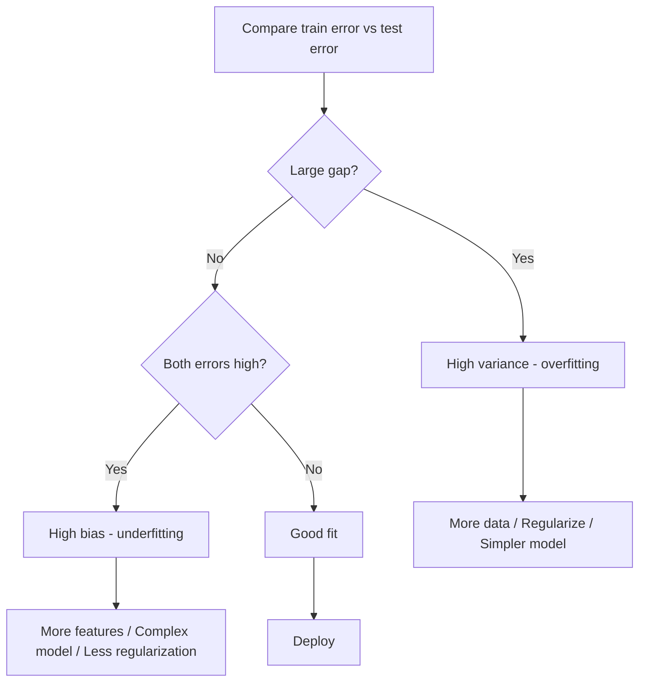
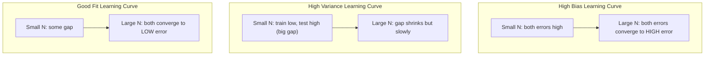
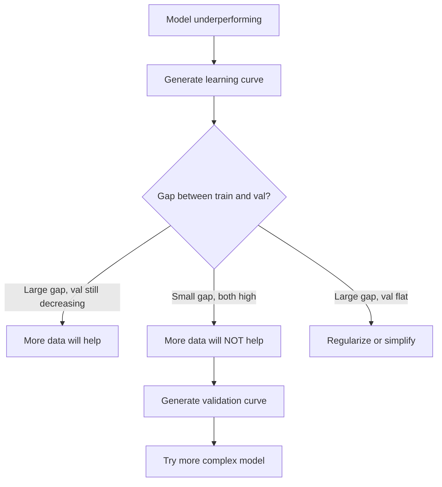

# 偏置-Variance Tradeoff

> Every 模型 error comes 从 one 的 three sources: 偏置, variance, 或 noise. 你可以 only control first two.

**Type:** Learn
**Language:** Python
**Prerequisites:** Phase 2, Lessons 01-09 (ML basics, 回归, 分类, evaluation)
**Time:** ~75 minutes

## Learning Objectives

- Derive 偏置-variance decomposition 的 expected prediction error 和 explain role 的 irreducible noise
- Diagnose whether 模型 suffers 从 high 偏置 或 high variance using 训练 和 test error patterns
- Explain how 正则化 techniques (L1, L2, dropout, early stopping) trade 偏置 为了 variance
- Implement experiments visualize 偏置-variance tradeoff across 模型 的 increasing complexity

## Problem

You trained 模型. It has some error 在 test 数据. Where does error come 从?

If your 模型 是 too simple (linear 回归 在 curved 数据集), it will consistently miss true pattern. 那是 偏置. If your 模型 是 too complex (degree-20 polynomial 在 15 数据 points), it will fit 训练 数据 perfectly but give wildly different predictions 在 new 数据. 那是 variance.

You cannot minimize both 在 same time 为了 fixed 模型 capacity. Push 偏置 down 和 variance goes up. Push variance down 和 偏置 goes up. Understanding 这个 tradeoff 是 single most useful diagnostic skill 在 machine learning. It tells you whether 到 make your 模型 more complex 或 less complex, whether 到 get more 数据 或 engineer better 特征, whether 到 regularize more 或 less.

## Concept

### 偏置: Systematic Error

偏置 measures how far off your 模型's average prediction 是 从 true value. If you trained same 模型 在 many different 训练 sets drawn 从 same distribution 和 averaged predictions, 偏置 是 gap between average 和 truth.

High 偏置 means 模型 是 too rigid 到 capture real pattern. straight line fit 到 parabola will always miss curve, no matter how much 数据 you give it. 这是 欠拟合.

```
High bias (underfitting):
  Model always predicts roughly the same wrong thing.
  Training error: HIGH
  Test error: HIGH
  Gap between them: SMALL
```

### Variance: Sensitivity 到 训练 数据

Variance measures how much your predictions change when you train 在 different subsets 的 数据. If small changes 在 训练 set cause large changes 在 模型, variance 是 high.

High variance means 模型 是 fitting noise 在 训练 数据, not underlying signal. degree-20 polynomial will thread through every 训练 point but oscillate wildly between them. 这是 过拟合.

```
High variance (overfitting):
  Model fits training data perfectly but fails on new data.
  Training error: LOW
  Test error: HIGH
  Gap between them: LARGE
```

### Decomposition

For any point x, expected prediction error under squared loss decomposes exactly:

```
Expected Error = Bias^2 + Variance + Irreducible Noise

where:
  Bias^2   = (E[f_hat(x)] - f(x))^2
  Variance = E[(f_hat(x) - E[f_hat(x)])^2]
  Noise    = E[(y - f(x))^2]             (sigma^2)
```

- `f(x)` 是 true 函数
- `f_hat(x)` 是 your 模型's prediction
- `E[...]` 是 expectation over different 训练 sets
- `y` 是 observed label (true 函数 plus noise)

noise term 是 irreducible. No 模型 can do better than sigma^2 在 noisy 数据. Your job 是 到 find right balance between 偏置^2 和 variance.

### 模型 Complexity vs Error



classic U-shaped curve:

| Complexity | 偏置 | Variance | Total Error |
|-----------|------|----------|-------------|
| Too low | HIGH | LOW | HIGH (欠拟合) |
| Just right | MODERATE | MODERATE | LOWEST |
| Too high | LOW | HIGH | HIGH (过拟合) |

### 正则化 作为 偏置-Variance Control

正则化 deliberately increases 偏置 到 reduce variance. It constrains 模型 so it cannot chase noise.

- **L2 (Ridge):** Shrinks all 权重 toward zero. Keeps all 特征 but reduces their influence.
- **L1 (Lasso):** Pushes some 权重 exactly 到 zero. Performs 特征 selection.
- **Dropout:** Randomly disables 神经元 during 训练. Forces redundant representations.
- **Early stopping:** Stops 训练 before 模型 fully fits 训练 数据.

正则化 strength (lambda, dropout rate, number 的 轮次) directly controls where you sit 在 偏置-variance curve. More 正则化 means more 偏置, less variance.

### Double Descent: Modern Perspective

Classical theory says: after sweet spot, more complexity always hurts. But research since 2019 has shown something unexpected. If you keep increasing 模型 capacity far past interpolation threshold (where 模型 has enough 参数 到 perfectly fit 训练 数据), test error can decrease again.



This "double descent" phenomenon explains why massively overparameterized 神经网络 (使用 far more 参数 than 训练 examples) still generalize well. classical 偏置-variance tradeoff 是 not wrong, but it 是 incomplete 为了 modern regime.

Key observations about double descent:
- It happens 在 linear 模型, decision trees, 和 神经网络
- More 数据 can actually hurt 在 interpolation region (sample-wise double descent)
- More 训练 轮次 can cause it too (轮次-wise double descent)
- 正则化 smooths out peak but does not eliminate it

Why does 这个 happen? At interpolation threshold, 模型 has just enough capacity 到 fit all 训练 points. 它是 forced into very specific solution threads through every point, 和 small perturbations 在 数据 cause large changes 在 fit. 这是 where variance peaks. Past threshold, 模型 has many possible solutions fit 数据 perfectly. learning 算法 (e.g., 梯度下降 使用 implicit 正则化) tends 到 pick simplest one among them. This implicit 偏置 toward simple solutions 是 why overparameterized 模型 generalize.

| Regime | Parameters vs Samples | Behavior |
|--------|----------------------|----------|
| Underparameterized | p << n | Classical tradeoff applies |
| Interpolation threshold | p ~ n | Variance peaks, test error spikes |
| Overparameterized | p >> n | Implicit 正则化 kicks 在, test error drops |

For practical purposes: if you 是 using 神经网络 或 large tree ensembles, do not stop 在 interpolation threshold. Either stay well below it (使用 explicit 正则化) 或 go well past it. worst place 到 be 是 right 在 threshold.

### Diagnosing Your 模型



| Symptom | Diagnosis | Fix |
|---------|-----------|-----|
| High train error, high test error | 偏置 | More 特征, complex 模型, less 正则化 |
| Low train error, high test error | Variance | More 数据, 正则化, simpler 模型, dropout |
| Low train error, low test error | Good fit | Ship it |
| Train error decreasing, test error increasing | 过拟合 在 progress | Early stopping |

### Practical Strategies

**When 偏置 是 problem:**
- Add polynomial 或 interaction 特征
- Use more flexible 模型 (tree ensemble instead 的 linear)
- Reduce 正则化 strength
- Train longer (if not yet converged)

**When variance 是 problem:**
- Get more 训练 数据
- Use bagging (random forests)
- Increase 正则化 (higher lambda, more dropout)
- 特征 selection (remove noisy 特征)
- Use cross-验证 到 detect it early

### Ensemble Methods 和 Variance Reduction

Ensemble methods 是 most practical tool 为了 fighting variance.

**Bagging (Bootstrap Aggregating)** trains multiple 模型 在 different bootstrap samples 的 训练 数据, then averages their predictions. Each individual 模型 has high variance, but average has much lower variance. Random forests 是 bagging applied 到 decision trees.

Why it works mathematically: if you average N independent predictions, each 使用 variance sigma^2, variance 的 average 是 sigma^2 / N. 模型 是 not truly independent (they all see similar 数据), so reduction 是 less than 1/N, but it 是 still substantial.

**Boosting** reduces 偏置 通过 building 模型 sequentially, where each new 模型 focuses 在 errors 的 ensemble so far. Gradient boosting 和 AdaBoost 是 main examples. Boosting can overfit if you add too many 模型, so you need early stopping 或 正则化.

| Method | Primary Effect | 偏置 Change | Variance Change |
|--------|---------------|-------------|-----------------|
| Bagging | Reduces variance | No change | Decreases |
| Boosting | Reduces 偏置 | Decreases | Can increase |
| Stacking | Reduces both | Depends 在 meta-learner | Depends 在 base 模型 |
| Dropout | Implicit bagging | Slight increase | Decreases |

**Practical rule:** if your base 模型 has high variance (deep trees, high-degree polynomials), use bagging. If your base 模型 has high 偏置 (shallow stumps, simple linear 模型), use boosting.

### Learning Curves

Learning curves plot 训练 和 验证 error 作为 函数 的 训练 set size. They 是 most practical diagnostic tool you have. Unlike single train/test comparison, learning curves show you trajectory 的 your 模型 和 tell you whether more 数据 will help.



How 到 read them:

| Scenario | 训练 Error | 验证 Error | Gap | What It Means | What 到 Do |
|----------|---------------|-----------------|-----|---------------|------------|
| High 偏置 | High | High | Small | 模型 cannot capture pattern | More 特征, complex 模型, less 正则化 |
| High variance | Low | High | Large | 模型 memorizes 训练 数据 | More 数据, 正则化, simpler 模型 |
| Good fit | Moderate | Moderate | Small | 模型 generalizes well | Ship it |
| High variance, improving | Low | Decreasing 使用 more 数据 | Shrinking | Variance problem 数据 can fix | Collect more 数据 |
| High 偏置, flat | High | High 和 flat | Small 和 flat | More 数据 will NOT help | Change 模型 architecture |

critical insight: if both curves have plateaued 和 gap 是 small but both errors 是 high, more 数据 是 useless. 你需要 better 模型. If gap 是 large 和 still shrinking, more 数据 will help.

### How 到 Generate Learning Curves

有 two approaches:

**Approach 1: Vary 训练 set size, fixed 模型.** Hold 模型 和 超参数 constant. Train 在 increasingly large subsets 的 训练 数据. Measure 训练 error 和 验证 error 在 each size. 这是 standard learning curve.

**Approach 2: Vary 模型 complexity, fixed 数据.** Hold 数据 constant. Sweep complexity 参数 (polynomial degree, tree depth, number 的 层). Measure 训练 error 和 验证 error 在 each complexity. 这是 验证 curve 和 shows 偏置-variance tradeoff directly.

Both approaches complement each other. first tells you if more 数据 will help. second tells you if different 模型 will help. Run both before making decisions about your next step.



## Build It

代码 在 `代码/bias_variance.py` runs full 偏置-variance decomposition experiment. Here 是 approach, step 通过 step.

### Step 1: Generate Synthetic 数据 从 Known 函数

We use `f(x) = sin(1.5x) + 0.5x` 使用 Gaussian noise. Knowing true 函数 lets us compute exact 偏置 和 variance.

```python
def true_function(x):
    return np.sin(1.5 * x) + 0.5 * x

def generate_data(n_samples=30, noise_std=0.5, x_range=(-3, 3), seed=None):
    rng = np.random.RandomState(seed)
    x = rng.uniform(x_range[0], x_range[1], n_samples)
    y = true_function(x) + rng.normal(0, noise_std, n_samples)
    return x, y
```

### Step 2: Bootstrap Sampling 和 Polynomial Fitting

For each polynomial degree, we draw many bootstrap 训练 sets, fit polynomial, 和 record predictions 在 fixed test grid. This gives us distribution 的 predictions 在 each test point.

```python
def fit_polynomial(x_train, y_train, degree, lam=0.0):
    X = np.column_stack([x_train ** d for d in range(degree + 1)])
    if lam > 0:
        penalty = lam * np.eye(X.shape[1])
        penalty[0, 0] = 0
        w = np.linalg.solve(X.T @ X + penalty, X.T @ y_train)
    else:
        w = np.linalg.lstsq(X, y_train, rcond=None)[0]
    return w
```

We fit 在 200 different bootstrap samples. Each bootstrap sample 是 drawn 从 same underlying distribution but contains different points.

### Step 3: Computing 偏置^2, Variance Decomposition

With 200 sets 的 predictions 在 each test point, we can compute decomposition directly 从 definition:

```python
mean_pred = predictions.mean(axis=0)
bias_sq = np.mean((mean_pred - y_true) ** 2)
variance = np.mean(predictions.var(axis=0))
total_error = np.mean(np.mean((predictions - y_true) ** 2, axis=1))
```

- `mean_pred` 是 E[f_hat(x)] estimated 从 bootstrap samples
- `bias_sq` 是 squared gap between average prediction 和 truth
- `variance` 是 average spread 的 predictions across bootstrap samples
- `total_error` should approximately equal 偏置^2 + variance + noise

### Step 4: Learning Curves

Learning curves sweep 训练 set size while holding 模型 complexity fixed. They show whether your 模型 是 数据-limited 或 capacity-limited.

```python
def demo_learning_curves():
    sizes = [10, 15, 20, 30, 50, 75, 100, 150, 200, 300]
    degree = 5

    for n in sizes:
        train_errors = []
        test_errors = []
        for seed in range(50):
            x_train, y_train = generate_data(n_samples=n, seed=seed * 100)
            w = fit_polynomial(x_train, y_train, degree)
            train_pred = predict_polynomial(x_train, w)
            train_mse = np.mean((train_pred - y_train) ** 2)
            test_pred = predict_polynomial(x_test, w)
            test_mse = np.mean((test_pred - y_test) ** 2)
            train_errors.append(train_mse)
            test_errors.append(test_mse)
        # Average over runs gives the learning curve point
```

For high-variance 模型 (degree 5 使用 small 数据), you see:
- 训练 error starts low 和 increases 作为 more 数据 makes memorization harder
- Test error starts high 和 decreases 作为 模型 gets more signal
- gap shrinks 使用 more 数据

For high-偏置 模型 (degree 1), both errors converge quickly 到 same high value 和 more 数据 does not help.

### Step 5: 正则化 Sweep

代码 also includes `demo_regularization_sweep()`, which fixes high-degree polynomial (degree 15) 和 sweeps Ridge 正则化 strength 从 0.001 到 100. This shows 偏置-variance tradeoff 从 different angle: instead 的 varying 模型 complexity, we vary constraint strength.

```python
def demo_regularization_sweep():
    alphas = [0.001, 0.005, 0.01, 0.05, 0.1, 0.5, 1.0, 5.0, 10.0, 50.0, 100.0]
    for alpha in alphas:
        results = bias_variance_decomposition([15], lam=alpha)
        r = results[15]
        print(f"alpha={alpha:.3f}  bias={r['bias_sq']:.4f}  var={r['variance']:.4f}")
```

At low alpha, degree-15 polynomial 是 nearly unconstrained. Variance dominates because 模型 chases noise 在 each bootstrap sample. At high alpha, penalty 是 so strong 模型 effectively becomes near-constant 函数. 偏置 dominates. optimal alpha sits between 这些 extremes.

这是 same U-curve 从 varying polynomial degree, but controlled 通过 continuous knob instead 的 discrete one. In practice, 正则化 是 preferred way 到 control tradeoff because it allows fine-grained control without changing 特征 set.

## Use It

sklearn provides `learning_curve` 和 `validation_curve` 到 automate 这些 diagnostics without writing bootstrap loops.

### 验证 Curve: Sweep 模型 Complexity

```python
from sklearn.model_selection import validation_curve
from sklearn.pipeline import make_pipeline
from sklearn.preprocessing import PolynomialFeatures
from sklearn.linear_model import Ridge

degrees = list(range(1, 16))
train_scores_all = []
val_scores_all = []

for d in degrees:
    pipe = make_pipeline(PolynomialFeatures(d), Ridge(alpha=0.01))
    train_scores, val_scores = validation_curve(
        pipe, X, y, param_name="polynomialfeatures__degree",
        param_range=[d], cv=5, scoring="neg_mean_squared_error"
    )
    train_scores_all.append(-train_scores.mean())
    val_scores_all.append(-val_scores.mean())
```

This gives you 偏置-variance tradeoff curve directly. Where 验证 score 是 worst relative 到 train score, variance dominates. Where both 是 bad, 偏置 dominates.

### Learning Curve: Sweep 训练 Set Size

```python
from sklearn.model_selection import learning_curve

pipe = make_pipeline(PolynomialFeatures(5), Ridge(alpha=0.01))
train_sizes, train_scores, val_scores = learning_curve(
    pipe, X, y, train_sizes=np.linspace(0.1, 1.0, 10),
    cv=5, scoring="neg_mean_squared_error"
)
train_mse = -train_scores.mean(axis=1)
val_mse = -val_scores.mean(axis=1)
```

Plot `train_mse` 和 `val_mse` against `train_sizes`. shape tells you everything about your 模型.

### Cross-验证 使用 正则化 Sweep

```python
from sklearn.model_selection import cross_val_score

alphas = [0.001, 0.01, 0.1, 1.0, 10.0, 100.0]
for alpha in alphas:
    pipe = make_pipeline(PolynomialFeatures(10), Ridge(alpha=alpha))
    scores = cross_val_score(pipe, X, y, cv=5, scoring="neg_mean_squared_error")
    print(f"alpha={alpha:>7.3f}  MSE={-scores.mean():.4f} +/- {scores.std():.4f}")
```

This sweeps 正则化 strength 为了 fixed 模型 complexity. You will see same 偏置-variance tradeoff: low alpha means high variance, high alpha means high 偏置.

### Putting It All Together: Complete Diagnostic Workflow

In practice, you run 这些 diagnostics 在 sequence:

1. Train your 模型. Compute train 和 test error.
2. If both 是 high: you have 偏置 problem. Skip 到 step 4.
3. If train 是 low but test 是 high: you have variance problem. Generate learning curve 到 see if more 数据 will help. If not, regularize.
4. Generate 验证 curve sweeping your main complexity 参数. Find sweet spot.
5. At sweet spot, generate learning curve. If gap 是 still large, you need more 数据 或 正则化.
6. Try Ridge/Lasso 使用 different alpha values using `cross_val_score`. Pick alpha where cross-validated error 是 lowest.

This takes 10-15 minutes 的 compute 为了 most tabular 数据集 和 saves hours 的 guessing.

## Ship It

This lesson produces: `输出/prompt-模型-diagnostics.md`

## Exercises

1. Run decomposition 使用 `noise_std=0` (no noise). What happens 到 irreducible error term? Does optimal complexity change?

2. Increase 训练 set size 从 30 到 300. How does 这个 affect variance component? Does optimal polynomial degree shift?

3. Add L2 正则化 (Ridge 回归) 到 experiment. For fixed high-degree polynomial (degree 15), sweep lambda 从 0 到 100. Plot 偏置^2 和 variance 作为 函数 的 lambda.

4. Modify true 函数 从 polynomial 到 `sin(x)`. How does 偏置-variance decomposition change? Is there still clear optimal degree?

5. Implement simple bootstrap aggregating (bagging) wrapper: train 10 模型 在 bootstrap samples 和 average predictions. Show 这个 reduces variance without increasing 偏置 much.

## Key Terms

| Term | What people say | What it actually means |
|------|----------------|----------------------|
| 偏置 | " 模型 是 too simple" | Systematic error 从 wrong assumptions. gap between average 模型 prediction 和 truth. |
| Variance | " 模型 是 过拟合" | Error 从 sensitivity 到 训练 数据. How much predictions change across different 训练 sets. |
| Irreducible error | "Noise 在 数据" | Error 从 randomness 在 true 数据-generating process. No 模型 can eliminate it. |
| 欠拟合 | "Not learning enough" | 模型 has high 偏置. It misses real pattern even 在 训练 数据. |
| 过拟合 | "Memorizing 数据" | 模型 has high variance. It fits noise 在 训练 数据 does not generalize. |
| 正则化 | "Constraining 模型" | Adding penalty 到 reduce 模型 complexity, trading 偏置 为了 lower variance. |
| Double descent | "More 参数 can help" | Test error decreases again when 模型 capacity far exceeds interpolation threshold. |
| 模型 complexity | "How flexible 模型 是" | capacity 的 模型 到 fit arbitrary patterns. Controlled 通过 architecture, 特征, 或 正则化. |

## Further Reading

- [Hastie, Tibshirani, Friedman: Elements 的 Statistical Learning, Ch. 7](https://hastie.su.domains/ElemStatLearn/) -- definitive treatment 的 偏置-variance decomposition
- [Belkin et al., Reconciling modern machine learning practice 和 偏置-variance trade-off (2019)](https://arxiv.org/abs/1812.11118) -- double descent paper
- [Nakkiran et al., Deep Double Descent (2019)](https://arxiv.org/abs/1912.02292) -- 轮次-wise 和 sample-wise double descent
- [Scott Fortmann-Roe: Understanding 偏置-Variance Tradeoff](http://scott.fortmann-roe.com/docs/BiasVariance.html) -- clear visual explanation
