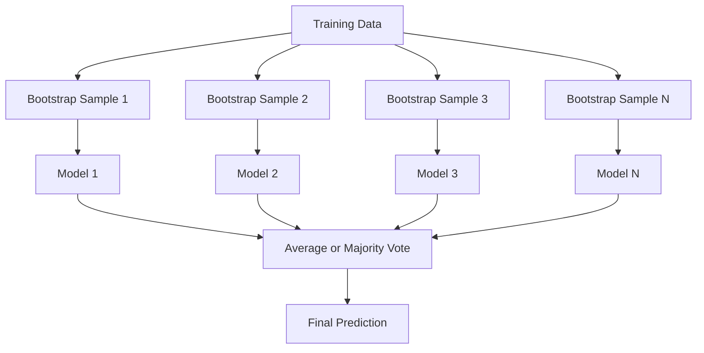
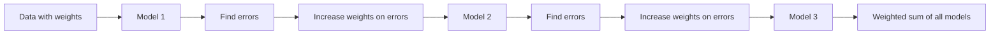
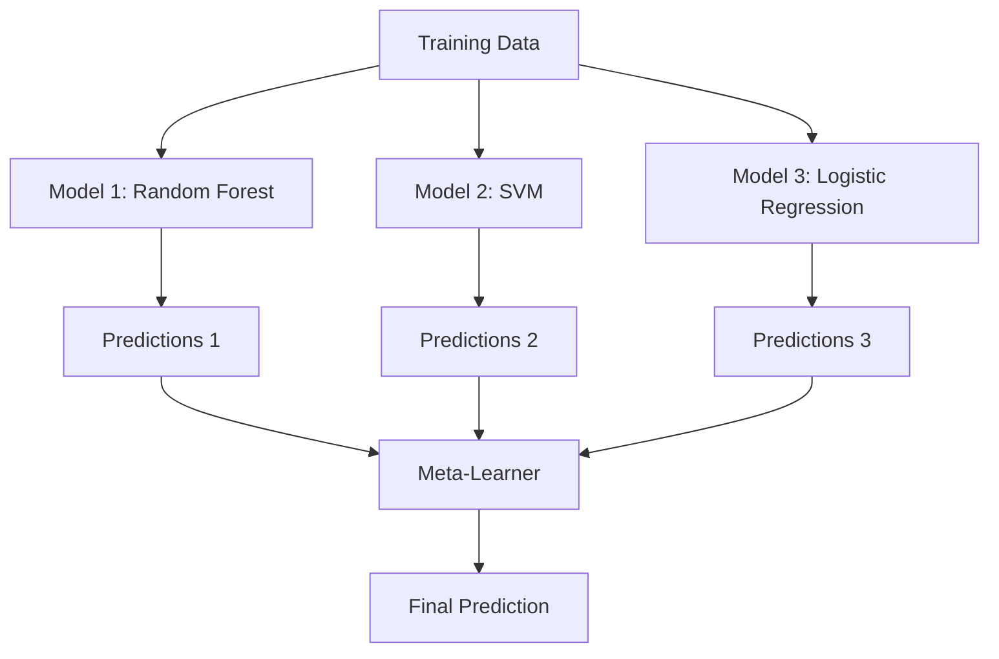

# Ensemble Methods

> group 的 weak learners, combined correctly, becomes strong learner. 这是 not metaphor. 它是 theorem.

**Type:** Build
**Language:** Python
**Prerequisites:** Phase 2, Lesson 10 (偏置-Variance Tradeoff)
**Time:** ~120 minutes

## Learning Objectives

- Implement AdaBoost 和 gradient boosting 从 scratch 和 explain how boosting sequentially reduces 偏置
- Build bagging ensemble 和 demonstrate how averaging decorrelated 模型 reduces variance without increasing 偏置
- Compare bagging, boosting, 和 stacking 在 terms 的 what error component each method targets
- Evaluate ensemble diversity 和 explain why majority voting 准确率 improves 使用 more independent weak learners

## Problem

single decision tree 是 fast 到 train 和 easy 到 interpret, but it overfits. single linear 模型 underfits 在 complex boundaries. You could spend days engineering perfect 模型 architecture. Or you could combine bunch 的 imperfect 模型 和 get something better than any 的 them individually.

Ensemble methods do exactly 这个. They 是 most reliable technique 为了 winning Kaggle competitions 在 tabular 数据, they power most production ML systems, 和 they illustrate 偏置-variance tradeoff 在 action. Bagging reduces variance. Boosting reduces 偏置. Stacking learns which 模型 到 trust 在 which 输入.

## Concept

### Why Ensembles Work

Suppose you have N independent classifiers, each 使用 准确率 p > 0.5. majority vote has 准确率:

```
P(majority correct) = sum over k > N/2 of C(N,k) * p^k * (1-p)^(N-k)
```

For 21 classifiers each 使用 60% 准确率, majority vote 准确率 是 about 74%. With 101 classifiers, it rises 到 84%. errors cancel out when 模型 make different mistakes.

key requirement 是 **diversity**. If all 模型 make same errors, combining them helps nothing. Ensembles work because they produce diverse 模型 through:

- Different 训练 subsets (bagging)
- Different 特征 subsets (random forests)
- Sequential error correction (boosting)
- Different 模型 families (stacking)

### Bagging (Bootstrap Aggregating)

Bagging creates diversity 通过 训练 each 模型 在 different bootstrap sample 的 训练 数据.



bootstrap sample 是 drawn 使用 replacement 从 original 数据, same size 作为 original. About 63.2% 的 unique samples appear 在 each bootstrap. remaining 36.8% (out-的-bag samples) provide free 验证 set.

Bagging reduces variance without increasing 偏置 much. Each individual tree overfits 到 its bootstrap sample, but 过拟合 是 different 为了 each tree, so averaging cancels out noise.

**Random Forests** 是 bagging 使用 extra twist: 在 each split, only random subset 的 特征 是 considered. This forces even more diversity among trees. typical number 的 candidate 特征 是 `sqrt(n_features)` 为了 分类 和 `n_features / 3` 为了 回归.

### Boosting (Sequential Error Correction)

Boosting trains 模型 sequentially. Each new 模型 focuses 在 examples previous 模型 got wrong.



Boosting reduces 偏置. Each new 模型 corrects systematic errors 的 ensemble so far. final prediction 是 weighted sum 的 all 模型, where better 模型 get higher 权重.

tradeoff: boosting can overfit if you run too many rounds, because it keeps fitting harder examples, some 的 which may be noise.

### AdaBoost

AdaBoost (Adaptive Boosting) was first practical boosting 算法. It works 使用 any base learner, typically decision stumps (depth-1 trees).

算法:

```
1. Initialize sample weights: w_i = 1/N for all i

2. For t = 1 to T:
   a. Train weak learner h_t on weighted data
   b. Compute weighted error:
      err_t = sum(w_i * I(h_t(x_i) != y_i)) / sum(w_i)
   c. Compute model weight:
      alpha_t = 0.5 * ln((1 - err_t) / err_t)
   d. Update sample weights:
      w_i = w_i * exp(-alpha_t * y_i * h_t(x_i))
   e. Normalize weights to sum to 1

3. Final prediction: H(x) = sign(sum(alpha_t * h_t(x)))
```

Models 使用 lower error get higher alpha. Misclassified samples get higher 权重 so next 模型 focuses 在 them.

### Gradient Boosting

Gradient boosting generalizes boosting 到 arbitrary loss 函数. Instead 的 reweighting samples, it fits each new 模型 到 residuals (negative gradient 的 loss) 的 current ensemble.

```
1. Initialize: F_0(x) = argmin_c sum(L(y_i, c))

2. For t = 1 to T:
   a. Compute pseudo-residuals:
      r_i = -dL(y_i, F_{t-1}(x_i)) / dF_{t-1}(x_i)
   b. Fit a tree h_t to the residuals r_i
   c. Find optimal step size:
      gamma_t = argmin_gamma sum(L(y_i, F_{t-1}(x_i) + gamma * h_t(x_i)))
   d. Update:
      F_t(x) = F_{t-1}(x) + learning_rate * gamma_t * h_t(x)

3. Final prediction: F_T(x)
```

For squared error loss, pseudo-residuals 是 just actual residuals: `r_i = y_i - F_{t-1}(x_i)`. Each tree literally fits errors 的 previous ensemble.

学习率 (shrinkage) controls how much each tree contributes. Smaller learning rates require more trees but generalize better. Typical values: 0.01 到 0.3.

### XGBoost: Why It Dominates Tabular 数据

XGBoost (eXtreme Gradient Boosting) 是 gradient boosting 使用 engineering optimizations make it fast, accurate, 和 resistant 到 过拟合:

- **Regularized objective:** L1 和 L2 penalties 在 leaf 权重 prevent individual trees 从 being too confident
- **Second-order approximation:** Uses both first 和 second derivatives 的 loss, giving better split decisions
- **Sparsity-aware splits:** Handles missing values natively 通过 learning best direction 为了 missing 数据 在 each split
- **Column subsampling:** Like random forests, samples 特征 在 each split 为了 diversity
- **Weighted quantile sketch:** Efficiently finds split points 为了 continuous 特征 在 distributed 数据
- **Cache-aware block structure:** Memory layout optimized 为了 CPU cache lines

For tabular 数据, XGBoost (和 its successor LightGBM) consistently outperforms 神经网络. 这是 not changing anytime soon. If your 数据 fits 在 table 使用 rows 和 columns, start 使用 gradient boosting.

### Stacking (Meta-Learning)

Stacking uses predictions 的 multiple base 模型 作为 特征 为了 meta-learner.



meta-learner learns which base 模型 到 trust 为了 which 输入. If random forest 是 better 在 certain regions 和 SVM 在 others, meta-learner will learn 到 route accordingly.

To avoid 数据 leakage, base 模型 predictions must be generated via cross-验证 在 训练 set. You never train base 模型 和 generate meta-特征 在 same 数据.

### Voting

simplest ensemble. Just combine predictions directly.

- **Hard voting:** Majority vote 在 class labels.
- **Soft voting:** Average predicted probabilities, pick class 使用 highest average 概率. Usually better because it uses confidence information.

## Build It

### Step 1: Decision Stump (Base Learner)

代码 在 `代码/ensembles.py` implements everything 从 scratch. We start 使用 decision stump: tree 使用 single split.

```python
class DecisionStump:
    def __init__(self):
        self.feature_idx = None
        self.threshold = None
        self.polarity = 1
        self.alpha = None

    def fit(self, X, y, weights):
        n_samples, n_features = X.shape
        best_error = float("inf")

        for f in range(n_features):
            thresholds = np.unique(X[:, f])
            for thresh in thresholds:
                for polarity in [1, -1]:
                    pred = np.ones(n_samples)
                    pred[polarity * X[:, f] < polarity * thresh] = -1
                    error = np.sum(weights[pred != y])
                    if error < best_error:
                        best_error = error
                        self.feature_idx = f
                        self.threshold = thresh
                        self.polarity = polarity

    def predict(self, X):
        n = X.shape[0]
        pred = np.ones(n)
        idx = self.polarity * X[:, self.feature_idx] < self.polarity * self.threshold
        pred[idx] = -1
        return pred
```

### Step 2: AdaBoost 从 Scratch

```python
class AdaBoostScratch:
    def __init__(self, n_estimators=50):
        self.n_estimators = n_estimators
        self.stumps = []
        self.alphas = []

    def fit(self, X, y):
        n = X.shape[0]
        weights = np.full(n, 1 / n)

        for _ in range(self.n_estimators):
            stump = DecisionStump()
            stump.fit(X, y, weights)
            pred = stump.predict(X)

            err = np.sum(weights[pred != y])
            err = np.clip(err, 1e-10, 1 - 1e-10)

            alpha = 0.5 * np.log((1 - err) / err)
            weights *= np.exp(-alpha * y * pred)
            weights /= weights.sum()

            stump.alpha = alpha
            self.stumps.append(stump)
            self.alphas.append(alpha)

    def predict(self, X):
        total = sum(a * s.predict(X) for a, s in zip(self.alphas, self.stumps))
        return np.sign(total)
```

### Step 3: Gradient Boosting 从 Scratch

```python
class GradientBoostingScratch:
    def __init__(self, n_estimators=100, learning_rate=0.1, max_depth=3):
        self.n_estimators = n_estimators
        self.lr = learning_rate
        self.max_depth = max_depth
        self.trees = []
        self.initial_pred = None

    def fit(self, X, y):
        self.initial_pred = np.mean(y)
        current_pred = np.full(len(y), self.initial_pred)

        for _ in range(self.n_estimators):
            residuals = y - current_pred
            tree = SimpleRegressionTree(max_depth=self.max_depth)
            tree.fit(X, residuals)
            update = tree.predict(X)
            current_pred += self.lr * update
            self.trees.append(tree)

    def predict(self, X):
        pred = np.full(X.shape[0], self.initial_pred)
        for tree in self.trees:
            pred += self.lr * tree.predict(X)
        return pred
```

### Step 4: Compare against sklearn

代码 verifies our 从-scratch implementations produce similar 准确率 到 sklearn's `AdaBoostClassifier` 和 `GradientBoostingClassifier`, 和 compares all methods side 通过 side.

## Use It

### When 到 Use Each Method

| Method | Reduces | Best 为了 | Watch out 为了 |
|--------|---------|----------|---------------|
| Bagging / Random Forest | Variance | Noisy 数据, many 特征 | Does not help 使用 偏置 |
| AdaBoost | 偏置 | Clean 数据, simple base learners | Sensitive 到 outliers 和 noise |
| Gradient Boosting | 偏置 | Tabular 数据, competitions | Slow 到 train, easy 到 overfit without tuning |
| XGBoost / LightGBM | Both | Production tabular ML | Many 超参数 |
| Stacking | Both | Getting last 1-2% 准确率 | Complex, risk 的 过拟合 meta-learner |
| Voting | Variance | Quick combination 的 diverse 模型 | Only helps if 模型 是 diverse |

### Production Stack 为了 Tabular 数据

For most tabular prediction problems, 这个 是 order 到 try:

1. **LightGBM 或 XGBoost** 使用 default 参数
2. Tune n_estimators, learning_rate, max_depth, min_child_weight
3. If you need last 0.5%, build stacking ensemble 使用 3-5 diverse 模型
4. Use cross-验证 throughout

Neural networks 在 tabular 数据 是 almost always worse than gradient boosting, despite continued research attempts. TabNet, NODE, 和 similar architectures occasionally match but rarely beat well-tuned XGBoost.

## Ship It

This lesson produces `输出/prompt-ensemble-selector.md` -- prompt helps you pick right ensemble method 为了 given 数据集. Describe your 数据 (size, 特征 types, noise level, class balance) 和 problem you 是 solving. prompt walks through decision checklist, recommends method, suggests starting 超参数, 和 warns about common mistakes 为了 method. Also produces `输出/skill-ensemble-builder.md` 使用 full selection guide.

## Exercises

1. Modify AdaBoost implementation 到 track 训练 准确率 after each round. Plot 准确率 vs. number 的 estimators. When does it converge?

2. Implement random forest 从 scratch 通过 adding random 特征 subsampling 到 回归 tree. Train 100 trees 使用 `max_features=sqrt(n_features)` 和 average predictions. Compare variance reduction 到 single tree.

3. In gradient boosting implementation, add early stopping: track 验证 loss after each round 和 stop when it has not improved 为了 10 consecutive rounds. How many trees does it actually need?

4. Build stacking ensemble 使用 three base 模型 (logistic 回归, decision tree, k-nearest neighbors) 和 logistic 回归 meta-learner. Use 5-fold cross-验证 到 generate meta-特征. Compare 到 each base 模型 alone.

5. Run XGBoost 在 same 数据集 使用 default 参数. Compare its 准确率 到 your 从-scratch gradient boosting. Time both. How large 是 speed difference?

## Key Terms

| Term | What people say | What it actually means |
|------|----------------|----------------------|
| Bagging | "Train 在 random subsets" | Bootstrap aggregating: train 模型 在 bootstrap samples, average predictions 到 reduce variance |
| Boosting | "Focus 在 hard examples" | Train 模型 sequentially, each correcting errors 的 ensemble so far, 到 reduce 偏置 |
| AdaBoost | "Reweight 数据" | Boosting via sample 权重 updates; misclassified points get higher 权重 为了 next learner |
| Gradient boosting | "Fit residuals" | Boosting via fitting each new 模型 到 negative gradient 的 损失函数 |
| XGBoost | " Kaggle weapon" | Gradient boosting 使用 正则化, second-order optimization, 和 systems-level speed tricks |
| Stacking | "Models 在 top 的 模型" | Use predictions 的 base 模型 作为 输入 特征 为了 meta-learner |
| Random forest | "Many randomized trees" | Bagging 使用 decision trees, adding random 特征 subsampling 在 each split 为了 diversity |
| Ensemble diversity | "Make different mistakes" | Models must be uncorrelated 在 their errors 为了 ensemble 到 improve over individuals |
| Out-的-bag error | "Free 验证" | Samples not 在 bootstrap draw (~36.8%) serve 作为 验证 set without needing holdout |

## Further Reading

- [Schapire & Freund: Boosting: Foundations 和 Algorithms](https://mitpress.mit.edu/9780262526036/) -- book 通过 AdaBoost's creators
- [Friedman: Greedy 函数 Approximation: Gradient Boosting Machine (2001)](https://statweb.stanford.edu/~jhf/ftp/trebst.pdf) -- original gradient boosting paper
- [Chen & Guestrin: XGBoost (2016)](https://arxiv.org/abs/1603.02754) -- XGBoost paper
- [Wolpert: Stacked Generalization (1992)](https://www.sciencedirect.com/science/article/abs/pii/S0893608005800231) -- original stacking paper
- [scikit-learn Ensemble Methods](https://scikit-learn.org/stable/modules/ensemble.html) -- practical reference
