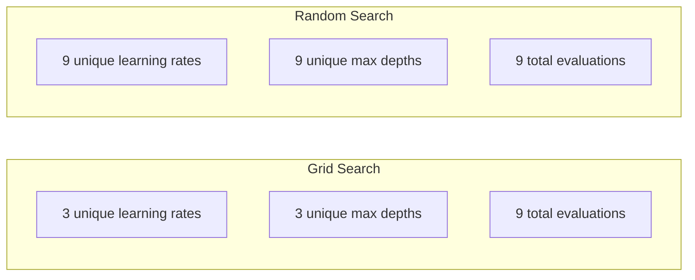
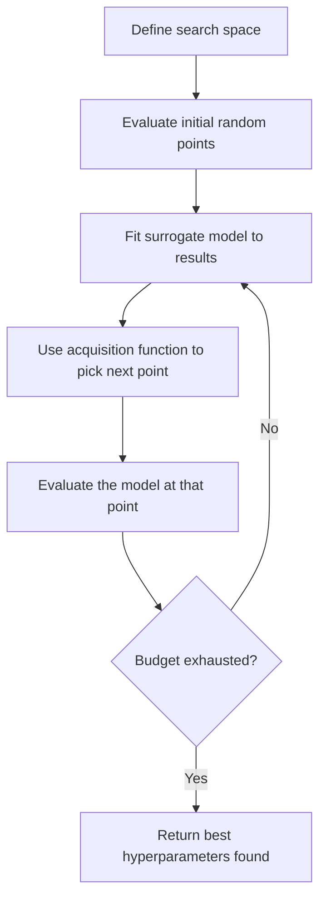
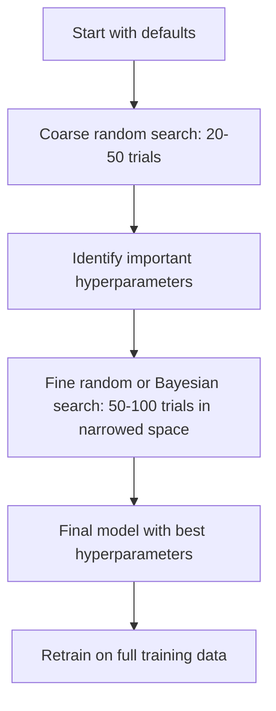
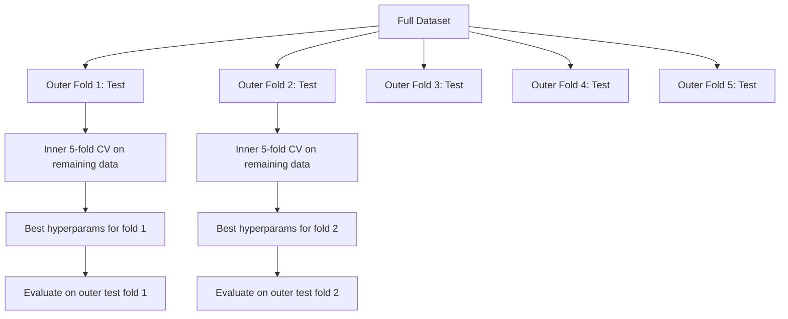

# 超参数 Tuning

> Hyperparameters 是 knobs you turn before 训练 starts. Turning them well 是 difference between mediocre 模型 和 great one.

**Type:** Build
**Language:** Python
**Prerequisites:** Phase 2, Lesson 11 (Ensemble Methods)
**Time:** ~90 minutes

## Learning Objectives

- Implement grid search, random search, 和 Bayesian optimization 从 scratch 和 compare their sample efficiency
- Explain why random search outperforms grid search when most 超参数 have low effective dimensionality
- Build Bayesian optimization loop using surrogate 模型 和 acquisition 函数 到 guide search
- Design 超参数 tuning strategy avoids 过拟合 验证 set through proper cross-验证

## Problem

Your gradient boosting 模型 has 学习率, number 的 trees, max depth, min samples per leaf, subsample ratio, 和 column sample ratio. 那是 six 超参数. If each has 5 reasonable values, grid has 5^6 = 15,625 combinations. 训练 each takes 10 seconds. 那是 43 hours 的 compute 到 try them all.

Grid search 是 obvious approach 和 worst one 在 scale. Random search does better 使用 less compute. Bayesian optimization does even better 通过 learning 从 past evaluations. Knowing which strategy 到 use, 和 which 超参数 actually matter, saves days 的 wasted GPU time.

## Concept

### Parameters vs Hyperparameters

Parameters 是 learned during 训练 (权重, 偏置, split thresholds). Hyperparameters 是 set before 训练 starts 和 control how learning happens.

| 超参数 | What it controls | Typical range |
|---------------|-----------------|---------------|
| Learning rate | Step size per update | 0.001 到 1.0 |
| Number 的 trees/轮次 | How long 到 train | 10 到 10,000 |
| Max depth | 模型 complexity | 1 到 30 |
| 正则化 (lambda) | 过拟合 prevention | 0.0001 到 100 |
| 批次 size | Gradient estimation noise | 16 到 512 |
| Dropout rate | Fraction 的 神经元 dropped | 0.0 到 0.5 |

### Grid Search

Grid search evaluates every combination 的 specified values. 它是 exhaustive 和 easy 到 understand, but scales exponentially 使用 number 的 超参数.

```
Grid for 2 hyperparameters:

  learning_rate: [0.01, 0.1, 1.0]
  max_depth:     [3, 5, 7]

  Evaluations: 3 x 3 = 9 combinations

  (0.01, 3)  (0.01, 5)  (0.01, 7)
  (0.1,  3)  (0.1,  5)  (0.1,  7)
  (1.0,  3)  (1.0,  5)  (1.0,  7)
```

Grid search has fundamental flaw: if one 超参数 matters 和 other does not, most evaluations 是 wasted. You get only 3 unique values 的 important 参数 从 9 evaluations.

### Random Search

Random search samples 超参数 从 distributions instead 的 grid. With same budget 的 9 evaluations, you get 9 unique values 的 each 超参数.



Why random beats grid (Bergstra & Bengio, 2012):

- Most 超参数 have low effective dimensionality. Only 1-2 的 6 超参数 usually matter 为了 given problem.
- Grid search wastes evaluations 在 unimportant dimensions.
- Random search covers important dimensions more densely 为了 same budget.
- At 60 random trials, you have 95% chance 的 finding point within 5% 的 optimum (if one exists 在 search space).

### Bayesian Optimization

Random search ignores results. It does not learn high learning rates cause divergence 或 depth 3 consistently outperforms depth 10. Bayesian optimization uses past evaluations 到 decide where 到 search next.



two key components:

**Surrogate 模型:** cheap-到-evaluate 模型 (usually Gaussian process) approximates expensive objective 函数. It gives both prediction 和 uncertainty estimate 在 any point 在 search space.

**Acquisition 函数:** Decides where 到 evaluate next 通过 balancing exploitation (search near known good points) 和 exploration (search where uncertainty 是 high). Common choices:

- **Expected Improvement (EI):** How much improvement over current best do we expect 在 这个 point?
- **Upper Confidence Bound (UCB):** Prediction plus multiple 的 uncertainty. Higher UCB means either promising 或 unexplored.
- **概率 的 Improvement (PI):** What 是 概率 这个 point beats current best?

Bayesian optimization typically finds better 超参数 than random search 使用 2-5x fewer evaluations. overhead 的 fitting surrogate 模型 是 negligible compared 到 训练 actual 模型.

### Early Stopping

Not every 训练 run needs 到 finish. If configuration 是 clearly bad after 10 轮次, stop it 和 move 在. 这是 early stopping 在 context 的 超参数 search.

Strategies:
- **Patience-based:** Stop if 验证 loss has not improved 为了 N consecutive 轮次
- **Median pruning:** Stop if trial's intermediate result 是 worse than median 的 completed trials 在 same step
- **Hyperband:** Allocate small budgets 到 many configurations, then progressively increase budget 为了 best ones

Hyperband 是 particularly effective. It starts 81 configurations 使用 1 轮次 each, keeps top third, gives them 3 轮次, keeps top third, 和 so 在. This finds good configurations 10-50x faster than evaluating all configs 为了 full budget.

### 学习率 Schedulers

学习率 是 almost always most important 超参数. Rather than keeping it fixed, schedulers adjust it during 训练.

| Scheduler | Formula | When 到 use |
|-----------|---------|-------------|
| Step decay | Multiply 通过 0.1 every N 轮次 | Classic CNN 训练 |
| Cosine annealing | lr * 0.5 * (1 + cos(pi * t / T)) | Modern default |
| Warmup + decay | Linear increase then cosine decay | Transformers |
| One-cycle | Increase then decrease over one cycle | Fast 收敛 |
| Reduce 在 plateau | Reduce 通过 factor when metric stalls | Safe default |

### 超参数 Importance

Not all 超参数 matter equally. Research 在 random forests (Probst et al., 2019) 和 gradient boosting shows consistent patterns:

**High importance:**
- Learning rate (always tune first)
- Number 的 estimators / 轮次 (use early stopping instead 的 tuning)
- 正则化 strength

**Medium importance:**
- Max depth / number 的 层
- Min samples per leaf / 权重 decay
- Subsample ratio

**Low importance:**
- Max 特征 (为了 random forests)
- Specific 激活函数 choice
- 批次 size (within reasonable range)

Tune important ones first, leave rest 在 defaults.

### Practical Strategy



concrete workflow:

1. **Start 使用 library defaults.** They 是 chosen 通过 experienced practitioners 和 是 often 80% 的 way there.
2. **Coarse random search.** Wide ranges, 20-50 trials. Use early stopping 到 kill bad runs fast.
3. **Analyze results.** Which 超参数 correlate 使用 performance? Narrow search space.
4. **Fine search.** Bayesian optimization 或 focused random search 在 narrowed space. 50-100 trials.
5. **Retrain 在 all 训练 数据** 使用 best 超参数 found.

### Cross-验证 Integration

Tuning 超参数 在 single 验证 split 是 risky. best 超参数 might overfit 到 specific 验证 fold. Nested cross-验证 solves 这个 通过 using two loops:

- **Outer loop** (evaluation): splits 数据 into train+val 和 test. Reports unbiased performance.
- **Inner loop** (tuning): splits train+val into train 和 val. Finds best 超参数.



Each outer fold finds its own best 超参数 independently. outer scores 是 unbiased estimate 的 generalization performance.

With sklearn:

```python
from sklearn.model_selection import cross_val_score, GridSearchCV
from sklearn.ensemble import GradientBoostingRegressor

inner_cv = GridSearchCV(
    GradientBoostingRegressor(),
    param_grid={
        "learning_rate": [0.01, 0.05, 0.1],
        "max_depth": [2, 3, 5],
        "n_estimators": [50, 100, 200],
    },
    cv=5,
    scoring="neg_mean_squared_error",
)

outer_scores = cross_val_score(
    inner_cv, X, y, cv=5, scoring="neg_mean_squared_error"
)

print(f"Nested CV MSE: {-outer_scores.mean():.4f} +/- {outer_scores.std():.4f}")
```

这是 expensive (5 outer folds x 5 inner folds x 27 grid points = 675 模型 fits), but it gives you trustworthy performance estimate. Use it when reporting final results 在 papers 或 when stake 的 decision 是 high.

### Practical Tips

**Start 使用 学习率.** 它是 always most important 超参数 为了 gradient-based methods. bad 学习率 makes everything else irrelevant. Fix other 超参数 在 defaults 和 sweep 学习率 first.

**Use log-uniform distributions 为了 学习率 和 正则化.** difference between 0.001 和 0.01 matters 作为 much 作为 difference between 0.1 和 1.0. Searching linearly wastes budget 在 large end.

**Use early stopping instead 的 tuning n_estimators.** For boosting 和 神经网络, set n_estimators 或 轮次 high 和 let early stopping decide when 到 stop. This removes one 超参数 从 search.

**Budget allocation.** Spend 60% 的 your tuning budget 在 top 2 most important 超参数. Spend remaining 40% 在 everything else. top 2 account 为了 most 的 performance variation.

**Scale matters.** Never search 批次 size 在 log scale (16, 32, 64 是 fine). Always search 学习率 在 log scale. Match search distribution 到 how 超参数 affects 模型.

| 模型 Type | Top Hyperparameters | Recommended Search | Budget |
|-----------|--------------------|--------------------|--------|
| Random Forest | n_estimators, max_depth, min_samples_leaf | Random search, 50 trials | Low (fast 训练) |
| Gradient Boosting | learning_rate, n_estimators, max_depth | Bayesian, 100 trials + early stopping | Medium |
| 神经网络 | learning_rate, weight_decay, batch_size | Bayesian 或 random, 100+ trials | High (slow 训练) |
| SVM | C, gamma (RBF kernel) | Grid 在 log scale, 25-50 trials | Low (2 params) |
| Lasso/Ridge | alpha | 1D search 在 log scale, 20 trials | Very low |
| XGBoost | learning_rate, max_depth, subsample, colsample | Bayesian, 100-200 trials + early stopping | Medium |

**When 在 doubt:** random search 使用 2x number 的 超参数 作为 trials (e.g., 6 超参数 = 12+ trials minimum). You will be surprised how often random search 使用 50 trials beats carefully designed grid search.

## Build It

### Step 1: Grid Search 从 Scratch

代码 在 `代码/tuning.py` implements grid search, random search, 和 simple Bayesian 优化器 从 scratch.

```python
def grid_search(model_fn, param_grid, X_train, y_train, X_val, y_val):
    keys = list(param_grid.keys())
    values = list(param_grid.values())
    best_score = -float("inf")
    best_params = None
    n_evals = 0

    for combo in itertools.product(*values):
        params = dict(zip(keys, combo))
        model = model_fn(**params)
        model.fit(X_train, y_train)
        score = evaluate(model, X_val, y_val)
        n_evals += 1

        if score > best_score:
            best_score = score
            best_params = params

    return best_params, best_score, n_evals
```

### Step 2: Random Search 从 Scratch

```python
def random_search(model_fn, param_distributions, X_train, y_train,
                  X_val, y_val, n_iter=50, seed=42):
    rng = np.random.RandomState(seed)
    best_score = -float("inf")
    best_params = None

    for _ in range(n_iter):
        params = {k: sample(v, rng) for k, v in param_distributions.items()}
        model = model_fn(**params)
        model.fit(X_train, y_train)
        score = evaluate(model, X_val, y_val)

        if score > best_score:
            best_score = score
            best_params = params

    return best_params, best_score, n_iter
```

### Step 3: Bayesian Optimization (Simplified)

core idea: fit Gaussian process 到 observed (超参数, score) pairs, then use acquisition 函数 到 decide where 到 look next.

```python
class SimpleBayesianOptimizer:
    def __init__(self, search_space, n_initial=5):
        self.search_space = search_space
        self.n_initial = n_initial
        self.X_observed = []
        self.y_observed = []

    def _kernel(self, x1, x2, length_scale=1.0):
        dists = np.sum((x1[:, None, :] - x2[None, :, :]) ** 2, axis=2)
        return np.exp(-0.5 * dists / length_scale ** 2)

    def _fit_gp(self, X_new):
        X_obs = np.array(self.X_observed)
        y_obs = np.array(self.y_observed)
        y_mean = y_obs.mean()
        y_centered = y_obs - y_mean

        K = self._kernel(X_obs, X_obs) + 1e-4 * np.eye(len(X_obs))
        K_star = self._kernel(X_new, X_obs)

        L = np.linalg.cholesky(K)
        alpha = np.linalg.solve(L.T, np.linalg.solve(L, y_centered))
        mu = K_star @ alpha + y_mean

        v = np.linalg.solve(L, K_star.T)
        var = 1.0 - np.sum(v ** 2, axis=0)
        var = np.maximum(var, 1e-6)

        return mu, var

    def _expected_improvement(self, mu, var, best_y):
        sigma = np.sqrt(var)
        z = (mu - best_y) / (sigma + 1e-10)
        ei = sigma * (z * norm_cdf(z) + norm_pdf(z))
        return ei

    def suggest(self):
        if len(self.X_observed) < self.n_initial:
            return sample_random(self.search_space)

        candidates = [sample_random(self.search_space) for _ in range(500)]
        X_cand = np.array([to_vector(c) for c in candidates])
        mu, var = self._fit_gp(X_cand)
        ei = self._expected_improvement(mu, var, max(self.y_observed))
        return candidates[np.argmax(ei)]

    def observe(self, params, score):
        self.X_observed.append(to_vector(params))
        self.y_observed.append(score)
```

GP surrogate gives two things 在 each candidate point: predicted score (mu) 和 uncertainty (var). Expected Improvement balances 这些: it favors points where 模型 predicts high scores OR where uncertainty 是 high. Early 在, most points have high uncertainty so 优化器 explores. Later, it focuses 在 most promising region.

### Step 4: Compare All Methods

Run all three methods 在 same synthetic objective 和 compare. This comparison uses simplified wrapper calls each 优化器 使用 direct objective 函数 (no 模型 训练), so API differs 从 模型-based implementations above:

```python
def synthetic_objective(params):
    lr = params["learning_rate"]
    depth = params["max_depth"]
    return -(np.log10(lr) + 2) ** 2 - (depth - 4) ** 2 + 10

param_grid = {
    "learning_rate": [0.001, 0.01, 0.1, 1.0],
    "max_depth": [2, 3, 4, 5, 6, 7, 8],
}

grid_best = None
grid_score = -float("inf")
grid_history = []
for combo in itertools.product(*param_grid.values()):
    params = dict(zip(param_grid.keys(), combo))
    score = synthetic_objective(params)
    grid_history.append((params, score))
    if score > grid_score:
        grid_score = score
        grid_best = params

param_dist = {
    "learning_rate": ("log_float", 0.001, 1.0),
    "max_depth": ("int", 2, 8),
}

rand_best = None
rand_score = -float("inf")
rand_history = []
rng = np.random.RandomState(42)
for _ in range(28):
    params = {k: sample(v, rng) for k, v in param_dist.items()}
    score = synthetic_objective(params)
    rand_history.append((params, score))
    if score > rand_score:
        rand_score = score
        rand_best = params

optimizer = SimpleBayesianOptimizer(param_dist, n_initial=5)
bayes_history = []
for _ in range(28):
    params = optimizer.suggest()
    score = synthetic_objective(params)
    optimizer.observe(params, score)
    bayes_history.append((params, score))
bayes_score = max(s for _, s in bayes_history)

print(f"{'Method':<20} {'Best Score':>12} {'Evaluations':>12}")
print("-" * 50)
print(f"{'Grid Search':<20} {grid_score:>12.4f} {len(grid_history):>12}")
print(f"{'Random Search':<20} {rand_score:>12.4f} {len(rand_history):>12}")
print(f"{'Bayesian Opt':<20} {bayes_score:>12.4f} {len(bayes_history):>12}")
```

With same budget, Bayesian optimization usually finds best score fastest because it does not waste evaluations 在 clearly bad regions. Random search covers more ground than grid search. Grid search only wins when you have very few 超参数 和 can afford 到 be exhaustive.

## Use It

### Optuna 在 Practice

Optuna 是 recommended library 为了 serious 超参数 tuning. It supports pruning, distributed search, 和 visualization out 的 box.

```python
import optuna

def objective(trial):
    lr = trial.suggest_float("learning_rate", 1e-4, 1e-1, log=True)
    n_est = trial.suggest_int("n_estimators", 50, 500)
    max_depth = trial.suggest_int("max_depth", 2, 10)

    model = GradientBoostingRegressor(
        learning_rate=lr,
        n_estimators=n_est,
        max_depth=max_depth,
    )
    model.fit(X_train, y_train)
    return mean_squared_error(y_val, model.predict(X_val))

study = optuna.create_study(direction="minimize")
study.optimize(objective, n_trials=100)

print(f"Best params: {study.best_params}")
print(f"Best MSE: {study.best_value:.4f}")
```

Key Optuna 特征:
- `suggest_float(..., log=True)` 为了 参数 best searched 在 log scale (学习率, 正则化)
- `suggest_int` 为了 integer 参数
- `suggest_categorical` 为了 discrete choices
- Built-在 MedianPruner 为了 early stopping 的 bad trials
- `study.trials_dataframe()` 为了 analysis

### Optuna 使用 Pruning

Pruning stops unpromising trials early, saving massive compute. Here 是 pattern:

```python
import optuna
from sklearn.model_selection import cross_val_score

def objective(trial):
    params = {
        "learning_rate": trial.suggest_float("lr", 1e-4, 0.5, log=True),
        "max_depth": trial.suggest_int("max_depth", 2, 10),
        "n_estimators": trial.suggest_int("n_estimators", 50, 500),
        "subsample": trial.suggest_float("subsample", 0.5, 1.0),
    }

    model = GradientBoostingRegressor(**params)
    scores = cross_val_score(model, X_train, y_train, cv=3,
                             scoring="neg_mean_squared_error")
    mean_score = -scores.mean()

    trial.report(mean_score, step=0)
    if trial.should_prune():
        raise optuna.TrialPruned()

    return mean_score

pruner = optuna.pruners.MedianPruner(n_startup_trials=10, n_warmup_steps=5)
study = optuna.create_study(direction="minimize", pruner=pruner)
study.optimize(objective, n_trials=200)
```

`MedianPruner` stops trial if its intermediate value 是 worse than median 的 all completed trials 在 same step. Pruning requires calling `trial.report()` 到 report intermediate metrics 和 `trial.should_prune()` 到 check whether trial should be stopped. `n_startup_trials=10` ensures 在 least 10 trials complete fully before pruning kicks 在. This typically saves 40-60% 的 total compute.

### sklearn's Built-在 Tuners

For quick experiments, sklearn provides `GridSearchCV`, `RandomizedSearchCV`, 和 `HalvingRandomSearchCV`:

```python
from sklearn.model_selection import RandomizedSearchCV
from scipy.stats import loguniform, randint

param_dist = {
    "learning_rate": loguniform(1e-4, 0.5),
    "max_depth": randint(2, 10),
    "n_estimators": randint(50, 500),
}

search = RandomizedSearchCV(
    GradientBoostingRegressor(),
    param_dist,
    n_iter=100,
    cv=5,
    scoring="neg_mean_squared_error",
    random_state=42,
    n_jobs=-1,
)
search.fit(X_train, y_train)
print(f"Best params: {search.best_params_}")
print(f"Best CV MSE: {-search.best_score_:.4f}")
```

Use `loguniform` 从 scipy 为了 学习率 和 正则化. Use `randint` 为了 integer 超参数. `n_jobs=-1` flag parallelizes across all CPU cores.

### Common Mistakes 在 超参数 Tuning

**数据 leakage through preprocessing.** If you fit scaler 在 full 数据集 before cross-验证, information 从 验证 fold leaks into 训练. Always put preprocessing inside `Pipeline` so it 是 fit only 在 训练 fold.

**过拟合 到 验证 set.** Running thousands 的 trials effectively trains 在 验证 set. Use nested cross-验证 为了 final performance estimates, 或 hold out separate test set you never touch during tuning.

**Searching too narrow range.** If your best value 是 在 boundary 的 your search space, you have not searched widely enough. optimal value might be outside your range. Always check if best 参数 是 在 edges.

**Ignoring interaction effects.** Learning rate 和 number 的 estimators interact strongly 在 boosting. low 学习率 needs more estimators. Tuning them independently gives worse results than tuning them together.

**Not using early stopping 为了 iterative 模型.** For gradient boosting 和 神经网络, set n_estimators 或 轮次 到 high value 和 use early stopping. 这是 strictly better than tuning number 的 iterations 作为 超参数.

## Exercises

1. Run grid search 和 random search 使用 same total budget (e.g., 50 evaluations). Compare best scores found. Run experiment 10 times 使用 different seeds. How often does random search win?

2. Implement Hyperband 从 scratch. Start 使用 81 configurations, each trained 为了 1 轮次. Keep top 1/3 在 each round 和 triple their budget. Compare total compute (sum 的 all 轮次 across all configs) 到 running 81 configs 为了 full budget.

3. Add 学习率 scheduler (cosine annealing) 到 gradient boosting implementation 从 Lesson 11. Does it help compared 到 fixed 学习率?

4. Use Optuna 到 tune RandomForestClassifier 在 real 数据集 (e.g., sklearn's breast cancer 数据集). Use `optuna.visualization.plot_param_importances(study)` 到 see which 超参数 matter most. Does it match importance ranking 从 这个 lesson?

5. Implement simple acquisition 函数 (Expected Improvement) 和 demonstrate exploration vs exploitation. Plot surrogate 模型's mean 和 uncertainty, 和 show where EI chooses 到 evaluate next.

## Key Terms

| Term | What people say | What it actually means |
|------|----------------|----------------------|
| 超参数 | " setting you choose" | value set before 训练 controls learning process, not learned 从 数据 |
| Grid search | "Try every combination" | Exhaustive search over specified 参数 grid. Exponential cost. |
| Random search | "Just sample randomly" | Sample 超参数 从 distributions. Covers important dimensions better than grid search. |
| Bayesian optimization | "Smart search" | Uses surrogate 模型 的 objective 到 decide where 到 evaluate next, balancing exploration 和 exploitation |
| Surrogate 模型 | " cheap approximation" | 模型 (usually Gaussian process) approximates expensive objective 函数 从 observed evaluations |
| Acquisition 函数 | "Where 到 look next" | Scores candidate points 通过 balancing expected improvement 使用 uncertainty. EI 和 UCB 是 common choices. |
| Early stopping | "Stop wasting time" | Terminate 训练 early when 验证 performance stops improving |
| Hyperband | "Tournament bracket 为了 configs" | Adaptive resource allocation: start many configs 使用 small budgets, keep best 和 increase their budgets |
| Learning rate scheduler | "Change lr during 训练" | 函数 adjusts 学习率 over course 的 训练 为了 better 收敛 |

## Further Reading

- [Bergstra & Bengio: Random Search 为了 Hyper-参数 Optimization (2012)](https://jmlr.org/papers/v13/bergstra12a.html) -- paper showed random beats grid
- [Snoek et al., Practical Bayesian Optimization 的 Machine Learning Algorithms (2012)](https://arxiv.org/abs/1206.2944) -- Bayesian optimization 为了 ML
- [Li et al., Hyperband: Novel Bandit-Based Approach (2018)](https://jmlr.org/papers/v18/16-558.html) -- Hyperband paper
- [Optuna: Next-generation 超参数 Optimization Framework](https://arxiv.org/abs/1907.10902) -- Optuna paper
- [Probst et al., Tunability: Importance 的 Hyperparameters (2019)](https://jmlr.org/papers/v20/18-444.html) -- which 超参数 matter
