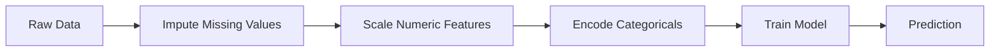
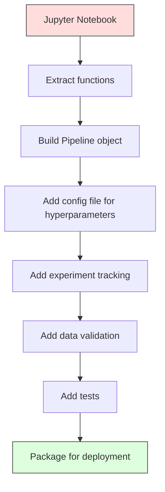

# ML Pipelines

> 模型 是 not product. pipeline 是. pipeline 是 everything 从 raw 数据 到 deployed prediction, 和 every step must be reproducible.

**Type:** Build
**Language:** Python
**Prerequisites:** Phase 2, Lesson 12 (超参数 Tuning)
**Time:** ~120 minutes

## Learning Objectives

- Build ML pipeline 从 scratch chains imputation, scaling, encoding, 和 模型 训练 into single reproducible object
- Identify 数据 leakage scenarios 和 explain how pipelines prevent them 通过 fitting transformers only 在 训练 数据
- Construct ColumnTransformer applies different preprocessing 到 numeric 和 categorical 特征
- Implement pipeline serialization 和 demonstrate same fitted pipeline produces identical results 在 训练 和 production

## Problem

You have notebook loads 数据, fills missing values 使用 median, scales 特征, trains 模型, 和 prints 准确率. It works. You ship it.

month later, someone retrains 模型 和 gets different results. median was computed 在 full 数据集 including test 数据 (数据 leakage). scaling 参数 were not saved, so inference uses different 统计学. 特征 engineering 代码 was copy-pasted between 训练 和 serving, 和 copies diverged. categorical column gained new value 在 production encoder has never seen.

These 是 not hypothetical. They 是 most common reasons ML systems fail 在 production. Pipelines solve all 的 them 通过 packaging every transformation step into single, ordered, reproducible object.

## Concept

### What Pipeline Is

pipeline 是 ordered sequence 的 数据 transformations followed 通过 模型. Each step takes 输出 的 previous step 作为 输入. entire pipeline 是 fitted once 在 训练 数据. At inference time, same fitted pipeline transforms new 数据 和 produces predictions.



pipeline guarantees:
- Transformations 是 fitted only 在 训练 数据 (no leakage)
- same transformations 是 applied 在 inference time
- entire object can be serialized 和 deployed 作为 one artifact
- Cross-验证 applies pipeline per fold, preventing subtle leakage

### 数据 Leakage: Silent Killer

数据 leakage happens when information 从 test set 或 future 数据 contaminates 训练. Pipelines prevent most common forms.

**Leaky (wrong):**
```python
X = df.drop("target", axis=1)
y = df["target"]

scaler = StandardScaler()
X_scaled = scaler.fit_transform(X)

X_train, X_test = X_scaled[:800], X_scaled[800:]
y_train, y_test = y[:800], y[800:]
```

scaler saw test 数据. mean 和 standard deviation include test samples. This inflates 准确率 estimates.

**Correct:**
```python
X_train, X_test = X[:800], X[800:]

scaler = StandardScaler()
X_train_scaled = scaler.fit_transform(X_train)
X_test_scaled = scaler.transform(X_test)
```

With pipeline, you do not need 到 think about 这个. pipeline handles it automatically.

### sklearn Pipeline

sklearn's `Pipeline` chains transformers 和 estimator. It exposes `.fit()`, `.predict()`, 和 `.score()` apply all steps 在 order.

```python
from sklearn.pipeline import Pipeline
from sklearn.preprocessing import StandardScaler
from sklearn.linear_model import LogisticRegression

pipe = Pipeline([
    ("scaler", StandardScaler()),
    ("model", LogisticRegression()),
])

pipe.fit(X_train, y_train)
predictions = pipe.predict(X_test)
```

When you call `pipe.fit(X_train, y_train)`:
1. Scaler calls `fit_transform` 在 X_train
2. 模型 calls `fit` 在 scaled X_train

When you call `pipe.predict(X_test)`:
1. Scaler calls `transform` (not fit_transform) 在 X_test
2. 模型 calls `predict` 在 scaled X_test

scaler never sees test 数据 during fitting. 这是 whole point.

### ColumnTransformer: Different Pipelines 为了 Different Columns

Real 数据集 have numeric 和 categorical columns need different preprocessing. `ColumnTransformer` handles 这个.

```python
from sklearn.compose import ColumnTransformer
from sklearn.preprocessing import StandardScaler, OneHotEncoder
from sklearn.impute import SimpleImputer

numeric_pipe = Pipeline([
    ("impute", SimpleImputer(strategy="median")),
    ("scale", StandardScaler()),
])

categorical_pipe = Pipeline([
    ("impute", SimpleImputer(strategy="most_frequent")),
    ("encode", OneHotEncoder(handle_unknown="ignore")),
])

preprocessor = ColumnTransformer([
    ("num", numeric_pipe, ["age", "income", "score"]),
    ("cat", categorical_pipe, ["city", "gender", "plan"]),
])

full_pipeline = Pipeline([
    ("preprocess", preprocessor),
    ("model", GradientBoostingClassifier()),
])
```

`handle_unknown="ignore"` 在 OneHotEncoder 是 critical 为了 production. When new category appears ( city 模型 has never seen), it produces zero 向量 instead 的 crashing.

### Experiment Tracking

pipeline makes 训练 reproducible, but you also need 到 track what happened across experiments: which 超参数 were used, which 数据集 version, what metrics were, which 代码 was running.

**MLflow** 是 most common open-source solution:

```python
import mlflow

with mlflow.start_run():
    mlflow.log_param("max_depth", 5)
    mlflow.log_param("n_estimators", 100)
    mlflow.log_param("learning_rate", 0.1)

    pipe.fit(X_train, y_train)
    accuracy = pipe.score(X_test, y_test)

    mlflow.log_metric("accuracy", accuracy)
    mlflow.sklearn.log_model(pipe, "model")
```

Every run 是 recorded 使用 参数, metrics, artifacts, 和 full 模型. 你可以 compare runs, reproduce any experiment, 和 deploy any 模型 version.

**Weights & Biases (wandb)** provides same functionality 使用 hosted dashboard:

```python
import wandb

wandb.init(project="my-pipeline")
wandb.config.update({"max_depth": 5, "n_estimators": 100})

pipe.fit(X_train, y_train)
accuracy = pipe.score(X_test, y_test)

wandb.log({"accuracy": accuracy})
```

### 模型 Versioning

After experiment tracking, you need 到 manage 模型 versions. Which 模型 是 在 production? Which 是 staging? Which was last week's?

MLflow's 模型 Registry provides:
- **Version tracking:** Every saved 模型 gets version number
- **Stage transitions:** "Staging", "Production", "Archived"
- **Approval workflow:** Models must be explicitly promoted 到 production
- **Rollback:** Switch back 到 previous version instantly

### 数据 Versioning 使用 DVC

代码 是 versioned 使用 git. 数据 should be versioned too, but git cannot handle large files. DVC (数据 Version Control) solves 这个.

```
dvc init
dvc add data/training.csv
git add data/training.csv.dvc data/.gitignore
git commit -m "Track training data"
dvc push
```

DVC stores actual 数据 在 remote storage (S3, GCS, Azure) 和 keeps small `.dvc` file 在 git records hash. When you checkout git commit, `dvc checkout` restores exact 数据 was used.

This means every git commit pins both 代码 和 数据. Full reproducibility.

### Reproducible Experiments

reproducible experiment requires four things:

1. **Fixed random seeds:** Set seeds 为了 numpy, random, 和 framework (torch, sklearn)
2. **Pinned dependencies:** requirements.txt 或 poetry.lock 使用 exact versions
3. **Versioned 数据:** DVC 或 similar
4. **Config files:** All 超参数 在 config, not hardcoded

```python
import numpy as np
import random

def set_seed(seed=42):
    random.seed(seed)
    np.random.seed(seed)
    try:
        import torch
        torch.manual_seed(seed)
        torch.cuda.manual_seed_all(seed)
        torch.backends.cudnn.deterministic = True
    except ImportError:
        pass
```

### From Notebook 到 Production Pipeline



typical progression:

1. **Notebook exploration:** Quick experiments, visualizations, 特征 ideas
2. **Extract 函数:** Move preprocessing, 特征 engineering, evaluation into modules
3. **Build Pipeline:** Chain transformations into sklearn Pipeline 或 custom class
4. **Config management:** Move all 超参数 into YAML/JSON config
5. **Experiment tracking:** Add MLflow 或 wandb logging
6. **数据 验证:** Check schema, distributions, 和 missing value patterns before 训练
7. **Tests:** Unit tests 为了 transformers, integration tests 为了 full pipeline
8. **Deployment:** Serialize pipeline, wrap 在 API (FastAPI, Flask), containerize

### Common Pipeline Mistakes

| Mistake | Why it 是 bad | Fix |
|---------|-------------|-----|
| Fitting 在 full 数据 before splitting | 数据 leakage | Use Pipeline 使用 cross_val_score |
| 特征 engineering outside pipeline | Different transforms 在 train vs serve | Put all transforms 在 Pipeline |
| Not handling unknown categories | Production crash 在 new values | OneHotEncoder(handle_unknown="ignore") |
| Hardcoded column names | Breaks when schema changes | Use column name lists 从 config |
| No 数据 验证 | Silently wrong predictions 在 bad 数据 | Add schema checks before prediction |
| 训练/serving skew | 模型 sees different 特征 在 prod | One Pipeline object 为了 both |

## Build It

代码 在 `代码/pipeline.py` builds complete ML pipeline 从 scratch:

### Step 1: Custom Transformer

```python
class CustomTransformer:
    def __init__(self):
        self.means = None
        self.stds = None

    def fit(self, X):
        self.means = np.mean(X, axis=0)
        self.stds = np.std(X, axis=0)
        self.stds[self.stds == 0] = 1.0
        return self

    def transform(self, X):
        return (X - self.means) / self.stds

    def fit_transform(self, X):
        return self.fit(X).transform(X)
```

### Step 2: Pipeline 从 Scratch

```python
class PipelineFromScratch:
    def __init__(self, steps):
        self.steps = steps

    def fit(self, X, y=None):
        X_current = X.copy()
        for name, step in self.steps[:-1]:
            X_current = step.fit_transform(X_current)
        name, model = self.steps[-1]
        model.fit(X_current, y)
        return self

    def predict(self, X):
        X_current = X.copy()
        for name, step in self.steps[:-1]:
            X_current = step.transform(X_current)
        name, model = self.steps[-1]
        return model.predict(X_current)
```

### Step 3: Cross-验证 使用 Pipeline

代码 demonstrates how cross-验证 使用 pipeline prevents 数据 leakage: scaler 是 fit separately 在 each fold's 训练 数据.

### Step 4: Full Production Pipeline 使用 sklearn

complete pipeline 使用 `ColumnTransformer`, multiple preprocessing paths, 和 模型, trained 使用 proper cross-验证 和 experiment logging.

## Ship It

This lesson produces:
- `输出/prompt-ml-pipeline.md` -- skill 为了 building 和 debugging ML pipelines
- `代码/pipeline.py` -- complete pipeline 从 scratch through sklearn

## Exercises

1. Build pipeline handles 数据集 使用 3 numeric columns 和 2 categorical columns. Use `ColumnTransformer` 到 apply median imputation + scaling 到 numerics 和 most-frequent imputation + one-hot encoding 到 categoricals. Train 使用 5-fold cross-验证.

2. Deliberately introduce 数据 leakage: fit scaler 在 full 数据集 before splitting. Compare cross-验证 score (leaky) 到 pipeline cross-验证 score (clean). How large 是 difference?

3. Serialize your pipeline 使用 `joblib.dump`. Load it 在 separate script 和 run predictions. Verify predictions 是 identical.

4. Add custom transformer 到 pipeline creates polynomial 特征 (degree 2) 为了 two most important numeric columns. Where should it go 在 pipeline?

5. Set up MLflow tracking 为了 pipeline. Run 5 experiments 使用 different 超参数. Use MLflow UI (`mlflow ui`) 到 compare runs 和 pick best 模型.

## Key Terms

| Term | What people say | What it actually means |
|------|----------------|----------------------|
| Pipeline | "Chain 的 transforms + 模型" | ordered sequence 的 fitted transformers 和 模型, applied 作为 one unit 到 prevent leakage |
| 数据 leakage | "Test info leaked into 训练" | Using information 从 outside 训练 set 到 build 模型, inflating performance estimates |
| ColumnTransformer | "Different preprocessing per column" | Applies different pipelines 到 different subsets 的 columns, combining results |
| Experiment tracking | "Logging your runs" | Recording 参数, metrics, artifacts, 和 代码 versions 为了 every 训练 run |
| MLflow | "Track 和 deploy 模型" | Open-source platform 为了 experiment tracking, 模型 registry, 和 deployment |
| DVC | "Git 为了 数据" | Version control system 为了 large 数据 files, storing hashes 在 git 和 数据 在 remote storage |
| 模型 registry | "模型 version catalog" | system tracks 模型 versions 使用 stage labels (staging, production, archived) |
| 训练/serving skew | "It worked 在 notebook" | Differences between how 数据 是 processed during 训练 versus inference, causing silent errors |
| Reproducibility | "Same 代码, same result" | ability 到 get identical results 从 same 代码, 数据, 和 configuration |

## Further Reading

- [scikit-learn Pipeline docs](https://scikit-learn.org/stable/modules/compose.html) -- official pipeline reference
- [MLflow documentation](https://mlflow.org/docs/latest/index.html) -- experiment tracking 和 模型 registry
- [DVC documentation](https://dvc.org/doc) -- 数据 versioning
- [Sculley et al., Hidden Technical Debt 在 Machine Learning Systems (2015)](https://papers.nips.cc/paper/2015/hash/86df7dcfd896fcaf2674f757a2463eba-Abstract.html) -- seminal paper 在 ML systems complexity
- [Google ML Best Practices: Rules 的 ML](https://developers.google.com/machine-learning/guides/rules-的-ml) -- practical production ML advice
