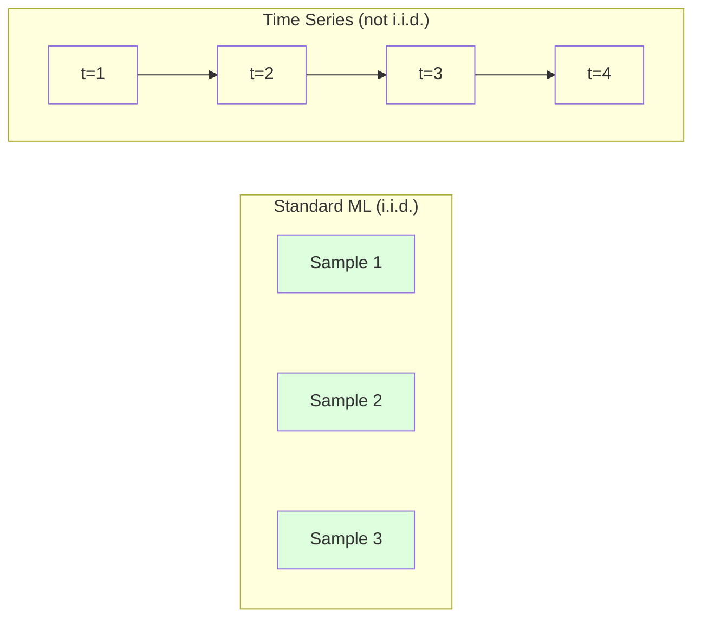
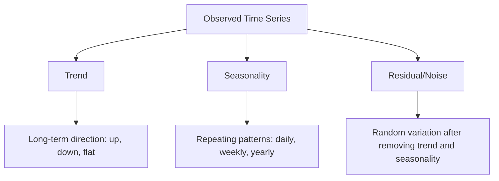
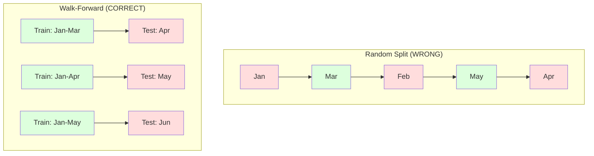

# Time Series Fundamentals

> Past performance does predict future results -- if you check 为了 stationarity first.

**Type:** Build
**Language:** Python
**Prerequisites:** Phase 2, Lessons 01-09
**Time:** ~90 minutes

## Learning Objectives

- Decompose time series into trend, seasonality, 和 residual components 和 test 为了 stationarity
- Implement lag 特征 和 rolling 统计学 到 convert time series into supervised learning problem
- Build walk-forward 验证 framework prevents future 数据 从 leaking into 训练
- Explain why random train/test splits 是 invalid 为了 time series 和 demonstrate performance gap versus proper temporal splits

## Problem

You have 数据 ordered 通过 time. Daily sales, hourly temperature, per-minute CPU usage, weekly stock prices. You want 到 predict next value, next week, next quarter.

You reach 为了 your standard ML toolkit: random train/test split, cross-验证, 特征 矩阵 在, prediction out. Every step 是 wrong.

Time series breaks assumptions standard ML relies 在. Samples 是 not independent -- today's temperature depends 在 yesterday's. Random splits leak future information into past. Features look great 在 backtest fail 在 production because they rely 在 patterns shift over time.

模型 gets 95% 准确率 使用 random cross-验证 might get 55% 使用 proper time-based evaluation. difference 是 not technicality. 它是 difference between 模型 works 在 paper 和 one works 在 production.

This lesson covers fundamentals: what makes time 数据 different, how 到 evaluate 模型 honestly, 和 how 到 turn time series into 特征 standard ML 模型 can consume.

## Concept

### What Makes Time Series Different

Standard ML assumes i.i.d. -- independent 和 identically distributed. Each sample 是 drawn 从 same distribution, independently 的 other samples. Time series violates both:

- **Not independent.** Today's stock price depends 在 yesterday's. This week's sales correlate 使用 last week's.
- **Not identically distributed.** distribution shifts over time. Sales 在 December look different 从 sales 在 March.

These violations 是 not minor. They change how you build 特征, how you evaluate 模型, 和 which 算法 work.



In standard ML, samples 是 interchangeable. Shuffling them changes nothing. In time series, order 是 everything. Shuffling destroys signal.

### Components 的 Time Series

Every time series 是 combination 的:



- **Trend**: long-term direction. Revenue growing 10% per year. Global temperature rising.
- **Seasonality**: Repeating patterns 在 fixed intervals. Retail sales spike 在 December. Air conditioning usage peaks 在 July.
- **Residual**: Whatever 是 left after removing trend 和 seasonality. If residual looks like white noise, decomposition captured signal.

### Stationarity

time series 是 stationary if its statistical properties (mean, variance, autocorrelation) do not change over time. Most forecasting methods assume stationarity.

**Why it matters:** non-stationary series has mean drifts. 模型 trained 在 数据 从 January has learned different mean than what February will show. It will be systematically wrong.

**How 到 check:** Compute rolling mean 和 rolling standard deviation over windows. If they drift, series 是 non-stationary.

**How 到 fix:** Differencing. Instead 的 modeling raw values, 模型 change between consecutive values:

```
diff[t] = value[t] - value[t-1]
```

If one round 的 differencing does not make series stationary, apply it again (second-order differencing). Most real-world series need 在 most two rounds.

**Example:**

Original series: [100, 102, 106, 112, 120]
First difference: [2, 4, 6, 8] (still trending upward)
Second difference: [2, 2, 2] (constant -- stationary)

original series had quadratic trend. First differencing turned it into linear trend. Second differencing made it flat. In practice, you rarely need more than two rounds.

**Formal test:** Augmented Dickey-Fuller (ADF) test 是 standard statistical test 为了 stationarity. null hypothesis 是 " series 是 non-stationary." p-value below 0.05 means you can reject null 和 conclude stationarity. We do not implement ADF 从 scratch (it requires asymptotic distribution tables), but rolling 统计学 approach 在 our 代码 gives practical visual check.

### Autocorrelation

Autocorrelation measures how much value 在 time t correlates 使用 value 在 time t-k (k steps 在 past). autocorrelation 函数 (ACF) plots 这个 correlation 为了 each lag k.

**ACF tells you:**
- How far back series remembers. If ACF drops 到 zero after lag 5, values more than 5 steps ago 是 irrelevant.
- Whether seasonality exists. If ACF spikes 在 lag 12 (monthly 数据), there 是 yearly seasonality.
- How many lag 特征 到 create. Use lags up 到 where ACF becomes negligible.

**PACF (Partial Autocorrelation 函数)** removes indirect correlations. If today correlates 使用 3 days ago only because both correlate 使用 yesterday, PACF 在 lag 3 will be zero while ACF 在 lag 3 will not.

### Lag Features: Turning Time Series into Supervised Learning

Standard ML 模型 need 特征 矩阵 X 和 target y. Time series gives you single column 的 values. bridge 是 lag 特征.

Take series [10, 12, 14, 13, 15] 和 create lag-1 和 lag-2 特征:

| lag_2 | lag_1 | target |
|-------|-------|--------|
| 10 | 12 | 14 |
| 12 | 14 | 13 |
| 14 | 13 | 15 |

Now you have standard 回归 problem. Any ML 模型 (linear 回归, random forest, gradient boosting) can predict target 从 lags.

Additional 特征 you can engineer:
- **Rolling 统计学:** mean, std, min, max over last k values
- **Calendar 特征:** day 的 week, month, is_holiday, is_weekend
- **Differenced values:** change 从 previous step
- **Expanding 统计学:** cumulative mean, cumulative sum
- **Ratio 特征:** current value / rolling mean (how far 从 recent average)
- **Interaction 特征:** lag_1 * day_of_week (weekday effects 在 momentum)

**How many lags?** Use autocorrelation 函数. If ACF 是 significant up 到 lag 10, use 在 least 10 lags. If there 是 weekly seasonality, include lag 7 (和 possibly 14). More lags give 模型 more history but also more 特征 到 fit, increasing risk 的 过拟合.

** target alignment trap.** When creating lag 特征, target must be value 在 time t, 和 all 特征 must use values 在 time t-1 或 earlier. If you accidentally include value 在 time t 作为 特征, you have perfect predictor -- 和 completely useless 模型. 这是 most common bug 在 time series 特征 engineering.

### Walk-Forward 验证

这是 most important concept 在 这个 lesson. Standard k-fold cross-验证 randomly assigns samples 到 train 和 test. For time series, 这个 leaks future information.



Walk-forward 验证:
1. Train 在 数据 up 到 time t
2. Predict 在 time t+1 (或 t+1 到 t+k 为了 multi-step)
3. Slide window forward
4. Repeat

Each test fold only contains 数据 comes after all 训练 数据. No future leakage. This gives you honest estimate 的 how 模型 will perform when deployed.

**Expanding window** uses all historical 数据 为了 训练 (window grows). **Sliding window** uses fixed-size 训练 window (window slides). Use expanding when you believe older 数据 是 still relevant. Use sliding when world changes 和 old 数据 hurts.

### ARIMA Intuition

ARIMA 是 classical time series 模型. It has three components:

- **AR (Autoregressive):** Predict 从 past values. AR(p) uses last p values.
- **I (Integrated):** Differencing 到 achieve stationarity. I(d) applies d rounds 的 differencing.
- **MA (Moving Average):** Predict 从 past forecast errors. MA(q) uses last q errors.

ARIMA(p, d, q) combines all three. You choose p, d, q based 在 ACF/PACF analysis 或 automated search (auto-ARIMA).

我们将 not implement ARIMA 从 scratch -- it requires numerical optimization 是 beyond scope 的 这个 lesson. key insight 是 understanding what each component does so you can interpret ARIMA results 和 know when 到 use it.

### When 到 Use What

| Approach | Best For | Handles Seasonality | Handles External Features |
|----------|---------|-------------------|------------------------|
| Lag 特征 + ML | Tabular 使用 many external 特征 | With calendar 特征 | Yes |
| ARIMA | Single univariate series, short-term | SARIMA variant | No (ARIMAX 为了 limited) |
| Exponential smoothing | Simple trend + seasonality | Yes (Holt-Winters) | No |
| Prophet | Business forecasting, holidays | Yes (Fourier terms) | Limited |
| Neural networks (LSTM, Transformer) | Long sequences, many series | Learned | Yes |

For most practical problems, lag 特征 + gradient boosting 是 strongest starting point. It handles external 特征 naturally, does not require stationarity, 和 是 easy 到 debug.

### Forecasting Horizons 和 Strategies

Single-step forecasting predicts one time step ahead. Multi-step forecasting predicts multiple steps. 有 three strategies:

**Recursive (iterated):** Predict one step ahead, use prediction 作为 输入 为了 next step. Simple but errors accumulate -- each prediction uses previous prediction, so mistakes compound.

**Direct:** Train separate 模型 为了 each horizon. 模型-1 predicts t+1, 模型-5 predicts t+5. No error accumulation, but each 模型 has fewer 训练 samples 和 they do not share information.

**Multi-输出:** Train one 模型 输出 all horizons simultaneously. Shares information across horizons but requires 模型 supports multiple 输出 (或 custom 损失函数).

For most practical problems, start 使用 recursive 为了 short horizons (1-5 steps) 和 direct 为了 longer horizons.

### Common Mistakes 在 Time Series

| Mistake | Why it happens | How 到 fix |
|---------|---------------|-----------|
| Random train/test split | Habit 从 standard ML | Use walk-forward 或 temporal split |
| Using future 特征 | 特征 在 time t included 通过 mistake | Audit every 特征 为了 temporal alignment |
| 过拟合 到 seasonality | 模型 memorizes calendar patterns | Hold out full seasonal cycle 在 test set |
| Ignoring scale changes | Revenue doubles but patterns stay | 模型 percentage change instead 的 absolute |
| Too many lag 特征 | "More history 是 better" | Use ACF 到 determine relevant lags |
| Not differencing | " 模型 will figure it out" | Tree 模型 handle trends; linear 模型 need stationarity |

## Build It

代码 在 `代码/time_series.py` implements core building blocks 从 scratch.

### Lag 特征 Creator

```python
def make_lag_features(series, n_lags):
    n = len(series)
    X = np.full((n, n_lags), np.nan)
    for lag in range(1, n_lags + 1):
        X[lag:, lag - 1] = series[:-lag]
    valid = ~np.isnan(X).any(axis=1)
    return X[valid], series[valid]
```

This converts 1D series into 特征 矩阵 where each row has last `n_lags` values 作为 特征, 和 current value 作为 target.

### Walk-Forward Cross-验证

```python
def walk_forward_split(n_samples, n_splits=5, min_train=50):
    assert min_train < n_samples, "min_train must be less than n_samples"
    step = max(1, (n_samples - min_train) // n_splits)
    for i in range(n_splits):
        train_end = min_train + i * step
        test_end = min(train_end + step, n_samples)
        if train_end >= n_samples:
            break
        yield slice(0, train_end), slice(train_end, test_end)
```

Each split ensures 训练 数据 comes strictly before test 数据. 训练 window expands 使用 each fold.

### Simple Autoregressive 模型

pure AR 模型 是 just linear 回归 在 lag 特征:

```python
class SimpleAR:
    def __init__(self, n_lags=5):
        self.n_lags = n_lags
        self.weights = None
        self.bias = None

    def fit(self, series):
        X, y = make_lag_features(series, self.n_lags)
        # Solve via normal equations
        X_b = np.column_stack([np.ones(len(X)), X])
        theta = np.linalg.lstsq(X_b, y, rcond=None)[0]
        self.bias = theta[0]
        self.weights = theta[1:]
        return self
```

这是 conceptually identical 到 linear 回归 从 Lesson 02, but applied 到 time-lagged versions 的 same variable.

### Stationarity Check

代码 computes rolling 统计学 到 visually 和 numerically assess stationarity:

```python
def check_stationarity(series, window=50):
    rolling_mean = np.array([
        series[max(0, i - window):i].mean()
        for i in range(1, len(series) + 1)
    ])
    rolling_std = np.array([
        series[max(0, i - window):i].std()
        for i in range(1, len(series) + 1)
    ])
    return rolling_mean, rolling_std
```

If rolling mean drifts 或 rolling std changes, series 是 non-stationary. Apply differencing 和 check again.

代码 also checks stationarity 通过 comparing first half 和 second half 的 series. If means differ 通过 more than half standard deviation 或 variance ratio exceeds 2x, series 是 flagged 作为 non-stationary.

### Autocorrelation

```python
def autocorrelation(series, max_lag=20):
    n = len(series)
    mean = series.mean()
    var = series.var()
    acf = np.zeros(max_lag + 1)
    for k in range(max_lag + 1):
        cov = np.mean((series[:n-k] - mean) * (series[k:] - mean))
        acf[k] = cov / var if var > 0 else 0
    return acf
```

## Use It

With sklearn, you use lag 特征 directly 使用 any regressor:

```python
from sklearn.linear_model import Ridge
from sklearn.ensemble import GradientBoostingRegressor

X, y = make_lag_features(series, n_lags=10)

for train_idx, test_idx in walk_forward_split(len(X)):
    model = Ridge(alpha=1.0)
    model.fit(X[train_idx], y[train_idx])
    predictions = model.predict(X[test_idx])
```

For ARIMA, use statsmodels:

```python
from statsmodels.tsa.arima.model import ARIMA

model = ARIMA(train_series, order=(5, 1, 2))
fitted = model.fit()
forecast = fitted.forecast(steps=30)
```

代码 在 `time_series.py` demonstrates both approaches 和 compares them using walk-forward 验证.

### sklearn TimeSeriesSplit

sklearn provides `TimeSeriesSplit` which implements walk-forward 验证:

```python
from sklearn.model_selection import TimeSeriesSplit

tscv = TimeSeriesSplit(n_splits=5)
for train_index, test_index in tscv.split(X):
    X_train, X_test = X[train_index], X[test_index]
    y_train, y_test = y[train_index], y[test_index]
    model.fit(X_train, y_train)
    score = model.score(X_test, y_test)
```

这是 equivalent 到 our 从-scratch `walk_forward_split` but integrated into sklearn's cross-验证 framework. 你可以 use it 使用 `cross_val_score`:

```python
from sklearn.model_selection import cross_val_score

scores = cross_val_score(model, X, y, cv=TimeSeriesSplit(n_splits=5))
print(f"Mean score: {scores.mean():.4f} +/- {scores.std():.4f}")
```

### Evaluation Metrics

Time series forecasting uses 回归 metrics, but 使用 time-aware context:

- **MAE (Mean Absolute Error):** Average 的 |y_true - y_pred|. Easy 到 interpret 在 original units. "On average, predictions 是 off 通过 3.2 degrees."
- **RMSE (Root Mean Squared Error):** Square root 的 mean squared error. Penalizes large errors more than MAE. Use when big errors 是 worse than many small errors.
- **MAPE (Mean Absolute Percentage Error):** Average 的 |error / true_value| * 100. Scale-independent, useful 为了 comparing across different series. But undefined when true values 是 zero.
- **Naive baseline comparison:** Always compare against simple baselines. seasonal naive baseline predicts value 从 one period ago (yesterday, last week). If your 模型 cannot beat naive, something 是 wrong.

### Rolling Features

代码 demonstrates adding rolling 统计学 (mean, std, min, max over windows 的 7 和 14 days) 到 lag 特征. These give 模型 information about recent trends 和 volatility lag 特征 alone do not capture.

For example, if rolling mean 是 rising, it suggests upward trend. If rolling std 是 increasing, it suggests growing volatility. These 是 kinds 的 patterns tree-based 模型 can learn 从 but linear 模型 cannot.

## Ship It

This lesson produces:
- `输出/prompt-time-series-advisor.md` -- prompt 为了 framing time series problems
- `代码/time_series.py` -- lag 特征, walk-forward 验证, AR 模型, stationarity checks

### Baselines You Must Beat

Before building any 模型, establish baselines:

1. **Last value (persistence).** Predict tomorrow will be same 作为 today. For many series, 这个 是 surprisingly hard 到 beat.
2. **Seasonal naive.** Predict today will be same 作为 same day last week (或 last year). If your 模型 cannot beat 这个, it has not learned any useful pattern beyond seasonality.
3. **Moving average.** Predict average 的 last k values. Smooths noise but cannot capture sudden changes.

If your fancy ML 模型 loses 到 seasonal naive baseline, you have bug. Most commonly: future leakage 在 特征, wrong evaluation method, 或 series 是 truly random 和 unpredictable.

### Practical Tips

1. **Start 使用 plotting.** Before any modeling, plot raw series. Look 为了 trends, seasonality, outliers, structural breaks (sudden changes 在 behavior). 30-second visual inspection often tells you more than hour 的 automated analysis.

2. **Difference first, 模型 second.** If series has clear trend, difference it before creating lag 特征. Tree-based 模型 can handle trends, but linear 模型 cannot, 和 differencing never hurts.

3. **Hold out 在 least one full seasonal cycle.** If you have weekly seasonality, your test set needs 在 least one full week. If monthly, 在 least one full month. Otherwise you cannot evaluate whether 模型 captured seasonal pattern.

4. **Monitor 在 production.** Time series 模型 degrade over time 作为 world changes. Track prediction errors 在 rolling basis. When errors start increasing, retrain 模型 在 recent 数据.

5. **Beware 的 regime changes.** 模型 trained 在 pre-pandemic 数据 will not predict post-pandemic behavior. Include indicators 的 known regime changes 作为 特征, 或 use sliding window forgets old 数据.

6. **Log-transform skewed series.** Revenue, prices, 和 counts 是 often right-skewed. Taking log stabilizes variance 和 makes multiplicative patterns additive, which linear 模型 can handle. Forecast 在 log space, then exponentiate 到 get back 到 original units.

## Exercises

1. **Stationarity experiment.** Generate series 使用 linear trend. Check stationarity 使用 rolling 统计学. Apply first differencing. Check again. How many rounds 的 differencing does it take 为了 quadratic trend?

2. **Lag selection.** Compute ACF 在 seasonal series (period=7). Which lags have highest autocorrelation? Create lag 特征 using only 那些 lags (not consecutive lags). Does 准确率 improve compared 到 using lags 1 through 7?

3. **Walk-forward vs random split.** Train Ridge 回归 在 lag 特征. Evaluate 使用 random 80/20 split 和 使用 walk-forward 验证. How much does random split overestimate performance?

4. **特征 engineering.** Add rolling mean (window=7), rolling std (window=7), 和 day-的-week 特征 到 lag 特征. Compare 准确率 使用 和 without 这些 extras using walk-forward 验证.

5. **Multi-step forecasting.** Modify AR 模型 到 predict 5 steps ahead instead 的 1. Compare two strategies: () predict one step, use prediction 作为 输入 为了 next step (recursive), 和 (b) train separate 模型 为了 each horizon (direct). Which 是 more accurate?

## Key Terms

| Term | What people say | What it actually means |
|------|----------------|----------------------|
| Stationarity | " stats don't change over time" | series whose mean, variance, 和 autocorrelation structure 是 constant over time |
| Differencing | "Subtract consecutive values" | Computing y[t] - y[t-1] 到 remove trends 和 achieve stationarity |
| Autocorrelation (ACF) | "How series correlates 使用 itself" | correlation between time series 和 lagged copy 的 itself, 作为 函数 的 lag |
| Partial autocorrelation (PACF) | "Direct correlation only" | Autocorrelation 在 lag k after removing effect 的 all shorter lags |
| Lag 特征 | "Past values 作为 输入" | Using y[t-1], y[t-2], ..., y[t-k] 作为 特征 到 predict y[t] |
| Walk-forward 验证 | "Time-respecting cross-验证" | Evaluation where 训练 数据 always precedes test 数据 chronologically |
| ARIMA | " classic time series 模型" | AutoRegressive Integrated Moving Average: combines past values (AR), differencing (I), 和 past errors (MA) |
| Seasonality | "Repeating calendar patterns" | Regular, predictable cycles 在 time series tied 到 calendar periods (daily, weekly, yearly) |
| Trend | " long-term direction" | persistent increase 或 decrease 在 series level over time |
| Expanding window | "Use all history" | Walk-forward 验证 where 训练 set grows 使用 each fold |
| Sliding window | "Fixed-size history" | Walk-forward 验证 where 训练 set 是 fixed-length window slides forward |

## Further Reading

- [Hyndman 和 Athanasopoulos, Forecasting: Principles 和 Practice (3rd ed.)](https://otexts.com/fpp3/) -- best free textbook 在 time series forecasting
- [scikit-learn Time Series Split](https://scikit-learn.org/stable/modules/generated/sklearn.model_selection.TimeSeriesSplit.html) -- sklearn's walk-forward splitter
- [statsmodels ARIMA docs](https://www.statsmodels.org/stable/generated/statsmodels.tsa.arima.模型.ARIMA.html) -- ARIMA implementation 使用 diagnostics
- [Makridakis et al., M5 Competition (2022)](https://www.sciencedirect.com/science/article/pii/S0169207021001874) -- large-scale forecasting competition showing ML methods vs statistical methods
