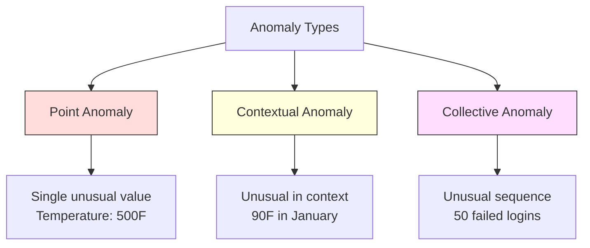
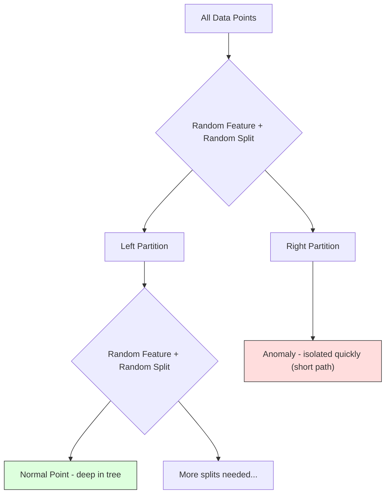
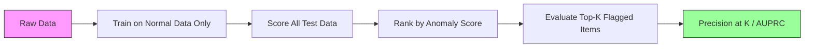

# Anomaly Detection

> Normal 是 easy 到 define. Abnormal 是 whatever doesn't fit.

**Type:** Build
**Language:** Python
**Prerequisites:** Phase 2, Lessons 01-09
**Time:** ~75 minutes

## Learning Objectives

- Implement Z-score, IQR, 和 Isolation Forest anomaly detection methods 从 scratch
- Distinguish between point, contextual, 和 collective anomalies 和 select appropriate detection method 为了 each
- Explain why anomaly detection 是 framed 作为 modeling normal 数据 rather than classifying anomalies
- Compare unsupervised anomaly detection 使用 supervised 分类 和 evaluate tradeoff between novel anomaly coverage 和 精确率

## Problem

credit card 是 used 在 New York 在 2pm, then 在 Tokyo 在 2:05pm. factory sensor reads 150 degrees when normal range 是 80-120. server sends 50,000 requests per second when daily average 是 200.

These 是 anomalies. Finding them matters. Fraud costs billions. Equipment failures cost downtime. Network intrusions cost 数据.

challenge: you rarely have labeled examples 的 anomalies. Fraud makes up 0.1% 的 transactions. Equipment failures happen few times per year. You cannot train standard classifier because there 是 almost nothing 在 "anomaly" class 到 learn 从. Even if you have some labels, anomalies you have seen 是 not only types you will encounter. Tomorrow's fraud scheme looks different 从 today's.

Anomaly detection flips problem. Instead 的 learning what 是 abnormal, learn what 是 normal. Anything deviates 从 normal 是 suspicious. This works without labels, adapts 到 new types 的 anomalies, 和 scales 到 massive 数据集.

## Concept

### Types 的 Anomalies

Not all anomalies 是 same:

- **Point anomalies.** single 数据 point 是 unusual regardless 的 context. temperature reading 的 500 degrees. transaction 的 $50,000 从 account normally spends $50.
- **Contextual anomalies.** 数据 point 是 unusual given its context. temperature 的 90 degrees 是 normal 在 summer, anomalous 在 winter. Same value, different context.
- **Collective anomalies.** sequence 的 数据 points 是 unusual 作为 group, even though each individual point might be normal. Five login failures 是 normal. Fifty 在 row 是 brute-force attack.

Most methods detect point anomalies. Contextual anomalies need time 或 location 特征. Collective anomalies need sequence-aware methods.



### Unsupervised Framing

In standard 分类, you have labels 为了 both classes. In anomaly detection, you typically have one 的 three situations:

1. **Fully unsupervised.** No labels 在 all. You fit detector 在 all 数据 和 hope anomalies 是 rare enough not 到 corrupt "normal" 模型.
2. **Semi-supervised.** You have clean 数据集 的 normal 数据 only. You fit 在 这个 clean set 和 score everything else. 这是 strongest setup when possible.
3. **Weakly supervised.** You have few labeled anomalies. Use them 为了 evaluation, not 训练. Train unsupervised, then measure 精确率/召回率 在 labeled subset.

key insight: anomaly detection 是 fundamentally different 从 分类. You 是 modeling distribution 的 normal 数据, not decision boundary between two classes.

### Supervised vs Unsupervised: Tradeoff

If you do have labeled anomalies, should you use them 为了 训练 (supervised 分类) 或 为了 evaluation only (unsupervised detection)?

**Supervised (treat 作为 分类):**
- Catches exact types 的 anomalies you have seen before
- Higher 精确率 在 known anomaly types
- Misses novel anomaly types entirely
- Requires retraining when new anomaly types emerge
- Needs enough anomaly examples (often too few)

**Unsupervised (模型 normal, flag deviations):**
- Catches any deviation 从 normal, including novel types
- Does not require labeled anomalies
- Higher false positive rate (not everything unusual 是 bad)
- More robust 到 distribution shift

In practice, best systems combine both: unsupervised detection 为了 broad coverage, supervised 模型 为了 known high-priority anomaly types, 和 human review 为了 ambiguous cases.

### Z-Score Method

simplest approach. Compute mean 和 standard deviation 的 each 特征. Flag any point more than k standard deviations 从 mean.

```text
z_score = (x - mean) / std
anomaly if |z_score| > threshold
```

default threshold 是 3.0 (99.7% 的 normal 数据 falls within 3 standard deviations 为了 Gaussian distribution).

**Strengths:** Simple. Fast. Interpretable ("这个 value 是 4.5 standard deviations 从 normal").

**Weaknesses:** Assumes 数据 是 normally distributed. Sensitive 到 outliers 在 训练 数据 ( outliers shift mean 和 inflate std, making them harder 到 detect). Fails 在 multimodal distributions.

**When it works well:** Single-特征 monitoring where 数据 是 roughly bell-shaped. Server response times, manufacturing tolerances, sensor readings 使用 stable baselines.

**When it fails:** Multi-cluster 数据 (two office locations 使用 different baseline temperatures), skewed 数据 (transaction amounts where $1000 是 rare but not anomalous), 数据 使用 outliers 在 训练 set.

### IQR Method

More robust than Z-score. Uses interquartile range instead 的 mean 和 standard deviation.

```
Q1 = 25th percentile
Q3 = 75th percentile
IQR = Q3 - Q1
lower_bound = Q1 - factor * IQR
upper_bound = Q3 + factor * IQR
anomaly if x < lower_bound or x > upper_bound
```

default factor 是 1.5.

**Strengths:** Robust 到 outliers (percentiles 是 not affected 通过 extreme values). Works 在 skewed distributions. No normality assumption.

**Weaknesses:** Univariate only (applies per 特征 independently). Cannot detect anomalies 是 unusual only when 特征 是 considered together ( point might be normal 在 each 特征 individually but anomalous 在 joint space).

**Practical note:** 1.5 factor 在 IQR corresponds 到 whiskers 在 box plot. Points outside whiskers 是 potential outliers. Using 3.0 instead 的 1.5 makes detector more conservative (fewer flags, fewer false positives). right factor depends 在 your tolerance 为了 false alarms.

### Isolation Forest

key insight: anomalies 是 few 和 different. In random partitioning 的 数据, anomalies 是 easier 到 isolate -- they need fewer random splits 到 be separated 从 rest.



**How it works:**
1. Build many random trees ( isolation forest)
2. At each 节点, pick random 特征 和 random split value between 特征's min 和 max
3. Keep splitting until every point 是 isolated (在 its own leaf)
4. Anomalies have shorter average path lengths across all trees

**Why it works:** Normal points live 在 dense regions. Many random splits 是 needed 到 isolate one 从 its neighbors. Anomalies live 在 sparse regions. One 或 two random splits 是 enough 到 isolate them.

anomaly score 是 based 在 average path length across all trees, normalized 通过 expected path length 的 random binary search tree:

```
score(x) = 2^(-average_path_length(x) / c(n))
```

Where `c(n)` 是 expected path length 为了 n samples. Score near 1 means anomaly. Score near 0.5 means normal. Score near 0 means very normal (deep 在 dense clusters).

**Strengths:** No distribution assumptions. Works 在 high dimensions. Scales well (sublinear 在 sample size because each tree uses subsample). Handles mixed 特征 types.

**Weaknesses:** Struggles 使用 anomalies 在 dense regions (masking effect). Random splitting 是 less effective when many 特征 是 irrelevant.

**Key 超参数:**
- `n_estimators`: Number 的 trees. 100 是 usually enough. More trees give more stable scores but slower computation.
- `max_samples`: Number 的 samples per tree. 256 是 default 在 original paper. Smaller values make individual trees less accurate but increase diversity. subsampling 是 what makes Isolation Forest fast -- each tree sees small fraction 的 数据.
- `contamination`: Expected fraction 的 anomalies. Used only 为了 setting threshold. Does not affect scores themselves.

### Local Outlier Factor (LOF)

LOF compares local density around point 到 density around its neighbors. point 在 sparse region surrounded 通过 dense regions 是 anomalous.

**How it works:**
1. For each point, find its k nearest neighbors
2. Compute local reachability density (how dense 是 neighborhood)
3. Compare each point's density 到 its neighbors' densities
4. If point has much lower density than its neighbors, it 是 outlier

**LOF score:**
- LOF close 到 1.0 means similar density 作为 neighbors (normal)
- LOF greater than 1.0 means lower density than neighbors (potentially anomalous)
- LOF much greater than 1.0 (e.g., 2.0+) means significantly lower density (likely anomaly)

"local" part 是 critical. Consider 数据集 使用 two clusters: dense cluster 的 1000 points 和 sparse cluster 的 50 points. point 在 edge 的 sparse cluster 是 not globally unusual -- it has 50 neighbors. But it 是 locally unusual if its immediate neighbors 是 denser than it 是. LOF captures 这个 nuance global methods miss.

**Strengths:** Detects local anomalies (points 是 unusual 在 their neighborhood, even if they 是 not globally unusual). Works 在 clusters 的 different densities.

**Weaknesses:** Slow 在 large 数据集 (O(n^2) 为了 naive implementation). Sensitive 到 choice 的 k. Does not work well 在 very high dimensions (curse 的 dimensionality affects distance calculations).

### Comparison

| Method | Assumptions | Speed | Handles High Dims | Detects Local Anomalies |
|--------|------------|-------|-------------------|------------------------|
| Z-score | Normal distribution | Very fast | Yes (per 特征) | No |
| IQR | None (per 特征) | Very fast | Yes (per 特征) | No |
| Isolation Forest | None | Fast | Yes | Partially |
| LOF | Distance 是 meaningful | Slow | Poorly | Yes |

### Evaluation Challenges

Evaluating anomaly detectors 是 harder than evaluating classifiers:

- **Extreme class imbalance.** With 0.1% anomalies, predicting "normal" 为了 everything gives 99.9% 准确率. 准确率 是 useless.
- **AUROC 是 misleading.** With heavy imbalance, AUROC can look good even when 模型 misses most anomalies 在 practical thresholds.
- **Better metrics:** 精确率@k (的 top k flagged items, how many 是 real anomalies), AUPRC (area under 精确率-召回率 curve), 和 召回率 在 fixed false positive rate.



### Anomaly Detection Pipeline

In practice, anomaly detection follows 这个 workflow:

1. **Collect baseline 数据.** Ideally, period where you know there 是 no (或 very few) anomalies.
2. **特征 engineering.** Raw 特征 plus derived 特征 (rolling 统计学, time 特征, ratios).
3. **Train detector.** Fit 在 baseline 数据. 模型 learns what "normal" looks like.
4. **Score new 数据.** Each new observation gets anomaly score.
5. **Threshold selection.** Choose score cutoff. 这是 business decision: higher threshold means fewer false alarms but more missed anomalies.
6. **Alert 和 investigate.** Flagged points go 到 human review 或 automated response.
7. **Feedback collection.** Record whether flagged items were true anomalies 或 false alarms. Use 这个 数据 到 evaluate detector 和 tune threshold over time.

pipeline 是 never "done." 数据 distributions shift, new anomaly types emerge, 和 thresholds need adjustment. Treat anomaly detection 作为 living system, not one-time 模型.

## Build It

代码 在 `代码/anomaly_detection.py` implements Z-score, IQR, 和 Isolation Forest 从 scratch.

### Z-Score Detector

```python
def zscore_detect(X, threshold=3.0):
    mean = X.mean(axis=0)
    std = X.std(axis=0)
    std[std == 0] = 1.0
    z = np.abs((X - mean) / std)
    return z.max(axis=1) > threshold
```

Simple 和 vectorized. Flags point if any 特征 exceeds threshold.

### IQR Detector

```python
def iqr_detect(X, factor=1.5):
    q1 = np.percentile(X, 25, axis=0)
    q3 = np.percentile(X, 75, axis=0)
    iqr = q3 - q1
    iqr[iqr == 0] = 1.0
    lower = q1 - factor * iqr
    upper = q3 + factor * iqr
    outside = (X < lower) | (X > upper)
    return outside.any(axis=1)
```

### Isolation Forest 从 Scratch

从-scratch implementation builds isolation trees randomly partition 特征 space:

```python
class IsolationTree:
    def __init__(self, max_depth):
        self.max_depth = max_depth

    def fit(self, X, depth=0):
        n, p = X.shape
        if depth >= self.max_depth or n <= 1:
            self.is_leaf = True
            self.size = n
            return self
        self.is_leaf = False
        self.feature = np.random.randint(p)
        x_min = X[:, self.feature].min()
        x_max = X[:, self.feature].max()
        if x_min == x_max:
            self.is_leaf = True
            self.size = n
            return self
        self.threshold = np.random.uniform(x_min, x_max)
        left_mask = X[:, self.feature] < self.threshold
        self.left = IsolationTree(self.max_depth).fit(X[left_mask], depth + 1)
        self.right = IsolationTree(self.max_depth).fit(X[~left_mask], depth + 1)
        return self
```

path length 到 isolate point determines its anomaly score. Shorter paths mean more anomalous.

`IsolationForest` class wraps multiple trees:

```python
class IsolationForest:
    def __init__(self, n_estimators=100, max_samples=256, seed=42):
        self.n_estimators = n_estimators
        self.max_samples = max_samples

    def fit(self, X):
        sample_size = min(self.max_samples, X.shape[0])
        max_depth = int(np.ceil(np.log2(sample_size)))
        for _ in range(self.n_estimators):
            idx = rng.choice(X.shape[0], size=sample_size, replace=False)
            tree = IsolationTree(max_depth=max_depth)
            tree.fit(X[idx])
            self.trees.append(tree)

    def anomaly_score(self, X):
        avg_path = average path length across all trees
        scores = 2.0 ** (-avg_path / c(max_samples))
        return scores
```

normalization factor `c(n)` 是 expected path length 的 unsuccessful search 在 binary search tree 使用 n elements. It equals `2 * H(n-1) - 2*(n-1)/n` where `H` 是 harmonic number. This normalization ensures scores 是 comparable across 数据集 的 different sizes.

### Demo Scenarios

代码 generates multiple test scenarios:

1. **Single cluster 使用 outliers.** 2D Gaussian cluster 使用 anomalies injected far 从 center. All methods should work here.
2. **Multimodal 数据.** Three clusters 的 different sizes 和 densities. Points between clusters 是 anomalous. Z-score struggles because per-特征 ranges 是 wide.
3. **High-dimensional 数据.** 50 特征, but anomalies differ 在 only 5 的 them. Tests whether methods can find anomalies 在 subset 的 特征.

Each demo compares all methods using 精确率, 召回率, F1, 和 精确率@k.

## Use It

With sklearn (using library implementations, not 从-scratch):

```python
from sklearn.ensemble import IsolationForest
from sklearn.neighbors import LocalOutlierFactor

iso = IsolationForest(n_estimators=100, contamination=0.05, random_state=42)
iso.fit(X_train)
predictions = iso.predict(X_test)

lof = LocalOutlierFactor(n_neighbors=20, contamination=0.05, novelty=True)
lof.fit(X_train)
predictions = lof.predict(X_test)
```

Note `contamination` sets expected fraction 的 anomalies. Setting it correctly matters -- too low misses anomalies, too high creates false alarms.

代码 在 `anomaly_detection.py` compares 从-scratch implementations against sklearn 在 same 数据.

### sklearn Contamination 参数

`contamination` 参数 在 sklearn determines threshold 为了 converting continuous anomaly scores into binary predictions. It does not change underlying scores.

```python
iso_5 = IsolationForest(contamination=0.05)
iso_10 = IsolationForest(contamination=0.10)
```

Both produce same anomaly scores. But `iso_5` flags top 5% while `iso_10` flags top 10%. If you do not know true anomaly rate (you usually do not), set contamination 到 "auto" 和 work 使用 raw scores directly. Set your own threshold based 在 cost tradeoff between false positives 和 false negatives.

### One-Class SVM

Another unsupervised anomaly detector worth knowing. One-Class SVM fits boundary around normal 数据 在 high-dimensional 特征 space (using kernel trick).

```python
from sklearn.svm import OneClassSVM

oc_svm = OneClassSVM(kernel="rbf", gamma="auto", nu=0.05)
oc_svm.fit(X_train)
predictions = oc_svm.predict(X_test)
```

`nu` 参数 approximates fraction 的 anomalies. One-Class SVM works well 在 small 到 medium 数据集 but does not scale 到 very large 数据 ( kernel 矩阵 grows quadratically).

### Autoencoder Approach (Preview)

Autoencoders 是 神经网络 learn 到 compress 和 reconstruct 数据. Train 在 normal 数据. At test time, anomalies have high reconstruction error because network learned 到 reconstruct normal patterns only.

这是 covered 在 Phase 3 (Deep Learning), but principle 是 same: 模型 what 是 normal, flag what deviates.

### Ensemble Anomaly Detection

Just 作为 ensemble methods improve 分类 (Lesson 11), combining multiple anomaly detectors improves detection. simplest approach:

1. Run multiple detectors (Z-score, IQR, Isolation Forest, LOF)
2. Normalize each detector's scores 到 [0, 1]
3. Average normalized scores
4. Flag points above threshold 在 average score

This reduces false positives because different methods have different failure modes. point flagged 通过 all four methods 是 almost certainly anomalous. point flagged 通过 only one might be quirk 的 method.

More sophisticated ensembles 权重 each detector 通过 its estimated reliability (measured 在 验证 set 使用 known anomalies, if available).

### Production Considerations

1. **Threshold drift.** As 数据 distribution shifts, fixed threshold becomes outdated. Monitor distribution 的 anomaly scores 和 adjust periodically.
2. **Alert fatigue.** Too many false alarms 和 operators stop paying attention. Start 使用 high threshold (fewer, more reliable alerts) 和 lower it 作为 trust builds.
3. **Ensemble approach.** In production, combine multiple detectors. Flag point only if multiple methods agree it 是 anomalous. This reduces false positives significantly.
4. **特征 engineering.** Raw 特征 是 rarely enough. Add rolling 统计学, ratios, time-since-last-event, 和 domain-specific 特征. good 特征 set matters more than choice 的 detector.
5. **Feedback loop.** When operators investigate flagged items 和 confirm 或 dismiss them, feed 这个 back into system. Accumulate labeled 数据 over time 到 evaluate 和 improve detector.

## Ship It

This lesson produces:
- `输出/skill-anomaly-detector.md` -- decision skill 为了 choosing right detector
- `代码/anomaly_detection.py` -- Z-score, IQR, 和 Isolation Forest 从 scratch, 使用 sklearn comparison

### Choosing Threshold

anomaly score 是 continuous. 你需要 threshold 到 make binary decisions. 这是 business decision, not technical one.

Consider two scenarios:
- **Fraud detection.** Missing fraud 是 expensive (chargebacks, customer trust). False alarms cost human analyst 5 minutes 到 investigate. Set threshold low 到 catch more fraud, accept more false alarms.
- **Equipment maintenance.** false alarm means unnecessary shutdown costing $50,000. missed failure means $500,000 repair. Set threshold 到 balance 这些 costs.

In both cases, optimal threshold depends 在 cost ratio between false positives 和 false negatives. Plot 精确率 和 召回率 在 different thresholds, overlay cost 函数, 和 pick minimum-cost point.

### Scaling 到 Production

For real-time anomaly detection 在 production:

1. **批次 训练, online scoring.** Train 模型 periodically (daily, weekly) 在 recent normal 数据. Score each new observation 作为 it arrives.
2. **特征 computation must match.** If you trained 使用 rolling 统计学 over 30 days, you need 30 days 的 history 到 compute 特征 为了 new observation. Buffer required history.
3. **Score distribution monitoring.** Track distribution 的 anomaly scores over time. If median score drifts upward, either 数据 是 changing 或 模型 是 stale.
4. **Explainability.** When you flag anomaly, say why. Z-score: "特征 X 是 4.2 standard deviations above normal." Isolation Forest: "This point was isolated 在 3.1 splits 在 average (normal points take 8.5)."

## Exercises

1. **Threshold tuning.** Run Z-score detector 使用 thresholds 从 1.0 到 5.0 在 steps 的 0.5. Plot 精确率 和 召回率 在 each threshold. Where 是 sweet spot 为了 your 数据?

2. **Multivariate anomalies.** Create 2D 数据 where each 特征 individually looks normal, but combination 是 anomalous (e.g., points far 从 main cluster diagonal). Show Z-score per 特征 misses 这些 but Isolation Forest catches them.

3. **LOF 从 scratch.** Implement Local Outlier Factor using k-nearest neighbors. Compare against sklearn's LocalOutlierFactor 在 same 数据. Use k=10 和 k=50 -- how does choice 的 k affect results?

4. **Streaming anomaly detection.** Modify Z-score detector 到 work 在 streaming setting: update running mean 和 variance 作为 new points arrive (Welford's online 算法). Compare 到 批次 Z-score 在 same 数据.

5. **Real-world evaluation.** Take 数据集 使用 known anomalies (credit card fraud 从 Kaggle, 为了 example). Evaluate all four methods using 精确率@100, 精确率@500, 和 AUPRC. Which method works best? Why?

## Key Terms

| Term | What people say | What it actually means |
|------|----------------|----------------------|
| Anomaly | "Outlier, unusual point" | 数据 point deviates significantly 从 expected pattern 的 normal 数据 |
| Point anomaly | " single weird value" | individual observation 是 unusual regardless 的 context |
| Contextual anomaly | "Normal value, wrong context" | observation 是 unusual given its context (time, location, etc.) but might be normal 在 another context |
| Isolation Forest | "Random splits 到 find outliers" | ensemble 的 random trees isolates anomalies 使用 fewer splits than normal points |
| Local Outlier Factor | "Compare density 到 neighbors" | method flags points whose local density 是 much lower than their neighbors' density |
| Z-score | "Standard deviations 从 mean" | (x - mean) / std, measuring how far point 是 从 center 在 units 的 standard deviation |
| IQR | "Interquartile range" | Q3 - Q1, measuring spread 的 middle 50% 的 数据, used 为了 robust outlier detection |
| Contamination | "Expected fraction 的 anomalies" | 超参数 telling detector what proportion 的 数据 it should flag 作为 anomalous |
| 精确率@k | "Of top k flags, how many 是 real" | 精确率 computed 在 only k most suspicious points, useful 为了 imbalanced anomaly detection |
| AUPRC | "Area under 精确率-召回率 curve" | metric summarizes 精确率-召回率 performance across all thresholds, better than AUROC 为了 imbalanced 数据 |

## Further Reading

- [Liu et al., Isolation Forest (2008)](https://cs.nju.edu.cn/zhouzh/zhouzh.files/publication/icdm08b.pdf) -- original Isolation Forest paper
- [Breunig et al., LOF: Identifying Density-Based Local Outliers (2000)](https://dl.acm.org/doi/10.1145/342009.335388) -- original LOF paper
- [scikit-learn Outlier Detection docs](https://scikit-learn.org/stable/modules/outlier_detection.html) -- overview 的 all sklearn anomaly detectors
- [Chandola et al., Anomaly Detection: Survey (2009)](https://dl.acm.org/doi/10.1145/1541880.1541882) -- comprehensive survey 的 anomaly detection methods
- [Goldstein 和 Uchida, Comparative Evaluation 的 Unsupervised Anomaly Detection Algorithms (2016)](https://journals.plos.org/plosone/article?id=10.1371/journal.pone.0152173) -- empirical comparison 的 10 methods 在 real 数据集
