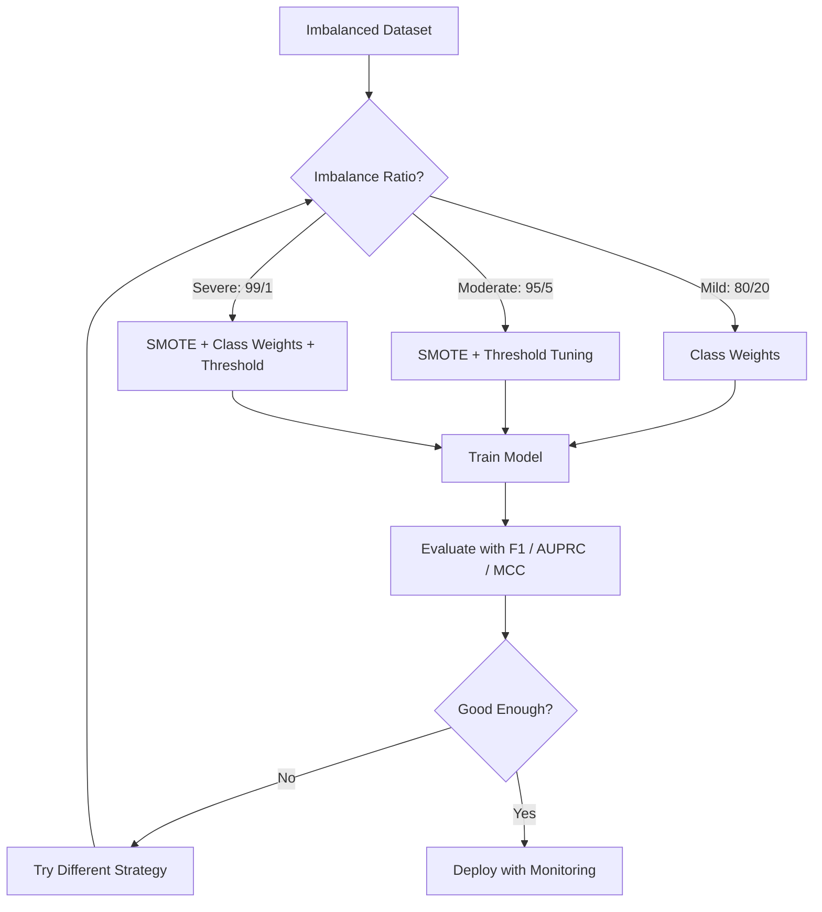
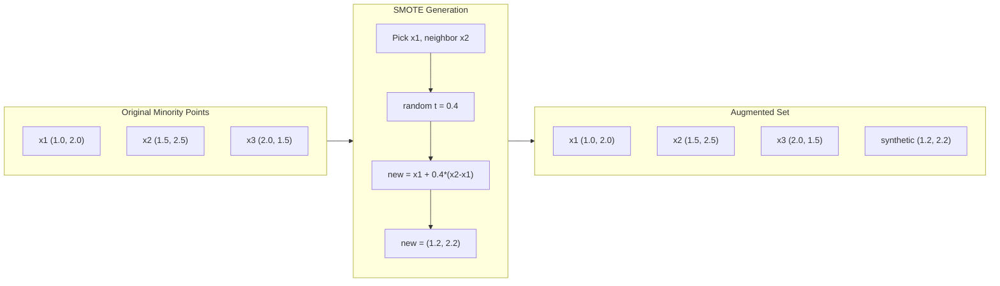
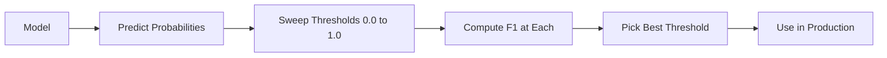
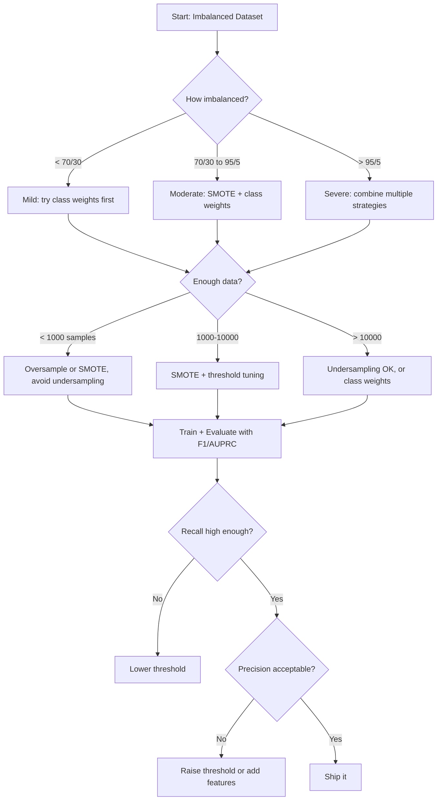

# Handling Imbalanced 数据

> When 99% 的 your 数据 是 "normal," 准确率 是 lie.

**Type:** Build
**Language:** Python
**Prerequisites:** Phase 2, Lessons 01-09 (especially evaluation metrics)
**Time:** ~90 minutes

## Learning Objectives

- Implement SMOTE 从 scratch 和 explain how synthetic oversampling differs 从 random duplication
- Evaluate imbalanced classifiers using F1, AUPRC, 和 Matthews Correlation Coefficient instead 的 准确率
- Compare class weighting, threshold tuning, 和 resampling strategies 和 select right approach 为了 given imbalance ratio
- Build complete imbalanced 数据 pipeline combines SMOTE, class 权重, 和 threshold optimization

## Problem

You build fraud detection 模型. It gets 99.9% 准确率. You celebrate. Then you realize it predicts "not fraud" 为了 every single transaction.

这是 not bug. 它是 rational thing 到 do when only 0.1% 的 transactions 是 fraudulent. 模型 learns always guessing majority class minimizes overall error. 它是 technically correct 和 completely useless.

This happens everywhere real 分类 matters. Disease diagnosis: 1% positive rate. Network intrusion: 0.01% attacks. Manufacturing defects: 0.5% defective. Spam filtering: 20% spam. Churn prediction: 5% churners. more consequential minority class, rarer it tends 到 be.

准确率 fails because it treats all correct predictions equally. Correctly labeling legitimate transaction 和 correctly catching fraud both count 作为 one point 的 准确率. But catching fraud 是 entire reason 模型 exists. We need metrics, techniques, 和 训练 strategies force 模型 到 pay attention 到 rare but important class.

## Concept

### Why 准确率 Fails

Consider 数据集 使用 1000 samples: 990 negative, 10 positive. 模型 always predicts negative:

| | Predicted Positive | Predicted Negative |
|--|---|---|
| Actually Positive | 0 (TP) | 10 (FN) |
| Actually Negative | 0 (FP) | 990 (TN) |

准确率 = (0 + 990) / 1000 = 99.0%

模型 catches zero fraud. Zero disease. Zero defects. But 准确率 says 99%. 这是 why 准确率 是 dangerous 为了 imbalanced problems.

### Better Metrics

**精确率** = TP / (TP + FP). Of everything flagged 作为 positive, how many actually 是? High 精确率 means few false alarms.

**召回率** = TP / (TP + FN). Of everything actually positive, how many did we catch? High 召回率 means few missed positives.

**F1 Score** = 2 * 精确率 * 召回率 / (精确率 + 召回率). harmonic mean. Penalizes extreme imbalance between 精确率 和 召回率 more than arithmetic mean would.

**F-beta Score** = (1 + beta^2) * 精确率 * 召回率 / (beta^2 * 精确率 + 召回率). When beta > 1, 召回率 matters more. When beta < 1, 精确率 matters more. F2 是 common 在 fraud detection (missing fraud 是 worse than false alarm).

**AUPRC** (Area Under 精确率-召回率 Curve). Like AUC-ROC but more informative 为了 imbalanced 数据. random classifier has AUPRC equal 到 positive class rate (not 0.5 like ROC). This makes improvements easier 到 see.

**Matthews Correlation Coefficient** = (TP * TN - FP * FN) / sqrt((TP+FP)(TP+FN)(TN+FP)(TN+FN)). Ranges 从 -1 到 +1. Only gives high score when 模型 does well 在 both classes. Balanced even when classes 是 very different sizes.

For "always predict negative" 模型 above: 精确率 = 0/0 (undefined, often set 到 0), 召回率 = 0/10 = 0, F1 = 0, MCC = 0. These metrics correctly identify 模型 作为 worthless.

### Imbalanced 数据 Pipeline



### SMOTE: Synthetic Minority Oversampling Technique

Random oversampling duplicates existing minority samples. This works but risks 过拟合 because 模型 sees identical points repeatedly.

SMOTE creates new synthetic minority samples 是 plausible but not copies. 算法:

1. For each minority sample x, find its k nearest neighbors among other minority samples
2. Pick one neighbor 在 random
3. Create new sample 在 line segment between x 和 neighbor

formula: `new_sample = x + random(0, 1) * (neighbor - x)`

This interpolates between real minority points, creating samples 在 same region 的 特征 space without just copying existing 数据.



### Sampling Strategies Compared

**Random Oversampling**: duplicate minority samples 到 match majority count.
- Pros: simple, no information loss
- Cons: exact duplicates cause 过拟合, increases 训练 time

**Random Undersampling**: remove majority samples 到 match minority count.
- Pros: fast 训练, simple
- Cons: throws away potentially useful majority 数据, higher variance

**SMOTE**: create synthetic minority samples via interpolation.
- Pros: generates new 数据 points, reduces 过拟合 compared 到 random oversampling
- Cons: can create noisy samples near decision boundary, does not account 为了 majority class distribution

| Strategy | 数据 Changed | Risk | When 到 Use |
|----------|-------------|------|-------------|
| Oversample | Minority duplicated | 过拟合 | Small 数据集, moderate imbalance |
| Undersample | Majority removed | Information loss | Large 数据集, want fast 训练 |
| SMOTE | Synthetic minority added | Boundary noise | Moderate imbalance, enough minority samples 为了 k-NN |

### Class Weights

Instead 的 changing 数据, change how 模型 treats errors. Assign higher 权重 到 misclassifying minority class.

For binary problem 使用 950 negative 和 50 positive samples:
- 权重 为了 negative class = n_samples / (2 * n_negative) = 1000 / (2 * 950) = 0.526
- 权重 为了 positive class = n_samples / (2 * n_positive) = 1000 / (2 * 50) = 10.0

positive class gets 19x 权重. Misclassifying one positive sample costs 作为 much 作为 misclassifying 19 negative samples. 模型 是 forced 到 pay attention 到 minority class.

In logistic 回归, 这个 modifies 损失函数:

```
weighted_loss = -sum(w_i * [y_i * log(p_i) + (1-y_i) * log(1-p_i)])
```

where w_i depends 在 class 的 sample i.

Class 权重 是 mathematically equivalent 到 oversampling 在 expectation, but without creating new 数据 points. This makes them faster 和 avoids 过拟合 risk 的 duplicated samples.

### Threshold Tuning

Most classifiers 输出 概率. default threshold 是 0.5: if P(positive) >= 0.5, predict positive. But 0.5 是 arbitrary. When classes 是 imbalanced, optimal threshold 是 usually much lower.

process:
1. Train 模型
2. Get predicted probabilities 在 验证 set
3. Sweep thresholds 从 0.0 到 1.0
4. Compute F1 (或 your chosen metric) 在 each threshold
5. Pick threshold maximizes your metric



模型 might 输出 P(fraud) = 0.15 为了 fraudulent transaction. At threshold 0.5, 这个 是 classified 作为 not fraud. At threshold 0.10, it 是 correctly caught. 概率 calibration matters less than ranking -- 作为 long 作为 fraud gets higher probabilities than non-fraud, there exists threshold separates them.

### Cost-Sensitive Learning

Generalization 的 class 权重. Instead 的 uniform costs, assign specific misclassification costs:

| | Predict Positive | Predict Negative |
|--|---|---|
| Actually Positive | 0 (correct) | C_FN = 100 |
| Actually Negative | C_FP = 1 | 0 (correct) |

Missing fraudulent transaction (FN) costs 100x more than false alarm (FP). 模型 optimizes 为了 total cost, not total error count.

这是 most principled approach when you can estimate real-world costs. missed cancer diagnosis has very different cost than false alarm leads 到 extra biopsy. Making 这些 costs explicit forces right tradeoffs.

### Decision Flowchart



## Build It

### Step 1: Generate imbalanced 数据集

```python
import numpy as np


def make_imbalanced_data(n_majority=950, n_minority=50, seed=42):
    rng = np.random.RandomState(seed)

    X_maj = rng.randn(n_majority, 2) * 1.0 + np.array([0.0, 0.0])
    X_min = rng.randn(n_minority, 2) * 0.8 + np.array([2.5, 2.5])

    X = np.vstack([X_maj, X_min])
    y = np.concatenate([np.zeros(n_majority), np.ones(n_minority)])

    shuffle_idx = rng.permutation(len(y))
    return X[shuffle_idx], y[shuffle_idx]
```

### Step 2: SMOTE 从 scratch

```python
def euclidean_distance(a, b):
    return np.sqrt(np.sum((a - b) ** 2))


def find_k_neighbors(X, idx, k):
    distances = []
    for i in range(len(X)):
        if i == idx:
            continue
        d = euclidean_distance(X[idx], X[i])
        distances.append((i, d))
    distances.sort(key=lambda x: x[1])
    return [d[0] for d in distances[:k]]


def smote(X_minority, k=5, n_synthetic=100, seed=42):
    rng = np.random.RandomState(seed)
    n_samples = len(X_minority)
    k = min(k, n_samples - 1)
    synthetic = []

    for _ in range(n_synthetic):
        idx = rng.randint(0, n_samples)
        neighbors = find_k_neighbors(X_minority, idx, k)
        neighbor_idx = neighbors[rng.randint(0, len(neighbors))]
        t = rng.random()
        new_point = X_minority[idx] + t * (X_minority[neighbor_idx] - X_minority[idx])
        synthetic.append(new_point)

    return np.array(synthetic)
```

### Step 3: Random oversampling 和 undersampling

```python
def random_oversample(X, y, seed=42):
    rng = np.random.RandomState(seed)
    classes, counts = np.unique(y, return_counts=True)
    max_count = counts.max()

    X_resampled = list(X)
    y_resampled = list(y)

    for cls, count in zip(classes, counts):
        if count < max_count:
            cls_indices = np.where(y == cls)[0]
            n_needed = max_count - count
            chosen = rng.choice(cls_indices, size=n_needed, replace=True)
            X_resampled.extend(X[chosen])
            y_resampled.extend(y[chosen])

    X_out = np.array(X_resampled)
    y_out = np.array(y_resampled)
    shuffle = rng.permutation(len(y_out))
    return X_out[shuffle], y_out[shuffle]


def random_undersample(X, y, seed=42):
    rng = np.random.RandomState(seed)
    classes, counts = np.unique(y, return_counts=True)
    min_count = counts.min()

    X_resampled = []
    y_resampled = []

    for cls in classes:
        cls_indices = np.where(y == cls)[0]
        chosen = rng.choice(cls_indices, size=min_count, replace=False)
        X_resampled.extend(X[chosen])
        y_resampled.extend(y[chosen])

    X_out = np.array(X_resampled)
    y_out = np.array(y_resampled)
    shuffle = rng.permutation(len(y_out))
    return X_out[shuffle], y_out[shuffle]
```

### Step 4: Logistic 回归 使用 class 权重

```python
def sigmoid(z):
    return 1.0 / (1.0 + np.exp(-np.clip(z, -500, 500)))


def logistic_regression_weighted(X, y, weights, lr=0.01, epochs=200):
    n_samples, n_features = X.shape
    w = np.zeros(n_features)
    b = 0.0

    for _ in range(epochs):
        z = X @ w + b
        pred = sigmoid(z)
        error = pred - y
        weighted_error = error * weights

        gradient_w = (X.T @ weighted_error) / n_samples
        gradient_b = np.mean(weighted_error)

        w -= lr * gradient_w
        b -= lr * gradient_b

    return w, b


def compute_class_weights(y):
    classes, counts = np.unique(y, return_counts=True)
    n_samples = len(y)
    n_classes = len(classes)
    weight_map = {}
    for cls, count in zip(classes, counts):
        weight_map[cls] = n_samples / (n_classes * count)
    return np.array([weight_map[yi] for yi in y])
```

### Step 5: Threshold tuning

```python
def find_optimal_threshold(y_true, y_probs, metric="f1"):
    best_threshold = 0.5
    best_score = -1.0

    for threshold in np.arange(0.05, 0.96, 0.01):
        y_pred = (y_probs >= threshold).astype(int)
        tp = np.sum((y_pred == 1) & (y_true == 1))
        fp = np.sum((y_pred == 1) & (y_true == 0))
        fn = np.sum((y_pred == 0) & (y_true == 1))

        if metric == "f1":
            precision = tp / (tp + fp) if (tp + fp) > 0 else 0.0
            recall = tp / (tp + fn) if (tp + fn) > 0 else 0.0
            score = 2 * precision * recall / (precision + recall) if (precision + recall) > 0 else 0.0
        elif metric == "recall":
            score = tp / (tp + fn) if (tp + fn) > 0 else 0.0
        elif metric == "precision":
            score = tp / (tp + fp) if (tp + fp) > 0 else 0.0

        if score > best_score:
            best_score = score
            best_threshold = threshold

    return best_threshold, best_score
```

### Step 6: Evaluation 函数

```python
def confusion_matrix_values(y_true, y_pred):
    tp = np.sum((y_pred == 1) & (y_true == 1))
    tn = np.sum((y_pred == 0) & (y_true == 0))
    fp = np.sum((y_pred == 1) & (y_true == 0))
    fn = np.sum((y_pred == 0) & (y_true == 1))
    return tp, tn, fp, fn


def compute_metrics(y_true, y_pred):
    tp, tn, fp, fn = confusion_matrix_values(y_true, y_pred)
    accuracy = (tp + tn) / (tp + tn + fp + fn)
    precision = tp / (tp + fp) if (tp + fp) > 0 else 0.0
    recall = tp / (tp + fn) if (tp + fn) > 0 else 0.0
    f1 = 2 * precision * recall / (precision + recall) if (precision + recall) > 0 else 0.0

    denom = np.sqrt(float((tp + fp) * (tp + fn) * (tn + fp) * (tn + fn)))
    mcc = (tp * tn - fp * fn) / denom if denom > 0 else 0.0

    return {
        "accuracy": accuracy,
        "precision": precision,
        "recall": recall,
        "f1": f1,
        "mcc": mcc,
    }
```

### Step 7: Compare all approaches

```python
X, y = make_imbalanced_data(950, 50, seed=42)
split = int(0.8 * len(y))
X_train, X_test = X[:split], X[split:]
y_train, y_test = y[:split], y[split:]

# Baseline: no treatment
w_base, b_base = logistic_regression_weighted(
    X_train, y_train, np.ones(len(y_train)), lr=0.1, epochs=300
)
probs_base = sigmoid(X_test @ w_base + b_base)
preds_base = (probs_base >= 0.5).astype(int)

# Oversampled
X_over, y_over = random_oversample(X_train, y_train)
w_over, b_over = logistic_regression_weighted(
    X_over, y_over, np.ones(len(y_over)), lr=0.1, epochs=300
)
preds_over = (sigmoid(X_test @ w_over + b_over) >= 0.5).astype(int)

# SMOTE
minority_mask = y_train == 1
X_minority = X_train[minority_mask]
synthetic = smote(X_minority, k=5, n_synthetic=len(y_train) - 2 * int(minority_mask.sum()))
X_smote = np.vstack([X_train, synthetic])
y_smote = np.concatenate([y_train, np.ones(len(synthetic))])
w_sm, b_sm = logistic_regression_weighted(
    X_smote, y_smote, np.ones(len(y_smote)), lr=0.1, epochs=300
)
preds_smote = (sigmoid(X_test @ w_sm + b_sm) >= 0.5).astype(int)

# Class weights
sample_weights = compute_class_weights(y_train)
w_cw, b_cw = logistic_regression_weighted(
    X_train, y_train, sample_weights, lr=0.1, epochs=300
)
probs_cw = sigmoid(X_test @ w_cw + b_cw)
preds_cw = (probs_cw >= 0.5).astype(int)

# Threshold tuning (tune on held-out validation set, not test set)
probs_val = sigmoid(X_val @ w_cw + b_cw)
best_thresh, best_f1 = find_optimal_threshold(y_val, probs_val, metric="f1")
preds_thresh = (probs_cw >= best_thresh).astype(int)
```

代码 file runs all 的 这个 在 single script 和 prints results.

## Use It

With scikit-learn 和 imbalanced-learn, 这些 techniques 是 one-liners:

```python
from sklearn.linear_model import LogisticRegression
from sklearn.metrics import classification_report, f1_score
from sklearn.model_selection import train_test_split
from imblearn.over_sampling import SMOTE
from imblearn.under_sampling import RandomUnderSampler
from imblearn.pipeline import Pipeline

X_train, X_test, y_train, y_test = train_test_split(X, y, stratify=y)

model_weighted = LogisticRegression(class_weight="balanced")
model_weighted.fit(X_train, y_train)
print(classification_report(y_test, model_weighted.predict(X_test)))

smote = SMOTE(random_state=42)
X_resampled, y_resampled = smote.fit_resample(X_train, y_train)
model_smote = LogisticRegression()
model_smote.fit(X_resampled, y_resampled)
print(classification_report(y_test, model_smote.predict(X_test)))

pipeline = Pipeline([
    ("smote", SMOTE()),
    ("model", LogisticRegression(class_weight="balanced")),
])
pipeline.fit(X_train, y_train)
print(classification_report(y_test, pipeline.predict(X_test)))
```

从-scratch implementations show exactly what each technique does. SMOTE 是 just k-NN interpolation 在 minority class. Class 权重 multiply loss. Threshold tuning 是 为了-loop over cutoffs. No magic.

## Ship It

This lesson produces:
- `输出/skill-imbalanced-数据.md` -- decision checklist 为了 handling imbalanced 分类 problems

## Exercises

1. **Borderline-SMOTE**: modify SMOTE implementation 到 only generate synthetic samples 为了 minority points 是 near decision boundary (那些 whose k-nearest neighbors include majority class samples). Compare results 使用 standard SMOTE 在 数据集 where classes overlap.

2. **Cost 矩阵 optimization**: implement cost-sensitive learning where cost 矩阵 是 参数. Create 函数 takes cost 矩阵 和 returns optimal predictions minimize expected cost. Test 使用 different cost ratios (1:10, 1:100, 1:1000) 和 plot how 精确率-召回率 tradeoff changes.

3. **Threshold calibration**: implement Platt scaling (fit logistic 回归 在 模型's raw 输出 到 produce calibrated probabilities). Compare 精确率-召回率 curve before 和 after calibration. Show calibration does not change ranking (AUC stays same) but makes probabilities more meaningful.

4. **Ensemble 使用 balanced bagging**: train multiple 模型, each 在 balanced bootstrap sample (all minority + random subset 的 majority). Average their predictions. Compare 这个 approach against single 模型 使用 SMOTE. Measure both performance 和 variance across runs.

5. **Imbalance ratio experiment**: take balanced 数据集 和 progressively increase imbalance ratio (50/50, 70/30, 90/10, 95/5, 99/1). For each ratio, train 使用 和 without SMOTE. Plot F1 vs imbalance ratio 为了 both approaches. At what ratio does SMOTE start making meaningful difference?

## Key Terms

| Term | What people say | What it actually means |
|------|----------------|----------------------|
| Class imbalance | "One class has way more samples" | distribution 的 classes 在 数据集 是 significantly skewed, causing 模型 到 favor majority class |
| SMOTE | "Synthetic oversampling" | Creates new minority samples 通过 interpolating between existing minority samples 和 their k-nearest minority neighbors |
| Class 权重 | "Making errors 在 rare classes more expensive" | Multiplying 损失函数 通过 class-specific 权重 so 模型 penalizes minority misclassification more heavily |
| Threshold tuning | "Moving decision boundary" | Changing 概率 cutoff 为了 分类 从 default 0.5 到 value optimizes desired metric |
| 精确率-召回率 tradeoff | "You cannot have both" | Lowering threshold catches more positives (higher 召回率) but also flags more false positives (lower 精确率), 和 vice versa |
| AUPRC | "Area under PR curve" | Summarizes 精确率-召回率 curve into single number; more informative than AUC-ROC when classes 是 heavily imbalanced |
| Matthews Correlation Coefficient | " balanced metric" | correlation between predicted 和 actual labels produces high score only when 模型 performs well 在 both classes |
| Cost-sensitive learning | "Different mistakes cost different amounts" | Incorporating real-world misclassification costs into 训练 objective so 模型 optimizes 为了 total cost, not error count |
| Random oversampling | "Duplicate minority" | Repeating minority class samples 到 balance class counts; simple but risks 过拟合 到 duplicated points |

## Further Reading

- [SMOTE: Synthetic Minority Over-sampling Technique (Chawla et al., 2002)](https://arxiv.org/abs/1106.1813) -- original SMOTE paper, still most cited work 在 imbalanced learning
- [Learning 从 Imbalanced 数据 (He & Garcia, 2009)](https://ieeexplore.ieee.org/document/5128907) -- comprehensive survey covering sampling, cost-sensitive, 和 algorithmic approaches
- [imbalanced-learn documentation](https://imbalanced-learn.org/stable/) -- Python library 使用 SMOTE variants, undersampling strategies, 和 pipeline integration
- [ 精确率-召回率 Plot Is More Informative than ROC Plot (Saito & Rehmsmeier, 2015)](https://journals.plos.org/plosone/article?id=10.1371/journal.pone.0118432) -- when 和 why 到 prefer PR curves over ROC curves 为了 imbalanced problems
