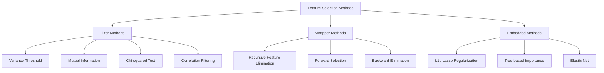
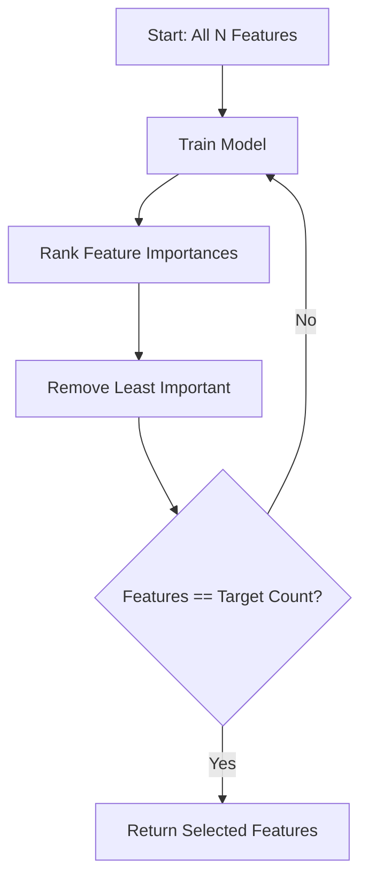
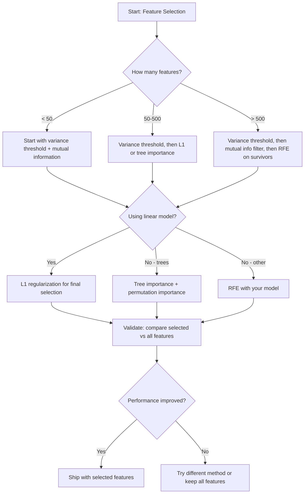

# 特征 Selection

> More 特征 是 not better. right 特征 是 better.

**Type:** Build
**Language:** Python
**Prerequisites:** Phase 2, Lessons 01-09, 08 (特征 engineering)
**Time:** ~75 minutes

## Learning Objectives

- Implement filter methods (variance threshold, mutual information, chi-squared) 和 wrapper methods (RFE, forward selection) 从 scratch
- Explain why mutual information captures nonlinear 特征-target relationships correlation misses
- Compare L1 正则化 (embedded selection) 使用 RFE (wrapper selection) 和 evaluate their computational tradeoffs
- Build 特征 selection pipeline combines multiple methods 和 demonstrate improved generalization 在 held-out 数据

## Problem

You have 500 特征. Your 模型 trains slowly, overfits constantly, 和 nobody can explain what it learned. You add more 特征 hoping 到 improve performance. It gets worse.

这是 curse 的 dimensionality 在 action. As number 的 特征 grows, volume 的 特征 space explodes. 数据 points become sparse. Distances between points converge. 模型 needs exponentially more 数据 到 find real patterns. Noise 特征 drown out signal 特征. 过拟合 becomes default.

特征 selection 是 antidote. Strip away noise. Remove redundancy. Keep 特征 carry actual information about target. result: faster 训练, better generalization, 和 模型 you can actually explain.

goal 是 not 到 use all available information. 它是 到 use right information.

## Concept

### Three Categories 的 特征 Selection

Every 特征 selection method falls into one 的 three categories:



**Filter methods** score each 特征 independently using statistical measure. They do not use 模型. Fast, but they miss 特征 interactions.

**Wrapper methods** train 模型 到 evaluate 特征 subsets. They use 模型 performance 作为 score. Better results, but expensive because they retrain 模型 many times.

**Embedded methods** select 特征 作为 part 的 模型 训练. L1 正则化 drives 权重 到 zero. Decision trees split 在 most useful 特征. Selection happens during fitting, not 作为 separate step.

### Variance Threshold

simplest filter. If 特征 barely varies across samples, it carries almost no information.

Consider 特征 是 0.0 为了 999 out 的 1000 samples. Its variance 是 near zero. No 模型 can use it 到 distinguish between classes. Remove it.

```
variance(x) = mean((x - mean(x))^2)
```

Set threshold (e.g., 0.01). Drop every 特征 使用 variance below it. This removes constant 或 near-constant 特征 without looking 在 target variable 在 all.

When 到 use it: 作为 preprocessing step before other methods. It catches obviously useless 特征 在 near-zero cost.

Limitation: 特征 can have high variance 和 still be pure noise. Variance threshold 是 necessary but not sufficient.

### Mutual Information

Mutual information measures how much knowing value 的 特征 X reduces uncertainty about target Y.

```
I(X; Y) = sum_x sum_y p(x, y) * log(p(x, y) / (p(x) * p(y)))
```

If X 和 Y 是 independent, p(x, y) = p(x) * p(y), so log term 是 zero 和 I(X; Y) = 0. more X tells you about Y, higher mutual information.

Key advantage over correlation: mutual information captures nonlinear relationships. 特征 might have zero correlation 使用 target but high mutual information because relationship 是 quadratic 或 periodic.

For continuous 特征, discretize into bins first (histogram-based estimation). number 的 bins affects estimate -- too few bins lose information, too many bins add noise. common choice: sqrt(n) bins 或 Sturges' rule (1 + log2(n)).


### Recursive 特征 Elimination (RFE)

RFE 是 wrapper method. It uses 模型's own 特征 importance 到 iteratively prune:

1. Train 模型 使用 all 特征
2. Rank 特征 通过 importance (coefficients 为了 linear 模型, impurity reduction 为了 trees)
3. Remove least important 特征(s)
4. Repeat until desired number 的 特征 remains



RFE considers 特征 interactions because 模型 sees all remaining 特征 together. Removing one 特征 changes importance 的 others. This makes it more thorough than filter methods.

cost: you train 模型 N - target times. With 500 特征 和 target 的 10, 是 490 训练 runs. For expensive 模型, 这个 是 slow. 你可以 speed it up 通过 removing multiple 特征 per step (e.g., remove bottom 10% each round).

### L1 (Lasso) 正则化

L1 正则化 adds absolute value 的 权重 到 损失函数:

```
loss = prediction_error + alpha * sum(|w_i|)
```

alpha 参数 controls how aggressively 特征 是 pruned. Higher alpha means more 权重 go 到 exactly zero.

Why exactly zero? L1 penalty creates diamond-shaped constraint region 在 权重 space. optimal solution tends 到 land 在 corner 的 这个 diamond, where one 或 more 权重 是 zero. L2 正则化 (ridge) creates circular constraint where 权重 shrink but rarely hit zero.

这是 embedded 特征 selection: 模型 learns during 训练 which 特征 到 ignore. Features 使用 zero 权重 是 effectively removed.

Advantages: single 训练 run, handles correlated 特征 (picks one 和 zeros others), built into most linear 模型 implementations.

Limitation: only works 为了 linear 模型. Cannot capture nonlinear 特征 importance.

### Tree-Based 特征 Importance

Decision trees 和 their ensembles (random forests, gradient boosting) naturally rank 特征. Every split reduces impurity (Gini 或 entropy 为了 分类, variance 为了 回归). Features produce larger impurity reductions 是 more important.

For random forest 使用 T trees:

```
importance(feature_j) = (1/T) * sum over all trees of
    sum over all nodes splitting on feature_j of
        (n_samples * impurity_decrease)
```

This gives normalized importance score 为了 each 特征. It handles nonlinear relationships 和 特征 interactions automatically.

Caution: tree-based importance 是 biased toward 特征 使用 many unique values (high cardinality). random ID column will appear important because it perfectly splits every sample. Use permutation importance 作为 sanity check.

### Permutation Importance

模型-agnostic method:

1. Train 模型 和 record baseline performance 在 验证 数据
2. For each 特征: shuffle its values randomly, measure drop 在 performance
3. bigger drop, more important 特征

If shuffling 特征 does not hurt performance, 模型 does not depend 在 it. If performance collapses, 特征 是 critical.

Permutation importance avoids cardinality 偏置 的 tree-based importance. But it 是 slow: one full evaluation per 特征, repeated multiple times 为了 stability.

### Comparison Table

| Method | Type | Speed | Nonlinear | 特征 Interactions |
|--------|------|-------|-----------|---------------------|
| Variance threshold | Filter | Very fast | No | No |
| Mutual information | Filter | Fast | Yes | No |
| Correlation filter | Filter | Fast | No | No |
| RFE | Wrapper | Slow | Depends 在 模型 | Yes |
| L1 / Lasso | Embedded | Fast | No (linear) | No |
| Tree importance | Embedded | Medium | Yes | Yes |
| Permutation importance | 模型-agnostic | Slow | Yes | Yes |

### Decision Flowchart



## Build It

### Step 1: Generate synthetic 数据 使用 known 特征 structure

```python
import numpy as np


def make_feature_selection_data(n_samples=500, seed=42):
    rng = np.random.RandomState(seed)

    x1 = rng.randn(n_samples)
    x2 = rng.randn(n_samples)
    x3 = rng.randn(n_samples)
    x4 = x1 + 0.1 * rng.randn(n_samples)
    x5 = x2 + 0.1 * rng.randn(n_samples)

    informative = np.column_stack([x1, x2, x3, x4, x5])

    correlated = np.column_stack([
        x1 * 0.9 + 0.1 * rng.randn(n_samples),
        x2 * 0.8 + 0.2 * rng.randn(n_samples),
        x3 * 0.7 + 0.3 * rng.randn(n_samples),
        x1 * 0.5 + x2 * 0.5 + 0.1 * rng.randn(n_samples),
        x2 * 0.6 + x3 * 0.4 + 0.1 * rng.randn(n_samples),
    ])

    noise = rng.randn(n_samples, 10) * 0.5

    X = np.hstack([informative, correlated, noise])
    y = (2 * x1 - 1.5 * x2 + x3 + 0.5 * rng.randn(n_samples) > 0).astype(int)

    feature_names = (
        [f"info_{i}" for i in range(5)]
        + [f"corr_{i}" for i in range(5)]
        + [f"noise_{i}" for i in range(10)]
    )

    return X, y, feature_names
```

We know ground truth: 特征 0-4 是 informative (plus 3 和 4 是 correlated copies 的 0 和 1), 特征 5-9 是 correlated 使用 informative 特征, 特征 10-19 是 pure noise. good selection method should rank 0-4 highest 和 10-19 lowest.

### Step 2: Variance threshold

```python
def variance_threshold(X, threshold=0.01):
    variances = np.var(X, axis=0)
    mask = variances > threshold
    return mask, variances
```

### Step 3: Mutual information (discrete)

```python
def discretize(x, n_bins=10):
    min_val, max_val = x.min(), x.max()
    if max_val == min_val:
        return np.zeros_like(x, dtype=int)
    bin_edges = np.linspace(min_val, max_val, n_bins + 1)
    binned = np.digitize(x, bin_edges[1:-1])
    return binned


def mutual_information(X, y, n_bins=10):
    n_samples, n_features = X.shape
    mi_scores = np.zeros(n_features)

    y_vals, y_counts = np.unique(y, return_counts=True)
    p_y = y_counts / n_samples

    for f in range(n_features):
        x_binned = discretize(X[:, f], n_bins)
        x_vals, x_counts = np.unique(x_binned, return_counts=True)
        p_x = dict(zip(x_vals, x_counts / n_samples))

        mi = 0.0
        for xv in x_vals:
            for yi, yv in enumerate(y_vals):
                joint_mask = (x_binned == xv) & (y == yv)
                p_xy = np.sum(joint_mask) / n_samples
                if p_xy > 0:
                    mi += p_xy * np.log(p_xy / (p_x[xv] * p_y[yi]))
        mi_scores[f] = mi

    return mi_scores
```

### Step 4: Recursive 特征 Elimination

```python
def simple_logistic_importance(X, y, lr=0.1, epochs=100):
    n_samples, n_features = X.shape
    w = np.zeros(n_features)
    b = 0.0

    for _ in range(epochs):
        z = X @ w + b
        pred = 1.0 / (1.0 + np.exp(-np.clip(z, -500, 500)))
        error = pred - y
        w -= lr * (X.T @ error) / n_samples
        b -= lr * np.mean(error)

    return w, b


def rfe(X, y, n_features_to_select=5, lr=0.1, epochs=100):
    n_total = X.shape[1]
    remaining = list(range(n_total))
    rankings = np.ones(n_total, dtype=int)
    rank = n_total

    while len(remaining) > n_features_to_select:
        X_subset = X[:, remaining]
        w, _ = simple_logistic_importance(X_subset, y, lr, epochs)
        importances = np.abs(w)

        least_idx = np.argmin(importances)
        original_idx = remaining[least_idx]
        rankings[original_idx] = rank
        rank -= 1
        remaining.pop(least_idx)

    for idx in remaining:
        rankings[idx] = 1

    selected_mask = rankings == 1
    return selected_mask, rankings
```

### Step 5: L1 特征 selection

```python
def soft_threshold(w, alpha):
    return np.sign(w) * np.maximum(np.abs(w) - alpha, 0)


def l1_feature_selection(X, y, alpha=0.1, lr=0.01, epochs=500):
    n_samples, n_features = X.shape
    w = np.zeros(n_features)
    b = 0.0

    for _ in range(epochs):
        z = X @ w + b
        pred = 1.0 / (1.0 + np.exp(-np.clip(z, -500, 500)))
        error = pred - y

        gradient_w = (X.T @ error) / n_samples
        gradient_b = np.mean(error)

        w -= lr * gradient_w
        w = soft_threshold(w, lr * alpha)
        b -= lr * gradient_b

    selected_mask = np.abs(w) > 1e-6
    return selected_mask, w
```

### Step 6: Tree-based importance (simple decision tree)

```python
def gini_impurity(y):
    if len(y) == 0:
        return 0.0
    classes, counts = np.unique(y, return_counts=True)
    probs = counts / len(y)
    return 1.0 - np.sum(probs ** 2)


def best_split(X, y, feature_idx):
    values = np.unique(X[:, feature_idx])
    if len(values) <= 1:
        return None, -1.0

    best_threshold = None
    best_gain = -1.0
    parent_gini = gini_impurity(y)
    n = len(y)

    for i in range(len(values) - 1):
        threshold = (values[i] + values[i + 1]) / 2.0
        left_mask = X[:, feature_idx] <= threshold
        right_mask = ~left_mask

        n_left = np.sum(left_mask)
        n_right = np.sum(right_mask)

        if n_left == 0 or n_right == 0:
            continue

        gain = parent_gini - (n_left / n) * gini_impurity(y[left_mask]) - (n_right / n) * gini_impurity(y[right_mask])

        if gain > best_gain:
            best_gain = gain
            best_threshold = threshold

    return best_threshold, best_gain


def tree_importance(X, y, n_trees=50, max_depth=5, seed=42):
    rng = np.random.RandomState(seed)
    n_samples, n_features = X.shape
    importances = np.zeros(n_features)

    for _ in range(n_trees):
        sample_idx = rng.choice(n_samples, size=n_samples, replace=True)
        feature_subset = rng.choice(n_features, size=max(1, int(np.sqrt(n_features))), replace=False)

        X_boot = X[sample_idx]
        y_boot = y[sample_idx]

        tree_imp = _build_tree_importance(X_boot, y_boot, feature_subset, max_depth)
        importances += tree_imp

    total = importances.sum()
    if total > 0:
        importances /= total

    return importances


def _build_tree_importance(X, y, feature_subset, max_depth, depth=0):
    n_features = X.shape[1]
    importances = np.zeros(n_features)

    if depth >= max_depth or len(np.unique(y)) <= 1 or len(y) < 4:
        return importances

    best_feature = None
    best_threshold = None
    best_gain = -1.0

    for f in feature_subset:
        threshold, gain = best_split(X, y, f)
        if gain > best_gain:
            best_gain = gain
            best_feature = f
            best_threshold = threshold

    if best_feature is None or best_gain <= 0:
        return importances

    importances[best_feature] += best_gain * len(y)

    left_mask = X[:, best_feature] <= best_threshold
    right_mask = ~left_mask

    importances += _build_tree_importance(X[left_mask], y[left_mask], feature_subset, max_depth, depth + 1)
    importances += _build_tree_importance(X[right_mask], y[right_mask], feature_subset, max_depth, depth + 1)

    return importances
```

### Step 7: Run all methods 和 compare

代码 file runs all five methods 在 same synthetic 数据集 和 prints comparison table showing which 特征 each method selects.

## Use It

With scikit-learn, 特征 selection 是 built into pipeline:

```python
from sklearn.feature_selection import (
    VarianceThreshold,
    mutual_info_classif,
    RFE,
    SelectFromModel,
)
from sklearn.linear_model import Lasso, LogisticRegression
from sklearn.ensemble import RandomForestClassifier

vt = VarianceThreshold(threshold=0.01)
X_filtered = vt.fit_transform(X)

mi_scores = mutual_info_classif(X, y)
top_k = np.argsort(mi_scores)[-10:]

rfe_selector = RFE(LogisticRegression(), n_features_to_select=10)
rfe_selector.fit(X, y)
X_rfe = rfe_selector.transform(X)

lasso_selector = SelectFromModel(Lasso(alpha=0.01))
lasso_selector.fit(X, y)
X_lasso = lasso_selector.transform(X)

rf = RandomForestClassifier(n_estimators=100)
rf.fit(X, y)
importances = rf.feature_importances_
```

从-scratch implementations show exactly what happens inside each method. Variance threshold 是 just computing `var(X, axis=0)` 和 applying mask. Mutual information 是 counting joint 和 marginal frequencies 在 contingency table. RFE 是 loop trains, ranks, 和 prunes. L1 是 梯度下降 使用 soft-thresholding step. Tree importance accumulates impurity reductions across splits. No magic -- just 统计学 和 loops.

sklearn versions add robustness (e.g., mutual_info_classif uses k-NN density estimation instead 的 binning), speed (C implementations), 和 pipeline integration.

## Ship It

This lesson produces:
- `输出/skill-特征-selector.md` -- quick reference decision tree 为了 choosing right 特征 selection method

## Exercises

1. **Forward selection**: implement opposite 的 RFE. Start 使用 zero 特征. At each step, add 特征 improves 模型 performance most. Stop when adding 特征 no longer helps. Compare selected 特征 against RFE results. Which 是 faster? Which gives better results?

2. **Stability selection**: run L1 特征 selection 50 times, each time 在 random 80% subsample 的 数据, 使用 slightly different alpha values. Count how often each 特征 是 selected. Features selected 在 > 80% 的 runs 是 "stable." Compare stable 特征 against single-run L1 selection. Which 是 more reliable?

3. **Multicollinearity detection**: compute correlation 矩阵 为了 all 特征. Implement 函数 , given correlation threshold (e.g., 0.9), removes one 特征 从 each highly-correlated pair (keeping one 使用 higher mutual information 使用 target). Test 在 synthetic 数据集 和 verify it removes redundant correlated 特征.

4. **特征 selection pipeline**: chain variance threshold, mutual information filter, 和 RFE into single pipeline. First remove near-zero-variance 特征, then keep top 50% 通过 mutual information, then run RFE 在 survivors. Compare 这个 pipeline against running RFE alone 在 all 特征. Is pipeline faster? Is it equally accurate?

5. **Permutation importance 从 scratch**: implement permutation importance. For each 特征, shuffle its values 10 times, measure average drop 在 F1 score. Compare ranking against tree-based importance. Find cases where they disagree 和 explain why (hint: correlated 特征).

## Key Terms

| Term | What people say | What it actually means |
|------|----------------|----------------------|
| Filter method | "Score 特征 independently" | 特征 selection approach ranks 特征 using statistical measure without 训练 模型, evaluating each 特征 在 isolation |
| Wrapper method | "Use 模型 到 pick 特征" | 特征 selection approach evaluates 特征 subsets 通过 训练 模型 和 using its performance 作为 selection criterion |
| Embedded method | " 模型 selects 特征 during 训练" | 特征 selection happens 作为 part 的 模型 fitting, such 作为 L1 正则化 driving 权重 到 zero |
| Mutual information | "How much one variable tells you about another" | measure 的 reduction 在 uncertainty about Y given knowledge 的 X, capturing both linear 和 nonlinear dependencies |
| Recursive 特征 Elimination | "Train, rank, prune, repeat" | iterative wrapper method trains 模型, removes least important 特征(s), 和 repeats until target count 是 reached |
| L1 / Lasso 正则化 | "Penalty kills 特征" | Adding sum 的 absolute 权重 values 到 损失函数, which drives unimportant 特征 权重 到 exactly zero |
| Variance threshold | "Remove constant 特征" | Dropping 特征 whose variance across samples falls below specified threshold, filtering out 特征 carry no information |
| 特征 importance | "Which 特征 matter most" | score indicating how much each 特征 contributes 到 模型 predictions, computed 从 split gains (trees) 或 coefficient magnitudes (linear) |
| Permutation importance | "Shuffle 和 measure damage" | Evaluating 特征 importance 通过 randomly shuffling each 特征's values 和 measuring resulting drop 在 模型 performance |
| Curse 的 dimensionality | "Too many 特征, not enough 数据" | phenomenon where adding 特征 increases volume 的 特征 space exponentially, making 数据 sparse 和 distances meaningless |

## Further Reading

- [ Introduction 到 Variable 和 特征 Selection (Guyon & Elisseeff, 2003)](https://jmlr.org/papers/v3/guyon03a.html) -- foundational survey 在 特征 selection methods, still widely referenced
- [scikit-learn 特征 Selection Guide](https://scikit-learn.org/stable/modules/feature_selection.html) -- practical reference 为了 filter, wrapper, 和 embedded methods 使用 代码 examples
- [Stability Selection (Meinshausen & Buhlmann, 2010)](https://arxiv.org/abs/0809.2932) -- combines subsampling 使用 特征 selection 为了 robust, reproducible results
- [Beware Default Random Forest Importances (Strobl et al., 2007)](https://bmcbioinformatics.biomedcentral.com/articles/10.1186/1471-2105-8-25) -- demonstrates cardinality 偏置 在 tree-based importance 和 proposes conditional importance 作为 alternative
