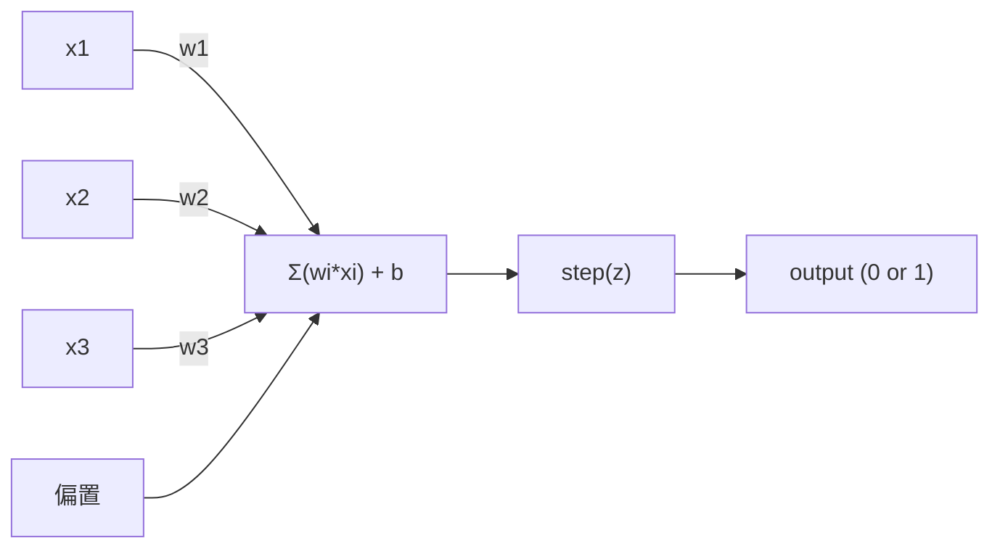
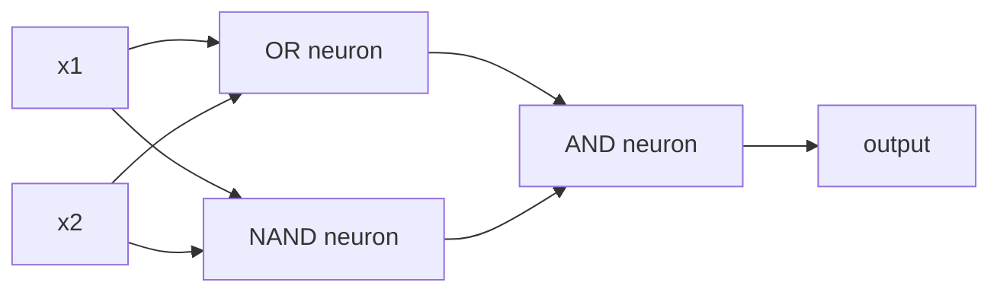

# 感知机

> The 感知机 is the atom of 神经网络s. Split it open and you find 权重s, a 偏置, and a decision.

**类型:** 实现
**语言:** Python
**Prerequisites:** Phase 1 (Linear Algebra Intuition)
**Time:** ~60 minutes

## 学习目标

- Implement a 感知机 from scratch in Python, including the 权重 update rule and step 激活函数
- Explain why a single 感知机 can only solve linearly separable problems and demonstrate the XOR failure case
- Construct a multi-层 感知机 by composing OR, NAND, and AND gates to solve XOR
- Train a two-层 network with sigmoid activation and 反向传播 to learn XOR automatically

## The Problem

You know vectors and dot products. You know that a matrix transforms inputs into outputs. But how does a machine *learn* which transformation to use?

The 感知机 answers this. It's the simplest possible learning machine: take some inputs, multiply by 权重s, add a 偏置, and make a binary decision. Then adjust. That's it. Every 神经网络 ever built is 层s of this idea stacked together.

Understanding the 感知机 means understanding what "learning" actually means in code: adjusting numbers until the output matches reality.

## The Concept

### One Neuron, One Decision

A 感知机 takes n inputs, multiplies each by a 权重, sums them up, adds a 偏置, and passes the result through an 激活函数.



The step function is brutal: if the 权重ed sum plus 偏置 is >= 0, output 1. Otherwise, output 0.

```
step(z) = 1  if z >= 0
           0  if z < 0
```

This is a linear classifier. The 权重s and 偏置 define a line (or hyperplane in higher dimensions) that splits the input space into two regions.

### The Decision Boundary

For two inputs, the 感知机 draws a line through 2D space:

```
  x2
  ┤
  │  Class 1        /
  │    (0)          /
  │                /
  │               / w1·x1 + w2·x2 + b = 0
  │              /
  │             /     Class 2
  │            /        (1)
  ┼───────────/──────────── x1
```

Everything on one side of the line outputs 0. Everything on the other side outputs 1. Training moves this line until it correctly separates the classes.

### The Learning Rule

The 感知机 learning rule is simple:

```
For each training example (x, y_true):
    y_pred = predict(x)
    error = y_true - y_pred

    For each 权重:
        w_i = w_i + learning_rate * error * x_i
    偏置 = 偏置 + learning_rate * error
```

If the prediction is correct, error = 0, nothing changes. If it predicts 0 but should be 1, 权重s increase. If it predicts 1 but should be 0, 权重s decrease. The 学习率 controls how big each adjustment is.

### The XOR Problem

Here's where it breaks. Look at these logic gates:

```
AND gate:           OR gate:            XOR gate:
x1  x2  out         x1  x2  out         x1  x2  out
0   0   0           0   0   0           0   0   0
0   1   0           0   1   1           0   1   1
1   0   0           1   0   1           1   0   1
1   1   1           1   1   1           1   1   0
```

AND and OR are linearly separable: you can draw a single line to separate the 0s from the 1s. XOR is not. No single line can separate [0,1] and [1,0] from [0,0] and [1,1].

```
AND (separable):        XOR (not separable):

  x2                      x2
  1 ┤  0     1            1 ┤  1     0
    │     /                 │
  0 ┤  0 / 0              0 ┤  0     1
    ┼──/──────── x1         ┼──────────── x1
       line works!          no single line works!
```

This is a fundamental limit. A single 感知机 can only solve linearly separable problems. Minsky and Papert proved this in 1969 and it nearly killed 神经网络 research for a decade.

The fix: stack 感知机s into 层s. A multi-层 感知机 can solve XOR by combining two linear decisions into a nonlinear one.

## Build It

### Step 1: The 感知机 class

```python
class 感知机:
    def __init__(self, n_inputs, learning_rate=0.1):
        self.权重s = [0.0] * n_inputs
        self.偏置 = 0.0
        self.lr = learning_rate

    def predict(self, inputs):
        total = sum(w * x for w, x in zip(self.权重s, inputs))
        total += self.偏置
        return 1 if total >= 0 else 0

    def train(self, training_data, epochs=100):
        for epoch in range(epochs):
            errors = 0
            for inputs, target in training_data:
                prediction = self.predict(inputs)
                error = target - prediction
                if error != 0:
                    errors += 1
                    for i in range(len(self.权重s)):
                        self.权重s[i] += self.lr * error * inputs[i]
                    self.偏置 += self.lr * error
            if errors == 0:
                print(f"Converged at epoch {epoch + 1}")
                return
        print(f"Did not converge after {epochs} epochs")
```

### Step 2: Train on logic gates

```python
and_data = [
    ([0, 0], 0),
    ([0, 1], 0),
    ([1, 0], 0),
    ([1, 1], 1),
]

or_data = [
    ([0, 0], 0),
    ([0, 1], 1),
    ([1, 0], 1),
    ([1, 1], 1),
]

not_data = [
    ([0], 1),
    ([1], 0),
]

print("=== AND Gate ===")
p_and = 感知机(2)
p_and.train(and_data)
for inputs, _ in and_data:
    print(f"  {inputs} -> {p_and.predict(inputs)}")

print("\n=== OR Gate ===")
p_or = 感知机(2)
p_or.train(or_data)
for inputs, _ in or_data:
    print(f"  {inputs} -> {p_or.predict(inputs)}")

print("\n=== NOT Gate ===")
p_not = 感知机(1)
p_not.train(not_data)
for inputs, _ in not_data:
    print(f"  {inputs} -> {p_not.predict(inputs)}")
```

### Step 3: Watch XOR fail

```python
xor_data = [
    ([0, 0], 0),
    ([0, 1], 1),
    ([1, 0], 1),
    ([1, 1], 0),
]

print("\n=== XOR Gate (single 感知机) ===")
p_xor = 感知机(2)
p_xor.train(xor_data, epochs=1000)
for inputs, expected in xor_data:
    result = p_xor.predict(inputs)
    status = "OK" if result == expected else "WRONG"
    print(f"  {inputs} -> {result} (expected {expected}) {status}")
```

It will never converge. This is the hard proof that a single 感知机 cannot learn XOR.

### Step 4: Solve XOR with two 层s

The trick: XOR = (x1 OR x2) AND NOT (x1 AND x2). Combine three 感知机s:



```python
def xor_network(x1, x2):
    or_neuron = 感知机(2)
    or_neuron.权重s = [1.0, 1.0]
    or_neuron.偏置 = -0.5

    nand_neuron = 感知机(2)
    nand_neuron.权重s = [-1.0, -1.0]
    nand_neuron.偏置 = 1.5

    and_neuron = 感知机(2)
    and_neuron.权重s = [1.0, 1.0]
    and_neuron.偏置 = -1.5

    hidden1 = or_neuron.predict([x1, x2])
    hidden2 = nand_neuron.predict([x1, x2])
    output = and_neuron.predict([hidden1, hidden2])
    return output


print("\n=== XOR Gate (multi-层 network) ===")
for inputs, expected in xor_data:
    result = xor_network(inputs[0], inputs[1])
    print(f"  {inputs} -> {result} (expected {expected})")
```

All four cases correct. Stacking 感知机s into 层s creates decision boundaries that no single 感知机 can produce.

### Step 5: Train a Two-层 Network

Step 4 hand-wired the 权重s. That works for XOR, but not for real problems where you don't know the right 权重s in advance. The fix: replace the step function with sigmoid and learn the 权重s automatically through 反向传播.

```python
class Two层Network:
    def __init__(self, learning_rate=0.5):
        import random
        random.seed(0)
        self.w_hidden = [[random.uniform(-1, 1), random.uniform(-1, 1)] for _ in range(2)]
        self.b_hidden = [random.uniform(-1, 1), random.uniform(-1, 1)]
        self.w_output = [random.uniform(-1, 1), random.uniform(-1, 1)]
        self.b_output = random.uniform(-1, 1)
        self.lr = learning_rate

    def sigmoid(self, x):
        import math
        x = max(-500, min(500, x))
        return 1.0 / (1.0 + math.exp(-x))

    def forward(self, inputs):
        self.inputs = inputs
        self.hidden_outputs = []
        for i in range(2):
            z = sum(w * x for w, x in zip(self.w_hidden[i], inputs)) + self.b_hidden[i]
            self.hidden_outputs.append(self.sigmoid(z))
        z_out = sum(w * h for w, h in zip(self.w_output, self.hidden_outputs)) + self.b_output
        self.output = self.sigmoid(z_out)
        return self.output

    def train(self, training_data, epochs=10000):
        for epoch in range(epochs):
            total_error = 0
            for inputs, target in training_data:
                output = self.forward(inputs)
                error = target - output
                total_error += error ** 2

                d_output = error * output * (1 - output)

                saved_w_output = self.w_output[:]
                hidden_deltas = []
                for i in range(2):
                    h = self.hidden_outputs[i]
                    hd = d_output * saved_w_output[i] * h * (1 - h)
                    hidden_deltas.append(hd)

                for i in range(2):
                    self.w_output[i] += self.lr * d_output * self.hidden_outputs[i]
                self.b_output += self.lr * d_output

                for i in range(2):
                    for j in range(len(inputs)):
                        self.w_hidden[i][j] += self.lr * hidden_deltas[i] * inputs[j]
                    self.b_hidden[i] += self.lr * hidden_deltas[i]
```

```python
net = Two层Network(learning_rate=2.0)
net.train(xor_data, epochs=10000)
for inputs, expected in xor_data:
    result = net.forward(inputs)
    predicted = 1 if result >= 0.5 else 0
    print(f"  {inputs} -> {result:.4f} (rounded: {predicted}, expected {expected})")
```

Two key differences from Step 4. First, sigmoid replaces the step function -- it's smooth, so 梯度s exist. Second, the `train` method propagates error backward from output to hidden 层, adjusting every 权重 proportionally to its contribution to the error. That's 反向传播 in 20 lines.

This is the bridge to Lesson 03. The math behind `d_output` and `hidden_deltas` is the 链式法则 applied to the network graph. We'll derive it properly there.

## Use It

Everything you just built from scratch exists in one import:

```python
from sklearn.linear_model import 感知机 as Sk感知机
import numpy as np

X = np.array([[0,0],[0,1],[1,0],[1,1]])
y = np.array([0, 0, 0, 1])

clf = Sk感知机(max_iter=100, tol=1e-3)
clf.fit(X, y)
print([clf.predict([x])[0] for x in X])
```

Five lines. Your 30-line `感知机` class does the same thing. The sklearn version adds 收敛 checks, multiple 损失函数s, and sparse input support -- but the core loop is identical: 权重ed sum, step function, 权重 update on error.

The real gap shows up at scale. What changes in production networks:

- The step function becomes sigmoid, ReLU, or other smooth activations
- 权重s are learned automatically via 反向传播 (Lesson 03)
- 层s get deeper: 3, 10, 100+ 层s
- The same principle holds: each 层 creates new features from the previous 层's outputs

A single 感知机 can only draw straight lines. Stack them, and you can draw any shape.

## Ship It

This lesson produces:
- `outputs/skill-感知机.md` - a skill covering when single-层 vs multi-层 architectures are needed

## Exercises

1. Train a 感知机 on a NAND gate (the universal gate - any logic circuit can be built from NAND). Verify its 权重s and 偏置 form a valid decision boundary.
2. Modify the 感知机 class to track the decision boundary (w1*x1 + w2*x2 + b = 0) at each epoch. Print how the line shifts during training on the AND gate.
3. Build a 3-input 感知机 that outputs 1 only when at least 2 of the 3 inputs are 1 (a majority vote function). Is this linearly separable? Why?

## Key Terms

| Term | What people say | What it actually means |
|------|----------------|----------------------|
| 感知机 | "A fake neuron" | A linear classifier: dot product of inputs and 权重s, plus 偏置, through a step function |
| 权重 | "How important an input is" | A multiplier that scales each input's contribution to the decision |
| 偏置 | "The threshold" | A constant that shifts the decision boundary, letting the 感知机 fire even with zero inputs |
| Activation function | "The thing that squishes values" | A function applied after the 权重ed sum - step function for 感知机s, sigmoid/ReLU for modern networks |
| Linearly separable | "You can draw a line between them" | A dataset where a single hyperplane can perfectly separate the classes |
| XOR problem | "The thing 感知机s can't do" | Proof that single-层 networks cannot learn non-linearly-separable functions |
| Decision boundary | "Where the classifier switches" | The hyperplane w*x + b = 0 that divides input space into two classes |
| Multi-层 感知机 | "A real 神经网络" | 感知机s stacked in 层s, where each 层's output feeds the next 层's input |

## Further Reading

- Frank Rosenblatt, "The 感知机: A Probabilistic Model for Information Storage and Organization in the Brain" (1958) -- the original paper that started it all
- Minsky & Papert, "感知机s" (1969) -- the book that proved XOR was unsolvable by single-层 networks and killed 感知机 research for a decade
- Michael Nielsen, "神经网络s and 深度学习", Chapter 1 (http://neuralnetworksanddeeplearning.com/) -- free online, best visual explanation of how 感知机s compose into networks
