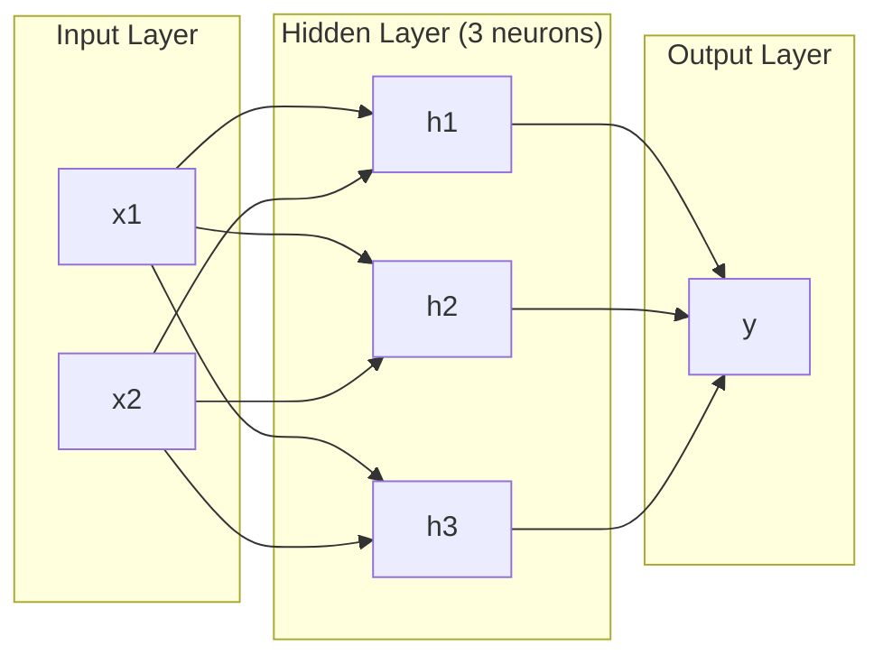
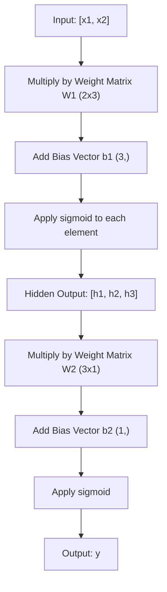
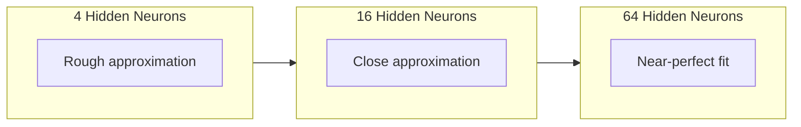

# Multi-层 Networks 和 Forward Pass

> One 神经元 draws line. Stack them, 和 you can draw anything.

**Type:** Build
**Languages:** Python
**Prerequisites:** Phase 01 (Math Foundations), Lesson 03.01 ( 感知机)
**Time:** ~90 minutes

## Learning Objectives

- Build multi-层 network 从 scratch 使用 层 和 Network classes perform complete forward pass
- Trace 矩阵 dimensions through each 层 的 network 和 identify shape mismatches
- Explain how stacking nonlinear activations enables network 到 learn curved decision boundaries
- Solve XOR problem using 2-2-1 architecture 使用 hand-tuned sigmoid 权重

## Problem

single 神经元 是 line drawer. That's it. One straight line through your 数据. Every real problem 在 AI -- image recognition, language understanding, playing Go -- requires curves. Stacking 神经元 into 层 是 how you get curves.

In 1969, Minsky 和 Papert proved 这个 limitation was fatal: single-层 network cannot learn XOR. Not "struggles 到 learn" -- mathematically cannot. XOR truth table places [0,1] 和 [1,0] 在 one side, [0,0] 和 [1,1] 在 other. No single line separates them.

This killed 神经网络 funding 为了 over decade. fix was obvious 在 hindsight: stop using one 层. Stack 神经元 into 层. Let first 层 carve 输入 space into new 特征, 和 let second 层 combine 那些 特征 into decisions no single line could make.

That stack 是 multi-层 network. 它是 foundation 的 every deep learning 模型 在 production today. forward pass -- 数据 flowing 从 输入 through hidden 层 到 输出 -- 是 first thing you need 到 build before anything else works.

## Concept

### Layers: 输入, Hidden, 输出

multi-层 network has three types 的 层:

**输入 层** -- not really 层. It holds your raw 数据. Two 特征 means two 输入 节点. No computation happens here.

**Hidden 层** -- where work happens. Each 神经元 takes every 输出 从 previous 层, applies 权重 和 偏置, then passes result through 激活函数. "Hidden" because you never see 这些 values directly 在 训练 数据.

**输出 层** -- final answer. For binary 分类, one 神经元 使用 sigmoid. For multi-class, one 神经元 per class.



这是 2-3-1 network. Two 输入, three hidden 神经元, one 输出. Every connection carries 权重. Every 神经元 (except 输入) carries 偏置.

Each 层 produces 向量 的 numbers called hidden state. For text, hidden states increase dimensionality -- encoding word 作为 768 numbers 到 capture semantic meaning. For images, they reduce dimensionality -- compressing millions 的 pixels into manageable representation. hidden state 是 where learning lives.

### Neurons 和 Activations

Each 神经元 does three things:

1. Multiply every 输入 通过 its corresponding 权重
2. Sum all products 和 add 偏置
3. Pass sum through 激活函数

For now, activation 是 sigmoid:

```
sigmoid(z) = 1 / (1 + e^(-z))
```

Sigmoid squashes any number into range (0, 1). Large positive 输入 push toward 1. Large negative 输入 push toward 0. Zero maps 到 0.5. This smooth curve 是 what makes learning possible -- unlike 感知机's hard step, sigmoid has gradient everywhere.

### Forward Pass: How 数据 Flows

forward pass pushes 输入 数据 through network, 层 通过 层, until it reaches 输出. No learning happens during forward pass. 它是 pure computation: multiply, add, activate, repeat.



At each 层, three operations happen 在 sequence:

```
z = W * input + b       (linear transformation)
a = sigmoid(z)           (activation)
```

输出 的 one 层 becomes 输入 到 next. 那是 entire forward pass.

### 矩阵 Dimensions

Tracking dimensions 是 single most important debugging skill 在 deep learning. Here 是 2-3-1 network:

| Step | Operation | Dimensions | Result Shape |
|------|-----------|------------|-------------|
| 输入 | x | -- | (2,) |
| Hidden linear | W1 * x + b1 | W1: (3, 2), b1: (3,) | (3,) |
| Hidden activation | sigmoid(z1) | -- | (3,) |
| 输出 linear | W2 * h + b2 | W2: (1, 3), b2: (1,) | (1,) |
| 输出 activation | sigmoid(z2) | -- | (1,) |

rule: 权重 矩阵 W 在 层 k has shape (neurons_in_layer_k, neurons_in_layer_k_minus_1). Rows match current 层. Columns match previous 层. If shapes do not line up, you have bug.

### Universal Approximation Theorem

In 1989, George Cybenko proved something remarkable: 神经网络 使用 single hidden 层 和 enough 神经元 can approximate any continuous 函数 到 any desired 准确率.

This does not mean one hidden 层 是 always best. It means architecture 是 theoretically capable. In practice, deeper networks (more 层, fewer 神经元 per 层) learn same 函数 使用 far fewer total 参数 than shallow-wide networks. 那是 why deep learning works.

intuition: each 神经元 在 hidden 层 learns one "bump" 或 特征. Enough bumps placed 在 right locations can approximate any smooth curve. More 神经元, more bumps, better approximation.



### Composability

Neural networks 是 composable. 你可以 stack them, chain them, run them 在 parallel. Whisper 模型 uses encoder network 到 process audio 和 separate decoder network 到 generate text. Modern LLMs 是 decoder-only. BERT 是 encoder-only. T5 是 encoder-decoder. architecture choice defines what 模型 can do.

## Build It

Pure Python. No numpy. Every 矩阵 operation written 从 scratch.

### Step 1: Sigmoid Activation

```python
import math

def sigmoid(x):
    x = max(-500.0, min(500.0, x))
    return 1.0 / (1.0 + math.exp(-x))
```

clamp 到 [-500, 500] prevents overflow. `math.exp(500)` 是 large but finite. `math.exp(1000)` 是 infinity.

### Step 2: 层 Class

most important operation 在 all 的 deep learning 是 矩阵 multiplication. Every 层, every attention head, every forward pass -- it's matmuls all way down. linear 层 takes 输入 向量, multiplies it 通过 权重 矩阵, 和 adds 偏置 向量: y = Wx + b. That single equation 是 90% 的 compute 在 神经网络.

层 holds 权重 矩阵 和 偏置 向量. Its forward method takes 输入 向量 和 returns activated 输出.

```python
class Layer:
    def __init__(self, n_inputs, n_neurons, weights=None, biases=None):
        if weights is not None:
            self.weights = weights
        else:
            import random
            self.weights = [
                [random.uniform(-1, 1) for _ in range(n_inputs)]
                for _ in range(n_neurons)
            ]
        if biases is not None:
            self.biases = biases
        else:
            self.biases = [0.0] * n_neurons

    def forward(self, inputs):
        self.last_input = inputs
        self.last_output = []
        for neuron_idx in range(len(self.weights)):
            z = sum(
                w * x for w, x in zip(self.weights[neuron_idx], inputs)
            )
            z += self.biases[neuron_idx]
            self.last_output.append(sigmoid(z))
        return self.last_output
```

权重 矩阵 has shape (n_neurons, n_inputs). Each row 是 one 神经元's 权重 across all 输入. forward method loops through 神经元, computes weighted sum plus 偏置, applies sigmoid, 和 collects results.

### Step 3: Network Class

network 是 list 的 层. forward pass chains them: 输出 的 层 k feeds into 层 k+1.

```python
class Network:
    def __init__(self, layers):
        self.layers = layers

    def forward(self, inputs):
        current = inputs
        for layer in self.layers:
            current = layer.forward(current)
        return current
```

那是 entire forward pass. Four lines 的 logic. 数据 goes 在, flows through every 层, comes out other side.

### Step 4: XOR 使用 Hand-Tuned Weights

In Lesson 01, we solved XOR 通过 combining OR, NAND, 和 AND perceptrons. Now do same thing 使用 our 层 和 Network classes. 2-2-1 architecture: two 输入, two hidden 神经元, one 输出.

```python
hidden = Layer(
    n_inputs=2,
    n_neurons=2,
    weights=[[20.0, 20.0], [-20.0, -20.0]],
    biases=[-10.0, 30.0],
)

output = Layer(
    n_inputs=2,
    n_neurons=1,
    weights=[[20.0, 20.0]],
    biases=[-30.0],
)

xor_net = Network([hidden, output])

xor_data = [
    ([0, 0], 0),
    ([0, 1], 1),
    ([1, 0], 1),
    ([1, 1], 0),
]

for inputs, expected in xor_data:
    result = xor_net.forward(inputs)
    predicted = 1 if result[0] >= 0.5 else 0
    print(f"  {inputs} -> {result[0]:.6f} (rounded: {predicted}, expected: {expected})")
```

large 权重 (20, -20) make sigmoid act like step 函数. first hidden 神经元 approximates OR. second approximates NAND. 输出 神经元 combines them into AND, which 是 XOR.

### Step 5: Circle 分类

harder problem: classify 2D points 作为 inside 或 outside circle 的 radius 0.5 centered 在 origin. This requires curved decision boundary -- impossible 为了 single 感知机.

```python
import random
import math

random.seed(42)

data = []
for _ in range(200):
    x = random.uniform(-1, 1)
    y = random.uniform(-1, 1)
    label = 1 if (x * x + y * y) < 0.25 else 0
    data.append(([x, y], label))

circle_net = Network([
    Layer(n_inputs=2, n_neurons=8),
    Layer(n_inputs=8, n_neurons=1),
])
```

With random 权重, network will not classify well. But forward pass still runs. 这是 point -- forward pass 是 just computation. Learning right 权重 是 反向传播, coming 在 Lesson 03.

```python
correct = 0
for inputs, expected in data:
    result = circle_net.forward(inputs)
    predicted = 1 if result[0] >= 0.5 else 0
    if predicted == expected:
        correct += 1

print(f"Accuracy with random weights: {correct}/{len(data)} ({100*correct/len(data):.1f}%)")
```

Random 权重 give poor 准确率 -- often worse than guessing majority class. After 训练 (Lesson 03), 这个 same architecture 使用 8 hidden 神经元 will draw curved boundary separates inside 从 outside.

## Use It

PyTorch does everything above 在 four lines:

```python
import torch
import torch.nn as nn

model = nn.Sequential(
    nn.Linear(2, 8),
    nn.Sigmoid(),
    nn.Linear(8, 1),
    nn.Sigmoid(),
)

x = torch.tensor([[0.0, 0.0], [0.0, 1.0], [1.0, 0.0], [1.0, 1.0]])
output = model(x)
print(output)
```

`nn.Linear(2, 8)` 是 your 层 class: 权重 矩阵 的 shape (8, 2), 偏置 向量 的 shape (8,). `nn.Sigmoid()` 是 your sigmoid 函数 applied element-wise. `nn.Sequential` 是 your Network class: chain 层 在 order.

difference 是 speed 和 scale. PyTorch runs 在 GPUs, handles 批次 的 millions 的 samples, 和 automatically computes gradients 为了 反向传播. But forward pass logic 是 identical 到 what you just built 从 scratch.

## Ship It

This lesson produces reusable prompt 为了 designing network architectures:

- `输出/prompt-network-architect.md`

Use it when you need 到 decide how many 层, how many 神经元 per 层, 和 which activation 函数 到 use 为了 given problem.

## Exercises

1. Build 2-4-2-1 network (two hidden 层) 和 run forward pass 在 XOR 数据 使用 random 权重. Print intermediate hidden 层 输出 到 see how representation transforms 在 each 层.

2. Change hidden 层 size 在 circle classifier 从 8 到 2, then 到 32. Run forward pass 使用 random 权重 each time. Does number 的 hidden 神经元 change 输出 range 或 distribution? Why?

3. Implement `count_parameters` method 在 Network class returns total number 的 trainable 权重 和 偏置. Test it 在 784-256-128-10 network ( classic MNIST architecture). How many 参数 does it have?

4. Build forward pass 为了 3-4-4-2 network. Feed it RGB color values (normalized 到 0-1) 和 observe two 输出. 这是 architecture 为了 simple color classifier 使用 two classes.

5. Replace sigmoid 使用 "leaky step" 函数: return 0.01 * z if z < 0, else 1.0. Run forward pass 在 XOR 使用 same hand-tuned 权重 从 Step 4. Does it still work? Why 是 smooth sigmoid preferred over hard cutoffs?

## Key Terms

| Term | What people say | What it actually means |
|------|----------------|----------------------|
| Forward pass | "Running 模型" | Pushing 输入 through every 层 -- multiply 通过 权重, add 偏置, activate -- 到 produce 输出 |
| Hidden 层 | " middle part" | Any 层 between 输入 和 输出 whose values 是 not directly observed 在 数据 |
| Multi-层 network | " deep 神经网络" | Layers 的 神经元 stacked sequentially, where each 层's 输出 feeds next 层's 输入 |
| Activation 函数 | " nonlinearity" | 函数 applied after linear transformation introduces curves into decision boundary |
| Sigmoid | " S-curve" | sigma(z) = 1/(1+e^(-z)), squashes any real number 到 (0,1), smooth 和 differentiable everywhere |
| 权重 矩阵 | " 参数" | 矩阵 W 的 shape (current_layer_neurons, previous_layer_neurons) containing learnable connection strengths |
| 偏置 向量 | " offset" | 向量 added after 矩阵 multiply lets 神经元 activate even when all 输入 是 zero |
| Universal approximation | "Neural nets can learn anything" | single hidden 层 使用 enough 神经元 can approximate any continuous 函数 -- but "enough" can mean billions |
| Linear transformation | " 矩阵 multiply step" | z = W * x + b, computation before activation, which maps 输入 到 new space |
| Decision boundary | "Where classifier switches" | surface 在 输入 space where network 输出 crosses 分类 threshold |

## Further Reading

- Michael Nielsen, "Neural Networks 和 Deep Learning", Chapter 1-2 (http://neuralnetworksanddeeplearning.com/) -- clearest free explanation 的 forward passes 和 network structure, 使用 interactive visualizations
- Cybenko, "Approximation 通过 Superpositions 的 Sigmoidal 函数" (1989) -- original universal approximation theorem paper, surprisingly readable
- 3Blue1Brown, "But what 是 神经网络?" (https://www.youtube.com/watch?v=aircAruvnKk) -- 20-minute visual walkthrough 的 层, 权重, 和 forward passes builds right mental 模型
- Goodfellow, Bengio, Courville, "Deep Learning", Chapter 6 (https://www.deeplearningbook.org/) -- standard reference 为了 multi-层 networks, free online
